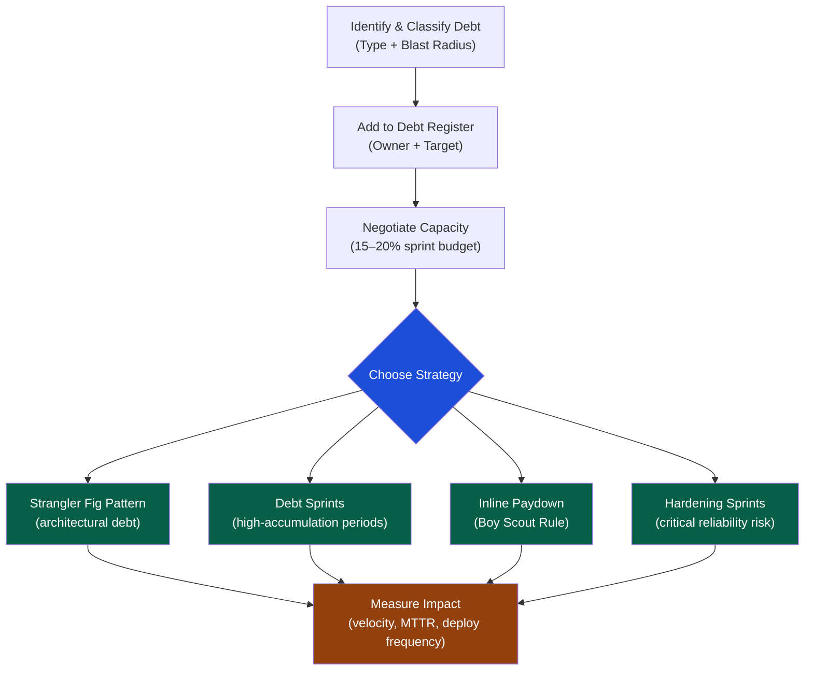

# Technical Debt Management

> [!abstract] TL;DR
> Technical debt is the implied cost of rework caused by choosing a fast, easy solution now instead of a better approach that would take longer. It is not inherently bad — deliberate, prudent debt is a legitimate business tool. The EM's job is to make debt visible (debt register), classify it by type and severity, negotiate capacity to pay it down, and communicate its business impact to stakeholders in cost and risk terms rather than technical jargon.

## The Debt Taxonomy

There are four distinct debt types, each with a different cause, risk profile, and remediation approach.

| Debt Type | Definition | Example | Typical Cause |
|---|---|---|---|
| **Code Debt** | Implementation shortcuts in working code | Copy-paste logic across 12 files; magic numbers | Time pressure, missing code review |
| **Design Debt** | Poor module boundaries, tangled dependencies | God class with 4000 lines; circular imports | Lack of upfront design, feature accretion |
| **Architecture Debt** | System-level structural mismatches | Monolith blocking independent scaling; missing message queue | Outgrown MVP architecture |
| **Test Debt** | Insufficient, slow, or absent automated tests | 20% coverage; all tests are E2E; zero mutation testing | "We'll add tests later" culture |

Each type compounds at a different rate. Architecture debt is the most expensive to carry and the most expensive to remediate — it has blast-radius effects across every other type.

### The Cunningham-McConnell Debt Quadrant

|  | **Deliberate** | **Inadvertent** |
|---|---|---|
| **Prudent** | "We'll refactor after launch" — conscious shortcut, documented plan | "Now we understand the domain and see the better design" — learning-driven insight |
| **Reckless** | "No time for proper design" — knowingly bypassing engineering discipline | "What's separation of concerns?" — skill gap or ignorance |

**Only Prudent-Deliberate debt is a legitimate business choice.** All other types represent unmanaged risk or avoidable engineering failure.

## Quantifying Debt

Making debt visible requires translating it from engineering language into business language. Three approaches:

### 1. Developer-Hours Method
Estimate the cost to remediate and the cost of carrying the debt per sprint.

```
Debt Item: No retry logic on payment webhook
Remediation cost: 3 engineer-days
Carrying cost: 2 engineer-hours/sprint debugging payment failures
Break-even: Remediation pays back in 1.5 sprints
```

### 2. Blast Radius Scoring

| Dimension | Score (1–5) | Description |
|---|---|---|
| **Velocity drag** | 1–5 | How much does this slow feature development per sprint? |
| **Reliability risk** | 1–5 | Probability of causing an incident in the next quarter |
| **Spreading factor** | 1–5 | Does this debt contaminate adjacent systems? |
| **Remediation cost** | 1–5 | 1 = hours; 5 = quarters |

`Debt Priority Score = (Velocity drag + Reliability risk + Spreading factor) / Remediation cost`

Higher scores should be addressed first.

### 3. The Technical Debt Ratio (TDR)

```
TDR = Remediation Cost / Development Cost of the System × 100%

TDR < 5%   → Healthy — manageable with ongoing hygiene
TDR 5–20%  → Elevated — reserve 20% capacity for paydown
TDR > 20%  → Critical — debt is actively hindering delivery; escalate
```

## The Debt Register

Every debt item must be visible, owned, and dated. An informal spreadsheet beats an absent list.

```markdown
## Debt Register — Team Payments — Q3 2026

| ID | Item | Type | Blast Radius | Effort | Owner | Target | Status |
|---|---|---|---|---|---|---|---|
| D-001 | No retry on payment webhook | Code | High (revenue) | S (2d) | Alice | Q3 | In progress |
| D-002 | God class: OrderService (3800 LOC) | Design | High (velocity) | L (4w) | Bob | Q4 | Backlog |
| D-003 | Direct DB calls in 12 API handlers | Architecture | High (reliability) | M (1w) | Carol | Q3 | Backlog |
| D-004 | 18% test coverage in checkout | Test | Medium | M (2w) | Dave | Q3 | In progress |
| D-005 | XML parser: no schema validation | Code | Low | S (1d) | Eve | Q4 | Backlog |
```

**Rules for the register:**
- Every item has a named owner. Ownerless debt is an intent, not a commitment.
- Every item has a target quarter. Unscheduled debt grows because nobody pays it.
- Review the register in sprint planning. Debt that cannot be scheduled should trigger a stakeholder conversation, not silent accumulation.

## Debt Paydown Strategies



### Strategy Details

**Strangler Fig Pattern** — Build the new system alongside the old; route traffic incrementally; retire the old piece by piece. Best for architectural debt (monolith → services, legacy auth system). Never requires a big-bang rewrite.

**Debt Sprints** — Dedicate an entire sprint exclusively to debt reduction. Schedule at end-of-quarter when product pressure is lower. Requires explicit stakeholder buy-in ("we will ship zero new features this sprint").

**Inline Paydown (Boy Scout Rule)** — "Leave the code cleaner than you found it." Engineers improve adjacent code while working on a feature. Low overhead; compounds positively over time. Works best for code and test debt.

**Hardening Sprints** — Emergency debt paydown when reliability is unacceptable. Triggered by sustained incident rate, SLO breach, or customer escalation. Requires cross-team communication because it delays planned feature work.

### The 15–20% Budget Rule

Reserve 15–20% of sprint capacity for debt reduction in every sprint — not occasionally, not "when product allows." Product managers who understand that debt reduces velocity will agree; those who don't need the analogy below.

> **Analogy:** Technical debt is a credit card. The minimum payment (15–20% capacity) keeps the balance manageable. Missing payments means interest compounds — the same features take longer and longer to build. At some point the debt service overwhelms the ability to ship anything new.

## Getting Team Buy-In

Engineers often resist working on debt they did not create. Common resistance patterns:

| Resistance | Root Cause | Response |
|---|---|---|
| "This is boring work" | Low intrinsic motivation | Connect to pain they personally feel; track velocity gains post-remediation |
| "We'll just break it again" | Distrust that change is sustained | Commit to process changes (code review gates, coverage floors) alongside remediation |
| "PM will say no" | Previous bad experiences with stakeholder negotiations | Bring them to the conversation; don't negotiate on their behalf without data |
| "It's not in my area" | Ownership ambiguity | Assign explicit owners; rotate ownership fairly |

## Communicating Debt to Stakeholders

Executives do not care about code quality in the abstract. They care about **business risk, velocity, and cost**. Reframe:

| Engineering Language | Business Language |
|---|---|
| "Our auth module has no unit tests" | "We cannot safely modify authentication, which blocks the SSO feature planned for Q4" |
| "We have circular dependencies everywhere" | "Every deploy risks breaking unrelated features — our change failure rate is 3x industry average" |
| "The database layer has no connection pooling" | "Under current growth projections we will hit DB saturation at 150% of today's load, which is Q2 next year" |
| "We need a debt sprint" | "A two-week investment now prevents a six-month slowdown starting Q3, based on current velocity trends" |

**The Debt Narrative Template:**
```
Current state: [Specific metric showing the problem]
Business risk: [What happens if we don't act, and when]
Investment: [Capacity required to remediate]
Return: [Velocity or reliability improvement and timeline]
Risk of inaction: [Probability and cost of the worst case]
```

## Trade-Off Analysis

| Approach | Pros | Cons | Best For |
|---|---|---|---|
| **Continuous inline paydown** | No disruption; compounds gradually | Slow; may miss systemic issues | Code and test debt |
| **Dedicated debt sprints** | Focused; visible commitment | Lost feature velocity; requires PM negotiation | Design debt |
| **Big-bang rewrite** | Clean slate; exciting | Extremely high risk; months with no user value | Almost never — prefer Strangler Fig |
| **Strangler Fig** | Incremental risk; reversible | Long timeline; dual maintenance overhead | Architecture debt |
| **Ignore it** | Zero cost now | Interest compounds; velocity degrades; engineers leave | Never |

## Common Pitfalls

1. **Invisible debt** — Debt that lives only in engineers' heads is not being managed; it is being suffered. The register must exist.
2. **Debt without owners** — "The team" owns nothing. Every item needs a named engineer and a quarter target.
3. **Treating all debt as equal** — A 1-hour code smell and a 6-month architectural rework require different urgency and process.
4. **Over-communicating internally, under-communicating upward** — Stakeholders cannot prioritize debt they don't know exists, described in terms they don't understand.
5. **No re-measurement** — Pay down debt, then measure the velocity and reliability delta. Without measurement, you cannot justify the next investment.
6. **Using "tech debt" to mean "anything we dislike"** — Features that were always bad ideas are not debt. Reserve the term for deferred quality work to avoid diluting its urgency.

## Review Questions

1. A product manager says "we don't have time for debt reduction — every sprint is feature work." How would you make the case for a 20% debt budget using business terms?
2. Using the Cunningham-McConnell quadrant, classify: "We added a direct database call from the API handler because we needed to ship the dashboard feature by Friday." Is this acceptable debt?
3. An EM inherits a team with 8% test coverage and an MTTR of 6 hours. Which debt type should be addressed first, and why?
4. What is the Strangler Fig pattern and when is it preferable to a big-bang rewrite?

## Related Notes

- [[_MOC_Engineering_Leadership_Master|↑ Engineering Leadership MOC]]
- [[Technical_Leadership]]
- [[Delivery_and_Execution]]
- [[Engineering_Metrics_and_Health]]
- [[Technical_Roadmapping]]

#Engineering #Leadership #TechnicalDebt
