# Technical Roadmapping

> [!abstract] TL;DR
> A technical roadmap is a sequenced plan that communicates *what* engineering will invest in and *why*, across time horizons relevant to different audiences. The Now/Next/Later format is the most practical for most engineering teams: it is honest about uncertainty, easy to update, and naturally prompts dependency and sequencing conversations. Roadmaps serve two audiences simultaneously — the team (execution clarity) and stakeholders (investment transparency) — and must be maintained as living documents, not PowerPoint artifacts.

## Why Roadmaps Fail

Most engineering roadmaps fail for one of four reasons:

| Failure Mode | Symptom | Root Cause |
|---|---|---|
| **False precision** | Gantt charts with exact ship dates 12 months out | Confusing a wish with a plan; ignores uncertainty |
| **No sequencing rationale** | Items listed without explaining dependencies | Roadmap built by committee, not systems thinking |
| **Stakeholder mismatch** | Same document sent to engineers and executives | Different audiences need different levels of abstraction |
| **Set-and-forget** | Roadmap not updated when priorities shift | Treated as a deliverable, not a living plan |

## Horizon Planning: Now / Next / Later

The most durable roadmap format for engineering teams.

```mermaid
graph LR
    subgraph NOW["NOW — This Quarter"]
        N1["Auth Service\nJWT Migration"]
        N2["Test Coverage\n>60% → >80%"]
        N3["Database Connection\nPooling"]
    end

    subgraph NEXT["NEXT — Next 1–2 Quarters"]
        NX1["Orders Module\nDecomposition"]
        NX2["Event-Driven\nArchitecture Spike"]
        NX3["Observability\nStack (OTEL)"]
    end

    subgraph LATER["LATER — 3–6 Months Out"]
        L1["Multi-Region\nDeployment"]
        L2["Data Platform\nMigration"]
        L3["Self-Serve\nDeveloper Portal"]
    end

    NOW -->|"Dependencies resolved"| NEXT
    NEXT -->|"Platforms ready"| LATER

    classDef now fill:#065f46,color:#fff
    classDef next fill:#1d4ed8,color:#fff
    classDef later fill:#6b21a8,color:#fff
    class N1,N2,N3 now
    class NX1,NX2,NX3 next
    class L1,L2,L3 later
```



| Horizon | Confidence | Detail Level | Primary Audience |
|---|---|---|---|
| **Now** (current quarter) | High — committed | Story-level detail; named owners | Engineering team, PM, immediate stakeholders |
| **Next** (1–2 quarters) | Medium — directional | Initiative-level; no story detail | Product leadership, cross-team partners |
| **Later** (3–6 months) | Low — intent | Theme or capability level only | Executives, strategic planning |

The format is honest about uncertainty by design. Items in "Later" are placeholders that signal intent, not promises.

## Inputs to a Technical Roadmap

A roadmap without inputs is a wish list. The EM must synthesize from multiple sources:

```
┌─────────────────────────────────────────────────────────┐
│                   Roadmap Inputs                        │
│                                                         │
│  Product Roadmap ──────┐                                │
│  Tech Debt Register ───┤                                │
│  Incident Post-Mortems ┤──► EM Synthesis ──► Roadmap   │
│  Platform Dependencies ┤                                │
│  Compliance / Security ┤                                │
│  Skill Gap Analysis ───┘                                │
└─────────────────────────────────────────────────────────┘
```

**Checklist of roadmap inputs per quarter:**
- [ ] Tech debt register reviewed and blast-radius scored
- [ ] Product roadmap reviewed for technical pre-requisites
- [ ] DORA metrics and SLO health reviewed for reliability investments
- [ ] Cross-team dependency conversations completed (platform, data, security)
- [ ] Compliance calendar checked (GDPR audits, pen-test windows, certification renewals)
- [ ] Team capacity calculated (headcount × sprint capacity – planned leave – 20% debt budget)

## OKRs for Engineering

OKRs (Objectives and Key Results) give the roadmap a goal layer — they answer *why* each initiative exists.

### Structure

```
Objective: Ship a checkout experience that converts 3× faster under peak load
  KR1: P95 checkout latency < 300ms at 1000 RPS (baseline: 850ms)
  KR2: Change failure rate for checkout module < 1% (baseline: 4.2%)
  KR3: Checkout deploys independently of monolith (baseline: coupled)
```

### OKR Quality Checklist

| Property | Good Example | Bad Example |
|---|---|---|
| Objective is aspirational | "Ship a checkout experience that converts 3× faster under peak load" | "Improve checkout performance" |
| KR is measurable | "P95 < 300ms at 1000 RPS" | "Reduce latency" |
| KR has a baseline | "Baseline: 850ms" | No baseline specified |
| KR is binary or numeric | "Deploy independently of monolith (yes/no)" | "Work toward independence" |
| Outcome-focused | Latency metric, not "refactor checkout module" | Output-focused |

**Common failure:** OKRs that measure outputs (we completed 5 initiatives) rather than outcomes (checkout P95 improved by X%). The roadmap tracks outputs; OKRs measure outcomes.

## Sequencing Dependencies

Dependency management is the hardest part of roadmapping. A roadmap that ignores dependencies is fiction.

### Dependency Map Template

```markdown
## Q3 Dependencies

Initiative: Orders Module Decomposition
  Depends on: Auth Service JWT Migration (internal, Q2 → done)
  Depends on: Message Queue (Kafka) provisioned by Platform team (external, target Q2 Week 6)
  Blocks: Event-Driven Architecture Spike (Next horizon)
  Risk: Platform team has not confirmed Q2 Week 6 target — ESCALATE by Week 2

Initiative: Observability Stack (OpenTelemetry)
  Depends on: AWS managed OTEL collector approved by Security (external, pending)
  Blocks: Multi-Region Deployment readiness signal (Later horizon)
  Risk: Security approval timeline unknown — FLAG for weekly check-in
```

### Dependency Conversation Protocol

For every external dependency: identify the owner, get a written commitment (Slack thread or Jira), and set a re-evaluation trigger date. A dependency with no owner is a risk, not a plan.

## Roadmap Formats Compared

| Format | Best For | Weaknesses | Tools |
|---|---|---|---|
| **Now / Next / Later** | Most engineering teams; living, adaptable | Less useful for multi-team program coordination | Notion, Coda, Confluence |
| **Gantt Chart** | Detailed program plans with hard date dependencies | Misleading precision; expensive to maintain | Jira, MS Project, Smartsheet |
| **Theme Roadmap** | Communicating strategy to executives | No detail; can't drive execution | Productboard, Aha! |
| **OKR-Linked Roadmap** | Teams that have invested in OKR practice | Requires OKR discipline to be useful | Linear, Jira + Confluence |
| **Opportunity Backlog** | Exploration-heavy environments (early-stage) | Too fluid to communicate commitments | Notion, Miro |

### Gantt vs. Now/Next/Later

```
When to use Gantt:
  ✓ Hard regulatory deadline (audit, compliance, launch date)
  ✓ Multi-team program where parallel tracks have date dependencies
  ✓ External partners who need delivery dates for their own planning

When to use Now/Next/Later:
  ✓ Normal product engineering (always)
  ✓ When teams are autonomous and timelines are uncertain
  ✓ When the roadmap needs to be updated monthly without a rewrite
```

## Stakeholder Alignment

The roadmap serves different stakeholders with different needs. A single document cannot serve all of them — tailor the presentation layer.

| Audience | What They Need | Presentation Approach |
|---|---|---|
| **Engineering team** | Task-level clarity, dependency map, OKR alignment | Full register with owners, stories, blockers |
| **Product Manager** | Feature sequencing, technical pre-requisites, when tech initiatives create feature capacity | Horizon view tied to product themes |
| **Engineering Director / VP** | Quarterly commitments, risk flags, cross-team dependencies | 1-page: Now committed, Next directional, Later themes |
| **Executives / Board** | Annual strategic bets, capability investment rationale | 3–5 themes with business outcome rationale only |

### The Roadmap Review Cadence

| Cadence | Audience | What Changes |
|---|---|---|
| Weekly | Engineering team | Blockers, status of Now items |
| Monthly | PM + EM | Items graduating from Next to Now, emerging risks |
| Quarterly | Engineering leadership | Horizon shift: Later → Next → Now |
| Annually | Executives | Strategic themes and capability bets |

## Analogy: City Infrastructure Planning

A city does not build a freeway and a subway and a cycling network simultaneously. It sequences: first roads (Now), then transit corridors when density warrants it (Next), then integrated multimodal hubs when the network is mature (Later). The technical roadmap is the same: foundational work (reliability, observability, security) must precede features that depend on that foundation. Building the penthouse before the foundation is not ambition — it is project failure.

## Common Pitfalls

1. **Feature roadmap masquerading as a technical roadmap** — A technical roadmap includes reliability, security, performance, and debt investments, not just feature enablement. If all items are feature-adjacent, the roadmap is incomplete.
2. **No capacity calculation** — Roadmaps that do not account for team capacity produce over-commitment and missed quarters. Always calculate: `sprints × engineers × capacity_factor – debt_budget`.
3. **Treating Later as committed** — Later is intent, not commitment. Stakeholders who interpret it as a commitment will be disappointed every time the Later horizon shifts.
4. **No re-sequencing when assumptions change** — When a platform dependency slips, the downstream initiative must move or the team must find an alternative. The roadmap that does not update is lying.
5. **Roadmap without business rationale** — Every engineering investment must be explainable in terms of product outcomes or operational risk reduction. "We want to refactor this" is not a roadmap entry.

## Review Questions

1. A PM is demanding Gantt-level date commitments for a 6-month engineering roadmap. How do you explain why Now/Next/Later is more honest and ultimately more reliable?
2. An external platform team's dependency has slipped by 4 weeks. What immediate actions should appear in the roadmap, and how do you communicate the impact?
3. Draft an OKR for an engineering initiative to reduce deployment lead time from 3 days to under 2 hours. Include one objective and three measurable key results with baselines.
4. What are the five inputs an EM should gather before building a quarterly technical roadmap?

## Related Notes

- [[_MOC_Engineering_Leadership_Master|↑ Engineering Leadership MOC]]
- [[Technical_Leadership]]
- [[Technical_Debt_Management]]
- [[Delivery_and_Execution]]
- [[Product_Strategy]]
- [[Engineering_Metrics_and_Health]]

#Engineering #Leadership #Roadmap #OKR #Planning
