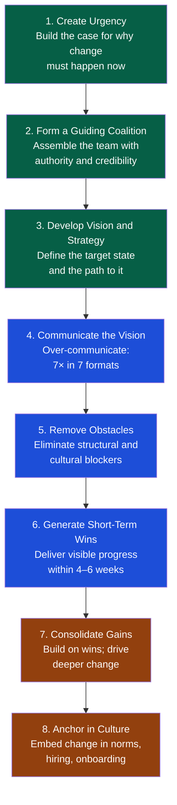

# Change Management

> [!abstract] TL;DR
> Most engineering changes fail not because of bad technology but because of poor change management — the human side of transition. Two frameworks dominate: Kotter's 8-Step model (top-down, sequential, best for large org changes) and ADKAR (individual-focused, can be applied bottom-up or top-down, best for diagnosing where resistance lives). The EM's job is to make the change feel inevitable and supported, identify resistance early, and manage communication cadence to prevent change fatigue.

## Why Engineering Changes Fail

Research across industries shows 60–70% of organizational change initiatives fail. In engineering, the failure modes are predictable:

| Failure Mode | Description | Prevention |
|---|---|---|
| **Insufficient urgency** | "Why change if current state works?" | Build the burning platform — quantify the cost of not changing |
| **No coalition** | One EM championing change without peer or executive support | Identify and activate formal and informal influencers before announcing |
| **Vague vision** | Engineers can't answer "what does done look like?" | Define the target state with success criteria before the change starts |
| **Under-communication** | Announcement + silence = rumors fill the vacuum | Over-communicate: say the same thing 7× in 7 different formats |
| **No early wins** | Change feels endless with no visible progress | Sequence work to deliver a visible result within 4–6 weeks |
| **Declaring victory too early** | Announcing success before new behaviors are embedded | Maintain momentum until the change is culturally normal |
| **Change fatigue** | Team is exhausted from overlapping changes | Sequence changes; protect recovery time between major transitions |

## Kotter's 8-Step Change Model

Developed at Harvard Business School; best suited for large organizational changes (reorgs, process overhauls, major technology migrations).



### Applying Kotter: Example — Migrating from Monolith to Microservices

| Step | Action |
|---|---|
| 1. Urgency | Show DORA metrics: deployment frequency 1×/month, MTTR 6 hours, feature cycle time 4 weeks. "At this pace we cannot serve 3× traffic projected by Q4." |
| 2. Coalition | EM + 2 staff engineers + CTO + head of Platform. Each brings a different constituency. |
| 3. Vision | "By Q4, the Payments module deploys independently with MTTR < 30 minutes. By end of year, three core modules are independent." |
| 4. Communicate | All-hands slide, team meeting, 1:1 for key skeptics, Slack post, architecture blog post. |
| 5. Remove obstacles | Remove requirement that all changes need monolith-wide regression. Create service template to eliminate setup friction. |
| 6. Short-term wins | First module extracted in 6 weeks. Share deployment frequency data: up from 4×/month to 12×/month for that service. |
| 7. Consolidate | Use first module as pattern. Train second team. |
| 8. Anchor | Update engineering principles doc. Make service template the standard. Reflect progress in quarterly planning. |

## ADKAR Model

ADKAR (Prosci) is an individual-level change model. It diagnoses *where* a specific person is blocked, rather than prescribing an organizational sequence.

| Stage | Question It Answers | If Stuck Here |
|---|---|---|
| **A — Awareness** | Does the person understand why change is needed? | Increase urgency communication; address specific "why now" objections |
| **D — Desire** | Does the person want to participate and support it? | Address personal impact (job security, role change, workload); listen to concerns |
| **K — Knowledge** | Does the person know how to change? | Provide training, documentation, pairing, sandbox environments |
| **A — Ability** | Can the person actually make the change? | Time, tools, coaching; practice opportunities; remove friction |
| **R — Reinforcement** | Are the new behaviors being sustained? | Celebrate adherence; measure and share progress; address relapses |

### ADKAR Diagnostic

Use this in 1:1s with engineers during a change initiative:

```
"I want to understand where you are with the migration to GitHub Actions.

Can you help me understand:
1. Do you understand why we're making this change? [Awareness]
2. Are you on board with making this change on our team? [Desire]
3. Do you know how to set up a new GitHub Actions workflow? [Knowledge]
4. Have you had a chance to actually do it yet? [Ability]
5. Is it sticking? Are you defaulting to GH Actions now or still going to Jenkins? [Reinforcement]"
```

The person's answer identifies the lowest unmet stage. That is where to intervene — not above it.

## Resistance Patterns

Resistance is not irrational. Engineers resist change when they have legitimate concerns that are not being addressed. Categorize before responding.

| Resistance Pattern | What It Sounds Like | Root Cause | Response |
|---|---|---|---|
| **Logical resistance** | "This approach doesn't solve the problem" | Genuine technical disagreement | Engage seriously; update the plan if they're right |
| **Psychological resistance** | "I've seen this fail before" | Past trauma or risk aversion | Acknowledge experience; show how this context differs |
| **Social resistance** | "My team doesn't want this" | Loyalty to peers, fear of peer judgment | Involve their peers in the design; create social permission |
| **Political resistance** | "This reduces my team's scope" | Loss of status, budget, influence | Address directly in private; involve their leadership if needed |
| **Capacity resistance** | "We don't have time for this" | Real workload constraints | Provide capacity — protect time from other demands |

**Never dismiss resistance as "being difficult."** Resistance is often the most accurate feedback the change process receives. The EM who ignores it is flying blind.

## Stakeholder Mapping

Before announcing a change, map everyone affected.

```
Stakeholder Map for: Adopting on-call rotation (previously engineers avoided on-call)

High Power, High Concern:      → VPs, directors — must convince early; risk blockers
  → CTO, VP Engineering        → Brief 1:1 before announcement

High Power, Low Concern:       → Keep informed; don't over-invest
  → Head of Finance            → Email update; mention cost impact

Low Power, High Concern:       → Target audience for change management
  → Engineers on-call          → Focus ADKAR here; 1:1s, training, tooling

Low Power, Low Concern:        → Inform, don't burden
  → External vendors           → Standard announcement
```

### Power-Interest Grid

```
HIGH POWER
     │ Keep Satisfied      │ Manage Closely
     │ (brief, update)     │ (co-create, advocate)
─────┼─────────────────────┼─────────────────────
     │ Monitor             │ Keep Informed
     │ (minimal effort)    │ (regular updates)
LOW POWER
     LOW INTEREST          HIGH INTEREST
```

## Communication Cadence for Change

| Phase | Frequency | Channels | Content |
|---|---|---|---|
| **Pre-announcement** | N/A | 1:1 with key stakeholders | Build coalition; address concerns before going wide |
| **Launch** | One-time | All-hands + email + Slack | Why, what, when, what it means for each person |
| **Transition** (months 1–3) | Weekly | Team meeting + Slack | Progress, early wins, obstacle removals, FAQ |
| **Steady-state** | Monthly | Team retro + metrics sharing | Reinforcement; celebrate adherence; track ADKAR |
| **Embedding** | Quarterly | Planning sessions | Integrate into hiring, onboarding, performance criteria |

**The 7-touches rule:** Research suggests people need to hear a message 7 times in different contexts before it lands. One announcement is not communication — it is a broadcast.

## Change Fatigue

Change fatigue occurs when teams are subjected to too many simultaneous or rapidly sequential changes without recovery time.

**Symptoms:**
- Low engagement in new initiative kickoffs
- "Here we go again" sentiment in retros
- Passive compliance rather than active buy-in
- Increased attrition among high performers

**Prevention:**
```
Change portfolio review (do this quarterly):
  Currently active changes on this team:
  [ ] Microservices migration (Q2–Q4)
  [ ] On-call rotation introduction (Q3)
  [ ] New sprint planning process (Q3)
  [ ] Manager change (Q3)

Three concurrent major changes: HIGH RISK for fatigue.
Action: Delay on-call rotation to Q4; sequence it after sprint process stabilizes.
```

**Recovery:**
- Explicitly protect "no change" periods (minimum 4–6 weeks after a major transition)
- Run a "stability sprint" — no process changes, focus on delivery and recovery
- Acknowledge fatigue directly in retros rather than ignoring it

## Trade-Off Analysis

| Approach | When to Use | Risk |
|---|---|---|
| **Top-down mandate** | Urgent compliance or safety change; no time for consensus | Compliance without commitment; resistance goes underground |
| **Bottom-up pilot** | Exploratory change with uncertain outcomes | Slow spread; may never reach critical mass |
| **Coalition-led** | Cultural or process change requiring peer legitimacy | Requires investing in coalition building before launching |
| **Incentivized adoption** | When desire is the ADKAR blocker | May create compliance rather than genuine behavior change |

## Common Pitfalls

1. **Announcing change without building urgency first** — People who don't understand "why now" will wait it out. Build the burning platform before the announcement.
2. **Using Kotter's model for individual-level resistance** — Kotter is organizational. For a single engineer who won't adopt the new process, use ADKAR.
3. **Skipping the stakeholder map** — The person you forgot to brief will become your loudest opponent.
4. **No short-term wins planned** — A change initiative with no visible progress in the first 4–6 weeks will start to decay regardless of leadership commitment.
5. **Overloading the team with simultaneous changes** — Count the active changes. More than 2–3 major concurrent changes almost always produces fatigue and failure.

## Review Questions

1. A team is resisting a mandatory migration to a new CI/CD platform. Using the ADKAR model, walk through how you would diagnose where each resistance is occurring and what intervention you would apply at each stage.
2. Using Kotter's 8-step model, plan the first four steps of a change initiative to introduce blameless post-mortems to a team with a strong blame culture.
3. A senior engineer says: "We tried this exact thing 2 years ago and it failed." How do you categorize this resistance and what is your response?
4. A team has four major changes active simultaneously. How do you assess the fatigue risk and what action do you take?

## Related Notes

- [[_MOC_Engineering_Leadership_Master|↑ Engineering Leadership MOC]]
- [[Communication_and_Influence]]
- [[Engineering_Organization_Design]]
- [[Team_Building_and_Culture]]
- [[People_Management]]

#Engineering #Leadership #ChangeManagement #Kotter #ADKAR
