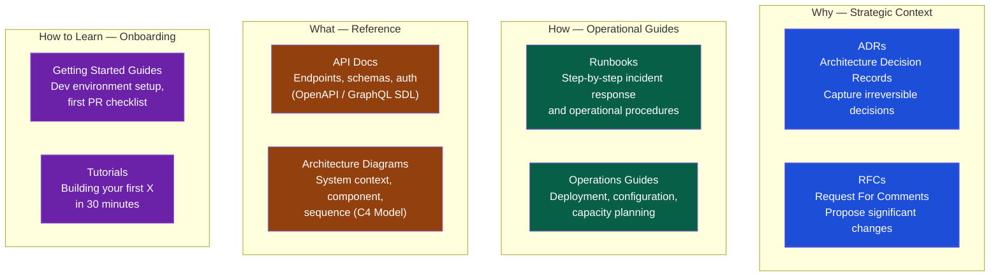

# Documentation Culture

> [!abstract] TL;DR
> Good documentation is not writing more — it is writing the right things, at the right level, in the right place, and maintaining them. The two highest-leverage document types in engineering are Architecture Decision Records (ADRs, which capture *why*) and runbooks (which capture *how to respond*). The docs-as-code philosophy — treating documentation like source code with version control, reviews, and automated publishing — is the most reliable way to keep documentation alive and trusted. The EM's job is to create a culture where documentation is a professional norm, not an afterthought.

## Why Documentation Fails

Most documentation debt has the same root causes:

| Root Cause | Symptom | Fix |
|---|---|---|
| **Written after the fact** | Stale before it's published; lacks context of the decision | Write ADRs during decision-making, not after deployment |
| **Wrong format for the audience** | Developers writing PhD theses for ops teams | Match document type and depth to the reader's job |
| **No home** | Documentation that lives in the wrong tool is documentation that's never found | Establish canonical homes and link everywhere |
| **No owner** | "Anyone" maintains it = nobody maintains it | Assign owners; trigger review on code change |
| **Punished as slow** | Teams skip docs under sprint pressure | Make documentation part of the Definition of Done |
| **No culture signal** | Leaders never reference or praise documentation | EM references docs in design reviews and 1:1s |

## The Documentation Taxonomy



## Architecture Decision Records (ADRs)

An ADR is a short, immutable record of a significant architectural decision and the context that made it correct at the time.

### When to Write an ADR

Write an ADR when any of these are true:
- The decision is difficult or expensive to reverse
- Reasonable engineers would disagree
- The decision constrains future design choices
- A new technology, framework, or vendor is introduced
- The team spent more than 2 hours in debate before deciding

**The smell test:** "If an engineer joined the team in 18 months and asked 'why did we do it this way?', would the answer live anywhere?" If not, write the ADR.

### ADR Template

```markdown
# ADR-0042: Use PostgreSQL Full-Text Search Instead of Elasticsearch

**Status:** Accepted
**Date:** 2026-06-14
**Deciders:** Carol (Staff Eng), Alice (EM), Dave (Platform Lead)
**Supersedes:** —
**Superseded by:** —

## Context
The product team requires full-text search across 2M customer records by Q3.
Options evaluated: Elasticsearch (managed), PostgreSQL FTS, Algolia (SaaS).
Constraints: Budget is limited; team has no Elasticsearch operational experience;
search volume is < 1000 queries/minute.

## Decision
Implement full-text search using PostgreSQL's built-in `tsvector` and `tsquery`.
Extend the existing RDS PostgreSQL 14 instance rather than operating a new service.

## Consequences
Positive:
  — No new service to operate, monitor, or pay for
  — Engineers already familiar with PostgreSQL
  — Satisfies < 1000 QPM load requirement with existing database tier

Negative:
  — FTS capabilities are limited compared to Elasticsearch (no fuzzy, no synonym expansion)
  — May require migration to Elasticsearch if search complexity grows significantly
  — All search load runs on the primary database (monitor connection pool usage)

Neutral:
  — New GIN indexes on customer table (~400MB estimated)
  — Search latency: estimated P95 < 80ms at current scale

## Alternatives Considered
| Alternative | Why Rejected |
|---|---|
| Elasticsearch (AWS OpenSearch) | Operational overhead; no team experience; overkill for current scale |
| Algolia | $800/month at current volume; vendor lock-in on search schema |
| Meilisearch | Small community; unclear enterprise support |
```

### ADR Lifecycle Rules

1. ADRs are **never deleted** — only deprecated or superseded with a link to the replacement.
2. ADRs live **in the repository** alongside the code they describe (`/docs/adr/`), not in Confluence.
3. ADRs have **sequential numbers** so they are easy to reference in PR descriptions.
4. **Anyone can propose** an ADR, but the EM or Staff engineer closes it (Accepted / Rejected).
5. The ADR is **linked in the PR** that implements the decision.

## RFCs (Requests for Comments)

An RFC is a document proposing a significant technical or process change, inviting structured comment before a decision is made. Different from an ADR: ADRs record decisions already made; RFCs drive the decision-making process.

### RFC Template

```markdown
# RFC-0017: Migrate Authentication to Stateless JWT

**Author:** Dave
**Status:** Open for comment (closes 2026-07-10)
**Decision Owner:** Alice (EM)

## Problem Statement
Current session-based auth requires a Redis cluster for session state, which:
  - Blocks horizontal scaling across regions
  - Is a single point of failure (Redis outage = all users logged out)
  - Adds 20ms latency per request for session lookup

## Proposed Solution
Migrate to stateless JWT tokens (RS256 signed).
Access tokens: 15-minute TTL
Refresh tokens: 7-day TTL, stored in HttpOnly cookies
Revocation: Maintain a small Redis blocklist for explicit revocations only (replaces full session store)

## Impact
  Breaking change: All active sessions invalidated on cutover
  Migration window: Parallel running for 2 weeks (old + new auth paths)
  Services affected: auth-service, api-gateway, 3 internal services consuming session tokens

## Open Questions
  1. Should refresh token rotation be implemented? (security vs. UX tradeoff)
  2. How do we handle the mobile client that cannot store HttpOnly cookies?
  3. What is the maximum acceptable outage window for the cutover?

## Alternatives Considered
  — Keep Redis sessions: does not solve scaling or latency problem
  — Opaque tokens with centralized validation: same scaling problem, different shape

## Comment Deadline: 2026-07-10
  Please comment in GitHub PR #1402.
  Decision will be published as ADR-0043.
```

### RFC Norms

- **Comment deadline is real** — An RFC open for 6 months is not a process; it is avoidance.
- **Anyone can comment; one person decides** — Consensus is valuable; committee decision-making is not.
- **RFC converts to ADR** — Once a decision is reached, the RFC is closed and an ADR is published. The RFC is archived, not deleted.

## Runbooks

Runbooks are operational playbooks for known failure modes, routine procedures, and on-call responses.

### Runbook Anatomy

```markdown
## RUNBOOK: Payment Webhook Retry Failure

**Alert**: `payment-webhook-failures > 5 in 10 minutes`
**Severity**: P2 (revenue risk)
**Owner**: Payments team (on-call rotation)
**Last tested**: 2026-06-01 (game day)

### What this alert means
Payment webhooks from Stripe are failing to process. This can cause orders to get stuck
in "pending" state and revenue to not be recognized. No customer-facing outage, but
revenue reporting will lag.

### Diagnosis (5 minutes)
1. Check payment service logs: `kubectl logs -n payments -l app=payment-svc --tail=100`
2. Look for: `ERROR: Stripe webhook signature verification failed` OR `ERROR: DB timeout`
3. Check Stripe dashboard: https://dashboard.stripe.com/events (are events being sent?)

### Remediation Paths

#### Path A: Signature Verification Failure
  Cause: Webhook signing secret rotated in Stripe but not updated in our config.
  Fix: Update secret in AWS Secrets Manager, then restart payment pods.
  Commands:
    aws secretsmanager put-secret-value \
      --secret-id prod/payments/stripe-webhook-secret \
      --secret-string "<new-value-from-stripe-dashboard>"
    kubectl rollout restart deployment/payment-svc -n payments
  Verify: Check logs — errors should stop within 2 minutes.

#### Path B: Database Timeout
  Cause: Payment DB is under load; webhook handlers are timing out.
  Fix: Reduce concurrent webhook processors + check DB connections.
  Commands:
    kubectl set env deployment/payment-svc WEBHOOK_CONCURRENCY=5
  Escalate: If DB connections > 90%, page Alice (EM) and Dave (DB lead).

### Resolution Confirmation
  - Alert clears
  - Stripe dashboard shows events in "delivered" state
  - Payment service logs show successful processing

### Post-Resolution
  - File ticket for any temporary config change made
  - If path A: update rotation process documentation
```

### Runbook Quality Standards

| Standard | Why |
|---|---|
| Commands are copy-paste ready | Under pressure, engineers cannot rewrite commands from memory |
| Escalation paths are explicit | "Page Alice" not "escalate to engineering leadership" |
| Resolution confirmation is defined | Engineers know when to stand down |
| Tested in a game day | An untested runbook is a theory, not a guide |
| Linked from the alert | A runbook buried in Confluence will not be found at 3am |

## Docs-as-Code

Docs-as-code treats documentation with the same engineering rigor applied to source code: version control, pull request review, automated quality checks, and CI-driven publishing.

```yaml
# .github/workflows/docs-ci.yml
name: Documentation CI

on:
  pull_request:
    paths:
      - 'docs/**'
      - '**/*.md'

jobs:
  lint:
    runs-on: ubuntu-latest
    steps:
      - uses: actions/checkout@v4
      - name: Lint markdown
        uses: DavidAnson/markdownlint-cli2-action@v16
        with:
          globs: 'docs/**/*.md'
      
      - name: Check broken links
        uses: lycheeverse/lychee-action@v1
        with:
          args: --verbose --no-progress 'docs/**/*.md'
      
      - name: Vale prose linter
        uses: errata-ai/vale-action@v2
        with:
          files: docs/

  publish:
    needs: lint
    if: github.ref == 'refs/heads/main'
    runs-on: ubuntu-latest
    steps:
      - name: Build and publish docs site
        run: mkdocs gh-deploy --force
```

**Docs-as-code benefits:**
- Documentation is reviewed like code (PR review catches stale content)
- Changes are tied to the commits that necessitate them
- Broken links and style errors are caught in CI, not by readers
- Documentation history is auditable via git blame

## Reducing Documentation Burden

Documentation culture fails when it feels like bureaucracy. Reduce friction while maintaining standards:

| Strategy | How It Works |
|---|---|
| **Templates** | Pre-fill structure; engineers fill in the blanks. Lower cognitive load. |
| **Pair writing** | Two engineers write the doc together — faster than solo, better quality. |
| **Doc during, not after** | Write the ADR while the decision is being made, not a week later. |
| **Automate what can be automated** | API docs from OpenAPI specs; changelogs from conventional commits; diagrams from code (Mermaid, PlantUML). |
| **Definition of Done includes docs** | "Runbook updated" and "ADR written or linked" as explicit checklist items. |
| **"Good enough" over perfect** | A 70%-complete doc published today beats a perfect doc published never. |

## Common Pitfalls

1. **ADRs in Confluence instead of the repo** — Confluence gets out of sync; the repo ADR is next to the code it describes and is found by `git blame`.
2. **RFCs that never close** — An RFC without a decision deadline is a discussion, not a decision process. Set the date.
3. **Runbooks that omit escalation paths** — At 3am, "escalate to the team" is not actionable. Name the person and the channel.
4. **Documentation that describes code, not decisions** — What the code does can be inferred from the code. Why the code was written that way cannot.
5. **No culture signal from leadership** — If the EM never references a doc in a design review or praises good documentation in a 1:1, the team correctly infers it is not valued.
6. **Treating docs-as-code as a tool decision** — Docs-as-code is a cultural shift first. The CI pipeline only catches the problems; the culture prevents them.

## Review Questions

1. An engineer asks: "Do I need to write an ADR for switching our logging library from Log4j to SLF4J?" Walk through the criteria for when to write an ADR and give your recommendation.
2. A runbook exists for the payment webhook failure scenario, but the on-call engineer spent 45 minutes during the incident because the runbook referenced a secret that had been moved to a different location. What process change prevents this?
3. Why should ADRs live in the repository rather than in a separate knowledge management tool like Confluence?
4. What is the difference between an ADR and an RFC, and in what situations would you use each?

## Related Notes

- [[_MOC_Engineering_Leadership_Master|↑ Engineering Leadership MOC]]
- [[Technical_Leadership]]
- [[Crisis_and_Incident_Management]]
- [[Team_Building_and_Culture]]
- [[Engineering_Organization_Design]]

#Engineering #Leadership #Documentation #ADR #RFC #Runbooks #DocsAsCode
