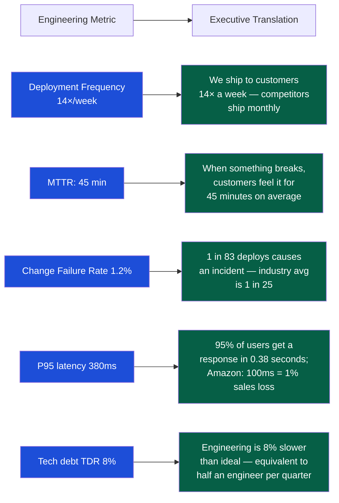

# Executive Communication

> [!abstract] TL;DR
> Executives operate at the altitude of decisions, not implementations. Every communication must start with the conclusion (BLUF — Bottom Line Up Front), connect technical reality to business outcomes, and respect that executives have 15 minutes of attention where engineers expect 60. The engineer who cannot translate technical work into executive language loses influence over resourcing, prioritization, and strategy. Navigating up requires trust, brevity, honesty about risk, and the discipline to never bury the lede.

## The Executive Mindset

Understanding what executives need is the foundation of communicating with them effectively.

| Executive Priority | What They Are Actually Asking |
|---|---|
| **Revenue / Growth** | "Is this investment making us more money or helping us grow faster?" |
| **Risk reduction** | "What could go wrong, and are we protected?" |
| **Resource allocation** | "Is this the best use of these people and budget?" |
| **Strategic alignment** | "Does this move us toward the 3-year plan?" |
| **Time** | "Can you say this in 3 minutes or less?" |

**The altitude rule:** Executives see the mountain range; engineers see the individual rock faces. Both views are necessary. When briefing an exec, start at mountain-range altitude (the whole) and zoom in only when asked.

## BLUF: Bottom Line Up Front

Every executive communication — written or verbal — should state the recommendation or conclusion in the first sentence.

### The Wrong Structure (Chronological)
```
"We started investigating the authentication performance issue in Q2.
We found that the session store was being hit 40× per request.
After evaluating Redis Cluster vs. session-less JWT, we decided JWT was better.
We estimate this will take 6 weeks. Therefore we recommend we do the migration."
```

### The Right Structure (BLUF)
```
"Recommendation: Migrate authentication to JWT in Q3 — 6-week investment, 
 saves $40k/year in Redis costs, enables SSO for enterprise customers.

Why now: Session store is the bottleneck blocking our enterprise tier (Q3 revenue target).
Trade-offs considered: Redis Cluster (faster) vs JWT (simpler, cheaper) — JWT wins on TCO.
Risk: Zero-downtime migration requires 2-week parallel running — mitigated by feature flag.
Decision needed from you: Approve 6-week capacity hold for auth team."
```

## Written Executive Summary Format

For written communication to VPs and above:

```
======================================
EXECUTIVE SUMMARY: Authentication Migration
======================================

SITUATION (2 sentences max):
  Authentication latency is blocking the enterprise SSO feature, which is on the Q3 
  revenue plan for $1.2M ARR. Current architecture cannot support SSO without a 
  structural change to session handling.

RECOMMENDATION (1 sentence):
  Migrate authentication to stateless JWT in Q3 — 6-week timeline, zero-downtime.

BUSINESS IMPACT:
  ✓ Unblocks $1.2M ARR SSO feature (Q3)
  ✓ Reduces Redis infrastructure cost by $40k/year
  ✓ Eliminates the #1 root cause of auth-related incidents (3 in last 6 months)

INVESTMENT REQUIRED:
  3 engineers × 6 weeks = ~$135k engineering cost
  2-week parallel infrastructure run: +$8k cloud cost

RISK:
  Main risk: Zero-downtime migration — mitigated with feature flag + 2-week rollout
  If this fails: rollback plan ready (under 10 minutes); session store remains running in parallel

DECISION NEEDED:
  [ ] Approve 6-week capacity block for auth team, starting June 1
  [ ] No decision needed — informational only
======================================
```

## Board and Executive Presentation Structure

For a 15-minute slot in an engineering review or board update:

```
Slide 1: Headline (1 minute)
  "Engineering is on track for Q3 / Q4. Three decisions needed from this room."
  — Never open with background; open with the state of play and what you need.

Slide 2: Key Metrics Dashboard (2 minutes)
  Deployment frequency: 14×/week (target: >10 — GREEN)
  Change failure rate: 1.2% (target: <2% — GREEN)
  P95 latency: 380ms (target: <400ms — GREEN)
  Incident MTTR: 45 min (target: <60 min — GREEN)
  — Executives can read a stoplight; add a one-line trend note for anything not green.

Slide 3: Progress on Q3 commitments (3 minutes)
  Authentication migration: 70% complete, on track for June 30
  Test coverage >80%: Achieved June 1 — DONE
  Orders module decomposition: Slipped to Q4 — see Slide 4

Slide 4: The one risk that needs their attention (4 minutes)
  "Orders decomposition is slipping 6 weeks. Here is why. Here are the options. 
   Option A: Maintain scope, slip 6 weeks. Option B: Reduce scope, ship on time.
   We recommend Option B. Decision needed today."

Slide 5: Q4 Preview (3 minutes)
  Three-theme view: Reliability (Kafka), Scale (Multi-region spike), Security (SOC 2)
  Budget implications if any.

Slide 6: Asks / Decisions (2 minutes)
  Bullet list: "Decision 1 / Decision 2 / FYI only"
```

## Engineering Metrics for Executives

Translate engineering metrics into executive language before presenting them.



### The Metric Framing Hierarchy

| Frame | Example | Audience |
|---|---|---|
| Raw technical | "P95 API latency = 380ms" | Engineers |
| Percentile translated | "95% of requests complete in under 0.4 seconds" | Technical managers |
| Customer impact | "95% of page loads complete in under 0.4 seconds" | Product leadership |
| Business impact | "A 100ms improvement reduces bounce rate by ~1%" | Executives |
| Competitive benchmark | "AWS SLA for equivalent services is 200ms" | Board |

## Storytelling with Data

A presentation without a narrative is a spreadsheet with slides. Structure your data story:

**The SCR Arc (Situation, Complication, Resolution):**
```
Situation: "We set a Q2 goal: deploy independently 14× per week."
Complication: "We got to 14×, but our change failure rate rose from 0.8% to 2.1% 
               as we accelerated — we were trading reliability for speed."
Resolution: "We paused to add test automation. This quarter: 18× per week, 
              1.2% CFR. Speed and reliability are no longer in tension."
```

This is more compelling than: "Deployment frequency increased 28%. Change failure rate improved 42%."

## Navigating Up: Building Executive Trust

Trust with executives is built through consistent, honest, early communication — not through presentation skill.

### The Trust-Building Behaviors

| Behavior | Why It Builds Trust |
|---|---|
| **Deliver what you commit to** | Executives learn whose estimates to rely on by tracking who hits their commitments |
| **Surface problems early with options** | Executives hate surprises; they want a problem + options, not a problem alone |
| **Give the bad news first** | Burying the lede trains executives not to trust your summaries |
| **Never say "everything is fine" when it isn't** | A credibility cliff crash is career-limiting |
| **Know your numbers** | Vagueness signals poor situational awareness; executives test this constantly |
| **Be brief and respect their time** | Coming in 5 minutes under time is professional; going over is a relationship tax |

### The Pre-Meeting Protocol

Before any executive briefing:
1. What are the three questions they will ask? Pre-answer them in the appendix.
2. What is the worst-case question? Have the data ready, not the apology.
3. What do you need from them? One clear ask, not "I just wanted to update you."
4. What can you cut if you run short on time? Know your 5-minute version of a 15-minute talk.

## Trade-Off Considerations

| Communication Style | Risk | When Appropriate |
|---|---|---|
| **Full technical depth** | Loses executive audience; feels like a download | Design review with technical leadership |
| **Full business abstraction** | Engineers feel misrepresented; executives may make uninformed decisions | Board presentations on company strategy |
| **BLUF + optional appendix** | Appendix may be ignored | Most executive communications — recommended default |
| **Verbal update only** | No record; easy to misremember | Weekly standups, not decision conversations |
| **Written memo first** | Requires reading time; slows the loop | Major investment decisions (Amazon-style 6-pager) |

## Common Pitfalls

1. **Starting with background instead of conclusions** — Executives interpret this as lack of clarity or burying bad news. BLUF always.
2. **Using engineering jargon without translation** — "We need to deprecate the legacy microservice coupling" → "We need to separate two systems that currently fail together, which is costing us 3 incidents per quarter."
3. **Presenting data without a recommendation** — Executives expect you to synthesize. "Here is the data — what do you think?" signals indecision.
4. **Not preparing for the obvious questions** — If your talk covers a missed deadline, "why did it slip?" is coming. Have the answer.
5. **Hiding bad news in the appendix** — Executives feel manipulated when buried bad news surfaces later. Put it in the body, with your mitigation plan.
6. **Asking for nothing** — Every executive meeting should end with a clear ask or a clear "no decision needed" statement. Ambiguous endings waste the relationship.

## Review Questions

1. Rewrite this for an executive audience: "We need to refactor the monolith because our coupling is causing high CFR and low deployment frequency." Include situation, recommendation, business impact, and ask.
2. You have 15 minutes with the VP Engineering. The Orders module has slipped 6 weeks. Structure your presentation using the 6-slide framework.
3. An exec asks: "Is the team healthy?" How do you give a confident, accurate answer in 60 seconds using DORA metrics?
4. What is the BLUF principle and why does starting with the recommendation (rather than the analysis) build rather than undermine executive trust?

## Related Notes

- [[_MOC_Engineering_Leadership_Master|↑ Engineering Leadership MOC]]
- [[Communication_and_Influence]]
- [[Engineering_Metrics_and_Health]]
- [[Staff_Plus_Engineering]]
- [[Technical_Roadmapping]]

#Engineering #Leadership #ExecutiveCommunication #BLUF #Storytelling
