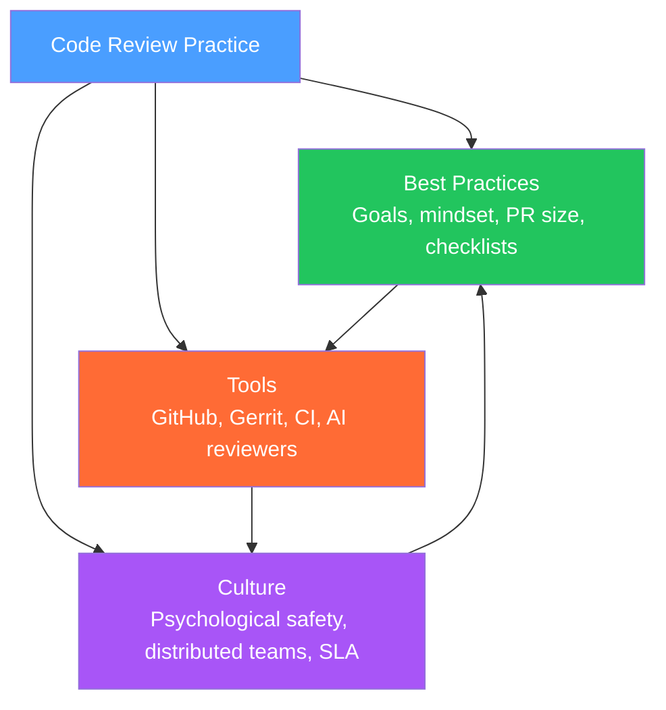

# Code Review — Section MOC

> [!info] About this section
> 3 notes covering the full practice of code review: best practices (goals, mindset, PR size, checklists), tools (GitHub, Gerrit, AI reviewers, CI automation), and culture (psychological safety, distributed teams, reviewer assignment, SLA).

## Concept Map

## Notes in This Section

| Note | Core Idea | Key Concepts |
|------|-----------|--------------|
| [[Code_Review_Best_Practices]] | Code review serves knowledge sharing, defect detection, and standards — NOT gatekeeping. PR < 400 lines, structured comments (must-fix/suggestion/nit), checklists | PR size, comment types, checklist, reviewer mindset |
| [[Code_Review_Tools]] | GitHub PRs (inline comments, CODEOWNERS, required approvals), Gerrit (patchsets), AI reviewers (CodeRabbit, Copilot), CI automation (lint/type/test/security gates) | CODEOWNERS, branch protection, Vale, CodeQL |
| [[Code_Review_Culture]] | Psychological safety, blameless language, Google's Code Review guide, async review in distributed teams, review SLA (24h first response) | Google guide, blameless language, review SLA, pair programming |

## Learning Path

1. [[Code_Review_Best_Practices]] — understand the goals, mindset, and mechanics of good review
2. [[Code_Review_Tools]] — set up tooling (CODEOWNERS, branch protection, CI checks, AI review)
3. [[Code_Review_Culture]] — build and maintain a healthy review culture at team scale

## Related Notes

- [[Technical_Leadership]] — code review as a technical leadership practice (ADRs, tech debt)
- [[Team_Building_and_Culture]] — psychological safety and blameless culture connect to review culture
- [[Delivery_and_Execution]] — PR review time is a component of DORA Change Lead Time metric
- [[Engineering_Metrics_and_Health]] — review metrics (time-to-review, iteration count)

#MOC #CodeReview #EngineeringLeadership
