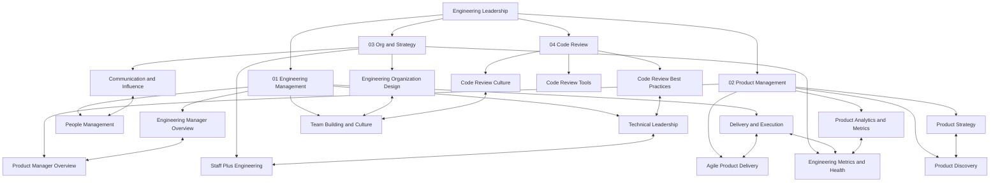

# Engineering Leadership Master MOC

> [!abstract] About
> 17 notes across 4 sections covering the full spectrum of engineering leadership: managing engineering teams, shipping products as a PM, designing organizations for scale, and running healthy code review practices. Draws on named frameworks (DORA, SBI, JTBD, WSJF, RICE, Conway's Law, Team Topologies, SPACE, Google Code Review Guide) from foundational research and industry practice.

## Knowledge Map

## Section Index

### 01 Engineering Management

| Note | Core Frameworks | Key Concepts |
|---|---|---|
| [[Engineering_Manager_Overview]] | Situational Leadership (D1–D4), Four Pillars | IC-to-EM transition, TLM vs People Manager, management anti-patterns |
| [[People_Management]] | SBI Model, Career Ladder (E3–E7), PIP structure | 1:1 cadence, feedback escalation, sponsorship vs mentorship |
| [[Technical_Leadership]] | Cunningham Debt Matrix, ADR template, Build/Buy/Integrate | Tech roadmap, debt budget, code review culture |
| [[Delivery_and_Execution]] | DORA Metrics, Three-Point Estimation, PERT | Sprint rituals, scope creep, blameless post-mortems, OKRs |
| [[Team_Building_and_Culture]] | Westrum Model, Psychological Safety, Structured Interviewing | Hiring pipeline, 30/60/90 onboarding, remote async-first, reorgs |

### 02 Product Management

| Note | Core Frameworks | Key Concepts |
|---|---|---|
| [[Product_Manager_Overview]] | Stakeholder Map, PM Archetypes | Discovery-Definition-Delivery-Measurement cycle, PM anti-patterns |
| [[Product_Discovery]] | Double Diamond, JTBD, Opportunity Solution Tree | User interview techniques, synthesizing insights, continuous discovery |
| [[Product_Strategy]] | Porter's Five Forces, Blue Ocean, OKRs | Product vision, roadmap formats, Crossing the Chasm, PMF signals |
| [[Agile_Product_Delivery]] | WSJF, RICE, ICE, INVEST, Given/When/Then | Backlog management, story mapping, MVP types, sprint ceremonies |
| [[Product_Analytics_and_Metrics]] | AARRR Funnel, North Star Metric, SPACE | Cohort analysis, A/B testing, funnel analysis, analytics tooling |

### 03 Org and Strategy

| Note | Core Frameworks | Key Concepts |
|---|---|---|
| [[Engineering_Organization_Design]] | Conway's Law, Team Topologies (4 types) | Org models, platform vs embedded, cognitive load, reorg dynamics |
| [[Communication_and_Influence]] | BLUF, Amazon 6-Pager, Three-Option Frame | Influence without authority, executive communication, conflict ladder |
| [[Staff_Plus_Engineering]] | Will Larson's 4 Archetypes | Glue work, technical strategy docs, organizational politics, TPM role |
| [[Engineering_Metrics_and_Health]] | DORA, SPACE, Error Budgets, Goodhart's Law | SLO/SLA/SLI, toil measurement, DevEx metrics, velocity caveats |

### 04 Code Review

| Note | Core Frameworks | Key Concepts |
|---|---|---|
| [[Code_Review_Best_Practices]] | Google Code Review Guide, Nitpick/Must-Fix/Suggestion taxonomy | PR size (< 400 lines), reviewer mindset, review checklists, comment types |
| [[Code_Review_Tools]] | CODEOWNERS, Branch Protection, CodeRabbit, CodeQL | GitHub PR review, Gerrit patchsets, CI automation, AI reviewers |
| [[Code_Review_Culture]] | Google Code Review Developer Guide, Psychological Safety | Blameless language, async review SLA, reviewer assignment, distributed teams |

## Key Frameworks Quick Reference

| Framework | Domain | Note |
|---|---|---|
| **SBI** (Situation-Behavior-Impact) | Feedback delivery | [[People_Management]] |
| **Situational Leadership** (D1–D4) | Leadership style matching | [[Engineering_Manager_Overview]] |
| **DORA Metrics** | Engineering delivery health | [[Delivery_and_Execution]], [[Engineering_Metrics_and_Health]] |
| **Westrum Culture Model** | Team culture typing | [[Team_Building_and_Culture]] |
| **ADR** (Architecture Decision Record) | Technical decision capture | [[Technical_Leadership]] |
| **Double Diamond** | Product discovery process | [[Product_Discovery]] |
| **JTBD** (Jobs-to-Be-Done) | Customer motivation model | [[Product_Discovery]] |
| **Opportunity Solution Tree** | Discovery-to-experiment mapping | [[Product_Discovery]] |
| **Porter's Five Forces** | Competitive strategy | [[Product_Strategy]] |
| **Crossing the Chasm** | Technology adoption lifecycle | [[Product_Strategy]] |
| **WSJF** (Weighted Shortest Job First) | Backlog prioritization | [[Agile_Product_Delivery]] |
| **RICE Scoring** | Feature prioritization | [[Agile_Product_Delivery]] |
| **INVEST Criteria** | User story quality | [[Agile_Product_Delivery]] |
| **AARRR Funnel** (Pirate Metrics) | Product lifecycle metrics | [[Product_Analytics_and_Metrics]] |
| **North Star Metric** | Single-metric alignment | [[Product_Analytics_and_Metrics]] |
| **Conway's Law** | Org-architecture relationship | [[Engineering_Organization_Design]] |
| **Team Topologies** | Engineering org design | [[Engineering_Organization_Design]] |
| **BLUF** | Executive communication | [[Communication_and_Influence]] |
| **Amazon 6-Pager** | Strategic document format | [[Communication_and_Influence]] |
| **Larson's 4 Archetypes** | Staff+ career paths | [[Staff_Plus_Engineering]] |
| **SPACE Framework** | Developer productivity | [[Engineering_Metrics_and_Health]] |
| **Goodhart's Law** | Metric design risk | [[Engineering_Metrics_and_Health]] |
| **Error Budgets / SLO** | Reliability management | [[Engineering_Metrics_and_Health]] |
| **Google Code Review Guide** | Principles for authors and reviewers | [[Code_Review_Best_Practices]], [[Code_Review_Culture]] |
| **CODEOWNERS** | Auto-assign reviewers by file path | [[Code_Review_Tools]] |
| **Review SLA** | 24h first-response norm for PR review | [[Code_Review_Culture]] |

## Learning Paths

### (A) New Engineering Manager
For an IC who has recently transitioned to EM, or is preparing for the transition.

1. **Start:** [[Engineering_Manager_Overview]] — understand the role shift, the four pillars, and management anti-patterns
2. **People first:** [[People_Management]] — build the 1:1 cadence, learn SBI feedback, understand the career ladder
3. **Culture foundation:** [[Team_Building_and_Culture]] — structured hiring, 30/60/90 onboarding, psychological safety
4. **Delivery accountability:** [[Delivery_and_Execution]] — DORA metrics, sprint rituals, scope management, incident command
5. **Technical credibility:** [[Technical_Leadership]] — ADRs, tech debt management, code review culture
6. **Communication up:** [[Communication_and_Influence]] — BLUF, executive presentations, influence without authority
7. **Measure the team:** [[Engineering_Metrics_and_Health]] — SPACE, DevEx, Goodhart's Law, error budgets

### (B) Product Manager
For a PM learning the craft or expanding from feature delivery to product strategy.

1. **Start:** [[Product_Manager_Overview]] — role clarity, stakeholder map, PM archetypes, anti-patterns
2. **Discovery skills:** [[Product_Discovery]] — Double Diamond, JTBD, user interview technique, Opportunity Solution Tree
3. **Strategy altitude:** [[Product_Strategy]] — product vision, OKRs, roadmap formats, Crossing the Chasm, PMF signals
4. **Delivery mechanics:** [[Agile_Product_Delivery]] — WSJF, RICE, INVEST stories, Given/When/Then AC, MVP thinking
5. **Measurement literacy:** [[Product_Analytics_and_Metrics]] — AARRR funnel, North Star, cohort analysis, A/B testing
6. **EM partnership:** [[Engineering_Manager_Overview]] — understand how your EM counterpart operates
7. **Org context:** [[Engineering_Organization_Design]] — Conway's Law, Team Topologies, platform vs product team dynamics

### (C) Staff+ Engineer
For senior ICs targeting Staff, Principal, or Distinguished Engineer levels, or EMs working with staff engineers.

1. **Start:** [[Staff_Plus_Engineering]] — Larson's archetypes, scope shift, technical strategy documents, glue work
2. **Org design:** [[Engineering_Organization_Design]] — Conway's Law, Team Topologies, inner source, reorgs
3. **Influence toolkit:** [[Communication_and_Influence]] — BLUF, 6-pager, three-option frame, executive communication
4. **Technical excellence:** [[Technical_Leadership]] — ADRs, tech debt classification, engineering principles, build/buy framework
5. **Metrics depth:** [[Engineering_Metrics_and_Health]] — DORA diagnostics, SPACE, SLOs/error budgets, Goodhart's Law
6. **People strategy:** [[People_Management]] — sponsorship vs mentorship, promotion advocacy, managing up
7. **Product context:** [[Product_Strategy]] — understand how product strategy shapes technical investment prioritization

## Cross-Vault Links

- [[_MOC_Code_Review]] — Code review practices: best practices, tools (GitHub, Gerrit, CI), and culture

- [[_MOC_DevOps_Master]] — DevOps practices that underpin DORA metric improvement
- [[_MOC_SystemDesign_Master]] — System design fundamentals referenced in technical leadership and org design
- [[_MOC_AI_ML_Master]] — ML in product management; AI in engineering workflows

#Engineering #Leadership
