# 🦠 Epidemiology and Public Health Overview

> [!abstract] TL;DR
> **Epidemiology** is the study of the **distribution** (who gets sick, where, and when) and **determinants** (what causes it) of health and disease in whole **populations**, and the application of that knowledge to prevention and control. Where a clinician studies the sick *individual*, epidemiology studies the health of *communities and nations* — it is the detective science that finds what makes populations sick, measures it, proves what causes it from **patterns** rather than mechanisms, and tests what actually prevents it. Its founding legend captures the method: in 1854 London, John Snow stopped a cholera outbreak not by examining patients but by **mapping** where the dead lived, spotting that they all drew water from one contaminated pump, and removing its handle — decades before anyone could see the germ. Every time you hear "smoking causes cancer," "this vaccine is 95% effective," "cases are rising," or "wear a seatbelt," you are hearing epidemiology at work. It is the **basic science of public health** — the organized societal effort to protect and improve health at population scale through *prevention* rather than *cure*. This note is the **hub and roadmap** for the whole Epidemiology and Public Health vault, surveying its six sections from measuring disease, through study design and causal inference, to fighting epidemics and shaping health policy.

---

## Intuition

**Analogy — the doctor treats one patient; the epidemiologist reads the whole crowd.** Imagine two people looking at the same hospital. The clinician walks the wards and asks, of each patient in turn, *"What is wrong with this person, and how do I fix them?"* The epidemiologist stands on the roof and asks a different question entirely: *"Why are so many people from that neighbourhood arriving with the same illness this month — and what would stop the next hundred from coming at all?"* One zooms all the way in to a single body; the other zooms all the way out to the population, and in doing so sees things no bedside can reveal — a spike in a district, a risk shared by smokers, a curve bending after a policy changes.

The founding story makes the method concrete. In the 1854 Broad Street cholera outbreak, John Snow did not have a microscope powerful enough to see *Vibrio cholerae* — germ theory did not yet exist. So he did something radical: he **mapped the dead**. Plotting every cholera death on a street map, he saw the cases cluster tightly around a single public water pump on Broad Street, while a nearby brewery whose workers drank their own beer stayed strangely healthy. He persuaded the parish to remove the pump handle, and the outbreak subsided. Snow had found the *cause* and the *cure* by studying **patterns across a population** — who died, *where* they lived, *when* they fell ill — without ever knowing the mechanism. That is the epidemiological method in miniature, and it answers questions medicine alone cannot: not "what is wrong with *this* patient?" but "what is making our *population* sick, how do we measure it, prove what causes it, and prevent it?"

---

## How It Works

### The core logic — from pattern to prevention

Epidemiology runs a repeatable chain of reasoning, and almost every note in this vault is one link in it:

1. **Describe the pattern (descriptive epidemiology).** Characterise disease by **person** (age, sex, occupation, behaviour), **place** (neighbourhood, country, clustering), and **time** (seasonality, trends, the sudden rise of an *epidemic curve*). This is the layer that first says *something is happening here*, exactly as Snow's map did.
2. **Measure how much (measures of frequency).** Turn raw counts into **rates** — *incidence* (new cases per population per time) and *prevalence* (existing cases at a moment) — so that a big city and a small town, or this year and last, can be compared fairly.
3. **Compare groups (measures of association).** Set the exposed against the unexposed and ask whether disease is more common in one. The comparison yields effect measures — the **relative risk**, the **odds ratio**, the **hazard ratio** — the quantitative fingerprints of a possible cause.
4. **Rule out the impostors (bias and confounding).** An apparent association may be an artefact of how data were collected (*bias*) or of a lurking third variable that drives both exposure and disease (*confounding*). Stripping these away is the analytic heart of the field.
5. **Infer causation.** Weigh the surviving association against criteria — strength, consistency, temporality, dose-response, biological plausibility — to judge whether the exposure *causes* the disease rather than merely travelling with it.
6. **Intervene and evaluate.** Design and test a prevention — a vaccine, a screening programme, a clean-water system, a tax on tobacco — and measure whether disease actually falls. Then feed the result back into policy.

### The population perspective, and the two faces of medicine

The clinician and the epidemiologist are complementary halves of health. Clinical medicine works *downstream*, one patient at a time, and its currency is **cure**. Public health works *upstream*, across whole populations, and its currency is **prevention** — stratified into **primary** (stop disease before it starts: vaccination, clean water, seatbelts), **secondary** (catch it early: screening for cancer or hypertension), and **tertiary** (limit harm once established: rehabilitation). Epidemiology is the *basic science* beneath that effort, just as physics underlies engineering. Public health then organises the response through its three core functions: **assessment** (measure the population's health and its threats), **policy development** (decide what to do), and **assurance** (make sure it gets done). A single prevented cause upstream — a contaminated pump, a smoking habit, an unvaccinated cohort — averts far more suffering than any number of cures downstream.

### The chain from individual to population to prevention

```mermaid
flowchart LR
    DOC["Doctor treats the<br/>sick INDIVIDUAL<br/>one patient, cure"]
    EPI["EPIDEMIOLOGY studies the<br/>health of whole POPULATIONS"]
    PATTERN["Detective work:<br/>study PATTERNS by<br/>PERSON, PLACE, TIME"]
    SNOW["John Snow 1854:<br/>map cholera deaths<br/>to one water pump"]
    CAUSE["Find causes and<br/>where to intervene"]
    METHOD["Measure disease,<br/>design studies,<br/>prove causation,<br/>fight epidemics"]
    PH["PUBLIC HEALTH:<br/>prevention at<br/>population scale"]
    OUT["Smoking causes cancer,<br/>vaccine effectiveness,<br/>wear a seatbelt"]

    DOC -->|"zoom out from one body to millions"| EPI
    EPI --> PATTERN
    PATTERN -->|"clustering points to a source"| SNOW
    SNOW --> CAUSE
    CAUSE --> METHOD
    METHOD --> PH
    PH --> OUT
```



*Read left to right as the logic of the field: the clinician's single patient gives way to the population, whose patterns in person, place, and time reveal causes, which the epidemiological toolkit measures and proves, which public health turns into prevention — and thence into the everyday health facts we all live by.*

---

## Key Concepts

### Secondary (intuitive)

- **Epidemiology** = the science of studying the health of whole *groups* of people, not just one patient — finding who gets sick, why, and how to stop it.
- **Population vs individual** = a doctor asks *"what is wrong with you?"*; an epidemiologist asks *"why is this happening to so many people, and how do we prevent it?"*
- **Person, place, time** = the three questions that describe any outbreak — *who* is affected, *where*, and *when*. Snow's cholera map was all three at once.
- **Prevention over cure** = it is better and cheaper to stop people getting sick (clean water, vaccines, seatbelts) than to treat them afterwards. That is what public health is for.
- **Public health** = society's organised effort to keep whole populations healthy, from sewers and vaccines to health warnings on cigarette packs.

### Undergraduate (formal)

- **Distribution and determinants.** Epidemiology has two arms: **descriptive** (the *distribution* — patterns by person, place, time) and **analytic** (the *determinants* — testing hypothesised causes and risk factors). Descriptive epi generates hypotheses; analytic epi tests them.
- **Incidence vs prevalence.** *Incidence* = the rate of **new** cases arising in a population over time (a measure of risk); *prevalence* = the proportion of a population with the disease **at a point in time** (a snapshot of burden). Prevalence roughly equals incidence times duration — chronic diseases pile up in prevalence even at modest incidence.
- **Measures of association.** The **relative risk (RR)** compares incidence in exposed versus unexposed (natural in cohort studies); the **odds ratio (OR)** compares odds of exposure (used in case-control studies, where risk cannot be measured directly); the **hazard ratio** compares instantaneous rates over time.
- **Bias, confounding, and chance.** Three rival explanations for any observed association. *Bias* is systematic error in selection or measurement; *confounding* is a third factor associated with both exposure and outcome; *chance* is random variation, quantified with statistics. Ruling out all three is the burden of proof.
- **The natural history of disease and levels of prevention.** Disease moves through stages: susceptibility, subclinical, clinical, outcome. **Primary** prevention acts before onset, **secondary** during the subclinical/early phase (screening), **tertiary** after diagnosis to limit disability.

### Graduate (mechanistic and systems)

- **Causal inference beyond association.** The Bradford Hill viewpoints (strength, consistency, temporality, biological gradient, plausibility, coherence, experiment, analogy) are heuristics, not a checklist. Modern epidemiology formalises causation with **counterfactuals** and **potential outcomes** (Rubin), **directed acyclic graphs (DAGs)** to distinguish confounders from mediators and colliders, and **target-trial emulation** to draw causal conclusions from observational data — the discipline's analytic frontier.
- **Confounding vs mediation vs collider bias.** A *confounder* opens a spurious back-door path and must be adjusted for; a *mediator* lies on the causal path and must **not** be adjusted for if you want the total effect; conditioning on a *collider* can *create* bias where none existed. DAGs make these distinctions explicit and prevent adjustment mistakes that no amount of data can fix.
- **The reproduction number and epidemic dynamics.** For infectious disease, the basic reproduction number **R0** (expected secondary cases from one case in a fully susceptible population) sets the epidemic threshold: R0 greater than 1 grows, less than 1 dies out. The effective **Re** falls as susceptibles are depleted or removed, giving the **herd-immunity threshold** near 1 minus 1 over R0 — the target that vaccination programmes aim past.
- **Screening, base rates, and the paradox of prevention.** A test's positive predictive value depends on disease prevalence, so screening rare conditions floods the system with false positives (Bayes). Geoffrey Rose's **prevention paradox**: a population-wide shift in a risk factor (a small drop in everyone's blood pressure) prevents more disease than intensively treating the high-risk few — the mathematical case for population strategies over high-risk strategies.
- **The ecological fallacy and levels of inference.** Associations that hold across *groups* need not hold within *individuals*; inferring individual risk from group-level data is a classic error. Epidemiology is perpetually negotiating the bridge between population patterns and individual causes.

---

## Python Demo

```python
# Two views of the epidemiological landscape:
#   (a) POPULATION PATTERNS / DESCRIPTIVE EPI: an EPIDEMIC CURVE -- daily cholera
#       deaths in the 1854 Broad Street outbreak. The cases cluster sharply in TIME
#       (and, on Snow's map, in PLACE around one pump). That clustering is the signal
#       that first says "something here has a common source" -- the John Snow logic.
#   (b) PREVENTION vs CURE AT POPULATION SCALE: a simple SIR model shows that treating
#       the sick INDIVIDUALLY (which does not cut transmission) barely changes how many
#       people get sick, while a POPULATION-LEVEL PREVENTION (clean water / vaccination
#       that lowers transmission) collapses the epidemic. Prevention beats cure at scale.
import numpy as np
import matplotlib.pyplot as plt

rng = np.random.default_rng(1854)

# ---------- (a) Epidemic curve: daily deaths in a point-source outbreak ----------
day    = np.arange(1, 26)                      # days of the outbreak
shape  = 130 * np.exp(-0.5 * ((day - 6) / 2.6) ** 2)   # sharp rise, peak, decline
deaths = np.clip(np.round(shape * (1 + rng.normal(0, 0.10, day.size))), 0, None)
handle_removed = 12                            # day the pump handle was removed

# ---------- (b) SIR model: prevention vs individual treatment ----------
N, gamma = 1_000_000, 1 / 7.0                  # 7-day infectious period
def sir(beta, days=180, dt=0.25, I0=50.0):
    steps = int(days / dt)
    S = np.empty(steps); I = np.empty(steps); R = np.empty(steps); inc = np.zeros(steps)
    S[0], I[0], R[0] = N - I0, I0, 0.0
    for k in range(steps - 1):
        new       = beta * S[k] * I[k] / N * dt   # newly infected this step
        inc[k + 1] = new / dt                      # incidence: new cases per day
        S[k + 1]   = S[k] - new
        I[k + 1]   = I[k] + new - gamma * I[k] * dt
        R[k + 1]   = R[k] + gamma * I[k] * dt
    return np.arange(steps) * dt, inc, R[-1]

R0 = 3.0                                         # baseline: each case infects ~3 others
t, inc_base, size_base = sir(beta=R0 * gamma)                 # no prevention (cure-only overlaps this)
t, inc_prev, size_prev = sir(beta=1.25 * gamma)              # prevention lowers transmission -> Re ~ 1.25
attack_base = size_base / N * 100
attack_prev = size_prev / N * 100

fig, (ax1, ax2) = plt.subplots(1, 2, figsize=(14, 5.5))

# --- panel (a): the epidemic curve ---
ax1.bar(day, deaths, color="#8E44AD", alpha=0.85, label="Deaths per day")
ax1.axvline(handle_removed, color="#C0392B", ls="--", lw=2, label="Pump handle removed")
ax1.set_xlabel("Day of outbreak")
ax1.set_ylabel("Cholera deaths")
ax1.set_title("(a) Descriptive epi: an epidemic curve clusters in time")
ax1.legend(loc="upper right", fontsize=9)
ax1.grid(axis="y", alpha=0.3)

# --- panel (b): prevention vs cure ---
ax2.plot(t, inc_base, color="#C0392B", lw=2.2,
         label=f"Cure only -> attack rate {attack_base:.0f} percent")
ax2.plot(t, inc_prev, color="#27AE60", lw=2.2,
         label=f"Population prevention -> attack rate {attack_prev:.0f} percent")
ax2.fill_between(t, inc_prev, inc_base, color="#27AE60", alpha=0.12,
                 label="Cases averted by prevention")
ax2.set_xlabel("Day of epidemic")
ax2.set_ylabel("New cases per day")
ax2.set_title("(b) Prevention beats cure at population scale")
ax2.legend(loc="upper right", fontsize=9)
ax2.grid(alpha=0.3)

plt.tight_layout()
plt.show()

print(f"Cure-only epidemic     -> {attack_base:5.1f} percent of the population infected")
print(f"With population prevent -> {attack_prev:5.1f} percent infected  "
      f"({attack_base - attack_prev:.0f} points averted)")
```

**What you see.** *Panel (a)* is descriptive epidemiology in one image: plot the deaths day by day and a **shape** emerges — a sharp rise, a peak, a decline — the classic **epidemic curve** of a point-source outbreak. That tight clustering in *time* (and, on Snow's real map, in *place* around the Broad Street pump) is the signal that a *common source* is at work, long before anyone can name the germ. *Panel (b)* is the thesis of public health: because treating the sick individually does nothing to stop new infections, the "cure-only" curve rips through the population and infects the large majority. A **population-level prevention** that lowers transmission — clean water, vaccination — pushes the effective reproduction number toward 1, flattens the curve, and averts a huge share of all cases. The green shaded gap is prevention's payoff: far more suffering prevented upstream than any amount of cure could reach downstream.

---

## Real-World Applications

- **Outbreak investigation and surveillance.** From Snow's cholera map to contact-tracing dashboards during COVID-19, epidemiologists detect clusters, build epidemic curves, identify sources, and guide containment. National surveillance systems and the WHO's outbreak alerts are descriptive epidemiology institutionalised.
- **Proving what makes populations sick.** The landmark cohort and case-control studies — Doll and Hill on smoking and lung cancer, the Framingham Heart Study on cardiovascular risk factors — established causes we now take for granted, entirely from population patterns.
- **Evaluating vaccines, drugs, and policy.** "95% effective" is an epidemiological measurement from a randomised trial; so is the evidence behind seatbelt laws, tobacco taxes, water fluoridation, and cancer-screening programmes. Epidemiology is how we know an intervention actually works before scaling it to millions.
- **Measuring the burden of disease.** Metrics such as incidence, mortality rates, life expectancy, and DALYs (disability-adjusted life years) quantify what harms populations most and where to direct scarce resources — the backbone of health economics and global health priority-setting.
- **Chronic-disease and lifestyle epidemiology.** The evidence linking diet, physical activity, obesity, and air pollution to heart disease, diabetes, and cancer comes from large observational cohorts — shaping dietary guidelines, clean-air standards, and prevention campaigns.
- **Health equity and the social gradient.** Epidemiology documents how disease tracks poverty, race, and place, giving public health and policy the data to target inequities rather than merely describe them.

---

## Common Pitfalls

- **Confusing association with causation.** The central sin. That two things rise together (ice-cream sales and drownings) does not mean one causes the other; a hidden confounder (summer heat) may drive both. Establishing causation demands ruling out bias, confounding, and chance — not just plotting a correlation.
- **Ignoring confounding.** Coffee looked carcinogenic until studies accounted for the fact that heavy coffee drinkers also smoked. Failing to adjust for a confounder — or over-adjusting by conditioning on a mediator or collider — produces confident, wrong answers no larger sample can rescue.
- **The ecological fallacy.** Inferring individual risk from group averages. If countries with more fat in the diet have more heart disease, it does not follow that the fat-eaters *within* a country are the ones with heart disease. Group-level patterns and individual-level causes are different claims.
- **Prevalence-incidence confusion.** A rise in prevalence can mean more people are getting sick (rising incidence) or that patients are surviving longer (rising duration) — opposite stories with opposite implications. Always ask which measure you are looking at.
- **Selection and survivorship bias.** If who enters or stays in a study depends on both exposure and outcome, the sample lies. Snow's healthy brewery workers were a natural comparison group; a badly chosen one would have hidden the pump.
- **Reading the epidemic curve backward.** In the real Broad Street outbreak, cases had already begun to fall *before* the handle was removed, because residents had fled and the source was waning. Attributing all the decline to the intervention overstates its effect — a caution against confusing timing with proof.
- **Treating this vault as clinical advice.** These notes teach the *science* of population health; they are not guidance for any individual's medical care, which always depends on a clinician and the specifics of a real patient.

---

## Related Concepts

**Within this vault (the six-section roadmap).** This overview is the entry point; each section deepens one link in the chain above, and its notes are planned companions. **Section 01 – Foundations** builds the measuring toolkit: *Measures of Disease Frequency* (incidence, prevalence, rates), *Measures of Association and Effect* (relative risk, odds ratio, attributable risk), disease burden, and the natural history of disease and levels of prevention. **Section 02 – Study Designs** surveys how evidence is generated, from *Epidemiologic Study Designs Overview* through cohort, case-control, cross-sectional, randomised trials, and meta-analysis. **Section 03 – Causal Inference, Bias and Confounding** is the analytic core, formalised in *Causal Inference in Epidemiology* (Bradford Hill, counterfactuals, DAGs, and the taxonomy of bias). **Section 04 – Infectious-Disease Epidemiology** covers transmission dynamics, the reproduction number, outbreaks, surveillance, vaccines, and pandemics in *Infectious Disease Epidemiology*. **Section 05 – Public-Health Practice and Policy** turns evidence into action: health systems, prevention, screening, environmental health, equity, and policy. **Section 06 – Chronic, Global and Frontier Epidemiology** extends the field to lifestyle and non-communicable disease, global health, digital and big-data methods, and genetic epidemiology, closing with *The Reach and Future of Epidemiology*. These are prose references to sibling notes within this vault; the vault sits as the population-health bridge among the Health, Statistics, Sociology, Political Science, and Clinical Medicine vaults.

**Across the vault (Glob-verified links).**

- [[Health_Nutrition_and_Longevity/06_Public_Health_and_Prevention/Public_Health_and_Epidemiology|Public Health and Epidemiology]] — the applied-health companion to this note, framing prevention and epidemiology from the wellness and longevity side.
- [[Health_Nutrition_and_Longevity/01_Foundations_of_Health/Determinants_of_Health|Determinants of Health]] — the social, behavioural, and environmental factors that epidemiology measures as determinants of disease.
- [[Health_Nutrition_and_Longevity/06_Public_Health_and_Prevention/Global_Health_and_Health_Systems|Global Health and Health Systems]] — how population-health evidence is delivered through real health systems worldwide, the terrain of Section 05.
- [[Health_Nutrition_and_Longevity/06_Public_Health_and_Prevention/Infectious_Disease_Vaccines_and_Immunity|Infectious Disease, Vaccines and Immunity]] — the biology of transmission and immunity that underlies Section 04's infectious-disease epidemiology.
- [[Clinical_Medicine/01_Foundations_of_Disease_and_Pathophysiology/Etiology_and_Mechanisms_of_Disease|Etiology and Mechanisms of Disease]] — the individual-level counterpart: epidemiology finds causes from population patterns, pathology explains them mechanistically.
- [[Clinical_Medicine/06_Clinical_Reasoning_and_Modern_Medicine/Evidence_Based_Medicine_and_Clinical_Trials|Evidence-Based Medicine and Clinical Trials]] — the clinical use of the very study designs and effect measures this vault teaches.
- [[Mathematics/06_Probability_and_Statistics/Statistical_Inference|Statistical Inference]] — the statistical machinery (estimation, confidence intervals, hypothesis testing) that quantifies the "chance" rival to every epidemiological association.
- [[Sociology/06_Applied_and_Contemporary_Sociology/Health_Inequality_and_Medical_Sociology|Health Inequality and Medical Sociology]] — the social-science lens on the health gradients that social epidemiology documents.

---

## Review Questions

**Secondary.** John Snow stopped a cholera outbreak in 1854 without ever seeing the germ that caused it. Using the ideas of *person, place, and time*, explain how mapping where the dead lived let him find the cause — and why an epidemiologist's question ("why are so many people sick?") is different from a doctor's question ("what is wrong with this patient?").

**Undergraduate.** Distinguish *incidence* from *prevalence*, and explain why a disease with low incidence can still have high prevalence. Then define *primary*, *secondary*, and *tertiary* prevention, giving one real example of each, and explain in what sense epidemiology is called "the basic science of public health."

**Graduate.** An observational study reports that people who drink red wine have less heart disease than teetotallers. Before concluding that wine is protective, name the three rival explanations any epidemiologist must rule out, and for each explain how it could produce this association without wine being causal. Then describe how a directed acyclic graph, and ideally a randomised or target-trial-emulated design, would let you decide whether the effect is real — and why simply collecting a larger observational sample would not.

---

## Sources

- Gordis, L. (Celentano, D. D., & Szklo, M., eds.). *Gordis Epidemiology* (6th ed.). Elsevier — the standard introductory text; John Snow, measures of frequency and association, study designs.
- Rothman, K. J. *Epidemiology: An Introduction* (2nd ed.). Oxford University Press — causal thinking, bias, and confounding for the modern reader.
- Szklo, M., & Nieto, F. J. *Epidemiology: Beyond the Basics* (4th ed.). Jones & Bartlett — deeper treatment of confounding, interaction, and analytic methods.
- Centers for Disease Control and Prevention. *Principles of Epidemiology in Public Health Practice* (3rd ed.), Self-Study Course SS1978 — the core definitions, person/place/time, and public-health functions.
- Rose, G. *Rose's Strategy of Preventive Medicine* (Rose, Khaw, & Marmot, eds.). Oxford University Press — the population strategy and the prevention paradox.

---

#epidemiology #public-health #population-health #disease-prevention #john-snow
