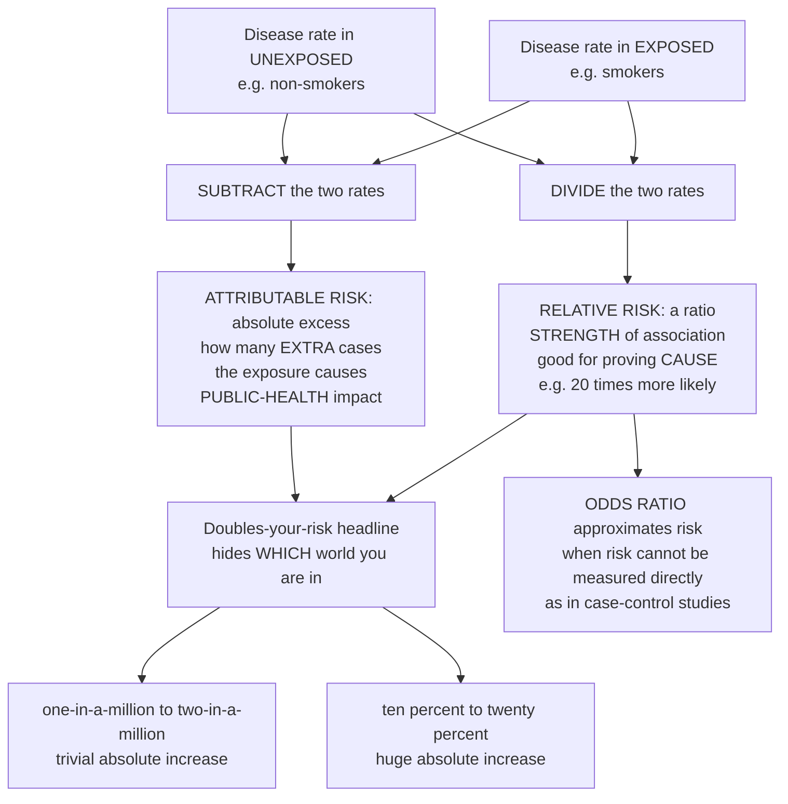

# 📊 Measures of Association and Effect

> [!abstract] TL;DR
> Once you can *count* disease, the next question is *comparison*: does a risk factor actually raise the chance of disease, and by how much? You answer it by comparing the disease frequency in an **exposed** group (say, smokers) to an **unexposed** one (non-smokers). **Divide** the two and you get **relative risk** — a ratio measuring the *strength* of the association (a big ratio is hard to explain away, so it is powerful evidence for **causation**). **Subtract** instead and you get **attributable risk** — the *absolute* excess disease the exposure causes, which is what public health uses to set priorities. The relative-vs-absolute distinction is the single most misused idea in health news: "doubles your risk!" might mean 1-in-a-million rising to 2-in-a-million (trivial) or 10 percent rising to 20 percent (enormous). When you cannot measure risk directly — as in **case-control studies** — the **odds ratio** cleverly approximates it. Master ratio-vs-difference and you can cut through nearly every misleading health statistic. *Educational content, not individual medical advice.*

---

## Intuition

**Analogy:** Imagine two neighbourhoods and a new fast-food chain that just opened branches in one of them. You want to know whether the chain is making people sick. You cannot judge from raw counts — the bigger neighbourhood will have more sick people simply because it has more people. So you do the fair thing: compute the *rate* of illness in each neighbourhood, then put the two rates side by side and ask two different questions about them.

The first question is **"how many times more likely?"** — you **divide** the exposed rate by the unexposed rate. If illness is twenty times more common near the chain, that huge ratio is very hard to blame on coincidence, so it is strong evidence the chain is *causing* harm. This is **relative risk**, and it measures the *strength* of the link. The second question is **"how many extra people got sick?"** — you **subtract** one rate from the other. That absolute excess is what tells the mayor how many illnesses closing the chain would actually prevent. This is **attributable risk**, and it measures real-world *impact*. The trap is that these two numbers can point in wildly different directions: a scary-sounding ratio can hide a microscopic absolute effect, and a modest ratio applied to a common disease can represent a public-health catastrophe. Relative measures speak to *cause*; absolute measures speak to *impact* — and confusing the two is how frightening headlines get made.

---

## How It Works

### Core Mechanics

Everything starts from a **2×2 table** that cross-classifies each person by exposure (row) and outcome (column):

|            | Diseased | Not diseased |
|------------|----------|--------------|
| **Exposed**   | a        | b            |
| **Unexposed** | c        | d            |

1. **Compute the two risks.** Risk in the exposed is `a / (a + b)`; risk in the unexposed is `c / (c + d)`. These incidence proportions are the raw material for every measure below.

2. **Relative (ratio) measures — the strength of the association.** The **relative risk (risk ratio)** is the exposed risk divided by the unexposed risk. `RR = 1` means no association, `RR > 1` means the exposure is harmful, `RR < 1` means it is protective. Ratios capture *etiologic strength*: a very large ratio is hard for a lurking confounder to fabricate, so relative measures are the natural currency of causal argument. The **rate ratio** is the same idea using person-time rates instead of proportions.

3. **The odds ratio — a stand-in when risk cannot be measured.** In a **case-control study** you start from people who already have the disease and hunt backward for exposure, so you can never compute a risk directly. What you *can* compute is the **odds ratio**, `(a·d) / (b·c)`. When the disease is **rare**, the odds ratio closely approximates the relative risk (the *rare-disease assumption*); when the disease is common, the odds ratio exaggerates it away from 1.

4. **Absolute (difference) measures — the impact of the exposure.** The **risk difference**, also called **attributable risk**, is exposed risk minus unexposed risk: the *excess* disease caused by exposure. The **attributable fraction** among the exposed is the proportion of their disease due to the exposure, `(RR − 1) / RR`. The **population attributable fraction** scales this by how common the exposure is, answering the public-health question: how much of *all* disease in the population would vanish if the exposure did? Its clinical cousin is the **number needed to treat/harm**, the reciprocal of the risk difference.

5. **Match the measure to the question.** Cause and mechanism → reach for a *relative* measure. Prevention priorities and clinical relevance → reach for an *absolute* measure. Report the magnitude *and* a confidence interval, and never forget that an association — however strong — is not by itself proof of causation.

### Flow / Architecture



---

## Key Concepts

### Secondary (intuitive foundation)
- **Two questions, two operations.** *Divide* the disease rates for "how many times more likely" (relative); *subtract* them for "how many extra cases" (absolute). Same two numbers, completely different meanings.
- **Relative risk in plain words.** `RR = 2` means the exposed group gets the disease twice as often as the unexposed group. `RR = 1` means the exposure makes no difference; below 1 it is protective (like a vaccine).
- **The headline trap.** "Doubles your risk" is a *relative* statement that tells you nothing about the absolute stakes. Always ask: doubled *from what starting number?*
- **Cause versus impact.** A big ratio argues the exposure is *important to the mechanism*; a big difference argues that removing it would *prevent a lot of disease*. Both matter, for different reasons.

### Undergraduate (formal definitions from the 2×2 table)
- **Risks:** exposed `Rₑ = a/(a+b)`, unexposed `Rᵤ = c/(c+d)`.
- **Relative risk:** `RR = Rₑ / Rᵤ`. **Rate ratio** is the analogue using incidence rates (cases per person-time).
- **Odds ratio:** `OR = (a·d)/(b·c)`, the ratio of the odds of disease in exposed versus unexposed. It is the *only* valid association measure obtainable from a case-control design, and it approximates `RR` under the **rare-disease assumption**.
- **Risk difference / attributable risk:** `RD = Rₑ − Rᵤ`, the absolute excess risk in the exposed caused by the exposure.
- **Attributable fraction in the exposed:** `AFₑ = (Rₑ − Rᵤ)/Rₑ = (RR − 1)/RR`, the proportion of exposed cases attributable to the exposure.
- **Number needed to treat/harm:** `NNT = 1/|RD|` — how many people must be exposed (or treated) to cause (or prevent) one case.
- **Direction and design:** cohort and randomized studies yield risks and thus `RR` and `RD` directly; case-control studies yield only `OR`.

### Graduate (population impact, precision, and interpretation)
- **Population attributable fraction:** `PAF = Pₑ(RR − 1) / [1 + Pₑ(RR − 1)]`, where `Pₑ` is the prevalence of exposure. A modest `RR` on a *common* exposure can dominate the `PAF`, which is precisely why absolute/population measures — not ratios — drive public-health prioritization.
- **Confidence intervals on the log scale.** Ratio measures are skewed, so their standard errors and confidence intervals are computed for `ln(RR)` or `ln(OR)` and then exponentiated; a CI that excludes 1 signals a statistically significant association (link statistical inference).
- **Non-collapsibility of the odds ratio.** Unlike the risk ratio and risk difference, the `OR` can change when you stratify on a covariate even without confounding — a reason to prefer risk-based measures when risks are estimable.
- **Multiplicative versus additive scale.** Whether two exposures "interact" depends on the scale: effect modification present on the difference (additive) scale may vanish on the ratio (multiplicative) scale. The choice of scale is a substantive decision, not a technicality.
- **Etiologic strength versus excess.** Relative measures best index causal strength and resist confounding; absolute measures best index the public-health burden and clinical value — and **association is not causation** regardless of magnitude (link causal inference).

---

## Python Demo

```python
# Measures of association from a 2x2 table, and the two ideas that trip people up:
#   (a) IDENTICAL relative risk can hide WILDLY different absolute impact
#   (b) the ODDS RATIO only approximates the RELATIVE RISK when disease is RARE
import numpy as np
import matplotlib.pyplot as plt

# 2x2 table layout:
#                Diseased   Not diseased
#   Exposed         a            b
#   Unexposed       c            d
def measures(a, b, c, d):
    risk_exp   = a / (a + b)        # incidence in exposed
    risk_unexp = c / (c + d)        # incidence in unexposed
    rr = risk_exp / risk_unexp      # RELATIVE RISK (ratio -> strength)
    odds_ratio = (a * d) / (b * c)  # ODDS RATIO
    rd = risk_exp - risk_unexp      # RISK DIFFERENCE = attributable risk (absolute -> impact)
    nnh = 1.0 / abs(rd)             # number needed to harm
    return risk_exp, risk_unexp, rr, odds_ratio, rd, nnh

# Illustrative smoking / lung-cancer style cohort
re_, ru_, rr_, or_, rd_, nnh_ = measures(a=90, b=910, c=5, d=995)
print(f"Risk in exposed    : {re_:.4f}")
print(f"Risk in unexposed  : {ru_:.4f}")
print(f"Relative risk      : {rr_:.2f}")
print(f"Odds ratio         : {or_:.2f}")
print(f"Risk difference    : {rd_:.4f}")
print(f"Number needed harm : {nnh_:.1f}")

# (a) SAME relative risk (RR = 2), very different absolute worlds
scenarios = {
    "Rare\n1e-6 -> 2e-6":   (1e-6, 2e-6),
    "Common\n0.10 -> 0.20": (0.10, 0.20),
}
labels, rrs, rds, nnhs = [], [], [], []
for name, (r0, r1) in scenarios.items():
    labels.append(name)
    rrs.append(r1 / r0)        # both exactly 2.0
    rds.append(r1 - r0)        # 1e-6 versus 0.10 -> a 100,000x gap
    nnhs.append(1.0 / (r1 - r0))

# (b) Fix a constant odds ratio and sweep the baseline risk upward.
p0 = np.linspace(0.001, 0.5, 400)     # baseline (unexposed) risk
OR_true = 3.0
odds0 = p0 / (1 - p0)
odds1 = OR_true * odds0
p1 = odds1 / (1 + odds1)              # implied exposed risk
RR_implied = p1 / p0                  # the RR that OR = 3 actually corresponds to

fig, ax = plt.subplots(1, 2, figsize=(13, 5))

x = np.arange(len(labels))
ax[0].bar(x - 0.2, rrs, width=0.4, label="Relative risk (ratio)",       color="#d62728")
ax[0].bar(x + 0.2, rds, width=0.4, label="Risk difference (absolute)",  color="#1f77b4")
ax[0].set_yscale("log")
ax[0].set_xticks(x); ax[0].set_xticklabels(labels)
ax[0].set_ylabel("value (log scale)")
ax[0].set_title("Same RR = 2, absolute impact differs 100,000-fold")
for i, rd in enumerate(rds):
    ax[0].text(i + 0.2, rd, f"NNH={nnhs[i]:,.0f}", ha="center", va="bottom", fontsize=8)
ax[0].legend()

ax[1].plot(p0, RR_implied, color="#2ca02c", lw=2, label=f"RR implied by OR = {OR_true}")
ax[1].axhline(OR_true, ls="--", color="gray", label=f"OR = {OR_true} (constant)")
ax[1].set_xlabel("baseline risk in unexposed (disease frequency)")
ax[1].set_ylabel("relative risk")
ax[1].set_title("OR approximates RR only when disease is RARE")
ax[1].annotate("rare disease:\nOR is close to RR",
               xy=(0.02, RR_implied[10]), xytext=(0.12, 2.7),
               arrowprops=dict(arrowstyle="->"))
ax[1].legend()

plt.tight_layout()
plt.show()
```

The left panel shows two exposures with the *identical* relative risk of 2, yet risk differences that differ by a factor of 100,000 (the number needed to harm collapses from a million down to ten). The right panel shows the odds ratio hugging the relative risk when the disease is rare and steadily overstating it as the disease becomes common — the rare-disease assumption made visual.

---

## Real-World Applications

> **Tobacco and lung cancer.** Doll and Hill's cohort found a relative risk on the order of 20 for heavy smokers — a ratio so extreme that no plausible confounder could manufacture it, which is exactly why the *relative* measure was decisive in establishing smoking as a *cause* of lung cancer.

> **Aspirin for cardiovascular prevention.** Trials report both a relative risk reduction *and* an absolute risk reduction with its reciprocal, the number needed to treat. The relative reduction may look impressive, but in a low-risk person the absolute benefit is tiny while the bleeding harm is not — the *absolute* framing is what actually decides whether to prescribe.

> **Case-control studies of rare cancers.** Because you cannot follow enough people to observe a rare cancer prospectively, investigators sample cases and controls and report an **odds ratio**, trusting the rare-disease assumption to make it read like a relative risk. This is the workhorse design behind much of environmental and pharmaco-epidemiology.

> **Population attributable fraction for policy.** Public-health agencies rank interventions by how much *total* disease each exposure explains. A common exposure with a modest relative risk (like dietary salt and hypertension) can outrank a rare exposure with a huge relative risk, steering budgets toward the biggest real-world payoff.

---

## Common Pitfalls

- **Reporting only the relative measure.** "Cuts your risk in half" or "doubles your risk" is meaningless without the baseline. A relative statement alone is the classic recipe for a scary — or falsely reassuring — headline.
- **Treating the odds ratio as a relative risk when disease is common.** The approximation only holds for rare outcomes. For a common outcome the odds ratio is pushed away from 1 and will overstate the effect, misleading clinicians who read it as an `RR`.
- **Confusing the risk difference with the risk ratio.** They answer different questions (impact versus strength) and can diverge dramatically. Choosing the wrong one for the question at hand is an interpretive error, not a rounding error.
- **Averaging or comparing ratios on the natural scale.** Ratio measures live on a log scale; their confidence intervals and pooled estimates must be computed on `ln(RR)`/`ln(OR)` or you will get asymmetric, biased answers.
- **Base-rate neglect.** Readers (and sometimes analysts) fixate on the ratio and ignore the underlying frequency — the same cognitive glitch behind misreading diagnostic-test results (link cognitive biases).
- **Reading any association as causation.** Confounding, selection bias, and reverse causation can all produce a large ratio. Magnitude is *evidence* for causation, never a *proof* of it.

---

## Related Concepts

This note is the analytic hinge of the **Foundations of Epidemiology** section. It builds directly on *Measures of Disease Frequency*, which supplies the incidence and prevalence numbers that get divided and subtracted here, and it sits within the broader framing of the *Epidemiology and Public Health Overview*. The relative measures defined here are the natural output of the study designs covered in *Cohort Studies* (which yield risks and therefore the risk ratio) and *Case-Control Studies* (which yield only the odds ratio); and every association computed here must ultimately be interrogated by *Causal Inference in Epidemiology* before it can be called a cause. (Those sibling notes live alongside this one in the same vault section.)

- [[Probability_Theory]] — odds, probability, and the algebra that underlies the odds ratio and risk.
- [[Statistical_Inference]] — confidence intervals and hypothesis tests that put uncertainty bounds on `RR` and `OR`.
- [[Evidence_Based_Medicine_and_Clinical_Trials]] — where relative and absolute risk reduction and the number needed to treat drive clinical decisions.
- [[Etiology_and_Mechanisms_of_Disease]] — the risk factors and disease mechanisms these measures are used to quantify.
- [[Causal_Reasoning]] — why a strong association is evidence for, but not proof of, causation.
- [[Cognitive_Biases_and_Heuristics]] — base-rate neglect and the psychology of misreading relative risks.

---

## Review Questions

1. **(Secondary)** A news story says a food "doubles your risk of a disease." What single extra number do you most need before deciding whether to worry, and why can the same "doubling" be trivial in one case and alarming in another?
2. **(Undergraduate)** From the 2×2 table with cells `a=40, b=960` (exposed) and `c=10, d=990` (unexposed), compute the relative risk, the odds ratio, and the risk difference. Explain why the odds ratio is close to the relative risk here.
3. **(Graduate)** A common exposure has a relative risk of only 1.3, while a rare exposure has a relative risk of 15. Using the population attributable fraction, explain how the "weaker" exposure could nonetheless deserve higher public-health priority — and state which measure you would headline for a policymaker versus for a causal-mechanism paper.

---

## Sources

- Gordis, L. *Epidemiology* (6th ed.), chapters on "Estimating Risk: Is There an Association?" and "More on Risk: Estimating the Potential for Prevention." Elsevier.
- Rothman, K. J. *Epidemiology: An Introduction* (2nd ed.), "Measures of Effect and Measures of Association." Oxford University Press.
- Szklo, M. & Nieto, F. J. *Epidemiology: Beyond the Basics* (4th ed.), "Measures of Association." Jones & Bartlett.
- Schechtman, E. "Odds Ratio, Relative Risk, Absolute Risk Reduction, and the Number Needed to Treat — Which of These Should We Use?" *Value in Health*, 2002.
- Tenny, S. & Hoffman, M. R. "Relative Risk." *StatPearls*, NCBI Bookshelf (updated).

---

#epidemiology #relative-risk #odds-ratio #attributable-risk #measures-of-association
