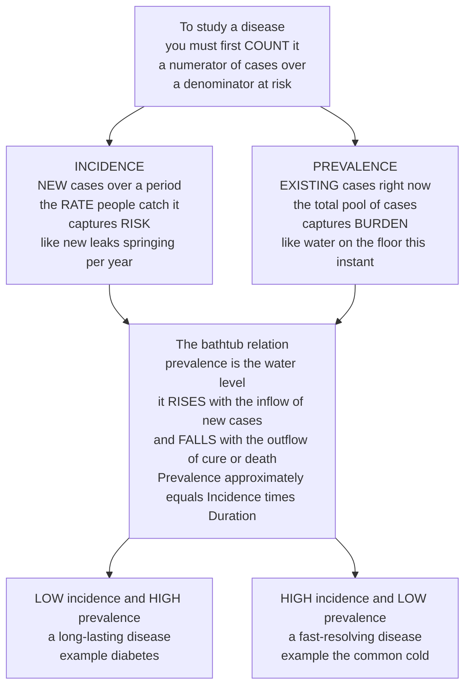

# 📊 Measures of Disease Frequency

> [!abstract] TL;DR
> Before you can study, compare, or control a disease, you have to **count** it — and a raw count is almost useless: 500 cases means catastrophe in a village of 600 and a rounding error in a city of 5 million. Every honest measure is therefore a **numerator** (cases, defined by a **case definition**) over a **denominator** (the **population at risk**). Two measures dominate because they answer two different questions. **Incidence** counts *new* cases appearing over a period — the *rate* at which people catch the disease, capturing **risk** — and comes in two flavours: **cumulative incidence** (new cases ÷ population at risk, a probability over a fixed period) and the **incidence rate** (new cases ÷ **person-time**, which handles varying follow-up and open populations). **Prevalence** counts *existing* cases at a moment — the total pool, capturing **burden**. Their relationship is the **bathtub**: `Prevalence ≈ Incidence × Duration`. Prevalence rises with inflow (new cases) and falls with outflow (cure or death), so a slow chronic disease pools up a huge prevalence at low incidence (diabetes), while a fast-resolving one barely accumulates (the common cold). Confusing the two — especially using prevalence to study *causes* when survival contaminates it — is among the most consequential errors in all of health statistics.

---

## Intuition

**Analogy first — the leaking bathtub.** Imagine you want to describe "how much disease" a population carries, and picture the disease as water in a bathtub. There are two completely different things you could measure, and they answer different questions. You could count **how fast water is pouring in from the tap** — the number of *new* leaks springing per year. That is **incidence**: the rate at which healthy people are *catching* the disease, and it is the number that captures **risk**. Or you could look at the tub right now and measure **how much water is sitting on the floor at this instant** — the total pool of people who *have* the disease today. That is **prevalence**, and it captures **burden**.

The beautiful part is how the two connect. The water level in the tub — the prevalence — is set by a balance: it **rises with the inflow** (incidence, new cases arriving) and **falls with the outflow** (people leaving the pool by either being cured or dying). So the pool is deep whenever water arrives faster than it drains, and shallow when it drains fast. This immediately explains two situations people constantly confuse. A disease can have **low incidence but high prevalence** if people live with it a long time: diabetes has relatively few *new* cases each year, yet a vast pool of people manage it for decades, so the tub is full. And a disease can have **high incidence but low prevalence** if it resolves fast: the common cold infects almost everyone every year (huge inflow) but each case drains away in a week (huge outflow), so at any instant only a sliver of people are actually sick. Master these two — new cases versus existing cases, risk versus burden, tap versus water-level — and their `Prevalence ≈ Incidence × Duration` relationship, and you can read the number behind almost any statement anyone will ever make about a population's health.

---

## How It Works

### Core Mechanics

1. **Start with a numerator and a denominator.** A frequency measure is never a bare count. You need a clear **case definition** (what exactly counts as "a case" — which symptoms, which test threshold, confirmed vs suspected) to build the **numerator**, and a well-specified **population at risk** — everyone who *could* become a case but has not yet — to build the **denominator**. Getting either wrong corrupts everything downstream.
2. **Incidence measures new cases (risk).** Only people who become cases *during the observation window* count in the numerator, and only people *capable* of becoming cases (not already diseased, not immune) belong in the denominator. Incidence is the epidemiologist's measure of the force pushing people from healthy to sick — the right tool for studying **causes**.
3. **Two ways to express incidence.** **Cumulative incidence** (a.k.a. incidence proportion or *risk*) divides new cases by the population at risk over a **fixed period** — it is a probability between 0 and 1 and needs a stated time frame and, ideally, a closed population followed completely. **Incidence rate** (incidence density) divides new cases by the total **person-time** at risk — it has units of cases per person-time and gracefully handles people who join late, drop out, or are followed for different lengths of time.
4. **Prevalence measures existing cases (burden).** **Point prevalence** is the proportion of the population that *has* the disease at a single instant; **period prevalence** counts everyone who had it at any time during an interval. Prevalence is a **proportion, not a rate** — there is no time in the denominator, only a snapshot.
5. **The bathtub links them.** In a steady state, `Prevalence ≈ Incidence × Duration`: the pool level equals the inflow times how long each case lingers. This is why chronic long-duration diseases accumulate high prevalence and acute or rapidly fatal ones do not — and why **prevalence is a treacherous measure for studying causes**, since anything that lengthens survival inflates prevalence without changing risk.
6. **Cousins of incidence.** The **mortality rate** is just the incidence of *death*; the **case-fatality rate** is deaths among diagnosed cases (a measure of severity); **attack rate** is cumulative incidence during an outbreak. All obey the same numerator-over-denominator logic.

### Flow / Architecture



---

## Key Concepts

### Secondary Level

- **A count alone lies; you always need a denominator.** "There were 500 cases" tells you nothing until you ask *out of how many people*. Five hundred in a village of 600 is a disaster; 500 in a city of 5 million is barely visible. Every real measure is **cases divided by the population that could have gotten sick**.
- **Incidence = new cases = risk.** How many people *caught* the disease during the year? This is the tap filling the tub, and it tells you how dangerous the world is right now.
- **Prevalence = existing cases = burden.** How many people *have* the disease at this moment? This is the water level, and it tells you how much the health system must cope with today.
- **The bathtub explains the paradox.** Prevalence rises when new cases arrive and falls when people recover or die. So diabetes (few new cases, but everyone lives with it for decades) has **low incidence yet high prevalence**, while a cold (everyone catches it, but it is gone in a week) has **high incidence yet low prevalence**. Same two diseases, opposite pictures — depending entirely on how long each case lasts.

### Undergraduate Level

Pin down the two forms of each measure and the person-time idea that makes rates work.

- **Case definition and population at risk.** Before any arithmetic you must decide what counts as a case and who is eligible to become one. A woman with a hysterectomy is not "at risk" of uterine cancer and must leave the denominator; someone already diseased or already immune is not at risk of a *new* case. Denominator errors are silent and deadly.
- **Cumulative incidence (risk / incidence proportion).** `CI = new cases / population at risk` over a stated period. It is a **probability**, dimensionless, bounded between 0 and 1, and *meaningless without a time frame* ("a 5% risk" — over what, a year or a lifetime?). It assumes a **closed population** followed completely; loss to follow-up breaks it.
- **Incidence rate (incidence density).** `IR = new cases / total person-time at risk`. **Person-time** sums each individual's time contributed while still at risk: 100 people followed 1 year, or 200 followed half a year, both give 100 person-years. The rate has **units** (cases per person-year), is *not* bounded by 1, and correctly handles staggered entry, censoring, and dynamic ("open") populations where people come and go.
- **Attack rate.** In an outbreak, cumulative incidence over the (short) epidemic period — e.g., the fraction of a wedding party that fell ill. The **secondary attack rate** measures spread among the contacts of primary cases, a direct read on transmissibility.
- **Point vs period prevalence.** Point prevalence = cases at an instant ÷ population; period prevalence = anyone with the disease during an interval ÷ population. Both are **proportions, not rates** — no time appears in the denominator.
- **The relationship, roughly.** In steady state, `Prevalence ≈ Incidence rate × mean Duration`. If 100 new cases appear per year and each case lasts on average 10 years, roughly 1000 prevalent cases accumulate; halve the duration and you halve the pool at the *same* incidence.

### Graduate Level

- **The exact steady-state identity.** More precisely, `P / (1 − P) = IR × D̄` — the *odds* of prevalence equals the incidence rate times mean duration. When prevalence is low, `1 − P ≈ 1` and this collapses to the familiar `P ≈ IR × D̄`. The identity assumes a stationary population with incidence and duration roughly constant over time.
- **Why prevalence is biased for etiologic research (prevalence-incidence / Neyman bias).** Since `Prevalence = Incidence × Duration`, any factor that prolongs **duration** — better treatment, gentler disease course, longer survival — inflates prevalence *without touching risk*. So a cross-sectional prevalence study of causes silently mixes determinants of *getting* the disease with determinants of *surviving* it (a form of **survivor bias**). Rapidly fatal cases are underrepresented in the prevalent pool because they die before they can be counted. **Incidence is the correct measure for studying causation;** prevalence measures burden and is driven by prognosis as much as by risk.
- **Rate ↔ risk conversion.** Under a constant hazard `λ` (the incidence rate) over time `t`, cumulative incidence `= 1 − e^(−λt)`; for small `λt` this is approximately `λt`. This exponential-survival link (a competing-risks / Kaplan-Meier idea) is why person-time rates and fixed-period risks are two views of the same hazard, and why you cannot quote a cumulative incidence without a time horizon.
- **Mortality and case-fatality, disentangled.** The **mortality rate** is the incidence of death in the whole population (a rate, per person-time). The **case-fatality rate (CFR)** is deaths *among diagnosed cases* — a proportion over the disease course, measuring severity/virulence, not population burden. Both differ from the **infection-fatality rate (IFR)**, which uses *all* infected (including undiagnosed) as the denominator; CFR overstates lethality whenever mild cases go uncounted.
- **Crude vs specific vs standardized.** A **crude** rate lumps the whole population; **specific** rates stratify (age-, sex-, cause-specific); **standardized/adjusted** rates reweight to a reference population so that two groups with different age structures can be fairly compared — the machinery of confounding-by-age, developed in the standardization companion note.
- **Data sources and their failure modes.** Incidence typically comes from **cohort studies** and **disease registries** (e.g., cancer registries) that track new diagnoses over person-time; prevalence comes from **cross-sectional surveys**. **Vital statistics** (birth/death registration) supply mortality; **notifiable-disease surveillance** supplies reportable-condition counts. Every source is vulnerable to **denominator error** (census undercount, migration) and **numerator error** (incomplete case **ascertainment**, under-reporting, and — most insidiously — **case-definition drift**, where changing diagnostic criteria or better testing manufactures artefactual trends).

---

## Python Demo

```python
# Measures of disease frequency, from first principles, with numpy + matplotlib.
# (a) THE BATHTUB: prevalence builds to a steady state = incidence x duration.
#     SAME inflow of new cases, but a chronic (long-duration) disease pools up a
#     huge prevalence while an acute (short-duration) one barely accumulates.
# (b) THE EPIDEMIC CURVE: incidence (new cases per day) over an outbreak, and the
#     cumulative incidence (risk / attack rate) rising to its final plateau.
import numpy as np
import matplotlib.pyplot as plt

fig, (ax1, ax2) = plt.subplots(1, 2, figsize=(14, 5.2))

# ----------------------------------------------------------------------
# (a) Incidence-Prevalence "bathtub" model.
#     dP/dt = (new cases per year)  -  P / (mean duration)
#     Inflow = incidence (tap); outflow = P/duration (drain via cure or death).
#     Steady state:  P* = incidence_flow x duration   ->  Prevalence = Inc x Dur
# ----------------------------------------------------------------------
dt = 0.01
t = np.arange(0, 40, dt)                      # 40 years
inflow = 100.0                                # NEW cases per year -- SAME for both
durations = {"Chronic  D = 10 yr": 10.0, "Acute  D = 0.5 yr": 0.5}

for label, D in durations.items():
    P = np.zeros_like(t)
    for k in range(1, len(t)):
        dP = inflow - P[k - 1] / D            # inflow (incidence) minus outflow
        P[k] = P[k - 1] + dP * dt
    steady = inflow * D                       # analytic steady state = Inc x Dur
    line, = ax1.plot(t, P, lw=2.5, label=f"{label}   ->  P* = {steady:.0f}")
    ax1.axhline(steady, ls="--", lw=1, color=line.get_color(), alpha=0.5)

ax1.set_title("The bathtub:  Prevalence = Incidence x Duration\n"
              "same inflow of 100 new cases/yr, wildly different prevalence")
ax1.set_xlabel("Time (years)")
ax1.set_ylabel("Prevalent cases (pool / water level)")
ax1.legend()
ax1.grid(alpha=0.3)

# ----------------------------------------------------------------------
# (b) Epidemic curve via a simple SIR outbreak.
#     Incidence = NEW infections each day (beta*S*I/N)   -> the epidemic curve
#     Cumulative incidence (risk) = (N - S) / N          -> rises to the attack rate
# ----------------------------------------------------------------------
N = 10_000
beta, gamma = 0.55, 0.25                      # R0 = beta/gamma = 2.2
days = 150
S, I, R = N - 5.0, 5.0, 0.0
new_cases = np.zeros(days)
cum_inc = np.zeros(days)

for d in range(days):
    infections = beta * S * I / N             # incidence: NEW cases today
    recoveries = gamma * I
    S -= infections
    I += infections - recoveries
    R += recoveries
    new_cases[d] = infections
    cum_inc[d] = (N - S) / N                   # cumulative incidence = risk so far

weeks = np.arange(days) / 7.0
ax2.bar(weeks, new_cases, width=1 / 7, color="#e8590c", alpha=0.65,
        label="Incidence: new cases/day (epidemic curve)")
ax2.set_xlabel("Time (weeks)")
ax2.set_ylabel("New cases per day  (incidence)", color="#e8590c")
ax2.tick_params(axis="y", labelcolor="#e8590c")
ax2.set_title("Epidemic curve  +  cumulative incidence\n"
              f"final attack rate = {cum_inc[-1]:.0%} of the population at risk")
ax2.legend(loc="upper left", fontsize=8)

ax2b = ax2.twinx()                            # second y-axis for the rising risk
ax2b.plot(weeks, cum_inc * 100, color="#1c7ed6", lw=2.5,
          label="Cumulative incidence (risk / attack rate)")
ax2b.set_ylabel("Cumulative incidence (%)", color="#1c7ed6")
ax2b.tick_params(axis="y", labelcolor="#1c7ed6")
ax2b.set_ylim(0, 100)
ax2b.legend(loc="center right", fontsize=8)

plt.tight_layout()
plt.show()

# --- Console: the steady-state check and the attack rate --------------------
for label, D in durations.items():
    print(f"{label:20s}  P* = incidence x duration = {inflow * D:6.0f} prevalent cases")
print(f"Outbreak final attack rate (cumulative incidence) = {cum_inc[-1]:.1%}")
# Chronic  D = 10 yr   P* = incidence x duration =   1000 prevalent cases
# Acute  D = 0.5 yr    P* = incidence x duration =     50 prevalent cases
# Outbreak final attack rate (cumulative incidence) ~ 82.6%
```

**What it shows.** Panel (a) is the bathtub made literal: two diseases receive the *identical* inflow of 100 new cases per year, yet the chronic one (each case lasting 10 years) pools up to a steady-state prevalence of **1000**, while the acute one (each case lasting half a year) plateaus at just **50** — a 20-fold gap in *burden* produced entirely by *duration*, not by *risk*. The dashed lines confirm the analytic prediction `P* = Incidence × Duration`. Panel (b) separates the two time-views of incidence during an outbreak: the orange **epidemic curve** is the incidence (new cases each day, which rises, peaks, and falls as susceptibles run out), while the blue line is the **cumulative incidence** — the running *risk*, or **attack rate**, climbing to its final plateau of roughly 83% of the population at risk. One figure, both the tap-vs-water-level distinction and the incidence-over-time vs cumulative-risk distinction.

---

## Real-World Applications

- **Cancer registries and SEER.** National cancer registries report **incidence rates** (new diagnoses per 100,000 **person-years**, age-standardized) to track whether cancer is becoming more common, and **prevalence** (people living with a cancer diagnosis) to plan survivorship and oncology-service capacity. The two are reported separately precisely because they answer different questions — trend in risk vs current burden.
- **The Framingham Heart Study.** The archetypal **cohort** design: thousands of residents followed for decades, contributing **person-time**, so cardiovascular events could be counted as an incidence rate and the very concept of a "risk factor" (blood pressure, cholesterol, smoking) could be established from *incident* — not prevalent — disease.
- **HIV in the antiretroviral era.** A textbook lesson in the bathtub: after effective treatment arrived, HIV **prevalence rose** even as **incidence fell**, because therapy dramatically lengthened **duration** (survival). Rising prevalence here was *good news* — fewer deaths draining the pool — a direct warning against reading prevalence as epidemic intensity.
- **COVID-19 metrics.** The pandemic made these definitions front-page news: daily **incidence** (the epidemic curve), **cumulative incidence / attack rate** (share ever infected, via serosurveys), and the fierce debate between **case-fatality rate** (deaths ÷ confirmed cases, inflated when mild cases go untested) and **infection-fatality rate** (deaths ÷ *all* infected). The gap between CFR and IFR is entirely a denominator problem.
- **Cross-sectional surveys (NHANES).** National health surveys measure the **prevalence** of hypertension, obesity, and diabetes at a snapshot — ideal for quantifying burden and planning services, but by design unable to establish incidence or cause, since they capture survivors of the disease, not new-onset cases.

---

## Common Pitfalls

- **Confusing incidence and prevalence.** Using prevalence to judge whether an epidemic is *growing*, or to study *causes*. A treatment that keeps patients alive **raises** prevalence while lowering mortality — so falling deaths and rising prevalence can be the *same* good news, not a worsening outbreak.
- **Using prevalence for etiology (Neyman / prevalence-incidence bias).** Because prevalence = incidence × duration, a cross-sectional causal study silently confounds *getting* the disease with *surviving* it; rapidly fatal cases are missing from the prevalent pool. For causes, use **incidence** from a cohort.
- **A numerator with no denominator — or the wrong one.** Quoting raw case counts, or dividing by a population that includes people not actually at risk (men in a uterine-cancer rate, the already-immune, the already-diseased). The denominator must be *the population that could become a new case*.
- **Mixing risk and rate.** Treating a **cumulative incidence** (a probability that *requires* a stated time frame) as if it were an **incidence rate** (per person-time, with units and unbounded above 1), or quoting a "rate" with no time in it. They are different quantities; the constant-hazard bridge `risk = 1 − e^(−rate × time)` connects them only under assumptions.
- **Ignoring person-time and loss to follow-up.** Computing risk as cases ÷ *initial* population when people enter late, drop out, or die of other causes. Varying follow-up demands **person-time** (or survival methods); otherwise the estimate is biased.
- **Case-definition drift mistaken for a real trend.** Broadening diagnostic criteria, or simply testing more people, mechanically increases counted cases. A jump in incidence or prevalence may be an artefact of *how you counted*, not a change in the disease itself.

---

## Related Concepts

This note anchors the **Foundations of Epidemiology** section, and its siblings extend it directly (read them in sequence). The section opener, **Epidemiology and Public Health Overview**, frames the whole discipline of studying disease distribution and determinants that these measures quantify. **Measures of Association and Effect** builds *on top of* frequency: once you can count disease in two groups (exposed vs unexposed), you divide or subtract those incidences to get relative risk, risk difference, and the odds ratio — associations are ratios *of* the incidences defined here. **Populations, Rates and Standardization** takes the crude rates introduced here and shows how to compare populations with different age structures fairly, resolving confounding-by-age. **Natural History of Disease and Prevention Levels** supplies the timeline (susceptibility → subclinical → clinical → outcome) that *defines* when a "new case" begins and how long its "duration" runs — the biology behind the bathtub's inflow and outflow. And **Surveillance and Disease Monitoring** is the operational machinery that continuously produces the numerators and denominators these measures consume.

Cross-vault links (Glob-verified):

- [[Health_Nutrition_and_Longevity/06_Public_Health_and_Prevention/Public_Health_and_Epidemiology|Public Health and Epidemiology]] — the population-lens parent that deploys incidence and prevalence within the John Snow tradition and the four levels of prevention.
- [[Clinical_Medicine/06_Clinical_Reasoning_and_Modern_Medicine/Medical_Testing_and_Diagnostics|Medical Testing and Diagnostics]] — **prevalence is the base rate** that governs a test's predictive value; the frequency of disease is exactly what makes a positive result trustworthy or a false alarm.
- [[Health_Nutrition_and_Longevity/01_Foundations_of_Health/Biomarkers_and_Measuring_Health|Biomarkers and Measuring Health]] — the individual-measurement layer beneath population case ascertainment; how a "case" is operationally detected before it can be counted.
- [[Mathematics/06_Probability_and_Statistics/Probability_Theory|Probability Theory]] — cumulative incidence *is* a probability, and the person-time incidence rate is a hazard, linked by the exponential-survival relation.

---

## Review Questions

**Secondary.** In your own words, explain the difference between **incidence** and **prevalence** using the bathtub picture. Then explain why diabetes can have *low* incidence but *high* prevalence, while the common cold has *high* incidence but *low* prevalence. Which of the two would you look at to decide how many hospital beds a disease needs today, and which to decide how dangerous it is to catch this year?

**Undergraduate.** A closed cohort of 500 disease-free people is followed for 5 years. During that time 40 develop the disease; of those, 10 developed it in year 1, and 30 people were lost to follow-up at various points. (a) Estimate the 5-year **cumulative incidence** and state the assumption it requires. (b) Explain why an **incidence rate** using **person-time** would be a more honest measure here, and describe how you would tally the person-time. (c) If the disease is chronic and never fatal, sketch what happens to its **prevalence** in the surrounding population over the next few decades and why.

**Graduate.** A newspaper reports that "the prevalence of condition X has doubled in 20 years" and concludes the population is getting sicker. Using the relationship `Prevalence ≈ Incidence × Duration`, give **three distinct** ways prevalence could double with *no increase in risk whatsoever*, and name the bias that makes prevalence the wrong measure for studying the *causes* of X. Then explain the difference between the **case-fatality rate** and the **infection-fatality rate** for a novel pathogen, and why early-outbreak CFR estimates are almost always too high.

---

## Sources

- Gordis, L. *Epidemiology* (6th ed.). Elsevier. — Chapters on "Measuring the Occurrence of Disease: Incidence and Prevalence." [https://www.elsevier.com/books/gordis-epidemiology/celentano/978-0-323-55229-5](https://www.elsevier.com/books/gordis-epidemiology/celentano/978-0-323-55229-5)
- Rothman, K. J. *Epidemiology: An Introduction* (2nd ed.). Oxford University Press. — "Measuring Disease Occurrence and Causal Effects" (risk, incidence rate, person-time). [https://global.oup.com/academic/product/epidemiology-9780199754557](https://global.oup.com/academic/product/epidemiology-9780199754557)
- Szklo, M., & Nieto, F. J. *Epidemiology: Beyond the Basics* (4th ed.). Jones & Bartlett. — Measures of disease frequency and the incidence-prevalence-duration relationship. [https://www.jblearning.com/catalog/productdetails/9781284116595](https://www.jblearning.com/catalog/productdetails/9781284116595)
- Centers for Disease Control and Prevention. *Principles of Epidemiology in Public Health Practice* (3rd ed.), Lesson 3: "Measures of Risk." [https://www.cdc.gov/csels/dsepd/ss1978/lesson3/index.html](https://www.cdc.gov/csels/dsepd/ss1978/lesson3/index.html)

---

#epidemiology #incidence #prevalence #disease-frequency #person-time
