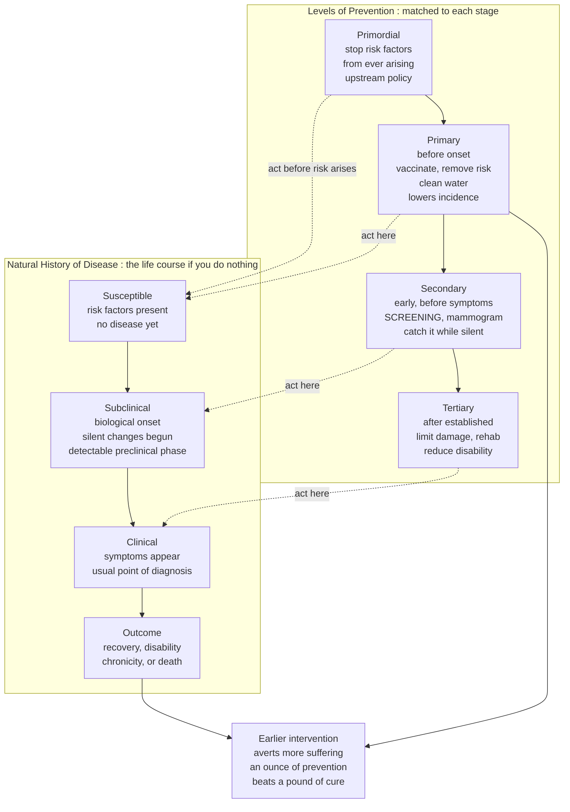

# 🩺 Natural History of Disease and Levels of Prevention

> [!abstract] TL;DR
> Every disease has a **life story** — a *natural history* — that unfolds in stages if left alone: from a **susceptible** person, through a **hidden preclinical phase** where the biology has quietly gone wrong but no symptom shows, into the **clinical phase** of overt illness, and finally to an **outcome** (recovery, disability, chronic illness, or death). The strategic insight of public health is that you can **intervene at different points in that story**, and each point defines a **level of prevention**: **primary** stops the disease before it ever begins (vaccinate, remove the risk, clean the water), **secondary** catches it early in its silent phase (screening — a mammogram before you feel the lump), and **tertiary** limits the damage once it is established (rehab after a stroke). This simple, powerful map — matching the intervention to the stage — organizes *all* of public-health strategy, and it is why an ounce of prevention beats a pound of cure: the earlier you act in the natural history, the more suffering you avert.

---

## Intuition

**Analogy: a boulder rolling downhill.** Picture a disease as a boulder perched at the top of a slope. Left untouched, it starts to roll, gathers speed, and eventually crashes into the valley, doing maximum damage. You can intervene at three very different moments. **Primary prevention** is a wedge you place *before the boulder ever moves* — it never rolls, so no damage occurs; this is the ideal, because the disease simply never happens. **Secondary prevention** is catching the boulder *while it is still moving slowly*, just after it has begun to roll but before it has picked up momentum — harder than the wedge, but you can still stop it cheaply and with little harm. **Tertiary prevention** is what you do *once the boulder is already crashing* — you cannot un-crash it, but you can limit the wreckage, clear the debris, and rebuild. The genius is recognizing that the same threat calls for completely different tools depending on *where in its journey* you meet it.

Translated into the body: the "rolling" is the biological progression of disease over time. **Primary** acts before biological onset by removing the cause or boosting resistance. **Secondary** exploits the *detectable preclinical phase* — the window after the disease has begun but before symptoms appear, when a screening test can find it and early treatment works better. **Tertiary** acts in established disease, managing complications so the person lives longer and better. Intuition first, math later: know the *stages*, and you know *where the levers are*.

---

## How It Works

### Core Mechanics

**1. The natural history is the disease's timeline without intervention.** Epidemiology begins by asking how a disease progresses *if you do nothing*. Four stages map that course:

- **Susceptibility.** Risk factors are present (genes, exposures, behaviors) but the disease has not begun. A smoker with healthy lungs; a person with a high-salt diet and normal arteries.
- **Subclinical / preclinical.** **Biological onset** has occurred — pathologic changes have begun — but there are no symptoms yet. If a test can detect the disease during this silent window, that window is the **detectable preclinical phase (DPCP)**, and it is the entire basis of screening.
- **Clinical.** Symptoms appear. This is the *usual* point of diagnosis in ordinary medicine, because it is when the patient notices something is wrong and seeks care.
- **Outcome / resolution.** The disease resolves into recovery, disability, chronicity, or death.

**2. Key time points punctuate the timeline.** *Exposure* → *biological onset* → *detectable point* (test first turns positive) → *symptom onset / clinical diagnosis* → *outcome*. The gap between exposure and disease is the **incubation period** for infectious disease and the **latency period** for chronic disease (which can run for decades — asbestos to mesothelioma, HPV to cervical cancer).

**3. Most disease is an iceberg.** For nearly every condition, the **subclinical cases vastly outnumber the diagnosed clinical ones** — the *spectrum of disease* or "clinical iceberg." Mild, silent, and self-limiting cases hide beneath the surface; the severe cases the clinic sees are the visible tip. This is why population surveillance sees a very different disease than a hospital ward.

**4. Each level of prevention is glued to a stage.** Because the stages are distinct, the interventions are distinct:

- **Primordial prevention** — stop the *risk factors themselves* from ever arising (upstream, societal): food policy, walkable cities, clean-air regulation, so obesity and smoking never take hold.
- **Primary prevention** — prevent *disease onset* in already-exposed people by removing the cause or boosting resistance: **vaccination**, sanitation and clean water, seatbelts, smoking cessation, diet. It acts *before biological onset* and it lowers **incidence** (fewer people ever enter the disease at all).
- **Secondary prevention** — **early detection and prompt treatment** in the detectable preclinical phase, to halt or slow progression: **screening** (mammography, Pap smear, blood-pressure and HbA1c checks) plus early intervention. It does not stop onset, but it shifts detection *earlier*, improving outcomes and reducing the prevalence of *advanced* disease.
- **Tertiary prevention** — reduce complications, disability, and suffering in *established* disease: cardiac rehab, diabetic foot care, stroke recovery, disease management. It improves quality of life and lowers disability without preventing the disease itself.
- **Quaternary prevention** — protect patients from **over-medicalization**: unnecessary tests, overdiagnosis, and overtreatment that cause net harm.

**5. The "ounce of prevention" logic — upstream usually wins.** The earlier you intervene, the cheaper, safer, and more effective it tends to be, because you are averting the disease rather than repairing its wreckage. This is the strategic backbone: aim upstream where possible.

**6. Two prevention strategies, and Rose's paradox.** For any risk factor you can pursue a **high-risk strategy** (find and treat the small number in the dangerous tail — targeted and medically satisfying) or a **population strategy** (shift the *whole distribution* slightly — a small drop in everyone's blood pressure or salt intake). Geoffrey Rose's **prevention paradox**: a *large number of people at small risk* usually generate *more total cases* than the small number at high risk, so the population strategy prevents more disease — yet it delivers little visible benefit to any single participant, which makes it politically hard.

### Flow / Architecture



---

## Key Concepts

### Secondary Level

- **Natural history of disease.** The story of how a disease unfolds over time in a person if nobody intervenes: healthy → hidden early changes → symptoms → outcome.
- **The four stages.** *Susceptible* (at risk, not sick) → *subclinical* (the body has started to go wrong but you feel fine) → *clinical* (symptoms appear) → *outcome* (get better, become disabled, or die).
- **The three levels of prevention.** *Primary* stops disease before it starts (vaccines, clean water, seatbelts). *Secondary* catches it early before you notice (screening — a mammogram). *Tertiary* limits the damage once you have it (rehab, disease management).
- **Why earlier is better.** The sooner you act in the story, the less suffering there is — "an ounce of prevention is worth a pound of cure." Stopping a disease is better than curing it.
- **Screening.** Testing healthy-seeming people to find hidden disease early, while it is easier to treat — the everyday face of secondary prevention.

### Undergraduate Level

- **The detectable preclinical phase (DPCP).** The window after biological onset but before symptoms during which a *test* can detect disease. Screening only works if this phase exists and is long enough to catch. Its length sets how often you must screen.
- **Incubation vs latency period.** Time from exposure to first appearance of disease — short and sharp for infectious disease (**incubation**, days to weeks), long and creeping for chronic disease (**latency**, years to decades). Latency is *why* chronic-disease primary prevention pays off only after long delay.
- **The clinical iceberg / spectrum of disease.** Diagnosed clinical cases are the visible tip; subclinical, mild, and asymptomatic cases (which still transmit, for infectious disease) form the submerged bulk. Surveillance that counts only clinical cases systematically undercounts true burden.
- **Prevention mapped to incidence vs prevalence.** Primary prevention lowers **incidence** (fewer new cases ever enter). Secondary and tertiary prevention mostly change **prevalence** and the *mix of severity* — secondary reduces advanced-stage prevalence by catching disease early; tertiary, by keeping people alive with managed disease, can even *raise* prevalence while lowering mortality.
- **Primordial and quaternary prevention.** Beyond the classic three: **primordial** targets the emergence of risk factors themselves (societal, upstream), and **quaternary** guards against the harms of over-medicalization — overdiagnosis and overtreatment.
- **Lead time.** Screening moves the moment of diagnosis *earlier* along the natural history by an interval called the **lead time**. Whether that earlier diagnosis actually postpones death — or merely lengthens the time you *know* you are sick — is the crux of evaluating secondary prevention.

### Graduate Level

- **Rose's two strategies and the prevention paradox.** The **high-risk strategy** (screen-and-treat the tail) is targeted, ethically comfortable, and cost-contained, but leaves the majority of cases untouched because most cases arise from the large low-risk middle. The **population strategy** (shift the whole distribution) prevents more total disease but confers negligible benefit on any one individual — the *prevention paradox* — and so meets resistance despite superior population impact. The choice is not purely technical; it is a values decision about who bears risk and who bears cost.
- **Screening's built-in biases.** Because secondary prevention is evaluated by outcomes among the screen-detected, three biases can make a *useless* program look lifesaving. **Lead-time bias**: survival measured from an earlier diagnosis is longer even if death is not postponed. **Length-time bias**: screening preferentially catches slow, indolent disease (which spends longer in the DPCP), so screen-detected cases look more survivable than they are. **Overdiagnosis**: detecting "disease" that would never have caused symptoms or death — the extreme of length bias — inflating apparent incidence and cure rates while harming the overdiagnosed. Randomized trials with *mortality* (not survival) endpoints are the only clean defense.
- **Wilson–Jungner and the ethics of screening the well.** Screening a healthy population is justified only when the disease is serious and common enough, has a recognizable **detectable preclinical phase**, has a **treatment that works better when started early**, and has a test whose benefit clearly exceeds its harms (false positives, anxiety, overdiagnosis). Absent early-treatment advantage, earlier detection just extends the "sick" label without helping — the central hazard of secondary prevention.
- **Natural history as the substrate of intervention design.** Every prevention decision is implicitly a claim about *where in the natural history* the lever sits and *how modifiable* that point is. A long DPCP invites screening; a long latency rewards early primary prevention; a natural history dominated by disability (not death) shifts the payoff toward tertiary care. Mapping the timeline *is* the strategy.
- **Infectious vs chronic natural histories.** Infectious disease has a compressed timeline (exposure → incubation → symptomatic-and-infectious → resolution or death) where *transmission during the subclinical/infectious phase* couples one person's natural history to the whole population's — the domain of R0 and herd immunity. Chronic disease has a decade-long, multifactorial, often silent history where the same four-stage frame still holds but the levers (behavior, environment, screening) act over years.
- **Where this frame sits in the vault.** The natural history and levels of prevention are the *organizing spine* of public-health strategy: they connect **disease measurement** (incidence, prevalence — see the sibling *Measures_of_Disease_Frequency*) to **intervention** (screening, prevention programs, policy). Downstream siblings — *Screening_Programs_and_Early_Detection*, *Health_Promotion_and_Disease_Prevention*, and *Chronic_Disease_and_Lifestyle_Epidemiology* — are all elaborations of one stage or one level of this single map, introduced in the *Epidemiology_and_Public_Health_Overview*.

---

## Python Demo

```python
# Natural history of disease and where each level of prevention acts.
# (a) The natural-history timeline for one individual, with the four stages,
#     the key time points, the detectable preclinical phase that screening
#     exploits, and arrows marking where primary/secondary/tertiary act.
# (b) Population impact: how intervening at each level reshapes outcomes --
#     primary prevents cases (fewer ever enter), secondary catches disease
#     early (better outcomes), tertiary limits damage among the established.
import numpy as np
import matplotlib.pyplot as plt

# ----- (a) NATURAL HISTORY TIMELINE ------------------------------------
t = np.linspace(0, 12, 600)

t_exposure   = 1.0    # risk exposure begins
t_bio_onset  = 3.0    # biological onset: subclinical phase starts
t_detectable = 4.0    # test first turns positive: DPCP begins
t_symptom    = 7.0    # clinical symptoms: usual point of diagnosis
t_outcome    = 10.0   # outcome resolved

def disease_burden(time):
    """Pathologic burden: ~0 before biological onset, then a logistic rise."""
    logistic = 1.0 / (1.0 + np.exp(-(time - 6.5)))
    return np.where(time < t_bio_onset, 0.0, logistic)

burden = disease_burden(t)

fig, (ax1, ax2) = plt.subplots(1, 2, figsize=(14, 5.5))

ax1.plot(t, burden, color="#0f766e", lw=2.8, label="disease burden (untreated)")

# detectable preclinical phase: the window screening exploits
ax1.axvspan(t_detectable, t_symptom, color="#f59e0b", alpha=0.18,
            label="detectable preclinical phase")

# clinical horizon: the symptom threshold
ax1.axhline(disease_burden(np.array([t_symptom]))[0], color="#9ca3af",
            ls=":", lw=1.3)
ax1.text(0.15, disease_burden(np.array([t_symptom]))[0] + 0.02,
         "symptom threshold", fontsize=8, color="#6b7280")

# key time points
for tp, name in [(t_exposure, "exposure"), (t_bio_onset, "biological\nonset"),
                 (t_detectable, "detectable\npoint"), (t_symptom, "symptom onset\n(diagnosis)"),
                 (t_outcome, "outcome")]:
    ax1.axvline(tp, color="#94a3b8", ls="--", lw=0.9)
    ax1.text(tp, 1.04, name, rotation=0, ha="center", va="bottom", fontsize=7.5)

# stage bands along the bottom
stages = [(0, t_bio_onset, "Susceptible", "#dbeafe"),
          (t_bio_onset, t_symptom, "Subclinical", "#fde68a"),
          (t_symptom, t_outcome, "Clinical", "#fecaca"),
          (t_outcome, 12, "Outcome", "#e5e7eb")]
for x0, x1, label, color in stages:
    ax1.axvspan(x0, x1, ymin=0.0, ymax=0.06, color=color)
    ax1.text((x0 + x1) / 2, 0.015, label, ha="center", va="center", fontsize=8)

# where each prevention level acts
ax1.annotate("PRIMARY\nacts before onset", xy=(t_bio_onset, 0.02), xytext=(1.6, 0.55),
             fontsize=8.5, color="#166534", ha="center",
             arrowprops=dict(arrowstyle="->", color="#166534"))
ax1.annotate("SECONDARY\nscreening in the DPCP", xy=(5.0, disease_burden(np.array([5.0]))[0]),
             xytext=(4.9, 0.86), fontsize=8.5, color="#b45309", ha="center",
             arrowprops=dict(arrowstyle="->", color="#b45309"))
ax1.annotate("TERTIARY\nlimit damage after onset", xy=(8.5, disease_burden(np.array([8.5]))[0]),
             xytext=(9.0, 0.45), fontsize=8.5, color="#991b1b", ha="center",
             arrowprops=dict(arrowstyle="->", color="#991b1b"))

ax1.set_title("Natural history of disease: stages and intervention points")
ax1.set_xlabel("Time (arbitrary units)")
ax1.set_ylabel("Disease burden (0 = healthy, 1 = severe)")
ax1.set_ylim(0, 1.12)
ax1.legend(loc="center left", fontsize=8)
ax1.grid(alpha=0.25)

# ----- (b) POPULATION IMPACT OF EACH PREVENTION LEVEL ------------------
N = 100_000                      # population followed over a period
base_incidence = 0.20            # baseline: 20% ever develop the disease

# outcome split among the DISEASED: [recovered/mild, disabled, died]
outcomes = {
    "No prevention":              (base_incidence, [0.40, 0.35, 0.25]),
    "Primary\n(vaccinate / risk)": (0.12,          [0.40, 0.35, 0.25]),  # fewer ENTER
    "Secondary\n(screening)":      (base_incidence, [0.65, 0.25, 0.10]),  # caught EARLY
    "Tertiary\n(rehab / manage)":  (base_incidence, [0.45, 0.20, 0.15]),  # damage LIMITED
}

labels      = list(outcomes.keys())
never       = np.array([N * (1 - inc)                for inc, _ in outcomes.values()])
recovered   = np.array([N * inc * s[0]               for inc, s in outcomes.values()])
disabled    = np.array([N * inc * s[1]               for inc, s in outcomes.values()])
died        = np.array([N * inc * s[2]               for inc, s in outcomes.values()])

x = np.arange(len(labels))
ax2.bar(x, never,     label="Never diseased", color="#86efac")
ax2.bar(x, recovered, bottom=never, label="Recovered / mild", color="#60a5fa")
ax2.bar(x, disabled,  bottom=never + recovered, label="Disabled / complications", color="#fbbf24")
ax2.bar(x, died,      bottom=never + recovered + disabled, label="Died", color="#f87171")

for i in range(len(labels)):
    ax2.text(i, N + 1500, f"deaths\n{int(died[i]):,}", ha="center", fontsize=8, color="#991b1b")

ax2.set_title("Population outcomes by level of prevention (N = 100,000)")
ax2.set_ylabel("People")
ax2.set_xticks(x)
ax2.set_xticklabels(labels, fontsize=8.5)
ax2.set_ylim(0, N * 1.10)
ax2.legend(loc="lower right", fontsize=8)
ax2.grid(axis="y", alpha=0.25)

plt.tight_layout()
plt.savefig("natural_history_and_prevention.png", dpi=120, bbox_inches="tight")

# ----- printed summary -------------------------------------------------
print("Deaths per 100,000 by strategy (same disease, different lever):")
for lbl, d in zip(labels, died):
    print(f"  {lbl.splitlines()[0]:22s} -> {int(d):5,d} deaths")
```

**What it shows.** The left panel draws one person's disease as a rising burden curve and pins the four stages beneath it. The shaded band is the **detectable preclinical phase** — the only window where screening can work — and the three arrows show *where* each level of prevention reaches into the timeline: primary *before* onset, secondary *inside* the silent window, tertiary *after* symptoms. The right panel makes the strategic difference concrete across 100,000 people. **Primary** prevention shrinks the diseased slice entirely (fewer ever enter — the whole green "never diseased" block grows), driving deaths from 5,000 to 3,000. **Secondary** prevention leaves incidence unchanged but reshuffles outcomes toward recovery by catching disease early, halving deaths to 2,000. **Tertiary** prevention cannot stop the disease but limits its damage, trading deaths and disability for recovery among the already-ill. Same disease, three levers, three very different population outcomes — the entire logic of matching prevention to the stage.

---

## Real-World Applications

- **Cervical cancer — all three levels at once.** *Primary*: the HPV vaccine stops infection before it can ever cause disease. *Secondary*: the Pap smear and HPV DNA test exploit a famously long detectable preclinical phase (years of pre-cancerous dysplasia) to catch and remove lesions before invasion. *Tertiary*: surgery, radiation, and palliation for established cancer. It is the textbook demonstration that one disease is attacked at every stage of its natural history.
- **Cardiovascular disease.** *Primordial* (food and tobacco policy so risk factors never arise) and *primary* (statins, blood-pressure control, smoking cessation) act before onset; *secondary* is population blood-pressure and lipid screening in the silent phase; *tertiary* is cardiac rehab and secondary-drug therapy after a heart attack. The **Framingham** risk-factor concept exists precisely to locate people early in this natural history.
- **HIV.** A natural history with a long asymptomatic phase turned it into a chronic disease: *primary* prevention via PrEP and condoms, *secondary* via routine testing that finds infection in its silent window, *tertiary* via antiretroviral therapy that halts progression and, by suppressing viral load, loops back to primary prevention (treatment-as-prevention).
- **Cholera and clean water.** John Snow's removal of the Broad Street pump handle (1854) is primary prevention in its purest form — remove the cause (contaminated water) *before* the disease can begin — and the sanitary revolution that followed drained more mortality from cities than any cure.
- **Diabetic complication management.** *Tertiary* prevention in action: HbA1c control, retinal screening, and foot care do not cure diabetes but prevent blindness, amputation, and renal failure — converting a disease of catastrophic complications into a managed chronic condition.

---

## Common Pitfalls

- **Confusing tertiary prevention with treatment.** Tertiary prevention *is* care of established disease, but the framing matters: its goal is preventing *complications and disability*, not merely relieving symptoms. Losing that framing collapses the whole ladder into "treatment" and hides the strategic point that earlier levels avert more.
- **Assuming earlier detection always helps (lead-time bias).** Moving diagnosis earlier lengthens measured *survival* even when death is not postponed. Screening looks lifesaving on survival curves while doing nothing — only *mortality* endpoints from randomized trials settle it. Earlier is not automatically better.
- **Screening a disease with no usable detectable preclinical phase.** Secondary prevention is impossible if there is no silent, detectable window, or if early treatment is no better than late. Screening for such a disease generates false positives and overdiagnosis with no offsetting benefit.
- **Overdiagnosis mistaken for success.** Catching indolent "disease" that would never have harmed the patient inflates apparent incidence and cure rates while harming the overdiagnosed — the failure mode Wilson–Jungner and quaternary prevention exist to prevent.
- **Ignoring the prevention paradox.** Concluding a population strategy "does not work" because no individual feels a benefit — when in aggregate it prevents the most cases. The gain is real but diffuse, spread thinly across everyone.
- **Reading incidence effects into the wrong measure.** Primary prevention lowers *incidence*; secondary and tertiary act on *prevalence* and severity. A successful tertiary program that keeps patients alive longer *raises* prevalence while lowering mortality — which looks like failure if you watch prevalence alone.
- **Treating latency as absence.** A decades-long latency (asbestos, HPV, tobacco) means today's clinical cases reflect exposures from a generation ago and today's prevention pays off only decades hence — a mismatch that repeatedly under-motivates upstream action.

---

## Related Concepts

This note is the strategic spine of the **Foundations of Epidemiology** section. Its sibling notes each elaborate one piece of this single map: the *Epidemiology_and_Public_Health_Overview* frames the whole discipline; *Measures_of_Disease_Frequency* supplies the incidence and prevalence that quantify where prevention bites; *Screening_Programs_and_Early_Detection* is a deep dive on secondary prevention and its lead-time and length-time biases; *Health_Promotion_and_Disease_Prevention* expands primary and primordial prevention; and *Chronic_Disease_and_Lifestyle_Epidemiology* applies the long-latency natural history to non-communicable disease. (These siblings are referenced in prose as the vault fills in.)

Cross-vault connections (verified to exist):

- [[Etiology_and_Mechanisms_of_Disease]] — the pathophysiology that *drives* the natural history; biological onset and progression are the clinical view of the same timeline epidemiology tracks at population scale. *(Clinical Medicine vault)*
- [[Medical_Testing_and_Diagnostics]] — the sensitivity, specificity, and predictive-value machinery that determines whether a screening test can actually exploit the detectable preclinical phase. *(Clinical Medicine vault)*
- [[Determinants_of_Health]] — the upstream "causes of the causes" that primordial and primary prevention target before any disease begins. *(Health, Nutrition & Longevity vault)*
- [[Public_Health_and_Epidemiology]] — the broader population-health frame in which the four levels of prevention and the epidemiologic method sit. *(Health, Nutrition & Longevity vault)*
- [[Infectious_Disease_Vaccines_and_Immunity]] — the compressed infectious natural history where subclinical transmission couples individuals, and vaccination is primary prevention at population scale. *(Health, Nutrition & Longevity vault)*
- [[Vaccines_and_Antibiotics]] — the immunology behind primary prevention: how vaccines block disease before biological onset and how herd immunity breaks transmission chains. *(Biology vault)*

---

## Review Questions

### Secondary

1. Using the boulder-rolling-downhill analogy, explain the difference between primary, secondary, and tertiary prevention. Which one keeps the boulder from ever moving?
2. Name the four stages of the natural history of disease in order, and give an everyday example of a person in each stage for heart disease.
3. What is screening, and which level of prevention does it belong to? Why is it better to find a disease before you feel any symptoms?

### Undergraduate

1. Define the **detectable preclinical phase** and explain why its existence and length determine whether — and how often — a screening program can work. Give one disease with a long DPCP and one with essentially none.
2. Primary prevention lowers *incidence* while tertiary prevention can *raise* prevalence. Explain this apparent paradox using the relationship between incidence, prevalence, and disease duration.
3. Distinguish the incubation period from the latency period, and explain how each shapes the *timing* of when a prevention effort pays off. Why does a 30-year latency chronically under-motivate upstream action?

### Graduate

1. A new screening test shows that screen-detected patients survive far longer than symptom-detected patients. Before concluding the program saves lives, name and explain the **three biases** that could produce this result with no true mortality benefit, and state the study design that would settle the question.
2. Contrast Rose's **high-risk** and **population** strategies for reducing stroke via blood-pressure control. Why does the population strategy usually prevent more total disease, why does it deliver little visible benefit to any individual (the prevention paradox), and how does that tension bear on the ethics of mandates versus nudges?
3. You are handed the natural history of a novel chronic disease: a 10-year silent detectable phase, a treatable early stage, and an outcome dominated by disability rather than death. Argue which level(s) of prevention you would prioritize and why, referencing the Wilson–Jungner criteria and the risk of overdiagnosis.

---

## Sources

- Gordis, L. (Celentano, D. D., & Szklo, M., eds.). *Epidemiology* (6th ed.). Elsevier — chapters on the natural history of disease and the prevention framework.
- Centers for Disease Control and Prevention. *Principles of Epidemiology in Public Health Practice* (3rd ed.), Lesson 1: "Natural History and Spectrum of Disease." [https://www.cdc.gov/csels/dsepd/ss1978/lesson1/section9.html](https://www.cdc.gov/csels/dsepd/ss1978/lesson1/section9.html)
- Leavell, H. R., & Clark, E. G. (1965). *Preventive Medicine for the Doctor in His Community* — the original three-level (primary/secondary/tertiary) prevention framework. McGraw-Hill.
- Rose, G. (1992). *The Strategy of Preventive Medicine*. Oxford University Press. (See also Rose, G. (1985). "Sick Individuals and Sick Populations." *Int. J. Epidemiol.* 14(1), 32–38. [https://doi.org/10.1093/ije/14.1.32](https://doi.org/10.1093/ije/14.1.32))
- Wilson, J. M. G., & Jungner, G. (1968). *Principles and Practice of Screening for Disease*. WHO Public Health Papers No. 34. [https://apps.who.int/iris/handle/10665/37650](https://apps.who.int/iris/handle/10665/37650)

---

#epidemiology #natural-history #prevention #primary-secondary-tertiary #public-health
