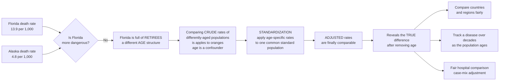

# 📊 Populations, Rates, and Standardization

> [!abstract] TL;DR
> Epidemiology's unit of analysis is the **population**, and its currency is the **rate** — cases divided by the population-time at risk. The trap is that a **crude rate** (one number for the whole population) is silently distorted by the population's **composition** — above all its **age structure** — because age is such a powerful driver of disease and death that an *older* population looks "sicker" even when it is not. This makes comparing crude rates between differently-aged populations meaningless — famously, Florida has a far higher death rate than Alaska not because Florida is dangerous but because it is full of retirees. The fix is **standardization (age-adjustment)**: a bookkeeping trick that asks "what would each population's rate be *if* they shared the same age structure?" **Direct standardization** applies each population's *age-specific rates* to one common **standard population**; **indirect standardization** applies a standard's rates to each population's structure, yielding the **Standardized Mortality Ratio (SMR = observed ÷ expected)**. Adjusted rates are *artificial* — valid only for comparison — but they are the essential tool for honestly comparing countries, tracking a disease across decades as populations age, and evaluating hospitals without penalizing those who treat older, sicker patients. Their absence is behind a huge fraction of misleading health comparisons.

---

## Intuition

**Analogy — the Florida vs Alaska paradox.** Here is a puzzle that has fooled many: Florida has a far higher **death rate** than Alaska. Is Florida more dangerous to your health? Should you flee the beaches for the tundra? **No.** Florida is full of **retirees**, and old people die at higher rates *everywhere*. The two states have wildly different **age structures**, and age is such an overwhelming driver of death and disease that comparing their overall (**crude**) death rates is comparing **apples to oranges**. A population's "sickness" as measured by a crude rate is polluted by *who lives there*, not just *how healthy they are*.

This is one of epidemiology's most important and counterintuitive lessons, and the fix is a clever piece of accounting called **standardization**. It asks a single hypothetical question: *what would each population's death rate be if they all had the same age structure?* You take each population's **age-specific rates** (the death rate among the young, the middle-aged, the old — measured separately) and apply them to one common **standard population**. The result is an **age-adjusted rate**: an artificial number, meaningless in absolute terms, but finally **comparable** across populations. Run this on Florida and Alaska and the ranking can *flip* — revealing whether Florida is genuinely healthier or sicker once the age difference is stripped away.

And this is not a mere technicality. The same distortion corrupts almost every fair comparison in population health: comparing **countries** (Japan is old, Nigeria is young), tracking a **disease over decades** (a nation's cancer rate can "rise" purely because the nation aged), and evaluating a **hospital** that might look "worse" only because it takes the sickest patients. Age-standardization — and the broader idea of *adjusting* for the differing makeup of populations — is the tool that lets epidemiologists compare populations honestly.

---

## How It Works

### Core Mechanics

1. **The population is the unit.** Clinical medicine treats the patient; epidemiology studies the **population** — the *distribution* of health across a group. You must first define the **population at risk**: who is actually eligible to develop the outcome (a rate of uterine cancer excludes men). Populations are **fixed** (a closed cohort, everyone enrolled at once and followed) or **dynamic** (an open population people enter and leave — a city, a nation), which changes how you count the denominator (person-time).

2. **A rate has three parts.** `rate = events ÷ population-at-risk × multiplier`. The multiplier (per 1,000, per 100,000) just makes the number readable. The denominator is the whole game: get the population at risk wrong and the rate is nonsense.

3. **Crude vs specific rates — a fundamental trade-off.** A **crude rate** collapses the entire population into *one* number: simple, but **confounded** by composition. A **specific rate** is measured *within a subgroup* — an **age-specific**, **sex-specific**, or **cause-specific** rate. Specific rates are honest (an age-specific rate compares like-with-like) but there are *many* of them — hard to summarize, hard to compare across dozens of strata at a glance.

4. **The comparability problem is confounding at the population level.** Age both (a) strongly affects the outcome *and* (b) differs between the populations being compared. That is the textbook definition of a **confounder**. The crude rate blends the "true" health difference with the "age-mix" difference and reports their tangled sum. This is exactly the confounding logic that recurs throughout epidemiology — here it strikes at the level of whole populations.

5. **Direct standardization — one summary number, made comparable.** Choose a **standard population** (a fixed age distribution — e.g. the WHO World Standard or the US 2000 Standard). For each population, take *its own* **age-specific rates** and apply them to the *standard's* age structure. The weighted average is the **age-adjusted (directly standardized) rate**. Because every population is now weighted by the *same* age structure, differences in the adjusted rates reflect differences in the *rates*, not the *ages*. Requirement: you need reliable age-specific rates in *each* population.

6. **Indirect standardization and the SMR — when specific rates are unstable.** Sometimes a study population is too small for stable age-specific rates (few deaths per age band → noisy). Flip the procedure: apply a **standard population's age-specific rates** to *your* population's age structure to get the number of deaths you'd **expect** if your population were "average." Then

   > SMR = observed deaths ÷ expected deaths (often ×100).

   An **SMR > 100** means more deaths than expected (worse than the standard); **< 100** means fewer (better). This is the workhorse for **occupational cohorts** (are uranium miners dying more than expected?) and small-area comparisons.

7. **Adjusted rates are artificial.** A directly standardized rate depends on the chosen standard — switch standards and the *number* changes (though the ranking is usually stable). Adjusted rates have **no absolute meaning**; they exist *only* to compare. Always report the standard used, and never hand a patient an "age-adjusted" risk.

8. **The same idea generalizes.** Standardization is **stratify-then-recombine**: split into strata where comparison is fair, then reweight to a common standard. Push this further and you arrive at **regression adjustment** — putting age (and other confounders) into a statistical model — which is the continuous, multivariable descendant of standardization.

### Flow / Architecture



---

## Key Concepts

### Secondary (intuitive core)

- **Population at risk** — the group actually able to develop the outcome; it is the denominator of every rate.
- **Rate** — how *often* something happens, per unit of population: `events ÷ population × multiplier`.
- **Crude rate** — one rate for the *whole* population. Simple, but misleading when populations differ in makeup.
- **The age trap** — older populations show higher death and chronic-disease rates *everywhere*, so a high crude rate can just mean "old," not "unhealthy."
- **Standardization** — the fix: recompute rates *as if* every population had the same age structure, so they can be compared fairly.

### Undergraduate (mechanism)

- **Specific rates** — rates within a stratum: **age-specific**, **sex-specific**, **cause-specific**. Honest but numerous.
- **Confounding by composition** — age satisfies both confounder criteria (affects the outcome *and* differs between populations), so crude comparisons are biased.
- **Direct standardization** — apply *each population's* age-specific rates to a *common standard population* → **age-adjusted rate**. Needs age-specific rates everywhere.
- **Indirect standardization / SMR** — apply a *standard's* age-specific rates to *each population's* structure → **expected** cases; **SMR = observed ÷ expected**. Used when age-specific rates are sparse or unstable.
- **Choice of standard** — WHO World Standard, US 2000 Standard, European Standard; the choice shifts absolute values but rarely the ranking.
- **Fixed vs dynamic populations** — closed cohort vs open population; determines how person-time is counted.

### Graduate (subtlety and connections)

- **Standardization = a special case of regression** — a saturated stratified model reweighted to a target distribution; the modern generalization is **direct/model-based standardization** and **g-computation** in causal inference.
- **Direct vs indirect, formally** — direct standardization is a *rate* under a common weighting; the SMR is a *ratio* of internally-weighted rates, so two populations' SMRs are **not strictly comparable to each other** (each is weighted by its *own* structure) — a subtle but real pitfall.
- **Precision vs bias trade-off** — indirect standardization borrows strength from the standard's stable rates, reducing variance at the cost of comparability; direct standardization is unbiased for comparison but noisy in small strata.
- **Multiple standards, multiple confounders** — you can standardize on age *and* sex jointly, or on comorbidity (**case-mix adjustment**); the curse of dimensionality then forces you toward regression.
- **Demographic backdrop** — the **population pyramid**, **life expectancy** from the life table, and the **demographic transition** explain *why* age structures diverge across countries and eras — the very differences standardization exists to neutralize.

---

## Python Demo

```python
# The Florida vs Alaska paradox, made concrete.
# Two populations with the SAME size but very different AGE structures.
# "Florida" is healthier at EVERY age (lower age-specific rates) yet has a
# much HIGHER crude death rate -- purely because it is older.
# We show how CRUDE rates mislead, then fix it with DIRECT standardization
# and confirm with INDIRECT standardization (the SMR).

import numpy as np
import matplotlib.pyplot as plt

# --- Age-specific mortality rates (deaths per 1,000 per year) ---------------
# Florida is LOWER than Alaska in every single age band (genuinely healthier).
age_groups = ["0-44", "45-64", "65+"]
rate_FL = np.array([1.0, 5.0, 40.0])   # Florida-like: retiree-heavy but healthier per age
rate_AK = np.array([1.5, 6.0, 45.0])   # Alaska-like:  young but higher rate per age

# --- Population age structure (people in each age band) ---------------------
pop_FL = np.array([400_000, 300_000, 300_000])   # OLD population   (1,000,000 total)
pop_AK = np.array([700_000, 250_000,  50_000])   # YOUNG population (1,000,000 total)

# --- 1. CRUDE rate = total deaths / total population ------------------------
deaths_FL = pop_FL * rate_FL / 1000.0
deaths_AK = pop_AK * rate_AK / 1000.0
crude_FL = deaths_FL.sum() / pop_FL.sum() * 1000
crude_AK = deaths_AK.sum() / pop_AK.sum() * 1000

# --- 2. DIRECT standardization ---------------------------------------------
# Apply EACH population's age-specific rates to ONE common standard population.
pop_std = np.array([550_000, 275_000, 175_000])          # the chosen standard structure
adj_FL = (pop_std * rate_FL / 1000.0).sum() / pop_std.sum() * 1000
adj_AK = (pop_std * rate_AK / 1000.0).sum() / pop_std.sum() * 1000

# --- 3. INDIRECT standardization / SMR -------------------------------------
# Apply a STANDARD set of age-specific rates to each population's structure
# to get EXPECTED deaths; SMR = observed / expected (x100).
rate_std = np.array([1.2, 5.5, 42.0])                    # standard age-specific rates
exp_FL = (pop_FL * rate_std / 1000.0).sum()
exp_AK = (pop_AK * rate_std / 1000.0).sum()
SMR_FL = deaths_FL.sum() / exp_FL * 100
SMR_AK = deaths_AK.sum() / exp_AK * 100

print(f"CRUDE     : Florida {crude_FL:5.2f}   Alaska {crude_AK:5.2f}   -> Florida looks WORSE (2.9x)")
print(f"ADJUSTED  : Florida {adj_FL:5.2f}   Alaska {adj_AK:5.2f}   -> Alaska is actually WORSE")
print(f"SMR       : Florida {SMR_FL:5.1f}   Alaska {SMR_AK:5.1f}   (100 = as expected)")
# CRUDE     : Florida 13.90   Alaska  4.80   -> Florida looks WORSE (2.9x)
# ADJUSTED  : Florida  8.93   Alaska 10.35   -> Alaska is actually WORSE
# SMR       : Florida  94.4   Alaska 111.2   (100 = as expected)

# --- Visualize --------------------------------------------------------------
fig, (ax1, ax2) = plt.subplots(1, 2, figsize=(12, 5))

x, w = np.arange(2), 0.35
ax1.bar(x - w/2, [crude_FL, crude_AK], w, label="Crude",        color="#d1495b")
ax1.bar(x + w/2, [adj_FL,  adj_AK],   w, label="Age-adjusted",  color="#30638e")
for i, (c, a) in enumerate(zip([crude_FL, crude_AK], [adj_FL, adj_AK])):
    ax1.text(i - w/2, c + 0.2, f"{c:.1f}", ha="center")
    ax1.text(i + w/2, a + 0.2, f"{a:.1f}", ha="center")
ax1.set_xticks(x); ax1.set_xticklabels(["Florida\n(old)", "Alaska\n(young)"])
ax1.set_ylabel("Deaths per 1,000 / year")
ax1.set_title("Crude MISLEADS; adjustment reverses the ranking")
ax1.legend()

ax2.plot(age_groups, rate_FL, "o-", lw=2, label="Florida", color="#d1495b")
ax2.plot(age_groups, rate_AK, "s-", lw=2, label="Alaska",  color="#30638e")
ax2.set_xlabel("Age group")
ax2.set_ylabel("Age-specific death rate (per 1,000)")
ax2.set_title("Florida is LOWER at EVERY age\n(the crude rate lied)")
ax2.legend()

plt.tight_layout()
plt.savefig("standardization.png", dpi=120)
plt.show()

# TAKEAWAY: the crude rate says Florida is ~3x deadlier; both direct
# standardization (8.9 < 10.4) and the SMR (94 < 111) show the OPPOSITE
# once age is held constant. The age-specific curves prove Florida is
# healthier at every age -- the crude comparison was pure confounding.
```

---

## Real-World Applications

- **Comparing mortality across countries and regions.** The WHO and national statistics offices report **age-standardized** death and cancer rates precisely so that aged Japan and youthful Nigeria can be compared. A raw ranking of crude mortality would simply rank countries by how old they are.
- **Tracking a disease over decades.** A nation's *crude* cancer or heart-disease rate can climb for years purely because the population is aging. **Age-adjusted trends** (against a fixed standard) reveal whether the underlying risk is truly rising or falling — the difference between a real epidemic and a demographic artifact.
- **Evaluating hospitals and surgeons — case-mix adjustment.** A cardiac unit that accepts the sickest, oldest referrals will post worse *raw* mortality than a boutique clinic that cherry-picks easy cases. **Risk-adjusted (standardized) mortality** — the hospital analogue of the SMR — is what lets regulators and league tables compare providers without punishing those who serve harder populations.
- **Occupational cohorts and environmental epidemiology.** The **SMR** is the classic tool for asking whether workers in a mine, factory, or exposed community die (or develop cancer) more than the general population *of the same age and sex* — foundational to studies of asbestos, radiation, and shift work.
- **Public-health surveillance dashboards.** Age-standardized rates are the default comparable metric in surveillance systems, letting analysts compare counties, ethnic groups, and time periods on a level footing.

---

## Common Pitfalls

- **Comparing crude rates across populations.** The cardinal sin. If the populations differ in age (or sex, or any strong composition variable), the crude comparison is confounded. *Always* age-adjust before ranking.
- **Reading an adjusted rate as a real risk.** An age-adjusted rate is a fiction constructed against a standard; it does **not** describe any actual person's or population's absolute risk. Never quote it as one, and never omit the standard used.
- **Comparing two SMRs to each other.** Each SMR is internally weighted by its *own* population's age structure, so `SMR_A` and `SMR_B` are each valid against the *standard* but **not strictly comparable to one another**. For head-to-head comparison, use **direct** standardization.
- **Standardizing on the wrong (or too coarse) confounder.** If the true confounder is finer than your age bands, residual confounding leaks through. Broad "0-64 vs 65+" bins can hide large within-band age differences.
- **Unstable age-specific rates.** In small populations, age-specific rates bounce on a handful of deaths, making *direct* standardization noisy — this is exactly when you should switch to **indirect** standardization / the SMR.
- **Ignoring the denominator.** Getting the population-at-risk or person-time wrong (counting the whole population when only a subgroup is eligible) breaks the rate before standardization can even help.

---

## Related Concepts

- [[Public_Health_and_Epidemiology]] — the parent discipline; this note operationalizes its "population lens" and its incidence/prevalence measures into *comparable* rates.
- [[Computational_Demography_and_Human_Mobility]] — supplies the demographic machinery (population pyramids, life tables, fertility–mortality–migration) that *creates* the divergent age structures standardization neutralizes.
- [[The_Science_of_Aging_and_Longevity]] — explains *why* age is such an overwhelming driver of mortality and disease, the biological fact that makes age-adjustment indispensable.
- [[Regression_and_Correlation]] — the continuous, multivariable generalization of standardization; putting age into a model is stratify-and-reweight taken to its limit.
- [[Statistical_Inference]] — supplies the confidence intervals and hypothesis tests that quantify whether a difference in adjusted rates or an SMR is real or noise.
- [[Health_Inequality_and_Medical_Sociology]] — where these adjusted rates get interpreted: disparities across class, race, and place that survive age-adjustment are the sociological heart of population health.

**Foundations siblings (this vault, forthcoming):** this note sits alongside *Measures of Disease Frequency* (incidence, prevalence, and the rates standardized here), *Measures of Association and Effect* (risk ratios and differences built on these rates), *Confounding and Effect Modification* (the general theory of which age-standardization is a first, concrete instance), *The Epidemiologic Transition and Burden of Disease* (how age structures and cause-of-death profiles shift over history), and *Global Health and International Epidemiology* (where cross-country standardized comparison is the daily bread).

---

## Review Questions

1. **(Secondary)** Florida has a higher crude death rate than Alaska, yet Florida is not more dangerous to live in. Explain in one paragraph why the crude comparison is misleading and what standardization does to fix it.
2. **(Undergraduate)** You are handed the *age-specific* death rates and the *age structure* for two countries. Walk through how you would compute each country's **directly standardized** death rate, and state precisely why the two adjusted numbers are comparable while the crude numbers are not.
3. **(Undergraduate)** A study of 400 factory workers finds 30 deaths over the follow-up. Using the general population's age-specific rates, you calculate 24 **expected** deaths. Compute the SMR, interpret it, and explain why you used *indirect* rather than *direct* standardization here.
4. **(Graduate)** Two occupational cohorts report SMRs of 140 and 115. A colleague concludes the first workplace is "more hazardous." Why is directly comparing these two SMRs unsound, and what analysis would you run instead to compare the cohorts to each other?
5. **(Graduate)** In what sense is age-standardization a special case of **regression adjustment**, and at what point (in confounders or strata) does regression become the more practical tool? Connect this to the broader confounding-control logic of epidemiology.

---

## Sources

- Gordis, L. *Epidemiology* (6th ed.), Elsevier — Ch. "More on Risk: Estimating the Potential for Prevention" and the treatment of comparing rates and standardization (direct and indirect).
- Szklo, M. & Nieto, F. J. *Epidemiology: Beyond the Basics* (4th ed.), Jones & Bartlett — Ch. 7, adjustment and standardization of rates.
- Rothman, K. J. *Epidemiology: An Introduction* (2nd ed.), Oxford University Press — standardization, the SMR, and confounding at the population level.
- CDC, *Principles of Epidemiology in Public Health Practice* (3rd ed.), Lesson 3 — "Measures of Risk," including **age adjustment** (direct and indirect methods and the standard population).
- Curtin, L. R. & Klein, R. J. *Direct Standardization (Age-Adjusted Death Rates)*, US National Center for Health Statistics, Healthy People Statistical Notes.

---

#epidemiology #age-standardization #crude-rates #adjusted-rates #SMR
