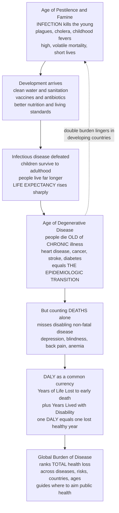

# 🌍 The Epidemiologic Transition and Burden of Disease

> [!abstract] TL;DR
> For almost all of human history the great killers were **infectious** — plagues, cholera, childhood fevers — and most deaths struck the **young**. As societies developed, clean water, vaccines, antibiotics, and better nutrition defeated the germs, so people stopped dying young from infection and instead lived long enough to die **old** of **chronic** disease: heart disease, cancer, stroke, diabetes, dementia. That great shift in a population's dominant cause of death is the **epidemiologic transition** (Omran, 1971), and every developing country is somewhere along it — many now carrying a **double burden** of both at once. But counting *deaths alone* misses the enormous burden of diseases that **disable without killing** (depression, blindness, back pain). So epidemiologists built a common currency for *all* health loss: the **DALY** (Disability-Adjusted Life Year) = **Years of Life Lost** to premature death **+ Years Lived with Disability**. The **Global Burden of Disease** studies use DALYs to rank what actually harms humanity most — revealing that mental illness and musculoskeletal pain cause far more suffering than death counts suggest, and telling public health where to aim.

---

## Intuition

**Analogy — the killers changed while nobody was watching.** Imagine two graveyards. In the first, from the year 1700, walk the rows and read the headstones: a stillborn infant, a five-year-old lost to measles, a mother dead in childbirth, a whole family taken by cholera in one summer. Death here is a thief who steals *children* — sudden, infectious, everywhere. Now walk the second graveyard, from the year 2020, in a wealthy country: the stones read 78, 84, 91; the causes are heart attack, cancer, stroke, Alzheimer's. Death is now a slow visitor who calls on the *old*. Between those two graveyards, humanity did something extraordinary — clean water, vaccines, antibiotics, and full plates defeated the infectious diseases that had culled the young for all of history. People stopped dying young of germs and started living long enough to die old of **chronic** disease. That reversal is the **epidemiologic transition**.

But now a measurement problem appears. If you only tally *headstones* — deaths — you completely miss the person who is alive but blind, the one crippled by back pain, the one who has spent thirty years inside a depression. These conditions rarely kill, yet they consume lives. So epidemiologists invented a brilliant accounting trick: a single unit that adds **years of life a disease steals by killing you early** to **years of healthy life it steals by disabling you while alive**. That unit is the **DALY** — one lost healthy year — and it lets you put a fatal heart attack, a case of blindness, and a bout of depression on the *same ruler*. Add the DALYs across every disease, risk factor, and country, and you get the **Global Burden of Disease**: humanity's balance sheet of suffering, and the map of where to spend the next health dollar.

---

## How It Works

### Core Mechanics

**1. The transition is a shift in the *shape* of death, not just its amount.** In the pre-transition "age of pestilence and famine," mortality is high and volatile (famines and epidemics spike the death rate), lives are short, and the deaths are concentrated in **infants and children** and driven by **communicable** disease. As sanitation, nutrition, and later vaccines and antibiotics arrive, the epidemic peaks recede and childhood survival soars. People now reach old age — where the dominant causes become **non-communicable, degenerative** diseases (cardiovascular disease, cancer, diabetes, dementia). The disease profile inverts even though the population *grows*.

**2. It rides alongside the demographic transition.** Falling death rates (especially infant mortality) precede falling birth rates, so populations first *grow* then *age*. An aging population mechanically shifts burden toward chronic disease, because those are diseases of long life. Epidemiologic and demographic transitions are two faces of "development."

**3. The modern picture is messier than a clean one-way street.** Middle-income countries often carry a **double burden**: infectious disease (TB, malaria, diarrheal disease) has not yet gone, while chronic disease (driven by a *nutrition transition* toward calorie-dense diets, tobacco, and urban sedentary life) is already surging. Add **re-emerging** and **new** infections (HIV, drug-resistant TB, COVID-19) and it is clear the transition can stall, reverse locally, or layer stages on top of each other.

**4. Deaths are only half the story — you must measure *disability* too.** A death is easy to count. But most of the disease that people *experience* is non-fatal: depression, low-back pain, anemia, vision and hearing loss, migraine. **Mortality** (who dies) and **morbidity** (who is sick or impaired) are different accounts, and a health system that optimizes only the first will systematically neglect the largest sources of lived suffering.

**5. The DALY is the common currency that fuses them.** For each cause you compute two components and add them:

- **YLL — Years of Life Lost** to premature death = number of deaths × the remaining life expectancy at the age of death (measured against an aspirational reference — e.g. a standard life expectancy of ~86 years). Dying at 30 loses more years than dying at 80.
- **YLD — Years Lived with Disability** = number of prevalent cases × a **disability weight** (0 = perfect health, 1 = equivalent to death) × duration. Blindness might carry a weight near 0.19, severe depression near 0.66.
- **DALY = YLL + YLD.** One DALY = one lost year of healthy life. **Lower is better** — you want to *avert* DALYs.

**6. QALYs are the mirror image, used in economics.** The **QALY** (Quality-Adjusted Life Year) measures healthy years *gained* by an intervention (weight 1 = full health, 0 = death) — **higher is better**, and you *maximize* QALYs per dollar. DALYs are for measuring *burden*; QALYs are for evaluating *interventions* (see health economics). Same idea, opposite sign.

**7. The Global Burden of Disease (GBD) puts it all together.** IHME and WHO estimate DALYs, deaths, YLLs, and YLDs for hundreds of diseases and injuries, dozens of **risk factors**, every country, both sexes, all age groups, across decades — a single comparable ledger. Because it counts *disability*, it reveals conditions that death tolls hide: mental disorders and musculoskeletal pain rank among the very largest burdens on Earth despite rarely appearing on a death certificate.

### Flow / Architecture



---

## Key Concepts

### 🟢 Secondary (intuitive foundation)

- **The killers changed.** In the past, infections killed children; today, in rich countries, chronic diseases kill the elderly. That flip is the **epidemiologic transition**.
- **Why it happened.** Clean water, sanitation, vaccines, antibiotics, and enough food beat back the germs — so people survived to old age, where different diseases wait.
- **Life expectancy rose** from roughly the mid-40s to near 80 in developed nations over about a century — one of the greatest achievements in human history.
- **Deaths are not the whole story.** Some diseases (depression, blindness, chronic pain) rarely kill but ruin years of life. Counting only deaths hides them.
- **The DALY** is one number that combines *years lost to dying early* with *years spent sick or disabled*, so we can compare very different diseases fairly.
- **Double burden:** many developing countries fight infectious *and* chronic disease at the same time.

### 🟡 Undergraduate (mechanisms and formalism)

- **Omran's stages (1971):** (1) *Age of pestilence and famine* — high mortality, infectious, deaths in the young; (2) *Age of receding pandemics* — epidemics recede, life expectancy climbs; (3) *Age of degenerative and man-made diseases* — chronic non-communicable disease dominates. Later authors add a 4th stage of *delayed degenerative diseases* (heart disease and cancer pushed into ever-older ages by treatment).
- **Parallel demographic transition:** falling infant mortality → population growth → later fertility decline → **population aging**, which mechanically raises chronic-disease burden.
- **Mortality vs morbidity;** **incidence vs prevalence** (prevalence ≈ incidence × duration — long-lived chronic disease accumulates high prevalence).
- **DALY decomposition:** `DALY = YLL + YLD`, where `YLL = deaths × (reference life expectancy − age at death)` and `YLD = prevalence × disability weight × duration`.
- **Disability weights** anchor a condition between 0 (full health) and 1 (death); they convert "sick years" into "death-equivalent years."
- **QALY vs DALY:** QALYs are *gained health* (maximize) used in cost-effectiveness; DALYs are *lost health* (minimize) used to describe burden. `Cost per DALY averted` and `cost per QALY gained` are the workhorse metrics of health economics.
- **Global Burden of Disease (GBD):** the IHME/WHO enterprise producing comparable DALY estimates across all causes, risks, ages, sexes, geographies, and years.

### 🔴 Graduate (subtleties, critique, frontiers)

- **Disability weights are value judgments.** Original GBD weights came from expert **person trade-off** exercises; GBD 2010 re-derived them from large **general-population surveys** using paired comparisons — shifting many values and exposing how "how bad is blindness vs deafness" is a *social* estimate, not a biological constant.
- **Age weighting and discounting.** Early DALYs weighted a year of young-adult life more heavily and discounted future years at 3%. GBD 2010 **dropped both**, materially changing rankings (e.g. raising the relative burden of childhood and old-age conditions). Any burden ranking is conditional on these methodological choices.
- **Reference life expectancy for YLL** is aspirational (the lowest observed age-specific mortality worldwide), so YLL measures loss against *what is achievable*, not local life expectancy — a deliberate equity choice.
- **Risk-factor attribution** via **comparative risk assessment** and **population attributable fraction (PAF)** re-slices the same DALYs by *cause of the cause* (high blood pressure, tobacco, high BMI, air pollution, dietary risks), enabling primary-prevention priority-setting rather than disease-by-disease treatment.
- **Contested stage models:** proposed 4th/5th stages (delayed degenerative diseases; a stage of *health regression, social upheaval, and re-emergent infection*), the **nutrition transition**, and the observation that transitions are non-linear, reversible, and unequal within countries.
- **GBD estimation machinery:** redistribution of "garbage codes," Bayesian meta-regression (DisMod-MR) to enforce internal consistency among incidence/prevalence/mortality, and explicit uncertainty intervals — the numbers are *modeled estimates*, not censuses.
- **The ecological trap:** country-level transition profiles describe *populations*, not individuals, and mask within-country inequality (a poor district may sit a full stage behind a wealthy one in the same nation).

---

## Python Demo

```python
# The epidemiologic transition and the burden of disease, in two pictures:
#  (a) TRANSITION  : as a society develops, the composition of deaths shifts from
#                    infectious/communicable (falling) to chronic/non-communicable
#                    (rising), while life expectancy climbs.
#  (b) DALY BURDEN : DALYs = Years of Life Lost (YLL, from early death)
#                          + Years Lived with Disability (YLD = prevalence x weight x duration).
#                    Ranking causes by DEATHS alone vs by DALYs reshuffles the picture:
#                    disabling-but-rarely-fatal conditions (depression, back pain) jump up.
import numpy as np
import matplotlib.pyplot as plt

# ----------------------------------------------------------------------
# (a) EPIDEMIOLOGIC TRANSITION over ~120 years of development
# ----------------------------------------------------------------------
years = np.arange(1900, 2025, 5)

# Infectious/communicable share of all deaths: high early, falls as a society
# develops (logistic decline). Injuries roughly flat; chronic is the remainder.
infectious = 0.08 + 0.60 / (1.0 + np.exp((years - 1945) / 12.0))
injuries   = 0.10 * np.ones_like(years, dtype=float)
chronic    = 1.0 - infectious - injuries          # non-communicable, degenerative

# Life expectancy climbs from the mid-40s toward ~80 (logistic rise).
life_exp = 47.0 + 33.0 / (1.0 + np.exp(-(years - 1950) / 18.0))

# ----------------------------------------------------------------------
# (b) BURDEN OF DISEASE — stylised DALY components (millions of years)
# ----------------------------------------------------------------------
causes = np.array(["Heart disease", "Stroke", "Cancers", "Diabetes",
                   "Road injury", "Low back pain", "Depression", "Anxiety"])
# YLL dominates for fatal diseases; YLD dominates for disabling, rarely-fatal ones.
yll = np.array([185, 130, 165, 45, 68,  3,  6,  1], dtype=float)   # early-death years
yld = np.array([ 18,  22,  15, 42, 14, 68, 58, 46], dtype=float)   # disability years
daly = yll + yld

order_deaths = np.argsort(yll)        # rank by deaths (YLL) alone
order_daly   = np.argsort(daly)       # rank by total DALYs (YLL + YLD)

# ----------------------------------------------------------------------
# Plot
# ----------------------------------------------------------------------
fig = plt.figure(figsize=(14, 10))
ax1 = fig.add_subplot(2, 2, (1, 2))   # top row: the transition
ax2 = fig.add_subplot(2, 2, 3)        # bottom-left: ranking by deaths
ax3 = fig.add_subplot(2, 2, 4)        # bottom-right: ranking by DALYs

# --- (a) stacked area of death composition + life-expectancy line ---
ax1.stackplot(years, chronic, infectious, injuries,
              labels=["Chronic / non-communicable", "Infectious / communicable", "Injuries"],
              colors=["#c0392b", "#2980b9", "#7f8c8d"], alpha=0.85)
ax1.set_ylabel("Share of all deaths")
ax1.set_xlabel("Year (development over time)")
ax1.set_title("(a) The Epidemiologic Transition: infectious deaths fall, chronic deaths rise")
ax1.set_ylim(0, 1)
ax1.legend(loc="center left", fontsize=8)

axL = ax1.twinx()                      # life expectancy on the right axis
axL.plot(years, life_exp, color="black", lw=2.5, ls="--", label="Life expectancy")
axL.set_ylabel("Life expectancy (years)")
axL.set_ylim(40, 85)
axL.legend(loc="lower right", fontsize=8)

# --- (b) ranking by DEATHS (YLL) alone ---
y = np.arange(len(causes))
ax2.barh(y, yll[order_deaths], color="#2980b9")
ax2.set_yticks(y)
ax2.set_yticklabels(causes[order_deaths])
ax2.set_xlabel("Years of Life Lost (millions)")
ax2.set_title("Ranking by DEATHS alone (YLL)")

# --- (b) ranking by DALYs (YLL + YLD) — disability included ---
ax3.barh(y, yll[order_daly], color="#2980b9", label="YLL (early death)")
ax3.barh(y, yld[order_daly], left=yll[order_daly], color="#e67e22", label="YLD (disability)")
ax3.set_yticks(y)
ax3.set_yticklabels(causes[order_daly])
ax3.set_xlabel("DALYs (millions)")
ax3.set_title("Ranking by DALYs (YLL + YLD): depression & back pain climb")
ax3.legend(loc="lower right", fontsize=8)

plt.tight_layout()
plt.show()

# Quick numeric check: which causes gain the most rank when disability is counted?
rank_deaths = {c: r for r, c in enumerate(causes[order_deaths][::-1])}  # 0 = worst
rank_daly   = {c: r for r, c in enumerate(causes[order_daly][::-1])}
print("Cause            deaths-rank -> DALY-rank")
for c in causes:
    print(f"{c:15s}   {rank_deaths[c]:>2d}       ->   {rank_daly[c]:>2d}")
```

**What you see.** Panel (a): the blue infectious band collapses while the red chronic band swells and life expectancy (dashed) climbs — the transition in one frame. Panels (b): ranked by deaths, cardiovascular disease and cancers dominate and mental illness barely registers; add the orange **disability** component and depression and low-back pain leap up the ranking — exactly the reframing that DALYs and the Global Burden of Disease deliver.

---

## Real-World Applications

- **Global priority-setting (WHO / IHME GBD).** The Global Burden of Disease studies are the world's reference ledger of health loss. Their headline finding — that **mental disorders and musculoskeletal conditions** (led by low-back pain and depression) are among the largest sources of *disability*, despite tiny death tolls — reshaped global health agendas that had long been mortality-fixated.
- **National health planning.** Ministries use country-specific DALY profiles to decide where a stretched budget goes: a nation deep in the double burden must fund malaria bed-nets *and* hypertension clinics simultaneously.
- **Health-economic evaluation.** Agencies compute **cost per DALY averted** (WHO-CHOICE) or **cost per QALY gained** (NICE in the UK) to rank interventions — this is how a country decides whether a new cancer drug, a tobacco tax, or a vaccination campaign buys the most health per dollar (see health economics).
- **Tracking progress and inequality.** DALY trends measure whether a country is advancing through the transition, and comparisons across nations, sexes, and ages expose who is being left behind.
- **Risk-factor targeting.** GBD's attribution of burden to **high blood pressure, tobacco, high BMI, air pollution, and dietary risks** directs *primary* prevention — showing that shifting a few upstream risks averts more DALYs than any single downstream cure.
- **Funding allocation.** Bodies like the Global Fund and Gavi weigh burden estimates when allocating billions toward the diseases and regions where each dollar removes the most suffering.

---

## Common Pitfalls

- **Mistaking deaths for burden.** Ranking health priorities by mortality alone systematically buries the largest sources of *lived* suffering — depression, back pain, sensory loss, anxiety. If you count only headstones, you fund only the diseases that kill quickly. The DALY exists precisely to correct this.
- **Treating the transition as a one-way, universal escalator.** Transitions stall, reverse locally, and layer stages. HIV in southern Africa, COVID-19 everywhere, drug-resistant TB, and the **double burden** all violate the tidy "infectious → chronic and done" story.
- **Assuming disability weights are objective.** A weight of 0.66 for severe depression is a *social value judgment* elicited from surveys, not a measured physical constant. Rankings inherit those value choices — and change when the elicitation method changes (as it did between GBD 1990 and 2010).
- **Forgetting DALYs and QALYs run in opposite directions.** A DALY is *bad* (you minimize it); a QALY is *good* (you maximize it). Mixing them up — "we gained 500 DALYs" — inverts the entire conclusion of a cost-effectiveness analysis.
- **The reference-life-expectancy trap.** YLL is measured against an aspirational standard life table, not local life expectancy. Comparing raw YLL across studies that used different reference tables (or different age-weighting/discounting conventions) compares apples to oranges.
- **Ecological fallacy.** A country's transition stage is a *population* average; it says nothing about a given individual, and it hides steep within-country inequality where a poor region trails a rich one by a whole stage.
- **Reading GBD numbers as census truth.** GBD DALYs are **modeled estimates** with uncertainty intervals, built on redistributed "garbage-code" deaths and Bayesian meta-regression. Quote the interval, not just the point estimate.

---

## Related Concepts

This note anchors the **Foundations of Epidemiology** section. Its siblings extend it directly: the section overview (*Epidemiology and Public Health Overview*) frames the discipline; *Populations, Rates and Standardization* supplies the incidence/prevalence/age-standardization machinery that DALY computation rests on; *Chronic Disease and Lifestyle Epidemiology* picks up the non-communicable diseases that dominate the *post*-transition world; *Global Health and International Epidemiology* explores the double burden and cross-country comparison in depth; and *Health Policy and Economics of Public Health* is where DALYs and QALYs become cost-per-outcome decisions.

Across the vault:

- [[Public_Health_and_Epidemiology]] — the population-health lens and prevention framework this transition story sits inside.
- [[Determinants_of_Health]] — the "causes of the causes" and risk factors to which GBD attributes disease burden.
- [[Global_Health_and_Health_Systems]] — where the double burden and DALY-guided resource allocation play out in practice.
- [[The_Science_of_Aging_and_Longevity]] — the rising life expectancy that *creates* the chronic-disease-of-old-age burden.
- [[Etiology_and_Mechanisms_of_Disease]] — the clinical-mechanism counterpart to the population-level shift in dominant causes.
- [[The_Reach_and_Future_of_Clinical_Medicine]] — how medicine's successes helped drive the transition and now confront its chronic-disease legacy.
- [[Germ_Theory_and_Modern_Medicine]] — the historical breakthrough (sanitation, vaccines, antibiotics) that defeated infectious disease and triggered the transition.
- [[Development_Economics]] — the economic development that runs in lockstep with the epidemiologic and demographic transitions.

---

## Review Questions

**🟢 Secondary**
1. In your own words, what changed between the causes of death in 1700 and in 2020 in a wealthy country, and name two developments (like clean water or vaccines) that caused the change.
2. Why can counting only *deaths* give a misleading picture of a country's health? Give an example of a disease that would be missed.
3. A DALY combines two things into one number — what are they, and does a *higher* DALY total mean better or worse health?

**🟡 Undergraduate**
4. Write out the formulas for YLL and YLD and explain, using a concrete example, why a death at age 25 contributes more YLL than a death at age 75.
5. Explain the "double burden" of disease. Why do middle-income countries often face it while the poorest and the richest do not to the same degree?
6. Contrast DALYs and QALYs: what is each used for, which direction is "good," and why does the distinction matter in a cost-effectiveness analysis?

**🔴 Graduate**
7. GBD 2010 removed age-weighting and discounting and re-derived disability weights from population surveys. Pick one of these changes and argue how it could reorder the ranking of global disease burden — and whether that makes the estimates more or less "objective."
8. A health minister sees that low-back pain is the top cause of DALYs but causes almost no deaths, while a rare fatal cancer causes few DALYs. How should burden estimates *and* their limitations (uncertainty, disability-weight value judgments, ecological averaging) jointly inform her budget decision?
9. Critique the claim that "the epidemiologic transition is a universal, one-directional process." Cite at least two phenomena (e.g. re-emerging infection, nutrition transition, within-country inequality) that complicate Omran's original stage model.

---

## Sources

- Omran, A. R. (1971). "The Epidemiologic Transition: A Theory of the Epidemiology of Population Change." *Milbank Memorial Fund Quarterly*, 49(4), 509–538. (Reprinted in *Milbank Quarterly*, 2005, 83(4).)
- Murray, C. J. L., & Lopez, A. D. (1997). "Global mortality, disability, and the contribution of risk factors: Global Burden of Disease Study." *The Lancet*, 349(9063), 1436–1442. (See also Murray & Lopez, *The Global Burden of Disease*, WHO/Harvard, 1996.)
- Institute for Health Metrics and Evaluation (IHME). *Global Burden of Disease (GBD)* study results and methods — [healthdata.org/gbd](https://www.healthdata.org/research-analysis/gbd).
- World Health Organization. *WHO methods and data sources for global burden of disease estimates and Disability-Adjusted Life Years (DALYs)* — [who.int](https://www.who.int/data/gho/indicator-metadata-registry).
- Gordis, L. *Epidemiology* (6th ed.), Elsevier — chapters on measures of disease frequency, mortality, and burden of disease.

---

#epidemiology #epidemiologic-transition #DALY #burden-of-disease #global-health
