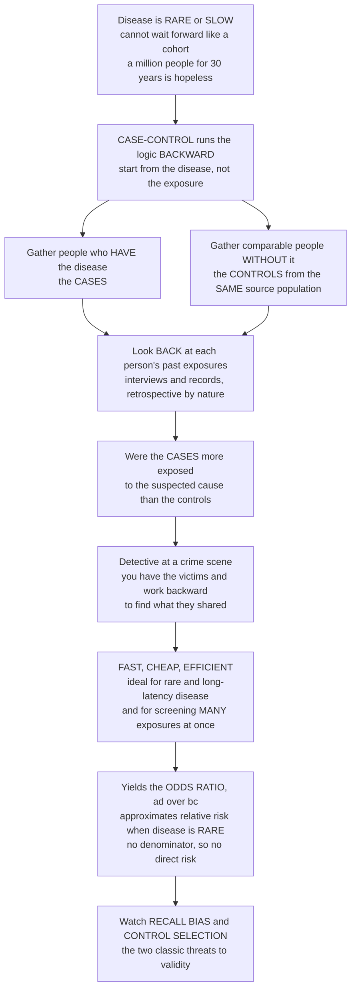

# 🔎 Case-Control Studies

> [!abstract] TL;DR
> A **cohort study** follows healthy people forward and *waits* for disease to appear — but if the disease is **rare** or takes **decades** to develop, waiting is hopeless: you would have to track a million people for thirty years to catch a handful of cases. The **case-control study** is the brilliant shortcut that runs the logic **backward**. Instead of starting with exposure and waiting for disease, you start with the **disease**: gather people who already *have* it (the **cases**) and a comparable group who do not (the **controls**), then look back into their histories and ask — *were the cases more likely to have been exposed to the suspected cause?* It is detective work: you have the victims and you reason backward to find what they shared. The design is **fast, cheap, and ideal for rare and slow diseases**, and it delivers the **odds ratio**, which approximates relative risk *when the disease is rare*. Its Achilles' heels are **recall bias** (sick people remember their pasts differently than healthy ones) and **control selection** (controls must truly represent the population the cases came from). Working backward from disease to cause is epidemiology's efficient workhorse for rare-disease etiology and rapid hypothesis generation. *Educational content, not individual medical advice.*

---

## Intuition

**Analogy:** Picture a detective arriving at a crime scene. She does not start by watching the whole city and waiting to see who eventually becomes a victim — that would take forever, and most people never become victims at all. Instead she starts with the **victims she already has**, lines up a comparable group of **people who were *not* harmed**, and works *backward* through both groups' histories asking one question: *what did the victims have in common that the others did not?* If nearly every victim had recently visited the same restaurant, while the un-harmed group mostly had not, that shared exposure becomes her prime suspect.

A case-control study is exactly this detective's method applied to disease. A cohort study points forward — pick smokers and non-smokers, then wait years to count who gets lung cancer — which collapses the moment the disease is rare (you would need an army of subjects and a lifetime of patience). The case-control design flips the arrow: it **starts from the outcome**, gathering people who already have the disease and a matched comparison group who do not, then reaches *back* into their pasts to compare exposures. If smokers are far more common among the lung-cancer cases than among the healthy controls, that is evidence smoking is the culprit. Because you go *find* the cases wherever they already are instead of waiting for them to accrue, the design is fast, cheap, and perfect for rare or slow-developing disease. The price of that speed is subtle: you are asking people to **recall** the past, and the sick may remember differently than the well (**recall bias**), and you must choose **controls** who genuinely represent the source population (a notoriously tricky judgment). And because you never observed a whole population, you cannot measure risk directly — you get the **odds ratio**, which stands in for relative risk only when the disease is rare.

---

## How It Works

### Core Mechanics

1. **Sample on the outcome, not the exposure.** This is the defining reversal. You first assemble a group of **cases** — people who *have* the disease — and a group of **controls** — comparable people who do not. Exposure is unknown at this stage; it is what you go looking for.

2. **Define and ascertain the cases.** Decide precisely what counts as a case (a strict diagnostic definition) and where they come from. **Incident cases** (newly diagnosed) are preferred over **prevalent cases** (existing, long-standing), because prevalence mixes up *getting* the disease with *surviving* it — a factor that speeds death would look protective if you only sample survivors.

3. **Select the controls — the hardest part.** Controls must be drawn from the **same source population that produced the cases** and must represent that population's **exposure distribution**. A control is not "a healthy person" in the abstract; it is "someone who, had they developed the disease, would have shown up as one of *your* cases." Common sources are population-based (registries, random-digit dialing), hospital-based, and neighbourhood or friend controls — each with its own bias profile.

4. **Assess past exposure retrospectively.** For both groups you reach back in time via **interviews, questionnaires, or records** to reconstruct who was exposed to the suspected cause. This retrospective look is the source of both the design's speed *and* its characteristic biases.

5. **Fill the 2×2 table and compute the odds ratio.** Cross-classify by case/control status and past exposure. Because you *chose* how many cases and controls to sample, there is **no population denominator** and you cannot compute a risk. What you *can* compute is the **odds ratio** `OR = (a·d)/(b·c)` — the odds of exposure among cases versus controls — which approximates the relative risk under the **rare-disease assumption**.

6. **Interrogate the result for bias and confounding.** Before believing the association, ask: could **recall bias** have inflated it? Were the **controls** chosen properly? Did the **exposure genuinely precede the disease** (temporality)? Is a **confounder** masquerading as the cause? These questions are not optional footnotes — they are the core of interpreting a case-control study.

### Flow / Architecture



---

## Key Concepts

### Secondary (intuitive foundation)
- **Start from the disease, work backward.** Cohort studies pick the exposure and wait for disease; case-control studies pick the disease and look back for exposure. Same 2×2 table, opposite direction of reasoning.
- **Cases and controls.** *Cases* are people who have the disease. *Controls* are comparable people who do not — a fair yardstick for "how exposed was the population these cases came from?"
- **Why it exists.** For a rare or slow disease, following people forward is hopeless. Going straight to where the cases already are is fast and cheap — the whole point of the design.
- **The catch.** You are asking people to *remember* their past, and the sick may remember differently from the well (**recall bias**), and picking the *right* controls is genuinely hard.

### Undergraduate (formal structure and measure)
- **The 2×2 table, read the case-control way.** Rows are the status you *sampled on* (case vs control); columns are the past exposure you *ask about*:

  |             | Exposed | Unexposed |
  |-------------|---------|-----------|
  | **Cases**    | a       | b         |
  | **Controls** | c       | d         |

- **The odds ratio is the only valid measure here.** `OR = (a·d)/(b·c)` = the odds of *exposure* in cases divided by the odds of exposure in controls. Because you fixed the number of cases and controls, `a/(a+b)` is **not** a risk — there is no population denominator — so risk, incidence, and relative risk cannot be computed directly.
- **The rare-disease assumption.** When the disease is rare, `OR ≈ RR`; as the disease becomes common the odds ratio drifts away from the relative risk and overstates it.
- **Incident vs prevalent cases.** Prefer **incident** (newly diagnosed) cases; **prevalent** cases confound *developing* the disease with *surviving* it (survivorship distorts exposure patterns).
- **Control sources.** Population-based, hospital-based, and neighbourhood/friend controls trade off representativeness, cost, and comparability of information quality.
- **Matching.** Cases and controls can be **matched** on nuisance variables (age, sex); matched designs require **matched analysis** (e.g. conditional logistic regression) or the estimate is biased.

### Graduate (validity, efficiency, and variants)
- **Selecting controls from the source population.** The governing principle: a control is someone who, had they developed the disease, would have been captured as one of *your* cases. Violating this — the classic error — produces **selection bias** independent of sample size.
- **Efficiency for rare outcomes.** For a rare disease, a case-control study needs orders of magnitude *fewer* subjects than a cohort to achieve the same statistical power, because it deliberately over-samples the informative cases rather than drowning them in non-cases.
- **Non-collapsibility and logistic regression.** The odds ratio is the natural output of **logistic regression**, which is also how confounders are adjusted for; note the OR is *non-collapsible*, so a stratified OR can differ from the crude one even without confounding.
- **Nested case-control and case-cohort designs.** Embedding the case-control sampling *inside an existing cohort* fixes two problems at once: exposure is measured **before** disease (restoring temporality and killing recall bias), and controls are provably drawn from the true source population. The **case-cohort** variant uses a random subcohort as the comparison, allowing one control set to serve multiple case groups.
- **Temporality and reverse causation.** Because exposure and disease are ascertained together after the fact, establishing that exposure *preceded* disease is inherently weak — a signature limitation the nested design repairs.
- **Not for rare exposures.** The design is efficient for rare *diseases* but poor for rare *exposures*: with a rare exposure the informative cells (a and c) are nearly empty. For rare exposures a cohort of the exposed is the better tool.

---

## Python Demo

```python
# Case-control studies: the backward-logic measure and its two headline caveats.
#   (a) You can only get the ODDS RATIO (ad/bc), and it approximates the true
#       RELATIVE RISK only when the disease is RARE.
#   (b) RECALL BIAS -- cases remembering past exposure better than controls --
#       inflates that odds ratio, faking a stronger association.
import numpy as np
import matplotlib.pyplot as plt

# ---- A concrete case-control 2x2 table ------------------------------------
#                 Exposed   Unexposed
#   Cases            a          b
#   Controls         c          d
# Rows are CASE/CONTROL status (what we SAMPLED on); columns are the PAST
# EXPOSURE we ask about -> this is "research in reverse".
a, b = 90, 60     # 90 of 150 cases were exposed
c, d = 40, 110    # 40 of 150 controls were exposed

def odds_ratio(a, b, c, d):
    # OR = odds of exposure in cases / odds of exposure in controls = ad / bc
    return (a * d) / (b * c)

OR = odds_ratio(a, b, c, d)
print(f"Exposure odds in cases    : {a/b:.2f}")
print(f"Exposure odds in controls : {c/d:.2f}")
print(f"Odds ratio (ad/bc)        : {OR:.2f}")
print("No population denominator (we fixed #cases and #controls), so we CANNOT")
print("compute risk -> the odds ratio is the measure this design gives.\n")

# ---- (a) OR approximates the TRUE relative risk only when disease is RARE --
RR_true = 3.0                          # real relative risk in the source population
p0 = np.linspace(0.001, 0.6, 500)      # baseline disease risk in the UNEXPOSED
p1 = np.minimum(RR_true * p0, 0.999)   # disease risk in the EXPOSED
# A case-control study recovers the disease-ODDS-RATIO of the population:
OR_recovered = (p1 / (1 - p1)) / (p0 / (1 - p0))

# ---- (b) RECALL BIAS: cases remember past exposure better than controls ----
pe_case_true, pe_ctrl_true = 0.50, 0.30   # TRUE past-exposure prevalence
OR_true = (pe_case_true/(1-pe_case_true)) / (pe_ctrl_true/(1-pe_ctrl_true))
sens_ctrl = 0.70                          # controls recall 70% of exposures
sens_case = np.linspace(0.70, 1.00, 500)  # cases recall increasingly better
# reported prevalence = true prevalence * recall sensitivity (specificity = 1)
pe_case_rep = pe_case_true * sens_case
pe_ctrl_rep = pe_ctrl_true * sens_ctrl
OR_reported = (pe_case_rep/(1-pe_case_rep)) / (pe_ctrl_rep/(1-pe_ctrl_rep))

# ---- Plot -----------------------------------------------------------------
fig, ax = plt.subplots(1, 2, figsize=(13, 5))

ax[0].plot(p0, OR_recovered, color="#2ca02c", lw=2, label="Odds ratio recovered")
ax[0].axhline(RR_true, ls="--", color="gray", label=f"True relative risk = {RR_true}")
ax[0].axvline(0.10, ls=":", color="#d62728")
ax[0].text(0.115, RR_true + 0.7, "rare-disease zone:\nOR is close to RR", color="#d62728")
ax[0].set_xlabel("baseline disease risk in the unexposed")
ax[0].set_ylabel("association measure")
ax[0].set_title("(a) OR approximates RR only when disease is RARE")
ax[0].legend()

recall_gap = sens_case - sens_ctrl
ax[1].plot(recall_gap, OR_reported, color="#9467bd", lw=2, label="Reported odds ratio")
ax[1].axhline(OR_true, ls="--", color="gray", label=f"True odds ratio = {OR_true:.2f}")
ax[1].set_xlabel("differential recall: how much better cases remember than controls")
ax[1].set_ylabel("odds ratio")
ax[1].set_title("(b) Recall bias inflates the odds ratio")
ax[1].legend()

plt.tight_layout()
plt.show()
```

The left panel makes the **rare-disease assumption** visible: the odds ratio a case-control study recovers hugs the true relative risk of 3 while the disease is rare, then steadily overstates it as the disease becomes common. The right panel shows **recall bias** in action: when cases and controls remember equally poorly the odds ratio is biased *toward the null*, but the moment cases start remembering their exposures better than controls do, the reported odds ratio climbs past the truth — a fabricated association manufactured entirely by differential memory.

---

## Real-World Applications

> **Smoking and lung cancer (Doll & Hill, 1950).** With lung cancer still relatively uncommon and its latency spanning decades, a forward cohort would have been impractically slow. Doll and Hill instead interviewed hospitalized lung-cancer **cases** and matched **controls** with other diagnoses, found smoking dramatically over-represented among the cases, and produced some of the earliest hard evidence that smoking causes lung cancer — the archetypal triumph of the design.

> **DES and vaginal clear-cell adenocarcinoma (Herbst, 1971).** A cancer so rare that only a handful of young women had it was traced, in a tiny case-control study, to their mothers' use of diethylstilbestrol (DES) during pregnancy. No cohort could ever have been powered for so rare an outcome; the case-control design cracked it with a few dozen subjects.

> **Aspirin and Reye syndrome.** Case-control studies linked aspirin use during childhood viral illness to Reye syndrome, driving the label warnings that all but eliminated the condition — a fast, cheap answer for a rare and rapidly fatal disease where a trial would have been unethical and a cohort hopeless.

> **Nested case-control in pharmacoepidemiology.** Drug-safety surveillance routinely nests case-control sampling *inside* large healthcare-claims cohorts: exposure (the prescription) is recorded before the adverse event, so temporality holds and recall bias vanishes, while sampling controls only for the analysis keeps the computation cheap. This is how many post-market drug-risk signals are evaluated.

---

## Common Pitfalls

- **Recall bias.** People who are sick scrutinize their pasts for explanations and often report exposures more thoroughly than healthy controls do. This *differential* misclassification inflates the odds ratio (as the demo shows). Mitigate with objective records, blinded interviewers, and diseased-but-different controls who are equally motivated to recall.
- **Improper control selection.** The single most notorious failure. Controls must come from the **same source population** as the cases. Hospital controls can carry their own exposure-linked illnesses (**Berkson's bias**); volunteer or friend controls can be systematically healthier or more exposed. A study with badly chosen controls is invalid no matter how large.
- **Prevalent instead of incident cases.** Sampling long-standing (prevalent) cases mixes disease incidence with survival, so exposures that affect *how long you live with* the disease masquerade as exposures that *cause* it.
- **Reading the odds ratio as a relative risk when the disease is common.** The rare-disease approximation fails for common outcomes; the OR then exaggerates the effect. Report it as an odds ratio and check the baseline frequency.
- **Assuming temporality.** Because exposure and disease are measured together after the fact, it is easy to mistake a consequence of early disease for its cause (**reverse causation**). Nested designs, or clear evidence the exposure came first, are the remedy.
- **Using it for a rare exposure.** The design is efficient for rare *diseases*, not rare *exposures* — with a rare exposure the informative cells are empty and the study is underpowered. Reach for an exposed cohort instead.
- **Ignoring confounding.** Cases and controls can differ on more than the exposure of interest. Match or adjust (logistic regression) for known confounders, and remember matching demands matched analysis.

---

## Related Concepts

This note is the second pillar of the **Study Designs** section and is best read against its siblings. It is the mirror image of *Cohort Studies*, which run forward from exposure to disease and yield risks directly, whereas the case-control design runs backward from disease to exposure and yields only an odds ratio; the *Epidemiologic Study Designs Overview* places both on the ladder of observational designs and explains when each is the right tool. The odds ratio computed here is defined and contrasted with the risk ratio in *Measures of Association and Effect*, and its interpretation hinges on the same rare-disease assumption discussed there. The two signature threats to a case-control study — recall bias and improper control selection — are the central cases in *Bias, Selection and Information*, and the perennial question of whether a strong odds ratio actually reflects a cause is the province of *Causal Inference in Epidemiology*. (Those five sibling notes live alongside this one in the same vault.)

- [[Probability_Theory]] — the algebra of odds versus probability that underlies the odds ratio.
- [[Statistical_Inference]] — confidence intervals and hypothesis tests that put uncertainty bounds on the odds ratio.
- [[Regression_and_Correlation]] — logistic regression, the workhorse that produces adjusted odds ratios and controls for confounders.
- [[Evidence_Based_Medicine_and_Clinical_Trials]] — where case-control evidence sits on the study-design hierarchy relative to cohorts and randomized trials.
- [[Causal_Reasoning]] — why a strong association is evidence for, but never proof of, causation.
- [[Cognitive_Biases_and_Heuristics]] — the psychology behind recall bias and selective memory in case reporting.

---

## Review Questions

1. **(Secondary)** A brand-new, very rare cancer appears in a town, and you have six months to find its likely cause. Explain why following healthy townspeople forward and waiting would fail, and how a case-control study would instead let you get an answer quickly.
2. **(Undergraduate)** From a case-control table with cells `a=80, b=20` (cases: exposed, unexposed) and `c=40, d=60` (controls: exposed, unexposed), compute the odds ratio. Why can you *not* compute the relative risk or the incidence from this table, and under what condition does your odds ratio nonetheless approximate the relative risk?
3. **(Graduate)** You must study whether a common medication raises the risk of a rare adverse event. Argue for a **nested case-control design** over a standard hospital-based case-control study, naming the specific biases each choice controls or introduces, and explain what a **nested** design buys you with respect to temporality and recall bias.

---

## Sources

- Gordis, L. *Epidemiology* (6th ed.), chapter "Case-Control and Cross-Sectional Studies." Elsevier.
- Rothman, K. J. *Epidemiology: An Introduction* (2nd ed.), "Types of Epidemiologic Studies" and the treatment of case-control sampling and the odds ratio. Oxford University Press.
- Schulz, K. F. & Grimes, D. A. "Case-control studies: research in reverse." *The Lancet*, 2002; 359: 431–434.
- Szklo, M. & Nieto, F. J. *Epidemiology: Beyond the Basics* (4th ed.), "Basic Study Designs in Analytical Epidemiology." Jones & Bartlett.

---

#epidemiology #case-control-study #odds-ratio #recall-bias #control-selection
