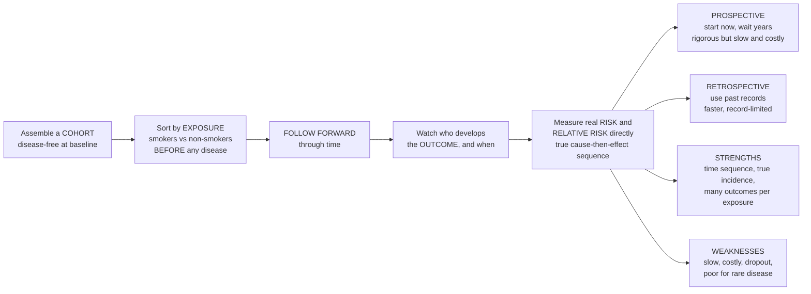

# 🧭 Cohort Studies

> [!abstract] TL;DR
> A **cohort study** is the most intuitive way to study cause: take a group of people, note who is **exposed** to something (smokers versus non-smokers) and who is not, then **follow them forward** through time and watch who gets sick. Because you sort people by exposure *before* the disease occurs, you see the cause-then-effect **sequence** directly — and you can measure exactly how much more often the exposed get sick: the true **incidence**, the **risk**, and the **relative risk**. It is the design that nailed smoking and lung cancer (the British Doctors Study followed ~40,000 doctors for decades) and cardiovascular risk factors (the Framingham study has followed a whole town across generations). Cohorts come in two flavours: **prospective** (start now, wait years for disease to appear — rigorous but slow and expensive) and **retrospective/historical** (use existing records to reconstruct a cohort assembled in the past — faster). Great strengths: correct time sequence, real incidence and risk, and **many outcomes** from one exposure. Great weaknesses: **slow and costly**, people **drop out** (loss to follow-up), and it is **inefficient for rare diseases**. Following people forward from exposure to outcome is the closest observational epidemiology gets to the logic of an experiment. *Educational content, not individual medical advice.*

---

## Intuition

**Analogy — plant two fields and watch them grow.** Suppose you suspect a certain fertiliser makes crops fail. You would not wait until harvest, look at the dead plants, and try to remember what each one was fed. You would do the obvious, honest thing: take two matched fields, treat one with the fertiliser and leave the other alone *from the start*, and then simply **walk the rows over the season and count what dies in each**. Because you decided which field got the fertiliser *before* anything wilted, there is no argument about what came first — the treatment plainly preceded the outcome — and you can read the damage off directly: *this many* extra failures per hundred plants, *this many* times the failure rate.

That is exactly a cohort study, with people instead of plants. You assemble a group who are all healthy at the outset, split them by **exposure** (smokers versus non-smokers, or a whole town's blood pressures measured today), and then **follow them forward** through the years, tallying who develops the disease. Sorting by exposure *before* the outcome appears buys you the one thing that observational data usually cannot: a clear **cause-then-effect time sequence**, a pillar of causation. And because you are watching new cases *arise* in each group, you can compute the honest measures no other observational design gives you cleanly — the real **incidence** in the exposed and the unexposed, and their ratio, the **relative risk**. The price is patience: you must wait years for the disease to show up, some people wander off (loss to follow-up), and if the disease is rare you may follow tens of thousands just to see a handful of cases.

---

## How It Works

### Core mechanics — the follow-forward design

1. **Assemble the cohort disease-free.** Recruit a group who do **not yet** have the outcome. "Cohort" originally meant a Roman military unit marching together; here it is a group of people marching forward through time together, observed as one.
2. **Classify by exposure at baseline.** Sort each person as **exposed** or **unexposed** — or by *level* of exposure (never / light / heavy smoker) to look for a **dose-response** gradient. The defining feature of the whole design: **exposure status is known before the outcome occurs.**
3. **Follow over time.** Track everyone forward, recording who develops the outcome and *when*. A **closed/fixed** cohort locks its membership at baseline; an **open/dynamic** cohort lets people enter and leave (a population under continuous surveillance).
4. **Count new cases in each group.** Because you watch disease *arise*, you measure **incidence** directly — the only observational design that yields true incidence and risk without assumption.
5. **Compare the groups.** Divide the incidence in the exposed by that in the unexposed to get the **relative risk (risk ratio)** or **rate ratio**; subtract them for the **attributable risk**. These effect measures are the quantitative fingerprint of a possible cause.

### Prospective versus retrospective

- **Prospective cohort** — recruit and classify by exposure **now**, then follow into the **future**. Data are collected fresh and to specification (the exposure is measured before you know anyone's fate, which blocks recall bias), so it is the most rigorous form — but it costs time and money, sometimes decades.
- **Retrospective / historical cohort** — use **existing records** (occupational files, medical registries, birth records) to define a cohort assembled in the *past*, whose outcomes have *already occurred*, and follow it forward *within the archive*. Far faster and cheaper, but limited by whatever the old records happened to capture.
- **Ambidirectional** designs do both: reconstruct past follow-up from records *and* continue prospectively.

### What cohorts measure and how they are analysed

Cohorts uniquely deliver **incidence** and hence **risk**, the **relative risk / rate ratio**, and the **attributable risk**. Because people are followed for *different lengths of time* (late entrants, dropouts, deaths from other causes), the natural accounting unit is **person-time**: the **incidence rate** is events divided by total person-years at risk. The mature analytic toolkit is **survival analysis** — **Kaplan-Meier** event-free curves, the **hazard ratio**, and **Cox proportional-hazards regression** — all built precisely to handle varying follow-up and **censoring** (people whose outcome is unknown because they dropped out or the study ended).



*Read left to right: assemble a healthy group, split it by exposure before anyone falls ill, follow forward, watch the disease story unfold, and read the risk and relative risk off directly — via either a prospective or a retrospective route, each with its own strengths and weaknesses.*

---

## Key Concepts

### Secondary (intuitive foundation)
- **Cohort = a group followed forward together.** Start with healthy people, note who is exposed, and watch over time who gets sick.
- **Exposure comes first.** You label people by exposure *before* any disease appears, so you can see the cause-then-effect order — the whole point.
- **Two flavours.** *Prospective* = start today and wait for the future to unfold. *Retrospective* = dig up old records of a group from the past and trace what already happened to them.
- **What you get.** The real chance of getting sick in each group (**risk**) and how many times higher it is in the exposed group (**relative risk**).
- **The catch.** It is slow and expensive, people drift away over the years, and it is a poor way to study rare diseases — you would have to follow enormous numbers to see a few cases.

### Undergraduate (formal definitions)
- **Direction of inquiry.** Cohort studies reason **exposure → outcome** (forward); case-control studies reason **outcome → exposure** (backward). This forward logic is what secures **temporality**.
- **Incidence, risk, and rate.** *Cumulative incidence* (risk) = new cases / people at risk over a period; *incidence rate* = new cases / **person-time** at risk. Cohorts are the design that estimates both directly.
- **Effect measures.** From directly measured risks come the **relative risk** `RR = R_exposed / R_unexposed`, the **rate ratio**, the **risk difference / attributable risk** `RD = R_exposed − R_unexposed`, and the **attributable fraction** `(RR − 1)/RR`.
- **Fixed vs dynamic; prospective vs retrospective.** A *closed/fixed* cohort has stable membership; an *open/dynamic* one turns over. The prospective/retrospective split concerns *when* the investigator starts relative to the outcomes, not the direction of reasoning.
- **Censoring and loss to follow-up.** People lost before the outcome (moved, withdrew, died of other causes) are **censored**; their partial follow-up still contributes person-time. Systematic (informative) dropout related to both exposure and outcome causes **attrition bias**.

### Graduate (analysis, bias, and design nuance)
- **Survival analysis.** Because follow-up varies, cohorts are analysed with the **Kaplan-Meier estimator** (non-parametric event-free survival), the **log-rank test** (comparing curves), and **Cox proportional-hazards regression** (adjusting the **hazard ratio** for covariates without specifying the baseline hazard). These handle censoring that a simple 2×2 table cannot.
- **Nested case-control and case-cohort.** To study an *expensive* biomarker without assaying the whole cohort, sample all cases plus a control set drawn from the same cohort (**nested case-control**) or a random **subcohort** (**case-cohort**). You keep the cohort's temporality and sampling frame while slashing measurement cost.
- **Confounding remains.** Cohorts establish temporality but are still **observational**: the exposed and unexposed can differ systematically (**confounding by indication**, healthy-worker effect). Adjustment (stratification, regression, propensity scores) is required; a cohort is not a randomised trial.
- **Time-varying exposure and immortal-time bias.** Exposure can change during follow-up (people quit smoking); misclassifying the interval before someone becomes "exposed" creates **immortal-time bias**, a notorious artefact that fabricates apparent benefit. Time-dependent Cox models address it.
- **Where cohorts sit in the evidence hierarchy.** Below the randomised controlled trial but **the strongest observational design** for risk — precisely because it fixes temporality and measures incidence directly. Large prospective cohorts (Framingham, Nurses' Health, UK Biobank) are the backbone of chronic-disease epidemiology.

---

## Python Demo

```python
# Cohort studies, in two pictures:
#   (a) FOLLOW-FORWARD & RELATIVE RISK -- assemble an EXPOSED and an UNEXPOSED arm,
#       follow both forward, and watch cumulative incidence (risk) DIVERGE over time.
#       Read the true RISK in each group and the RELATIVE RISK / rate ratio directly
#       -- the measures a cohort uniquely gives -- plus person-time and incidence rate.
#   (b) SURVIVAL (Kaplan-Meier) WITH LOSS TO FOLLOW-UP -- the same cohort, shown as
#       event-free survival curves for exposed vs unexposed, with people dropping out
#       (censoring). This is the survival analysis natural to cohorts.
import numpy as np
import matplotlib.pyplot as plt

rng = np.random.default_rng(1951)          # year the British Doctors Study began

# ---- Assemble a CLOSED COHORT, disease-free at baseline, follow forward T years ----
T          = 20.0                          # administrative end of follow-up (years)
n_exp      = n_unexp = 5000                # cohort sizes, all healthy at baseline
rate_exp   = 0.040                         # incidence rate in exposed  : 4.0 / 100 person-yr
rate_unexp = 0.010                         # incidence rate in unexposed: 1.0 / 100 person-yr
dropout    = 0.020                         # loss-to-follow-up (attrition) rate per year

def follow_cohort(n, hazard, dropout, T):
    """Follow n disease-free people forward; return observed time and event flag."""
    t_event = rng.exponential(1.0 / hazard,  n)      # time until disease
    t_drop  = rng.exponential(1.0 / dropout, n)      # time until loss to follow-up
    t_obs   = np.minimum(np.minimum(t_event, t_drop), T)
    got_sick = (t_event <= t_drop) & (t_event <= T)  # event seen only if first & within T
    return t_obs, got_sick

def kaplan_meier(t_obs, event, grid):
    """Kaplan-Meier survival S(t) on a grid; correctly handles censoring/dropout."""
    order = np.argsort(t_obs)
    t_obs, event = t_obs[order], event[order]
    n_at_risk, S = len(t_obs), 1.0
    times, surv = [0.0], [1.0]
    for i in range(len(t_obs)):
        if event[i]:                                 # a real event steps survival down
            S *= (1.0 - 1.0 / n_at_risk)
            times.append(t_obs[i]); surv.append(S)
        n_at_risk -= 1                               # one fewer at risk after this person
    times, surv = np.array(times), np.array(surv)
    return surv[np.searchsorted(times, grid, side="right") - 1]

grid = np.linspace(0, T, 300)
te, ee = follow_cohort(n_exp,   rate_exp,   dropout, T)   # exposed arm
tu, eu = follow_cohort(n_unexp, rate_unexp, dropout, T)   # unexposed arm

S_exp,   S_unexp   = kaplan_meier(te, ee, grid), kaplan_meier(tu, eu, grid)
CI_exp,  CI_unexp  = 1 - S_exp, 1 - S_unexp               # cumulative incidence = risk over time

# ---- Measures a cohort uniquely delivers: RISK, RELATIVE RISK, incidence RATE ----
risk_exp, risk_unexp = CI_exp[-1], CI_unexp[-1]
RR = risk_exp / risk_unexp                               # RELATIVE RISK, measured DIRECTLY
pt_exp,  pt_unexp = te.sum(), tu.sum()                   # person-time (person-years)
ir_exp,  ir_unexp = ee.sum() / pt_exp, eu.sum() / pt_unexp
rate_ratio = ir_exp / ir_unexp                           # incidence RATE ratio
lost = (~np.concatenate([ee, eu]) & (np.concatenate([te, tu]) < T)).mean() * 100

print(f"Risk over {T:.0f} yr  exposed = {risk_exp:.3f}   unexposed = {risk_unexp:.3f}")
print(f"RELATIVE RISK (risk ratio)     = {RR:.2f}   (truth ~ {rate_exp/rate_unexp:.0f})")
print(f"Incidence rate  exposed = {ir_exp*100:.2f}  unexposed = {ir_unexp*100:.2f} per 100 person-yr")
print(f"Incidence RATE ratio           = {rate_ratio:.2f}")
print(f"Person-years  exposed = {pt_exp:,.0f}   unexposed = {pt_unexp:,.0f}")
print(f"Lost to follow-up before year {T:.0f}: {lost:.0f} percent of the cohort")

fig, (ax1, ax2) = plt.subplots(1, 2, figsize=(14, 5.5))

# --- panel (a): cumulative incidence DIVERGES; relative risk read off directly ---
ax1.plot(grid, CI_exp,   color="#C0392B", lw=2.4, label="Exposed (smokers)")
ax1.plot(grid, CI_unexp, color="#27AE60", lw=2.4, label="Unexposed (non-smokers)")
ax1.fill_between(grid, CI_unexp, CI_exp, color="#C0392B", alpha=0.10,
                 label="Excess risk (attributable)")
ax1.annotate(f"Relative risk = {RR:.1f}", xy=(T, risk_exp), xytext=(T*0.42, risk_exp*0.98),
             arrowprops=dict(arrowstyle="->"), fontsize=11)
ax1.set_xlabel("Years of follow-up")
ax1.set_ylabel("Cumulative incidence (risk)")
ax1.set_title("(a) Follow forward: risk diverges, RR measured directly")
ax1.legend(loc="upper left", fontsize=9); ax1.grid(alpha=0.3)

# --- panel (b): Kaplan-Meier event-free survival with loss to follow-up ---
ax2.plot(grid, S_exp,   color="#C0392B", lw=2.4, label="Exposed: event-free survival")
ax2.plot(grid, S_unexp, color="#27AE60", lw=2.4, label="Unexposed: event-free survival")
ax2.set_ylim(0, 1.02)
ax2.set_xlabel("Years of follow-up")
ax2.set_ylabel("Fraction still disease-free")
ax2.set_title(f"(b) Kaplan-Meier survival ({lost:.0f}% lost to follow-up)")
ax2.legend(loc="lower left", fontsize=9); ax2.grid(alpha=0.3)

plt.tight_layout()
plt.show()
```

**What you see.** *Panel (a)* is the cohort idea in one image: two arms start disease-free and, followed forward, their **cumulative-incidence curves pull apart** — the exposed accumulate cases faster. Because you watched new cases *arise*, you read the true **risk** off each curve and divide to get the **relative risk** (~4 here) directly, the shaded gap being the **attributable** excess. *Panel (b)* recasts the identical cohort as **Kaplan-Meier event-free survival**, the analysis native to cohorts: survival falls faster in the exposed, and the curves also reflect **loss to follow-up** — people censored before the outcome, whose partial person-time still counts. The printout shows what only a cohort gives cleanly: incidence **rates** per person-year, the **rate ratio**, total **person-years**, and the fraction lost — the very quantities, and the very fragility (attrition), that define the design.

---

## Real-World Applications

> **The British Doctors Study (smoking and lung cancer).** Beginning in 1951, Richard Doll and Austin Bradford Hill enrolled ~40,000 British doctors, classified them by smoking habit, and followed them forward for decades. Lung-cancer incidence rose steeply with the amount smoked (a textbook dose-response) and fell after quitting — a relative risk so large, with such clear temporality, that the *prospective* cohort design was decisive in proving smoking *causes* lung cancer.

> **The Framingham Heart Study (cardiovascular risk factors).** Since 1948 this study has followed the residents of Framingham, Massachusetts — and now their children and grandchildren — measuring blood pressure, cholesterol, and lifestyle *before* disease. It is where the very phrase "**risk factor**" was born, and where hypertension, high cholesterol, and smoking were established as predictors of heart disease, feeding directly into today's clinical risk calculators.

> **The Nurses' Health Study.** One of the largest prospective cohorts of women's health, following well over 100,000 nurses since 1976, has generated decades of evidence on diet, hormones, and chronic disease — and is a standard host for **nested case-control** studies that assay costly biomarkers only in sampled cases and controls.

> **Occupational and historical cohorts.** Retrospective/historical cohorts built from employment and exposure records (asbestos, radiation, industrial chemicals) reconstruct a workforce assembled in the past and trace its already-recorded mortality — delivering answers in months rather than decades, when the archives are good enough.

---

## Common Pitfalls

- **Loss to follow-up (attrition bias).** The Achilles' heel of the design. If dropout is *related to both exposure and outcome* — sicker exposed people leave first — the surviving sample lies. High, differential loss can bias the relative risk in either direction; keep follow-up as complete as possible and analyse who was lost.
- **Waiting for the wrong disease.** Cohorts are *inefficient for rare or long-latency outcomes*: to observe a handful of cases you may follow tens of thousands for decades. When the disease is rare, a **case-control** design is the efficient choice, not a cohort.
- **Assuming temporality equals causation.** A cohort fixes the *time order*, but it is still **observational**. Confounders (the exposed differ in diet, wealth, or health) can fabricate an association. Temporality is one Bradford Hill criterion, not the whole case — adjust, and reason about confounding explicitly.
- **Immortal-time bias.** Misclassifying the follow-up *before* a person becomes "exposed" (e.g., before they fill a prescription) as exposed time invents a stretch during which, by construction, they could not have the outcome — manufacturing a spurious protective effect. Use time-dependent exposure.
- **Drift in exposure and diagnosis over long follow-up.** Over decades, smokers quit, diagnostic criteria tighten, and lab assays change. Treating a single baseline measurement as fixed, or ignoring changing case definitions, distorts the estimated effect.
- **Healthy-worker / healthy-volunteer effect.** People healthy enough to be employed or to enrol are healthier than the general population, so an occupational or volunteer cohort can understate risk. Choose the comparison group from within the same source population.

---

## Related Concepts

This is the first note of the **Study Designs** section, and it sits inside the reasoning chain laid out in the [[Epidemiology_and_Public_Health/01_Foundations_of_Epidemiology/Epidemiology_and_Public_Health_Overview|Epidemiology and Public Health Overview]] — the vault hub. Within this section it is best read against its siblings: the *Epidemiologic Study Designs Overview* frames where the cohort sits among all designs; *Case-Control Studies* is its mirror image, reasoning *backward* from outcome to exposure and far more efficient for rare diseases (but yielding only an odds ratio, not a true risk); *Cross-Sectional and Ecological Studies* trade temporality for speed by measuring exposure and outcome at one moment; *Measures of Association and Effect* supplies the relative risk, rate ratio, and attributable risk that a cohort computes directly; and *Causal Inference in Epidemiology* is where the temporality a cohort secures is combined with the rest of the evidence to argue cause. (Those sibling notes live alongside this one in the same vault.)

**Across the vault (Glob-verified links).**

- [[Clinical_Medicine/06_Clinical_Reasoning_and_Modern_Medicine/Evidence_Based_Medicine_and_Clinical_Trials|Evidence-Based Medicine and Clinical Trials]] — the randomised trial that sits just above the cohort in the evidence hierarchy, and the clinical setting where relative and absolute risk from cohorts are used.
- [[Mathematics/06_Probability_and_Statistics/Regression_and_Correlation|Regression and Correlation]] — the regression machinery (extended by Cox proportional-hazards models) used to adjust the cohort's hazard ratios for confounders.
- [[Mathematics/06_Probability_and_Statistics/Statistical_Inference|Statistical Inference]] — the confidence intervals and hypothesis tests (log-rank test, CIs on the log scale) that quantify uncertainty in a cohort's risk ratio and hazard ratio.
- [[Mathematics/06_Probability_and_Statistics/Probability_Theory|Probability Theory]] — the survival function, hazard, and person-time rates rest on the exponential and related distributions.
- [[Health_Nutrition_and_Longevity/06_Public_Health_and_Prevention/Public_Health_and_Epidemiology|Public Health and Epidemiology]] — the applied-health companion, where cohort evidence on diet and lifestyle shapes prevention.

---

## Review Questions

1. **(Secondary)** In a cohort study you label people as "exposed" or "unexposed" *before* any of them gets sick, and then follow them forward. Explain, in plain words, why doing it in that order lets you argue that the exposure *came first* — and why that ordering is so much harder to establish if you instead start with sick people and ask them to recall their past.
2. **(Undergraduate)** A prospective cohort follows 5,000 smokers and 5,000 non-smokers for 20 years, observing lung-cancer incidence rates of 4.0 versus 1.0 per 100 person-years. Compute the rate ratio, and explain why person-time (rather than a simple headcount) is the right denominator here. Then state one reason this cohort would be a poor design for studying a disease that strikes 2 people per million per year.
3. **(Graduate)** You read a cohort study reporting that patients who received a drug had far lower mortality than those who did not, using time from cohort entry as the clock. Explain how *immortal-time bias* and *loss to follow-up* could each fabricate or inflate this apparent benefit, and describe the analytic choices (time-dependent exposure, survival analysis with proper censoring, adjustment for confounders) that would let you decide whether the effect is real — and why the cohort, however large, still cannot substitute for a randomised trial.

---

## Sources

- Gordis, L. (Celentano, D. D., & Szklo, M., eds.). *Gordis Epidemiology* (6th ed.), chapter on "Cohort Studies." Elsevier.
- Rothman, K. J. *Epidemiology: An Introduction* (2nd ed.), chapters on cohort studies and measures of effect. Oxford University Press.
- Szklo, M., & Nieto, F. J. *Epidemiology: Beyond the Basics* (4th ed.), "Prospective (Cohort) Studies" and survival analysis. Jones & Bartlett.
- Doll, R., & Hill, A. B. "Mortality in Relation to Smoking: Ten Years' Observations of British Doctors." *BMJ*, 1964 — the landmark prospective cohort of smoking and lung cancer.
- Mahmood, S. S., Levy, D., Vasan, R. S., & Wang, T. J. "The Framingham Heart Study and the Epidemiology of Cardiovascular Disease: A Historical Perspective." *The Lancet*, 2014.

---

#epidemiology #cohort-study #prospective #relative-risk #framingham
