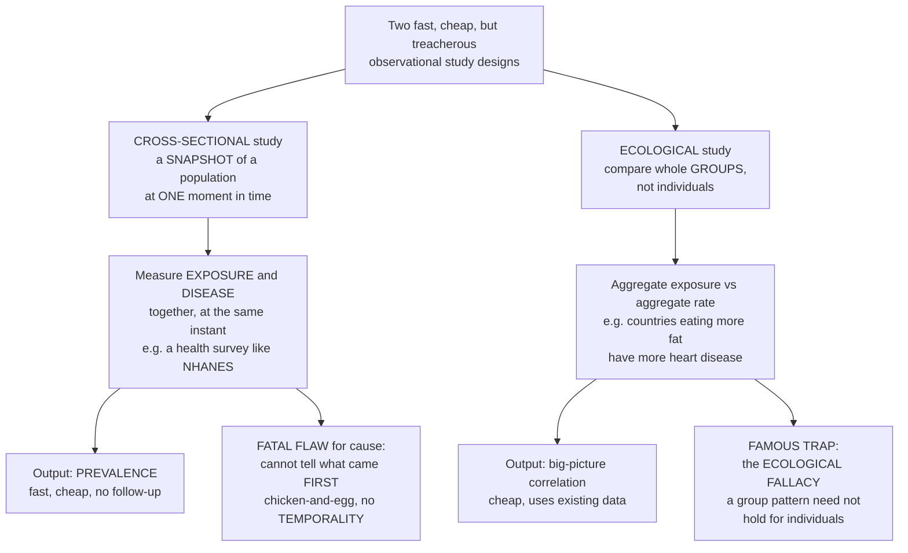

# 📸 Cross-Sectional and Ecological Studies

> [!abstract] TL;DR
> Two more observational designs trade rigour for speed and convenience — brilliant for *describing* populations and *generating* hypotheses cheaply, but treacherous for *proving* cause. A **cross-sectional study** is a **snapshot**: survey a population at one moment and measure the exposure and the disease *at the same time* — a census of health that asks "what fraction of adults have diabetes right now, and how many of them are obese?" It is fast, cheap, and gives you **prevalence**, but it carries a fatal flaw for causation: because cause and effect are measured *simultaneously*, you cannot tell which came **first** — did obesity cause the diabetes, or did diabetes change their weight? (the chicken-and-egg problem — no **temporality**). An **ecological study** is even more removed: it compares whole **groups** — "countries that eat more fat have more heart disease" — using cheap, existing aggregate data. This reveals big-picture patterns fast, but hides a famous trap: the **ecological fallacy** — a correlation between group *averages* need not hold for the *individuals* inside them (maybe it is the *non*-fat-eaters, who happen to be poor, who get sick). Both designs sit **low on the evidence hierarchy for causation** yet remain valuable first steps — and understanding their built-in traps (no time sequence; the ecological fallacy) is what keeps survey and cross-country health data from fooling you. *Educational content, not individual medical advice.*

---

## Intuition

**Analogy — the census photograph versus the country scoreboard.** Imagine two ways of studying a nation's health without the patience (or budget) to follow anyone over time. The first is to take a single **photograph** of everyone at once: on one Tuesday you knock on a representative sample of doors and, for each person, note two things at the same instant — *do you carry this exposure* (say, obesity) and *do you have this disease* (say, diabetes)? You count how many have each, and how often they occur together. That is a **cross-sectional study**, and its output is **prevalence** — the fraction who *currently have* each condition. It is fast, cheap, and needs no follow-up. But the photograph has a fatal blind spot for cause: because you snapped the exposure and the disease in the *same frame*, you cannot see the *order of events*. The obese diabetics are right there in the picture — but did the obesity come first and cause the diabetes, or did the diabetes (and its treatment) change their weight? The still image cannot tell you which arrow points which way. That is the **chicken-and-egg problem**: no **temporality**.

The second shortcut is to skip individuals entirely and read the **national scoreboard**. Instead of surveying people, you grab two numbers *per country* off existing statistics — average fat intake and the heart-disease death rate — and plot one against the other. Fat-eating countries have more heart disease: a clean, cheap, striking correlation. That is an **ecological study**, and its unit is the *group*, not the person. Here lurks the field's most famous trap, the **ecological fallacy**: the fact that high-fat *countries* have more heart disease does **not** mean the high-fat *eaters within* them are the ones dying. Perhaps, inside each country, it is the *poorer* people — who eat *less* fat — who suffer the most heart disease, and the country average merely tracks wealth. A pattern that is true of *averages* can be false, even reversed, for *individuals*. Both designs are wonderful for describing populations and sparking hypotheses cheaply — but each hides a built-in way to be fooled, and knowing those traps is the whole point of this note.

---

## How It Works

### Core mechanics

Both designs collapse the *time* dimension that cohort and case-control studies work so hard to preserve — that is exactly where their speed, and their danger, come from.

1. **Cross-sectional — one moment, both variables.** Draw a representative sample of a defined population and, *at a single point in time*, ascertain exposure status and disease status for each person. There is no waiting, no follow-up, no "before and after." The primary product is **prevalence**: the proportion of the sample with the disease, and with each exposure. You can also report a **prevalence ratio** (prevalence in exposed ÷ prevalence in unexposed) as a crude association. Classic examples are health surveys such as **NHANES** — a periodic snapshot of a nation's health.

2. **Cross-sectional's fatal flaw — no temporality.** Because exposure and outcome are measured together, the design *cannot establish which came first*. A cause must precede its effect; a snapshot destroys that ordering. So a cross-sectional association is compatible with the exposure causing the disease, the disease causing the exposure (**reverse causation**), or neither. This ambiguity is the single reason cross-sectional studies rank low for *causation* while remaining excellent for *description*.

3. **Cross-sectional's second trap — prevalence, not incidence.** A snapshot counts *existing* cases, not *new* ones. Prevalence is inflated by long **duration**: in a steady state, prevalence ≈ incidence × average duration. So a cross-sectional survey over-represents the chronic and the *survivors* — anyone who died quickly or recovered fast is invisible. Studying prevalent cases can therefore mislead you about what causes the disease versus what prolongs it (**prevalence-incidence**, or **Neyman**, bias).

4. **Ecological — the group is the unit.** Here you never observe an individual. The unit of analysis is a **group**: a country, a region, a time period. You correlate an *aggregate exposure level* (per-capita fat intake, average income, regional sunshine) with an *aggregate disease rate* (national heart-disease mortality). The data are cheap and already exist as routine statistics, which is why ecological studies are often the very first look at a new question.

5. **Ecological's famous trap — the ecological fallacy.** An association measured *between group averages* need not hold *within individuals*, and can even reverse (a Simpson's-paradox flavour). The individuals carrying the exposure may not be the ones getting the disease; the group average is a blend that can hide, or invent, an individual relationship. Ecological studies also cannot adjust for individual-level confounders, and suffer **ecological confounding** (a third factor that varies across groups). They are for *hypothesis generation*, not proof.

6. **Where they sit.** Both are **descriptive / hypothesis-generating** designs, low on the evidence hierarchy for causation, above only anecdote — but fast, cheap, ethical, and irreplaceable for questions that live at the population level (policy, environment, climate) or lack individual data.

### The two designs and their built-in traps



---

## Key Concepts

### Secondary (intuitive foundation)
- **Cross-sectional = a photograph.** Survey everyone once and record the exposure and the disease *at the same time*. It tells you how common each is *right now* — the **prevalence**.
- **The chicken-and-egg problem.** Because you see the cause and the effect in the *same picture*, you cannot tell which came first. Obese diabetics are in the photo, but the snapshot can't say whether obesity or diabetes came first.
- **Ecological = the scoreboard.** Compare whole *groups* — countries, cities — using averages, not people. "Countries eating more fat have more heart disease" is an ecological finding.
- **The ecological fallacy.** What is true of group *averages* may be false for the *people* inside them. Fat-eating *countries* having more heart disease does not mean the fat-*eaters* are the ones with heart disease.
- **Fast and cheap, but weak on cause.** Both designs are great for *describing* populations and *sparking ideas*, but poor for *proving* what causes what.

### Undergraduate (formal definitions)
- **Cross-sectional study.** A representative sample of a defined population is assessed for exposure and outcome at a *single point in time*; the estimand is **prevalence** and, comparatively, the **prevalence ratio** or prevalence odds ratio. Ideal for describing burden, estimating prevalence of *multiple* exposures and outcomes at once, health-services planning, surveillance, and hypothesis generation.
- **Why temporality fails.** Simultaneous measurement breaks the *cause-precedes-effect* requirement, so cross-sectional associations cannot distinguish causation from **reverse causation**. This is the design's defining limitation.
- **Prevalence versus incidence.** Prevalence ≈ incidence × mean duration in steady state. Cross-sectional surveys measure *existing* cases and therefore over-sample long-duration and surviving cases — **prevalence-incidence (Neyman) bias** — so they can mistake determinants of *survival/duration* for determinants of *onset*.
- **Ecological (correlational) study.** The **unit of analysis is a group** (country, region, period). Aggregate exposure is correlated with aggregate disease rate using existing routine data. Strong for exposures that vary mainly *between* groups (air pollution, policy, latitude) and when individual data are unavailable.
- **The ecological fallacy.** Inferring an *individual-level* association from a *group-level* one is invalid: the ecological (between-group) correlation and the individual correlation can differ in magnitude or even sign. Related to **confounding by group** and **Simpson's paradox**.

### Graduate (analytic depth and interpretation)
- **Cross-sectional analysis choices.** With a common outcome the *prevalence odds ratio* diverges from the *prevalence ratio*; log-binomial or Poisson-with-robust-variance regression are preferred to estimate prevalence ratios directly. Prevalence, not incidence, means associations reflect a mix of onset *and* duration/survival — a subtle confounding of the two even when the crude association is unbiased.
- **Length-biased (survival) sampling.** A cross-sectional snapshot samples cases with probability proportional to their *duration*: for exponentially distributed durations the mean duration among prevalent cases is roughly *twice* that among incident cases (the inspection paradox). Prevalent-case series thus systematically over-represent indolent, treatable, or slowly progressive disease.
- **Cross-level inference and the ecological fallacy.** The ecological regression coefficient equals the individual coefficient only under strong homogeneity assumptions; in general, group-level slopes are contaminated by *between-group confounding* and by aggregation of within-group heterogeneity. The **atomistic fallacy** is the mirror error: assuming individual-level results transfer to group/contextual effects.
- **When ecological is genuinely right.** For truly *contextual* or *ecologic* exposures — a clean-air law, a sugar tax, ambient radiation, mean income inequality — the group *is* the causal unit, and multilevel (hierarchical) models formally separate individual from contextual effects rather than pretending one is the other.
- **Position in the evidence hierarchy.** Both designs are hypothesis-*generating*: they cannot, alone, satisfy the Bradford Hill temporality criterion (cross-sectional) or the requirement of individual-level inference (ecological). Their proper role is to *point* analytic cohort, case-control, or experimental studies at the right question, quickly and cheaply.

---

## Python Demo

```python
# Cross-sectional & ecological studies -- dramatizing their two built-in traps:
#   (a) THE ECOLOGICAL FALLACY: build individual data whose TRUE within-person
#       relationship is NEGATIVE, then aggregate into groups and watch the
#       GROUP-AVERAGE correlation flip to strongly POSITIVE (a Simpson's-paradox
#       illustration of why group patterns can mislead about individuals).
#   (b) CROSS-SECTIONAL PREVALENCE: a snapshot measures PREVALENCE, not incidence.
#       Prevalence ~ incidence x duration, so a survey (i) inflates with duration
#       and (ii) LENGTH-BIASES its sample toward long-duration survivors -- so
#       prevalent cases are systematically longer-lasting than incident cases.
import numpy as np
import matplotlib.pyplot as plt

rng = np.random.default_rng(2026)

# ---------- (a) ECOLOGICAL FALLACY: individual truth vs group-average illusion ----------
K, n = 6, 60                                   # 6 groups (e.g. countries), 60 people each
alpha, b_between, b_within = 20.0, 1.0, -2.2   # POSITIVE across groups, NEGATIVE within
centers = 1.6 * np.arange(K)                   # each group's mean exposure level
x_all, y_all, g_all = [], [], []
for g in range(K):
    e = rng.normal(0, 2.6, n)                          # individual deviation from group center
    x = centers[g] + e                                 # individual exposure
    y = alpha + b_between * centers[g] + b_within * e + rng.normal(0, 1.5, n)  # individual outcome
    x_all.append(x); y_all.append(y); g_all.append(np.full(n, g))
x_all = np.concatenate(x_all); y_all = np.concatenate(y_all); g_all = np.concatenate(g_all)

# Aggregate to group means -- exactly what an ECOLOGICAL study would see
gx = np.array([x_all[g_all == g].mean() for g in range(K)])
gy = np.array([y_all[g_all == g].mean() for g in range(K)])

r_eco    = np.corrcoef(gx, gy)[0, 1]                                             # GROUP-MEAN correlation
r_within = np.mean([np.corrcoef(x_all[g_all == g], y_all[g_all == g])[0, 1]      # true INDIVIDUAL correlation
                    for g in range(K)])
r_pooled = np.corrcoef(x_all, y_all)[0, 1]                                        # pooled individual correlation
print(f"Ecological (group-mean) correlation : {r_eco:+.2f}   <- what the ECOLOGICAL study reports")
print(f"Individual within-group correlation : {r_within:+.2f}   <- the TRUE individual relationship")
print(f"Pooled individual correlation       : {r_pooled:+.2f}")

# ---------- (b) CROSS-SECTIONAL PREVALENCE = INCIDENCE x DURATION, and length bias ----------
lam = 0.8                                       # constant incidence rate (new cases per unit time)
T   = 4000.0                                    # long horizon to reach steady state
t0  = 0.7 * T                                   # the cross-sectional SURVEY moment (after warm-up)

# (b1) fix incidence, vary mean duration -> prevalence should scale ~ lam * D (Little's law)
mean_durs = np.array([1., 2., 4., 8., 16.])
prev_counts = []
for D in mean_durs:
    m      = rng.poisson(lam * T)               # number of incident cases over the horizon
    onset  = rng.uniform(0, T, m)               # when each case began
    dur    = rng.exponential(D, m)              # how long each case lasts
    active = (onset <= t0) & (onset + dur > t0)  # cases ONGOING at the snapshot = PREVALENT
    prev_counts.append(active.sum())
prev_counts = np.array(prev_counts)

# (b2) length bias: durations of PREVALENT (snapshot) cases vs ALL INCIDENT cases
D = 6.0
m       = rng.poisson(lam * T)
onset   = rng.uniform(0, T, m)
dur     = rng.exponential(D, m)
active  = (onset <= t0) & (onset + dur > t0)
inc_dur  = dur                                  # every case that ever occurred
prev_dur = dur[active]                          # only those a cross-sectional survey would catch

# ---------- Plots ----------
fig, ax = plt.subplots(2, 2, figsize=(14, 11))

# (a) ecological fallacy scatter
colors = plt.cm.viridis(np.linspace(0, 0.9, K))
for g in range(K):
    xg, yg = x_all[g_all == g], y_all[g_all == g]
    ax[0, 0].scatter(xg, yg, s=14, color=colors[g], alpha=0.55)
    b, a = np.polyfit(xg, yg, 1)                 # within-group fit (NEGATIVE)
    xs = np.linspace(xg.min(), xg.max(), 20)
    ax[0, 0].plot(xs, a + b * xs, color=colors[g], lw=1.6)
be, ae = np.polyfit(gx, gy, 1)                   # group-mean fit (POSITIVE)
gs = np.linspace(gx.min(), gx.max(), 20)
ax[0, 0].plot(gs, ae + be * gs, "r--", lw=3, label=f"ECOLOGICAL fit r={r_eco:+.2f}")
ax[0, 0].scatter(gx, gy, s=220, marker="D", edgecolor="k", facecolor="red", zorder=5,
                 label="group averages")
ax[0, 0].set_xlabel("exposure (e.g. fat intake)")
ax[0, 0].set_ylabel("outcome (e.g. heart disease)")
ax[0, 0].set_title("(a) Ecological fallacy: individuals fall, group averages rise")
ax[0, 0].legend(fontsize=9)

# (a') the three correlations side by side
ax[0, 1].bar(["Ecological\n(group means)", "Within-group\n(individuals)", "Pooled\n(individuals)"],
             [r_eco, r_within, r_pooled],
             color=["#d62728", "#1f77b4", "#7f7f7f"])
ax[0, 1].axhline(0, color="k", lw=0.8)
ax[0, 1].set_ylabel("correlation coefficient")
ax[0, 1].set_title("(a') Same data, opposite conclusions by level of analysis")
for i, r in enumerate([r_eco, r_within, r_pooled]):
    ax[0, 1].text(i, r + (0.05 if r >= 0 else -0.08), f"{r:+.2f}", ha="center", fontsize=11)

# (b1) prevalence proportional to duration
ax[1, 0].plot(mean_durs, lam * mean_durs, "k--", label="theory: incidence x duration")
ax[1, 0].scatter(mean_durs, prev_counts, s=80, color="#2ca02c", zorder=5, label="simulated snapshot")
ax[1, 0].set_xlabel("mean disease duration")
ax[1, 0].set_ylabel("prevalent cases at the snapshot")
ax[1, 0].set_title("(b) A snapshot measures PREVALENCE ~ incidence x duration")
ax[1, 0].legend(fontsize=9)

# (b2) length-biased sampling
bins = np.linspace(0, 40, 40)
ax[1, 1].hist(inc_dur,  bins=bins, density=True, alpha=0.55, color="#1f77b4",
              label=f"all INCIDENT cases (mean {inc_dur.mean():.1f})")
ax[1, 1].hist(prev_dur, bins=bins, density=True, alpha=0.55, color="#d62728",
              label=f"PREVALENT / surveyed (mean {prev_dur.mean():.1f})")
ax[1, 1].axvline(inc_dur.mean(),  color="#1f77b4", ls="--")
ax[1, 1].axvline(prev_dur.mean(), color="#d62728", ls="--")
ax[1, 1].set_xlabel("disease duration")
ax[1, 1].set_ylabel("density")
ax[1, 1].set_title("(b') Length bias: a snapshot over-samples long survivors")
ax[1, 1].legend(fontsize=9)

plt.tight_layout()
plt.show()
```

**What you see.** *Panel (a)* is the ecological fallacy made visual: within every group the individual relationship slopes **downward** (more exposure, *less* disease), yet the six **group averages** (red diamonds) march **upward**, and a study that saw only those averages would confidently report a strong *positive* association. *Panel (a')* prints the contradiction as numbers — the ecological (group-mean) correlation is strongly positive while the true within-individual correlation is negative, opposite conclusions from *the same data* depending on the level of analysis. *Panel (b)* shows a cross-sectional snapshot returning **prevalence**, which grows in lock-step with disease *duration* even though *incidence is fixed* — a survey conflates how many people *get* sick with how long they *stay* sick. *Panel (b')* shows the mechanism: because a snapshot catches a case only while it is ongoing, long-lasting cases are over-sampled, so the durations of *surveyed* (prevalent) cases average roughly *double* those of *all* incident cases — the survival/length bias that makes cross-sectional case series a poor guide to what *causes onset*.

---

## Real-World Applications

> **NHANES and national health surveys.** The U.S. National Health and Nutrition Examination Survey takes a periodic *cross-sectional* snapshot of the population, measuring exposures (diet, BMI, blood pressure, lab values) and conditions (diabetes, obesity, anaemia) at once. It is the backbone of prevalence estimates — "X percent of adults are hypertensive" — and of health-services planning, precisely the questions a snapshot answers well without needing follow-up.

> **The diet-heart ecological correlations.** Ancel Keys's cross-country comparisons of per-capita fat intake against national heart-disease rates were classic *ecological* studies: cheap, striking, hypothesis-generating — and rightly criticised for the ecological fallacy and country selection, which is why the individual-level cohorts that followed were needed to test the idea properly.

> **Ambient exposures that only vary between groups.** Air pollution, water fluoridation, latitude/UV and vitamin D, and policy interventions (tobacco taxes, seat-belt or helmet laws) are naturally *ecological* exposures — they act on whole populations, individual-level contrasts barely exist, and comparing regions or before/after periods is often the only feasible first look.

> **Prevalence-incidence bias in clinic-based snapshots.** A cross-sectional survey of patients *currently* attending a clinic over-represents those with long-lasting, survivable disease and misses those who died quickly or recovered — so studying prevalent cases can mistake determinants of *survival* for determinants of *onset*, a recurring warning in chronic-disease and cancer epidemiology.

---

## Common Pitfalls

- **Reading a cross-sectional association as causal.** The design measures exposure and outcome together, so it *cannot* establish which came first. "People with disease X are more likely to have behaviour Y" is compatible with Y causing X, X causing Y, or neither — never infer direction from a snapshot alone.
- **Reverse causation dressed as a risk factor.** In prevalent cases, the disease may have *changed* the exposure (weight loss from illness, diet change after diagnosis). A snapshot cannot separate a cause of the disease from a *consequence* of having it.
- **Mistaking prevalence for incidence (risk).** A snapshot counts *existing* cases; high prevalence can reflect high *risk* or merely long *duration/survival*. A treatment that keeps people alive longer *raises* prevalence while *lowering* death — do not read prevalence as danger.
- **Committing the ecological fallacy.** Concluding something about individuals from group averages. If fat-eating *countries* have more heart disease, it does *not* follow that the fat-*eaters* are the ones affected — the between-group and within-individual relationships can differ or reverse (Simpson's paradox).
- **The atomistic fallacy (the mirror error).** Assuming individual-level findings automatically explain *contextual* effects. Some causes genuinely act at the group level (laws, pollution, inequality), and forcing them into individual terms is just as wrong as the ecological fallacy.
- **Uncontrollable ecological confounding.** Because ecological data lack individual covariates, you cannot adjust for individual confounders, and group-level third variables (wealth, health systems) routinely fabricate or mask correlations.

---

## Related Concepts

This note completes the *observational* corner of the vault's study-design toolkit. It is a companion to the **Epidemiologic Study Designs Overview**, which places cross-sectional and ecological designs on the evidence hierarchy alongside the two analytic workhorses — **Cohort Studies**, which follow exposed and unexposed groups *forward* and so *do* establish temporality, and **Case-Control Studies**, which sample on outcome and look *backward*; where those designs invest in time and individual data to earn causal claims, cross-sectional and ecological designs deliberately trade that rigour for speed. The traps catalogued here are the raw material of **Confounding and Effect Modification**, which formalises ecological confounding and the failure of cross-level inference, and the ecological correlations criticised here recur throughout **Nutritional and Social Epidemiology**, where diet-heart and income-health comparisons live. (Those sibling notes sit alongside this one in the Study Designs and neighbouring sections of this vault.)

- [[Epidemiology_and_Public_Health/01_Foundations_of_Epidemiology/Measures_of_Disease_Frequency|Measures of Disease Frequency]] — supplies **prevalence** and the prevalence ≈ incidence × duration identity that underlies the cross-sectional snapshot.
- [[Epidemiology_and_Public_Health/01_Foundations_of_Epidemiology/Measures_of_Association_and_Effect|Measures of Association and Effect]] — the prevalence ratio and prevalence odds ratio these designs report, and their interpretive limits.
- [[Mathematics/06_Probability_and_Statistics/Regression_and_Correlation|Regression and Correlation]] — the correlation and regression machinery behind ecological analysis, and how group-mean regression differs from individual regression (Simpson's paradox).
- [[Logic_and_Critical_Thinking/03_Inductive_and_Probabilistic_Reasoning/Causal_Reasoning|Causal Reasoning]] — why correlation (ecological or cross-sectional) is not causation, and the role of temporal order in causal inference.
- [[Logic_and_Critical_Thinking/04_Informal_Logic_and_Fallacies/Logical_Fallacies_Overview|Logical Fallacies Overview]] — the ecological fallacy as a formal error of inference from aggregate to individual.
- [[Sociology/01_Sociological_Theory_and_Foundations/Sociological_Research_Methods|Sociological Research Methods]] — the survey methodology and sampling that make cross-sectional studies representative (or not).
- [[Computational_Social_Science/06_Prediction_Causality_and_Frontiers/Causal_Inference_from_Observational_and_Digital_Data|Causal Inference from Observational and Digital Data]] — the modern analogue: drawing (or failing to draw) individual conclusions from aggregate and found data.

---

## Review Questions

1. **(Secondary)** A national survey finds that adults who drink diet soda are *more* likely to be obese, all measured on the same day. A headline concludes "diet soda causes obesity." Using the idea of a *photograph* that cannot show the order of events, give at least one alternative explanation for the correlation that fits the same snapshot.
2. **(Undergraduate)** Explain why a cross-sectional study measures *prevalence* rather than *incidence*, and describe a situation in which a disease's prevalence *rises* even though its incidence is *falling*. Then state precisely why this makes prevalent-case series a poor guide to the causes of disease *onset*.
3. **(Graduate)** Countries with higher average fat intake have higher heart-disease mortality (a strong ecological correlation), yet within each country the individuals who eat the most fat have *lower* heart-disease risk. Name this phenomenon, explain in terms of between-group versus within-group relationships how both facts can be true, and describe what study design you would use next to determine the true individual-level effect — and why the ecological study alone cannot settle it.

---

## Sources

- Gordis, L. (Celentano, D. D., & Szklo, M., eds.). *Gordis Epidemiology* (6th ed.). Elsevier — cross-sectional surveys, ecological/correlational studies, and the ecological fallacy.
- Rothman, K. J. *Epidemiology: An Introduction* (2nd ed.). Oxford University Press — cross-sectional design, prevalence vs incidence, and ecologic inference.
- Morgenstern, H. "Ecologic Studies in Epidemiology: Concepts, Principles, and Methods." *Annual Review of Public Health*, 16 (1995): 61-81 — the definitive treatment of the ecological fallacy and cross-level bias.
- Szklo, M., & Nieto, F. J. *Epidemiology: Beyond the Basics* (4th ed.). Jones & Bartlett — cross-sectional analysis, prevalence-incidence (Neyman) bias, and study-design comparison.
- Levin, K. A. "Study design III: Cross-sectional studies." *Evidence-Based Dentistry*, 7 (2006): 24-25 — concise, practical summary of cross-sectional strengths and limitations.

---

#epidemiology #cross-sectional #ecological-study #ecological-fallacy #prevalence
