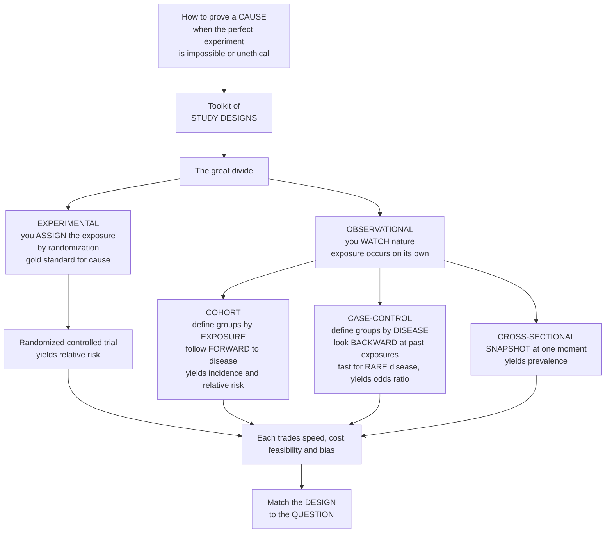

# 🔬 Epidemiologic Study Designs Overview

> [!abstract] TL;DR
> **How do you *prove* that something causes disease when you can't ethically or practically run the perfect experiment?** You cannot randomize people to smoke, to be poor, or to breathe polluted air — yet these are exactly the exposures epidemiology must judge. The answer is a **toolkit of study designs**, each a different strategy for comparing groups to estimate the association between an **exposure** and an **outcome**, as evidence for causation. The master division is **experimental vs observational**: in an experiment — a **randomized controlled trial** — the investigator *assigns* the exposure by a coin flip, and randomization makes the groups comparable, the gold standard for causal claims; but because randomizing harmful or social exposures is impossible, most epidemiology is **observational** — you simply *watch* what happens naturally. The main observational designs differ in **direction and timing**: a **cohort** study follows exposed and unexposed groups *forward* to see who gets sick; a **case-control** study works *backward* from people who already have the disease, comparing their past exposures to healthy controls; a **cross-sectional** study takes a *snapshot* at one moment. Each trades off speed, cost, feasibility, and vulnerability to bias, and they stack into an **evidence hierarchy**. The real skill is matching the right design to the question — that grammar is how population-health knowledge is made. *Educational content, not individual medical advice.*

---

## Intuition

**Analogy — different lenses for the same question.** Imagine you are a detective who suspects a factory is poisoning a town, but you are forbidden from running the one clean experiment that would settle it: you cannot round up two identical groups of townspeople, force half to drink the factory's runoff and half clean water, and wait. That would be monstrous. So instead you assemble a **toolkit of investigative strategies**, each looking at the same crime through a different lens. You could **follow** the people who happen to live downstream and the people upstream *forward in time* and count who falls ill — thorough, but you might wait twenty years. You could instead start from the **sick people already in the hospital** and work *backward*, asking what they drank compared to healthy neighbors — fast, and brilliant when the illness is rare, but memories are fallible and the sick may recall harder. Or you could take a single **snapshot** of the whole town today — quick and cheap, but a photograph can't tell you which came first, the exposure or the disease. Each lens sees something the others miss, and each has a characteristic blind spot.

That toolkit *is* epidemiology's method. Its sharpest lens is the one you usually can't use on humans: the **randomized experiment**, where you *assign* the exposure by chance so the two groups are alike in every hidden way except the one you're testing. When ethics or feasibility forbid the experiment — which is most of the time in the study of disease — you fall back on **observational** designs that merely *watch* nature run the exposure for you, and you fight, by cleverness and statistics, the biases that randomization would have swept away for free. There is a rough **hierarchy** of how much each design can be trusted, but the deeper truth is that the best design is the one that *fits the question* — its disease frequency, its latency, its ethics, its budget. Learning the menu of designs, and *why* each is chosen, is learning how epidemiology builds the case for what causes disease and what prevents it.

---

## How It Works

### The core idea: valid comparison as evidence for cause

Every design is, at heart, a machine for building a **valid comparison** — a group with the exposure set against a group without it (or, in case-control, a group with the disease against a group without it) — so that any difference in outcome can be attributed to the exposure rather than to some lurking third factor. The designs differ in *how* they assemble those groups and *when* they measure exposure and outcome, and those choices determine what each can measure and what can fool it.

1. **The goal.** Estimate the **association** between an exposure and an outcome, quantified by a measure of effect, and then judge whether that association reflects **causation** — using temporality, dose-response, and freedom from bias and confounding.
2. **The first fork — descriptive vs analytic.** **Descriptive** studies characterize disease patterns by **person, place, and time** (case reports and series, cross-sectional surveys, ecological correlations) and mainly *generate* hypotheses. **Analytic** studies *test* those hypotheses by an explicit comparison group.
3. **The second fork — experimental vs observational.** Within analytic studies, the **experimental** route has the investigator *assign* the exposure; the only clean way to do this is by **randomization**, which balances confounders — known *and unknown* — across arms. The **observational** route only *observes* an exposure that occurred naturally, because assigning cigarettes, poverty, or asbestos is impossible or unethical.
4. **The observational trio — direction and timing.** A **cohort** starts from the *exposure* and looks **forward** to the outcome, measuring **incidence** and **relative risk** directly. A **case-control** starts from the *outcome* and looks **backward** at past exposures, yielding an **odds ratio** — supremely efficient for rare diseases. A **cross-sectional** measures exposure and outcome *together* in a snapshot, giving **prevalence** but no sense of what came first.
5. **The measures each yields.** Cohort and RCT give the risk-based measures (relative risk, risk difference); case-control gives the odds ratio (which approximates relative risk only when the disease is rare); cross-sectional gives prevalence and the prevalence-odds ratio.
6. **The hierarchy — and its nuance.** Studies stack into an **evidence pyramid** rising from case reports through observational designs to RCTs and, at the apex, **systematic reviews and meta-analyses**. But the pyramid is a heuristic, not a law: *a well-conducted cohort study can be more trustworthy than a small, biased trial.*
7. **Choosing.** Match the design to the question by the frequency of the disease, the frequency of the exposure, the latency, the ethics, the budget, and the time available — always trading **validity against feasibility**.

### Flow / Architecture



---

## Key Concepts

### Secondary Level

- **Study design** = the *plan* for how you compare groups to find out whether something causes disease. Different plans suit different questions.
- **Exposure and outcome** = the suspected cause (smoking, a diet, a drug) and the effect (lung cancer, recovery). Epidemiology asks: are they linked, and does one cause the other?
- **Experiment vs observation** = in an **experiment** you *decide* who gets the exposure, usually by chance; in an **observational** study you just *watch* what people do naturally, because you can't make anyone smoke or be poor.
- **The three ways to watch:**
  - **Cohort** — pick people by whether they're exposed, then *follow them forward* to see who gets sick.
  - **Case-control** — start with people who *already have* the disease, then look *back* at what they were exposed to, comparing them to healthy people.
  - **Cross-sectional** — take a *snapshot* of everyone at once and see who is exposed and who is sick right now.
- **Why it matters:** picking the wrong design can make a real cause invisible or invent a fake one. The design is what makes the answer trustworthy.

### Undergraduate Level

- **Descriptive vs analytic.** *Descriptive* studies (case report, case series, cross-sectional survey, ecological study) map disease by **person, place, time** and generate hypotheses. *Analytic* studies (cohort, case-control, RCT) include a **comparison group** to *test* hypotheses.
- **Cohort study.** Define groups by **exposure status**, follow them over time, measure **incidence** in each. Directly gives **relative risk (RR)** and **risk difference**. **Prospective** (assemble now, follow into the future) or **retrospective** (use historical records to reconstruct exposure and then follow to already-occurred outcomes). *Strengths:* good for **rare exposures** and **multiple outcomes**, establishes temporality. *Weaknesses:* slow, costly, vulnerable to **loss to follow-up**.
- **Case-control study.** Define groups by **outcome/disease status** (cases vs controls), then look **backward** at prior exposures. Yields the **odds ratio (OR)**, which approximates RR only when the disease is rare. *Strengths:* fast, cheap, ideal for **rare diseases** and **long latency**. *Weaknesses:* prone to **recall bias** and **selection bias**; cannot compute incidence directly.
- **Cross-sectional study.** Measures exposure and outcome **simultaneously** in a defined population; the natural measure is **prevalence** and the **prevalence-odds ratio**. *Strength:* fast, good for surveillance and health-service planning. *Weakness:* cannot establish **temporality** — you can't tell whether the exposure preceded the disease.
- **Ecological study.** Uses **group-level** (aggregate) data — comparing rates across countries or regions. Cheap and hypothesis-generating, but risks the **ecological fallacy**: an association at the group level need not hold for individuals.
- **Randomized controlled trial (RCT).** The **experimental** design: the investigator randomly assigns exposure/treatment, so **randomization balances confounders** across arms. Strongest for causation; covered in depth in *Evidence-Based Medicine and Clinical Trials* and, at the population scale, in the sibling note below.
- **Measures of association.** **RR** and **risk difference** from cohort/RCT; **OR** from case-control; **prevalence ratio** from cross-sectional. Which measure you *can* compute is dictated by the design.
- **The evidence hierarchy.** Bottom to top: case report/series → cross-sectional/ecological → case-control → cohort → RCT → **systematic review & meta-analysis**. Higher = generally less vulnerable to bias.

### Graduate Level

- **Why randomization identifies a causal effect.** In the counterfactual framework, each person has two potential outcomes — under exposure and under non-exposure — but only one is observed. Randomization makes assignment **independent of potential outcomes**, so the group difference is an unbiased estimate of the **average treatment effect** (see [[Econometrics/05_Causal_Inference/Potential_Outcomes_Framework|Potential Outcomes Framework]]). Observational designs must instead *assume* **conditional exchangeability** — no unmeasured confounding — an untestable assumption they defend with adjustment, matching, or [[Econometrics/05_Causal_Inference/Propensity_Score_Matching|propensity scores]].
- **The rare-disease assumption.** The case-control **odds ratio** estimates the cohort **relative risk** only when the outcome is rare (so that odds ≈ risk). For common outcomes the OR exaggerates the RR — a routinely misread quantity. The Python demo below makes this convergence concrete.
- **Sampling in case-control design.** The validity of a case-control study hinges on selecting controls from the **same source population** that produced the cases (the study-base principle). **Density**, **cumulative**, and **case-cohort** sampling schemes determine whether the OR estimates the rate ratio, risk ratio, or odds ratio — a subtlety that dissolves many apparent paradoxes.
- **Directionality is not the same as temporality.** "Prospective/retrospective" describes the *timing of data collection*; it is orthogonal to the cohort-vs-case-control *logic*. A retrospective cohort still reasons exposure → outcome; a nested case-control inside a cohort still reasons outcome → exposure. Conflating the two axes is a classic error.
- **Characteristic biases by design.** Each design has signature threats: cohort → **loss to follow-up**, **healthy-worker effect**; case-control → **recall bias**, **selection/Berkson bias**; cross-sectional → **prevalence-incidence (Neyman) bias**, reverse causation; ecological → **ecological fallacy**. Bias is *design-specific*, which is why choosing the design partly chooses the enemy you must fight.
- **The hierarchy is defeasible.** GRADE and modern evidence appraisal rate *study conduct*, not just *study label*: a rigorous large cohort (e.g., the observational evidence on smoking) can outweigh a small, unblinded, high-dropout RCT. Design sets a ceiling on validity; execution decides where under that ceiling you land.
- **Hybrid and quasi-experimental designs.** Nested case-control, case-cohort, case-crossover, and **natural experiments** (instrumental variables, difference-in-differences, regression discontinuity) blur the experimental/observational line, borrowing randomization-like leverage from nature — the bridge to econometric [[Econometrics/05_Causal_Inference/Potential_Outcomes_Framework|causal inference]].
- **Choosing as an optimization.** Formally, design choice maximizes **statistical efficiency and validity** subject to constraints of ethics, cost, time, and disease/exposure frequency. Rare disease → case-control; rare exposure → cohort; ethics forbid randomizing a harm → observational; need an unbiased average effect and randomization is feasible → RCT.

---

## Python Demo

```python
# Epidemiologic study designs, two views:
#   (a) DESIGN COMPARISON MAP -- a matrix rating the major designs across the
#       dimensions that drive design choice: direction/timing, the measure of
#       association obtainable, speed & cost, suitability for rare disease vs
#       rare exposure, control of confounding, and evidence strength.
#   (b) EVIDENCE HIERARCHY -- the classic evidence pyramid from case reports at
#       the base to systematic reviews/meta-analyses at the apex.
# Plus a short numeric aside: WHY the case-control ODDS RATIO approximates the
# cohort RELATIVE RISK only when the disease is RARE (the rare-disease assumption).
import numpy as np
import matplotlib.pyplot as plt
from matplotlib.colors import ListedColormap
from matplotlib.patches import Polygon

# ---------------------------------------------------------------------------
# (a) DESIGN COMPARISON MAP
# ---------------------------------------------------------------------------
designs = ["Randomized\nControlled Trial", "Cohort", "Case-Control",
           "Cross-Sectional", "Ecological"]
dims = ["Timing /\nDirection", "Measure of\nassociation", "Speed &\ncost",
        "Rare\ndisease", "Rare\nexposure", "Confounder\ncontrol",
        "Evidence\nstrength"]

# Text shown in each cell
text = [
    ["Assign then\nfollow forward", "RR, risk\ndifference", "Slow,\ncostly",
     "Poor", "Good\n(you assign)", "Excellent\n(randomized)", "Highest\n(primary)"],
    ["Exposure ->\nforward", "RR,\nincidence", "Slow,\ncostly",
     "Poor", "Good", "Moderate\n(adjust)", "Strong"],
    ["Disease ->\nbackward", "Odds\nratio", "Fast,\ncheap",
     "Excellent", "Poor", "Weak\n(bias-prone)", "Moderate"],
    ["Snapshot,\none moment", "Prevalence,\nPOR", "Fast,\ncheap",
     "Poor", "Poor", "Weak\n(no time order)", "Weak-\nmoderate"],
    ["Group-level\nsnapshot", "Correlation", "Very\nfast",
     "N/A", "N/A", "Ecological\nfallacy", "Hypothesis-\ngenerating"],
]

# Favorability score for the background colour:
#   0 = descriptive (neutral), 1 = poor (red), 2 = moderate (amber), 3 = good (green)
score = np.array([
    [0, 0, 1, 1, 3, 3, 3],
    [0, 0, 1, 1, 3, 2, 3],
    [0, 0, 3, 3, 1, 1, 2],
    [0, 0, 3, 1, 1, 1, 2],
    [0, 0, 3, 0, 0, 1, 1],
])

cmap = ListedColormap(["#d9dce0", "#e0736b", "#f0c766", "#84c48c"])  # gray/red/amber/green

fig, (ax0, ax1) = plt.subplots(1, 2, figsize=(17, 7),
                               gridspec_kw={"width_ratios": [1.55, 1.0]})

ax0.imshow(score, cmap=cmap, vmin=-0.5, vmax=3.5, aspect="auto")
ax0.set_xticks(range(len(dims)))
ax0.set_xticklabels(dims, fontsize=8)
ax0.set_yticks(range(len(designs)))
ax0.set_yticklabels(designs, fontsize=9)
ax0.tick_params(length=0)
for i in range(len(designs)):
    for j in range(len(dims)):
        ax0.text(j, i, text[i][j], ha="center", va="center",
                 fontsize=6.5, color="#111827")
# thin white gridlines between cells
ax0.set_xticks(np.arange(-0.5, len(dims), 1), minor=True)
ax0.set_yticks(np.arange(-0.5, len(designs), 1), minor=True)
ax0.grid(which="minor", color="white", lw=2)
ax0.tick_params(which="minor", length=0)
ax0.set_title("(a) Design comparison map:\nmatch the design to the question", fontsize=11)

# ---------------------------------------------------------------------------
# (b) EVIDENCE HIERARCHY (pyramid)
# ---------------------------------------------------------------------------
levels = ["Case reports\n& case series",
          "Cross-sectional\n& ecological",
          "Case-control\nstudies",
          "Cohort\nstudies",
          "Randomized\ncontrolled trials",
          "Systematic reviews\n& meta-analyses"]
colors = ["#c0392b", "#e67e22", "#f1c40f", "#27ae60", "#2980b9", "#8e44ad"]
n = len(levels)

def half_width(h):          # pyramid half-width at height h in [0, 1]
    return 0.5 * (1.0 - h)

for i, (label, col) in enumerate(zip(levels, colors)):
    yb, yt = i / n, (i + 1) / n
    lb, rb = 0.5 - half_width(yb), 0.5 + half_width(yb)   # bottom edge
    lt, rt = 0.5 - half_width(yt), 0.5 + half_width(yt)   # top edge
    poly = Polygon([(lb, yb), (rb, yb), (rt, yt), (lt, yt)],
                   closed=True, facecolor=col, edgecolor="white", lw=2, alpha=0.9)
    ax1.add_patch(poly)
    ax1.text(0.5, (yb + yt) / 2, label, ha="center", va="center",
             fontsize=8.5, color="white", fontweight="bold")

ax1.annotate("increasing strength of evidence\n(and decreasing volume of studies)",
             xy=(1.02, 0.9), xytext=(1.02, 0.1),
             arrowprops=dict(arrowstyle="->", lw=1.6, color="#333"),
             fontsize=8, rotation=90, va="center", ha="center")
ax1.set_xlim(-0.05, 1.25)
ax1.set_ylim(0, 1)
ax1.axis("off")
ax1.set_title("(b) The evidence hierarchy", fontsize=11)

plt.tight_layout()
plt.savefig("epidemiologic_study_designs.png", dpi=120)

# ---------------------------------------------------------------------------
# Numeric aside: OR ~ RR only when the disease is RARE
# ---------------------------------------------------------------------------
def rr_and_or(a, b, c, d):
    # a,b = exposed diseased / healthy ; c,d = unexposed diseased / healthy
    risk_exp   = a / (a + b)
    risk_unexp = c / (c + d)
    rr = risk_exp / risk_unexp
    orr = (a * d) / (b * c)
    return rr, orr

# Common disease: exposed risk 0.40, unexposed risk 0.20
rr_c, or_c = rr_and_or(40, 60, 20, 80)
# Rare disease: exposed risk 0.004, unexposed risk 0.002 (same 2x relative risk)
rr_r, or_r = rr_and_or(4, 996, 2, 998)

print("Rare-disease assumption -- OR approximates RR only when disease is rare")
print(f"  Common disease : RR = {rr_c:.2f}   OR = {or_c:.2f}   -> OR overstates RR")
print(f"  Rare disease   : RR = {rr_r:.2f}   OR = {or_r:.2f}   -> OR ~ RR")
```

**What it shows.** *Panel (a)* is the working epidemiologist's cheat-sheet made visual. Reading across a row tells you what a design *is* (its timing and the measure it yields, in gray) and where it is **strong** (green) or **weak** (red): the RCT dominates on confounding control and evidence strength but is slow and useless for rare disease; the **case-control** flips this — cheap, fast, and *excellent* for rare disease, but poor for rare exposure and bias-prone; the **cohort** is the natural-history workhorse, strong for rare exposures and multiple outcomes but slow and costly; **cross-sectional** and **ecological** are fast and cheap but weak on temporality and vulnerable to the ecological fallacy. No design wins every column — that is the whole point, and why *matching design to question* is the skill. *Panel (b)* stacks these into the **evidence pyramid**: strength rises from anecdotal case reports at the base to synthesized systematic reviews at the apex, even as the *number* of available studies shrinks toward the top. The printed aside proves the graduate-level subtlety numerically: at a common disease the case-control **odds ratio** (2.67) badly overstates the true **relative risk** (2.0), but when the disease is rare the two collapse together (2.00 vs 2.00) — the exact condition under which the case-control design's headline number can be trusted.

---

## Real-World Applications

- **Doll and Hill's smoking-and-lung-cancer work (both designs, one truth).** The link was first nailed by a **case-control** study (1950) comparing the smoking histories of lung-cancer patients to controls — fast, because it started from the rare disease — and then confirmed by the **British Doctors cohort**, which followed tens of thousands of physicians *forward* for decades. The two designs, with complementary strengths, together built an unshakeable causal case that no single RCT could ethically have delivered.
- **The Framingham Heart Study (prospective cohort).** Following a whole town forward since 1948 gave the world the very concept of a "risk factor," identifying high blood pressure, cholesterol, and smoking as forward-predictors of cardiovascular disease — precisely the incidence-and-relative-risk output that only a cohort provides.
- **Case-control studies of rare cancers.** The link between **diethylstilbestrol (DES)** in pregnancy and a rare vaginal cancer in daughters was found by a small case-control study of just eight cases — a rare, long-latency outcome that a cohort could never have caught efficiently.
- **NHANES and cross-sectional surveillance.** The U.S. **National Health and Nutrition Examination Survey** takes a repeated cross-sectional snapshot of the population's health and exposures, powering prevalence estimates for obesity, diabetes, and hypertension that guide national policy — fast population portraits, with no claim about temporality.
- **Ecological studies and the seven-countries hypothesis.** Cross-national comparisons of dietary fat and heart-disease rates *generated* the diet-heart hypothesis; their ecological-fallacy limits then motivated the individual-level cohorts that tested it — the classic descriptive-generates, analytic-tests handoff.
- **The RECOVERY platform and cluster-randomized public-health trials.** When randomization *is* feasible and ethical — testing COVID-19 therapies, or a village-level water intervention — population RCTs sit atop the hierarchy, delivering the cleanest causal answers, as detailed in the sibling note on randomized trials in populations.

---

## Common Pitfalls

- **Confusing "prospective/retrospective" with "cohort/case-control."** These are two independent axes: timing of data collection versus the direction of reasoning. A *retrospective cohort* still reasons exposure → outcome; a *nested case-control* still reasons outcome → exposure. Say which axis you mean.
- **Reading a case-control odds ratio as a relative risk.** The OR only approximates the RR when the disease is **rare**; for common outcomes it exaggerates the effect. Check the base rate before you translate.
- **Inferring cause from a cross-sectional snapshot.** Because exposure and outcome are measured at the same instant, you usually cannot tell which came first — reverse causation and prevalence-incidence bias lurk. Cross-sectional data suggest hypotheses; they rarely settle them.
- **Committing the ecological fallacy.** An association between *group-average* exposure and *group-average* disease need not hold for individuals. Countries that eat more of something and have more of a disease do not prove that the individuals eating it are the ones getting sick.
- **Treating the evidence hierarchy as absolute.** "It's only observational" is lazy appraisal. A large, well-conducted cohort with a huge effect (smoking, RR ≈ 20) beats a small, biased, high-dropout trial. Rate the *conduct*, not just the *label*.
- **Ignoring loss to follow-up in cohorts.** People who drop out often differ systematically from those who stay; heavy or differential attrition quietly re-introduces the bias the design was meant to avoid. Report and analyze it.
- **Bad control selection in case-control studies.** Controls must come from the *same source population* that produced the cases. Hospital controls, volunteer controls, or convenient controls import selection bias and can invent or erase an association.
- **Forgetting that the design partly chooses the bias.** Each design has a signature enemy — recall bias for case-control, attrition for cohorts, the ecological fallacy for ecological studies. Anticipate the *characteristic* threat of the design you picked.

---

## Related Concepts

**Within this section (Study Designs).** This overview is the doorway to the individual design notes that follow, each a deep dive on a lens sketched here. *Cohort Studies* works through prospective and retrospective designs, incidence, relative risk, and the machinery of person-time and loss to follow-up. *Case-Control Studies* develops the backward logic, control selection from the study base, the odds ratio, and recall and selection bias. *Cross-Sectional and Ecological Studies* covers snapshot surveys, prevalence, the ecological fallacy, and their role in surveillance and hypothesis generation. *Randomized Controlled Trials in Populations* brings the experimental design to the community scale, including cluster-randomized and stepped-wedge trials. *Systematic Reviews and Meta-Analysis* sits at the apex of the hierarchy, synthesizing many studies into a single pooled estimate. These siblings are referenced in prose and live in this same section.

**Across the vault (Glob-verified links).**

- [[Clinical_Medicine/06_Clinical_Reasoning_and_Modern_Medicine/Evidence_Based_Medicine_and_Clinical_Trials|Evidence-Based Medicine and Clinical Trials]] — the clinical face of the same toolkit: the RCT, blinding, effect measures, and the evidence hierarchy applied to treatment decisions.
- [[Econometrics/05_Causal_Inference/Potential_Outcomes_Framework|Potential Outcomes Framework]] — the counterfactual formalism explaining *why* randomization identifies a causal effect and what observational designs must instead assume.
- [[Econometrics/05_Causal_Inference/Propensity_Score_Matching|Propensity Score Matching]] — how observational studies try to mimic randomization by balancing measured confounders, and why unmeasured confounding still bites.
- [[Logic_and_Critical_Thinking/03_Inductive_and_Probabilistic_Reasoning/Causal_Reasoning|Causal Reasoning]] — correlation-versus-causation, Mill's methods, and the logic of inferring cause that study designs operationalize.
- [[Mathematics/06_Probability_and_Statistics/Statistical_Inference|Statistical Inference]] — the estimation, confidence-interval, and hypothesis-testing machinery that turns each design's raw comparison into a quantified, uncertainty-bounded result.

---

## Review Questions

1. **Conceptual (Secondary/Undergraduate).** In plain language, explain the difference between an **experimental** and an **observational** study, and give one reason epidemiologists so often *have* to use observational designs when studying the causes of disease. Then describe, in one sentence each, how a **cohort**, a **case-control**, and a **cross-sectional** study each assemble their comparison groups.
2. **Scenario (Undergraduate).** You are asked to investigate a suspected link between a **rare** childhood cancer and a **common** household exposure, and you have limited time and money. Which design would you choose, and why? Which measure of association would it yield, what would be its two biggest threats to validity, and how would you defend against each?
3. **Trade-off / evaluative (Graduate).** A colleague dismisses a large, carefully conducted **cohort** study on a suspected environmental toxin because "it isn't a randomized trial, so it's low on the evidence pyramid." Critique this claim: under what conditions can a cohort study be *more* trustworthy than an available RCT, why is randomizing this particular exposure impossible, and what specific features of the cohort's design and conduct would you scrutinize before accepting its causal conclusion?

---

## Sources

- Gordis, L. (Celentano, D. D., & Szklo, M., eds.). *Gordis Epidemiology* (6th ed.). Elsevier — the standard introduction to study designs, measures of association, and causal inference.
- Rothman, K. J. *Epidemiology: An Introduction* (2nd ed.). Oxford University Press — concise, conceptually rigorous treatment of design logic, effect measures, and bias.
- Szklo, M., & Nieto, F. J. *Epidemiology: Beyond the Basics* (4th ed.). Jones & Bartlett — deeper treatment of design nuances, control selection, and confounding.
- Grimes, D. A., & Schulz, K. F. (2002). "An overview of clinical research: the lay of the land." *The Lancet*, 359(9300), 57–61 — a classic, readable map of the study-design taxonomy.
- Grimes, D. A., & Schulz, K. F. (2002). "Cohort studies: marching towards outcomes" and "Bias and causal associations in observational research." *The Lancet* series — the companion design-by-design overviews.

---

#epidemiology #study-design #observational-studies #experimental-studies #evidence-hierarchy
