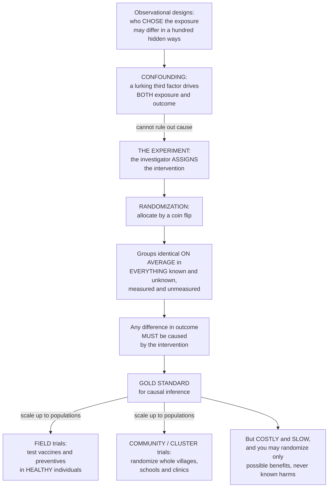

# 🎲 Randomized Controlled Trials in Populations

> [!abstract] TL;DR
> Every *observational* study in epidemiology shares one nagging weakness: the people who chose an exposure may differ from those who didn't in a hundred hidden ways (**confounding**), so you can never be certain the exposure *itself* caused any difference in outcome. The **experiment** cuts this knot with one radical move — **randomization**: the investigator *assigns* the intervention by the flip of a coin, and because chance is blind, the two groups come out statistically identical *on average* in **everything** — known and unknown, measured and unmeasured. Any remaining difference in outcome must then be caused by the intervention. That is why the **randomized controlled trial (RCT)** is epidemiology's *gold standard for causal inference*. In public health the design scales up beyond a single drug: a **field trial** tests preventives (a new vaccine, a chemoprophylaxis) in *healthy* people before disease strikes — as in the colossal 1954 Salk polio-vaccine trial — while a **community** or **cluster-randomized trial** randomizes whole *groups* (villages, schools, clinics) rather than individuals, to evaluate interventions delivered at population level (water fluoridation, mass-media campaigns, screening programmes) or where individual randomization is impossible. The catches are severe and define the discipline: trials are **expensive**, **slow**, and — decisively — you may only ethically randomize things that *might help*, never known harms. Because you cannot randomize anyone *to smoke*, most risk-factor questions can never be trialed, which is precisely why so much of epidemiology must remain observational.

---

## Intuition

**Analogy — you can't argue with a coin.** Suppose a hospital reports that patients who received a new drug did *worse* than those who didn't. Damning? Not yet. Maybe the sickest patients were the ones given the drug in the first place — doctors reach for the strongest medicine when things look grim. The drug and the outcome are tangled up with *baseline severity*, and no amount of staring at the data separates them. This is **confounding**: the exposed and the unexposed differ in some background factor that also drives the outcome, so a raw comparison compares apples to sicker apples. You can try to *measure* and *adjust for* the confounders you can name — but the ones you never thought of, or can't measure, stay hidden, and they keep the door to "maybe it wasn't the drug" permanently ajar.

Now imagine you decide *who gets the drug by flipping a coin*. Heads, you treat; tails, you don't. The coin doesn't know how sick anyone is, doesn't know their age, their genes, their diet, their income, their unmeasured frailty — it knows *nothing*, and that ignorance is its superpower. Because assignment is pure chance, the treated and untreated groups end up looking the same, on average, in *every* respect except the one you control: whether they got the drug. Sicker and healthier, rich and poor, the factors you measured and the thousand you didn't — all sprinkle evenly across both arms. So if the treated group now does better, the *only* systematic thing that differs between the groups is the treatment, and the difference must be *caused* by it. That single move — **randomization** — is what turns a suggestive correlation into proof of cause, and it is why the **randomized controlled trial** sits at the top of every hierarchy of evidence.

In epidemiology and public health the idea gets *bigger*. You can't randomize one child to a fluoridated water supply while her neighbour drinks unfluoridated water from the same tap — so you randomize whole *towns*. You can't wait for a rare disease to appear to test a **vaccine** — so you enroll a healthy population and randomize *before* anyone is exposed. Understanding the randomized trial — its unique power to defeat confounding, its scaled-up community and field forms, and the ethical fence that says you may only gamble with *possible benefits, never known harms* — is to understand both the strongest evidence epidemiology can offer and the reason so much of the field must settle for careful observation instead.

---

## How It Works

### Core mechanics

An RCT is defined by what the investigator *does* rather than merely *watches*:

1. **Assign, don't observe.** In observational designs (cohort, case-control) exposure is chosen by the subjects and the world; in an **experiment** the investigator *allocates* the intervention. This is the single structural difference that makes causal inference clean.
2. **Randomize the allocation.** Each subject (or cluster) is assigned to intervention or comparison by a chance mechanism — a random-number generator, sealed envelopes, a central computer. Randomization is what balances confounders across arms *on average*, including the unmeasured and unknown ones no adjustment could ever reach.
3. **Conceal the allocation.** **Allocation concealment** keeps the person enrolling subjects from knowing or predicting the next assignment, so they cannot (consciously or not) steer sicker or healthier people into a preferred arm. Concealment protects the randomization *at the moment of entry*; blinding protects it *afterward*.
4. **Define the comparison.** The control arm receives a **placebo**, the current **standard of care**, or **no intervention** — chosen so the only systematic difference between arms is the intervention under test.
5. **Blind (mask) where possible.** **Blinding** hides who is in which arm from subjects (single), from those delivering care and measuring outcomes (double), and sometimes from analysts (triple), preventing *performance* and *ascertainment* bias — differential behaviour or differential outcome-measurement between arms.
6. **Pre-specify outcomes and analysis.** Primary and secondary endpoints, the sample size, and the statistical plan are fixed *before* the data arrive, to stop outcome-shopping and p-hacking.
7. **Analyze by intention-to-treat (ITT).** Subjects are analyzed *in the arm they were randomized to*, regardless of whether they actually complied. ITT preserves the balance that randomization created — the moment you analyze "as treated," you re-introduce the very self-selection randomization was meant to destroy. It answers the pragmatic question ("what happens if we *offer* this?") and gives a conservative, unbiased estimate.

### From single drug to whole populations

The same skeleton scales into three public-health forms that differ in *who is randomized* and *what is tested*:

- **Clinical trials** randomize *individual patients* to test *treatments* for people who already have disease (this overlaps the clinical evidence-based-medicine view; see prose links below).
- **Field trials** randomize *individuals in the community* to test *preventive* interventions in **healthy** people *before* disease occurs — the domain of **vaccine** trials and chemoprevention. Because most people never get the disease, field trials must be *enormous* to accumulate enough cases to compare, which is why the 1954 Salk polio trial enrolled well over a million children.
- **Community / cluster-randomized trials** randomize *whole groups* — villages, schools, clinics, workplaces — rather than individuals. You use them when the intervention is *delivered at group level* (fluoridating a reservoir, a town-wide media campaign, a clinic-level screening protocol, a policy), when the effect works *through the group* (herd immunity), or when individual randomization is simply impossible or would cause **contamination** between neighbours. The price is the **design effect**: people in the same cluster resemble each other (measured by the **intracluster correlation coefficient, ICC**), so each additional person adds *less* independent information — inflating the required sample size. **Stepped-wedge** designs are a variant in which clusters cross over to the intervention in a staggered, randomized order.

### The logic in one picture



*Read top to bottom: the incurable doubt of observation — hidden differences between the exposed and unexposed — is resolved by the experiment, whose randomization balances every confounder on average, so outcome differences become attributable to the intervention. That power scales into field and community trials for public health, bounded always by cost, time, and the ethical rule that you may gamble only with possible good.*

---

## Key Concepts

### Secondary (intuitive)

- **Experiment vs observation** = in an experiment *you* decide who gets the treatment; in an observational study you just watch what people already do. Deciding yourself is what lets you prove cause.
- **Randomization** = choosing who gets the treatment by chance, like flipping a coin. Because the coin is blind, the two groups end up alike in every other way.
- **Confounding** = a hidden third thing that makes a treatment look better or worse than it really is (the sickest patients getting the strongest drug). Randomization sweeps it away.
- **Control group** = the group that *doesn't* get the new intervention — a fake pill (placebo) or the usual care — so you have something fair to compare against.
- **Gold standard** = the randomized controlled trial is the most trusted way to know whether something truly works, because it removes the guesswork about hidden differences.
- **Community trial** = instead of one person at a time, you randomize whole towns or schools — the only way to test things like fluoridated water that a single person can't opt into.

### Undergraduate (formal)

- **The unique power of randomization.** Randomization balances **confounders — known and unknown, measured and unmeasured — across the arms on average**, so the comparison groups are *exchangeable*. This is why an RCT identifies the causal effect while observational designs can only ever adjust for confounders they can name and measure.
- **Core design elements.** A defined **intervention** and **comparison** (placebo / standard / none), **randomization** with **allocation concealment**, **blinding (masking)** to curb performance and ascertainment bias, **pre-specified outcomes**, **intention-to-treat** analysis, and a **sample size** driven by the desired statistical **power**.
- **Three public-health types.** **Clinical trials** (individuals, treatment); **field trials** (individuals, *preventives* in healthy people — vaccines, chemoprevention); **community / cluster-randomized trials** (groups — communities, schools, clinics — for group-level interventions or where individual randomization is impossible).
- **Efficacy vs effectiveness; explanatory vs pragmatic.** *Efficacy* asks whether an intervention works under ideal, controlled conditions; *effectiveness* asks whether it works in routine practice. Explanatory trials chase efficacy under tight control; pragmatic trials measure effectiveness in the messy real world.
- **Intention-to-treat vs per-protocol.** ITT (analyze as randomized) preserves randomization and is unbiased but dilutes the effect with non-compliers; per-protocol (analyze only the compliant) estimates biological efficacy but re-opens the door to selection bias, because compliance is not random.

### Graduate (mechanistic and systems)

- **Potential outcomes and exchangeability.** Under the Neyman-Rubin **counterfactual** model, each subject has outcomes Y(1) and Y(0); only one is observed. Randomization makes treatment assignment *independent of the potential outcomes*, so the observed difference in means is an unbiased estimate of the **average treatment effect (ATE)** — the formal statement of "randomization defeats confounding." Balance is a *probabilistic* guarantee (it holds *on average* and in expectation), which is why any single small trial can still be imbalanced by chance, and why we report baseline tables and sometimes stratify or minimize.
- **The design effect and effective sample size.** In a cluster trial, responses within a cluster are correlated by the **ICC** (ρ). The variance is inflated by the **design effect** DEff = 1 + (m − 1)ρ, where m is the (average) cluster size; the **effective sample size** is N / DEff. Even a tiny ρ, multiplied by a large m, can slash effective sample size dramatically — so cluster trials need *many more* subjects, and often *more clusters* (the number of clusters, not people, drives power). Analysis must respect the clustering (mixed models, GEE, or cluster-level summaries) or standard errors are badly understated.
- **Power, minimum detectable effect, and sample size.** Power = 1 − β is the probability of detecting a true effect of a given size at significance α. Sample size grows with variance and with the inverse square of the effect size; underpowered trials both miss real effects and, when they do reach significance, exaggerate them (the *winner's curse*). Cluster trials must additionally pay the design-effect tax.
- **Equipoise and the ethics that bound the design.** A trial is ethical only under **clinical equipoise** — genuine uncertainty in the expert community about which arm is better. This is the deep reason most of epidemiology is observational: you may randomize a *possible* benefit, never a *known harm*. No ethics board will let you randomize people to smoke, to breathe polluted air, or to eat a suspected carcinogen, so the causal questions behind most risk factors are permanently off-limits to experiment and must be answered by cohort and case-control studies plus careful causal-inference machinery.
- **Threats even randomization cannot fix.** Randomization guarantees *internal* validity at baseline, but **non-compliance**, **loss to follow-up** (attrition), **contamination** (control clusters getting the intervention), **placebo/Hawthorne effects**, and limited **external validity** (generalizability) all erode a trial post-randomization. Community trials add their own: few clusters (weak balance), spillover between arms, and the sheer logistics of intervening on whole populations.

---

## Python Demo

```python
# Randomized Controlled Trials in Populations -- two core lessons:
#   (a) RANDOMIZATION DEFEATS CONFOUNDING. We build a population with a HIDDEN
#       confounder U (baseline frailty) that both raises the outcome score AND,
#       under OBSERVATIONAL self-selection, makes frailer people more likely to be
#       "treated" (confounding by indication). The observational treated-minus-control
#       comparison is badly BIASED. RANDOM assignment (a coin flip, independent of U)
#       balances U across the arms, so the estimate recovers the TRUE causal effect.
#       We also show the imbalance in U shrinks toward zero as sample size grows for a
#       randomized trial, but stays stubbornly large for the observational comparison.
#   (b) THE CLUSTER DESIGN EFFECT. When you randomize whole villages/schools instead of
#       individuals, people within a cluster are correlated (ICC = rho), so each extra
#       person adds less information. The DESIGN EFFECT 1 + (m-1)*rho shrinks the
#       EFFECTIVE sample size -- why community trials need many more people.
import numpy as np
import matplotlib.pyplot as plt

rng = np.random.default_rng(1954)   # 1954: the Salk polio field trial

# ------------------------------------------------------------------ ground truth
TAU    = -5.0     # TRUE causal effect: the intervention lowers an outcome score by 5
BETA_U = 10.0     # how strongly the hidden confounder U drives the outcome
N      = 4000     # individuals

U = rng.normal(0.0, 1.0, N)                       # hidden confounder (baseline frailty)

def outcome(T, U):
    # higher U -> worse (higher) score; T = intervention shifts by TAU
    return 50.0 + BETA_U * U + TAU * T + rng.normal(0.0, 5.0, U.size)

# (1) OBSERVATIONAL: frailer people (high U) self-select INTO treatment
p_treat = 1.0 / (1.0 + np.exp(-1.5 * U))          # P(T=1) rises with U -> confounding
T_obs = (rng.uniform(size=N) < p_treat).astype(int)
Y_obs = outcome(T_obs, U)
est_obs = Y_obs[T_obs == 1].mean() - Y_obs[T_obs == 0].mean()

# (2) RANDOMIZED: pure coin flip, INDEPENDENT of U
T_rct = (rng.uniform(size=N) < 0.5).astype(int)
Y_rct = outcome(T_rct, U)
est_rct = Y_rct[T_rct == 1].mean() - Y_rct[T_rct == 0].mean()

print(f"True causal effect      : {TAU:+.2f}")
print(f"Observational estimate  : {est_obs:+.2f}  <- biased by confounding")
print(f"Randomized estimate     : {est_rct:+.2f}  <- unbiased")

# --------------------------------------------- balance of U vs sample size
def abs_smd(u, t):                                # |standardized mean difference| of U
    return abs(u[t == 1].mean() - u[t == 0].mean()) / u.std()

sizes = np.array([40, 80, 160, 320, 640, 1280, 2560, 5120, 10240])
smd_rct, smd_obs = [], []
for n in sizes:
    reps_r, reps_o = [], []
    for _ in range(200):                          # average over many trials of size n
        un = rng.normal(0.0, 1.0, n)
        tr = (rng.uniform(size=n) < 0.5).astype(int)
        reps_r.append(abs_smd(un, tr))
        po = 1.0 / (1.0 + np.exp(-1.5 * un))
        to = (rng.uniform(size=n) < po).astype(int)
        reps_o.append(abs_smd(un, to))
    smd_rct.append(np.mean(reps_r))
    smd_obs.append(np.mean(reps_o))

# --------------------------------------------- cluster design effect
rho    = np.linspace(0.0, 0.20, 200)              # intracluster correlation (ICC)
sizes_m = [10, 30, 100]                           # people per cluster

# ================================================================== plotting
fig, ax = plt.subplots(2, 2, figsize=(14, 10))

# (a) OBSERVATIONAL: U is imbalanced between arms
bins = np.linspace(-3.5, 3.5, 40)
ax[0, 0].hist(U[T_obs == 1], bins=bins, alpha=0.6, color="#C0392B", label="Treated")
ax[0, 0].hist(U[T_obs == 0], bins=bins, alpha=0.6, color="#2980B9", label="Control")
ax[0, 0].set_title(f"(a) OBSERVATIONAL: confounder U IMBALANCED\n"
                   f"estimate {est_obs:+.1f} vs truth {TAU:+.1f}")
ax[0, 0].set_xlabel("Hidden confounder U (baseline frailty)")
ax[0, 0].set_ylabel("Count")
ax[0, 0].legend()

# (b) RANDOMIZED: U is balanced between arms
ax[0, 1].hist(U[T_rct == 1], bins=bins, alpha=0.6, color="#C0392B", label="Treated")
ax[0, 1].hist(U[T_rct == 0], bins=bins, alpha=0.6, color="#27AE60", label="Control")
ax[0, 1].set_title(f"(b) RANDOMIZED: confounder U BALANCED\n"
                   f"estimate {est_rct:+.1f} vs truth {TAU:+.1f}")
ax[0, 1].set_xlabel("Hidden confounder U (baseline frailty)")
ax[0, 1].set_ylabel("Count")
ax[0, 1].legend()

# (c) balance improves with sample size (randomized) but not observational
ax[1, 0].plot(sizes, smd_obs, "o-", color="#C0392B", lw=2,
              label="Observational (stays imbalanced)")
ax[1, 0].plot(sizes, smd_rct, "o-", color="#27AE60", lw=2,
              label="Randomized (balance -> 0)")
ax[1, 0].axhline(0.1, color="gray", ls="--", label="rule-of-thumb balance threshold")
ax[1, 0].set_xscale("log")
ax[1, 0].set_title("(c) Randomization balances U better as N grows")
ax[1, 0].set_xlabel("Sample size N (log scale)")
ax[1, 0].set_ylabel("|standardized diff in U between arms|")
ax[1, 0].legend()

# (d) cluster design effect shrinks the effective sample size
for m in sizes_m:
    deff = 1.0 + (m - 1) * rho
    ax[1, 1].plot(rho, 1.0 / deff, lw=2, label=f"{m} people per cluster")
ax[1, 1].set_title("(d) CLUSTER trials: design effect cuts effective sample")
ax[1, 1].set_xlabel("Intracluster correlation ICC (rho)")
ax[1, 1].set_ylabel("Effective fraction of sample = 1 / DEff")
ax[1, 1].set_ylim(0, 1.02)
ax[1, 1].legend()

plt.tight_layout()
plt.show()
```

**What you see.** *Panels (a) and (b)* are the whole argument in two histograms. Under **observational** self-selection the frail (high-U) subjects pile into the treated arm, so the treated and control distributions of the hidden confounder don't line up — and the naive comparison lands far from the truth, even making a *beneficial* intervention look useless or harmful. Flip to **randomization** and the two distributions of U snap into alignment; with the confounder balanced, the estimate recovers the true effect of −5. *Panel (c)* drives home that this is randomization's *unique* gift: the imbalance in U melts toward zero as the trial grows, while the observational imbalance is *structural* and barely budges no matter how much data you collect — you cannot buy your way out of confounding with sample size. *Panel (d)* is the community-trial tax: because people in the same village or school are correlated (ICC > 0), the **design effect** 1 + (m − 1)ρ shrinks the *effective* sample size, and with large clusters even a small ICC can erase most of your statistical power — the quantitative reason cluster-randomized trials must enroll far more people than an individually randomized trial to answer the same question.

---

## Real-World Applications

- **The Salk polio-vaccine field trial (1954).** One of the largest experiments ever run: roughly 1.8 million American schoolchildren, with about 200,000 randomized to vaccine and 200,000 to placebo in the double-blind portion. It tested a *preventive* in *healthy* children before disease struck — the archetypal **field trial** — and its randomized, placebo-controlled design is why the vaccine's efficacy was believed instantly and universally.
- **Modern vaccine trials.** COVID-19 vaccine authorizations rested on large randomized, double-blind, placebo-controlled field trials reporting efficacy against symptomatic infection. The same template governs trials of malaria, HPV, and RSV vaccines.
- **Community water fluoridation and the cluster design.** You cannot randomize one household to fluoridated water while its neighbour drinks unfluoridated water from the same main, so classic evaluations randomized or assigned *whole towns* — a **community trial** whose unit of allocation is the population.
- **Cluster-randomized public-health programmes.** Bed-net distribution against malaria, school-based deworming, hand-washing and sanitation campaigns, mass-media health messaging, and clinic-level quality-improvement protocols are routinely evaluated by randomizing villages, schools, or clinics, with analysis that accounts for the ICC and design effect.
- **Stepped-wedge rollouts.** When a programme *must* eventually reach everyone (a new screening protocol, an infection-control bundle), health systems roll it out to clusters in a randomized, staggered order — a **stepped-wedge** cluster trial that yields rigorous evidence while still delivering the intervention to all.
- **Where trials are impossible — and observation must take over.** The smoking-and-lung-cancer link, the effects of air pollution, occupational carcinogens, and dietary risks were *never* established by RCTs, because randomizing people to a suspected harm is unethical. Those causal claims rest on cohort and case-control studies plus causal-inference reasoning — the standing reminder of why the field is mostly observational.

---

## Common Pitfalls

- **Breaking the randomization at analysis.** Switching from **intention-to-treat** to "as-treated" or per-protocol analysis to chase a bigger effect quietly re-introduces the self-selection that randomization destroyed — non-compliers are not a random subset. Report ITT as primary.
- **Ignoring the design effect in cluster trials.** Analyzing a cluster-randomized trial as though the individuals were independent understates standard errors, inflates the false-positive rate, and produces spuriously "significant" results. Power and analysis must both account for the ICC; often the *number of clusters*, not the number of people, is the binding constraint.
- **Too few clusters.** Randomizing only a handful of villages or clinics leaves randomization unable to guarantee balance — with, say, six clusters per arm, a single atypical cluster can swamp the comparison. Balance is a *large-sample* promise; small numbers of units break it.
- **Contamination between arms.** In community and field trials, control subjects may adopt the intervention (a neighbour shares a bed net; the health message crosses the town line), shrinking the apparent effect. It is a chief reason to randomize *groups* rather than individuals in the first place.
- **Loss to follow-up and non-compliance.** Attrition that differs by arm re-creates confounding after baseline; heavy non-compliance dilutes ITT toward the null. Both must be minimized by design and probed in sensitivity analyses.
- **Confusing efficacy with effectiveness.** A tightly controlled explanatory trial can show an intervention *can* work under ideal conditions yet say little about whether it *will* work in routine practice with imperfect adherence and real populations.
- **Mistaking a single trial's balance for a guarantee.** Randomization balances confounders *on average*, not in every realization. A small trial can still be imbalanced by chance — which is why baseline tables, stratified or block randomization, and replication matter, and why one small "positive" trial is weaker evidence than its p-value suggests.

---

## Related Concepts

**Within this vault (Section 02 – Study Designs, sibling notes referenced in prose).** This note is the *experimental* member of the study-design family and is best read against the *observational* designs it is defined in contrast to. The forthcoming **Epidemiologic Study Designs Overview** places the RCT at the apex of the hierarchy of evidence, above the observational tiers; **Cohort Studies** are the observational design closest in spirit to a trial (they follow exposed and unexposed forward in time) and are the workhorse for the risk factors that *cannot* be randomized; **Causal Inference in Epidemiology** supplies the counterfactual and directed-acyclic-graph machinery that formalizes *why* randomization identifies a causal effect while adjustment in observational data cannot fully do so; **Confounding and Effect Modification** is the exact problem randomization was invented to solve — the whole rationale of the experiment; and **Systematic Reviews and Meta-Analysis** sit *above* the individual RCT, pooling many trials into the strongest summary evidence public health can offer. These are prose references to sibling notes in this vault, kept unlinked here by design; the trial is the pivot around which the rest of the study-design section turns.

**Across the vault (Glob-verified links).**

- [[Clinical_Medicine/06_Clinical_Reasoning_and_Modern_Medicine/Evidence_Based_Medicine_and_Clinical_Trials|Evidence-Based Medicine and Clinical Trials]] — the *individual/clinical* complement to this *population* view: the same randomization, blinding, and ITT machinery seen from the bedside and the drug-approval process.
- [[Econometrics/05_Causal_Inference/Potential_Outcomes_Framework|Potential Outcomes Framework]] — the Neyman-Rubin counterfactual formalism that proves *why* random assignment yields an unbiased average treatment effect; the theory beneath the coin flip.
- [[Econometrics/05_Causal_Inference/Difference_in_Differences|Difference in Differences]] — a leading *quasi-experimental* fallback for exactly the population-policy questions (fluoridation, a new programme) that cannot be individually randomized.
- [[Econometrics/05_Causal_Inference/Instrumental_Variables|Instrumental Variables]] — a design that mimics randomization from observational data, and the tool used to recover efficacy under non-compliance in trials.
- [[Mathematics/06_Probability_and_Statistics/Statistical_Inference|Statistical Inference]] — the hypothesis-testing, power, confidence-interval, and sample-size machinery that decides how big a trial must be and what its result means.
- [[Ethics_and_Applied_Ethics/02_Bioethics_and_Medical_Ethics/Research_Ethics_and_Human_Subjects|Research Ethics and Human Subjects]] — clinical equipoise, review boards, and trial registration: the ethical fence that lets you randomize possible benefits but never known harms.
- [[Ethics_and_Applied_Ethics/02_Bioethics_and_Medical_Ethics/Informed_Consent_and_Autonomy|Informed Consent and Autonomy]] — the consent requirement that governs enrolling human subjects into any trial arm.
- [[Health_Nutrition_and_Longevity/06_Public_Health_and_Prevention/Infectious_Disease_Vaccines_and_Immunity|Infectious Disease, Vaccines and Immunity]] — the biology behind the vaccine field trials that are this design's most famous application.

---

## Review Questions

**Secondary.** A hospital finds that patients given a new drug did *worse* than those who weren't. Explain, without any statistics, why this does *not* prove the drug is harmful — and how deciding who gets the drug *by flipping a coin* would let you actually find out whether the drug helps or hurts.

**Undergraduate.** Distinguish a **field trial** from a **community (cluster-randomized) trial**, giving one real example of each and explaining *what* is randomized in each case. Then explain why a public-health team would choose to randomize whole *schools* rather than individual children to evaluate a hand-washing programme, and name one statistical cost they pay for that choice.

**Graduate.** Epidemiology calls the RCT its "gold standard," yet the causal claims that smoking causes lung cancer and that air pollution shortens life were established *without any RCT*. (a) Using the idea of **clinical equipoise**, explain precisely why those questions cannot be answered experimentally. (b) State, in potential-outcomes terms, what property randomization confers that observational adjustment cannot guarantee. (c) A cluster-randomized trial of a school nutrition programme reports a significant benefit but analyzed pupils as if independent; explain via the **design effect** why its p-value is untrustworthy and what should have been done instead.

---

## Sources

- Gordis, L. (Celentano, D. D., & Szklo, M., eds.). *Gordis Epidemiology* (6th ed.). Elsevier — chapters on randomized trials: design, randomization, blinding, intention-to-treat, and the Salk polio field trial.
- Rothman, K. J. *Epidemiology: An Introduction* (2nd ed.). Oxford University Press — the logic of experiments, confounding, and why randomization identifies causal effects.
- Hayes, R. J., & Moulton, L. H. *Cluster Randomised Trials* (2nd ed.). Chapman & Hall / CRC — the definitive treatment of community/cluster designs, the intracluster correlation, and the design effect.
- Friedman, L. M., Furberg, C. D., DeMets, D. L., Reboussin, D. M., & Granger, C. B. *Fundamentals of Clinical Trials* (5th ed.). Springer — trial design, allocation concealment, blinding, sample size, and analysis.
- Rose, G. *Rose's Strategy of Preventive Medicine* (Rose, Khaw, & Marmot, eds.). Oxford University Press — the population-strategy rationale behind community-level preventive interventions.

---

#epidemiology #randomized-controlled-trial #cluster-trial #community-trial #randomization
