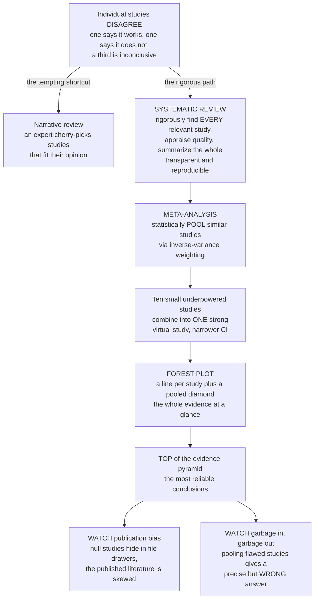

# 🌲 Systematic Reviews and Meta-Analysis

> [!abstract] TL;DR
> Individual studies disagree — one trial finds a drug works, another finds it does not, a third is inconclusive. Whom do you believe? The answer sits at the very **top of the evidence pyramid**: do not cherry-pick one study, systematically **combine them all**. A **systematic review** is a rigorous, transparent, reproducible process for finding *every* relevant study on a question (not just the ones you happen to like), appraising each one's quality, and summarizing what the whole body of evidence says — the opposite of a traditional **narrative review** where an expert quotes whatever supports their view. When the studies are similar enough, you can go further and statistically **pool** their results into a single, more powerful estimate — that is **meta-analysis**, and its magic is **statistical power**: ten small studies, each too small to be sure, combine into one big virtual study strong enough to detect a real effect. The iconic output is the **forest plot** — a stack of horizontal lines, one per study, with a diamond at the bottom pooling them all — letting you *see* the totality of evidence at a glance. But the method has famous traps: **publication bias** (exciting positive results get published while boring null ones vanish into file drawers) and **garbage in, garbage out** (pooling flawed studies gives a precise-looking but wrong answer). Done properly, evidence synthesis is how medicine and public health reach their most reliable conclusions — the basis of Cochrane reviews and evidence-based guidelines. *Educational content, not individual medical advice.*

---

## Intuition

**Analogy:** Suppose ten different juries in ten different towns each hear a slightly different slice of the same case. One convicts, one acquits, three are hung, the rest lean one way or the other. If a journalist wanted to mislead you, they would quote the single jury whose verdict fit their story — that is a **narrative review**, an expert citing whichever studies flatter their opinion. A fairer process is to first *find every jury that ever ruled* (including the quiet ones nobody talks about), *check that each trial was run fairly* (throw out the ones with tampered evidence), and only then ask what the verdicts, taken together, actually say. That disciplined, documented procedure is a **systematic review**.

Now go one step further. Each jury alone is small and its verdict is noisy, but if the ten trials were similar enough you can *pool* their votes into one giant super-jury — and a super-jury of a thousand voters is far harder to fool than any single panel of twelve. That statistical pooling is **meta-analysis**, and the payoff is **power**: uncertainty shrinks as the effective sample size grows, so effects too faint for any single study to confirm suddenly become visible. The catch is that the super-jury is only as honest as the trials feeding it. If the quiet juries were silenced because their verdicts were dull — **publication bias** — or if half the trials had tampered evidence — **garbage in, garbage out** — then a very confident-looking verdict can still be flatly wrong.

---

## How It Works

### Core Mechanics

A systematic review is a *pre-planned protocol*, not a casual reading. The pipeline is deliberately mechanical so that a second team could reproduce it:

1. **Frame a focused question (PICO).** State the **P**opulation, **I**ntervention (or exposure), **C**omparator, and **O**utcome precisely. "Does the drug help?" becomes "In adults with hypertension (P), does drug X (I) versus placebo (C) reduce stroke (O)?" The question fixes what counts as a relevant study.

2. **Search comprehensively and document it.** Query multiple databases with an explicit, published search string, and hunt deliberately for the *hard-to-find* studies — conference abstracts, trial registries, theses, unpublished data — because the whole point is to avoid the selection that plagues narrative reviews. Every hit and every exclusion is logged (the **PRISMA flow diagram**).

3. **Apply explicit inclusion/exclusion criteria.** Two reviewers independently screen titles, abstracts, then full texts against pre-specified rules, resolving disagreements by discussion. Deciding *after* seeing results which studies to keep is how bias sneaks back in, so the rules are set in advance.

4. **Extract data and appraise quality.** Pull each study's design, sample size, and effect estimate onto a standard form, then run a **risk-of-bias / critical appraisal** assessment (randomization, blinding, attrition, selective reporting). A study's *weight in the conclusion should reflect its trustworthiness.*

5. **Synthesize.** If the studies are too different to combine, summarize qualitatively. If they are similar enough, run a **meta-analysis** to pool them quantitatively, and rate the overall certainty of the evidence (**GRADE**).

**Meta-analysis mechanics.** Pooling is a *weighted average*, not a simple one — a study of 5,000 people should count far more than one of 30. For each study you take its **effect size** (a risk ratio, odds ratio, or mean difference, usually on a log scale) and its **variance**. The natural weight is **inverse-variance**: `wᵢ = 1 / varᵢ`, so precise (large) studies dominate. The **fixed-effect** model assumes every study estimates *one identical true effect* and the only reason they differ is sampling noise; the pooled estimate is `Σ wᵢyᵢ / Σ wᵢ` with variance `1 / Σ wᵢ`. The **random-effects** model assumes the true effect genuinely *varies* across studies (different populations, doses, eras) and adds a between-study variance `τ²` to every weight, widening the confidence interval to be honest about that extra uncertainty.

**Heterogeneity** asks: do the studies actually agree? **Cochran's Q** tests whether the spread exceeds chance, and the **I²** statistic expresses the share of total variation due to real between-study differences rather than sampling noise — near zero means the studies are telling one story; large values mean you are combining apples and oranges and should investigate *why* (subgroup analysis, meta-regression) before trusting any single pooled number. The whole picture is drawn as a **forest plot**: one row per study showing its estimate and confidence interval, marker size proportional to weight, and a **diamond** at the bottom whose center is the pooled estimate and whose width is its (narrower) confidence interval.

### Flow / Architecture



---

## Key Concepts

### Secondary (intuitive foundation)
- **Do not trust one study; combine them all.** A single study is one noisy vote. The reliable answer comes from gathering *every* study and weighing them together.
- **Systematic vs narrative review.** A *narrative* review quotes whatever supports the author. A *systematic* review follows a documented recipe — find everything, judge quality, summarize the whole — so anyone could repeat it and get the same answer.
- **Meta-analysis gives power.** Ten small studies that were each "not sure" can pool into one virtual mega-study that *is* sure. Combining shrinks uncertainty.
- **Read a forest plot.** Each horizontal line is a study (dot = its result, line = its uncertainty). The diamond at the bottom is the combined answer. A tight diamond that misses the "no effect" line means a real effect.
- **The two traps.** *Publication bias*: boring null results never get published, so the literature looks rosier than reality. *Garbage in, garbage out*: combining bad studies just gives a confident wrong answer.

### Undergraduate (formal machinery)
- **PICO and the protocol.** A focused **P**opulation-**I**ntervention-**C**omparator-**O**utcome question, a documented search, pre-specified inclusion criteria, standardized extraction, and formal **risk-of-bias** appraisal — all fixed *before* seeing results.
- **Effect size and inverse-variance weighting.** Each study contributes an effect `yᵢ` (log RR, log OR, or mean difference) with variance `varᵢ`; weight `wᵢ = 1/varᵢ`. Fixed-effect pooled estimate `ȳ = Σwᵢyᵢ / Σwᵢ`, variance `1/Σwᵢ`, giving a **narrower confidence interval** than any single study.
- **Fixed-effect vs random-effects.** Fixed-effect assumes one common true effect; random-effects adds between-study variance `τ²` (e.g., DerSimonian–Laird), inflating each variance to `varᵢ + τ²` and widening the pooled interval when studies genuinely differ.
- **Heterogeneity statistics.** Cochran's **Q** (a chi-square test of homogeneity) and **I² = max(0, (Q − df)/Q)**, the percentage of total variation attributable to real between-study differences rather than chance.
- **The forest plot.** Rows = studies (marker size ∝ weight, whiskers = 95% CI), a reference line at the null, and a **diamond** for the pooled estimate. **Reporting standards:** PRISMA (transparent reporting), the Cochrane Handbook (methodology), GRADE (certainty rating).

### Graduate (subtleties and threats to validity)
- **Publication bias and small-study effects.** Significant/positive results are preferentially published, so the *available* literature is a biased sample. Detected with **funnel plots** (asymmetry), **Egger's regression test**, and **trim-and-fill**; mitigated by prospective **trial registration** and **grey-literature** searching. Inverse-variance pooling is *partially* protected because small studies get low weight, but small-study effects can still bias the estimate away from the truth.
- **Random-effects is not a fix for bias.** `τ²` widens intervals to acknowledge heterogeneity, but it also *up-weights* small (often lower-quality) studies relative to fixed-effect — so under publication bias random-effects can be *more* biased, not less. The model choice is a substantive assumption, not a default.
- **Heterogeneity is information, not just a nuisance.** A large I² should trigger investigation of *sources* — subgroup analysis and **meta-regression** on dose, population, risk of bias, or study year — rather than a reflexive switch to random-effects. Combining clinically incompatible studies ("apples and oranges") makes the pooled number meaningless however tidy the diamond looks.
- **Certainty, not just a point estimate.** **GRADE** downgrades confidence for risk of bias, inconsistency, indirectness, imprecision, and publication bias — so two meta-analyses with the same pooled RR can carry very different trustworthiness.
- **Individual-participant-data (IPD) meta-analysis.** Pooling *raw* participant data rather than published summaries is the gold standard: it allows consistent outcome definitions, uniform adjustment, and time-to-event and subgroup analyses that aggregate data cannot support. **Living systematic reviews** and **network meta-analysis** (comparing many treatments through shared comparators) extend the paradigm.

---

## Python Demo

```python
# Meta-analysis end to end:
#   PART A -- pool several studies with inverse-variance weighting, quantify
#             heterogeneity (I-squared), and draw the FOREST PLOT with a pooled diamond.
#   PART B -- draw a FUNNEL PLOT and show how PUBLICATION BIAS (suppressing small
#             null studies) creates asymmetry and biases the pooled estimate.
import numpy as np
import matplotlib.pyplot as plt

rng = np.random.default_rng(7)

# ---------------------------------------------------------------
# PART A -- POOLING + FOREST PLOT
# Effects live on the log risk-ratio scale; 0 means "no effect".
# ---------------------------------------------------------------
TRUE_EFFECT = -0.30                       # a real, protective effect (log-RR)

n  = np.array([40, 80, 140, 300, 650, 1500])       # very different study sizes
se = 1.2 / np.sqrt(n)                               # bigger study -> smaller SE
# observed effect = truth + sampling noise + a little genuine between-study spread
y  = TRUE_EFFECT + rng.normal(0, se) + rng.normal(0, 0.08, size=n.size)
names = [f"Study {i+1} (n={ni})" for i, ni in enumerate(n)]

def pool(y, se):
    v  = se**2
    w  = 1.0 / v                          # inverse-variance weights (fixed-effect)
    m_fe   = np.sum(w * y) / np.sum(w)
    var_fe = 1.0 / np.sum(w)
    Q  = np.sum(w * (y - m_fe)**2)        # Cochran's Q
    df = y.size - 1
    I2 = max(0.0, (Q - df) / Q) * 100     # I-squared, percent
    C    = np.sum(w) - np.sum(w**2) / np.sum(w)
    tau2 = max(0.0, (Q - df) / C)         # DerSimonian-Laird between-study variance
    w_re   = 1.0 / (v + tau2)             # random-effects weights
    m_re   = np.sum(w_re * y) / np.sum(w_re)
    var_re = 1.0 / np.sum(w_re)
    return m_fe, np.sqrt(var_fe), m_re, np.sqrt(var_re), I2

m_fe, se_fe, m_re, se_re, I2 = pool(y, se)
print(f"Fixed-effect  pooled : {m_fe:+.3f}  95% CI [{m_fe-1.96*se_fe:+.3f}, {m_fe+1.96*se_fe:+.3f}]")
print(f"Random-effect pooled : {m_re:+.3f}  95% CI [{m_re-1.96*se_re:+.3f}, {m_re+1.96*se_re:+.3f}]")
print(f"Heterogeneity I^2    : {I2:.1f}%   (widest single-study CI ~ {1.96*se.max():.2f})")

# ---------------------------------------------------------------
# PART B -- FUNNEL PLOT + PUBLICATION BIAS
# Simulate a whole literature, then suppress small NON-significant studies.
# ---------------------------------------------------------------
K      = 250
se_all = rng.uniform(0.05, 0.6, size=K)             # precision varies across studies
y_all  = TRUE_EFFECT + rng.normal(0, se_all)        # unbiased sampling around the truth
z      = y_all / se_all                             # test statistic
significant = np.abs(z) > 1.96                       # "p < 0.05"
# Publication bias: significant studies always published; null ones usually lost.
published = significant | (rng.uniform(size=K) < 0.20)

def simple_pool(y, se):
    w = 1.0 / se**2
    return np.sum(w * y) / np.sum(w)

pooled_all = simple_pool(y_all, se_all)                          # if we had EVERYTHING
pooled_pub = simple_pool(y_all[published], se_all[published])    # biased by what got published

# ---------------------------------------------------------------
# PLOTS
# ---------------------------------------------------------------
fig, ax = plt.subplots(1, 2, figsize=(14, 6))

# ---- Forest plot ----
ypos  = np.arange(y.size)[::-1] + 1
ci    = 1.96 * se
raww  = 1.0 / se**2
sizes = 60 + 240 * (raww / raww.max())              # marker size ~ study weight
ax[0].errorbar(y, ypos, xerr=ci, fmt="none", ecolor="#1f77b4", capsize=3, lw=1.5, zorder=2)
ax[0].scatter(y, ypos, s=sizes, color="#1f77b4", zorder=3)
ax[0].axvline(0, color="gray", ls=":", label="no effect")
# pooled diamond (random-effects), centered on y = 0
dx = [m_re - 1.96*se_re, m_re, m_re + 1.96*se_re, m_re]
dy = [0, 0.3, 0, -0.3]
ax[0].fill(dx, dy, color="#d62728", zorder=4, label="pooled (random-effects)")
ax[0].axvline(m_re, color="#d62728", ls="--", lw=1, alpha=0.5)
ax[0].set_yticks(list(ypos) + [0])
ax[0].set_yticklabels(names + [f"POOLED  I^2={I2:.0f}%"])
ax[0].set_ylim(-0.7, 6.7)
ax[0].set_xlabel("effect size (log risk ratio) -- negative = protective")
ax[0].set_title("FOREST PLOT: many studies -> one pooled diamond")
ax[0].legend(loc="lower right", fontsize=8)

# ---- Funnel plot ----
ax[1].scatter(y_all[published],  se_all[published],  s=18, color="#2ca02c", label="published")
ax[1].scatter(y_all[~published], se_all[~published], s=20, facecolors="none",
              edgecolors="#999999", label="suppressed (file drawer)")
ax[1].axvline(TRUE_EFFECT, color="black",   ls="-",  lw=1.2, label=f"true = {TRUE_EFFECT:+.2f}")
ax[1].axvline(pooled_all,  color="#1f77b4", ls="--", lw=1.5, label=f"pool ALL = {pooled_all:+.2f}")
ax[1].axvline(pooled_pub,  color="#d62728", ls="--", lw=1.5, label=f"pool PUBLISHED = {pooled_pub:+.2f}")
ax[1].invert_yaxis()                                # precise studies (small SE) at the top
ax[1].set_xlabel("effect size (log risk ratio)")
ax[1].set_ylabel("standard error (smaller = more precise)")
ax[1].set_title("FUNNEL PLOT: publication bias -> asymmetry -> biased pool")
ax[1].legend(fontsize=8, loc="lower left")

plt.tight_layout()
plt.show()
```

**What the output shows.** The left panel is a **forest plot**: the small studies (top rows) carry wide confidence intervals and several straddle the "no effect" line, yet the pooled **diamond** at the bottom is narrow and clears the null — ten uncertain votes have become one confident conclusion, and the printed **I²** tells you how much the studies genuinely disagreed. The right panel is a **funnel plot**: with every study included the points fan out symmetrically around the truth, but once the small non-significant studies are quietly dropped into the file drawer the bottom of the funnel becomes lopsided, and the pooled estimate over the *published* studies drifts away from the true effect — publication bias made visible.

---

## Real-World Applications

> **Cochrane reviews.** The Cochrane Collaboration produces thousands of systematic reviews using standardized methodology and forest plots; they are the reference standard for "what does the evidence say?" and directly feed clinical guidelines worldwide.

> **Resolving conflicting trials — corticosteroids in preterm labor.** Individual trials of antenatal corticosteroids were each too small to be conclusive, but meta-analysis pooled them into a decisive reduction in neonatal death. The pooled forest plot became the logo of the Cochrane Collaboration precisely because it captures the whole point: combining underpowered studies into one clear answer that changed obstetric practice.

> **Publication bias exposed — antidepressants.** When researchers compared *published* antidepressant trials with the *complete* set registered at the FDA, the published literature looked far more favorable: negative trials had disproportionately gone unpublished or been spun as positive. This is the canonical demonstration that the visible literature is a biased sample and why trial registration is now mandatory.

> **Health technology assessment and policy.** Agencies such as NICE (UK) and the USPSTF base coverage and screening recommendations on systematic reviews and meta-analyses, using GRADE to rate certainty, so that funding follows the *totality* of evidence rather than a single headline trial.

> **A cautionary pooling — the DerSimonian–Laird random-effects debate.** Meta-analyses of magnesium for acute myocardial infarction pooled small trials into an apparently large benefit, but the mega-trial ISIS-4 found no effect. The episode is a standing warning that small-study effects and heterogeneity can make a meta-analysis precise *and* wrong.

---

## Common Pitfalls

- **Publication bias / file-drawer problem.** Positive, significant results get published; null results languish unpublished, so the pooled estimate of the *available* literature is exaggerated. Screen with funnel plots and Egger's test, and prefer bodies of evidence built on **registered** trials.
- **Garbage in, garbage out.** Pooling biased or low-quality studies yields a tight confidence interval around a wrong number. Precision is not validity — risk-of-bias appraisal must gate what enters the pool, and GRADE must temper the conclusion.
- **Ignoring heterogeneity (apples and oranges).** A high I² means the studies are not measuring the same thing; blindly reporting one pooled diamond hides that. Investigate sources with subgroups and meta-regression before combining.
- **Treating random-effects as a cure for bias.** `τ²` only widens intervals; it does not remove publication bias, and by up-weighting small studies it can make the estimate *more* biased. Choose the model from the science, not by reflex.
- **Vibration from analytic choices.** Different inclusion criteria, effect measures (OR vs RR), or model choices can flip a conclusion. Pre-register the protocol (PROSPERO) so the analysis is not tuned to the desired result.
- **Double-counting and correlated data.** Including multiple reports of the same trial, or overlapping cohorts, secretly inflates precision. Deduplicate carefully.
- **Mistaking a meta-analysis for causation.** Pooling ten observational studies with the same confounder just gives you a precise, consistently confounded estimate — synthesis cannot fix a flaw shared by every input study.

---

## Related Concepts

This note caps the **Study Designs** section by sitting at the apex of the evidence hierarchy introduced in *Epidemiologic Study Designs Overview*: everything below it — the *Randomized Controlled Trials in Populations* and *Cohort Studies* that generate primary effect estimates — becomes the raw material that a systematic review gathers and a meta-analysis pools. The pooling machinery is applied statistics: it leans on *Statistical Inference and Uncertainty* for the confidence intervals and heterogeneity tests that give the diamond its width, and its conclusions are only as trustworthy as the *Causal Inference in Epidemiology* that validates each contributing study. (Those four sibling notes live alongside this one in the same vault section.)

- [[Clinical_Medicine/06_Clinical_Reasoning_and_Modern_Medicine/Evidence_Based_Medicine_and_Clinical_Trials|Evidence-Based Medicine and Clinical Trials]] — systematic reviews and meta-analyses are the top tier of the EBM evidence pyramid that guides clinical decisions.
- [[Mathematics/06_Probability_and_Statistics/Statistical_Inference|Statistical Inference]] — the confidence intervals, hypothesis tests, and standard errors that pooling narrows and that heterogeneity statistics rely on.
- [[Mathematics/06_Probability_and_Statistics/Probability_Theory|Probability Theory]] — inverse-variance weighting is a probability-weighted average; variances and independence assumptions underpin the pooled estimate.
- [[Logic_and_Critical_Thinking/06_Applied_Critical_Thinking/Scientific_Reasoning_and_Method|Scientific Reasoning and Method]] — evidence synthesis is the disciplined, reproducible antidote to cherry-picking and confirmation-seeking narrative reviews.
- [[Logic_and_Critical_Thinking/06_Applied_Critical_Thinking/Cognitive_Biases_and_Heuristics|Cognitive Biases and Heuristics]] — publication bias and the file-drawer problem are structural cousins of confirmation bias in the literature itself.

---

## Review Questions

1. **(Secondary)** A friend says "one study proves this supplement works." Explain, using the jury analogy, why a systematic review and meta-analysis would be far more convincing than that single study — and what the diamond at the bottom of a forest plot represents.
2. **(Undergraduate)** Three trials estimate a log risk ratio with standard errors 0.40, 0.20, and 0.10. Using inverse-variance weighting, which study dominates the pooled estimate and roughly by what factor relative to the least precise one? Explain why the pooled confidence interval is narrower than any individual study's, and what an I² of 5% versus 80% would tell you about combining them.
3. **(Graduate)** A meta-analysis of small trials reports a large, statistically significant benefit, but a single subsequent mega-trial finds no effect. Give two distinct mechanisms (one about *which studies got published*, one about *the choice of statistical model*) that could produce a precise-but-wrong pooled estimate, and describe how a funnel plot, Egger's test, trial registration, and a fixed-vs-random-effects comparison would help you diagnose what went wrong.

---

## Sources

- Higgins, J. P. T., Thomas, J., et al. (eds.). *Cochrane Handbook for Systematic Reviews of Interventions* (current edition). Cochrane / Wiley.
- Egger, M., Davey Smith, G., & Altman, D. G. (eds.). *Systematic Reviews in Health Care: Meta-Analysis in Context* (2nd ed.). BMJ Books.
- Moher, D., Liberati, A., Tetzlaff, J., Altman, D. G., & PRISMA Group. "Preferred Reporting Items for Systematic Reviews and Meta-Analyses: The PRISMA Statement." *BMJ*, 2009; 339: b2535.
- Borenstein, M., Hedges, L. V., Higgins, J. P. T., & Rothstein, H. R. *Introduction to Meta-Analysis* (2nd ed.). Wiley.
- DerSimonian, R., & Laird, N. "Meta-Analysis in Clinical Trials." *Controlled Clinical Trials*, 1986; 7(3): 177–188.

---

#epidemiology #systematic-review #meta-analysis #forest-plot #publication-bias
