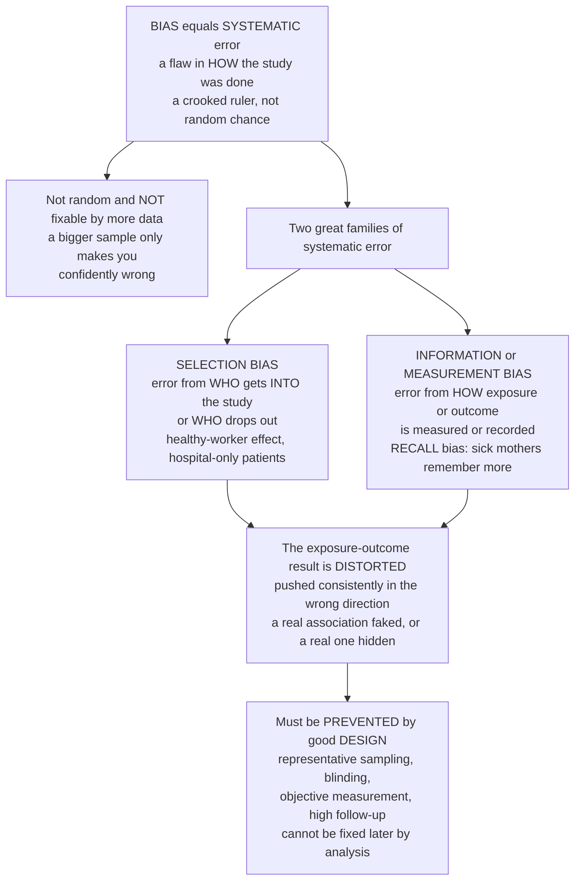

# 🎯 Bias: Selection and Information

> [!abstract] TL;DR
> In epidemiology, **bias** has nothing to do with prejudice — it is **systematic error**, a flaw baked into *how a study was done* that pushes the answer consistently in one wrong direction. It is the crooked ruler of research: unlike random chance, which scatters errors on both sides of the truth and **washes out as the sample grows**, bias is a **persistent lean that no amount of extra data can fix**. There are two great families. **Selection bias** comes from *who* gets into the study or *who drops out* — when the people you compare aren't representative in a way tied to *both* the exposure and the outcome, the comparison is warped (the "healthy worker" effect, hospital-only patients, differential loss to follow-up). **Information bias** (measurement bias) comes from *how* exposure or outcome is measured — inaccurate data, especially when the *inaccuracy differs between groups* (the classic **recall bias**: mothers of sick children ransack their memories for a cause while mothers of healthy children do not, so the sick group "reports" more exposures and a spurious association appears). Because bias, once built in, cannot be removed by clever analysis or a bigger sample, it must be **prevented by design** — making the recognition and avoidance of selection and information bias one of the most important skills in reading any health study. *Educational content, not individual medical advice.*

---

## Intuition

**Analogy:** Imagine two ways a set of measurements can go wrong. The first is like a **shaky hand** on a tape measure: sometimes you read a little high, sometimes a little low, and if you measure the board a hundred times and average, the wobble cancels and you land on the true length. That is **random error** — chance — and it *shrinks as you take more measurements*. The second is like a **crooked ruler** whose first inch was snapped off: every single reading is short by exactly the same amount. Measure the board once, a hundred times, a million times — the average is *still wrong*, and wrong by the same amount, because the flaw is in the **instrument itself**, not in your steadiness. That crooked ruler is **bias**: systematic error built into *how* you measured, immune to sample size, uncorrectable by averaging.

In a study, the "crooked ruler" can be built into two places. It can be in **who you chose to measure** — if you only measure boards from the top of the pile (the ones that didn't warp), your survey of "average board quality" is systematically rosy no matter how many you check; that is **selection bias**. Or it can be in **how you record each measurement** — if a faulty scale reads heavier for red objects than blue ones, your comparison of red-versus-blue weights is corrupted; that is **information bias**. The whole discipline of study *design* exists to straighten the ruler *before* the data are collected, because once the readings are in, the crookedness is invisible and permanent.

---

## How It Works

### Core Mechanics

1. **Bias is systematic, not random.** Every study estimate misses the truth by two ingredients: **random error** (chance, from sampling a finite number of people) and **bias** (systematic error, from a flaw in design, conduct, or analysis). Random error is symmetric and averages away; bias points in a fixed direction and does not.

2. **The defining property: bias does not shrink with sample size.** A larger sample buys you *precision* — a tighter confidence interval — but it tightens that interval around the *biased* value, not the truth. Collecting more data with a crooked instrument just makes you *confidently wrong*. This is why "n was huge" is never a defense against bias.

3. **Accuracy versus precision.** **Validity (accuracy)** means the estimate is centered on the truth — unbiased. **Reliability (precision)** means repeat estimates cluster tightly — low random error. They are independent: a study can be precise but invalid (tight cluster, wrong spot), or valid but imprecise (centered, but scattered). Bias attacks *accuracy*; sample size only helps *precision*.

4. **Selection bias — the error of *who is in the study*.** Arises when the way subjects are **selected into** (or **retained in**) the study is related to **both** the exposure and the outcome. The exposure–outcome association *inside the studied sample* then differs from the association in the target population — even with a perfect measuring instrument, because you are looking at a distorted slice of reality.

5. **Information bias — the error of *how variables are measured*.** Arises when exposure or outcome data are collected inaccurately. The central concept is **misclassification**: putting people in the wrong exposure or disease category. Its two flavors behave very differently: **non-differential** misclassification (error unrelated to the other variable) usually **dilutes** the association toward the null, while **differential** misclassification (error that *differs* between groups) can bias in *either* direction and is far more dangerous.

6. **Prevention beats correction.** Because bias is generally uncorrectable after data collection, it must be designed out **beforehand**: representative sampling and high follow-up (against selection bias); blinding, standardized instruments, and objective records (against information bias). When it can't be prevented, the analyst's job is to reason about its **likely direction and magnitude** (quantitative bias analysis / sensitivity analysis).

7. **Bias is not confounding.** Confounding is a *real* effect of a genuine third variable that is often **fixable in analysis** (stratify, adjust, match). Bias is an *artifact of how the study was conducted* and generally **cannot** be adjusted away. Conflating the two is a classic error.

### Flow / Architecture



---

## Key Concepts

### Secondary (intuitive foundation)
- **Two kinds of error.** *Random error* is like a shaky hand — it scatters both ways and averages out with more measurements. *Bias* is like a crooked ruler — it leans one way every time and never averages out.
- **Selection bias = who's in the room.** If the people you study aren't a fair sample — because of how they were picked or who quit — your answer is off from the start. Studying only workers makes a job look healthy because the sick already left (the **healthy-worker effect**).
- **Information bias = how you measured.** If you record the facts wrong, you get the wrong answer. The famous case is **recall bias**: sick people search their memories harder than healthy people, so they "remember" more exposures.
- **The killer fact.** A bigger study *cannot* fix bias. Only better **design** — done before collecting data — can.

### Undergraduate (formal structure and mechanisms)
- **Total error decomposition.** An estimate's distance from truth $=$ **bias** $+$ **random error**. Precision (narrow confidence interval) fights only the second term; validity (correct center) fights the first.
- **Selection bias, formally.** Selection distorts the estimate when the probability of being in the study depends on **both** exposure and outcome (jointly). Key varieties:
  - **Healthy-worker effect** — the employed are healthier than the general population, so occupational exposures look falsely protective.
  - **Berkson's bias** — using hospital patients as the study base; because hospitalization depends on *multiple* conditions, exposure and disease become spuriously associated among the hospitalized.
  - **Self-selection / volunteer bias** — those who choose to participate differ systematically (often healthier, more health-conscious).
  - **Loss to follow-up / attrition** — in cohorts, when dropout is *differential* by exposure and outcome, the retained sample is skewed.
  - **Non-response bias** — non-responders differ from responders on the very variables under study.
  - **Incidence–prevalence (Neyman) bias** — sampling *existing* (prevalent) cases mixes disease onset with survival, so factors affecting survival masquerade as causes.
- **Information bias and misclassification.** The 2×2 sorting goes wrong. Define **sensitivity** and **specificity** of the exposure/outcome classification:
  - **Non-differential misclassification** — error rates are equal across the groups being compared. For a binary exposure, this **usually biases toward the null** (dilutes a true association toward "no effect"). It is the "safe" direction only in the sense that it hides real effects rather than inventing them.
  - **Differential misclassification** — error rates *differ* between groups (e.g., cases report exposure more completely than controls). This can bias in **either direction** and can *manufacture* an association that isn't there.
- **Named information biases.** **Recall bias** (differential memory), **interviewer/observer bias** (the assessor knows group status and probes differently), **reporting / social-desirability bias** (subjects under-report stigmatized behaviors), **detection / surveillance bias** (the exposed are watched more closely and so *appear* to have more disease), and plain **instrument / measurement error**.

### Graduate (validity, causal framing, and correction)
- **Selection bias as collider stratification (causal view).** In DAG terms, selection bias arises when you **condition on a collider** — a common effect of exposure and outcome (or of their causes). Restricting the study to one level of that collider (e.g., "hospitalized," "responded," "still in follow-up") opens a **non-causal path** between exposure and outcome, inducing an association where none exists. This unifies Berkson's bias, differential loss to follow-up, and many "self-selected sample" problems under one mechanism.
- **Control-selection bias in case-control studies.** The single most notorious source: controls must represent the **exposure distribution of the source population** that produced the cases. Choosing controls whose exposure is atypical (e.g., hospital controls with exposure-related illnesses) biases the odds ratio directly and irreparably.
- **Direction of non-differential misclassification, with caveats.** The "bias toward the null" rule holds for a **non-differential, independent, binary** exposure with error rates below the complement of the true prevalence; it can *fail* for exposures with 3+ levels, when misclassification errors of exposure and outcome are **dependent**, or near the boundary — so it is a heuristic, not a theorem to lean on blindly.
- **Quantitative bias analysis (QBA).** When bias cannot be prevented, model it: specify plausible sensitivity/specificity or selection probabilities and compute a **bias-adjusted** estimate with an interval that reflects *systematic* as well as random uncertainty. This replaces the false comfort of a narrow (but only random-error) confidence interval.
- **Design as the real cure.** Nested case-control and prospective exposure ascertainment kill recall bias by measuring exposure *before* disease; blinding of assessors kills interviewer/detection bias; active, complete follow-up kills attrition bias; population-based sampling frames kill Berkson-type selection. The analytic stage can *diagnose* and *bound* bias but almost never *remove* it.
- **Bias versus confounding versus chance — the triad.** Interpreting any association means ruling out all three: **chance** (random error, addressed by precision and inference), **bias** (systematic error from study conduct, addressed by design), and **confounding** (a real third-variable distortion, addressed by design *or* analysis). This note is the "bias" pillar; the sibling notes below cover the other two.

---

## Python Demo

```python
# Bias vs random error, and a worked selection-bias mechanism.
#   (a) ACCURACY vs PRECISION: random error scatters estimates around the TRUTH
#       and SHRINKS as the sample grows; bias SHIFTS the whole distribution off
#       the truth and does NOT shrink no matter how large the sample -- the
#       crooked ruler. This is why a bigger sample cures chance but not bias.
#   (b) SELECTION BIAS: when participation depends on BOTH exposure and disease,
#       the observed odds ratio diverges from the true one -- and can go either
#       way -- even with an infinite, perfectly measured sample.
import numpy as np
import matplotlib.pyplot as plt

rng = np.random.default_rng(0)

# ---- (a) Bias vs random error: sampling distributions -----------------------
TRUTH = 0.30          # true prevalence we are trying to estimate (e.g. exposure)
BIASED_MEAN = 0.42    # a "crooked ruler" that systematically over-ascertains
REPS = 4000

def sampling_dist(true_p, n, reps=REPS):
    # each study estimates a proportion from n Bernoulli draws
    return rng.binomial(n, true_p, size=reps) / n

unbiased_small = sampling_dist(TRUTH,       n=50)     # unbiased, small sample
unbiased_large = sampling_dist(TRUTH,       n=2000)   # unbiased, large sample
biased_large   = sampling_dist(BIASED_MEAN, n=2000)   # BIASED, large sample

print("Mean of estimates (target truth = 0.30):")
print(f"  unbiased, n=50   : {unbiased_small.mean():.3f}  (spread {unbiased_small.std():.3f})")
print(f"  unbiased, n=2000 : {unbiased_large.mean():.3f}  (spread {unbiased_large.std():.3f})")
print(f"  BIASED,   n=2000 : {biased_large.mean():.3f}  (spread {biased_large.std():.3f})")
print("-> more data SHRINKS the spread (random error) but leaves the bias put.\n")

# ---- (b) Selection-bias mechanism in a case-control study -------------------
# True source population 2x2 giving a TRUE odds ratio of 2.0:
#            exposed  unexposed
#   Cases       200       100      -> exposure odds in cases    = 2.0
#   Controls    100       100      -> exposure odds in controls = 1.0   OR = 2.0
A0, B0, C0, D0 = 200.0, 100.0, 100.0, 100.0
OR_true = (A0 * D0) / (B0 * C0)

delta = np.linspace(0.0, 1.0, 200)   # strength of DIFFERENTIAL participation
# Scenario UP: exposed CASES increasingly over-participate (over-selected)
OR_up   = OR_true * (1.0 + delta)
# Scenario DOWN: exposed CONTROLS increasingly over-participate (e.g. hospital
# controls with exposure-related conditions -- Berkson-type selection)
OR_down = OR_true / (1.0 + delta)

# ---- Plot -------------------------------------------------------------------
fig, ax = plt.subplots(1, 2, figsize=(13, 5))

bins = np.linspace(0.15, 0.55, 60)
ax[0].hist(unbiased_small, bins=bins, density=True, alpha=0.45,
           color="#1f77b4", label="unbiased, n=50 (wide: much chance)")
ax[0].hist(unbiased_large, bins=bins, density=True, alpha=0.65,
           color="#2ca02c", label="unbiased, n=2000 (narrow: chance shrank)")
ax[0].hist(biased_large,   bins=bins, density=True, alpha=0.55,
           color="#d62728", label="BIASED, n=2000 (narrow but WRONG)")
ax[0].axvline(TRUTH, ls="--", color="black", label="truth = 0.30")
ax[0].set_xlabel("study estimate of the proportion")
ax[0].set_ylabel("density across repeated studies")
ax[0].set_title("(a) Random error shrinks with n; bias does not")
ax[0].legend(fontsize=8)

ax[1].plot(delta, OR_up,   color="#d62728", lw=2,
           label="exposed cases over-selected -> OR inflated")
ax[1].plot(delta, OR_down, color="#1f77b4", lw=2,
           label="exposed controls over-selected -> OR toward null")
ax[1].axhline(OR_true, ls="--", color="black", label=f"true OR = {OR_true:.1f}")
ax[1].scatter([0], [OR_true], color="black", zorder=5)
ax[1].set_xlabel("differential participation strength (by exposure AND disease)")
ax[1].set_ylabel("observed odds ratio")
ax[1].set_title("(b) Selection bias distorts the OR in either direction")
ax[1].legend(fontsize=8)

plt.tight_layout()
plt.show()
```

The left panel is the dartboard picture in numbers: the blue (small-sample) estimates scatter widely but *around* the truth, the green (large-sample) estimates collapse into a tight spike *on* the truth — **random error vanished** — while the red distribution, from an equally large but **biased** study, is just as tight yet sits stubbornly at `0.42`, the wrong value. More data sharpened it into a **confidently wrong** answer. The right panel dissects one bias mechanism: as participation comes to depend on *both* exposure and disease, the observed odds ratio peels away from the true value of `2.0` — **upward** if exposed cases over-enroll, **downward** if exposed controls do — demonstrating that selection bias is not merely "less accurate" but can point in *either* direction, and that no sample size closes the gap.

---

## Real-World Applications

> **The healthy-worker effect in occupational epidemiology.** Studies comparing a workforce's mortality to the general population repeatedly find workers "healthier" — not because the job protects them, but because sick and disabled people are screened out of and leave employment. Occupational cohorts must therefore compare workers to *other workers* (internal reference groups), not to the general public, to avoid this built-in selection lean.

> **Recall bias and birth defects.** In case-control studies of prenatal exposures, mothers of babies with birth defects search their pregnancies for explanations and report more medications, infections, and chemical exposures than mothers of healthy babies — even when true exposure was equal. This **differential recall** has faked more than one drug–defect "association," which is precisely why prospective designs (measuring exposure *during* pregnancy, before outcome is known) are the gold standard here.

> **Berkson's bias and hospital-based studies.** Joseph Berkson showed that studying only hospitalized patients can create spurious associations between two diseases, because being admitted depends on having *some* condition — conditioning on the "hospitalized" collider links otherwise-unrelated exposures and outcomes. It is a standard warning against convenience samples drawn from clinics.

> **Loss to follow-up in long cohorts and trials.** In HIV, cardiovascular, and pharmacoepidemiology cohorts, participants who drop out often differ systematically (sicker, or the treatment failed) — differential attrition biases estimates of treatment effect. Analysts monitor completeness of follow-up as a primary quality metric and use methods like inverse-probability-of-censoring weighting to bound the damage.

> **Detection / surveillance bias in screening.** People taking a given drug or under closer medical watch get *tested* more, so they *appear* to have more disease simply because more of their disease is found. Untangling a real hazard from a surveillance artifact is a recurring challenge in drug-safety signal evaluation.

---

## Common Pitfalls

- **"Our sample was huge, so the result is solid."** The most dangerous misconception. Sample size fixes **random error**, never **bias**. A biased mega-study is *more* misleading than a biased small one because its tight confidence interval projects false certainty. Always ask about *design*, not just *n*.
- **Confusing bias with confounding.** Bias is an artifact of *how the study was conducted* and generally cannot be adjusted away; confounding is a *real third-variable effect* often fixable by stratification or regression. Trying to "adjust for" selection bias in analysis usually fails; preventing it in design is the only reliable route.
- **Assuming non-differential misclassification is harmless.** It "only biases toward the null" — but that means it can **hide a real effect**, causing a genuinely harmful exposure to look safe. And the toward-the-null rule *breaks* for multi-level exposures or when exposure and outcome errors are correlated, where the bias can point *away* from the null.
- **Ignoring who dropped out.** Reporting only completers ("per-protocol" thinking) silently conditions on staying in the study — a selection/collider trap. High and *differential* loss to follow-up can invert a result. Report follow-up completeness and compare dropouts to stayers.
- **Unblinded outcome assessment.** When assessors know exposure/treatment status, they probe, diagnose, and record differently (interviewer and detection bias). Blinding and objective, pre-specified endpoints are the defense; "we were careful" is not.
- **Treating hospital or volunteer samples as representative.** Convenience samples embed Berkson-type and self-selection bias. Define the **source population** and sample to represent *it*, especially when choosing controls.
- **Retrospective self-report for the key exposure.** Memory is reconstructive and *differential* by disease status. Where possible, anchor exposure to objective records or measure it prospectively, before the outcome is known.

---

## Related Concepts

This note is a core pillar of the vault's **Causal Inference, Bias and Confounding** section and is meant to be read against its siblings. Interpreting any epidemiologic association means ruling out three rival explanations, and each has its own note: *Statistical Inference and Uncertainty* handles **chance** (random error, confidence intervals, and why precision is not the same as validity); *Confounding and Effect Modification* handles the **real third-variable distortions** that — unlike bias — can often be adjusted for in analysis; and *Causal Inference in Epidemiology* pulls chance, bias, and confounding together into the judgment of whether an association reflects a cause. The two study-design siblings show these biases in their natural habitat: *Case-Control Studies* is where **recall bias** and **control-selection bias** are most acute, and *Cohort Studies* is where **loss to follow-up** and the **healthy-worker effect** bite hardest. (Those five sibling notes live alongside this one in the same vault.)

- [[Statistical_Inference]] — the machinery of random error, confidence intervals, and hypothesis tests; bias is the *systematic* error these tools deliberately do **not** capture.
- [[Cognitive_Biases_and_Heuristics]] — the human-memory psychology (selective, motivated recall) that gives rise to recall and reporting bias in subjects and assessors.
- [[Causal_Reasoning]] — why an observed association is evidence for, but never proof of, causation, and how bias is one of the standard rival explanations to eliminate.
- [[AI_Bias_and_Fairness]] — the same systematic-error logic in machine learning, where biased *training data* (sampling and selection bias) produces models that are confidently, reproducibly wrong.
- [[Regression_and_Correlation]] — adjustment methods that can address confounding but generally **cannot** repair selection or information bias, sharpening the distinction.
- [[Probability_Theory]] — the model of chance underlying random error, against which systematic bias is defined by contrast.

---

## Review Questions

1. **(Secondary)** A vitamin study surveys 100,000 people and finds that vitamin-takers are much healthier, reporting the result with a very narrow confidence interval. A friend says "with 100,000 people, this *must* be true." Using the crooked-ruler idea, explain why the huge sample does *not* guarantee the finding is unbiased, and name one way the *type* of people who choose to take vitamins could have biased it.
2. **(Undergraduate)** Distinguish **non-differential** from **differential** misclassification. For a binary exposure, in which direction does non-differential misclassification usually bias the association, and why is that direction still dangerous? Give one concrete study scenario that would produce *differential* misclassification and state which way it would likely bias the result.
3. **(Graduate)** A case-control study of a rare cancer recruits controls from patients hospitalized for other conditions and finds a strong odds ratio for a common exposure. Using the ideas of **collider/selection bias** and **control-selection bias**, explain the specific mechanism by which this design could manufacture an association, why it *cannot* be fixed by adjusting for measured covariates in analysis, and what design change would prevent it.

---

## Sources

- Rothman, K. J., Greenland, S. & Lash, T. L. *Modern Epidemiology* (3rd ed.), chapters on "Bias," "Selection Bias," and "Information Bias / Measurement Error." Lippincott Williams & Wilkins.
- Sackett, D. L. "Bias in analytic research." *Journal of Chronic Diseases*, 1979; 32(1–2): 51–63. (The classic catalog of biases.)
- Gordis, L. *Epidemiology* (6th ed.), chapters on bias and on confounding and interaction. Elsevier.
- Delgado-Rodríguez, M. & Llorca, J. "Bias." *Journal of Epidemiology & Community Health*, 2004; 58(8): 635–641.
- Grimes, D. A. & Schulz, K. F. "Bias and causal associations in observational research." *The Lancet*, 2002; 359: 248–252.

---

#epidemiology #bias #selection-bias #information-bias #recall-bias
