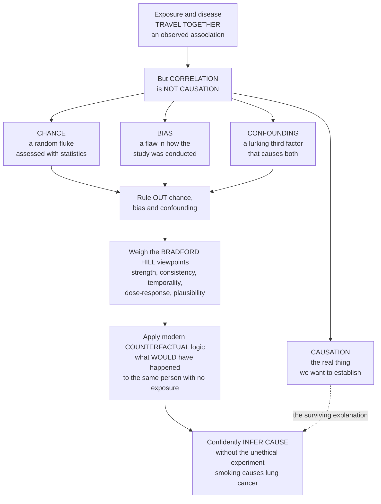

# 🔗 Causal Inference in Epidemiology

> [!abstract] TL;DR
> Epidemiology can only ever *observe* that an exposure and a disease **travel together** — but it wants to know whether the exposure **causes** the disease, because only causes can be acted on to prevent illness. The whole discipline is built around one warning: **association is not causation**. There are only four explanations for any observed association — it is **chance** (a statistical fluke), **bias** (a flaw in how the study was done), **confounding** (a lurking third factor that drives both), or genuine **causation** — and the analyst must rule out the first three before accepting the fourth. Because the perfect experiment (randomly assigning people to smoke) is usually impossible or unethical, epidemiologists judge causation with the **Bradford Hill viewpoints** (is the association strong? consistent? does the cause precede the effect? is there a dose-response? is it biologically plausible?) and, in the modern era, with the rigorous **counterfactual** logic of potential outcomes (*what would have happened to the same person without the exposure?*) and causal diagrams. This disciplined framework for inferring cause from mere observation — the reason we can confidently say **"smoking causes cancer"** without the unethical experiment — is arguably epidemiology's deepest intellectual contribution, and it frames every note in this section.

---

## Intuition

**Analogy — "correlation is not causation," the most famous warning in all of statistics.** In summer, ice-cream sales and drowning deaths rise together, week after week, in near-perfect lockstep. A naive reading says ice cream drives people to drown. The truth is that a **third thing** — summer heat — independently pushes *both* up: hot days sell ice cream *and* send people swimming. Ice cream and drowning never touch each other; they merely share a hidden common cause. The same trap hides everywhere in health data. People who take vitamins are, on average, healthier — but perhaps only because health-conscious people both take vitamins *and* exercise, eat well, and see their doctor. The vitamin may do nothing; the *kind of person* who takes it does everything.

So when epidemiology notices that an exposure and a disease move together, the burning question is: does the exposure **cause** the disease, or is something else going on? Remarkably, there are only a handful of possibilities. Either it is **real causation**; or it is **chance** (the association is a fluke of a small sample, the province of statistics); or it is **bias** (the study was built or measured in a way that manufactured the link); or it is **confounding** (a lurking third factor, like summer heat, causes both). Ruling out chance, bias, and confounding — and only then crediting causation — is the entire game. Since we usually cannot run the clean experiment, epidemiologists developed *judgment criteria*, most famously the **Bradford Hill viewpoints**: a checklist of questions for weighing whether an association is likely causal. Is it strong? Does it show up consistently across many studies? Does the exposure come *before* the disease? Is there a **dose-response** — more exposure, more disease? Is a causal mechanism biologically plausible? The modern era adds a razor-sharp mathematical foundation: the **counterfactual** idea — *what would have happened to this very person had they not been exposed?* — and the causal diagrams built on top of it. This is how we can confidently declare that **smoking causes lung cancer** without ever running the monstrous experiment of assigning people to smoke.

---

## How It Works

### Core mechanics — from an observed association to a causal claim

1. **Start with an association.** A study finds that an exposure and an outcome occur together more often than chance alone would predict — a positive relative risk, a raised odds ratio, a correlation. This is the raw material, and by itself it is *silent* about cause.
2. **List the four explanations.** Before believing the exposure *causes* the outcome, an epidemiologist must consider every rival: (1) **chance / random error** — the fluke that vanishes in a larger sample, quantified with p-values and confidence intervals; (2) **bias / systematic error** — selection bias (who got into the study) and information bias (how exposure or disease was measured) that build the link into the data itself; (3) **confounding** — a third variable, associated with the exposure and an independent cause of the outcome, that generates a spurious mixed effect; and (4) **causation** — the real thing.
3. **Rule out the three impostors.** Chance is handled by statistics (narrow confidence intervals, replication). Bias is designed out at the study-planning stage and probed afterward. Confounding is *removed analytically* — by **stratification** (compare like with like, e.g., ice-cream–vs–drowning only *within* days of equal temperature), **adjustment / regression**, matching, or restriction. When the association survives all three, causation becomes the leading candidate.
4. **Weigh the Bradford Hill viewpoints.** Sir Austin Bradford Hill's 1965 lecture gave nine *considerations* (explicitly **not** a checklist to tick): **strength** of association, **consistency** across studies and populations, **specificity**, **temporality** (the cause must precede the effect — the one near-necessary condition), biological **gradient** (dose-response), **plausibility**, **coherence** with known biology, **experimental** evidence, and **analogy**. More boxes satisfied, more credible the causal reading — but none except temporality is required, and none is sufficient alone.
5. **Formalise with counterfactuals.** The modern definition of a cause is a **counterfactual contrast**: the exposure caused the outcome in a person if the outcome *would not have occurred* had that same person been unexposed. The **potential-outcomes model** (Rubin) makes this precise — each unit has two potential outcomes, exposed and unexposed — and states the **fundamental problem of causal inference**: we can never observe *both* for the same unit. Causal inference is therefore a **missing-data** problem, and the key assumption we chase is **exchangeability** (the exposed and unexposed groups are comparable, so one can stand in for the other's missing counterfactual).
6. **Approximate exchangeability.** **Randomisation** (a randomised controlled trial) makes the groups exchangeable *by design*, which is why it is the gold standard. When randomisation is impossible, we *emulate* it — adjusting for confounders identified with **directed acyclic graphs (DAGs)**, or building a **target trial** — to approximate the counterfactual comparison from observational data.

### The four-explanations funnel



*Read top to bottom: an association forces the question, the four rival explanations fan out, the three impostors are ruled out, and the survivor is weighed with Bradford Hill and counterfactual logic until cause can be inferred without the impossible experiment.*

---

## Key Concepts

### Secondary (intuitive)

- **Correlation is not causation.** Two things moving together does not mean one causes the other — ice-cream sales and drownings both rise in summer, but ice cream does not drown anyone.
- **The lurking third factor.** Often a hidden cause (summer heat, a health-conscious lifestyle) drives *both* the exposure and the outcome, faking a link between them. This is a **confounder**.
- **Only a few explanations.** Whenever an exposure and a disease travel together it is because of real cause, pure luck, a flaw in the study, or a hidden third factor — nothing else.
- **The dose-response clue.** If *more* of something brings *more* disease (more cigarettes, more lung cancer), that stepwise gradient is strong evidence the link is real, not accidental.
- **Cause must come first.** For X to cause Y, X has to happen *before* Y — the single rule you can never break.

### Undergraduate (formal)

- **Association vs causation.** Epidemiology measures **associations** (relative risk, odds ratio, correlation) but seeks **causes**, because only causes support **intervention** — you cannot prevent disease by acting on a mere correlate.
- **The four explanations for an association.** (1) **Chance** (random error), assessed with confidence intervals and p-values; (2) **bias** (systematic error) — *selection bias* and *information/measurement bias*; (3) **confounding** — a variable associated with the exposure and an independent risk factor for the outcome, not on the causal pathway; (4) **causation**. The analyst must exclude 1–3 before accepting 4.
- **Bradford Hill viewpoints.** Nine considerations — strength, consistency, specificity, **temporality** (necessary), biological gradient (dose-response), plausibility, coherence, experiment, analogy — offered as *guidelines for judgment*, explicitly not a scoring checklist. Their classic triumph was assembling observational evidence that **smoking causes lung cancer**.
- **Controlling confounding.** At the **design** stage: randomisation, restriction, matching. At the **analysis** stage: stratification (e.g., Mantel–Haenszel), multivariable regression adjustment, standardisation. Confounding — unlike bias — can often be *fixed after the fact* if the confounder was measured.
- **Effect modification vs confounding.** A confounder distorts the estimate and must be removed; an **effect modifier** (interaction) is a real feature of nature — the effect genuinely differs across strata — and must be *reported*, not adjusted away.

### Graduate (mechanistic and systems)

- **The counterfactual / potential-outcomes framework.** Each unit *i* has potential outcomes `Y_i(1)` (if exposed) and `Y_i(0)` (if unexposed); the individual causal effect is their difference. The **fundamental problem of causal inference** (Holland) is that only one is ever observed — causal inference is *missing-data* inference. The population **average treatment effect** `E[Y(1) − Y(0)]` is identifiable only under **exchangeability**, **positivity** (every unit could receive either exposure), and **consistency** (well-defined interventions — SUTVA).
- **Exchangeability and how we manufacture it.** Randomisation guarantees *marginal* exchangeability in expectation; observational studies pursue *conditional* exchangeability (no unmeasured confounding given the adjustment set). This is precisely the "no lurking third factor" assumption made mathematical, and it is fundamentally **untestable** from the data alone.
- **Sufficient-component-cause model (Rothman's causal pies).** A disease results from any **sufficient cause** — a complete pie of **component causes** acting together. A **necessary** cause appears in every pie (e.g., *Mycobacterium tuberculosis* for TB); most exposures are neither necessary nor sufficient but *component* causes, which is why the same disease has many partial causes and why removing any one component can prevent some cases. This formalises **multicausality**.
- **From Koch to counterfactuals.** The **Henle–Koch postulates** (isolate the organism, culture it, reproduce the disease) defined causation for *infectious* agents but fail for multifactorial chronic disease — motivating the shift to the **web of causation**, Bradford Hill's viewpoints, and ultimately the counterfactual revolution.
- **The modern causal-inference revolution.** **Directed acyclic graphs (DAGs)** encode causal assumptions graphically, distinguishing confounders (block the back-door path) from **mediators** (do *not* adjust — they lie on the path) and **colliders** (adjusting *creates* bias). **Target-trial emulation** specifies the hypothetical randomised trial an observational analysis is trying to mimic, disciplining design and eliminating classic self-inflicted biases — the analytic frontier of the field.

---

## Python Demo

```python
# Causal inference, two lessons in one figure:
#   (a) THE FOUR EXPLANATIONS / CONFOUNDING -- correlation without causation.
#       A CONFOUNDER (summer temperature) independently drives BOTH ice-cream sales
#       and drowning deaths. There is NO causal arrow from ice cream to drowning in
#       the data-generating process, yet the raw correlation is strongly positive.
#       When we ADJUST for the confounder (compare only within temperature strata),
#       the association VANISHES -- proving the raw correlation was never causal.
#   (b) BRADFORD HILL / DOSE-RESPONSE -- a biological gradient. As the DOSE of an
#       exposure rises (cigarettes per day), the relative risk of disease climbs in a
#       stepwise gradient. Such a monotone dose-response is one of Hill's strongest
#       viewpoints and heavily strengthens the case that the association is causal.
import numpy as np
import matplotlib.pyplot as plt

rng = np.random.default_rng(1965)          # the year of Hill's famous lecture

# ---------- (a) Confounding: correlation without causation ----------
n     = 600
temp  = rng.uniform(10, 35, n)             # CONFOUNDER: daily temperature, deg C
ice   = 2.0 * temp + rng.normal(0, 8, n)   # ice-cream sales -- driven by heat
drown = 1.5 * temp + rng.normal(0, 6, n)   # drownings -- driven by heat ONLY (no ice-cream term)

raw_r = np.corrcoef(ice, drown)[0, 1]      # strong spurious positive correlation

# Adjust for the confounder by stratifying into temperature terciles
edges  = np.quantile(temp, [0, 1/3, 2/3, 1.0])
strata = np.clip(np.digitize(temp, edges[1:-1]), 0, 2)
within = [np.corrcoef(ice[strata == k], drown[strata == k])[0, 1] for k in range(3)]
adj_r  = float(np.mean(within))            # association within strata ~ 0

# Partial correlation by residualising both variables on the confounder
ice_res   = ice   - np.polyval(np.polyfit(temp, ice,   1), temp)
drown_res = drown - np.polyval(np.polyfit(temp, drown, 1), temp)
partial_r = np.corrcoef(ice_res, drown_res)[0, 1]

# ---------- (b) Bradford Hill: a dose-response gradient ----------
dose = np.array([0, 5, 15, 25, 40])                 # cigarettes per day
rr   = np.array([1.0, 5.2, 11.0, 18.5, 25.0])       # approx. relative risk of lung cancer

fig, (ax1, ax2) = plt.subplots(1, 2, figsize=(14, 5.5))

# --- panel (a): confounded correlation and its disappearance ---
sc = ax1.scatter(ice, drown, c=temp, cmap="coolwarm", s=18, alpha=0.75)
xs = np.linspace(ice.min(), ice.max(), 50)
ax1.plot(xs, np.polyval(np.polyfit(ice, drown, 1), xs), color="black", lw=2.5,
         label=f"Raw fit  r = {raw_r:.2f}  (spurious)")
colors = ["#2C7BB6", "#7F7F7F", "#D7191C"]
for k in range(3):                                  # flat within-stratum fits
    m = strata == k
    xk = np.linspace(ice[m].min(), ice[m].max(), 20)
    ax1.plot(xk, np.polyval(np.polyfit(ice[m], drown[m], 1), xk),
             color=colors[k], lw=2.0, ls="--")
ax1.plot([], [], color="gray", lw=2, ls="--",
         label=f"Within-temperature fits  r = {adj_r:.2f}")
ax1.set_xlabel("Ice-cream sales")
ax1.set_ylabel("Drowning deaths")
ax1.set_title("(a) Correlation is not causation:\nadjust for the confounder and it vanishes")
ax1.legend(loc="upper left", fontsize=9)
fig.colorbar(sc, ax=ax1, label="Temperature, deg C  (the confounder)")

# --- panel (b): the dose-response gradient ---
ax2.plot(dose, rr, "o-", color="#8E44AD", lw=2.5, ms=9)
for d, r in zip(dose, rr):
    ax2.annotate(f"RR {r:.0f}", (d, r), textcoords="offset points",
                 xytext=(6, -12), fontsize=9)
ax2.axhline(1.0, color="gray", ls=":", lw=1.5, label="No effect  RR = 1")
ax2.set_xlabel("Dose: cigarettes per day")
ax2.set_ylabel("Relative risk of lung cancer")
ax2.set_title("(b) Bradford Hill dose-response:\nmore exposure, more disease")
ax2.legend(loc="upper left", fontsize=9)
ax2.grid(alpha=0.3)

plt.tight_layout()
plt.show()

print(f"(a) Raw correlation ice~drown        r = {raw_r:+.2f}  (looks causal, is not)")
print(f"    Mean within-stratum correlation  r = {adj_r:+.2f}  (adjusted -> vanishes)")
print(f"    Partial correlation given temp   r = {partial_r:+.2f}")
print(f"(b) Dose-response: RR rises {rr[0]:.0f} -> {rr[-1]:.0f} across 0 -> {dose[-1]} cig/day")
```

**What you see.** *Panel (a)* is the four-explanations lesson made visible. The black line through the whole cloud is steep and positive — ice-cream sales and drownings look tightly linked, and a naive analyst would infer cause. But the points are coloured by the true confounder, **temperature**: cool days sit in the lower-left, hot days in the upper-right. Once you compare only days of *similar* temperature (the dashed within-stratum lines, essentially flat), the association **disappears** — the raw correlation of about `+0.7` collapses to near zero after adjustment. The link was never causal; it was **confounding** all along. *Panel (b)* shows a Bradford Hill viewpoint that *strengthens* a causal claim: a clean **dose-response gradient**. As cigarettes per day climb, the relative risk of lung cancer rises step by monotone step, from 1 to 25. A graded relationship like this is hard to fake with confounding or bias and is exactly the pattern Doll, Hill, and others used to argue — from observational data alone — that smoking *causes* lung cancer.

---

## Real-World Applications

- **Smoking and lung cancer — the founding case.** In the 1950s, tobacco defenders argued the smoking–cancer link was mere correlation or confounding (perhaps a genetic type prone to both smoking and cancer). Bradford Hill and Richard Doll answered with strength, consistency across dozens of studies, temporality, a clear **dose-response**, biological plausibility, and reversibility on quitting — and Hill's 1965 lecture codified the viewpoints that let society act on causation without a randomised human experiment.
- **Hormone replacement therapy — a confounding cautionary tale.** Large observational cohorts suggested HRT *protected* against heart disease. When the randomised **Women's Health Initiative** trial removed confounding (HRT users were healthier and wealthier to begin with), the apparent benefit reversed — HRT slightly *raised* cardiovascular risk. A landmark demonstration of why observational association is not enough.
- **Target-trial emulation in the electronic-health-record era.** Modern epidemiologists (Hernán, Robins, and colleagues) reconcile observational "big data" with trial results by explicitly specifying and *emulating* the randomised trial they wish they could run — the method that resolved the HRT discrepancy and now guides comparative-effectiveness research across huge insurance and hospital databases.
- **Regulatory and legal causation.** The US Surgeon General's reports, IARC carcinogen classifications, and environmental-exposure litigation (asbestos, lead, air pollution) all lean on Bradford-Hill-style weight-of-evidence reasoning to declare exposures causal for policy and courts.
- **Pandemic-era causal questions.** "Do masks reduce transmission?" "Does this drug cut COVID mortality?" — answered by ranking randomised trials above observational studies, scrutinising confounding by indication and healthy-user bias, and applying counterfactual reasoning to messy real-world data.

---

## Common Pitfalls

- **Declaring causation from a correlation.** The original sin. A striking association (ice cream and drowning, coffee and cancer, wine and heart health) is only a *hypothesis*; without ruling out chance, bias, and confounding it says nothing about cause. Never let a p-value substitute for causal reasoning.
- **Ignoring or mis-handling confounding.** Coffee looked carcinogenic for years until studies adjusted for the fact that heavy coffee drinkers also smoked. Failing to measure and adjust for a confounder produces confident, wrong answers that *no larger sample can fix*.
- **Over-adjusting — conditioning on mediators or colliders.** More control is not always better. Adjusting for a **mediator** (a step on the causal pathway) erases the very effect you want to measure; adjusting for a **collider** (a common effect of exposure and outcome) *creates* bias where none existed. Only a causal diagram tells you which variables to touch.
- **Treating Bradford Hill as a checklist.** Hill himself warned against it. The viewpoints are aids to judgment, not boxes to tick or a score to total. Only **temporality** is close to required; strength, specificity, and the rest can each be absent in a genuine cause or present in a spurious one.
- **Reversing temporality (reverse causation).** In cross-sectional data, low cholesterol may appear to *cause* cancer, when in fact undiagnosed cancer was lowering cholesterol. If you cannot establish that the exposure preceded the disease, you cannot claim it as the cause.
- **Forgetting the counterfactual is unobservable.** Exchangeability — that the unexposed group validly stands in for what *would* have happened to the exposed — is an *assumption*, not a fact in the data. It cannot be verified by any statistical test; it must be argued from subject-matter knowledge and design.

---

## Related Concepts

**Within this vault (Section 03 and beyond, prose references).** This note is the analytic keystone of **Section 03 – Causal Inference, Bias and Confounding**, and it frames the sibling notes that dissect each rival explanation in turn. *Bias (Selection and Information)* opens up the second explanation — the systematic errors of study conduct that manufacture associations, and the taxonomy of selection, recall, and misclassification bias. *Confounding and Effect Modification* develops the third explanation in depth: how a lurking third variable distorts an estimate, how stratification, matching, and regression remove it, and how a true effect modifier differs from a confounder. *Statistical Inference and Uncertainty* handles the first explanation, chance, with the confidence intervals and hypothesis tests that quantify random error. *Directed Acyclic Graphs and Modern Causal Methods* carries the counterfactual programme forward into DAGs, back-door paths, target-trial emulation, and the tools that operationalise everything sketched here. Reaching back to Section 01, *Measures of Association and Effect* supplies the relative risks, odds ratios, and attributable risks that are the raw associations this note then interrogates for cause.

**Across the vault (Glob-verified links).**

- [[Logic_and_Critical_Thinking/03_Inductive_and_Probabilistic_Reasoning/Causal_Reasoning|Causal Reasoning]] — the philosophical parent: Mill's methods, counterfactual theories of causation, and the correlation-causation problem in general reasoning, of which epidemiology is the applied science.
- [[Logic_and_Critical_Thinking/06_Applied_Critical_Thinking/Scientific_Reasoning_and_Method|Scientific Reasoning and Method]] — hypothesis testing, evidence, and inference to the best explanation, the broader scientific frame in which Bradford Hill's viewpoints sit.
- [[Econometrics/05_Causal_Inference/Potential_Outcomes_Framework|Potential Outcomes Framework]] — the same Rubin counterfactual model from the econometrics side, with the identification assumptions (exchangeability, positivity, SUTVA) developed in parallel.
- [[Clinical_Medicine/06_Clinical_Reasoning_and_Modern_Medicine/Evidence_Based_Medicine_and_Clinical_Trials|Evidence-Based Medicine and Clinical Trials]] — how randomisation delivers exchangeability by design, making the RCT the gold standard this note treats as the target to emulate.
- [[Clinical_Medicine/01_Foundations_of_Disease_and_Pathophysiology/Etiology_and_Mechanisms_of_Disease|Etiology and Mechanisms of Disease]] — the mechanistic, individual-level view of causation that supplies Bradford Hill's "biological plausibility" and complements epidemiology's population-pattern inference.
- [[Mathematics/06_Probability_and_Statistics/Statistical_Inference|Statistical Inference]] — the estimation and hypothesis-testing machinery that quantifies the "chance" explanation and puts confidence intervals on every effect measure.

---

## Review Questions

**Secondary.** In summer, ice-cream sales and drowning deaths rise together almost perfectly. A friend concludes that eating ice cream makes people drown. Explain, using the idea of a "lurking third factor," why this conclusion is wrong — and describe how you could check whether ice cream really has any effect by comparing days that are *equally* hot.

**Undergraduate.** An observational study reports that adults who take daily vitamin supplements have lower rates of heart disease. Before concluding that vitamins are protective, name the **four** possible explanations for this association and, for each of the three non-causal ones, give a concrete way it could produce the finding without vitamins doing anything. Then state which **Bradford Hill viewpoints** you would most want to see satisfied before believing the effect is causal, and explain why *temporality* is special.

**Graduate.** Define the individual causal effect in the **potential-outcomes** framework and state the *fundamental problem of causal inference*. Explain why this makes **exchangeability** the pivotal assumption, why a randomised trial satisfies it but an observational study can only approximate it, and why exchangeability can never be verified from the observed data. Finally, contrast a **confounder**, a **mediator**, and a **collider** with respect to whether you should adjust for each, and describe how a directed acyclic graph guides that decision.

---

## Sources

- Hill, A. B. (1965). *The Environment and Disease: Association or Causation?* Proceedings of the Royal Society of Medicine, 58(5), 295–300 — the founding statement of the nine viewpoints.
- Rothman, K. J., Greenland, S., & Lash, T. L. *Modern Epidemiology* (3rd ed.). Lippincott Williams & Wilkins — causal pies, confounding, bias, and the counterfactual foundations.
- Hernán, M. A., & Robins, J. M. *Causal Inference: What If.* Chapman & Hall/CRC (freely available) — potential outcomes, exchangeability, DAGs, and target-trial emulation.
- Gordis, L. (Celentano, D. D., & Szklo, M., eds.). *Gordis Epidemiology* (6th ed.). Elsevier — the "From Association to Causation" chapter and the Bradford Hill criteria for the introductory reader.
- Holland, P. W. (1986). *Statistics and Causal Inference.* Journal of the American Statistical Association, 81(396), 945–960 — the fundamental problem of causal inference and the Rubin model.

---

#epidemiology #causal-inference #bradford-hill #counterfactual #correlation-causation
