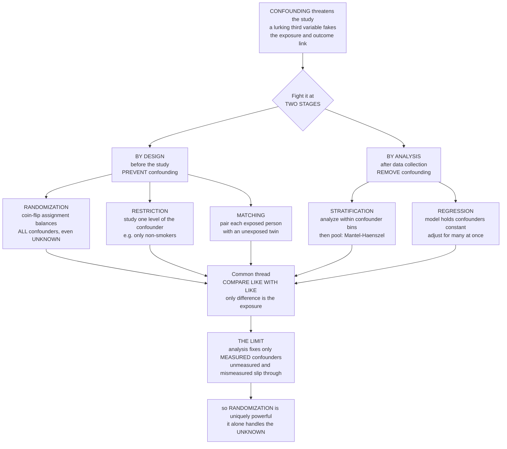

# 🛡️ Confounder Control and Adjustment

> [!abstract] TL;DR
> Once you know that **confounding** threatens a study — a lurking third variable faking a relationship between exposure and outcome — the practical question is: *how do you fight it?* Epidemiology has a whole **arsenal**, deployable at **two stages**. **Before** the study, **by DESIGN**, you can stop confounding from ever entering: **randomization** (the nuclear option — coin-flip assignment balances *all* confounders, even ones you never thought of), **restriction** (study only one level of the confounder, e.g. only non-smokers, so smoking cannot confound), and **matching** (pair each exposed person with an unexposed "twin" who shares the confounder values). **After** the study, **by ANALYSIS**, when confounders are already baked into the data, you can still strip out their effect statistically: **stratification** (split the data into confounder bins, analyze within each, then pool — the transparent method, formalized as the **Mantel-Haenszel** estimator), **standardization** (reweight stratum-specific rates to a common population), and their powerhouse generalization, **multivariable regression** (a model that mathematically "holds the confounders constant" and reports the exposure effect adjusted for many of them at once — the workhorse of modern epidemiology). The common thread is **comparing like with like**. But there is a humbling catch you can never escape: analysis can only adjust for confounders you **measured** — **unmeasured** or **mismeasured** confounders slip through as **residual confounding**. That is exactly why **randomization**, the only method that handles the *unknown*, is uniquely powerful, and why every observational finding carries an asterisk. *Educational content, not individual medical or statistical advice.*

---

## Intuition

**Analogy — you have spotted a saboteur; now here are your weapons.** Imagine you run a bakery experiment: does a new *flour* make cakes rise higher? You worry that **oven temperature** is a saboteur — hotter ovens both attract the fancy new flour *and* make cakes rise on their own, so a naive comparison would credit the flour for the oven's work. Confounding, in one image. Now, how do you actually defeat the saboteur? You have a whole toolbox, and it splits into **two moments**.

**Before you bake** you can design the sabotage out. The *nuclear option* is to **flip a coin** for which cakes get the new flour: over many cakes, coin-flipping spreads hot and cold ovens *evenly* across both flours — including saboteurs you never even suspected (humidity, altitude, a warped pan). That is **randomization**. Cheaper alternatives: **restrict** the whole experiment to a single oven temperature (now temperature *cannot* vary, so it cannot mislead — **restriction**), or **pair** every new-flour cake with an old-flour cake baked at the *same* temperature (**matching**).

**After you have baked** — say the cakes are already done and you only have records — the saboteur is baked in, but you can still subtract its effect on paper. You can **sort the cakes into temperature bins**, compare flours *within* each bin (where temperature is constant), and then average the honest within-bin comparisons back together — that is **stratification**, the transparent method. Or you can fit a **regression model** that says "rise = flour effect + temperature effect," which mathematically *holds temperature constant* and reports the flour's effect adjusted for it — and, crucially, can hold *many* saboteurs constant at once. Every one of these tools is doing the same deep thing: **comparing like with like**, so the only systematic difference left between the groups is the flour itself.

And here is the catch that keeps epidemiologists humble: the *after-the-fact* tools can only subtract saboteurs you **wrote down**. If you never recorded oven temperature — or recorded it badly — no amount of clever analysis can remove it. Unknown and mismeasured confounders slip straight through, leaving **residual confounding**. That single limitation is why **randomization** stands apart: by balancing even the saboteurs you never imagined, it is the only weapon that defeats the *unknown* — which is exactly why the humble coin flip sits at the top of the evidence hierarchy, and why findings from mere observation always come with a footnote.

---

## How It Works

### Core mechanics — one goal, two stages, many tools

Every method below is chasing a single target: **comparability**, also called **exchangeability** — the state in which the exposed and unexposed groups are alike in *everything that matters except the exposure*, so that any difference in outcome can be pinned on the exposure. The tools differ only in *when* and *how* they buy that comparability.

**Stage 1 — control by DESIGN (prevent confounding before data exist):**

1. **Randomization.** Assign exposure by a chance mechanism (coin flip, random-number list) *independent of everyone's characteristics*. On average this balances **every** confounder — measured, unmeasured, and *unimagined* — across the groups. It is the defining feature of the **randomized controlled trial** and the reason the RCT is the gold standard. Its limitation is availability: you can only randomize what is ethical and feasible to assign, so it is confined to experiments.
2. **Restriction.** Admit into the study only subjects at **one level** of the confounder — e.g. enroll *only non-smokers*. If smoking never varies, it cannot confound. Simple and airtight for that variable, but it shrinks the eligible population, hurts **generalizability**, and leaves **residual confounding** from variation *within* the restricted band (there is still a spectrum among "non-smokers").
3. **Matching.** Select comparison subjects to have the **same confounder distribution** as the index group — **individual matching** (pair each case with a control of the same age and sex) or **frequency matching** (match the group-level distribution). Common in **case-control** studies. It forces balance on the matched factors but demands a **matched analysis** (e.g. conditional logistic regression), *cannot* estimate the effect of the matched variable itself, and risks **overmatching** if you match on something too close to the exposure or on a mediator.

**Stage 2 — control by ANALYSIS (remove confounding after data collection):**

4. **Stratification.** Split the data into **strata** of the confounder, compute a **stratum-specific** effect in each (a within-stratum comparison is confounder-free *for that variable*), then **pool** the stratum estimates into one adjusted summary. The canonical pooled estimator is the **Mantel-Haenszel** odds ratio (or rate/risk ratio), a weighted average of the stratum-specific 2×2 tables. Stratification is wonderfully **transparent** and it *reveals* **effect modification** (if the effect genuinely differs across strata, you see it rather than hiding it). Its weakness is dimensionality: with several confounders the strata multiply until each is nearly empty — the **sparse-data problem**.
5. **Standardization.** Take stratum-specific rates and **reweight** them to a single **standard population**, producing one adjusted rate that is comparable across groups (the age-adjustment logic of population rates, generalized). It is stratification's close cousin from the world of rates.
6. **Multivariable regression.** Model the **outcome as a function of the exposure *and* the confounders**: **logistic** regression for odds ratios, **Cox** proportional-hazards for hazard ratios, **linear** for means, **Poisson** for rates. The coefficient on the exposure is its effect **"adjusted for"** every other variable in the model — mathematically *holding the confounders constant*. Regression is the **workhorse** because it adjusts for **many** confounders **simultaneously** and handles continuous ones without binning. Its price is **model dependence** (you assume a functional form) and the danger of **adjusting for the wrong variables** — conditioning on a **mediator** blocks part of the true effect, and conditioning on a **collider** *creates* bias where none existed. *What* to adjust for must come from subject-matter knowledge and causal diagrams (DAGs), not from a reflexive "adjust for everything."

**Modern extensions** — **propensity scores** (collapse many confounders into one balancing score, then match/stratify/weight on it), **inverse-probability weighting**, and the **g-methods** — are all sophisticated ways of achieving the same comparability when standard regression strains.

### The crucial limit

Analysis-stage tools share one iron constraint: they can only adjust for what you **measured**. **Unmeasured** confounders, and confounders you measured **with error**, leave **residual confounding** behind. **Sensitivity analysis** and **E-values** quantify how strong an unmeasured confounder would have to be to explain away a finding — but they cannot remove it. This is the fundamental limit of observational data, and the deepest reason randomization matters: it alone balances the confounders you never even named.



---

## Key Concepts

### Secondary (intuitive foundation)
- **The goal is a fair comparison.** Every method here exists to make the exposed and unexposed groups *alike in everything but the exposure* — "comparing like with like."
- **Two moments to act.** *Before* the study you can **design** confounding out; *after* it you can **subtract** it in the analysis.
- **Design weapons.** **Randomization** (flip a coin — balances even hidden factors), **restriction** (study only one kind of person, e.g. only non-smokers), **matching** (pair each exposed person with a similar unexposed one).
- **Analysis weapons.** **Stratification** (compare within bins where the confounder is held fixed, then combine) and **regression** (a formula that holds the confounders steady and reports the exposure's effect, adjusting for many at once).
- **The humbling catch.** Analysis can only fix confounders you actually **measured**. Ones you missed — or measured badly — sneak through. That is why the coin flip, which balances even the unknown, is so special.

### Undergraduate (formal definitions)
- **Comparability / exchangeability.** The formal target of control: the exposed and unexposed are *exchangeable* if their outcome distributions would be equal had they received the same exposure. Confounding is a violation; control restores it.
- **Restriction and residual confounding.** Restricting to one confounder level removes between-level confounding but leaves **within-level** variation — coarse bands (e.g. "non-smoker" ignoring passive smoke) leave residual confounding.
- **Matching mechanics.** Individual vs frequency matching; matched data require **matched/conditional analysis** (McNemar, conditional logistic regression). You **cannot** estimate the matched variable's own effect, and **overmatching** on a mediator or a correlate of exposure biases toward the null or wastes efficiency.
- **Stratified pooling — Mantel-Haenszel.** The MH estimator pools stratum-specific 2×2 tables into one adjusted odds/risk/rate ratio, weighting strata by their information. Compare the crude vs the MH estimate: a gap signals confounding; heterogeneity across strata signals **effect modification** (which you should report, not adjust away).
- **Regression adjustment.** Include exposure **and** confounders as covariates; the exposure coefficient is the **conditional** (adjusted) effect. Model families: **linear** (mean), **logistic** (odds ratio), **Poisson** (rate ratio), **Cox** (hazard ratio). Regression is stratification pushed to a continuous, multivariable limit.
- **Choosing covariates.** Adjust for **confounders**, not **mediators** (on the causal path) or **colliders** (common effects) — the latter two *introduce* bias. "Adjust for everything" is wrong; use subject knowledge and DAGs.

### Graduate (subtlety, bias, and modern methods)
- **Non-collapsibility of the odds ratio.** Even *without* confounding, the marginal and conditional odds ratios can differ (the OR is non-collapsible), so a change from crude to adjusted OR is not, by itself, proof of confounding — a trap the collapsible risk ratio and risk difference avoid.
- **Sparse-data and the curse of dimensionality.** Fine stratification on many confounders empties the cells; MH becomes unstable and regression is the practical escape — but regression then leans on **parametric assumptions** (linearity, no unmodeled interaction) that stratification did not need.
- **Propensity scores and inverse-probability weighting.** The **propensity score** `e(x) = P(exposed | confounders)` is a **balancing score**: conditioning on it alone suffices to control the measured confounders. Match, stratify, or **inverse-probability-weight** on it to build a pseudo-population where exposure is independent of measured confounders — the bridge to **g-methods** for time-varying exposures and confounders.
- **Residual and unmeasured confounding.** Adjustment removes only what is **measured and measured well**; **misclassified** confounders leave residual bias (adjustment is partial), and **unmeasured** confounders leave it entirely. This is the irreducible weakness of observational inference.
- **Quantitative bias analysis.** **E-values** state the minimum association an unmeasured confounder would need with both exposure and outcome to nullify the observed effect; broader **sensitivity analyses** and **negative controls** probe robustness. They *characterize*, but never *eliminate*, unmeasured confounding.
- **Why randomization dominates on the unknown.** Randomization achieves exchangeability **in expectation over all covariates**, measured or not, converting the confounding problem from "did we measure and model everything?" into a matter of sampling variability alone — the property no analysis-stage method can match.

---

## Python Demo

```python
# Confounder control, in two pictures:
#   (a) STRATIFICATION vs REGRESSION -- simulate a CONFOUNDED dataset where a
#       confounder C biases the CRUDE exposure-outcome odds ratio, then remove the
#       confounding TWO ways: stratify by C and pool (Mantel-Haenszel), AND fit a
#       multivariable logistic REGRESSION adjusting for C. Both recover the TRUE
#       (unconfounded) effect while the crude estimate is biased -- "holding C constant."
#   (b) RESIDUAL vs RANDOMIZATION -- the limit of analysis: adjusting for a
#       MISMEASURED confounder leaves residual bias (as measurement degrades, the
#       "adjusted" estimate slides back toward the confounded crude value), whereas
#       RANDOMIZATION recovers the truth WITHOUT ever measuring C -- it handles the
#       unmeasured confounder by design.
import numpy as np
import matplotlib.pyplot as plt

rng = np.random.default_rng(1959)          # year of Mantel & Haenszel's classic paper

def sigmoid(z):                            # clipped for numerical safety
    return 1.0 / (1.0 + np.exp(-np.clip(z, -35, 35)))

# ------------------------------------------------------------------------------
# Generate a CONFOUNDED observational dataset.
#   C = binary CONFOUNDER (say, smoking): it drives BOTH exposure AND outcome.
#   E = binary EXPOSURE (say, coffee).    D = binary DISEASE outcome.
# The TRUE causal effect of E on D is a fixed odds ratio WITHIN strata of C; the
# CRUDE association is biased because C makes exposed people sicker for free.
# ------------------------------------------------------------------------------
N        = 40_000
true_OR  = 2.0                             # the effect we want to recover
b0, b_E, b_C = -2.8, np.log(true_OR), np.log(2.5)   # outcome model (rare-ish D)
a0, a_C      = -0.5, np.log(4.0)                     # C -> E (confounder -> exposure)

C = rng.binomial(1, 0.5, N)                                 # the confounder
E = rng.binomial(1, sigmoid(a0 + a_C * C))                  # C raises odds of exposure
D = rng.binomial(1, sigmoid(b0 + b_E * E + b_C * C))        # true effect + confounding

# ---- Crude odds ratio (ignores C) --------------------------------------------
def odds_ratio(e, d):
    a = np.sum((e == 1) & (d == 1)); b = np.sum((e == 1) & (d == 0))
    c = np.sum((e == 0) & (d == 1)); f = np.sum((e == 0) & (d == 0))
    return (a * f) / (b * c)

crude_OR = odds_ratio(E, D)

# ---- (1) STRATIFY by C, then POOL: the Mantel-Haenszel odds ratio ------------
def mantel_haenszel_OR(e, d, strata):
    num = den = 0.0
    for s in np.unique(strata):                            # one 2x2 table per stratum
        m = strata == s
        a = np.sum((e[m] == 1) & (d[m] == 1)); b = np.sum((e[m] == 1) & (d[m] == 0))
        c = np.sum((e[m] == 0) & (d[m] == 1)); f = np.sum((e[m] == 0) & (d[m] == 0))
        n = a + b + c + f
        num += a * f / n; den += b * c / n                 # MH weighted pooling
    return num / den

mh_OR = mantel_haenszel_OR(E, D, C)

# ---- (2) REGRESSION: logistic model holding C constant (Newton-Raphson IRLS) --
def logistic_fit(X, y, iters=60):
    beta = np.zeros(X.shape[1])
    for _ in range(iters):
        p = sigmoid(X @ beta)
        W = p * (1 - p)
        grad = X.T @ (y - p)                               # gradient of log-likelihood
        H    = -(X.T * W) @ X                              # Hessian = -X^T W X
        beta = beta - np.linalg.solve(H, grad)             # Newton step
    return beta

X_adj   = np.column_stack([np.ones(N), E, C])              # intercept + exposure + confounder
reg_OR  = np.exp(logistic_fit(X_adj, D)[1])                # exp(coef on E) = adjusted OR

# ------------------------------------------------------------------------------
# (b) THE LIMIT OF ANALYSIS: residual confounding vs randomization
#   Adjust for a MISMEASURED confounder C* = C flipped with probability m.
#   m = 0   : perfect measurement -> recovers the truth.
#   m = 0.5 : C* is pure noise    -> adjusting does nothing -> back to crude.
# ------------------------------------------------------------------------------
mis_rates = np.linspace(0.0, 0.5, 11)
resid_OR  = []
for m in mis_rates:
    C_star = np.where(rng.binomial(1, m, N) == 1, 1 - C, C)     # mismeasured confounder
    resid_OR.append(np.exp(logistic_fit(np.column_stack([np.ones(N), E, C_star]), D)[1]))
resid_OR = np.array(resid_OR)

# RANDOMIZATION: assign E by coin flip, INDEPENDENT of C. C is never measured, yet
# the crude estimate is unbiased -- randomization balances the unmeasured confounder.
E_rct  = rng.binomial(1, 0.5, N)                                # coin-flip assignment
D_rct  = rng.binomial(1, sigmoid(b0 + b_E * E_rct + b_C * C))   # same model, C UNMEASURED
rct_OR = odds_ratio(E_rct, D_rct)                              # crude, NOT adjusting for C

print(f"True conditional OR            : {true_OR:.2f}")
print(f"Crude OR (ignores C)           : {crude_OR:.2f}   <- biased by confounding")
print(f"Mantel-Haenszel OR (stratify)  : {mh_OR:.2f}   <- pool within-C tables")
print(f"Logistic-adjusted OR (regress) : {reg_OR:.2f}   <- holds C constant")
print(f"Randomized crude OR (C hidden) : {rct_OR:.2f}   <- randomization handles unmeasured")

# ------------------------------------------------------------------------------
# Visualize
# ------------------------------------------------------------------------------
fig, (ax1, ax2) = plt.subplots(1, 2, figsize=(14, 5.5))

# --- panel (a): crude biased; stratification AND regression recover the truth ---
labels = ["Crude\nignores C", "Mantel-Haenszel\nstratify + pool",
          "Logistic reg.\nadjust for C", "TRUTH"]
vals   = [crude_OR, mh_OR, reg_OR, true_OR]
colors = ["#C0392B", "#2E86C1", "#28B463", "#7D3C98"]
bars = ax1.bar(labels, vals, color=colors, edgecolor="black")
ax1.axhline(true_OR, ls="--", color="#7D3C98", lw=1.5)
ax1.axhline(1.0, ls=":", color="grey", lw=1)                    # OR = 1 : no effect
for bar, v in zip(bars, vals):
    ax1.text(bar.get_x() + bar.get_width() / 2, v + 0.04, f"{v:.2f}", ha="center", fontsize=11)
ax1.set_ylabel("Estimated odds ratio for exposure")
ax1.set_title("(a) Stratification AND regression recover the true OR\nwhile the crude estimate is confounded")

# --- panel (b): residual confounding vs randomization ---
ax2.plot(mis_rates * 100, resid_OR, "o-", color="#E67E22", lw=2.2,
         label="Adjusting for a MISMEASURED confounder")
ax2.axhline(true_OR,  ls="--", color="#7D3C98", lw=1.8, label=f"Truth  (OR = {true_OR:.1f})")
ax2.axhline(crude_OR, ls=":",  color="#C0392B", lw=1.8, label="Crude / fully confounded")
ax2.axhline(rct_OR,   ls="-",  color="#28B463", lw=2.2,
            label=f"Randomized: C UNMEASURED, still ~truth ({rct_OR:.2f})")
ax2.set_xlabel("Confounder misclassification rate  [percent of C flipped]")
ax2.set_ylabel("Adjusted odds ratio for exposure")
ax2.set_title("(b) The limit of analysis: residual confounding\nas C is mismeasured; randomization needs no C")
ax2.legend(fontsize=8.5, loc="center right")
ax2.grid(alpha=0.3)

plt.tight_layout()
plt.show()
```

**What you see.** *Panel (a)* is the heart of confounder control: the **crude** odds ratio overstates the effect (the confounder `C` lends the exposed extra risk they did not earn), but **two independent tools** — **Mantel-Haenszel stratification** (compare within bins of `C`, then pool) and **multivariable logistic regression** (hold `C` constant as a covariate) — both land back on the **true OR of 2.0**. Same target, two routes: "comparing like with like." *Panel (b)* is the humbling limit. As you adjust for an increasingly **mismeasured** confounder (moving right, more of `C` is flipped to noise), the "adjusted" estimate **slides from the truth back up toward the fully-confounded crude value** — that gap is **residual confounding**, and a completely *unmeasured* confounder is just the far-right extreme where analysis is powerless. The flat green line is **randomization**: assigning exposure by coin flip recovers the truth *without ever measuring `C` at all*, because it balances the confounder — known or not — by design. That single contrast is why the RCT sits atop the evidence hierarchy and why observational estimates keep their asterisk.

---

## Real-World Applications

> **The smoking–lung-cancer debate and stratified adjustment.** When critics argued a hidden "constitutional" factor might drive both smoking and cancer, epidemiologists answered with the full toolkit: **restriction** and **stratification** across age, sex, and dose, and the **Mantel-Haenszel** pooling method (published in 1959, in this very context) to combine strata into one adjusted estimate. The effect survived every adjustment — and its sheer size made any residual-confounding explanation implausible, an early, decisive use of quantitative bias reasoning.

> **The hormone-replacement-therapy reversal — why randomization is uniquely powerful.** Large **observational** cohorts, adjusted by regression for many measured confounders, suggested HRT *protected* women from heart disease. The **randomized** Women's Health Initiative then found the opposite — HRT slightly *raised* cardiovascular risk. The observational analyses had adjusted for everything they *measured*, but a **healthy-user** confounder (women on HRT were systematically healthier) slipped through as **residual confounding**. Only randomization, balancing the unmeasured, settled it — the textbook cautionary tale of this note.

> **Propensity scores in comparative-effectiveness research.** When two drugs cannot ethically be randomized, analysts estimate each patient's **propensity** to receive drug A given dozens of confounders, then **match or weight** on that single score to build comparable groups — a modern, high-dimensional descendant of matching and stratification used throughout pharmacoepidemiology and health-services research.

> **Case-control matching for rare diseases.** Studies of rare cancers routinely **match** each case to controls on age, sex, and neighborhood, then analyze with **conditional logistic regression** — controlling powerful confounders by design when there are too few cases to stratify or model them freely afterward.

> **E-values in nutritional and environmental epidemiology.** Because diet and pollution studies can almost never randomize, journals increasingly require an **E-value**: a statement of how strong an unmeasured confounder would have to be to explain away the finding — an honest acknowledgment that adjustment fixed only the measured confounders.

---

## Common Pitfalls

- **Adjusting for a mediator (over-adjustment).** Conditioning on a variable *on the causal path* from exposure to outcome (e.g. adjusting for blood pressure when studying salt → stroke) removes part of the very effect you want to measure, biasing it toward the null. Adjust for **confounders**, not intermediates.
- **Conditioning on a collider (collider-stratification bias).** Adjusting for (or selecting on) a **common effect** of exposure and outcome opens a spurious backdoor path and *creates* an association where none existed — the mechanism behind many "paradoxical" findings. "Adjust for everything" is actively dangerous; let a DAG decide.
- **Residual confounding from crude or mismeasured confounders.** Coarse categories ("ever/never smoker") or noisy measurements leave part of the confounding un-removed. As Panel (b) shows, a **mismeasured** confounder yields only **partial** adjustment — the estimate sits between crude and truth, tempting a false sense of control.
- **Mistaking a crude-vs-adjusted OR change for confounding (non-collapsibility).** The **odds ratio** can shift on adjustment even with no confounding, because it is **non-collapsible**. Do not read every crude-adjusted gap as confounding; the **risk ratio** and **risk difference** are collapsible and cleaner for this diagnosis.
- **Overmatching and analyzing matched data as if unmatched.** Matching on a factor too close to the exposure wastes information or biases toward the null; and matched designs **require matched analysis** — ignoring the matching (or trying to estimate the matched variable's effect) is a standard error.
- **Sparse-data breakdown.** Stratifying or fully modeling too many confounders empties the cells, making Mantel-Haenszel unstable and regression coefficients wild. Recognize when to switch to a **propensity score** or parsimonious model instead of forcing high-dimensional stratification.
- **Trusting adjustment to substitute for randomization.** The deepest pitfall: presenting a heavily-adjusted observational estimate as if it were experimental proof. Adjustment can only touch **measured** confounders — the HRT reversal is the standing reminder that the unmeasured can overturn everything.

---

## Related Concepts

This note is the practical toolkit chapter of the **Causal Inference, Bias, and Confounding** section, and it presumes the problem statement laid out in its siblings. Its immediate predecessor, *Confounding and Effect Modification*, defines *what* confounding is (the lurking third variable) and distinguishes it from effect modification — this note answers *how to fight it*, and the two must be read as a pair, since stratification is precisely the tool that both **controls** confounding **and reveals** effect modification. The broader argument for *why* any of this matters lives in *Causal Inference in Epidemiology*, where control of confounding is one pillar of moving from association to cause; and the question of **which** variables to adjust for — confounders yes, mediators and colliders no — is answered formally in *Directed Acyclic Graphs and Modern Causal Methods*, which also houses the propensity-score, inverse-probability-weighting, and g-methods extensions referenced above. The **standardization** tool discussed here is the same machinery developed in depth in *Populations, Rates, and Standardization* (age-adjustment as stratify-then-reweight), and the **randomization** that makes design-stage control uniquely powerful is the subject of *Randomized Controlled Trials in Populations*. (Those five sibling notes live alongside this one in the same vault.)

**Across the vault (Glob-verified links).**

- [[Econometrics/02_OLS_Problems/Omitted_Variable_Bias|Omitted Variable Bias]] — econometrics' name for confounding: leaving a confounder out of a regression biases the exposure coefficient, and "adjustment" is simply putting the omitted variable back in.
- [[Mathematics/06_Probability_and_Statistics/Regression_and_Correlation|Regression and Correlation]] — the statistical engine of analysis-stage control; multivariable regression is stratification generalized to continuous, many-confounder "holding constant."
- [[AI-ML/01_Classical_ML/Supervised/Logistic_Regression|Logistic Regression]] — the exact model used in the demo to produce an *adjusted odds ratio*; the workhorse for binary outcomes throughout epidemiology.
- [[Econometrics/05_Causal_Inference/Potential_Outcomes_Framework|Potential Outcomes Framework]] — the formal language of *exchangeability* and counterfactuals that defines the comparability every method here is chasing.
- [[Econometrics/05_Causal_Inference/Propensity_Score_Matching|Propensity Score Matching]] — the modern, high-dimensional descendant of matching and stratification, collapsing many confounders into one balancing score.
- [[Econometrics/02_OLS_Problems/Measurement_Error|Measurement Error]] — why a *mismeasured* confounder yields only partial adjustment (the residual-confounding curve of Panel b), and why measurement quality caps how much bias analysis can remove.

---

## Review Questions

1. **(Secondary)** You suspect that "coffee causes heart disease," but coffee drinkers also smoke more, and smoking causes heart disease. Name one thing you could do *before* collecting data and one thing you could do *after* collecting data to stop smoking from faking a coffee–heart-disease link, and explain in plain words how each makes the comparison fair.
2. **(Undergraduate)** In a study, the **crude** odds ratio for an exposure is 3.5, but after stratifying by a confounder the **Mantel-Haenszel** pooled odds ratio is 2.0, and a **logistic regression** adjusting for the same confounder also gives 2.0. Explain why the crude and adjusted estimates differ, why stratification and regression agree, and what it would have meant instead if the stratum-specific odds ratios had been *very different from each other*.
3. **(Undergraduate)** A colleague proposes "adjusting for every variable we collected" to be safe. Give two distinct reasons this can *introduce* bias rather than remove it, naming the kind of variable responsible in each case.
4. **(Graduate)** Two large observational cohorts, each adjusting by regression for dozens of confounders, concluded that hormone-replacement therapy protects the heart; a randomized trial then found it does not. Explain precisely how *residual/unmeasured confounding* could produce this discrepancy, why no amount of additional regression on the observational data could have guaranteed the right answer, and what an **E-value** would and would not have told you.
5. **(Graduate)** Using the demo's Panel (b), explain the shape of the "adjusting for a mismeasured confounder" curve from misclassification rate 0 to 0.5, why the randomized estimate is flat at the truth regardless, and how this dissociation captures the single most important limitation of analysis-stage confounder control.

---

## Sources

- Rothman, K. J., Greenland, S., & Lash, T. L. *Modern Epidemiology* (3rd ed.), Lippincott Williams & Wilkins — chapters on "Confounding" and "Analysis of Confounding" (restriction, matching, stratification, Mantel-Haenszel, regression, and residual confounding).
- Hernán, M. A., & Robins, J. M. *Causal Inference: What If* — exchangeability, standardization, inverse-probability weighting, and why randomization handles unmeasured confounders (freely available online).
- Szklo, M., & Nieto, F. J. *Epidemiology: Beyond the Basics* (4th ed.), Jones & Bartlett — "Stratification and Adjustment: Multivariate Analysis in Epidemiology" (Mantel-Haenszel, standardization, regression).
- Gordis, L. (Celentano, D. D., & Szklo, M., eds.). *Gordis Epidemiology* (6th ed.), Elsevier — chapters on estimating risk, confounding, and how it is controlled by design and analysis.
- VanderWeele, T. J., & Ding, P. "Sensitivity Analysis in Observational Research: Introducing the E-Value." *Annals of Internal Medicine*, 2017 — quantifying unmeasured confounding.

---

#epidemiology #confounding-control #stratification #regression-adjustment #matching
