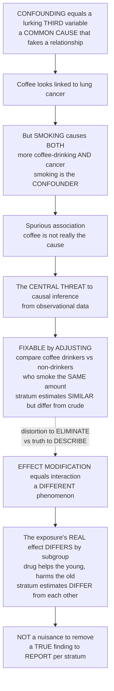

# 🕵️ Confounding and Effect Modification

> [!abstract] TL;DR
> **Confounding** is epidemiology's great deceiver: a lurking **third variable** — a **common cause** of both the exposure and the outcome — that fabricates (or hides) an association that is not real. Coffee drinkers get more lung cancer, but that is because coffee drinkers tend to **smoke** more, and smoking causes cancer; smoking is the confounder, and the coffee–cancer link is spurious. Confounding is the single greatest threat to drawing **causal** conclusions from observational data — but, crucially, unlike most bias it can often be **fixed in analysis** by "adjusting for" the confounder (comparing coffee drinkers to non-drinkers who smoke the *same* amount). Do not confuse it with its cousin **effect modification** (interaction): that is a completely different thing and is **not a nuisance to remove** — it is a **real finding worth reporting**, meaning the exposure's true effect genuinely **differs across subgroups** (a drug that helps the young but harms the old). Confounding is a distortion you eliminate; effect modification is a truth you describe. Telling the two apart — the fake third-variable relationship to remove versus the real subgroup difference to report — is one of the sharpest and most important distinctions in all of epidemiology. *Educational content, not individual medical advice.*

---

## Intuition

**Analogy — the friend who was really behind it.** Imagine you notice that whenever your neighbour buys ice cream, more people in town get sunburned, so you start to suspect that ice cream burns skin. Absurd, of course: it is **hot, sunny weather** that drives *both* the ice-cream buying *and* the sunburns. The weather is a hidden **common cause** sitting behind both, and it manufactures a spurious ice-cream–sunburn "link" that is not real. If you wanted the truth, you would compare ice-cream buyers to non-buyers **on days of the same weather** — hold the sun fixed, and the fake connection vanishes. That is exactly **confounding**, and that comparison-of-likes is exactly **adjustment**.

The textbook epidemiological version: coffee drinkers get more lung cancer. Does coffee cause cancer? No — coffee drinkers tend to **smoke** more, and smoking is what causes the cancer. Smoking is the **confounder**: it is linked to the exposure (coffee) *and* it is an independent cause of the outcome (cancer), so it fakes a coffee–cancer association that isn't there. Age confounds almost everything, because older people have both more exposures and more disease. Confounding is *the* central threat to causal inference from observational data — but, unlike a botched measurement, it can often be **corrected**: compare coffee drinkers to non-drinkers who smoke the *same* amount, and the spurious link disappears.

Now meet the cousin that is constantly confused with it. **Effect modification** (also called **interaction**) is not a distortion at all — it is a genuine, informative *fact about the world*. It means the exposure's **real effect differs across subgroups**. A drug might genuinely help young patients and genuinely harm elderly ones; **age modifies the drug's effect**. This is not noise to be scrubbed away — it is a headline finding you *want* to report, because pooling the two groups into a single average would hide the truth that the drug is good for one and dangerous for the other. Confounding is a **fake relationship you must remove**; effect modification is a **real subgroup difference you must describe**. Keeping these two straight is the crux of valid causal inference — and one of the most frequently botched ideas in the whole field.

---

## How It Works

### Core mechanics — the deceiver and its cousin

1. **What makes a variable a confounder.** A third variable `Z` confounds the exposure `E` → outcome `Y` relationship when it satisfies **three** criteria: (1) `Z` is **associated with the exposure** `E`; (2) `Z` is an **independent risk factor for the outcome** `Y` (associated with `Y` even among the unexposed, i.e. apart from `E`); and (3) `Z` is **not on the causal pathway** between `E` and `Y` — it is *not a mediator*, an *effect* of the exposure. Intuitively, a confounder is a **common cause** of both `E` and `Y`. In the language of causal diagrams, it is a variable that opens a "back-door path" `E ← Z → Y`.

2. **Why it deceives.** Because the confounder is a common cause, the exposed and unexposed groups differ *systematically* in something that itself drives the outcome. The crude comparison therefore mixes the exposure's (possibly zero) effect with the confounder's effect. Confounding can bias the estimate **toward the null**, **away from the null**, or even **reverse its direction** entirely — the extreme reversal being **Simpson's paradox**, where every subgroup shows one direction but the pooled data show the opposite.

3. **Detecting confounding.** You cannot see confounding in the raw association; you have to *reason* about it with subject-matter knowledge and causal diagrams, then check the numbers. The operational test is **stratification**: split the data by levels of the suspected confounder and re-estimate. If the **stratum-specific estimates are similar to each other but differ from the crude estimate**, that gap is the signature of confounding. The rule of thumb: a **change of more than roughly 10 percent** between the crude and adjusted estimate flags meaningful confounding.

4. **Controlling confounding — by design or by analysis.** *By design*: **randomization** (the gold standard — it balances *known and unknown* confounders on average, which is why the randomized trial dethrones observational data), **restriction** (study only non-smokers, so smoking cannot confound), and **matching** (pair exposed and unexposed on the confounder). *By analysis*: **stratification** with a pooled **Mantel–Haenszel** adjusted estimate, **standardization** (reweighting to a common confounder distribution — the classic fix for age confounding between populations), **multivariable regression**, and **propensity scores**. What no analysis can fix is **residual and unmeasured confounding** — you can only adjust for confounders you thought of and measured, which is the fundamental limit of observational data.

5. **Effect modification is a different animal.** Here the third variable `M` is an **effect modifier**: the *magnitude or direction of the exposure's true effect changes across levels of `M`*. This is **not bias** — the stratum-specific estimates are all *correct*, they simply *differ*. You do not remove it; you **report the stratum-specific effects**. Whether "interaction" is present can depend on the **scale** — a difference on the **additive** (risk-difference) scale need not appear on the **multiplicative** (ratio) scale, and vice versa — so the scale is a substantive choice, not a technicality.

6. **The one distinction to burn in.** Under **confounding**, stratum-specific estimates are **similar to each other** (the true effect is homogeneous) but **differ from the crude** (which was distorted). Under **effect modification**, stratum-specific estimates **differ from each other** (the effect genuinely varies). Confounding says "your crude number is wrong — here is the one corrected number." Effect modification says "there is no single number — here are the different, real numbers per subgroup." Conflating them is a serious error: you might "adjust away" a real subgroup difference, or pool a spurious one.

### Flow / Architecture



*Read the left spine top-to-bottom as the confounding story — a common cause fakes a link, threatens causal inference, but is fixable by adjustment — and the right spine as effect modification, a real subgroup difference to be reported, not removed. The dotted arrow is the whole point of the note: one is a distortion to eliminate, the other a truth to describe.*

---

## Key Concepts

### Secondary (intuitive foundation)
- **Confounder = a hidden third thing behind both.** Coffee "linked" to cancer only because coffee drinkers smoke more, and *smoking* causes the cancer. Remove the confounder's shadow and the fake link disappears.
- **The fix is fair comparison.** "Adjusting" just means comparing like with like — coffee drinkers versus non-drinkers who smoke the *same* amount — so the confounder can no longer fool you.
- **Effect modification = the effect really is different for different people.** A drug that genuinely helps children but harms the elderly. That is not a mistake to erase; it is important news to tell.
- **The golden distinction.** Confounding is a **fake relationship you should remove**. Effect modification is a **real difference you should report**. Mixing them up is a classic blunder.
- **Randomization is magic against confounding.** Flip a coin to decide who is exposed and, on average, every hidden third variable — even ones you never thought of — ends up balanced between the groups.

### Undergraduate (formal definitions)
- **The three confounder criteria.** `Z` confounds `E → Y` iff (1) `Z` is associated with `E`; (2) `Z` is an independent risk factor for `Y` (associated with `Y` conditional on `E`); (3) `Z` is **not a mediator** on the `E → Y` pathway. Equivalently: `Z` is a **common cause** of `E` and `Y`.
- **Crude vs adjusted.** The **crude** estimate ignores `Z`; the **adjusted** (stratified/standardized/regression) estimate holds `Z` fixed. A **change-in-estimate** greater than ~10 percent between them signals confounding. The **Mantel–Haenszel** estimator pools stratum-specific 2×2 tables into a single confounding-adjusted risk ratio or odds ratio.
- **Control methods, mapped.** *Design*: randomization (known + unknown confounders), restriction, matching. *Analysis*: stratification, standardization, multivariable regression, propensity scores. Only randomization handles **unmeasured** confounders.
- **Effect modification, formally.** `M` is an **effect modifier** if the stratum-specific effect measures `effect(Y|E, M=m)` differ across `m`. Detected by comparing **stratum-specific estimates to each other** (a test of *homogeneity*), not to the crude. Report the stratum-specific effects; do **not** pool into one summary.
- **Direction of bias.** Confounding can push an estimate toward, away from, or across the null. When the crude and every stratum agree in sign but the crude is more extreme, it is confounding; when the strata *disagree* in sign, that reversal is **Simpson's paradox** and reflects strong confounding and/or effect modification.

### Graduate (analysis, bias, and design nuance)
- **The back-door view (DAGs).** A confounder is a variable that leaves an open **back-door path** `E ← Z → Y`; adjusting for `Z` blocks it and satisfies the **back-door criterion** for identifying the causal effect. Critically, you must *not* adjust for a **mediator** (on the `E → Y` path) or a **collider** (a common effect `E → C ← Y`) — conditioning on a collider *opens* a path and **induces** confounding-like bias (collider-stratification / selection bias). "Adjust for everything" is wrong; adjustment set choice is a causal question, answered with a diagram.
- **Confounding vs collapsibility.** The risk ratio and risk difference are **collapsible**: absent confounding, the crude equals the weighted-average stratum estimate. The **odds ratio is non-collapsible** — it can differ from its stratum-specific values *even without confounding*, purely from stratifying on a risk factor. So a crude-vs-adjusted OR gap does **not** by itself prove confounding; distinguish non-collapsibility from genuine confounding.
- **Additive vs multiplicative interaction.** Effect modification is **scale-dependent**. Two exposures may show no interaction on the multiplicative (ratio) scale yet strong interaction on the additive (risk-difference) scale — and additive interaction is what matters for **public-health impact** (who benefits most in absolute terms) and for detecting **mechanistic/biological synergy** (sufficient-cause interaction). Always state the scale.
- **Standardization and the g-methods lineage.** **Direct/indirect standardization** removes confounding by reweighting to a reference confounder distribution — the historical answer to comparing crude mortality across populations of different age structure. Its modern descendants (**IPW**, **standardization/g-formula**, propensity-score methods) generalize this to high-dimensional confounder sets under the **exchangeability, positivity, and consistency** assumptions.
- **The irreducible limit: unmeasured confounding.** Every observational adjustment is conditional on having **measured** the confounders. **Residual confounding** (imperfectly measured or coarsely categorized confounders) and **unmeasured confounding** cannot be regressed away — they are quantified only by **sensitivity analysis** (e.g. the **E-value**) or sidestepped by design (randomization, instrumental variables, natural experiments). This is why "association is not causation" survives even the most elaborate model.

---

## Python Demo

```python
# Confounding vs effect modification, told in two 2x2-table pictures.
#   (a) CONFOUNDING & ADJUSTMENT -- a confounder (smoking) causes BOTH the exposure
#       (coffee) and the outcome (cancer) while coffee has NO real effect. The CRUDE
#       coffee-cancer risk ratio looks elevated (spurious). STRATIFY by smoking and the
#       association vanishes INSIDE each stratum -- the two stratum estimates are SIMILAR
#       to each other (~1) but DIFFER from the crude. Mantel-Haenszel pools them into a
#       single confounding-adjusted RR (~1). This SIMILAR-strata pattern = confounding.
#   (b) EFFECT MODIFICATION -- a drug's TRUE effect differs by age: protective in the
#       young, harmful in the old. The stratum estimates DIFFER STRONGLY from each other
#       (RR<1 vs RR>1). Here you must REPORT the stratum-specific effects, NOT pool them:
#       any single summary (crude or MH) describes NEITHER subgroup. Differ-strata = EM.
import numpy as np
import matplotlib.pyplot as plt

rng = np.random.default_rng(1981)          # year of the coffee-pancreatic-cancer scare

def counts(E, Y):
    """2x2 cell counts: a,b exposed(diseased,not); c,d unexposed(diseased,not)."""
    a = np.sum((E == 1) & (Y == 1)); b = np.sum((E == 1) & (Y == 0))
    c = np.sum((E == 0) & (Y == 1)); d = np.sum((E == 0) & (Y == 0))
    return a, b, c, d

def risk_ratio(E, Y):
    a, b, c, d = counts(E, Y)
    return (a / (a + b)) / (c / (c + d))

def mantel_haenszel_rr(E, Y, Z):
    """Confounding-adjusted risk ratio pooled across strata of Z."""
    num = den = 0.0
    for z in np.unique(Z):
        m = Z == z
        a, b, c, d = counts(E[m], Y[m]); N = a + b + c + d
        num += a * (c + d) / N
        den += c * (a + b) / N
    return num / den

# ================= (a) CONFOUNDING: smoking behind a fake coffee-cancer link =========
N = 200_000
smoke = (rng.random(N) < 0.40).astype(int)                      # confounder Z
# Coffee depends on smoking (criterion 1: Z associated with exposure)
p_coffee = np.where(smoke == 1, 0.80, 0.30)
coffee = (rng.random(N) < p_coffee).astype(int)                 # exposure E
# Cancer depends on SMOKING ONLY -- coffee has NO effect (criterion 2: Z -> Y, not via E)
p_cancer = np.where(smoke == 1, 0.20, 0.04)
cancer = (rng.random(N) < p_cancer).astype(int)                 # outcome Y

crude_c  = risk_ratio(coffee, cancer)                           # spurious, elevated
rr_ns    = risk_ratio(coffee[smoke == 0], cancer[smoke == 0])   # stratum: non-smokers
rr_sm    = risk_ratio(coffee[smoke == 1], cancer[smoke == 1])   # stratum: smokers
mh_c     = mantel_haenszel_rr(coffee, cancer, smoke)            # adjusted -> ~1

print("=== (a) CONFOUNDING: coffee -> lung cancer, confounded by smoking ===")
print(f"CRUDE      coffee-cancer RR = {crude_c:.2f}   (spurious, > 1)")
print(f"stratum non-smokers    RR   = {rr_ns:.2f}")
print(f"stratum smokers        RR   = {rr_sm:.2f}   (strata SIMILAR to each other ~ 1)")
print(f"Mantel-Haenszel ADJUSTED RR = {mh_c:.2f}   (confounding removed -> ~ 1)")
print(f"change crude->adjusted = {100*(crude_c-mh_c)/crude_c:.0f} percent  (>10 percent flags confounding)\n")

# ================= (b) EFFECT MODIFICATION: drug effect differs by age ===============
age_old = (rng.random(N) < 0.50).astype(int)                    # modifier M (0=young,1=old)
drug    = (rng.random(N) < 0.50).astype(int)                    # exposure, randomized -> NOT confounded by age
# TRUE effect DIFFERS by age: young -> drug protective; old -> drug harmful
p_out = np.where(
    age_old == 0,
    np.where(drug == 1, 0.05, 0.20),   # young: 0.05 vs 0.20  -> RR = 0.25 (helps)
    np.where(drug == 1, 0.40, 0.20),   # old:   0.40 vs 0.20  -> RR = 2.0  (harms)
)
bad = (rng.random(N) < p_out).astype(int)                       # outcome Y

crude_d = risk_ratio(drug, bad)
rr_yng  = risk_ratio(drug[age_old == 0], bad[age_old == 0])     # protective
rr_old  = risk_ratio(drug[age_old == 1], bad[age_old == 1])     # harmful
mh_d    = mantel_haenszel_rr(drug, bad, age_old)                # a misleading average

print("=== (b) EFFECT MODIFICATION: drug effect modified by age ===")
print(f"CRUDE   drug RR            = {crude_d:.2f}")
print(f"stratum YOUNG drug RR      = {rr_yng:.2f}   (protective, < 1)")
print(f"stratum OLD   drug RR      = {rr_old:.2f}   (harmful, > 1)   strata DIFFER strongly")
print(f"Mantel-Haenszel pooled RR  = {mh_d:.2f}   (an average describing NEITHER group -> DO NOT pool)")

# ---------------------------------- plot ----------------------------------
fig, (ax1, ax2) = plt.subplots(1, 2, figsize=(14, 5.5))

# (a) confounding: strata SIMILAR to each other, differ from crude
labels_a = ["Crude", "Non-smokers", "Smokers", "MH adjusted"]
vals_a   = [crude_c, rr_ns, rr_sm, mh_c]
cols_a   = ["#C0392B", "#2980B9", "#2980B9", "#27AE60"]
ax1.bar(labels_a, vals_a, color=cols_a)
ax1.axhline(1.0, ls="--", color="gray", lw=1.5, label="RR = 1 (null, no effect)")
for i, v in enumerate(vals_a):
    ax1.text(i, v + 0.03, f"{v:.2f}", ha="center", fontsize=10)
ax1.set_ylabel("Coffee-cancer risk ratio")
ax1.set_title("(a) CONFOUNDING: strata SIMILAR (~1), differ from crude\nadjusting removes the spurious link")
ax1.legend(loc="upper right", fontsize=9); ax1.grid(axis="y", alpha=0.3)

# (b) effect modification: strata DIFFER from each other; log scale shows both sides of 1
labels_b = ["Crude", "Young", "Old", "MH pooled"]
vals_b   = [crude_d, rr_yng, rr_old, mh_d]
cols_b   = ["#7F8C8D", "#27AE60", "#C0392B", "#7F8C8D"]
ax2.bar(labels_b, vals_b, color=cols_b)
ax2.set_yscale("log")
ax2.axhline(1.0, ls="--", color="gray", lw=1.5, label="RR = 1 (null)")
for i, v in enumerate(vals_b):
    ax2.text(i, v * 1.05, f"{v:.2f}", ha="center", fontsize=10)
ax2.set_ylabel("Drug risk ratio (log scale)")
ax2.set_title("(b) EFFECT MODIFICATION: strata DIFFER (helps young, harms old)\nreport per stratum -- do NOT pool")
ax2.legend(loc="upper left", fontsize=9); ax2.grid(axis="y", alpha=0.3)

plt.tight_layout()
plt.show()
```

**What you see.** *Panel (a)* is confounding caught red-handed: the **crude** coffee–cancer risk ratio is elevated (~1.9), a link that is entirely fake — coffee has no effect on cancer in the simulation. Split by smoking and the association **collapses to ~1 inside each stratum**, and the two strata are **similar to each other** but **differ from the crude**; the Mantel–Haenszel **adjusted** estimate returns to ~1. That "strata agree with each other, disagree with the crude" pattern *is* the fingerprint of confounding, and the >10-percent change flags it. *Panel (b)* is effect modification, and the picture is the opposite: the drug is genuinely **protective in the young** (RR ~0.25) and genuinely **harmful in the old** (RR ~2.0) — the strata **differ strongly from each other**. Any single summary (crude or MH) lands near a meaningless middle that describes **neither** subgroup, which is exactly why you **report the stratum-specific effects rather than pool them**. Same machinery, opposite conclusions: one number to fix versus two numbers to keep.

---

## Real-World Applications

> **Coffee and pancreatic cancer (the classic confounder).** A famous 1981 case-control study reported that coffee drinking was associated with pancreatic cancer. The association largely evaporated once **smoking** was properly accounted for: smokers drink more coffee *and* smoking is a cause of pancreatic cancer, so smoking confounded the crude coffee–cancer link. It is the archetypal "coffee looks harmful only because coffee drinkers smoke" cautionary tale, and the reason smoking is the first confounder every epidemiologist checks.

> **Hormone replacement therapy and heart disease (confounding overturned by an RCT).** Large observational cohorts long suggested that HRT *protected* postmenopausal women against coronary heart disease. The apparent benefit was substantially **confounding by healthy-user / socioeconomic factors** — women prescribed HRT were healthier, wealthier, and more health-conscious to begin with. When the **Women's Health Initiative** randomized trial removed confounding *by design*, HRT showed **no cardiac benefit and net harm** for the studied regimen. A landmark demonstration that no amount of observational adjustment substitutes for randomization against unmeasured confounders.

> **Effect modification by baseline risk and biology (a finding to report).** Whether to give **aspirin** for cardiovascular prevention turns on effect modification: the absolute benefit is real only when baseline cardiovascular risk is high, while bleeding harm is roughly constant — so the drug's net effect is *modified* by baseline risk, and guidelines are written per risk stratum, not as one universal recommendation. Similarly, **pharmacogenomic** effect modification (a drug's effect differing by genotype) drove BiDil's subgroup-specific indication — genuine subgroup differences that are described, not adjusted away.

> **Simpson's paradox in admissions and treatment (confounding that reverses).** UC Berkeley's 1973 graduate admissions looked biased against women overall, yet within almost every *department* women were admitted at equal-or-higher rates — women simply applied more to competitive, low-acceptance departments (department was the confounder). The same reversal appears in kidney-stone treatment comparisons stratified by stone size. These are confounding so severe that the crude and stratum-specific conclusions point in *opposite* directions.

---

## Common Pitfalls

- **Confusing confounding with effect modification.** The cardinal sin of this note. If the stratum-specific estimates are **similar to each other** but differ from the crude, it is **confounding** — report one adjusted number. If they **differ from each other**, it is **effect modification** — report the stratum-specific numbers. "Adjusting away" a real subgroup difference destroys the most important finding in the data.
- **Adjusting for a mediator (over-adjustment).** Controlling for a variable *on the causal pathway* (`E → M → Y`) removes part of the very effect you are trying to estimate, biasing it toward the null. Only common causes are confounders; effects of the exposure are not. Draw the diagram before choosing the adjustment set.
- **Conditioning on a collider (inducing bias).** "Adjust for everything" is dangerous: stratifying on a **common effect** of exposure and outcome (or a variable it causes) *opens* a spurious path and manufactures an association out of nothing — collider/selection bias. More covariates is not always safer.
- **Reading a crude-vs-adjusted odds-ratio gap as confounding.** The odds ratio is **non-collapsible**: it can shift on stratifying a pure risk factor *with no confounding at all*. Do not diagnose confounding from an OR change without ruling out non-collapsibility; risk ratios and risk differences do not have this trap.
- **Ignoring the scale of interaction.** "No interaction" on the multiplicative scale can hide strong interaction on the additive scale — the one that governs public-health impact and biological synergy. Always state whether you mean additive or multiplicative effect modification.
- **Believing regression exorcises all confounding.** Multivariable models only adjust for confounders you **measured** (and measured well). **Residual and unmeasured confounding** survive any model; quantify vulnerability with sensitivity analysis (e.g. the E-value) rather than asserting causation from a well-fit model.

---

## Related Concepts

This note is the analytic heart of the **Causal Inference, Bias and Confounding** section, reached from the vault hub, the [[Epidemiology_and_Public_Health/01_Foundations_of_Epidemiology/Epidemiology_and_Public_Health_Overview|Epidemiology and Public Health Overview]]. It is best read against its section siblings: *Causal Inference in Epidemiology* is the parent problem — why association is not causation and how confounding is the chief obstacle to the causal reading; *Bias, Selection and Information* covers the **other** family of distortions (selection and measurement error), which — unlike confounding — generally **cannot** be fixed after the fact, sharpening the contrast that confounding is uniquely correctable; *Confounder Control and Adjustment* is the deep dive on the very tools sketched here (restriction, matching, stratification, Mantel–Haenszel, standardization, regression, propensity scores); *Directed Acyclic Graphs and Modern Causal Methods* formalizes the common-cause, back-door, mediator, and collider intuitions into rigorous diagrams and the g-methods; and *Populations, Rates and Standardization* supplies the standardization machinery that is confounding control for age between whole populations. (Those sibling notes live alongside this one in the same vault section.)

**Across the vault (Glob-verified links).**

- [[Econometrics/02_OLS_Problems/Omitted_Variable_Bias|Omitted Variable Bias]] — econometrics' name for confounding: a left-out common cause that biases the regression coefficient, with the exact same "correlated with the regressor and the outcome" criteria.
- [[Econometrics/05_Causal_Inference/Potential_Outcomes_Framework|Potential Outcomes Framework]] — the counterfactual language (exchangeability, ignorability) in which "no confounding" is precisely defined as treatment being independent of potential outcomes given covariates.
- [[Econometrics/05_Causal_Inference/Propensity_Score_Matching|Propensity Score Matching]] — a design-plus-analysis method to control measured confounding by balancing covariate distributions across exposure groups, a modern cousin of matching and stratification.
- [[Mathematics/06_Probability_and_Statistics/Regression_and_Correlation|Regression and Correlation]] — the multivariable-regression adjustment used to hold confounders fixed, and the home of the maxim that correlation is not causation.
- [[Logic_and_Critical_Thinking/03_Inductive_and_Probabilistic_Reasoning/Causal_Reasoning|Causal Reasoning]] — the general logic of inferring cause from evidence, where the confounding "third variable" is the standard threat to a causal claim.

---

## Review Questions

1. **(Secondary)** In a town, ice-cream sales and sunburns rise and fall together, yet ice cream obviously does not cause sunburn. Name the hidden "third thing" driving both, and explain in plain words how you would compare people *fairly* to make the fake ice-cream–sunburn link disappear. Then say why this is *not* the same as a drug that truly helps children but harms the elderly.
2. **(Undergraduate)** You estimate a crude coffee–cancer risk ratio of 1.9. Stratifying by smoking, you get RR = 1.05 in non-smokers and RR = 1.02 in smokers. In a *different* study of a drug, you get RR = 0.3 in young patients and RR = 2.1 in old patients. State which study shows **confounding** and which shows **effect modification**, justify your answer using the pattern of the stratum-specific estimates, and say what single reported number (if any) is appropriate in each case.
3. **(Graduate)** A colleague, worried about confounding, proposes adjusting for *every* variable measured, including one that lies on the causal pathway between exposure and outcome and one that is a common *effect* of both. Explain, using the back-door criterion, why each of these two adjustments is a mistake (over-adjustment for the mediator; collider-induced bias for the common effect), and describe how you would use a causal diagram to choose a valid adjustment set instead. Finally, explain why even a perfectly chosen adjustment set cannot guarantee an unbiased causal estimate from observational data.

---

## Sources

- Rothman, K. J., Greenland, S., & Lash, T. L. *Modern Epidemiology* (3rd ed.), chapters on "Confounding and Confounders" and "Concepts of Interaction." Lippincott Williams & Wilkins.
- Hernán, M. A., & Robins, J. M. *Causal Inference: What If.* Boca Raton: Chapman & Hall/CRC (chapters on confounding, exchangeability, and effect modification).
- Gordis, L. (Celentano, D. D., & Szklo, M., eds.). *Gordis Epidemiology* (6th ed.), chapter on "More on Causal Inference: Bias, Confounding, and Interaction." Elsevier.
- VanderWeele, T. J. *Explanation in Causal Inference: Methods for Mediation and Interaction.* Oxford University Press.
- Bickel, P. J., Hammel, E. A., & O'Connell, J. W. "Sex Bias in Graduate Admissions: Data from Berkeley." *Science*, 1975 — the canonical Simpson's-paradox confounding example.

---

#epidemiology #confounding #effect-modification #interaction #causal-inference
