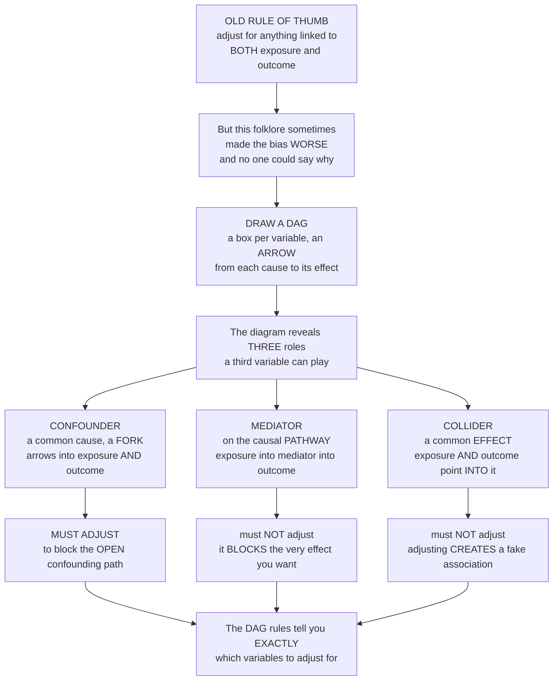

# 🕸️ Directed Acyclic Graphs and Modern Causal Methods

> [!abstract] TL;DR
> For a century, epidemiologists decided **what to adjust for** by a folk rule — *"control for anything associated with both the exposure and the outcome"* — and sometimes this well-meaning advice made the bias **worse**, with no one able to say precisely why. The modern causal revolution, imported from **Judea Pearl's** computer science into epidemiology by Greenland, Robins, and others, fixed the problem by drawing **pictures**. A **directed acyclic graph (DAG)** is a diagram of your causal assumptions: a **box for each variable** and an **arrow from each cause to its effect**, with no cycles. Once drawn, the graph reveals the **three fundamentally different roles** a third variable can play — roles that look *identical in the data* yet demand *opposite* treatment. A **confounder** is a common cause (a *fork*, `A ← C → Y`): you **must** adjust for it. A **mediator** lies on the causal pathway (a *chain*, `A → M → Y`): you must **not** adjust for it if you want the total effect, because doing so *blocks the very effect you are measuring*. And the sneaky **collider** is a common effect (`A → K ← Y`): you must **not** adjust for it, because conditioning on a collider **creates a fake association out of nothing** — the counterintuitive **collider bias** behind many paradoxes. The **back-door criterion** turns this into an exact rule: adjust for a set of variables that blocks every confounding path *without opening any collider path*. This graphical logic, together with the modern toolkit — **potential outcomes**, **target-trial emulation**, **propensity scores**, **inverse-probability weighting**, and the **g-methods** for time-varying confounding — is the cutting edge of epidemiologic method, and it is the same machinery now reshaping econometrics, statistics, and AI. *Educational content, not individual medical advice.*

---

## Intuition

**Analogy — turning "adjust for everything" from dangerous folklore into an exact science by drawing the map.** Imagine a plumber who fixes leaks by a rule of thumb: *"tighten every valve that touches both the inlet and the outlet."* Usually it helps. But every so often, tightening a particular valve *starts* a leak that was not there before — and the plumber has no theory of *why*, only scar tissue. The fix is not more experience; it is a **blueprint of the pipes**. Once you can see which pipe feeds which, you can say precisely which valve to close to stop the flow you want stopped, and which valve to *leave alone* because closing it would open a hidden back-channel.

Epidemiology lived with exactly this folklore for a century. To remove **confounding**, the rule was: *adjust for anything associated with both the exposure and the outcome.* Often fine — but sometimes it made the estimate **worse**, and the field could not say why. The **directed acyclic graph** is the blueprint. You draw a **box for each variable** and an **arrow from every cause to its direct effect**, and suddenly murky arguments become **visual and rigorous**. The picture exposes that a third variable *X* sitting near your exposure and outcome can be one of three utterly different things. It can be a **confounder** — a *common cause* whose two arrows fork out into both exposure and outcome, secretly manufacturing a spurious link; that back-channel is **open**, so you **must** close it by adjusting. It can be a **mediator** — a stepping-stone *on the causal path* from exposure to outcome; adjusting for it **blocks the effect you are trying to measure**, like closing the pipe to see how much water flows through it. Or it can be a **collider** — a *common effect* into which both exposure and outcome point; that path is naturally **closed**, and the deeply counterintuitive discovery of the causal revolution is that **conditioning on a collider *opens* it, conjuring an association from thin air**. This is **collider bias**, and it is why two unrelated diseases look linked among hospital patients, why smoking looked *protective* against COVID in early data, and why the "obesity paradox" and the low-birth-weight paradox fooled a generation. The DAG's rules — the **back-door criterion** — tell you *exactly* which variables to adjust for to get an unbiased answer. This is the same causal-inference framework now unifying epidemiology with economics, statistics, and machine learning.

---

## How It Works

### Core mechanics — from a picture of assumptions to the correct analysis

1. **Draw the causal assumptions as a graph.** Put a **node** (box) for each variable — exposure `A`, outcome `Y`, and every relevant covariate — and a **directed edge** (arrow) from each variable to those it *directly causes*. The edges encode **assumptions about mechanism**, not correlations read from data. "**Acyclic**" means no directed cycle: no variable causes itself through any loop, which fixes a coherent time order (a cause precedes its effect).
2. **Trace the paths.** A **path** is any sequence of edges connecting `A` and `Y`, walked *ignoring arrow direction*. The **causal (front-door) path** `A → ... → Y` carries the effect you want. Every other path is a **back-door path** — a source of spurious association you want to shut off.
3. **Recognise the three elementary junctions.** Along any path, each intermediate variable sits in one of three configurations, and the rules of **d-separation** turn on which:
   - **Chain / mediator** `A → M → Y`. The path is **open**; `M` transmits the causal effect. **Adjusting for `M` blocks it** — removing part or all of the effect you set out to measure.
   - **Fork / confounder** `A ← C → Y`. The path is **open** and non-causal — `C` is a *common cause* that makes `A` and `Y` move together for no causal reason. **Adjusting for `C` blocks (closes) it**, which is exactly what you want.
   - **Collider** `A → K ← Y`. The path is **naturally blocked** — `K` is a *common effect*, and two causes of a common effect are not thereby associated. But **conditioning on the collider `K` (or on a *descendant* of `K`, or *selecting* the sample on `K`) OPENS the path**, inducing a spurious association between `A` and `Y`. This is **collider bias**.
4. **Apply the back-door criterion.** To identify the causal effect of `A` on `Y`, choose an adjustment set **Z** that (i) **blocks every back-door path** (closes all confounding forks) and (ii) contains **no collider or descendant of a collider** whose inclusion would open a path, and (iii) contains no mediator on the causal path. A valid **Z** yields an *unbiased* estimate; the graph tells you precisely which variables belong in it.
5. **Estimate under the counterfactual model.** With a valid adjustment set, the association *within levels of Z* equals the causal effect, formalised by the **potential-outcomes / counterfactual** framework (the effect is `E[Y(1) − Y(0)]`, identifiable under **conditional exchangeability** given `Z`, **positivity**, and **consistency**). Estimation then uses **stratification**, **regression**, **propensity scores**, **inverse-probability weighting**, or — for time-varying exposures — the **g-methods**.
6. **Remember the graph is an assumption, not a fact.** A DAG encodes subject-matter knowledge; it does **not** create data and cannot be read off the data (many DAGs fit the same correlations — *Markov equivalence*). **Garbage in, garbage out**: the analysis is only as good as the causal story you were willing to commit to on paper.

### From folklore to the three roles



*Read top to bottom: the century-old adjustment rule sometimes backfired; drawing a DAG replaces the folklore with a picture; the picture exposes the three roles a third variable can play; and the back-door rules then say exactly which to adjust for — the confounder yes, the mediator and the collider no.*

---

## Key Concepts

### Secondary (intuitive)

- **A DAG is a map of causes.** Draw a box for every thing you measured and an arrow from each cause to what it affects. The map, not gut feeling, tells you what to do.
- **Three kinds of "third variable."** A **confounder** is a hidden *common cause* that fakes a link (you must remove it). A **mediator** is a *middle step* on the real path (don't remove it, or you erase the effect). A **collider** is a *shared consequence* of two things (never remove it).
- **The collider surprise.** Two unrelated things that both cause a third can look *related* the moment you only look at cases where that third thing happened. Among hospital patients, two unlinked diseases seem connected — because being in hospital is the shared consequence you selected on.
- **"Control for everything" is dangerous.** Piling every variable into the model is not caution; some of those variables are mediators or colliders, and adjusting for them *adds* bias.
- **The picture makes it obvious.** Once the arrows are drawn, which variable is a confounder, a mediator, or a collider is something you can *see*.

### Undergraduate (formal)

- **Directed acyclic graph (DAG).** A graphical model with **nodes** (random variables) and **directed edges** (direct causal effects), containing **no directed cycles**. It compactly encodes a set of conditional-independence assumptions via the **causal Markov condition**: each variable is independent of its non-descendants given its direct causes (parents).
- **Paths, open and blocked (d-separation).** A path is *blocked* by a set **Z** if it contains (a) a chain `A → M → Y` or fork `A ← C → Y` whose middle node **is in Z**, or (b) a collider `A → K ← Y` whose node **and all its descendants are NOT in Z**. If every path between `A` and `Y` is blocked given **Z**, then `A` and `Y` are **d-separated** (independent) given **Z**.
- **The three structures and their treatment.** *Confounder* (fork): back-door path is open → **adjust to close it**. *Mediator* (chain): lies on the causal path → **do NOT adjust** for the total effect (adjusting gives only the *direct* effect and can introduce collider bias if the mediator shares causes with `Y`). *Collider*: path is closed → **do NOT adjust**, because conditioning **opens** it and induces association.
- **Back-door criterion (Pearl).** A set **Z** *satisfies the back-door criterion* relative to `(A, Y)` if no node in **Z** is a descendant of `A`, and **Z** blocks every path from `A` to `Y` that starts with an arrow *into* `A` (every back-door path). Any such **Z** identifies the causal effect by adjustment — the graphical version of "no unmeasured confounding."
- **Why this beats the old heuristic.** The classic rule "adjust for anything associated with `A` and `Y`" fails precisely on **colliders** and **M-bias**: a variable associated with both can be a collider (or sit on an M-shaped path between two unmeasured causes), and adjusting for it *creates* confounding. The DAG distinguishes the harmless from the harmful by structure, not by mere association.

### Graduate (mechanistic and systems)

- **Potential outcomes and identification.** The graph identifies causal effects that the **counterfactual** model *defines*. With a back-door set **Z**, conditional exchangeability `Y(a) ⫫ A | Z` holds, so `E[Y(a)] = Σ_z E[Y | A = a, Z = z] P(z)` — the **g-formula (standardisation)**. Positivity `0 < P(A = a | Z = z) < 1` and consistency (well-defined interventions, SUTVA) are the other identification assumptions.
- **Beyond the back door.** When no valid back-door set exists (unmeasured confounding, drawn as a bidirected/dashed arrow), effects may still be identified via the **front-door criterion** (through a fully mediated, unconfounded pathway) or an **instrumental variable** `Z → A → Y` with no direct `Z → Y` path — the do-calculus generalises all of these into a complete algorithm for what is identifiable from a graph.
- **Time-varying confounding and the g-methods.** When a confounder `L` is affected by *prior* exposure and also *predicts future* exposure (`A₀ → L → A₁ → Y`, `L → Y`), it is simultaneously a **confounder** (for later exposure) and a **mediator** (of earlier exposure). Standard regression adjustment is then *biased whether you adjust for `L` or not*. **Robins' g-methods** solve this: the **g-formula**, **marginal structural models** fit by **inverse-probability-of-treatment weighting (IPTW)**, and **g-estimation** of structural nested models. This is the flagship achievement that ordinary DAG-guided regression cannot reach.
- **Selection, colliders, and M-bias unified.** **Selection bias** *is* collider bias: conditioning on being in the study (a common effect of exposure and outcome, or of their causes) opens a non-causal path. **M-bias** shows that adjusting for a *pre-exposure* covariate `Z` can still create bias if `Z` is a collider on a path `A ← U₁ → Z ← U₂ → Y` between two unmeasured variables — refuting the belief that pre-treatment covariates are always safe to control.
- **Paradoxes dissolved.** DAGs explain **Simpson's paradox** (whether to pool or stratify is decided by whether the stratifying variable is a confounder or a collider — the *data alone cannot tell you*), the **birth-weight "paradox"** (adjusting for birth weight, a collider/mediator affected by both smoking and unmeasured causes of mortality, makes maternal smoking look protective for low-birth-weight infants), the **obesity paradox**, and the **Table 2 fallacy** (presenting every coefficient in a multivariable model as if each were an unbiased causal effect, when a single adjustment set is valid for only *one* exposure).
- **The convergence of fields.** The same apparatus — **Pearl's** graphs and do-calculus, **Rubin's** potential outcomes, **Robins'** g-methods, and **econometric** instruments/design-based methods — are provably interoperable descriptions of one theory of causation, now the shared language of epidemiology, statistics, economics, and causal machine learning.

---

## Python Demo

```python
# Directed acyclic graphs and modern causal methods, in two lessons:
#   (a) COLLIDER BIAS -- the counterintuitive one. Take TWO INDEPENDENT variables
#       (say TALENT and ATTRACTIVENESS) that BOTH cause a third variable, a COLLIDER
#       (say CELEBRITY / being admitted). In the FULL data they are uncorrelated
#       (r ~ 0). But CONDITIONING on the collider -- looking only at celebrities, i.e.
#       SELECTING on the common effect -- INDUCES a SPURIOUS NEGATIVE correlation out
#       of nothing. This is why "talented people seem less attractive" among the
#       famous, and why two unrelated diseases look linked among hospital patients.
#   (b) CONFOUNDER vs MEDIATOR vs COLLIDER -- one adjustment, three verdicts. For each
#       structure we estimate the exposure->outcome coefficient UNADJUSTED and then
#       ADJUSTED for the third variable, and compare to the TRUTH:
#         confounder -> adjusting HELPS (removes spurious link),
#         mediator   -> adjusting HARMS (blocks the real total effect),
#         collider   -> adjusting CREATES bias (spurious link from nothing).
import numpy as np
import matplotlib.pyplot as plt

rng = np.random.default_rng(1995)          # Pearl's "Causality" era

# ================= (a) COLLIDER BIAS: association from nothing =================
n = 4000
talent  = rng.normal(0, 1, n)              # cause 1  (independent)
looks   = rng.normal(0, 1, n)              # cause 2  (independent of talent)
celeb   = talent + looks + rng.normal(0, 0.5, n)   # COLLIDER: common effect of both

r_full = np.corrcoef(talent, looks)[0, 1]          # ~ 0 : truly unrelated
sel    = celeb > np.quantile(celeb, 0.80)          # SELECT on the collider (the famous)
r_sel  = np.corrcoef(talent[sel], looks[sel])[0, 1]  # spurious NEGATIVE correlation

# ================= (b) THREE STRUCTURES: one adjustment, three verdicts =========
def beta_A(y, *predictors):
    """OLS coefficient on A (the FIRST predictor) with an intercept."""
    X = np.column_stack([np.ones_like(y)] + list(predictors))
    coef, *_ = np.linalg.lstsq(X, y, rcond=None)
    return coef[1]

m = 4000
# --- CONFOUNDER: A <- C -> Y, NO true A->Y effect (truth = 0) ---
C  = rng.normal(0, 1, m)
Ac = 0.8 * C + rng.normal(0, 1, m)
Yc = 0.8 * C + rng.normal(0, 1, m)                 # depends on C only, not on Ac
conf_unadj = beta_A(Yc, Ac)                        # biased (spurious, > 0)
conf_adj   = beta_A(Yc, Ac, C)                     # ~ 0  : adjusting HELPS

# --- MEDIATOR: A -> M -> Y, true TOTAL effect ~ 0.8*0.8 = 0.64 ---
Am = rng.normal(0, 1, m)
M  = 0.8 * Am + rng.normal(0, 1, m)
Ym = 0.8 * M + rng.normal(0, 1, m)
med_unadj = beta_A(Ym, Am)                         # ~ 0.64 : the correct TOTAL effect
med_adj   = beta_A(Ym, Am, M)                      # ~ 0    : adjusting BLOCKS it (HARMS)

# --- COLLIDER: A -> K <- Y, A and Y INDEPENDENT (truth = 0) ---
Ak = rng.normal(0, 1, m)
Yk = rng.normal(0, 1, m)                           # independent of Ak
K  = 0.8 * Ak + 0.8 * Yk + rng.normal(0, 1, m)
coll_unadj = beta_A(Yk, Ak)                        # ~ 0  : correct
coll_adj   = beta_A(Yk, Ak, K)                     # < 0  : adjusting CREATES bias

# ================================= FIGURES =====================================
fig, (ax1, ax2) = plt.subplots(1, 2, figsize=(14, 5.6))

# --- panel (a): collider bias scatter ---
ax1.scatter(talent[~sel], looks[~sel], s=8, color="#B0B0B0", alpha=0.35,
            label=f"Everyone   r = {r_full:+.2f}")
ax1.scatter(talent[sel], looks[sel], s=14, color="#D7191C", alpha=0.7,
            label=f"Selected on collider   r = {r_sel:+.2f}")
xs = np.linspace(talent.min(), talent.max(), 50)
ax1.plot(xs, np.polyval(np.polyfit(talent, looks, 1), xs), color="black", lw=2.2,
         label="Full-sample fit (flat)")
xs2 = np.linspace(talent[sel].min(), talent[sel].max(), 50)
ax1.plot(xs2, np.polyval(np.polyfit(talent[sel], looks[sel], 1), xs2),
         color="#D7191C", lw=2.4, ls="--", label="Within-selected fit (negative)")
ax1.set_xlabel("Talent  (independent cause 1)")
ax1.set_ylabel("Attractiveness  (independent cause 2)")
ax1.set_title("(a) Collider bias: selecting on a common effect\ninvents a negative correlation from nothing")
ax1.legend(loc="upper right", fontsize=8)
ax1.grid(alpha=0.3)

# --- panel (b): three structures, unadjusted vs adjusted ---
labels = ["CONFOUNDER\nA <- C -> Y\n(truth 0)",
          "MEDIATOR\nA -> M -> Y\n(total 0.64)",
          "COLLIDER\nA -> K <- Y\n(truth 0)"]
unadj  = [conf_unadj, med_unadj, coll_unadj]
adj    = [conf_adj,   med_adj,   coll_adj]
truth  = [0.0, 0.64, 0.0]
x = np.arange(3); w = 0.36
ax2.bar(x - w/2, unadj, w, color="#4A90D9", label="Unadjusted estimate")
ax2.bar(x + w/2, adj,   w, color="#E67E22", label="Adjusted for 3rd variable")
ax2.hlines(truth, x - 0.45, x + 0.45, color="black", lw=2.4, ls=":",
           label="TRUE effect")
ax2.axhline(0, color="gray", lw=1)
verdict = ["adjust HELPS", "adjust HARMS", "adjust CREATES bias"]
for xi, (u, a, v) in enumerate(zip(unadj, adj, verdict)):
    ax2.annotate(v, (xi, max(u, a) + 0.06), ha="center", fontsize=8.5,
                 fontweight="bold")
ax2.set_xticks(x); ax2.set_xticklabels(labels, fontsize=8)
ax2.set_ylabel("Estimated exposure -> outcome coefficient")
ax2.set_title("(b) One adjustment, three verdicts:\nthe DAG tells you which is correct")
ax2.legend(loc="lower left", fontsize=8)
ax2.grid(alpha=0.3, axis="y")

plt.tight_layout()
plt.show()

print("(a) COLLIDER BIAS")
print(f"    corr(talent, looks) full sample     = {r_full:+.2f}   (truly independent)")
print(f"    corr(talent, looks) among 'the famous'= {r_sel:+.2f}   (spurious, from selection)")
print("(b) ONE ADJUSTMENT, THREE VERDICTS  [unadjusted -> adjusted | truth]")
print(f"    Confounder : {conf_unadj:+.2f} -> {conf_adj:+.2f} | 0.00   adjusting HELPS")
print(f"    Mediator   : {med_unadj:+.2f} -> {med_adj:+.2f} | 0.64   adjusting HARMS (blocks effect)")
print(f"    Collider   : {coll_unadj:+.2f} -> {coll_adj:+.2f} | 0.00   adjusting CREATES bias")
```

**What you see.** *Panel (a)* is the collider surprise made visible. **Talent** and **attractiveness** are generated *independently* — in the full gray cloud their correlation is essentially **zero** and the full-sample fit line is flat. But both traits raise the chance of becoming a **celebrity**, so *celebrity is a collider*. The moment we **select only the famous** (the red points, the top stratum of the collider), a **negative** correlation appears out of nothing: among celebrities, the very talented tend to be less conventionally attractive and vice versa — not because the traits are linked, but because a low value on one had to be *compensated* by a high value on the other to clear the fame threshold. Nothing changed in the world; we merely *conditioned on a common effect*, and the association was **manufactured by the analysis**. This identical mechanism is Berkson's bias among hospital patients and the selection bias behind the "why are talented people less attractive" illusion. *Panel (b)* is the punchline of the whole note: the **same act of adjustment** — controlling for the third variable — produces **three opposite verdicts** depending on structure. For the **confounder**, adjustment *removes* a spurious link and lands on the truth (helps). For the **mediator**, adjustment *destroys* the real total effect by blocking the pathway (harms). For the **collider**, adjustment *invents* a bias where there was none (creates bias). Only the DAG — not the data, which look the same in all three cases — tells you which is which.

---

## Real-World Applications

> **The birth-weight "paradox" — collider bias uncovered.** Maternal smoking lowers infant birth weight and raises infant mortality, yet in data restricted (or adjusted) to **low-birth-weight** babies, smokers' infants appear to *survive better* than nonsmokers'. Hernández-Díaz, Schisterman, and Hernán showed this is **collider/selection bias**: birth weight is a common effect of smoking and of unmeasured, more dangerous causes of low weight (e.g., birth defects), so conditioning on low birth weight opens a back-door path and makes smoking look protective. The DAG dissolved a paradox that had puzzled perinatal epidemiology for decades.

> **COVID-19 collider bias.** Early reports suggested smoking *protected* against severe COVID-19. Griffith and colleagues (2020, *Nature Communications*) argued this was largely **collider bias**: being tested or hospitalised is a common effect of smoking-related illness and of COVID risk, so studying only tested/hospitalised people opens a spurious path. The episode became a textbook warning that selection into a sample is itself a collider.

> **Target-trial emulation resolving observational–trial conflicts.** Observational cohorts long suggested hormone-replacement therapy *prevented* heart disease; the randomised Women's Health Initiative reversed it. Hernán and Robins showed the discrepancy was largely **avoidable bias** (immortal-time, prevalent-user, and confounding-by-indication) and that explicitly **emulating the target trial** an observational database is meant to mimic — specifying eligibility, treatment strategies, and the start of follow-up as a randomised trial would — reconciles the two, now the standard for comparative-effectiveness research on EHR and claims data.

> **G-methods for time-varying treatment.** In HIV, the CD4 count is *lowered by* untreated disease and *predicts* whether antiretroviral therapy is (re)started, and it also predicts mortality — the archetypal **confounder affected by prior treatment**. Robins' **marginal structural models fitted by inverse-probability weighting** estimated the mortality effect of continuous antiretroviral therapy that ordinary regression could not, and the same g-methods now underpin studies of statins, dialysis timing, and dynamic treatment strategies.

> **Software and the everyday workflow.** Tools such as **DAGitty** (Textor et al.) let epidemiologists draw a DAG and have it *return the minimal sufficient adjustment sets* automatically, flag colliders, and list the testable implications — moving DAGs from theory into routine study design, protocol pre-registration, and grant review.

---

## Common Pitfalls

- **Over-adjustment — controlling for mediators.** Throwing "everything" into the regression feels safe but is not. Adjusting for a **mediator** removes the very pathway you want to measure, biasing the *total* effect toward null (and, if the mediator shares causes with the outcome, opening a collider path on top). Decide *before* modelling whether you want the total or direct effect, and draw the DAG.
- **Adjusting for a collider (and M-bias).** The old heuristic "adjust for anything associated with exposure and outcome" **fails on colliders**: a collider is associated with both, yet conditioning on it *creates* confounding. Even a *pre-exposure* covariate is not automatically safe — **M-bias** shows a pre-treatment collider between two unmeasured variables can induce bias when adjusted. Only the graph tells you which variables are safe.
- **Selecting the sample on a collider.** Restricting to hospital patients, survivors, responders, the tested, or any group defined by a common effect of exposure and outcome is **selection = collider bias**. Loss to follow-up and self-selection into a study are silent versions of the same trap.
- **The Table 2 fallacy.** Reporting every coefficient of a multivariable model as if each were an unbiased causal effect is wrong: a single adjustment set is valid for **one** exposure's total effect; the other coefficients mix direct effects, mediated effects, and collider bias. Present the effect of *your* exposure and interpret the rest with care.
- **Mistaking the DAG for the data.** You **cannot** learn the arrows from correlations alone — many DAGs (a Markov-equivalence class) fit the same joint distribution, and a fork and a collider through the same trio are statistically identical until you supply causal knowledge. The DAG is an **assumption**; it must be argued from subject-matter expertise, not estimated.
- **Ignoring unmeasured confounding and time-varying structure.** A tidy DAG with all confounders measured is often wishful. Draw the **unmeasured** common causes (bidirected/dashed arrows) honestly; if a back-door set does not exist, reach for instruments, front-door, sensitivity analysis, or g-methods rather than pretending adjustment suffices.

---

## Related Concepts

**Within this vault (Section 03, prose references).** This note is the methodological capstone of **Section 03 — Causal Inference, Bias and Confounding**, and it makes rigorous the ideas its siblings introduce narratively. *Causal Inference in Epidemiology* frames the whole programme — association versus causation, the four explanations, the Bradford Hill viewpoints, and the counterfactual definition of a cause — and this note supplies the graphical machinery that operationalises it. *Confounding and Effect Modification* defines the confounder (the fork) and distinguishes it from effect modification; the DAG here shows exactly *why* a fork must be blocked and a mediator must not. *Confounder Control and Adjustment* details stratification, regression, matching, and standardisation; the back-door criterion tells you *which* variables those methods should include and, crucially, which they must exclude. *Bias, Selection and Information* catalogues selection and information bias; this note reveals selection bias to be *collider bias* in graphical disguise. And *Randomized Controlled Trials in Populations* is the design that achieves exchangeability by randomisation — the target that target-trial emulation tries to reconstruct from observational data. (Those sibling notes live alongside this one in the same section.)

**Across the vault (Glob-verified links).**

- [[Econometrics/05_Causal_Inference/Potential_Outcomes_Framework|Potential Outcomes Framework]] — the Rubin counterfactual model that *defines* the effects a DAG *identifies*; exchangeability, positivity, and consistency are the bridge between the two languages.
- [[Econometrics/05_Causal_Inference/Instrumental_Variables|Instrumental Variables]] — the graphical pattern `Z → A → Y` with no direct `Z → Y` path, the method of choice when no valid back-door adjustment set exists because of unmeasured confounding.
- [[Econometrics/05_Causal_Inference/Propensity_Score_Matching|Propensity Score Matching]] — one way to implement adjustment for a back-door set, collapsing many confounders into a single balancing score; the DAG decides *which* covariates belong in that score.
- [[Econometrics/02_OLS_Problems/Omitted_Variable_Bias|Omitted Variable Bias]] — confounding under its econometric name: an omitted common cause is exactly an open back-door fork, and the bias formula is the regression counterpart of a DAG's unblocked path.
- [[Logic_and_Critical_Thinking/03_Inductive_and_Probabilistic_Reasoning/Causal_Reasoning|Causal Reasoning]] — the philosophical parent (Mill's methods, counterfactual theories, correlation-versus-causation) that DAGs formalise into a calculus.
- [[Computational_Social_Science/06_Prediction_Causality_and_Frontiers/Causal_Inference_from_Observational_and_Digital_Data|Causal Inference from Observational and Digital Data]] — the data-science/AI face of the same machinery: DAGs, potential outcomes, and Pearl's do-calculus applied to large observational and digital-trace datasets.
- [[Statistical_Mechanics_and_Machine_Learning/02_Energy_Based_Models_and_Boltzmann_Machines/Markov_Random_Fields_and_Undirected_Graphical_Models|Markov Random Fields and Undirected Graphical Models]] — the *undirected* cousin of DAGs; contrasting directed causal graphs with undirected probabilistic graphs sharpens what the arrows in a DAG really claim.

---

## Review Questions

1. **(Secondary)** Two traits — being very talented and being very attractive — are, in the general population, unrelated. Yet among *celebrities* they seem to trade off: the most talented stars are, on average, less conventionally attractive, and vice versa. Using the idea of a "shared consequence," explain why looking only at celebrities can invent a link that does not exist in everyone — and state the general rule this gives you about selecting your study sample.
2. **(Undergraduate)** You want the effect of a new drug (`A`) on recovery (`Y`). You have data on three other variables: disease severity `C` (which affects who gets the drug *and* recovery), a blood biomarker `M` that the drug changes and that in turn affects recovery, and hospital length-of-stay `K` (which is *increased* by both taking the drug and by poor recovery). For each of `C`, `M`, and `K`, name its role in the DAG (confounder, mediator, or collider), say whether you should adjust for it to estimate the drug's **total** effect, and explain in one sentence what goes wrong if you get it backwards.
3. **(Graduate)** In a study of a time-varying treatment, a lab value `L` is *lowered* by untreated disease, *predicts* whether treatment is continued, and *predicts* the outcome — so `L` is a confounder for later treatment but a mediator of earlier treatment (`A₀ → L → A₁`, `L → Y`). Explain why standard regression is biased *whether or not* you adjust for `L`, and describe how a **marginal structural model** fitted by **inverse-probability-of-treatment weighting** escapes the trap. Then connect this to the back-door criterion: why does no single adjustment set work here, and what does that reveal about the limits of ordinary DAG-guided regression?

---

## Sources

- Greenland, S., Pearl, J., & Robins, J. M. (1999). "Causal Diagrams for Epidemiologic Research." *Epidemiology*, 10(1), 37–48 — the paper that brought DAGs and the back-door logic into epidemiology.
- Pearl, J. *Causality: Models, Reasoning, and Inference* (2nd ed., 2009). Cambridge University Press — d-separation, the back-door and front-door criteria, and the do-calculus.
- Hernán, M. A., & Robins, J. M. *Causal Inference: What If.* Chapman & Hall/CRC (freely available) — DAGs, exchangeability, the g-formula, marginal structural models, IP weighting, and target-trial emulation.
- Hernández-Díaz, S., Schisterman, E. F., & Hernán, M. A. (2006). "The Birth Weight 'Paradox' Uncovered?" *American Journal of Epidemiology*, 164(11), 1115–1120 — the definitive collider-bias explanation of a famous paradox.
- Griffith, G. J., Morris, T. T., Tudball, M. J., et al. (2020). "Collider Bias Undermines Our Understanding of COVID-19 Disease Risk and Severity." *Nature Communications*, 11, 5749.

---

#epidemiology #directed-acyclic-graphs #collider-bias #causal-inference #judea-pearl
