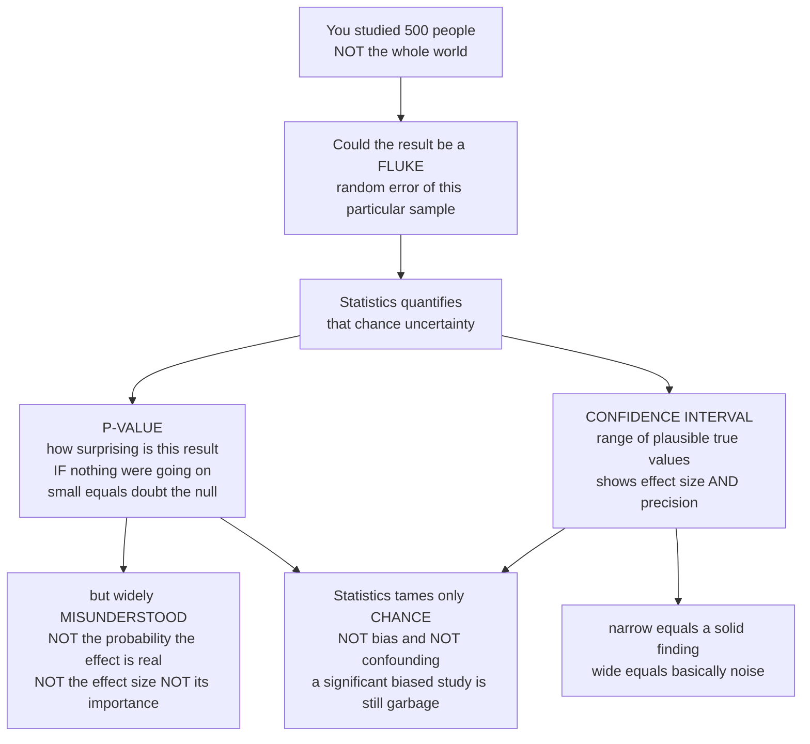

# 🎲 Statistical Inference and Uncertainty

> [!abstract] TL;DR
> Every epidemiological finding carries a shadow of doubt: you studied 500 people, not the whole world, so could the number you got be just a **fluke** of the particular people who happened to be in your study? **Statistics is the toolkit for quantifying that chance uncertainty**, and it speaks in two constantly-confused dialects. The **p-value** asks "if there were *really* no effect, how surprising would a result this extreme be?" — a small p-value means the data would be surprising under "nothing is going on," so we doubt that nothing is going on. But the p-value is endlessly abused: it does **not** give the probability the effect is real, nor its size, nor its importance. The far more useful dialect is the **confidence interval** — a range of plausible values for the true effect. A relative risk of 2.0 with a CI of `[1.9, 2.1]` is a precise, solid finding; the same 2.0 with `[0.5, 8.0]` is basically noise. The crucial catch: statistics tames only **chance** — it does *nothing* about bias or confounding, so a "statistically significant" result from a biased study is still garbage. *Educational content, not individual medical advice.*

---

## Intuition

**Analogy:** Imagine you want to know the average height of everyone in a huge city, but you only have time to measure 500 people you meet on the street. You get an average of 170 cm. Now — would you bet your life that the *true* city-wide average is exactly 170 cm? Of course not. If a friend measured a *different* 500 people, they would get a slightly different number, maybe 168 or 172. Your 170 is a shadow cast by the particular sample that happened to walk past you. **The gap between your sample's number and the world's true number is called random error**, and quantifying it is the entire job of statistical inference.

There are two honest ways to report your uncertainty, and health headlines mangle both. The first is a **p-value**, which answers a narrow, backwards-sounding question: *"If men and women in this city were actually the same height, how surprising would a 2 cm difference in my sample be?"* If a gap that big would rarely happen by luck alone, a small p-value tells you to *doubt* the "they're the same" story. That is all it does — and yet people constantly misread it as "the probability my finding is a fluke" or "the probability the effect is real" or "how big the effect is." **It is none of those things.** The second, far more useful, dialect is the **confidence interval**: a *range* of true averages compatible with your data, say "the true city average is plausibly between 168 and 172 cm." A *narrow* interval means you measured precisely and can trust the number; a *wide* interval means you barely know anything. A relative risk of 2.0 that comes with `[1.9, 2.1]` is a rock; the same 2.0 with `[0.5, 8.0]` is fog. And here is the part that saves you from being fooled: statistics only tames **chance**. If your 500 people were all recruited from a basketball court, no p-value and no confidence interval on Earth can fix the fact that your sample was *biased* — the math will hand you a beautifully precise, "significant" answer that is confidently wrong.

---

## How It Works

### Core Mechanics

1. **The problem — you sampled, so your estimate wobbles.** A study measures a *sample*, not the whole population. If you repeated the study with a fresh sample you would get a slightly different estimate. This sample-to-sample wobble is **random error** (sampling variability, "chance") — the first of the *four explanations* for any observed association, alongside bias, confounding, and true causation. Statistics quantifies only this first one.

2. **The sampling distribution and the standard error.** Imagine repeating the study thousands of times; the estimates would form a bell-shaped **sampling distribution** centered near the true value. Its spread is the **standard error (SE)**, which shrinks as the sample grows, roughly like `SE ∝ 1/√n`. Quadrupling the sample only halves the SE — precision is expensive.

3. **Confidence intervals — the recommended tool.** A 95% CI is (for a symmetric estimate) `estimate ± 1.96 × SE`: a range of true values *compatible* with your data. It conveys three things at once — the **effect estimate**, its **precision** (the width), and whether the **null value** (`RR` or `OR` = 1, or a difference of 0) falls inside. Narrow means precise and driven by large `n`; wide means the study can barely distinguish "big effect" from "nothing."

4. **Hypothesis testing and the p-value.** State a **null hypothesis** `H0` of no association. The **p-value** is the probability of getting a result *at least as extreme* as the observed one *if `H0` were exactly true*. Compare it to a threshold `α` (traditionally 0.05). Small p = the data are surprising under "no effect" = doubt the null. This machinery has two failure modes: a **Type I error** (false positive, rejecting a true null, rate `α`) and a **Type II error** (false negative, missing a real effect, rate `β`). **Power** = `1 − β` is the chance of detecting a real effect and is set before the study by the sample size.

5. **CIs and p-values are two views of the same information** — a 95% CI that *excludes* the null is equivalent to `p < 0.05` — but the CI shows *magnitude and precision* while the p-value collapses everything into a single yes/no verdict, which is why epidemiology increasingly prefers estimation over dichotomous "significance."

6. **The caveat that outranks everything above.** All of this quantifies **chance only**. A precise, "significant" estimate drawn from a biased or confounded study is still wrong — statistics cannot detect, measure, or repair systematic error.

### Flow / Architecture



---

## Key Concepts

### Secondary (intuitive foundation)
- **The fluke problem.** You measured a sample, not everyone, so another sample would give a slightly different number. That inevitable wobble is what statistics is about.
- **P-value in plain words.** "If nothing were really going on, how surprising is a result this big?" A small p-value means "pretty surprising," so you start to doubt the "nothing's going on" story.
- **What a p-value is NOT.** It is *not* the chance your result is a fluke, *not* the chance the effect is real, and *not* a measure of how big or important the effect is. These four confusions cause most misreadings of health news.
- **Confidence interval in plain words.** A range of believable true values. A **narrow** interval means you know the answer precisely and can trust it; a **wide** interval means the study is shaky.
- **Statistics fixes luck, not lies.** If the study was set up unfairly (biased), a beautiful "significant" p-value does not rescue it — the number is still wrong.

### Undergraduate (formal definitions)
- **Random vs systematic error.** Random error is sampling noise that averages out with larger `n`; systematic error (bias, confounding) does *not* shrink with `n` and is invisible to statistics.
- **Standard error.** The standard deviation of the sampling distribution, roughly `SE ∝ σ/√n`. Precision improves only with the *square root* of sample size.
- **The null hypothesis and the p-value.** `H0`: no association (`RR = OR = 1`, or difference = 0). The p-value = `P(result at least as extreme | H0 true)`. Reject `H0` if `p < α` (commonly 0.05).
- **Two errors and power.** **Type I** = false positive (rate `α`); **Type II** = false negative (rate `β`); **power** = `1 − β`. Underpowered studies both miss real effects *and*, when they do hit "significance," tend to overstate the effect (the *winner's curse*).
- **Constructing a 95% CI.** For an approximately normal estimate, `estimate ± 1.96 × SE`. Frequentist meaning: across many hypothetical repetitions, 95% of such intervals would contain the true value. A 95% CI excludes the null exactly when `p < 0.05`.
- **Ratio measures live on the log scale.** Because `RR` and `OR` are skewed, their SEs and CIs are computed on `ln(RR)` / `ln(OR)` and then exponentiated, giving *asymmetric* intervals around the point estimate (link measures of association).

### Graduate (interpretation, misuse, and reform)
- **Correct vs incorrect interpretations (Greenland et al. 2016).** A p-value is *not* `P(H0)`; a 95% CI is *not* "95% probability the true value lies in *this* realized interval." Both are properties of a *procedure*, not of the one interval or one dataset in front of you. Better framing: CIs as **compatibility intervals** — the range of parameter values most compatible with the data under the model.
- **The misuse crisis.** Multiple comparisons and **p-hacking** (trying analyses until one crosses 0.05), the *garden of forking paths*, and selective reporting inflate the true Type I rate far above the nominal `α`. Fixes include pre-registration, and multiplicity corrections (Bonferroni, false-discovery-rate control).
- **Statistical vs clinical/public-health significance.** With huge `n`, a **trivially small** effect becomes "significant"; with small `n`, an **important** effect may be "non-significant." Significance conflates effect size with sample size, which is why effect estimates plus CIs — not stars on a table — should drive decisions.
- **The reform movement.** The **ASA 2016 statement** on p-values (six principles), the 2019 *Nature* call to "retire statistical significance," and journals such as *Epidemiology* discouraging the word "significant" all push toward **estimation over testing**: report the magnitude and its uncertainty, and stop dichotomizing.
- **Bayesian perspective (brief).** Instead of `P(data | H0)`, put a prior on the parameter and report a **posterior** distribution and a **credible interval** — which *can* be read as "95% probability the true value lies here," at the cost of choosing a prior. Bayes factors compare hypotheses directly.
- **The four-explanations caveat, restated.** Chance, bias, confounding, causation. Statistics addresses *only chance*. A precise, "significant" estimate from a biased or confounded study is still wrong (link bias, confounding) — completing the chance–bias–confounding trio at the heart of causal inference.

---

## Python Demo

```python
# Statistical inference and uncertainty, four pictures:
#   (A) CONFIDENCE-INTERVAL COVERAGE  -> 95% CIs trap the true value ~95% of the time
#   (B) PRECISION vs SAMPLE SIZE      -> CI width shrinks like 1/sqrt(n)
#   (C) SIGNIFICANCE vs IMPORTANCE    -> big n makes a TRIVIAL true effect "significant"
#   (D) MULTIPLE TESTING              -> when the null is TRUE, ~5% of tests still "hit"
import numpy as np
import matplotlib.pyplot as plt
from math import erf, sqrt

rng = np.random.default_rng(42)

TRUE_EFFECT = 2.0     # a REAL mean difference between two groups (units)
SIGMA       = 10.0    # outcome standard deviation
Z           = 1.96    # 95% CI multiplier

def two_sided_p(zstat):
    # two-sided p-value from a z-statistic (normal approximation)
    return 2.0 * (1.0 - 0.5 * (1.0 + erf(abs(zstat) / sqrt(2))))

def one_study(n, true_effect):
    """Draw n per group; return (estimate, se) for the difference in means."""
    g1 = rng.normal(true_effect, SIGMA, n)   # exposed / treated
    g0 = rng.normal(0.0,        SIGMA, n)    # unexposed / control
    diff = g1.mean() - g0.mean()
    se   = np.sqrt(g1.var(ddof=1)/n + g0.var(ddof=1)/n)
    return diff, se

# ---------- (A) coverage: repeat the same study many times ----------
n_reps, n_study = 100, 50
ests = np.array([one_study(n_study, TRUE_EFFECT) for _ in range(n_reps)])
diffs, ses = ests[:, 0], ests[:, 1]
lo, hi = diffs - Z*ses, diffs + Z*ses
covers = (lo <= TRUE_EFFECT) & (TRUE_EFFECT <= hi)
coverage = covers.mean()

# ---------- (B) precision vs sample size ----------
ns = np.array([10, 25, 50, 100, 250, 500, 1000, 2500])
halfwidth = np.array([
    Z * np.mean([one_study(n, TRUE_EFFECT)[1] for _ in range(300)]) for n in ns
])

# ---------- (C) significance vs importance: a TRIVIAL true effect ----------
TRIVIAL = 0.3   # real but clinically meaningless
ns_big = np.array([50, 100, 500, 1000, 5000, 10000, 50000, 100000])
p_big = []
for n in ns_big:
    d, se = one_study(n, TRIVIAL)
    p_big.append(two_sided_p(d / se))
p_big = np.array(p_big)

# ---------- (D) multiple testing when the NULL IS TRUE ----------
n_tests = 200
p_null = np.array([two_sided_p(one_study(100, 0.0)[0] / one_study(100, 0.0)[1])
                   for _ in range(n_tests)])
false_pos = int((p_null < 0.05).sum())

# ------------------------------- plots -------------------------------
fig, ax = plt.subplots(2, 2, figsize=(13, 9))

# (A) forest of CIs
y = np.arange(n_reps)
for i in range(n_reps):
    ax[0, 0].plot([lo[i], hi[i]], [y[i], y[i]],
                  color=("#2ca02c" if covers[i] else "#d62728"), lw=1)
ax[0, 0].axvline(TRUE_EFFECT, color="black", ls="--", lw=1.5, label="true effect = 2.0")
ax[0, 0].set_title(f"(A) 95% CI coverage: {coverage*100:.0f}% of intervals trap the truth")
ax[0, 0].set_xlabel("estimated effect"); ax[0, 0].set_ylabel("study repetition")
ax[0, 0].legend(loc="lower right", fontsize=8)

# (B) precision vs n
ax[0, 1].loglog(ns, halfwidth, "o-", color="#1f77b4", label="95% CI half-width")
ax[0, 1].loglog(ns, halfwidth[0]*np.sqrt(ns[0]/ns), "k--", lw=1, label="1/sqrt(n) reference")
ax[0, 1].set_title("(B) Precision is bought with sample size")
ax[0, 1].set_xlabel("n per group"); ax[0, 1].set_ylabel("CI half-width (log)")
ax[0, 1].legend(fontsize=8)

# (C) significance vs importance
ax[1, 0].semilogx(ns_big, p_big, "o-", color="#9467bd")
ax[1, 0].axhline(0.05, color="red", ls="--", label="alpha = 0.05")
ax[1, 0].set_title("(C) A TRIVIAL true effect (0.3) becomes 'significant' with big n")
ax[1, 0].set_xlabel("sample size n"); ax[1, 0].set_ylabel("p-value")
ax[1, 0].legend(fontsize=8)
ax[1, 0].annotate("effect stays trivial;\nonly the p-value moves",
                  xy=(ns_big[-1], p_big[-1]), xytext=(200, 0.4),
                  arrowprops=dict(arrowstyle="->"), fontsize=8)

# (D) multiple testing
ax[1, 1].hist(p_null, bins=20, range=(0, 1), color="#8c8c8c", edgecolor="white")
ax[1, 1].axvline(0.05, color="red", ls="--", label="alpha = 0.05")
ax[1, 1].set_title(f"(D) 200 tests, NULL true: {false_pos} 'significant' by luck (~5%)")
ax[1, 1].set_xlabel("p-value"); ax[1, 1].set_ylabel("count")
ax[1, 1].legend(fontsize=8)

plt.tight_layout()
plt.show()
```

Panel **(A)** repeats the *same* study 100 times: about 95 of the 95% intervals straddle the true effect (green) and about 5 miss it (red) — the frequentist meaning of "95% confidence" made visual. Panel **(B)** shows CI width collapsing along the `1/√n` curve, so precision is bought slowly with sample size. Panel **(C)** is the significance-versus-importance trap: a *real but trivial* effect of 0.3 units drives the p-value below 0.05 purely by piling on data, even though the effect never becomes important. Panel **(D)** runs 200 tests where the null is *true* and still finds roughly 5% "significant" — the engine of p-hacking and multiple-comparison false positives.

---

## Real-World Applications

> **The 0.05 threshold in clinical trials.** Regulators and journals built decades of practice on `p < 0.05`. Every phase-III **randomized controlled trial** does a **power/sample-size calculation** in advance to ensure a real effect of a pre-specified size would be detectable — the practical face of Type II error and power (link evidence-based medicine).

> **Genome-wide association studies (GWAS).** Testing millions of genetic variants at once means that at `α = 0.05` you would expect tens of thousands of pure false positives. The field responded with a genome-wide threshold near `p < 5 × 10⁻⁸` (a Bonferroni-style correction) — a live, high-stakes example of the multiple-comparisons problem in panel (D).

> **Big-data epidemiology.** In electronic-health-record studies of millions of patients, *everything* is "statistically significant." A drug that lowers blood pressure by 0.2 mmHg can hit `p < 0.001` and mean nothing clinically. Here the confidence interval and the raw effect size — not the p-value — carry the message, exactly the significance-versus-importance point of panel (C).

> **The reform of statistical practice.** The **ASA 2016 statement** on p-values, the 2019 *Nature* comment "Retire statistical significance," and editorial policies at journals like *Epidemiology* that ban the word "significant" all push researchers to report effect estimates with confidence intervals and to stop treating 0.05 as a bright line — the practical outcome of the misuse crisis.

---

## Common Pitfalls

- **"The p-value is the probability the result is a fluke / the effect is real."** No. It is `P(data this extreme | null true)`, a conditional in the *opposite* direction. It says nothing about `P(null)` or `P(effect)`.
- **Reading `p > 0.05` as "no effect."** *Absence of evidence is not evidence of absence.* A non-significant result usually means the study was underpowered, not that the effect is zero. Report the CI, which will typically include both null and clinically important values.
- **Dichotomania — treating 0.05 as a cliff.** `p = 0.049` and `p = 0.051` are essentially identical evidence, yet get opposite verdicts. Bright-line thinking manufactures fake discoveries and fake null results.
- **Multiple comparisons and p-hacking.** Testing many outcomes, subgroups, or model specifications and reporting only what "worked" inflates the true false-positive rate far above `α`. Pre-register, and correct for multiplicity.
- **Confusing statistical with clinical/public-health significance.** A huge sample makes trivial effects "significant"; a small sample hides important ones. Always ask *how big* and *how precise*, not just *significant or not*.
- **Believing a tiny p or narrow CI rescues a biased study.** Statistics quantifies *chance only*. Selection bias, information bias, and confounding are invisible to it — a precise, significant estimate from a flawed design is precisely, significantly wrong (link bias, confounding).
- **Misreading a single CI as a probability statement about the true value.** In the frequentist sense the true value either is or is not in *your* interval; the 95% describes the long-run behavior of the *procedure*, not this one interval.

---

## Related Concepts

This note completes the **chance–bias–confounding trio** at the heart of the *Causal Inference, Bias, and Confounding* section. Random error is the *first* of the four rival explanations examined in *Causal Inference in Epidemiology* before any association can be called causal; the other three — *Bias (Selection and Information)* and *Confounding and Effect Modification* — are the systematic errors that statistics explicitly *cannot* fix, which is exactly why they get their own notes. The confidence intervals defined here are placed on the risk ratios and odds ratios of *Measures of Association and Effect* (computed on the log scale), and the same uncertainty logic scales up when many studies are pooled in *Systematic Reviews and Meta-Analysis*, where narrow, precise intervals dominate the weighted average. (Those sibling notes live alongside this one in the same vault section.)

- [[Statistical_Inference]] — the formal mathematical machinery of estimators, sampling distributions, and interval construction that this note applies to health data.
- [[Hypothesis_Testing]] — the general test framework (null/alternative, Type I/II errors, power) behind the p-value.
- [[Statistical_Inference_and_Hypothesis_Testing]] — the logic-of-reasoning view of inductive inference and testing under uncertainty.
- [[Probability_Theory]] — sampling distributions, the normal approximation, and the algebra of chance underlying every SE and CI.
- [[Bayesian_Statistics]] — the alternative paradigm: posteriors and credible intervals that *can* be read as direct probabilities about the parameter.
- [[Causal_Reasoning]] — why ruling out chance is necessary but never sufficient for a causal claim.
- [[Evidence_Based_Medicine_and_Clinical_Trials]] — where p-values, confidence intervals, and power calculations drive real clinical and regulatory decisions.

---

## Review Questions

1. **(Secondary)** Two studies both report a relative risk of 2.0. Study A's 95% confidence interval is `[1.9, 2.1]`; Study B's is `[0.5, 8.0]`. The point estimates are identical — which finding do you trust more, and what does the *width* of each interval tell you that the single number 2.0 cannot?
2. **(Undergraduate)** Explain in one sentence what a p-value of 0.03 actually means, then list two things it does *not* mean. If you kept the true effect the same but doubled the sample size, what would happen to the p-value and to the width of the confidence interval, and why?
3. **(Graduate)** A purely observational study of 2 million electronic health records finds a "highly significant" (`p < 0.001`) association between a drug and a 0.2 mmHg reduction in blood pressure. Discuss (a) the difference between statistical and clinical significance here, (b) why no amount of statistical precision can rule out confounding by indication, and (c) how you would report this result — CI and effect size versus a significance verdict — to avoid misleading readers.

---

## Sources

- Rothman, K. J., Greenland, S. & Lash, T. L. *Modern Epidemiology* (3rd ed.), chapter on "Random Error and the Role of Statistics." Lippincott Williams & Wilkins.
- Wasserstein, R. L. & Lazar, N. A. "The ASA Statement on p-Values: Context, Process, and Purpose." *The American Statistician*, 70(2), 2016.
- Greenland, S., Senn, S. J., Rothman, K. J., et al. "Statistical Tests, P Values, Confidence Intervals, and Power: A Guide to Misinterpretations." *European Journal of Epidemiology*, 31, 2016.
- Amrhein, V., Greenland, S. & McShane, B. "Retire Statistical Significance." *Nature*, 567, 2019.
- Gordis, L. *Epidemiology* (6th ed.), chapters on estimating risk and the interpretation of statistical significance. Elsevier.

---

#epidemiology #confidence-intervals #p-values #statistical-inference #uncertainty
