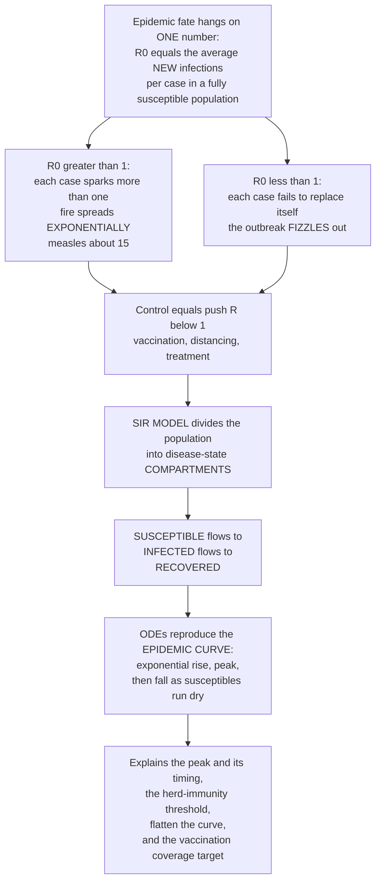

# 🦠 Epidemic Dynamics and Compartmental Models

> [!abstract] TL;DR
> An epidemic's entire fate hangs on **one magic number**: **R₀** (R-naught), the **basic reproduction number** — the average number of new people each infected person infects in a *fully susceptible* population. It is the **fuse** of an outbreak. If **R₀ > 1**, each case sparks more than one new case and the fire spreads exponentially (measles has an R₀ around 15, terrifyingly contagious); if **R₀ < 1**, each case fails to replace itself and the outbreak fizzles out. So *all* disease control reduces to one goal — pushing the effective reproduction number **R** below 1 (via vaccination, distancing, or treatment). To *predict* how epidemics unfold, epidemiologists use a beautifully simple idea: divide the population into **compartments** and track how people flow between them over time. The classic **SIR model** (Kermack–McKendrick, 1927) has three — **S**usceptible, **I**nfectious, **R**ecovered — and writing down the rates at which people flow S→I→R gives a system of ordinary differential equations that reproduces the whole **epidemic curve**: cases rising exponentially, peaking, then falling as the pool of susceptibles runs dry. This same tiny model explains the epidemic peak, why outbreaks end **before** everyone is infected, the **herd-immunity threshold** (1 − 1/R₀), how "flattening the curve" works, and what fraction you must vaccinate to stop spread — the mathematical engine behind the pandemic projections you saw on the news.

---

## Intuition

**Analogy — R₀ is the fuse, and the epidemic is a chain reaction.** Picture a room full of dominoes, each standing close enough to knock over some of its neighbours. Tip the first one. If every falling domino topples, on average, *more than one* other domino, the wave spreads and accelerates — the whole room goes down. If each falling domino topples, on average, *fewer than one* neighbour, the wave stutters and dies after a few tiles. That average number of neighbours each fall knocks over is exactly **R₀**, and the single threshold at **R₀ = 1** decides everything: above it, a self-sustaining chain reaction; below it, a fizzle. A measles case in an unvaccinated crowd knocks over ~15 dominoes; a flu case knocks over ~1–2. Vaccination, masks, and distancing all do the same thing — they **remove dominoes or widen the gaps**, dragging the effective R below 1 so the chain reaction cannot sustain itself.

Now, to *predict* the shape of the wave rather than just its yes/no fate, epidemiologists reach for a second idea that is almost embarrassingly simple. Divide everyone in the population into a handful of **buckets** by disease status — those who **can** catch it (Susceptible), those who **have** it and are spreading it (Infectious), and those who are done and immune (Recovered) — and just track how people **pour from one bucket to the next** over time. The rate S→I depends on how often the susceptible meet the infectious (transmission); the rate I→R depends on how fast people recover. Write those two rates down as equations and, without any further assumptions, out pops the characteristic **epidemic curve**: a slow smoulder, an exponential take-off, a peak, and then a decline that arrives *not* because you ran out of people but because you ran out of *susceptible* people — the fuel, not the population, is exhausted. A handful of compartments and a couple of rates capture the essential physics of contagion, and the same little engine tells you the peak, the herd-immunity threshold, why "flattening the curve" protects hospitals, and the vaccination coverage that stops an outbreak before it starts.

---

## How It Works

### Core mechanics — the reproduction number and the SIR flow

1. **R₀ sets the threshold.** The **basic reproduction number R₀** is the expected number of secondary cases produced by one typical case introduced into a **fully susceptible** population. It is built from three ingredients — how easily the pathogen transmits per contact, how many contacts an infectious person has per unit time, and how long they stay infectious. When **R₀ > 1** each case more than replaces itself and incidence grows; when **R₀ < 1** the chain decays. R₀ = 1 is the **epidemic threshold**, the knife-edge between explosion and extinction.

2. **Divide the population into compartments.** The **SIR model** partitions everyone into three mutually exclusive disease states — **S**usceptible (can be infected), **I**nfectious (infected and transmitting), **R**ecovered/removed (immune or dead, out of the game). Every individual is in exactly one bucket, and the buckets sum to the total population N.

3. **Write the flows as rates.** People flow **S → I** through contact between susceptibles and infectious individuals, and **I → R** as they recover. Two parameters govern the flows: **β** (the transmission rate — effective contacts per person per unit time) and **γ** (the recovery rate = 1 / infectious period). This yields the Kermack–McKendrick equations:

   - **dS/dt = − β · S · I / N** — susceptibles lost to infection (mass-action mixing: rate proportional to the *product* S·I).
   - **dI/dt = + β · S · I / N − γ · I** — infectious gained from S, lost to recovery.
   - **dR/dt = + γ · I** — the recovered accumulate.

4. **R₀ falls out of the parameters.** For SIR, **R₀ = β / γ** — transmissions per unit time multiplied by the average time spent infectious. This is the bridge between the *microscopic* rates and the *macroscopic* threshold.

5. **The epidemic burns until the fuel runs low.** As infection spreads, S shrinks, so the *effective* reproduction number **Rₜ = R₀ · S/N** falls. The epidemic **peaks exactly when Rₜ = 1** — that is, when the susceptible fraction has dropped to **S/N = 1/R₀**. After the peak, Rₜ < 1 and incidence declines. Crucially, the decline begins *before* everyone is infected: the outbreak ends with a residual pool of **never-infected survivors**, because once susceptibles fall below the threshold the chain can no longer sustain itself.

6. **The herd-immunity threshold.** Turning that peak condition around: if a fraction **1 − 1/R₀** of the population is already immune (by prior infection or **vaccination**), then Rₜ starts below 1 and an introduced case cannot ignite an epidemic at all. That fraction is the **herd-immunity threshold** — ~95% for measles (R₀≈15), ~50–67% for many influenza and early COVID variants — and it is the target every vaccination programme aims to clear.

### Flow / Architecture



*Read top to bottom: the single number R₀ decides whether an outbreak explodes or dies, so control is the act of dragging R below 1; the SIR model then pours the population through Susceptible→Infectious→Recovered compartments, and the resulting equations reproduce the entire epidemic curve — from which the peak, herd immunity, curve-flattening, and vaccination targets all follow.*

---

## Key Concepts

### Secondary (intuitive)

- **R₀ (R-naught)** = the average number of new people one sick person infects when everyone around them can still catch it. Bigger than 1 → the outbreak grows; smaller than 1 → it dies out. Measles ≈ 15, seasonal flu ≈ 1–2.
- **Compartments** = buckets for people by disease status. In the simplest model there are three: those who *can* catch it (**S**), those who *have* it (**I**), and those who are *done and immune* (**R**).
- **The epidemic curve** = the tell-tale shape of cases over time: a slow start, a steep climb, a peak, and a fall. The fall comes because the disease runs out of *susceptible* people to infect, not out of people.
- **Herd immunity** = once enough people are immune, an infected person meets too few susceptibles to keep the chain going, so the outbreak stops — protecting even the unvaccinated.
- **Flattening the curve** = slowing spread (masks, distancing, vaccines) so the *same* wave arrives lower and later, keeping the number sick at once below what hospitals can handle.

### Undergraduate (formal)

- **The SIR system.** Three coupled ODEs with total population N conserved (S+I+R=N): dS/dt = −βSI/N, dI/dt = βSI/N − γI, dR/dt = γI. Here **β** is the transmission rate and **γ = 1/(infectious period)** the recovery rate. The nonlinearity lives entirely in the **βSI/N** mass-action term — transmission needs a susceptible *and* an infectious to meet.
- **R₀ = β/γ, and the threshold theorem.** An introduced infection grows if and only if dI/dt > 0 at t=0, i.e. β·S(0)/N > γ. With S(0)≈N this is **R₀ = β/γ > 1** — the Kermack–McKendrick threshold. No epidemic occurs below it, however many cases you seed.
- **The effective reproduction number Rₜ (or Rₑ).** As susceptibles deplete, **Rₜ = R₀ · S/N**. The epidemic **peaks when Rₜ = 1**, i.e. S/N = 1/R₀. Interventions act by cutting β (contacts/transmissibility) or moving people to R (vaccination), both of which lower Rₜ. **Control means keeping Rₜ < 1.**
- **Herd-immunity threshold = 1 − 1/R₀.** The immune fraction at which Rₜ drops below 1 for an introduced case. Vaccination coverage must exceed this (adjusted for imperfect vaccine efficacy: required coverage = (1 − 1/R₀)/efficacy) to prevent outbreaks.
- **Final size and leftover survivors.** The epidemic ends with S(∞) > 0 — some people are *never* infected. The **final-size relation** ln(S(∞)/S(0)) = −R₀·(1 − S(∞)/N) has no closed-form solution but shows that a larger R₀ leaves fewer survivors (R₀=2.5 infects ~89%; R₀=15 infects >99.9%), yet never quite 100%.
- **R₀ across diseases.** Measles ≈ 12–18, pertussis ≈ 12–17, smallpox ≈ 5–7, early SARS-CoV-2 ≈ 2–3 (Omicron higher), pandemic influenza ≈ 1.5–2, Ebola ≈ 1.5–2.5, seasonal flu ≈ 1–1.5. Higher R₀ ⇒ higher herd-immunity threshold and a harder disease to eliminate.

### Graduate (mechanistic and systems)

- **Model extensions.** **SEIR** adds an **E**xposed/latent compartment (infected but not yet infectious) — essential when the incubation period is long relative to the infectious period, and it slows the initial growth rate for a given R₀. **SIS** (no lasting immunity) allows an **endemic equilibrium** rather than a one-shot epidemic — the model for many bacterial/STI dynamics. **SIRS** adds waning immunity. Adding **births and deaths (vital dynamics)** replenishes susceptibles, producing endemic persistence, damped oscillations toward equilibrium, and the concept of **critical community size** (the minimum population below which a disease like measles stochastically fades out between outbreaks).
- **R₀ as a spectral radius — the next-generation matrix.** In structured populations (age groups, spatial patches, multiple host types) R₀ is not β/γ but the **dominant eigenvalue of the next-generation matrix** K, whose entries Kᵢⱼ give the expected secondary infections in group i from one case in group j. This generalises the threshold to heterogeneous mixing and is the standard modern definition (Diekmann–Heesterbeek).
- **Heterogeneity, superspreading, and networks.** Homogeneous mixing is a fiction. Real contact networks are **heterogeneous** — a few hubs drive most transmission (the "20/80 rule"; **superspreading events**). On **scale-free networks** the epidemic threshold can *vanish*, so even low-R₀ pathogens spread. The dispersion parameter **k** captures individual variation in secondary cases; small k (heavy tails) means outbreaks are driven by rare superspreaders and are easier to stop by cutting large gatherings than by uniform measures. This is where compartmental models hand off to network and agent-based approaches.
- **Stochastic dynamics.** Deterministic ODEs describe *large* populations; near introduction, when case counts are small, **stochastic extinction** matters — an outbreak with R₀ > 1 still dies out with probability ~1/R₀ purely by chance. Branching-process and stochastic-SIR treatments capture this and the distribution of outbreak sizes.
- **Estimating R₀ and Rₜ in real time.** R₀ is inferred from the initial exponential growth rate r and the generation-interval distribution (the Euler–Lotka / Wallinga–Lipsitch relations), from final-size data, or from contact-tracing. **Rₜ** is tracked live during epidemics (Cori et al. renewal-equation methods) to judge whether control is working — the number governments quoted daily during COVID-19.
- **What the models do and their limits.** They forecast the **peak and its timing**, the **final size**, the effect of **flattening the curve** (protecting health-system capacity), and the **vaccination coverage** needed for elimination; they power **scenario analysis** for policy. But they inherit strong assumptions — **homogeneous mixing**, well-mixed compartments, constant parameters, and no behaviour change — and are only as good as their (often uncertain) parameter estimates. As nonlinear dynamical systems they are sensitive to those inputs, so honest modelling emphasises *scenarios and uncertainty*, not point predictions.

---

## Python Demo

```python
# Epidemic dynamics from the SIR compartmental model (Kermack-McKendrick, 1927).
#   dS/dt = -beta * S * I / N        (susceptibles infected by contact)
#   dI/dt =  beta * S * I / N - gamma * I   (infectious gained, then recover)
#   dR/dt =  gamma * I               (recovered / removed accumulate)
# beta = transmission rate, gamma = 1 / infectious period, and R0 = beta / gamma.
#
# (a) SIR SIMULATION & THE CURVE: integrate the ODEs and plot S, I, R over time.
#     Note the epidemic ENDS with susceptibles left over (survivors never infected),
#     and mark the herd-immunity threshold S/N = 1/R0 where the curve peaks.
# (b) FLATTEN THE CURVE: lowering beta (distancing / vaccination) shrinks and DELAYS
#     the peak. Pushing the effective R toward 1 keeps the peak under hospital
#     capacity; the herd-immunity threshold 1 - 1/R0 is the vaccination target.
import numpy as np
import matplotlib.pyplot as plt

N     = 1_000_000        # total population
gamma = 1.0 / 10.0       # recovery rate: ~10-day infectious period
I0    = 10.0             # seed infections
days, dt = 220, 0.1
steps = int(days / dt)
t = np.arange(steps) * dt

def sir(beta, N=N, gamma=gamma, I0=I0, steps=steps, dt=dt):
    """Integrate the SIR ODEs with 4th-order Runge-Kutta (numpy only)."""
    S = np.empty(steps); I = np.empty(steps); R = np.empty(steps)
    S[0], I[0], R[0] = N - I0, I0, 0.0
    def deriv(s, i):
        infect = beta * s * i / N
        return -infect, infect - gamma * i, gamma * i
    for k in range(steps - 1):
        a = deriv(S[k],                 I[k])
        b = deriv(S[k] + 0.5*dt*a[0],   I[k] + 0.5*dt*a[1])
        c = deriv(S[k] + 0.5*dt*b[0],   I[k] + 0.5*dt*b[1])
        d = deriv(S[k] + dt*c[0],       I[k] + dt*c[1])
        S[k+1] = S[k] + dt/6*(a[0] + 2*b[0] + 2*c[0] + d[0])
        I[k+1] = I[k] + dt/6*(a[1] + 2*b[1] + 2*c[1] + d[1])
        R[k+1] = R[k] + dt/6*(a[2] + 2*b[2] + 2*c[2] + d[2])
    return S, I, R

# ---------- (a) One epidemic, R0 = 2.5 ----------
R0 = 2.5
S, I, R = sir(beta=R0 * gamma)
final_infected = (1 - S[-1] / N) * 100      # fraction EVER infected
survivors      = S[-1] / N * 100            # never infected (leftover fuel)
herd_frac      = (1 - 1 / R0)               # herd-immunity threshold fraction
peak_day       = t[np.argmax(I)]

# ---------- (b) Flatten the curve: three transmission levels ----------
scenarios = [(3.0, "No control  R0 = 3.0", "#C0392B"),
             (1.8, "Some control  R = 1.8", "#E67E22"),
             (1.15, "Strong control  R = 1.15", "#27AE60")]
capacity = 0.04 * N                          # illustrative hospital capacity

fig, (ax1, ax2) = plt.subplots(1, 2, figsize=(14, 5.6))

# --- panel (a): anatomy of an epidemic (S, I, R) ---
ax1.plot(t, S / N * 100, color="#2980B9", lw=2.4, label="Susceptible")
ax1.plot(t, I / N * 100, color="#C0392B", lw=2.4, label="Infectious")
ax1.plot(t, R / N * 100, color="#27AE60", lw=2.4, label="Recovered")
ax1.axhline(1 / R0 * 100, color="#7F8C8D", ls=":", lw=1.6,
            label=f"Herd threshold S/N = 1/R0 = {100/R0:.0f} percent")
ax1.axvline(peak_day, color="#8E44AD", ls="--", lw=1.4)
ax1.annotate(f"survivors never infected: {survivors:.0f} percent",
             xy=(t[-1], survivors), xytext=(t[-1]*0.42, survivors + 12),
             arrowprops=dict(arrowstyle="->", color="#2980B9"), fontsize=9,
             color="#2980B9")
ax1.set_xlabel("Day"); ax1.set_ylabel("Percent of population")
ax1.set_title(f"(a) SIR epidemic curve  (R0 = {R0})")
ax1.legend(loc="center right", fontsize=8.5); ax1.grid(alpha=0.3)

# --- panel (b): flatten the curve by lowering beta ---
for R0s, label, col in scenarios:
    _, Is, _ = sir(beta=R0s * gamma)
    peak = Is.max() / N * 100
    ax2.plot(t, Is / N * 100, color=col, lw=2.4,
             label=f"{label}  (peak {peak:.1f} pct)")
ax2.axhline(capacity / N * 100, color="black", ls="--", lw=1.6,
            label="Health-system capacity")
ax2.set_xlabel("Day"); ax2.set_ylabel("Percent infectious at once")
ax2.set_title("(b) Flatten the curve: lower beta -> lower, later peak")
ax2.legend(loc="upper right", fontsize=8.5); ax2.grid(alpha=0.3)

plt.tight_layout(); plt.show()

# ---------- console summary ----------
print(f"R0 = {R0}:  epidemic peaks on day {peak_day:.0f}")
print(f"  ever infected     : {final_infected:5.1f} percent")
print(f"  never infected    : {survivors:5.1f} percent  (outbreak ends with fuel left)")
print(f"  herd-immunity thr : {herd_frac*100:5.1f} percent immune stops an outbreak")
print("\nVaccination target 1 - 1/R0 by disease:")
for name, r in [("Seasonal flu", 1.3), ("COVID (early)", 2.5),
                ("Smallpox", 6.0), ("Measles", 15.0)]:
    print(f"  {name:14s} R0 = {r:4.1f}  ->  vaccinate {(1-1/r)*100:4.0f} percent")
```

**What you see.** *Panel (a)* is the anatomy of an epidemic: the **Susceptible** curve slides downward, the **Infectious** curve rises exponentially, peaks, and falls, and the **Recovered** curve climbs to a plateau. The peak occurs exactly where the susceptible fraction crosses the dotted **1/R₀** line — the moment Rₜ = 1 — and after that the wave declines even though a visible slab of the population (the blue survivors, ~11% for R₀=2.5) is **never infected**: the epidemic ran out of *fuel*, not people. *Panel (b)* is the public-health thesis. The three curves share identical biology except for β; lowering transmission (distancing, masks, vaccination) makes the peak **lower and later** — "flattening the curve" — so that under strong control the number sick at once slips beneath the health-system capacity line. The console prints the **herd-immunity / vaccination targets** (1 − 1/R₀): ~23% for seasonal flu but ~93% for measles, which is precisely why measles demands near-universal vaccination while milder pathogens tolerate leakier coverage.

---

## Real-World Applications

- **COVID-19 pandemic projections and policy.** The Imperial College and IHME models, and the "flatten the curve" graphic that defined 2020, were compartmental (SEIR-family) models. Governments tracked the **effective reproduction number Rₜ** daily and calibrated lockdowns, school closures, and reopening to keep Rₜ < 1 and peak demand below ICU capacity — a real-time application of the exact mechanics above.
- **Measles elimination and vaccination targets.** Because measles has R₀ ≈ 12–18, its herd-immunity threshold is ~92–95%, which is why the WHO sets two-dose MMR coverage targets in the mid-90s and why small dips in coverage reignite outbreaks. The threshold formula 1 − 1/R₀ directly sets national immunization goals.
- **Smallpox eradication.** With a moderate R₀ (~5–7) and a highly effective vaccine, smallpox was eliminable by **ring vaccination** — vaccinating contacts around each case to drive local Rₜ below 1 — the strategy that achieved the only human-disease eradication (1980).
- **Seasonal influenza and vaccine planning.** SIR/SEIR models with age structure forecast seasonal peaks, size the annual vaccine campaign, and evaluate school-closure timing. The low R₀ (~1.3) explains why partial coverage still meaningfully blunts flu seasons.
- **Ebola and outbreak response.** During the 2014–16 West Africa epidemic, real-time R₀/Rₜ estimation from case data guided the scale of the response and showed when safe-burial and contact-tracing interventions had pushed Rₜ below 1.
- **HIV, TB, and endemic-disease control.** SIS and models with vital dynamics describe diseases that reach **endemic equilibrium** rather than burning out, informing long-run treatment-as-prevention strategies where lowering onward transmission (β) is the lever.

---

## Common Pitfalls

- **Treating R₀ as a fixed property of the pathogen.** R₀ blends transmissibility, **contact rate**, and infectious duration — so it depends on the *population and setting*, not the microbe alone. The same virus has different R₀ in a crowded city and a sparse village. Quoting a single universal R₀ hides this context-dependence.
- **Confusing R₀ with Rₜ.** R₀ assumes a *fully susceptible* population; the moment infection or vaccination begins, the relevant quantity is the **effective** Rₜ = R₀·S/N. Control never has to reduce the intrinsic R₀ — only to keep Rₜ below 1. Saying "R₀ dropped after lockdown" is a category error; it was Rₜ.
- **Assuming the epidemic infects everyone.** A common misread of the curve. The outbreak turns over at S/N = 1/R₀ and ends with **survivors left uninfected** (the final-size relation). Planning for 100% attack rates overstates burden, sometimes badly.
- **Trusting homogeneous mixing.** The βSI/N mass-action term assumes everyone contacts everyone equally. Real transmission is dominated by **superspreaders and network hubs**, so uniform models can misjudge both the growth rate and which interventions work (cutting large gatherings vs. uniform distancing). Heterogeneity also means herd-immunity thresholds computed from a single R₀ can be off.
- **Reading deterministic curves near t = 0.** When case counts are tiny, chance dominates: an outbreak with R₀ > 1 still goes extinct with probability ~1/R₀. Deterministic ODEs cannot capture this early stochasticity, so "the model says it will take off" is only probabilistic at introduction.
- **Ignoring behaviour change and parameter uncertainty.** People react to epidemics (voluntarily reducing contacts), which endogenously lowers β — so naive projections that hold parameters fixed overshoot. Compartmental forecasts are **scenario tools under uncertainty**, not deterministic prophecies; presenting a single point projection as a prediction is the classic modelling sin.

---

## Related Concepts

**Within this vault (Section 04 – Infectious-Disease Epidemiology).** This note is the quantitative engine of the section and its ideas thread through its companions. *Infectious Disease Epidemiology* frames transmission, agents, hosts, and the chain of infection that R₀ summarizes numerically. *Vaccination, Herd Immunity and Elimination* is the direct policy face of the herd-immunity threshold (1 − 1/R₀) and the vaccination-coverage arithmetic derived here. *Pandemics and Emerging Infections* applies these dynamics to novel pathogens where R₀ must be estimated in real time from early growth. *Surveillance and Disease Monitoring* supplies the case data from which R₀, Rₜ, and the epidemic curve are actually measured, while *Outbreak Investigation* uses the epidemic curve and reproduction number operationally to detect sources and judge whether control is working. These are prose references to sibling notes in this section.

**Across the vault (Glob-verified links).**

- [[Systems_Thinking_and_Complexity/03_Networks_and_Connectivity/Network_Dynamics_and_Contagion|Network Dynamics and Contagion]] — the complexity-science treatment of the very same SIR/SIS models running on real contact networks, where hubs and scale-free topology make the epidemic threshold vanish.
- [[Mathematics/07_Differential_Equations/Systems_of_ODEs|Systems of ODEs]] — the mathematical home of the coupled S/I/R differential equations; the SIR model is a canonical nonlinear system of ODEs.
- [[Systems_Thinking_and_Complexity/04_Dynamics_and_Modeling/Dynamical_Systems_and_Attractors|Dynamical Systems and Attractors]] — the SIR model as a nonlinear dynamical system, whose endemic equilibrium (with vital dynamics) is a fixed-point attractor and whose threshold at R₀=1 is a transcritical bifurcation.
- [[Systems_Thinking_and_Complexity/02_Complexity_and_Emergence/Nonlinearity_and_Feedback|Nonlinearity and Feedback]] — the exponential-growth and saturation feedback that drives the epidemic curve: infection is a reinforcing loop until susceptible depletion turns it into a balancing one.
- [[Computational_Social_Science/02_Social_Network_Analysis/Contagion_and_Diffusion_in_Social_Networks|Contagion and Diffusion in Social Networks]] — the social-science counterpart, where the same threshold logic governs the spread of behaviours and information, and simple-vs-complex contagion refines the mass-action picture.

---

## Review Questions

**Secondary.** Measles has an R₀ of about 15, while seasonal flu has an R₀ of about 1.5. Using the "chain reaction of dominoes" idea, explain what R₀ means and why measles is so much more explosive. Then, looking at a picture of the epidemic curve, explain in plain words why the outbreak starts to fall *before* everyone in the population has been infected.

**Undergraduate.** Write down the three SIR differential equations and identify β, γ, and R₀ = β/γ. Show algebraically that an introduced infection grows only when R₀ > 1, and derive the condition (in terms of the susceptible fraction) at which the number of infectious people peaks. From that, explain where the herd-immunity threshold 1 − 1/R₀ comes from, and compute the vaccination coverage needed to prevent outbreaks of a disease with R₀ = 4 (assume a perfect vaccine).

**Graduate.** A public-health agency reports that after interventions "R has fallen from 2.6 to 0.8." (a) Distinguish carefully between R₀ and the effective Rₜ, and explain which one the interventions actually changed and by what two mechanisms. (b) The homogeneous-mixing SIR model predicts a herd-immunity threshold of 1 − 1/R₀, yet the observed outbreak turned over at a lower susceptible-depletion level. Give two reasons rooted in **contact heterogeneity / superspreading** and explain how a next-generation-matrix or network formulation would change the threshold. (c) Explain why, near the moment of introduction, a deterministic ODE model is the wrong tool, and what a stochastic model tells you that the ODE cannot.

---

## Sources

- Kermack, W. O., & McKendrick, A. G. (1927). *A contribution to the mathematical theory of epidemics.* Proceedings of the Royal Society A, 115(772), 700–721 — the founding paper of compartmental epidemic theory and the threshold result.
- Anderson, R. M., & May, R. M. (1991). *Infectious Diseases of Humans: Dynamics and Control.* Oxford University Press — the definitive treatment of R₀, herd immunity, and control.
- Keeling, M. J., & Rohani, P. (2008). *Modeling Infectious Diseases in Humans and Animals.* Princeton University Press — modern compartmental, stochastic, network, and spatial models with code.
- Hethcote, H. W. (2000). *The Mathematics of Infectious Diseases.* SIAM Review, 42(4), 599–653 — a comprehensive survey of SIR/SEIR/SIS models, thresholds, and endemic dynamics.
- Vynnycky, E., & White, R. G. (2010). *An Introduction to Infectious Disease Modelling.* Oxford University Press — a practical, worked introduction to building and fitting these models.

---

#epidemiology #SIR-model #reproduction-number #epidemic-dynamics #compartmental-models
