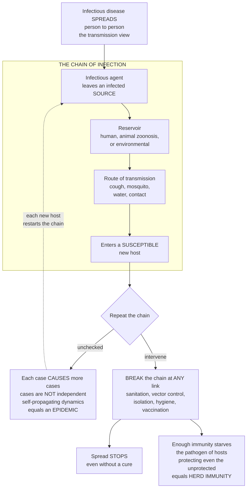

# 🦠 Infectious Disease Epidemiology

> [!abstract] TL;DR
> **Infectious diseases are unique among health threats because they *spread* — one person's illness becomes another's — so studying them means studying *transmission between people*, not just what happens inside one body.** Epidemiologists picture spread as a **chain of infection**: a pathogen leaves an infected **source** (a *reservoir*), travels by some **route of transmission** (a cough, a mosquito, contaminated water, a handshake), and enters a **susceptible** new host — repeat, and you have an **epidemic**. The framework's power is that you can **break the chain at any link** to stop spread *even without a cure* — kill the mosquitoes, wash your hands, isolate the sick, purify the water, or vaccinate the susceptible — which is why sanitation and prevention conquered many infectious diseases long before drugs existed. The feature that separates infectious-disease epidemiology from **chronic-disease** epidemiology is that **cases are *not* independent**: each infection can *cause* more infections, so the disease has its own explosive, **self-propagating dynamics** (an outbreak can grow *exponentially*). And there is a collective payoff — because infection travels person-to-person, protecting *enough* individuals through immunity also protects the unprotected by **starving the pathogen of hosts** (*herd immunity*). This opener frames the whole section: epidemic dynamics and **R₀**, outbreak investigation, surveillance, vaccination and elimination, and pandemics — the population/transmission view that complements the clinical picture of infection.

---

## Intuition

**Analogy — a fire spreading through a dry forest, not a rock rolling downhill.** Most health problems are like a rock: a heart attack or a cancer happens *inside one person* and stays there — your neighbour's clogged artery cannot clog yours. Infectious disease is a **fire**. A single burning tree throws sparks; each spark that lands on a dry tree starts a *new* fire that throws *more* sparks. The blaze does not just sit and burn — it **propagates**, and because every burning tree can ignite several others, a forest can go from one ember to an inferno with terrifying speed. That is the whole difference: with a rock, counting cases means counting independent events; with a fire, **each case is also a *cause*** of future cases, so the numbers can *explode*.

Now think like a firefighter. You do not need a magic potion that "cures" fire to stop it — you need to **break the chain of ignition**. You can cut a firebreak so sparks have nowhere to land (isolation, quarantine), soak the fuel so it will not catch (vaccination makes trees "wet" and unlightable), remove the sparks at the source (treating and isolating the sick), or block the wind that carries embers (clean water, vector control, hand hygiene). This is exactly how public health thinks about the **chain of infection** — pathogen leaves a source, travels a route, reaches a susceptible host — and why breaking *any single link* halts the outbreak. It is also why "wet enough trees" protects even the *dry* ones: once too few flammable trees remain, a spark fizzles before it can spread. That collective firebreak, built out of individual immunity, is **herd immunity** — and understanding it, along with transmission and the chain of infection, is the foundation of controlling outbreaks, designing vaccination programs, and fighting pandemics.

---

## How It Works

### Core mechanics

**1. Why cases are *dependent* — the defining feature.** In chronic-disease epidemiology (heart disease, diabetes, cancer) each new case is essentially an *independent* draw: your diagnosis does not raise your neighbour's risk. Infectious disease breaks that assumption. **Each case can generate further cases**, so incidence is a *function of how many cases already exist*. This one fact — dependence — gives infectious diseases their own **dynamics**: exponential early growth, epidemic peaks, and eventual burnout or **extinction** as susceptibles run out. Everything else in the section flows from it.

**2. The chain of infection — the core framework.** Spread is a *sequence* of six links, and transmission fails if any link is broken:
- **Infectious agent** — the pathogen itself (virus, bacterium, fungus, parasite; see the clinical host-pathogen note).
- **Reservoir** — where the agent lives and multiplies: **human** (cases and carriers), **animal** (*zoonoses* — rabies, plague, most emerging viruses), or **environmental** (*Legionella* in water, tetanus in soil).
- **Portal of exit** — how it leaves the source (respiratory secretions, feces, blood, skin lesions).
- **Mode of transmission** — the route between hosts. **Direct**: person-to-person **contact** (touch, sexual) or short-range **droplet** spray. **Indirect**: **airborne** (tiny aerosols lingering in air — measles, TB), **vehicle-borne** (contaminated **food, water, or fomites** — objects/surfaces), or **vector-borne** (a living carrier such as a **mosquito** or **tick** — malaria, dengue, Lyme).
- **Portal of entry** — how it gets into the next host (inhalation, ingestion, mucous membranes, broken skin, a bite).
- **Susceptible host** — a person lacking immunity, whose susceptibility depends on age, immune status, nutrition, and prior vaccination.

**3. Control by breaking a link.** Because the chain is sequential, you attack the *weakest, cheapest* link, not necessarily the pathogen: **sanitation and clean water** (cut vehicle-borne spread — cholera, typhoid), **vector control** (nets, spraying — malaria), **isolation and quarantine** (cut contact/droplet), **hand hygiene and food safety** (cut fomite/vehicle routes), and **vaccination** (remove susceptible hosts). Historically these levers eradicated or crushed disease *before* any cure existed — John Snow removing the Broad Street pump handle, chlorinated water, mosquito eradication, smallpox vaccination.

**4. The infectious-process timeline and its metrics.** Transmission plays out on a clock that differs subtly from the clinical course:
- **Incubation period** — exposure → *symptoms* (what a clinician sees).
- **Latent period** — exposure → *becoming infectious* (what an epidemiologist cares about); it can be *shorter* than incubation, meaning people spread disease **before they feel sick** (pre-symptomatic transmission).
- **Infectious period** — the window during which a host can transmit.
- **Generation interval / serial interval** — the time between *one case's infection (or symptom onset)* and *the cases it produces*; this sets how fast an epidemic ticks forward.

**5. Transmissibility and the reproduction number.** How well a pathogen spreads is captured by the **secondary attack rate** (fraction of exposed contacts who become infected) and, above all, the **basic reproduction number R₀** — the average number of new cases one case produces in a *fully susceptible* population. **R₀ > 1 → the fire grows; R₀ < 1 → it dies out.** Interventions work by pushing the *effective* reproduction number below 1. R₀ also sets the **herd-immunity threshold** ≈ 1 − 1/R₀ (detailed in the epidemic-dynamics and vaccination notes).

**6. Patterns, carriers, and the triad.** Disease occurrence is classified as **endemic** (steady baseline), **epidemic/outbreak** (excess above baseline), or **pandemic** (an epidemic across countries/continents). The **epidemic curve** (cases over time) reveals the mechanism: a sharp single peak marks a **point-source** outbreak (one common exposure — a bad meal), while a series of rising waves marks a **propagated** outbreak (person-to-person spread over generations). **Carriers** — infected people with no symptoms (asymptomatic or pre-symptomatic) — are engines of hidden spread ("Typhoid Mary"). Underlying it all is the **epidemiologic triad**: disease emerges from the interaction of **agent**, **host**, and **environment** — change any vertex and the outbreak changes.

### Flow / architecture



---

## Key Concepts

### Secondary (intuitive foundation)
- **Contagion / transmission** — infectious disease is one that can pass *from person to person* (or from animal, water, or insect to person); this is what makes it different from a disease like cancer.
- **Chain of infection** — a **germ** leaves a **sick source**, travels by a **route** (coughing, dirty water, a mosquito bite, touching), and infects a **new person**; break any link and the germ stops.
- **Epidemic vs endemic** — *endemic* means always present at a steady low level; an *epidemic* (outbreak) is an unusual surge in cases.
- **Herd immunity (starter idea)** — if most people are immune (usually by **vaccination**), a germ runs out of people to infect, which shields the few who are not immune.
- **Prevention without a cure** — clean water, hand-washing, mosquito nets, and isolating the sick stopped many diseases *before* medicines existed.

### Undergraduate (mechanisms and metrics)
- **Reservoir and zoonoses** — the environment/animal/human niche where a pathogen persists; **zoonotic** spillover from animals seeds most new human diseases.
- **Modes of transmission** — **direct** (contact, droplet) vs **indirect** (airborne aerosol, vehicle-borne via food/water/fomites, vector-borne via arthropods); each mode implies a different control lever.
- **Incubation vs latent period** — symptoms vs infectiousness; a latent period *shorter* than incubation enables **pre-symptomatic** spread.
- **Generation and serial interval** — the tempo of transmission between successive cases; drives how fast incidence doubles.
- **Basic reproduction number R₀** — average secondary cases per case in a fully susceptible population; **R₀ > 1** sustains an epidemic, **R₀ < 1** extinguishes it (see epidemic-dynamics note).
- **Secondary attack rate** — proportion of susceptible contacts who become infected after exposure; a field measure of transmissibility.
- **Epidemic curve — point-source vs propagated** — the shape of cases-over-time diagnoses the mechanism and estimates exposure timing.
- **Carriers and asymptomatic transmission** — infected-but-well individuals sustaining hidden chains.

### Graduate (systems and control)
- **Herd-immunity threshold ≈ 1 − 1/R₀** — the immune fraction at which the effective reproduction number crosses 1 and transmission collapses; the target of vaccination programs and the basis of **elimination/eradication** (see vaccination note).
- **Effective reproduction number Rₜ / Rₑ** — R₀ discounted by remaining susceptibility and interventions; the real-time control target during an outbreak.
- **Superspreading and overdispersion** — transmission is heavy-tailed: a few cases (or events) cause most secondary infections, so the *dispersion* of R matters as much as its mean for control (backward contact tracing, event bans).
- **Force of infection and compartmental structure** — the rate at which susceptibles become infected; formalized in **SIR/SEIR** models (see epidemic-dynamics-and-compartmental-models note).
- **Epidemiologic triad and drivers of emergence** — agent–host–environment interplay, plus ecological, demographic, and behavioural drivers (urbanization, travel, land-use change, antimicrobial resistance) that produce **emerging and re-emerging** infections.
- **Surveillance-to-response cycle** — detection (surveillance), characterization (outbreak investigation), and intervention (contact tracing, prophylaxis, vaccination) as a closed control loop over transmission dynamics.

---

## Python Demo

```python
# Infectious Disease Epidemiology, two ideas visualized:
#   (a) WHY CASES ARE NOT INDEPENDENT -> self-propagating (exponential) growth.
#       A simple generation/branching model: each case infects R others next
#       generation. Compare an uncontrolled epidemic (R0 = 2), a chain we BREAK
#       partway (R drops below 1 after an intervention), and a CHRONIC disease
#       where cases are INDEPENDENT (constant incidence, no chain).
#   (b) THE CHAIN OF INFECTION schematic with the intervention point at each link.
import numpy as np
import matplotlib.pyplot as plt

# ---------- (a) generation / branching model of transmission ----------
generations = np.arange(0, 9)          # successive transmission generations
seed = 1.0                             # start from a single introduced case

# Uncontrolled infectious spread: each case -> R0 new cases (exponential).
R0 = 2.0
uncontrolled = seed * R0 ** generations

# Break the chain at generation 3 (isolation / vaccination drops R to 0.7).
controlled = [seed]
R_series = [2.0, 2.0, 2.0, 0.7, 0.7, 0.7, 0.7, 0.7, 0.7]  # intervention at gen 3
for g in range(1, len(generations)):
    controlled.append(controlled[-1] * R_series[g])
controlled = np.array(controlled)

# Chronic disease: cases are INDEPENDENT -> roughly constant new incidence,
# no case causes another, so no exponential blow-up.
chronic = np.full_like(generations, 8, dtype=float)

fig, (ax1, ax2) = plt.subplots(1, 2, figsize=(15, 6))

ax1.plot(generations, uncontrolled, "o-", color="crimson", lw=2.5,
         label=f"Infectious, uncontrolled (R0={R0}) -> exponential")
ax1.plot(generations, controlled, "s-", color="steelblue", lw=2.5,
         label="Infectious, chain BROKEN at gen 3 (R -> 0.7)")
ax1.plot(generations, chronic, "^--", color="gray", lw=2.0,
         label="Chronic disease: cases INDEPENDENT (flat)")
ax1.axvline(3, color="green", ls=":", lw=1.8)
ax1.text(3.05, uncontrolled.max() * 0.55, "intervention\nbreaks the chain",
         color="green", fontsize=9)
ax1.set_xlabel("Transmission generation")
ax1.set_ylabel("New cases in generation")
ax1.set_title("(a) Cases are NOT independent -> self-propagating dynamics")
ax1.legend(fontsize=8, loc="upper left")
ax1.grid(alpha=0.3)

# ---------- (b) chain of infection schematic with intervention points ----------
ax2.set_xlim(0, 10); ax2.set_ylim(0, 10); ax2.axis("off")
ax2.set_title("(b) The chain of infection (break ANY link to stop spread)")

links = ["Infectious\nAGENT", "RESERVOIR\n(human/animal/\nenviron.)",
         "PORTAL\nOF EXIT", "MODE OF\nTRANSMISSION", "PORTAL\nOF ENTRY",
         "SUSCEPTIBLE\nHOST"]
controls = ["treat /\nantimicrobials", "sanitation /\nvector control",
            "cover cough /\nwound care", "isolation /\nclean water", "hygiene /\nmasks",
            "VACCINATION /\nprophylaxis"]

y = 6.5
xs = np.linspace(1.0, 9.0, len(links))
for i, (x, link, ctrl) in enumerate(zip(xs, links, controls)):
    ax2.add_patch(plt.Rectangle((x - 0.62, y - 0.7), 1.24, 1.4,
                                facecolor="#ffd9b3", edgecolor="black", lw=1.3))
    ax2.text(x, y, link, ha="center", va="center", fontsize=7.5, weight="bold")
    if i < len(links) - 1:
        ax2.annotate("", xy=(xs[i + 1] - 0.7, y), xytext=(x + 0.7, y),
                     arrowprops=dict(arrowstyle="-|>", color="crimson", lw=2))
    # intervention point below each link (scissors = break the chain)
    ax2.annotate(ctrl, xy=(x, y - 0.75), xytext=(x, y - 2.6),
                 ha="center", va="center", fontsize=6.5, color="darkgreen",
                 arrowprops=dict(arrowstyle="-|>", color="darkgreen", lw=1.4))
ax2.text(5.0, 2.0, "Break ANY link -> transmission fails, even without a cure",
         ha="center", fontsize=9, style="italic", color="darkgreen")
ax2.text(5.0, 9.2, "The last link loops back: a new host becomes the next source",
         ha="center", fontsize=8, color="crimson")
ax2.annotate("", xy=(xs[0], y + 0.9), xytext=(xs[-1], y + 0.9),
             arrowprops=dict(arrowstyle="-|>", color="crimson", lw=1.6,
                             connectionstyle="arc3,rad=-0.25"))

plt.tight_layout()
plt.savefig("infectious_disease_epidemiology.png", dpi=130, bbox_inches="tight")
plt.show()

# Numeric takeaways
print(f"Uncontrolled cases by generation 8 : {uncontrolled[-1]:.0f}")
print(f"Chain-broken cases by generation 8 : {controlled[-1]:.2f}")
print(f"Herd-immunity threshold for R0={R0}: {1 - 1/R0:.0%} of the population")
```

**What it shows.** Panel (a) makes the defining feature visible: when cases *cause* cases (R₀ = 2), incidence **doubles every generation** — an exponential fire — while an equally common *chronic* disease with independent cases stays flat; **breaking the chain** at generation 3 (pushing R below 1) bends the infectious curve back down. Panel (b) lays out the six-link chain of infection with the **control lever at every link**, dramatizing why you can stop an outbreak — through sanitation, isolation, hygiene, or vaccination — without ever curing the disease.

---

## Real-World Applications

- **Cholera and the birth of the field (John Snow, 1854).** Snow mapped cholera deaths to the Broad Street water pump and had the handle removed — **breaking the vehicle-borne link (contaminated water)** with no knowledge of the bacterium. The template for modern water-and-sanitation public health.
- **Smallpox eradication (WHO, 1967–1980).** Rather than vaccinate everyone, the campaign used **surveillance and ring vaccination** — find each case, vaccinate its contacts, and starve the chain locally. The only human disease ever eradicated, proving the chain-of-infection logic at planetary scale.
- **Malaria control.** No vaccine drove the historic gains; **vector control** — insecticide-treated bed nets and indoor spraying — attacks the *transmission* link (the *Anopheles* mosquito), cutting cases massively in endemic regions.
- **COVID-19 pandemic.** Real-time estimation of **Rₜ**, quantification of **pre-symptomatic and superspreading** transmission, and non-pharmaceutical interventions (isolation, distancing, masks) followed by mass vaccination were textbook applications of transmission dynamics, R₀/Rₜ, and herd-immunity reasoning.
- **Routine childhood immunization.** Measles has an R₀ of 12–18, demanding **~92–95% coverage** to reach the herd-immunity threshold (1 − 1/R₀); the arithmetic of R₀ directly sets national vaccination targets and explains why coverage dips trigger outbreaks.
- **Hospital infection control.** Hand hygiene, isolation of colonized patients, and sterilization break **contact and fomite** links against healthcare-associated infections and drug-resistant organisms.

---

## Common Pitfalls

- **Treating cases as independent (importing chronic-disease intuition).** The cardinal error: modeling infectious counts with methods that assume independent observations. Because each case *generates* others, risk is **dynamic and feedback-driven** — yesterday's cases raise today's — so ordinary risk-factor thinking underestimates both explosive growth and the leverage of small interventions.
- **Confusing incubation with latent period.** Assuming people are only infectious once *symptomatic* misses **pre-symptomatic and asymptomatic transmission**, which silently sustains outbreaks (a latent period shorter than incubation) and defeats symptom-based screening at borders and clinics.
- **Reading R₀ as a fixed property of the pathogen.** R₀ is context-dependent — it varies with contact rates, density, climate, and behaviour — and is *not* the same as the real-time **Rₜ**. Quoting a single R₀ across settings, or forgetting that interventions act on Rₜ, leads to bad forecasts.
- **Ignoring overdispersion and superspreading.** Averages hide that a minority of cases cause most transmission. Policies tuned to the *mean* R miss the outsized payoff of targeting **superspreading events** and the value of **backward** contact tracing.
- **Assuming a cure or treatment ends transmission.** Clinical recovery of individuals does not equal control of spread; carriers, reservoirs (especially **animal/zoonotic** ones), and environmental persistence can keep the chain intact even when patients get better.
- **Misreading the epidemic curve.** Mistaking a **propagated** (person-to-person) outbreak for a **point-source** one — or vice versa — sends investigators chasing the wrong exposure and the wrong control strategy.

---

## Related Concepts

This is the **section opener** for **04 · Infectious Disease Epidemiology**. The notes that follow build directly on the transmission framework introduced here. **Epidemic Dynamics and Compartmental Models** formalizes the exponential dynamics and R₀ into SIR/SEIR mathematics; **Outbreak Investigation** operationalizes the epidemic curve and chain-of-infection into field steps (define, describe, hypothesize, intervene); **Surveillance and Disease Monitoring** covers the detection systems that catch transmission early; **Vaccination, Herd Immunity and Elimination** develops the herd-immunity threshold and eradication logic previewed above; and **Pandemics and Emerging Infections** applies all of it to zoonotic spillover and global spread. (These siblings are referenced in prose; wikilinks below point only to Glob-verified notes elsewhere in the vault.)

- [[Clinical_Medicine/05_Immune_Infectious_and_Hematologic/Infectious_Disease_and_Host_Pathogen_Interaction|Infectious Disease and Host-Pathogen Interaction]] — the **clinical/within-host** counterpart: what happens *inside one patient*, which this note complements with the *between-host, population* view.
- [[Clinical_Medicine/02_Cardiovascular_and_Respiratory_Disease/Pulmonary_Infections_and_Respiratory_Failure|Pulmonary Infections and Respiratory Failure]] — the respiratory infections (influenza, pneumonia, TB, COVID-19) whose **droplet/airborne** routes dominate epidemic transmission.
- [[Biology/11_Microbiology_and_Immunology/Viruses|Viruses]] — the biology of the **infectious agent** at the top of the chain of infection.
- [[Biology/11_Microbiology_and_Immunology/Vaccines_and_Antibiotics|Vaccines and Antibiotics]] — the tools that break the chain at the **susceptible host** and **agent** links.
- [[Health_Nutrition_and_Longevity/06_Public_Health_and_Prevention/Infectious_Disease_Vaccines_and_Immunity|Infectious Disease, Vaccines and Immunity]] — the public-health/prevention perspective on immunity and vaccination programs.
- [[Systems_Thinking_and_Complexity/03_Networks_and_Connectivity/Network_Dynamics_and_Contagion|Network Dynamics and Contagion]] — transmission as **spreading on a contact network**, generalizing the chain of infection to complex systems.

---

## Review Questions

1. **(Secondary)** Explain, using the chain of infection, three *different* ways you could stop a waterborne disease like cholera from spreading — none of which involves curing the sick.
2. **(Secondary/Undergraduate)** Why can an infectious disease grow *exponentially* while a chronic disease like diabetes does not? Frame your answer around whether cases are "independent."
3. **(Undergraduate)** Distinguish the **incubation period** from the **latent period**. How can a latent period *shorter* than the incubation period undermine a screening program that quarantines only people with symptoms?
4. **(Undergraduate)** A pathogen has R₀ = 5. What fraction of the population must be immune to reach the herd-immunity threshold, and what does crossing that threshold do to the effective reproduction number?
5. **(Undergraduate/Graduate)** You are handed an epidemic curve with a single sharp peak. Is this more consistent with a point-source or a propagated outbreak, and what does that tell you about where to look for the cause?
6. **(Graduate)** Two diseases share an average R of 2, but one is highly *overdispersed* (a few superspreaders) and the other spreads uniformly. How should this difference change your control strategy, and why does the mean R alone mislead you?
7. **(Graduate)** Using the epidemiologic triad (agent–host–environment) and the concept of a reservoir, explain why zoonotic diseases are so difficult to eliminate even when human cases can be effectively treated.

---

## Sources

- Gordis, L. (Celentano & Szklo, eds.). *Epidemiology* — chapters on Infectious Disease Epidemiology, the natural history of disease, and transmission.
- Giesecke, J. *Modern Infectious Disease Epidemiology* — reproduction numbers, transmission dynamics, and outbreak analysis.
- CDC. *Principles of Epidemiology in Public Health Practice (Self-Study Course SS1978)* — "Chain of Infection," modes of transmission, and epidemic curves.
- Nelson, K. E. & Williams, C. M. *Infectious Disease Epidemiology: Theory and Practice* — surveillance, outbreak investigation, and control.
- Anderson, R. M. & May, R. M. *Infectious Diseases of Humans: Dynamics and Control* — mathematical foundations of R₀, herd immunity, and transmission thresholds.

---

#epidemiology #infectious-disease #chain-of-infection #transmission #outbreaks
