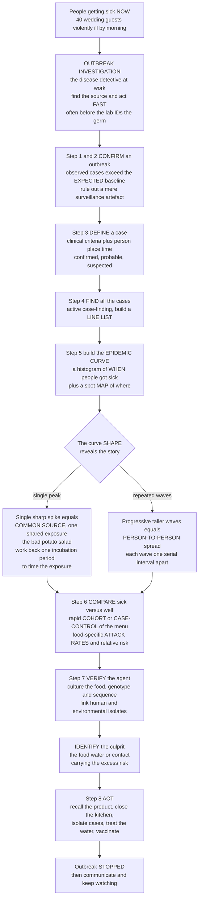

# 🕵️ Outbreak Investigation

> [!abstract] TL;DR
> An **outbreak investigation** is epidemiology at its most urgent and tangible: people are getting sick **now**, and you have to find the source and stop it **fast** — often before the lab even identifies the germ. This is the "**disease detective**" work of the CDC's Epidemic Intelligence Service, sometimes called **shoe-leather epidemiology**. The method is a systematic recipe run at speed: **confirm** an outbreak really exists (more cases than *expected*, not just a surveillance artefact); write a **case definition** (what counts as "a case," by person/place/time); **find all the cases** and build a **line list**; then reach for the detective's key tool — the **epidemic curve**, a histogram of *when* people got sick, whose **shape tells the story**. A single sharp spike that rises and falls within one incubation period means a **point (common) source** — everyone ate the same bad potato salad — and lets you *work back one incubation period* to pin the exposure time; a series of progressively taller waves means **person-to-person (propagated)** spread. Next you **compare the sick to the well**: a rapid **cohort** (a defined group like the wedding guests → food-specific **attack rates**) or **case-control** study (the wider community → odds ratios) to see which exposure carries the excess risk — the culprit food stands out. Confirm with **environmental/lab** work (cultures, whole-genome sequencing linking cases), then **act** — recall the product, close the kitchen, isolate cases, treat the water — and the outbreak **stops**. The whole epidemiologic toolkit, deployed against the clock to save lives. *Educational content, not individual medical or public-health advice.*

---

## Intuition

**Analogy first — the detective racing the clock.** Picture a wedding: the reception was lovely, and by the next afternoon the phone starts ringing — forty guests are violently ill. You are the epidemiologist, and you are effectively a homicide detective who has arrived while the crime is still happening. You cannot wait months for certainty; more people may be poisoned tonight. So you work the case the way any good detective does — you answer **who, what, when, where, and why**, fast, from whatever evidence is at hand, often *before* the forensic lab tells you which organism did it. That race-against-the-clock, evidence-first, act-before-you-are-certain posture is the whole soul of an outbreak investigation, and it is exactly what the CDC's "disease detectives" of the Epidemic Intelligence Service are trained to do.

The detective work follows a recipe. First, **is there even a crime?** — you confirm the illnesses are more than the background you would *expect* (a cluster can be an illusion created by a new doctor who simply *reports* more). Then you decide **what counts as a victim** — a crisp case definition — and go **round up every case** you can find, writing each into a line list of who fell ill and when. Now the detective's single most powerful instrument: you draw the **epidemic curve**, a simple bar chart of *when* people got sick — and its **shape confesses the plot**. One sudden spike that rises and falls inside a single incubation period screams **one shared meal** (a common source), and by counting backward one incubation period from the peak you can even name the *hour of exposure*. A staircase of ever-taller waves, each a fixed interval apart, betrays a different story: the disease is **jumping person to person**. Finally, the classic move — **compare the sick with the well**. What did the ill guests eat or do that the healthy ones didn't? You run a rapid study of the menu, computing which food carries the highest risk, and the culprit — the potato salad left in the sun — leaps off the page. Name the vehicle, and you can act: recall it, close the source, isolate the cases. The outbreak stops. That is the entire discipline compressed into one tense, tangible episode.

---

## How It Works

### Core Mechanics — the systematic steps

Field epidemiologists learn a canonical sequence (often listed as "the 10 steps"). The order is not rigid — steps overlap and you loop back — but the logic is fixed: **confirm, define, find, describe, test, verify, act, communicate.**

1. **Prepare, and verify the diagnosis.** Assemble the team and supplies; confirm the reported illnesses are what they seem (review clinical findings and any early lab results) so you are not chasing a mislabelled condition.
2. **Confirm that an outbreak exists.** An **outbreak (epidemic)** is *more cases than expected* in a given place and time. Compare the **observed** count to the **expected** baseline — because an apparent spike can be an **artefact** of better surveillance, a new clinician, a changed case definition, or seasonal variation, not a real excess.
3. **Establish a case definition.** A standard yardstick combining **clinical criteria** with restrictions on **person, place, and time** — often tiered into **confirmed** (lab-verified), **probable**, and **suspected**. A *sensitive* (loose) definition casts a wide net early; a *specific* (tight) one is used to nail down associations. The **incubation period** helps bound the time window.
4. **Find cases — active case-finding.** Go beyond passive reports: call physicians, labs, hospitals, and other jurisdictions; build a **line list** (one row per case: demographics, onset date/time, symptoms, exposures) — the spreadsheet the whole analysis runs on.
5. **Descriptive epidemiology — person, place, time.** Characterise the cases. **Place** invites **mapping** (spot maps — the legacy of John Snow plotting cholera deaths around the Broad Street pump). **Time** produces the **epidemic curve**, whose **shape** distinguishes a **point source** (single peak; back-calculate the exposure via the incubation period), a **continuous common source** (a plateau), and a **propagated** outbreak (successive person-to-person waves a serial interval apart).
6. **Develop and test hypotheses — analytic epidemiology.** Compare the **sick versus the well**. In a *defined* group (wedding guests, a cruise), run a rapid **retrospective cohort**: compute **food-specific attack rates** and the **relative risk** for each item. In an *undefined* community, run a **case-control** study and compute **odds ratios**. The exposure carrying the excess risk implicates the **vehicle/source**.
7. **Environmental and laboratory investigation.** Confirm the **agent and its source** — culture the suspect food or water, inspect the kitchen, and use **molecular epidemiology** (**genotyping / whole-genome sequencing**) to prove that the human cases and the environmental isolate are one and the same strain.
8. **Implement control and prevention, then communicate.** Act on evidence you already have — **remove the source** (recall the product, close the premises, treat the water), **interrupt transmission** (isolation, **prophylaxis**, vaccination), and **protect the susceptible** — then write the report, inform the public, and **maintain surveillance** to confirm the outbreak is truly over.

The defining tension runs through every step: **acting fast versus being certain.** Waiting for laboratory confirmation may cost lives; acting on a wrong hypothesis wastes trust and resources. Good disease detectives act on the *best current evidence*, then verify.

### Flow / Architecture



---

## Key Concepts

### Secondary Level

- **An outbreak is "more than expected."** Not a fixed number — even *two* linked cases of a rare disease can be an outbreak, while a hundred flu cases in January may be normal. The question is always: *more than we would expect here, now?*
- **First, make sure it's real.** A sudden "spike" can be a mirage — a new lab test, a keen young doctor reporting everything, or people simply looking harder. Confirm the excess before you chase it.
- **Define what a "case" is.** Before counting, agree on the rulebook: which symptoms, over what dates, in which area. Otherwise everyone counts differently and the numbers mean nothing.
- **Draw the epidemic curve.** Make a bar chart of *when* people got sick. Its shape is the biggest clue: **one sharp hill** = everyone was exposed at once (bad food at one event); **a staircase of rising waves** = the illness is spreading from person to person.
- **Compare the sick and the well.** Ask both groups what they ate. If almost everyone who got sick ate the potato salad and almost nobody who stayed well did, you have found your suspect.
- **Then act.** Recall the food, shut the kitchen, isolate the contagious, treat the water — whatever cuts the source. You can often do this *before* the lab confirms the exact germ.

### Undergraduate Level

- **Outbreak vs epidemic vs cluster.** *Outbreak* and *epidemic* both mean cases above the expected level (outbreak often connotes a smaller/localised event); a *cluster* is an aggregation that may or may not exceed expectation; *endemic* is the steady background level; *pandemic* is an epidemic crossing continents.
- **The case definition is a tunable instrument.** It has **clinical** components and **person/place/time** restrictions, and is stratified into **confirmed / probable / suspected**. Early on you favour **sensitivity** (catch every possible case); for analytic comparison you tighten toward **specificity**. Widen or narrow it deliberately — never let it "drift" by accident.
- **The epidemic curve and the three source types.**
  - **Point source:** everyone exposed in a narrow window; a single peak whose *width* reflects the **incubation-period distribution** (typically right-skewed / log-normal). Locate the likely exposure by counting back **one median incubation period** from the peak (and the *range* of onsets by the min/max incubation).
  - **Continuous common source:** the source keeps exposing people (a well left contaminated); the curve **plateaus** for as long as exposure persists.
  - **Propagated (person-to-person):** successive **generations** of cases, each peak roughly **one serial interval** after the last, often growing while susceptibles remain.
- **Analytic step — cohort vs case-control.** In a **defined cohort** (all guests are known), compute each food's **attack rate** among those who *ate* it versus those who *didn't*, and the **relative risk**. In the **wider community** (denominator unknown), you cannot compute attack rates, so you run a **case-control** study and estimate the **odds ratio**. The vehicle is the exposure with the strong, consistent excess.
- **Attack rate.** Cumulative incidence over the short outbreak period: `AR = ill / (ill + well)` in a group. The **food-specific attack rate difference** (AR among eaters − AR among non-eaters) and the ratio point to the culprit; the **secondary attack rate** among household contacts measures person-to-person transmissibility.
- **Confirm with the lab.** Cultures and serotyping identify the agent; **PFGE** and now **whole-genome sequencing** provide a molecular "fingerprint" that links cases to each other and to the food/environment — turning a statistical association into proof.

### Graduate Level

- **Back-calculating exposure from the curve.** For a point source, if onset times follow the incubation distribution shifted by the (unknown) exposure time `T`, then `T ≈ peak_onset − median_incubation`, and the *spread* of onsets should be bounded by the min and max incubation periods. A **log-normal** incubation model (Sartwell's classic finding) lets you fit `T` and even estimate the agent from the incubation length alone (hours → toxin/*Staphylococcus*; 1–3 days → *Salmonella*; weeks → hepatitis A).
- **Choosing and validating the case definition affects everything.** A loose definition raises **sensitivity** but admits non-cases, biasing attack rates and **relative risks toward the null**; a tight one raises **specificity** but can miss real cases and shrink power. Sensitivity analyses across definitions are standard; the definition also determines whether you are measuring one outbreak or accidentally merging two.
- **Analytic subtleties.** Retrospective cohort analyses of a shared meal are riddled with **confounding by co-consumption** (people who ate the potato salad also ate the coleslaw) — handled by **stratified analysis** (Mantel-Haenszel) or **logistic regression** to find the food that retains its association after adjustment. Case-control **odds ratios** approximate the risk ratio only when the disease is rare in the source population; **recall bias** and **selection of controls** are the perennial threats.
- **Statistical vs epidemiologic vs biologic significance.** With small outbreaks, a striking attack-rate gap may not reach a low p-value, and a huge cohort can make a trivial association "significant." Weight of evidence (dose-response, biological plausibility, laboratory concordance) trumps a single p-value.
- **Molecular and genomic epidemiology.** **Whole-genome sequencing** (e.g., CDC's **PulseNet**) resolves whether geographically scattered cases share a strain within a few **single-nucleotide polymorphisms**, detecting **diffuse, multistate outbreaks** invisible to a single line list, and can distinguish a true outbreak clone from unrelated background cases — reshaping how the "confirm an outbreak" step itself is done.
- **Types and the speed-vs-certainty trade-off.** **Foodborne, waterborne, healthcare-associated (nosocomial), vector-borne,** and **community** outbreaks each have characteristic curves and vehicles. Across all, the field epidemiologist balances the cost of **acting on incomplete evidence** (false alarm, economic damage, lost trust) against the cost of **delay** (more cases, more deaths) — a decision made under deep uncertainty, which is why judgement, not just computation, defines the craft.

---

## Python Demo

```python
# Outbreak investigation in two pictures, with numpy + matplotlib.
#
# (a) EPIDEMIC CURVE SHAPES -- the disease detective's key tool. A histogram of
#     WHEN people fell ill; its SHAPE reveals the mode of transmission:
#       * POINT SOURCE : one sharp peak rising and falling within a single
#                        incubation period -> one common exposure (bad food).
#                        Counting back one incubation period locates the exposure.
#       * CONTINUOUS   : a broad plateau -> an ongoing common source
#                        (a well left contaminated for days).
#       * PROPAGATED   : successive, taller waves one SERIAL INTERVAL apart
#                        -> person-to-person spread.
#
# (b) IMPLICATING THE SOURCE -- the analytic step. Compute food-specific
#     ATTACK RATES (ill among those who ATE an item vs those who did NOT) across
#     the wedding menu. Comparing the sick vs the well makes the culprit food --
#     with its large attack-rate gap and high relative risk -- stand out.

import numpy as np
import matplotlib.pyplot as plt

rng = np.random.default_rng(1854)          # 1854: John Snow and the Broad Street pump

# ============================================================================
# (a) THREE EPIDEMIC-CURVE SHAPES
# ============================================================================
day_edges = np.arange(0, 31)                       # 30-day window, daily bins
day_mid   = (day_edges[:-1] + day_edges[1:]) / 2.0
incub_med = 2.0                                     # median incubation ~ 2 days
incub_sig = 0.45                                    # log-normal shape (right-skewed)

# -- POINT SOURCE: one shared meal on day 5. Onset = exposure + incubation. One peak.
exposure_day = 5.0
onsets_point = exposure_day + rng.lognormal(np.log(incub_med), incub_sig, size=90)
hist_point, _ = np.histogram(onsets_point, bins=day_edges)

# -- CONTINUOUS SOURCE: the source keeps exposing people over days 5..15 -> plateau.
expo_cont    = rng.uniform(5, 15, size=140)
onsets_cont  = expo_cont + rng.lognormal(np.log(incub_med), incub_sig, size=140)
hist_cont, _ = np.histogram(onsets_cont, bins=day_edges)

# -- PROPAGATED: generations of person-to-person spread, one SERIAL INTERVAL apart.
serial_interval = 4.0                              # days between successive generations
R = 1.8                                            # each case infects ~1.8 others
gen_sizes = [3]
for _ in range(5):
    gen_sizes.append(int(round(gen_sizes[-1] * R)))
onsets_prop = np.concatenate([
    rng.normal(3 + g * serial_interval, 0.8, size=n) for g, n in enumerate(gen_sizes)
])
hist_prop, _ = np.histogram(onsets_prop, bins=day_edges)

# ============================================================================
# (b) FOOD-SPECIFIC ATTACK RATES  (a rapid retrospective cohort of the guests)
#     100 guests: 58 fell ill, 42 stayed well. For each menu item we split those
#     totals into eaters vs non-eaters, then compute the attack rate in each.
#            food                 ill_ate  well_ate
# ============================================================================
menu = [
    ("Potato salad",                52,     8),    # <-- the culprit
    ("Baked ham",                   35,    25),
    ("Vanilla ice cream",           40,    30),
    ("Macaroni cheese",             30,    22),
    ("Spinach",                     28,    18),
    ("Bread rolls",                 46,    34),
    ("Fruit punch",                 33,    24),
]
TOTAL_ILL, TOTAL_WELL = 58, 42

foods    = [m[0] for m in menu]
ill_ate  = np.array([m[1] for m in menu], dtype=float)
well_ate = np.array([m[2] for m in menu], dtype=float)
ill_not  = TOTAL_ILL  - ill_ate                    # the rest of the sick did NOT eat it
well_not = TOTAL_WELL - well_ate                    # the rest of the well did NOT eat it

AR_ate = ill_ate / (ill_ate + well_ate)            # attack rate among EATERS
AR_not = ill_not / (ill_not + well_not)            # attack rate among NON-EATERS
RR     = AR_ate / AR_not                            # relative risk -- the culprit is high

order  = np.argsort(RR)                              # sort so the suspect rises to the top
foods  = [foods[i] for i in order]
AR_ate, AR_not, RR = AR_ate[order], AR_not[order], RR[order]
culprit = int(np.argmax(RR))                         # index of the highest-RR food

print("Food-specific attack rates (rapid retrospective cohort of 100 guests)")
print(f"{'Food':18s} {'AR ate':>7s} {'AR not':>7s} {'RelRisk':>8s}")
for f, a, n, r in zip(foods, AR_ate, AR_not, RR):
    flag = "  <== CULPRIT" if r == RR[culprit] else ""
    print(f"{f:18s} {a:7.2f} {n:7.2f} {r:8.2f}{flag}")

# ---------------------------------------------------------------------------
# PLOT: three epidemic-curve shapes (top row) + attack-rate source ID (bottom)
# ---------------------------------------------------------------------------
fig, axd = plt.subplot_mosaic([["point", "cont", "prop"],
                               ["ar", "ar", "ar"]], figsize=(14, 9))

def epicurve(ax, hist, title, color):
    ax.bar(day_mid, hist, width=0.9, color=color, edgecolor="white", linewidth=0.4)
    ax.set_title(title, fontsize=10.5)
    ax.set_xlabel("Day of illness onset")
    ax.set_ylabel("Number of cases")
    ax.grid(axis="y", alpha=0.3)

epicurve(axd["point"], hist_point,
         "POINT SOURCE\nsingle sharp peak = one common exposure", "#C0392B")
# annotate: work back one incubation period from the peak to the exposure
peak_day = day_mid[np.argmax(hist_point)]
axd["point"].axvline(exposure_day, ls="--", color="#2C3E50", lw=1.6)
axd["point"].annotate("likely EXPOSURE\n(peak minus one\nincubation period)",
                      xy=(exposure_day, hist_point.max() * 0.55),
                      xytext=(exposure_day + 6, hist_point.max() * 0.75),
                      fontsize=8, ha="left",
                      arrowprops=dict(arrowstyle="->", color="#2C3E50"))
axd["point"].annotate("", xy=(exposure_day, hist_point.max() * 0.3),
                      xytext=(peak_day, hist_point.max() * 0.3),
                      arrowprops=dict(arrowstyle="<->", color="#7F8C8D"))

epicurve(axd["cont"], hist_cont,
         "CONTINUOUS SOURCE\nbroad plateau = ongoing exposure", "#E67E22")
epicurve(axd["prop"], hist_prop,
         "PROPAGATED\nrising waves = person-to-person", "#8E44AD")
for g in range(len(gen_sizes)):
    axd["prop"].axvline(3 + g * serial_interval, ls=":", color="#8E44AD", alpha=0.4)

# --- bottom panel: food-specific attack rates, culprit stands out ---
y = np.arange(len(foods))
axd["ar"].barh(y - 0.2, AR_ate, height=0.38, color="#C0392B", label="Ate the food (attack rate)")
axd["ar"].barh(y + 0.2, AR_not, height=0.38, color="#27AE60", label="Did NOT eat it (attack rate)")
axd["ar"].set_yticks(y)
axd["ar"].set_yticklabels(foods)
axd["ar"].set_xlabel("Attack rate (fraction who fell ill)")
axd["ar"].set_xlim(0, 1.0)
axd["ar"].set_title("Compare the sick vs the well: food-specific ATTACK RATES\n"
                    "the culprit has a large gap between eaters and non-eaters (high relative risk)")
for i, r in enumerate(RR):
    axd["ar"].text(max(AR_ate[i], AR_not[i]) + 0.02, y[i], f"RR = {r:.1f}",
                   va="center", fontsize=8,
                   fontweight="bold" if i == culprit else "normal")
axd["ar"].legend(loc="lower right", fontsize=9)
axd["ar"].grid(axis="x", alpha=0.3)

plt.tight_layout()
plt.show()
```

**What it shows.** The **top row** is the epidemiologist's key tool — three epidemic curves, each a histogram of *when* people got sick, and each *shape confesses a different transmission story*. The **point-source** curve is one sharp hill: everybody was exposed at a single meal, and the dashed line marks how you *work back one incubation period* from the peak to name the likely **exposure time**. The **continuous-source** curve is a broad plateau — the source (a contaminated well) kept exposing people for days. The **propagated** curve is a staircase of ever-taller waves spaced one **serial interval** apart — the signature of **person-to-person** spread. The **bottom panel** is the analytic step: comparing the **sick versus the well** across the menu. For most foods the attack rate is nearly identical whether or not you ate the item (relative risk ≈ 1, innocent), but **potato salad** shows a huge gap — a high attack rate among eaters, a low one among non-eaters, relative risk ≈ 6 — so it **stands out as the culprit**. Together the two panels are the outbreak method in miniature: read the curve to learn *how* it spread, then compare the exposed and unexposed to learn *what* spread it.

---

## Real-World Applications

> **The Broad Street pump (London cholera, 1854).** The founding case of the field: **John Snow** built a **spot map** of cholera deaths and saw them cluster around one public water pump, compared households on their water source (a rudimentary sick-vs-well comparison), and had the **pump handle removed** — halting transmission *decades before* the cholera bacterium was even seen. Mapping (place), a natural experiment (exposure comparison), and decisive action, all before the lab: the template every outbreak investigation still follows.

> **The Oswego church-supper outbreak (CDC teaching classic).** In 1940, dozens fell ill hours after a church supper. A **retrospective cohort** of the guests computed **food-specific attack rates** for every dish; the **vanilla ice cream** carried by far the highest attack rate and relative risk. It remains the standard training exercise precisely because it is the whole method — line list, epidemic curve, attack-rate table — in one tidy, solvable package.

> **PulseNet and whole-genome sequencing of foodborne outbreaks.** Modern **multistate** outbreaks (contaminated lettuce, peanut butter, cantaloupe) are often invisible on any single line list because cases are scattered across states. **CDC PulseNet** fingerprints isolates by **whole-genome sequencing**; when cases hundreds of miles apart share a strain within a few SNPs, an outbreak is *detected molecularly*, then traced back through distribution records to the farm or plant — a genomic upgrade to the "confirm an outbreak" and "identify the source" steps.

> **The Epidemic Intelligence Service (EIS) — the disease detectives.** Created in 1951, the CDC's EIS trains officers deployed within hours to investigate outbreaks worldwide, from Legionnaires' disease (1976, a novel bacterium found by classic shoe-leather methods) to Ebola and foodborne clusters. Its playbook *is* the systematic sequence in this note, and its motto captures the ethos: go to the field, count the cases, draw the curve, find the source, stop the spread.

---

## Common Pitfalls

- **A pseudo-outbreak — mistaking an artefact for a real excess.** A "spike" can be manufactured by a new lab assay, a change in the case definition, a diligent new clinician, better reporting, or population influx. *Always* compare observed to expected and rule out surveillance changes **before** launching a full investigation, or you will chase a statistical ghost.
- **A sloppy or drifting case definition.** If "a case" is vague or quietly redefined mid-investigation, attack rates and relative risks become meaningless and two separate outbreaks can be merged into one. Fix a tiered definition (confirmed/probable/suspected) up front, and change it only deliberately, with a sensitivity analysis.
- **Over-reading the epidemic curve.** A propagated outbreak with a short, tight first generation can *look* like a point source; a point source with a wide incubation spread can *look* propagated. Corroborate the shape with the known incubation period, the biology of the agent, and the exposure histories before committing to a transmission story.
- **Confounding by co-consumption.** At a shared meal, the people who ate the potato salad also disproportionately ate the coleslaw, so several foods will show a raised relative risk. Failing to **stratify** (Mantel-Haenszel) or **regress** to find the item that survives adjustment can indict an innocent dish.
- **Worshipping the p-value.** Small outbreaks yield striking attack-rate gaps that miss statistical significance; huge cohorts make trivial associations "significant." Weigh dose-response, biological plausibility, and **laboratory concordance** — not a lone p-value — and remember statistical, epidemiologic, and biologic significance are three different things.
- **Waiting for certainty while people fall ill.** Deferring all control measures until laboratory confirmation can cost lives; the craft is to **act on the best current evidence** (remove the suspect food, close the source) and verify in parallel. Conversely, acting on a *wrong* early hypothesis squanders trust — hence the perpetual, deliberate balancing of speed against certainty.

---

## Related Concepts

This note opens the **Infectious Disease Epidemiology** section and is the applied, urgent counterpart to its siblings, which are best read alongside it. *Infectious Disease Epidemiology* supplies the transmission concepts — the reproduction number, incubation and serial intervals, chains of infection — that an outbreak investigation deploys in the field. *Surveillance and Disease Monitoring* is the continuous early-warning system that *detects* the excess in the first place and produces the "expected" baseline against which an outbreak is confirmed; investigation is what surveillance triggers. *Epidemic Dynamics and Compartmental Models* provides the SIR/SEIR machinery that formalises the propagated epidemic curve and estimates how fast a person-to-person outbreak will grow if it is not stopped. *Pandemics and Emerging Infections* is what happens when local outbreak investigation fails or the pathogen is novel and global. And from the Foundations section, *Measures of Disease Frequency* defines the **attack rate** (cumulative incidence over the outbreak period) and the incidence-vs-prevalence logic on which the whole analytic step rests. (Those sibling notes live alongside this one in the same vault.)

**Across the vault (Glob-verified links).**

- [[Health_Nutrition_and_Longevity/06_Public_Health_and_Prevention/Public_Health_and_Epidemiology|Public Health and Epidemiology]] — the population-health parent that houses the John Snow tradition and the prevention framework this investigation feeds into.
- [[Clinical_Medicine/05_Immune_Infectious_and_Hematologic/Infectious_Disease_and_Host_Pathogen_Interaction|Infectious Disease and Host-Pathogen Interaction]] — the clinical mechanics of how the pathogen infects and spreads, which the mode-of-transmission story on the epidemic curve reflects.
- [[Biology/11_Microbiology_and_Immunology/Bacteria_and_Archaea|Bacteria and Archaea]] — the biology of the agents (Salmonella, Vibrio cholerae, E. coli) whose incubation periods and culture/genotyping confirm the source.
- [[Health_Nutrition_and_Longevity/06_Public_Health_and_Prevention/Infectious_Disease_Vaccines_and_Immunity|Infectious Disease, Vaccines and Immunity]] — the control-measure toolkit (isolation, prophylaxis, vaccination) invoked at the "act to stop it" step.
- [[Health_Nutrition_and_Longevity/06_Public_Health_and_Prevention/Environmental_Health_and_Toxicology|Environmental Health and Toxicology]] — the food- and water-safety context in which foodborne and waterborne outbreaks arise and are prevented.
- [[Data_Analytics/02_Python_for_Analytics/Data_Visualization_Python|Data Visualization in Python]] — the plotting craft behind the epidemic curve and attack-rate charts that make an outbreak legible at a glance.

---

## Review Questions

1. **(Secondary)** A wedding planner calls to say that many guests are sick the morning after a reception. In plain words, walk through the first four things you would do as the "disease detective" *before* you can blame any particular food — and explain why simply asking the sickest guest what they ate is not a reliable way to find the source.
2. **(Undergraduate)** You draw the epidemic curve for an outbreak and see a single sharp peak that rises and falls within about three days. (a) What transmission pattern does this shape suggest, and how would you use the pathogen's **incubation period** to estimate *when* people were exposed? (b) You then build a food-specific **attack-rate** table for the shared meal. Explain what an attack rate is, and how comparing the attack rate among people who *ate* an item to those who *didn't* lets you implicate one dish. (c) Why would you use a **cohort** analysis for the wedding but a **case-control** analysis for a scattered community outbreak?
3. **(Graduate)** In a retrospective cohort of a banquet, three foods each show a relative risk above 2. (a) Explain how **confounding by co-consumption** could make innocent foods look guilty, and what stratified or regression analysis you would use to isolate the true vehicle. (b) The laboratory has not yet confirmed an organism, and the epidemic curve, incubation length, and one strongly implicated food all point the same way. Argue how you would balance **acting now** (to prevent further cases) against **waiting for certainty**, and describe how **whole-genome sequencing** would later either confirm or overturn your field conclusion — including how it can reveal that your "single outbreak" was actually two unrelated clusters.

---

## Sources

- Gordis, L. (Celentano, D. D., & Szklo, M., eds.). *Gordis Epidemiology* (6th ed.), chapter on "Epidemic Investigation." Elsevier.
- Centers for Disease Control and Prevention. *Principles of Epidemiology in Public Health Practice* (3rd ed.), Lesson 6: "Investigating an Outbreak" (the classic step-by-step). [https://www.cdc.gov/csels/dsepd/ss1978/lesson6/index.html](https://www.cdc.gov/csels/dsepd/ss1978/lesson6/index.html)
- Gregg, M. B. (ed.). *Field Epidemiology* (3rd ed.). Oxford University Press — the standard practitioner's manual for outbreak investigation.
- Reingold, A. L. "Outbreak Investigations — A Perspective." *Emerging Infectious Diseases*, 1998;4(1):21–27. [https://wwwnc.cdc.gov/eid/article/4/1/98-0104_article](https://wwwnc.cdc.gov/eid/article/4/1/98-0104_article)
- Centers for Disease Control and Prevention. *PulseNet* and whole-genome sequencing for foodborne outbreak detection. [https://www.cdc.gov/pulsenet/index.html](https://www.cdc.gov/pulsenet/index.html)

---

#epidemiology #outbreak-investigation #epidemic-curve #attack-rate #disease-detective
