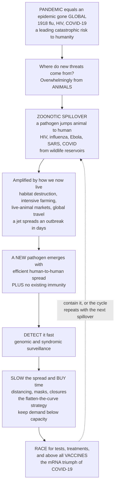

# 🌍 Pandemics and Emerging Infections

> [!abstract] TL;DR
> **A pandemic is an epidemic gone *global* — a new disease sweeping across continents and populations at once — and it ranks among the gravest catastrophic risks humanity faces: the 1918 influenza killed more people than World War I, and COVID-19 reshaped the entire world in months.** Where do these threats come from? Overwhelmingly from **animals**. Roughly **60–75% of emerging infections are *zoonoses*** — pathogens that jump from an animal reservoir into humans (HIV from primates, influenza from birds and pigs, Ebola and SARS and SARS-CoV-2 from bats and wildlife). And we are *manufacturing* more of these **spillovers**: by destroying wildlife habitat, farming animals intensively, and moving people and goods globally, we create ever more contact between humans and novel pathogens — then jet travel carries a local outbreak worldwide in days, faster than the disease even incubates. Once a pathogen with **pandemic potential** emerges (efficient human-to-human spread **plus** no existing population immunity), the response follows a playbook: **detect it fast** (genomic and syndromic surveillance), **slow its spread to buy time** with *non-pharmaceutical interventions* — distancing, masks, closures — the *"flatten the curve"* strategy that keeps demand below health-system capacity, and **race for tests, treatments, and above all vaccines**. COVID-19 was a live demonstration of all of it: R₀ estimation, exponential growth, flattening the curve, variant surveillance, record-speed mRNA vaccines, and profound ethical dilemmas. This note is the **capstone of the infectious-disease section**, threading transmission, R₀/models, outbreaks, surveillance, and vaccination into the real-world stakes of **global health security**.

---

## Intuition

**Analogy — sparks jumping the firebreak between two forests.** Picture two dry forests separated by a wide strip of bare rock, a natural firebreak. For millennia a fire in the *animal* forest — the vast reservoir of viruses circulating in bats, birds, and primates — burned on its own side and stayed there; the bare rock kept the sparks from reaching the *human* forest. A **pandemic begins the moment a spark clears the gap** and lands in dry human timber: a pathogen *spills over* from an animal into a person and, crucially, learns to jump from person to person on its own. Now here is the modern twist that should keep public-health planners awake at night: **we have been shrinking the firebreak**. Every acre of cleared jungle, every crowded live-animal market, every intensively packed farm pushes the two forests closer together, so sparks that once fizzled on the rock now routinely reach us. That is why *emerging* infections are emerging *faster*: we manufacture the contact.

And once a spark catches in the human forest, a second modern change decides how far it burns: **the wind is now a jet stream**. In 1918 a novel flu still took months to circle the globe by ship and rail; today an infected traveler can carry a brand-new pathogen from one continent to another *before their own symptoms appear* — the fire outruns its own smoke. So the firefighting playbook has two halves that map exactly onto how epidemiologists think. First, **watch the treeline** — surveillance to spot the spark the instant it lands. Then, when it catches, you cannot magic the fire away, so you **cut firebreaks and wet the timber to slow it down**: distancing, masks, and closures reduce how many new "trees" each burning one ignites, spreading the blaze out over time so it never overwhelms the fire crews all at once — this is literally what *"flatten the curve"* means. Slowing the fire does not, by itself, change how much forest *eventually* burns — but it buys the one thing that does: **time** to build the fire suppressant that ends it for good, a **vaccine**. Understand why the sparks are clearing the gap more often, and how we watch, slow, and finally extinguish them, and you understand one of the defining challenges — and gravest risks — of the modern age.

---

## How It Works

### Core mechanics

**1. Definitions and scope — outbreak → epidemic → pandemic.** These are nested descriptions of *scale*, not of severity. An **outbreak** is a localized rise in cases above the expected baseline; an **epidemic** is a larger surge across a community or region; a **pandemic** is an epidemic that has spread **across multiple countries or continents**, affecting a large share of the world's population. "Pandemic" says nothing about lethality on its own — the 2009 H1N1 pandemic was mild, while a severe influenza pandemic like 1918 killed an estimated 50 million people, more than the First World War. What all pandemics share is **novelty at global scale**: a pathogen against which most of humanity has little or no immunity, spreading through a fully susceptible world.

**2. Emerging and re-emerging infections.** An **emerging** infection is one newly appearing in a population, and a **re-emerging** infection is one that was declining but is now rising or spreading to new areas (e.g., measles resurging where vaccination lapses, or drug-resistant tuberculosis). The single dominant source of *new* human pathogens is **zoonotic spillover** — transmission from an animal reservoir to humans. Landmark analyses (Jones et al., *Nature* 2008) attribute roughly **60% of emerging infectious-disease events to zoonoses**, and about **70% of those to wildlife**. The roll-call is sobering: **HIV** (primates), **influenza** (waterfowl and swine), **SARS, MERS, and SARS-CoV-2** (bats, via intermediate hosts), **Ebola and Nipah** (bats), **Zika** (primates, via mosquitoes), **plague** (rodents). Understanding the animal origin is not academic — it tells us *where to watch* for the next one.

**3. The drivers — why emergence is accelerating.** Spillover is not random luck; human activity systematically raises its rate. The principal **drivers of emergence** are:
- **Land-use change and deforestation** — clearing habitat forces wildlife and humans into novel contact and stresses animals into shedding more virus.
- **Intensive agriculture and live-animal markets** — dense populations of livestock and wildlife in close human contact act as *mixing vessels* (pigs, for instance, can co-infect with bird and human flu and reassort a new strain).
- **Global travel and trade** — the accelerant: a pathogen can reach every major city within the incubation period, converting a local spillover into a pandemic in days.
- **Urbanization and population density** — packing susceptible hosts together raises effective contact rates.
- **Climate change** — shifts the geographic range of vectors (mosquitoes, ticks), carrying dengue, malaria, and Lyme into new latitudes.
- **Antimicrobial resistance** — the "slow pandemic": overuse of antibiotics breeds resistant organisms, steadily eroding our ability to treat once-manageable infections.

These converge in the **One Health** framework: human, animal, and environmental health are one interconnected system, so surveillance and prevention must span all three rather than waiting at the hospital door.

**4. What gives a pathogen *pandemic potential*.** Not every spillover becomes a pandemic — most fizzle in a handful of human cases (a *dead-end* infection). Three properties must align:
- **Efficient human-to-human transmission** — an effective reproduction number above 1 *between people* (not merely animal-to-human). Many deadly viruses (e.g., H5N1 avian flu historically) kill efficiently but transmit poorly between humans; the fear is that a few mutations could change that.
- **Novelty / no population immunity** — a fully susceptible world means no herd immunity to slow it.
- **Sufficient severity or burden** — enough harm to matter, though even moderate severity at global scale is catastrophic.

Pathogen **evolution** shapes all three. Influenza undergoes **antigenic drift** (gradual mutation that erodes immunity, forcing annual vaccine updates) and **antigenic shift** (abrupt reassortment of gene segments that can create a pandemic strain overnight). SARS-CoV-2 generated **variants** (Alpha, Delta, Omicron) with altered transmissibility and immune escape, which is exactly why genomic surveillance became a global priority.

**5. The response playbook.** Confronting a pandemic threat is a closed control loop:
- **Detect fast** — genomic and syndromic **surveillance** to catch the spark early, when containment is still cheap.
- **Slow the spread to buy time** — **non-pharmaceutical interventions (NPIs)**: isolation of cases, quarantine of contacts, physical distancing, masks, closures of gatherings/schools, and travel measures. These reduce the effective reproduction number Rₜ, **flattening the epidemic curve** so peak demand stays below **health-system capacity**. Crucially, flattening buys time and saves lives *even if it does not change the eventual total infected*, because a health system that is overwhelmed loses patients it could otherwise have saved.
- **Contact tracing** — find and interrupt individual chains, especially valuable early and for superspreading events.
- **Race for countermeasures** — diagnostics (tests), therapeutics (antivirals, monoclonals), and above all **vaccines**. COVID-19's **mRNA vaccines** compressed a historically decade-long process into under a year — the defining scientific triumph of the pandemic.

**6. Governance, equity, and the certainty of the next one.** Global response runs through the **WHO** and the **International Health Regulations (IHR)**, which oblige countries to report events of international concern. But preparedness collides with hard realities: **vaccine nationalism** and inequity (rich countries hoarding early supply), **misinformation** eroding compliance, and genuine **ethical trade-offs** between restricting liberty and protecting life, and between economic and health harms. The one certainty from history is that **future pandemics are inevitable** — the question is only *when*, and *how prepared* we are.

### Flow / architecture



---

## Key Concepts

### Secondary (intuitive foundation)
- **Pandemic** — an epidemic that has spread all over the world at once, not just one town or country; COVID-19 and the 1918 flu are the classic examples.
- **New diseases come from animals** — most brand-new human diseases start in animals and *jump* to people (a **spillover**); HIV, flu, Ebola, and COVID all began this way.
- **Why they spread so fast now** — cutting down forests and crowded animal farms bring people and wild animals together, and airplanes then carry a new germ around the world in days.
- **Flatten the curve** — if everyone slows the spread (masks, distancing, staying home), the same illnesses arrive spread out over time instead of all at once, so hospitals do not get overwhelmed.
- **The race for a vaccine** — slowing a pandemic buys time to invent tests, medicines, and especially a **vaccine** that finally stops it.

### Undergraduate (mechanisms and metrics)
- **Outbreak → epidemic → pandemic** — a nested scale of geographic spread; "pandemic" describes *reach*, not severity.
- **Zoonotic spillover** — animal-to-human transmission; ~60% of emerging infections are zoonotic and ~70% of those originate in **wildlife**.
- **Drivers of emergence** — deforestation/land-use change, intensive agriculture and live-animal markets, global travel and trade, urbanization, climate-driven vector range shifts, and antimicrobial resistance.
- **One Health** — human, animal, and environmental health as one interconnected system requiring integrated surveillance.
- **Pandemic potential** — the combination of efficient human-to-human transmission (Rₜ > 1) **and** population-wide susceptibility (novelty), plus meaningful severity.
- **Antigenic drift vs shift** — gradual mutation (drift, seasonal flu) vs abrupt gene reassortment (shift, pandemic flu); the origin of new variants.
- **Non-pharmaceutical interventions (NPIs)** — isolation, quarantine, distancing, masks, closures, and travel measures that lower Rₜ before drugs or vaccines exist.
- **Flatten the curve** — reducing transmission to lower and delay the epidemic peak so it stays under health-system **capacity**, even when the eventual attack rate is similar.

### Graduate (systems and control)
- **Spillover as a probabilistic process** — each animal-human contact carries a small chance of a pathogen adapting to sustained human transmission; emergence risk rises as the *number* of spillover events accumulates under mounting drivers.
- **Effective reproduction number Rₜ as the control target** — NPIs, immunity, and behavior push Rₜ below 1; real-time Rₜ estimation guided COVID-19 policy.
- **Overdispersion and superspreading** — pandemic transmission is heavy-tailed; a minority of events drive most spread, so control leverages event bans and backward contact tracing (see the transmission note).
- **Genomic epidemiology** — sequencing to track variant emergence, immune escape, and transmission chains in near-real time; the backbone of modern surveillance.
- **Health-system capacity and excess mortality** — flattening reduces *crisis-standard-of-care* deaths that occur when demand for ICU beds, oxygen, and staff exceeds supply, distinct from the direct infection fatality rate.
- **Global health security and governance** — the IHR, WHO pandemic frameworks, equitable access mechanisms, and the political economy of preparedness (financing, stockpiles, R&D platforms) versus vaccine nationalism.
- **Pandemics as global catastrophic risk** — a systemic, tail-risk threat to civilization comparable in expected harm to other low-probability, high-impact hazards (see the systemic-risk note).

---

## Python Demo

```python
# Pandemics and Emerging Infections, two ideas visualized:
#   (a) FLATTEN THE CURVE. An SIR model of a novel pandemic pathogen with no
#       population immunity. NPIs (distancing/masks/closures) lower the effective
#       reproduction number, flattening and DELAYING the peak so infections stay
#       under health-system CAPACITY -> fewer deaths, even if total infected is
#       similar. Integrated with plain numpy (forward Euler), no SciPy needed.
#   (b) SPILLOVER -> EMERGENCE. Each animal-to-human spillover carries a small
#       chance of the pathogen ADAPTING to sustained human-to-human spread.
#       As the DRIVERS (deforestation, farming, travel) multiply spillover
#       events, the probability that AT LEAST ONE goes pandemic climbs toward 1.
import numpy as np
import matplotlib.pyplot as plt

# ---------- (a) SIR flatten-the-curve ----------
N = 1_000_000          # fully susceptible population (novel pathogen)
I0 = 100               # seed infections
gamma = 1 / 10.0       # recovery rate: ~10-day infectious period
days, dt = 200, 0.1
steps = int(days / dt)
t = np.linspace(0, days, steps + 1)

def run_sir(beta):
    S = np.empty(steps + 1); I = np.empty(steps + 1); R = np.empty(steps + 1)
    S[0], I[0], R[0] = N - I0, I0, 0.0
    for k in range(steps):
        new_inf = beta * S[k] * I[k] / N
        new_rec = gamma * I[k]
        S[k + 1] = S[k] - new_inf * dt
        I[k + 1] = I[k] + (new_inf - new_rec) * dt
        R[k + 1] = R[k] + new_rec * dt
    return I

I_unc = run_sir(2.8 * gamma)   # uncontrolled: R0 = 2.8
I_npi = run_sir(1.3 * gamma)   # NPIs cut contacts: effective R ~ 1.3
capacity = 0.06 * N            # health-system capacity (e.g. 6% ill at once)

fig, (ax1, ax2) = plt.subplots(1, 2, figsize=(15, 6))

ax1.plot(t, I_unc, color="crimson", lw=2.5,
         label="Uncontrolled (R0 = 2.8): tall, early peak")
ax1.plot(t, I_npi, color="steelblue", lw=2.5,
         label="With NPIs (R ~ 1.3): flattened, delayed peak")
ax1.axhline(capacity, color="black", ls="--", lw=1.8, label="Health-system capacity")
over = np.where(I_unc > capacity, I_unc, capacity)
ax1.fill_between(t, capacity, over, where=I_unc > capacity,
                 color="crimson", alpha=0.20)
ax1.text(t[np.argmax(I_unc)], I_unc.max() * 0.60,
         "demand EXCEEDS\ncapacity ->\nexcess deaths",
         color="crimson", fontsize=9, ha="center")
ax1.set_xlabel("Days since introduction")
ax1.set_ylabel("People infected at once")
ax1.set_title("(a) Flatten the curve: NPIs keep demand under capacity")
ax1.legend(fontsize=8, loc="upper right")
ax1.grid(alpha=0.3)

# ---------- (b) spillover -> emergence probability ----------
n = np.arange(0, 61)                      # cumulative spillover events
for p, color, label in [
        (0.01, "seagreen",  "low contact  (p = 0.01 per spillover)"),
        (0.03, "darkorange","rising contact (p = 0.03)"),
        (0.06, "crimson",   "high contact (p = 0.06, more drivers)")]:
    P_emerge = 1 - (1 - p) ** n           # P(at least one adapts to human spread)
    ax2.plot(n, P_emerge, color=color, lw=2.5, label=label)

ax2.axhline(0.5, color="gray", ls=":", lw=1.5)
ax2.text(1, 0.52, "even-odds of a pandemic-capable emergence", fontsize=8, color="gray")
ax2.set_xlabel("Cumulative animal-to-human spillover events")
ax2.set_ylabel("P(at least one establishes human-to-human spread)")
ax2.set_title("(b) More spillovers -> emergence becomes near-certain")
ax2.set_ylim(0, 1.02)
ax2.legend(fontsize=8, loc="lower right")
ax2.grid(alpha=0.3)

plt.tight_layout()
plt.savefig("pandemics_and_emerging_infections.png", dpi=130, bbox_inches="tight")
plt.show()

# Numeric takeaways
peak_unc = I_unc.max(); peak_npi = I_npi.max()
print(f"Uncontrolled peak infected : {peak_unc:,.0f}  "
      f"({peak_unc / capacity:.1f}x capacity)")
print(f"NPI-flattened peak infected: {peak_npi:,.0f}  "
      f"({peak_npi / capacity:.2f}x capacity)")
print(f"Peak delayed by NPIs by    : {t[np.argmax(I_npi)] - t[np.argmax(I_unc)]:.0f} days")
print(f"P(emergence) after 30 spillovers at p=0.06: {1 - 0.94**30:.0%}")
```

**What it shows.** Panel (a) is the *flatten-the-curve* argument made quantitative: an uncontrolled novel pathogen (R₀ = 2.8) produces a towering, early peak that soars far above health-system capacity — the shaded region is *excess* mortality from an overwhelmed system — while NPIs that cut the effective reproduction number to ~1.3 flatten the peak **below the capacity line** and push it *later*, buying the weeks or months needed to build treatments and vaccines. Panel (b) makes emergence itself probabilistic: any single spillover is unlikely to go pandemic, but because the **drivers multiply the number of spillover events**, the probability that *at least one* adapts to sustained human transmission climbs relentlessly toward certainty — which is precisely why "when, not if" is the right way to think about the next pandemic.

---

## Real-World Applications

- **COVID-19 — the case study threading the whole vault.** SARS-CoV-2 spilled over from a bat-origin coronavirus (via wildlife), spread globally within weeks via air travel, and demonstrated the entire playbook: real-time R₀/Rₜ estimation, exponential growth, *flatten-the-curve* NPIs, global genomic surveillance tracking Alpha/Delta/Omicron variants, and record-speed **mRNA vaccines** — alongside the full weight of vaccine inequity, misinformation, and lockdown ethics.
- **1918 "Spanish" influenza.** The benchmark catastrophe: an H1N1 avian-origin strain killed an estimated 50 million people worldwide, more than World War I, and cities that imposed NPIs *early* (St. Louis vs Philadelphia) recorded markedly lower peak mortality — the historical proof of flattening the curve.
- **HIV/AIDS.** A zoonotic spillover from primates (SIV → HIV) in the early 20th century that global travel and social change turned into a slow, ongoing pandemic — over 40 million deaths — illustrating that pandemics need not be explosive to be devastating.
- **Ebola (West Africa 2014–16; DRC).** A bat-reservoir zoonosis where *surveillance, contact tracing, and ring vaccination* (the rVSV-ZEBOV vaccine) contained outbreaks — a template for detect-and-respond when a pathogen is deadly but not yet efficiently airborne.
- **Pandemic influenza preparedness.** Global surveillance of avian H5N1/H5N2 and swine influenza watches for the **antigenic shift** that could yield a human-transmissible pandemic strain; annual vaccine reformulation tracks **antigenic drift**.
- **Antimicrobial resistance — the "slow pandemic."** Rising drug resistance is projected to cause millions of deaths per year, a diffuse but genuine pandemic threat driven by antibiotic overuse in medicine and agriculture, and a core One Health concern.

---

## Common Pitfalls

- **Equating "pandemic" with "severe."** Pandemic describes *global reach*, not lethality. The 2009 H1N1 pandemic was mild; conflating the terms breeds both false alarm and dangerous complacency about the *next* one.
- **Ignoring the animal origin.** Focusing surveillance only on human hospitals misses the point that most new pathogens are brewing at the **animal-human interface**. Prevention that ignores wildlife, livestock, and land-use (the One Health view) is always reactive.
- **Believing flattening the curve reduces the *total* infected.** Absent immunity or a vaccine, flattening mainly *redistributes* infections over time — its life-saving power comes from keeping demand under capacity and buying time for countermeasures, not from shrinking the eventual attack rate.
- **Treating R₀ as fixed and severity as the only thing that matters.** A pathogen with modest fatality but high, efficient transmission and no immunity can be far more damaging than a lethal one that transmits poorly between humans. Rₜ is malleable by behavior and NPIs; pandemic potential is about the *combination* of traits.
- **Underestimating pre-symptomatic and asymptomatic spread.** COVID-19's silent transmission defeated symptom-based border screening; assuming spread requires visible illness lets a pathogen outrun detection.
- **Preparing for the last war.** Building defenses tuned only to the previous pathogen (respiratory vs hemorrhagic vs vector-borne) leaves gaps; and the political tendency to *defund preparedness between pandemics* guarantees being caught flat-footed by the next inevitable one.
- **Neglecting equity and trust.** Vaccine nationalism prolongs a pandemic globally (leaving reservoirs for new variants), and eroded public trust — through misinformation or heavy-handed mandates — undermines the very NPIs and vaccination that end it.

---

## Related Concepts

This note is the **capstone of section 04 · Infectious Disease Epidemiology**, integrating everything the section built. It rests directly on **Infectious Disease Epidemiology** (the chain of infection and why cases are not independent) and **Epidemic Dynamics and Compartmental Models** (the SIR/SEIR mathematics and R₀ that the flatten-the-curve demo uses); it operationalizes **Surveillance and Disease Monitoring** as the detection arm of the response playbook and **Vaccination, Herd Immunity and Elimination** as its ultimate weapon; and it opens outward to **Global Health and International Epidemiology**, where pandemic governance, equity, and health security live. (These siblings are referenced in prose; the wikilinks below point only to Glob-verified notes elsewhere in the vault.)

- [[Clinical_Medicine/05_Immune_Infectious_and_Hematologic/Infectious_Disease_and_Host_Pathogen_Interaction|Infectious Disease and Host-Pathogen Interaction]] — the within-host, clinical view of the pathogens that spill over and go pandemic.
- [[Clinical_Medicine/02_Cardiovascular_and_Respiratory_Disease/Pulmonary_Infections_and_Respiratory_Failure|Pulmonary Infections and Respiratory Failure]] — the respiratory syndromes (pandemic influenza, COVID-19) that dominate the deadliest pandemics and overwhelm ICU capacity.
- [[Biology/11_Microbiology_and_Immunology/Viruses|Viruses]] — the biology of the agents behind most pandemics, including how RNA viruses mutate to escape immunity.
- [[Biology/07_Evolution/Natural_Selection_and_Adaptation|Natural Selection and Adaptation]] — the evolutionary engine of antigenic drift/shift, variants, and a pathogen adapting to a new human host.
- [[Health_Nutrition_and_Longevity/06_Public_Health_and_Prevention/Infectious_Disease_Vaccines_and_Immunity|Infectious Disease, Vaccines and Immunity]] — the immunity and vaccination science that ends pandemics.
- [[Health_Nutrition_and_Longevity/06_Public_Health_and_Prevention/Global_Health_and_Health_Systems|Global Health and Health Systems]] — the health-systems and governance context of pandemic preparedness and equity.
- [[Systems_Thinking_and_Complexity/03_Networks_and_Connectivity/Network_Dynamics_and_Contagion|Network Dynamics and Contagion]] — pandemics as contagion spreading across a global contact and travel network.
- [[Systems_Thinking_and_Complexity/03_Networks_and_Connectivity/Cascades_and_Systemic_Risk|Cascades and Systemic Risk]] — pandemics as a global catastrophic, systemic tail-risk to civilization.

---

## Review Questions

1. **(Secondary)** Using the two-forests-and-a-firebreak analogy, explain what a *zoonotic spillover* is and give two reasons why spillovers are happening more often today.
2. **(Secondary/Undergraduate)** What does "flatten the curve" mean, and why can slowing a pandemic save lives *even if roughly the same number of people eventually get infected*?
3. **(Undergraduate)** Distinguish an *outbreak*, an *epidemic*, and a *pandemic*. Why does calling something a pandemic tell you nothing by itself about how deadly it is?
4. **(Undergraduate)** A deadly avian influenza kills most people it infects but almost never passes between humans. Explain, in terms of the three ingredients of *pandemic potential*, why it is not (yet) a pandemic threat — and what change would make it one.
5. **(Undergraduate/Graduate)** Name four *drivers* of emerging infections and, for each, explain the specific mechanism by which it raises the rate of spillover or global spread.
6. **(Graduate)** In the SIR flatten-the-curve model, NPIs lower the peak but may leave the total attack rate similar. What, precisely, is the life-saving benefit of flattening, and how does it relate to *health-system capacity* and *excess mortality*?
7. **(Graduate)** Explain why "the next pandemic is a question of *when*, not *if*," using the idea that emergence probability accumulates over independent spillover events. How do the drivers of emergence enter that probability, and what does this imply for where to invest in prevention?

---

## Sources

- Morens, D. M., Folkers, G. K., & Fauci, A. S. (2004). "The challenge of emerging and re-emerging infectious diseases." *Nature*, 430, 242–249.
- Jones, K. E., Patel, N. G., Levy, M. A., et al. (2008). "Global trends in emerging infectious diseases." *Nature*, 451, 990–993.
- World Health Organization. *Managing Epidemics: Key Facts About Major Deadly Diseases*, and WHO pandemic preparedness and International Health Regulations frameworks.
- Quammen, D. (2012). *Spillover: Animal Infections and the Next Human Pandemic*. W. W. Norton.
- Anderson, R. M., & May, R. M. *Infectious Diseases of Humans: Dynamics and Control* — mathematical foundations of R₀, epidemic peaks, and control thresholds.

---

#epidemiology #pandemics #emerging-infections #zoonoses #flatten-the-curve
