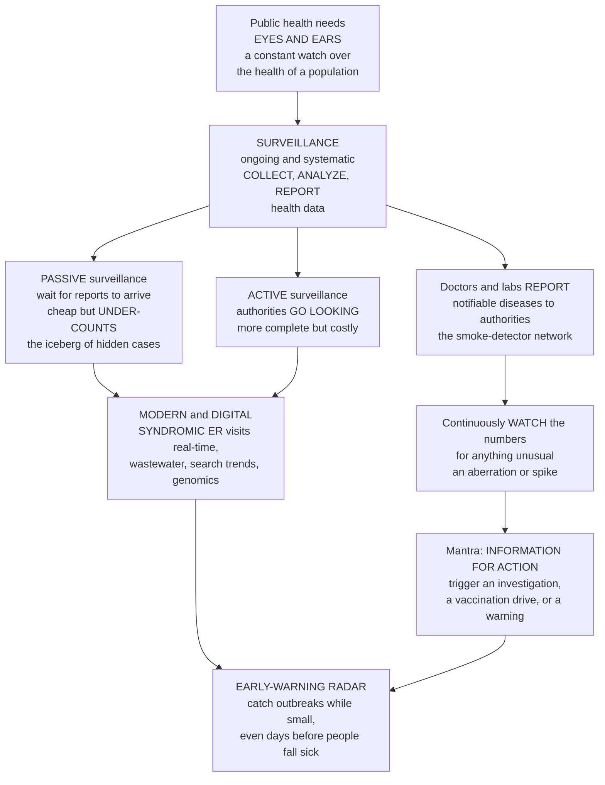

# 📡 Surveillance and Disease Monitoring

> [!abstract] TL;DR
> Public health cannot respond to a threat it cannot **see**, so every functioning health system runs a permanent early-warning system: **surveillance**, the *ongoing, systematic collection, analysis, interpretation, and dissemination* of health data — with one non-negotiable purpose baked into the definition, **"information for action."** Surveillance is not research for its own sake; it exists to **trigger a response** — investigate an outbreak, launch a vaccination campaign, issue a warning, reallocate resources. Its classic engine is **notifiable-disease reporting**: doctors and labs are *legally required* to report certain conditions (measles, TB, a novel influenza) to health authorities, who watch the incoming numbers for anything unusual. This traditional stream is **passive** (wait for reports to arrive) — cheap and continuous but chronically **under-counting**, revealing only the tip of the **surveillance iceberg** of unreported cases — as opposed to **active** surveillance (authorities go looking), **sentinel** surveillance (a few high-quality sites), and the modern revolution of **syndromic** surveillance (watching pre-diagnostic signals — ER visits, symptoms, pharmacy sales — in real time), plus **wastewater**, **search-query**, and **genomic** surveillance that can flag a pathogen *days before* people show up sick. A system is judged on **sensitivity, timeliness, representativeness, predictive value positive, simplicity, and flexibility**, and the core analytic task is **aberration detection** — a statistical threshold or control chart that separates a real outbreak from ordinary noise while balancing early warning against false alarms. Surveillance is the smoke-detector network of an entire society: the difference between catching an epidemic while it is small and discovering it only after it is raging.

---

## Intuition

**Analogy first — the smoke-detector network for a whole society.** A single smoke detector in your kitchen does one humble, ceaseless job: it *watches* the air, and the moment something is wrong it *goes off* — loudly, early, before the fire has a chance to spread. It is worthless if it merely records smoke in a logbook nobody reads; its entire value is that it **triggers action** while there is still time to act. Now scale that idea up from a house to a nation. Public health needs the same thing: a constant, systematic **watch** over the health of a whole population, wired so that when something unusual appears — an unexpected cluster of fevers, a jump in measles cases, a strange new pneumonia — an alarm sounds and someone is *dispatched to investigate*. That watch is **surveillance**.

How is the "smoke" detected? Mostly by requiring the people who see disease first — **doctors and laboratories** — to **report** certain conditions to health authorities. A confirmed case of measles, tuberculosis, cholera, or a novel flu strain is **notifiable**: by law it must be reported, and those reports flow continuously into public-health agencies whose analysts watch the numbers, week after week, for anything that breaks the normal pattern. The guiding mantra of the whole enterprise is **"information for action"** — surveillance is emphatically *not* data-collection for its own sake. Every number exists to answer a question that leads to a decision: *Is this disease rising or falling? Is a new threat emerging? Did our vaccination campaign work?* And when the data say "something is wrong," the system does not shrug — it **launches an outbreak investigation, starts a vaccination drive, or issues a public warning.**

But smoke detectors have a weakness, and so does classical surveillance. The traditional system is **passive** — it *waits* for reports to come in, which makes it cheap and continuous but leaves it **blind to everything nobody reports**. Most surveillance sees only the **tip of an iceberg**: for every case that reaches the health department, many milder or undiagnosed cases stay hidden beneath the surface. So public health also runs **active** surveillance (agencies who *go looking* for cases rather than waiting) and, in a genuine revolution now underway, **syndromic** and **digital** surveillance: instead of waiting for a confirmed diagnosis, watch the *early symptoms* — emergency-room visits, over-the-counter medicine sales, school absences — in **real time**, and even watch the environment itself. **Wastewater** testing can detect a virus in a city's sewage *days before* infected people feel sick enough to see a doctor; **search-query trends** and **genomic sequencing** add still more early, granular signals. Put it all together and surveillance becomes the **early-warning radar of public health** — the sweeping, always-on watch that catches an epidemic while it is small enough to stop.

---

## How It Works

### Core mechanics — from a scattered event to an actionable signal

1. **Fix the target and the case definition.** Surveillance begins by deciding *what* to watch. A **case definition** — a standard set of clinical, laboratory, and epidemiologic criteria (confirmed vs probable vs suspected) — makes every reporter count the same thing the same way, so that a rise in numbers reflects the *disease*, not drifting opinion about what counts as a case.
2. **Collect the data through a defined channel.** The classic channel is **notifiable-disease reporting**: clinicians and laboratories are *mandated* to report specified conditions to local or state health authorities, who forward them up to national agencies (in the US, the CDC's National Notifiable Diseases Surveillance System) and, for events of international concern, to the WHO under the **International Health Regulations (IHR)**. Other channels feed the same machine: vital-statistics registration (births and deaths), disease **registries** (cancer, birth defects), health surveys, sentinel-provider networks, laboratories, and — increasingly — pharmacies, hospitals' electronic records, sewersheds, and the internet.
3. **Consolidate, clean, and analyze.** Reports are de-duplicated, geocoded, and assembled into a **time series** of counts by person, place, and time. Analysts compute rates against a denominator, watch trends, map clusters, and — crucially — run **aberration detection**: compare this week's count against a *statistically expected baseline* (a historical mean, a control-chart limit, a CUSUM) to decide whether the rise is ordinary noise or a genuine **signal**.
4. **Interpret against context.** A flagged aberration is filtered through judgment: Is it a reporting artifact (a new lab, a changed case definition, a holiday dip)? A seasonal pattern? Or a true emerging event? Surveillance data are messy, and interpretation is where epidemiology meets the raw numbers.
5. **Disseminate — and act.** The output is fed back to those who need it: clinicians, policymakers, and the public (weekly bulletins, dashboards, alerts). This closes the loop that defines the field: **information for action.** A confirmed signal *triggers* an outbreak investigation, a control measure, a vaccination campaign, a travel advisory, or a resource surge. Surveillance that stops at a report and never reaches a decision has failed, however elegant its statistics.
6. **Choose the surveillance mode to fit the need.** **Passive** (routine, provider-initiated reporting) is the cheap, always-on backbone but under-reports. **Active** (authorities actively solicit or seek cases) is costlier but far more complete — reserved for outbreaks, eliminations, and high-stakes conditions. **Sentinel** (a selected, high-quality subset of sites) trades full coverage for timeliness and depth (influenza networks are the archetype). **Syndromic** watches *pre-diagnostic* indicators for the earliest possible warning, at the cost of specificity.

### The surveillance pipeline — from eyes and ears to early-warning radar



*Read top to bottom: population health needs a constant watch, which surveillance provides by collecting and analyzing reported data; watching for aberrations feeds the "information for action" loop, while the passive-versus-active choice and the modern digital streams together sharpen the whole system into an early-warning radar.*

---

## Key Concepts

### Secondary (intuitive)

- **Surveillance is society's smoke detector.** It watches population health all the time so trouble can be caught **early**, while it is still small enough to stop — not discovered after an epidemic is already raging.
- **Notifiable diseases must be reported.** By law, doctors and labs must tell health authorities when they see certain diseases (measles, TB, cholera, a new flu). Those reports are the "smoke" the system watches.
- **Information for action.** The whole point is not to collect data for its own sake — it is to *do something*: investigate an outbreak, run a vaccination campaign, or warn the public.
- **Passive vs active.** *Passive* means waiting for reports to come in — cheap, but it misses cases (the hidden **iceberg**). *Active* means going out and looking for cases — more complete, but expensive.
- **Modern early signals.** New tools catch outbreaks even earlier: **syndromic** surveillance watches symptoms and ER visits in real time, and **wastewater** testing finds a virus in the sewage *days before* people feel sick.

### Undergraduate (formal)

- **Definition (the canonical one).** Public health surveillance is the *ongoing, systematic collection, analysis, interpretation, and dissemination* of health data **for use in planning, implementing, and evaluating public health practice** — closing the loop with **information for action**. Every clause matters: *ongoing* (not a one-off study), *systematic* (standardized), and *for action* (tied to a response).
- **Core purposes.** Detect outbreaks and epidemics early; monitor **trends** over time, place, and person; identify **emerging** threats and changing risk factors; **evaluate** interventions and programs (did the vaccine campaign cut incidence?); guide **resource allocation**; and inform **policy**. It supplies the numerators and denominators that become [[Epidemiology_and_Public_Health/01_Foundations_of_Epidemiology/Measures_of_Disease_Frequency|incidence and prevalence]].
- **Passive surveillance.** Routine, provider- and laboratory-initiated reporting of **notifiable/reportable** conditions to health authorities. Inexpensive, continuous, and broad — but plagued by **under-reporting** and **reporting delay**; it captures only the tip of the **surveillance iceberg**. Completeness varies wildly by disease severity and public concern.
- **Active surveillance.** Health authorities *proactively* contact reporters or search records to find cases. More complete and timely, but labor-intensive and costly — deployed for outbreak response, disease-elimination programs (measles, polio), and novel threats.
- **Sentinel surveillance.** A network of selected, representative reporting sites (e.g., a panel of "sentinel" physicians for influenza-like illness) that trades exhaustive coverage for high-quality, timely data — excellent for tracking trends, poor for detecting rare events.
- **Syndromic surveillance.** Monitoring **pre-diagnostic** indicators — chief complaints at emergency departments, over-the-counter drug sales, school/work absenteeism, nurse-hotline calls — for the **earliest possible** detection, *before* laboratory confirmation. Gains timeliness at the cost of **specificity** (many false alarms).
- **Evaluating a surveillance system.** The CDC framework judges systems on **sensitivity** (proportion of true cases detected), **timeliness** (speed from event to action), **representativeness** (accurately reflects the population), **predictive value positive** (fraction of alarms that are real), plus **simplicity, flexibility, acceptability, stability, and data quality** — with unavoidable **trade-offs** (a more sensitive, timelier system generates more false alarms).

### Graduate (mechanistic and systems)

- **The surveillance iceberg, quantified.** Reported cases `R = p * C`, where `C` is true cases and `p` the **reporting/ascertainment fraction**. Trend interpretation is only valid if `p` is **stable**; a rise in `R` can reflect rising `C` *or* rising `p` (a new lab, heightened awareness, a broadened case definition). Multiplier studies and capture-recapture (using two or more incomplete case lists to estimate the unobserved) are used to back out `C` and correct for the iceberg. This is a [[Epidemiology_and_Public_Health/03_Causal_Inference_Bias_and_Confounding/Bias_Selection_and_Information|systematic-error]] problem baked into the data source.
- **Aberration-detection algorithms.** The analytic heart of early warning. **Statistical process control / control charts** flag counts exceeding a threshold such as `mean + k * SD` estimated from a historical baseline; the **CDC EARS C1/C2/C3** methods use a moving 7-day baseline; the **Farrington algorithm** fits a quasi-Poisson regression to historical weeks (handling seasonality and past outbreaks) and flags exceedances; **CUSUM** accumulates small deviations to catch slow drifts a single-week threshold would miss; **scan statistics** (SaTScan) detect **spatial and space-time clusters**. Every method sits on a **sensitivity-vs-specificity / timeliness-vs-false-alarm** ROC curve — tighten the threshold and you detect faster but cry wolf more often.
- **Laboratory, molecular, and genomic surveillance.** Beyond counting cases, labs **characterize** pathogens: serotyping, antimicrobial-resistance profiling, and **whole-genome sequencing (WGS)**. **PulseNet** links foodborne outbreaks by genetic fingerprint across states; **genomic surveillance** tracked SARS-CoV-2 **variants** (Alpha through Omicron) in near real time, coupling phylogenetics to public-health action — a fusion of molecular biology and epidemiology.
- **Digital and environmental surveillance.** **Wastewater-based epidemiology** measures pathogen RNA/DNA shed into sewersheds — a population-level, testing-independent **leading indicator** that rises before clinical cases and is immune to individual test-seeking bias. **Digital epidemiology** mines search queries, social media, and mobility data (the cautionary tale here is *Google Flu Trends*, which over-fit and drifted — "big data hubris"). These streams add timeliness and granularity but introduce **noise, bias, and privacy** hazards.
- **Global architecture.** The **IHR (2005)** obligate member states to detect, assess, and report events that may constitute a **Public Health Emergency of International Concern (PHEIC)**; the **WHO Global Outbreak Alert and Response Network (GOARN)** and event-based systems like **EIOS/ProMED** scan informal signals worldwide. Surveillance is thus simultaneously local, national, and planetary.
- **Indicator-based vs event-based surveillance (IBS vs EBS).** IBS is the structured, indicator-driven counting of notifiable conditions; **EBS** captures *unstructured* signals — rumors, media reports, clusters of unexplained deaths — enabling detection of the *unexpected* and the *novel*, which a fixed notifiable list by definition cannot anticipate. A robust system runs both.

---

## Python Demo

```python
# Surveillance and disease monitoring, two core ideas in one figure (numpy + matplotlib):
#   (a) ABERRATION DETECTION -- a control chart turns raw counts into a SIGNAL.
#       Endemic weekly case reports wobble around a seasonal baseline (Poisson noise).
#       An outbreak is injected; a 3-sigma upper control limit, learned from the
#       pre-outbreak baseline, FLAGS the aberration early -> "information for action."
#       Tighten the threshold to detect sooner and you raise the FALSE-ALARM rate:
#       the timeliness-vs-specificity trade-off every surveillance system must tune.
#   (b) EARLY SIGNAL / LEADING INDICATOR -- wastewater rises BEFORE confirmed cases.
#       The same epidemic is seen through two streams: an environmental/syndromic
#       signal (wastewater) that tracks shedding, and confirmed clinical cases that
#       LAG by a care-seeking + testing + reporting delay. The leading indicator
#       crosses the alarm threshold days earlier -- the modern early-warning radar.
import numpy as np
import matplotlib.pyplot as plt

rng = np.random.default_rng(1854)          # the year of John Snow's Broad Street pump

fig, (ax1, ax2) = plt.subplots(1, 2, figsize=(14, 5.4))

# ---------- (a) Aberration detection with a control chart ----------
weeks   = np.arange(60)
season  = 20 + 6 * np.sin(2 * np.pi * weeks / 52.0)   # mild seasonal endemic baseline
counts  = rng.poisson(season).astype(float)           # ordinary week-to-week noise

outbreak_start = 40
for i, w in enumerate(weeks):                          # inject a rise-then-fade outbreak
    if w >= outbreak_start:
        k = w - outbreak_start
        counts[i] += 16 * k * np.exp(-k / 4.0)
counts = np.round(counts)

ref       = counts[:35]                                # historical PRE-outbreak baseline
mu        = ref.mean()
sigma     = ref.std(ddof=1)
threshold = mu + 3 * sigma                             # 3-sigma upper control limit (EARS-style)

exceed = weeks[(counts > threshold) & (weeks >= outbreak_start)]
detect = int(exceed.min()) if exceed.size else None    # first outbreak week that trips the alarm

ax1.bar(weeks, counts, width=0.85, color="#adb5bd", label="Weekly reported cases")
ax1.bar(weeks[weeks >= outbreak_start], counts[weeks >= outbreak_start],
        width=0.85, color="#e8590c", label="True outbreak period")
ax1.axhline(mu,        color="#1c7ed6", lw=1.5,           label=f"Baseline mean = {mu:.0f}")
ax1.axhline(threshold, color="#c92a2a", lw=2.0, ls="--",  label=f"Alarm threshold mean+3SD = {threshold:.0f}")
if detect is not None:
    ax1.annotate("FLAG: aberration detected",
                 xy=(detect, counts[detect]),
                 xytext=(detect - 22, counts.max() * 0.92),
                 arrowprops=dict(arrowstyle="->", color="black", lw=1.5), fontsize=9)
ax1.set_title("(a) Aberration detection:\na control chart flags the outbreak -> information for action")
ax1.set_xlabel("Week")
ax1.set_ylabel("Reported case count")
ax1.legend(loc="upper left", fontsize=8)

# ---------- (b) Leading indicator: wastewater warns before confirmed cases ----------
t = np.arange(0, 90)
def gaussian_bump(center, width):                      # a single epidemic wave, normalized shape
    return np.exp(-0.5 * ((t - center) / width) ** 2)

lag        = 12                                        # care-seeking + testing + reporting delay (days)
wastewater = gaussian_bump(45, 8) + rng.normal(0, 0.02, t.size)   # tracks shedding, near real-time
confirmed  = gaussian_bump(45 + lag, 8)               # clinical cases LAG the true wave
wastewater = np.clip(wastewater, 0, None)

ww_n, cc_n = wastewater / wastewater.max(), confirmed / confirmed.max()   # normalize shapes
thr        = 0.20
ww_cross   = int(t[ww_n > thr].min())                  # first day each stream trips the alarm
cc_cross   = int(t[cc_n > thr].min())

ax2.plot(t, ww_n, color="#2b8a3e", lw=2.5, label="Wastewater signal (leading indicator)")
ax2.plot(t, cc_n, color="#5f3dc4", lw=2.5, label="Confirmed clinical cases (lagging)")
ax2.axhline(thr, color="gray", ls=":", lw=1.5, label=f"Detection threshold = {thr:.2f}")
ax2.axvline(ww_cross, color="#2b8a3e", ls="--", lw=1)
ax2.axvline(cc_cross, color="#5f3dc4", ls="--", lw=1)
ax2.annotate("", xy=(cc_cross, 0.55), xytext=(ww_cross, 0.55),
             arrowprops=dict(arrowstyle="<->", color="black", lw=1.5))
ax2.text((ww_cross + cc_cross) / 2, 0.60, f"{cc_cross - ww_cross} days\nearlier warning",
         ha="center", fontsize=9)
ax2.set_title("(b) Early signal:\nwastewater crosses the alarm before confirmed cases")
ax2.set_xlabel("Day")
ax2.set_ylabel("Normalized signal")
ax2.legend(loc="upper right", fontsize=8)

plt.tight_layout()
plt.show()

# ---------- Console summary ----------
print(f"(a) Baseline mean {mu:.1f}, SD {sigma:.1f}; 3-sigma alarm threshold = {threshold:.1f}")
print(f"    Outbreak truly began at week {outbreak_start}; first FLAGGED at week {detect}")
print(f"(b) Wastewater tripped the alarm on day {ww_cross}; confirmed cases on day {cc_cross}")
print(f"    Lead time = {cc_cross - ww_cross} days of earlier warning")
# (a) Outbreak begins wk 40, control chart flags it within a week or two.
# (b) Wastewater warns roughly 10-12 days before confirmed cases cross the threshold.
```

**What you see.** *Panel (a)* is surveillance turning noise into a decision. For weeks the reported counts wobble harmlessly around a seasonal baseline; a **3-sigma upper control limit**, learned entirely from the pre-outbreak history, draws the line between "ordinary variation" and "something is wrong." When the injected outbreak pushes counts across that red threshold, the chart **flags an aberration** — this is *information for action*, the automated trigger that dispatches an investigator. Drop the multiplier from 3-sigma toward 2-sigma and the alarm fires *sooner* but also trips on innocent noise: the ineradicable **timeliness-versus-false-alarm trade-off**. *Panel (b)* shows the modern early-warning revolution. The very same epidemic wave is seen twice: the green **wastewater** signal tracks viral shedding in near real time, while the purple **confirmed-case** curve lags by a care-seeking-plus-testing-plus-reporting delay. The leading indicator crosses the alarm threshold roughly a week and a half *before* clinical cases do — the concrete meaning of a system that can warn of an outbreak **days before people fall sick**.

---

## Real-World Applications

- **Notifiable-disease reporting (NNDSS).** In the United States, clinicians and laboratories report roughly 120 nationally notifiable conditions to state and local health departments, which feed the CDC's **National Notifiable Diseases Surveillance System**. This is the always-on passive backbone: it is how measles clusters, meningitis cases, and STI trends surface week after week, published in the *Morbidity and Mortality Weekly Report* — the original "information for action" bulletin.
- **Influenza sentinel networks (ILINet / FluNet).** National influenza surveillance blends **sentinel** outpatient providers reporting influenza-like illness, laboratory subtyping, and mortality tracking into WHO's global **FluNet** — the data that select each year's vaccine strains and detect novel subtypes with pandemic potential.
- **COVID-19: syndromic, genomic, and wastewater at scale.** The pandemic became a live demonstration of every surveillance mode at once: **syndromic** dashboards of ER visits and test positivity, **genomic** surveillance sequencing millions of samples to track variants from Alpha to Omicron, and **wastewater** monitoring (the CDC's National Wastewater Surveillance System) that repeatedly signaled surges **days ahead** of case reports and was immune to the collapse in testing after home tests arrived.
- **Polio and measles elimination — active surveillance.** Eradication programs cannot rely on passive reporting; they run **active** surveillance for **acute flaccid paralysis** (the syndromic signal for polio) and investigate every suspected measles case, because the last cases are the hardest to see and a single missed chain can reignite transmission.
- **PulseNet and foodborne outbreaks — molecular surveillance.** By whole-genome-sequencing *Salmonella*, *E. coli*, and *Listeria* isolates and sharing "genetic fingerprints" across a national network, PulseNet links seemingly unrelated illnesses in different states into a single recognized outbreak, pinpointing a contaminated food long before local clinicians could connect the dots.
- **Global early warning (IHR, GOARN, ProMED).** WHO's **International Health Regulations** require countries to report events of international concern; **event-based** systems like **ProMED** and **EIOS** scan news and rumors worldwide — the channel through which the first signals of SARS in 2003 and clusters of unusual pneumonia in late 2019 reached the international community.

---

## Common Pitfalls

- **Collecting data that never triggers action.** The cardinal sin. A surveillance system that produces reports nobody reads or acts on has abandoned its defining purpose — *information for action*. If a signal cannot reach a decision-maker fast enough to change something, the elegance of the statistics is irrelevant.
- **Reading passive-surveillance counts as true incidence.** Passive systems capture the **tip of the iceberg**. Treating reported cases as the real case count over-states completeness and, worse, mistakes changes in **reporting** (a new lab, heightened awareness, a broadened case definition) for changes in **disease**. Always ask whether the ascertainment fraction was stable before declaring a trend.
- **Confusing an artifact with an outbreak.** A spike can come from a changed case definition, a new reporting hospital, improved testing, or a data-entry error — not from more disease. Aberration detection *flags*; human epidemiologists must *interpret* against context before sounding the alarm.
- **Mis-tuning the alarm threshold.** Set it too tight and the system drowns responders in **false alarms** until they ignore it (alarm fatigue); set it too loose and it misses the outbreak until it is large. There is no free lunch — timeliness and specificity trade off along a fixed curve, and the right operating point depends on the cost of a miss versus a false alarm.
- **"Big-data hubris" in digital surveillance.** *Google Flu Trends* famously over-fit search terms and drifted badly out of calibration. Novel digital and social-media signals are noisy, biased by who generates them, and unstable over time; they **augment** but do not replace validated clinical and laboratory surveillance.
- **Ignoring representativeness and equity.** If reporting is denser where clinics, labs, and internet access are richer, surveillance systematically under-sees disease in poorer or rural populations — hiding exactly the outbreaks that most need action and encoding health inequities into the "eyes and ears" of the system.
- **Privacy and trust as afterthoughts.** Real-time, granular, and location-linked surveillance can erode public trust and legal boundaries if governance is weak; a system that alienates the reporters and communities it depends on eventually loses the very data flow that makes it work.

---

## Related Concepts

**Within this vault (Section 04, prose references).** Surveillance is the operational engine of **Infectious Disease Epidemiology**, the section this note opens, and it feeds directly into its siblings. *Outbreak Investigation* is what a surveillance signal **triggers** — the step-by-step field response (verify the diagnosis, define a case, describe by person-place-time, form and test hypotheses, control the source) that turns a flagged aberration into contained transmission; surveillance detects, investigation acts. *Pandemics and Emerging Infections* depends on surveillance as its **radar**: the IHR reporting, event-based scanning, and genomic tracking that catch a spillover or a novel variant while global spread is still preventable. *Digital Epidemiology and Big Data* extends this note's modern streams — search trends, mobility, wastewater, and social media — into a full treatment of the promise and pitfalls of real-time digital signals. And *Public Health Systems and Functions* frames surveillance as one of the **essential public-health functions** every health system must perform, sitting beside prevention, preparedness, and response. Reaching back across the vault, surveillance produces the raw numerators and denominators that become [[Epidemiology_and_Public_Health/01_Foundations_of_Epidemiology/Measures_of_Disease_Frequency|incidence and prevalence]], and its data are subject to the reporting and ascertainment [[Epidemiology_and_Public_Health/03_Causal_Inference_Bias_and_Confounding/Bias_Selection_and_Information|biases]] that must be understood before any trend is believed.

**Across the vault (Glob-verified links).**

- [[Health_Nutrition_and_Longevity/06_Public_Health_and_Prevention/Public_Health_and_Epidemiology|Public Health and Epidemiology]] — the population-lens parent that positions surveillance within the John Snow tradition and the core functions of public health.
- [[Health_Nutrition_and_Longevity/06_Public_Health_and_Prevention/Global_Health_and_Health_Systems|Global Health and Health Systems]] — the WHO, IHR, and global-network layer through which national surveillance becomes a planetary early-warning system.
- [[Health_Nutrition_and_Longevity/06_Public_Health_and_Prevention/Infectious_Disease_Vaccines_and_Immunity|Infectious Disease, Vaccines and Immunity]] — surveillance evaluates vaccination programs (did incidence fall?) and drives vaccine-preventable-disease and variant monitoring.
- [[Clinical_Medicine/05_Immune_Infectious_and_Hematologic/Infectious_Disease_and_Host_Pathogen_Interaction|Infectious Disease and Host-Pathogen Interaction]] — the clinical and microbiological reality (pathogens, case definitions, laboratory diagnosis) that supplies the "cases" surveillance counts and characterizes.
- [[AI-ML/01_Classical_ML/Anomaly_Detection|Anomaly Detection]] — the machine-learning generalization of aberration detection: the same statistical problem of separating a real signal from background noise, now with richer algorithms.
- [[AI-ML/01_Classical_ML/Time_Series_Analysis|Time Series Analysis]] — the modeling backbone (baselines, seasonality, forecasting, change-point detection) beneath trend monitoring and control-chart limits.

---

## Review Questions

**Secondary.** Explain, using the smoke-detector analogy, what public health surveillance is and why the mantra "information for action" matters — that is, why simply collecting the data is not enough. Then describe the difference between **passive** and **active** surveillance in your own words, and give one reason passive surveillance usually **undercounts** the true number of cases (the "iceberg").

**Undergraduate.** A health department's weekly reported counts of a notifiable disease jump sharply this month. (a) List **three** non-outbreak explanations for the rise that an epidemiologist must rule out before declaring an outbreak. (b) Describe how an **aberration-detection** method (such as a control chart with a `mean + 3 SD` threshold) would flag this rise, and explain the fundamental trade-off you accept when you lower the threshold to detect outbreaks **sooner**. (c) Name **three** attributes you would use to evaluate whether this surveillance system is any good, and define each.

**Graduate.** Contrast **indicator-based** and **event-based** surveillance and explain why a system running only a fixed notifiable-disease list is structurally poor at detecting a **novel** pathogen. Then, letting reported cases `R = p * C` (with `p` the reporting fraction and `C` true cases), explain precisely why a rising `R` does **not** by itself prove rising `C`, and describe one method (e.g., capture-recapture or a multiplier study) to estimate the hidden portion of the iceberg. Finally, explain why **wastewater surveillance** can serve as a *leading indicator* of clinical cases, and identify one advantage it has over case-based surveillance that is unrelated to timeliness.

---

## Sources

- Centers for Disease Control and Prevention. *Principles of Epidemiology in Public Health Practice* (3rd ed.), Lesson 5: "Public Health Surveillance." [https://www.cdc.gov/csels/dsepd/ss1978/lesson5/index.html](https://www.cdc.gov/csels/dsepd/ss1978/lesson5/index.html)
- Thacker, S. B., & Berkelman, R. L. (1988). "Public Health Surveillance in the United States." *Epidemiologic Reviews*, 10, 164–190. [https://doi.org/10.1093/oxfordjournals.epirev.a036021](https://doi.org/10.1093/oxfordjournals.epirev.a036021)
- German, R. R., et al. (2001). "Updated Guidelines for Evaluating Public Health Surveillance Systems." *MMWR Recommendations and Reports*, 50(RR-13), 1–35. [https://www.cdc.gov/mmwr/preview/mmwrhtml/rr5013a1.htm](https://www.cdc.gov/mmwr/preview/mmwrhtml/rr5013a1.htm)
- World Health Organization. "Public Health Surveillance." [https://www.who.int/health-topics/public-health-surveillance](https://www.who.int/health-topics/public-health-surveillance)
- Gordis, L. (Celentano, D. D., & Szklo, M., eds.). *Gordis Epidemiology* (6th ed.). Elsevier — the chapter on surveillance and the assessment of health status in populations. [https://www.elsevier.com/books/gordis-epidemiology/celentano/978-0-323-55229-5](https://www.elsevier.com/books/gordis-epidemiology/celentano/978-0-323-55229-5)

---

#epidemiology #surveillance #notifiable-diseases #syndromic-surveillance #early-warning
