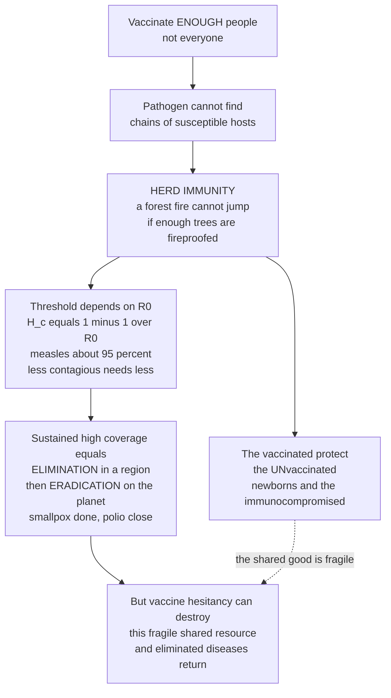

# 🛡️ Vaccination, Herd Immunity, and Elimination

> [!abstract] TL;DR
> Vaccination is public health's greatest triumph, and its most beautiful trick is a **collective** one: **herd immunity**. You do not have to vaccinate *everyone* to stop a disease — you only have to make **enough** people immune that the pathogen can no longer find an unbroken chain of susceptible hosts to spread through, so the transmission chains snap and the outbreak dies out. The consequence is profound: the vaccinated **protect the unvaccinated** — the newborns too young to immunize, the immunocompromised who cannot mount a response, the few for whom the vaccine failed. The exact "magic threshold" is set by how contagious the disease is, its **basic reproduction number R0**, through the clean formula **H_c = 1 − 1/R0**: measles, extraordinarily contagious at R0 near 15, needs roughly **95 percent** immune to break the chains, while a less contagious pathogen needs less. Keep coverage above that threshold across a whole region for long enough and a disease can be **eliminated** (driven to zero locally); sustain it worldwide and it can be **eradicated** forever, as humanity did with **smallpox** (the only human disease ever eradicated) and is close to doing with polio. But herd immunity is a **fragile shared resource** that vaccine hesitancy can destroy, letting eliminated diseases roar back the moment coverage dips. The herd-immunity threshold is the mathematical and moral heart of vaccination policy, and the capstone of infectious-disease control.

---

## Intuition

**Analogy: a forest fire and fireproofed trees.** Imagine a pathogen spreading through a population the way a fire spreads through a forest — jumping from one tree to the next wherever the branches touch. Now suppose you spray a fire-retardant coating on some of the trees, making them **immune** to catching. If you only coat a few, the fire still finds an easy path from unprotected tree to unprotected tree and burns the whole forest. But as you coat *more and more*, the untreated trees become increasingly **isolated** — surrounded by fireproofed neighbours that refuse to carry the flame. Cross a critical fraction and something remarkable happens: the fire can no longer jump far enough to sustain itself. It sputters and dies out — and crucially, it dies out *even though some trees were never coated at all*. The fireproofed trees end up protecting the vulnerable ones simply by breaking the chain between them.

That is **herd immunity**, and it is why you do not need to vaccinate 100 percent of people to stop a disease. Each immune person is a "dead end" for the pathogen; pack enough dead ends into the population and the chains of transmission fall apart. The unvaccinated who benefit are exactly the people who *cannot* be protected directly — the newborn too young for the shot, the child on chemotherapy whose immune system is switched off, the person for whom the vaccine simply did not "take." The threshold you must cross depends entirely on how contagious the disease is. **Measles** is the raging inferno of infectious disease — one case sparks around **15** others in a fully susceptible crowd — so you must fireproof roughly **95 percent** of the forest to stop it, which is exactly why measles comes roaring back the instant vaccination rates slip even a little. A less contagious pathogen is a gentler fire and needs a smaller immune fraction. Hold coverage above the threshold across a whole country and you **eliminate** the disease there; do it across the entire planet and you **eradicate** it forever — which humanity has managed exactly once, with **smallpox**, and is now agonizingly close to repeating with polio. Intuition first: protecting the *group* is what protects the *individual*, and how much protection each disease demands is a number you can compute.

---

## How It Works

### Core Mechanics

1. **Vaccination induces immunity without disease.** A vaccine presents the immune system with a harmless version or piece of a pathogen — a weakened (live-attenuated) or killed microbe, a protein subunit, or an mRNA blueprint — training it to recognize and neutralize the real thing on later exposure. This is **primary prevention** at population scale: it prevents disease from ever beginning, and unlike almost any medical treatment it protects not just the recipient but, through herd immunity, their neighbours too. See the immunological mechanism in [[Vaccines_and_Antibiotics]] and [[Infectious_Disease_Vaccines_and_Immunity]].

2. **Transmission is a chain, and immunity breaks links.** An epidemic sustains itself only if, on average, each infected person passes the pathogen to at least one new susceptible person before recovering. The **basic reproduction number R0** is the average number of secondary cases one case generates in a *fully susceptible* population — the raw contagiousness of the pathogen.

3. **The effective reproduction number falls as susceptibles are removed.** Once a fraction of the population is immune, an infected person meets fewer susceptibles, so the *realized* spread is the **effective reproduction number** **R_e = R0 × S**, where **S** is the fraction still susceptible. Vaccinating a fraction **p** (with a perfect vaccine) leaves S = 1 − p, so **R_e = R0 × (1 − p)**.

4. **Below R_e = 1 the chain dies.** An outbreak can only grow while R_e > 1 (each case more than replaces itself). Drive R_e below 1 and each case fails, on average, to replace itself, so cases dwindle to zero. Set R_e = 1 and solve: **R0 × (1 − p) = 1** gives the critical immune fraction.

5. **The herd-immunity threshold: H_c = 1 − 1/R0.** This is the fraction that must be immune to break sustained transmission. Because it depends only on R0, contagious diseases demand near-universal coverage while mild ones need little: measles (R0 ≈ 12–18) needs about **92–95 percent**; influenza (R0 ≈ 1.3–2) needs only about **25–50 percent**. Once immunity crosses H_c, even the *non-immune* are protected — the essence of community immunity.

6. **Adjusting for imperfect vaccines: critical coverage V_c = H_c / E.** Real vaccines are not perfectly protective. If a vaccine has efficacy **E** (the proportion of vaccinees it actually protects), you must vaccinate a *larger* fraction to reach the same immune fraction: **V_c = H_c / E = (1 − 1/R0) / E**. For measles with H_c = 0.94 and E ≈ 0.97, V_c ≈ 0.97 — leaving almost no room for missed children, which is why measles is the "canary in the coal mine" of falling coverage.

7. **Elimination, then eradication.** Hold coverage above V_c across a defined geographic **area** and incidence falls to **zero** there — **elimination** — but the disease can still be re-imported, so control must be *sustained*. Achieve zero worldwide and the pathogen has nowhere left to hide; interventions can then *stop* — **eradication**, a permanent, irreversible victory achieved for **smallpox** (declared 1980) in humans and rinderpest in cattle, with polio and Guinea worm near.

8. **The commons can collapse.** Herd immunity is a public good produced by everyone's vaccination and enjoyed by all — including free-riders who skip the shot and rely on others' immunity. Let coverage drift below the threshold and R_e climbs back above 1: eliminated diseases **resurge**. This collective-action fragility is a public-goods dilemma of the kind analysed in [[Price_of_Anarchy]].

### Flow / Architecture



*Read top to bottom: immunizing enough people snaps the transmission chains, herd immunity emerges, and the vaccinated shield the vulnerable unvaccinated. The threshold H_c = 1 − 1/R0 says exactly how much coverage each disease demands; sustained coverage climbs from regional elimination to global eradication — but hesitancy can pull coverage back below threshold and undo it.*

---

## Key Concepts

### Secondary (intuitive)

- **You do not need to vaccinate everyone.** If enough people around you are immune, a germ cannot find a path to keep spreading, so it dies out — that is **herd immunity**.
- **The vaccinated protect the unvaccinated.** Newborns too young for shots, and people whose immune systems are too weak, are shielded by the immune people surrounding them who never pass the germ along.
- **More contagious means more coverage needed.** Measles spreads so easily that almost everyone (about **95 percent**) must be immune to stop it. A less contagious disease needs fewer immune people.
- **Elimination vs eradication.** Push a disease to **zero in one country** and it is *eliminated*; push it to **zero on the whole planet** so it can never come back and it is *eradicated*. **Smallpox** is the only human disease ever eradicated.
- **Herd immunity is fragile.** It is a shared shield everyone helps build. If too many people skip their vaccines, the shield breaks and old diseases like measles come back.

### Undergraduate (formal)

- **Efficacy vs effectiveness.** **Efficacy** is the protection measured under the controlled conditions of a randomized trial; **effectiveness** is the protection seen in the messy real world (with imperfect storage, timing, and populations). Effectiveness is usually lower, and both feed into the coverage you must achieve.
- **R0 and R_e.** R0 is contagiousness in a fully susceptible population; the **effective** reproduction number **R_e = R0 × S** falls as the susceptible fraction S shrinks. Sustained transmission requires R_e > 1; control means driving and holding R_e < 1.
- **The herd-immunity threshold H_c = 1 − 1/R0.** Derived by setting R_e = 1: the critical immune fraction that just breaks transmission. It rises steeply with R0 (about 0.5 at R0 = 2, about 0.9 at R0 = 10, about 0.95 at R0 = 20).
- **Critical vaccination coverage V_c = H_c / E.** Because vaccines are imperfect (efficacy E < 1), the coverage needed exceeds the immune fraction: V_c = (1 − 1/R0) / E. When H_c / E exceeds 1, no coverage suffices with a single dose — you need boosters or a better vaccine.
- **Indirect protection.** Beyond herd immunity's threshold effect, high coverage also reduces the *force of infection* on everyone, cutting risk even for the unvaccinated well before the threshold is reached — the "herd effect."
- **Elimination vs eradication (formal).** **Elimination** = reduction of incidence to zero in a defined geographic area, requiring *continued* intervention against reintroduction. **Eradication** = permanent reduction of *global* incidence to zero, after which intervention can cease. Eradicability requires a human-only reservoir, an effective intervention, good diagnostics, and sustained political and financial will.

### Graduate (mechanistic and systems)

- **Homogeneous-mixing derivation and its limits.** H_c = 1 − 1/R0 assumes random, homogeneous mixing. Real contact networks are **heterogeneous** (superspreaders, age-assortative mixing, clustering). Heterogeneity in susceptibility can *lower* the effective threshold, while **clustering of the unvaccinated** (geographic or social) can make the population-average coverage misleading — pockets below threshold sustain outbreaks even when the national average looks safe. This is why measles erupts in undervaccinated communities inside highly vaccinated countries.
- **Age structure and critical vaccination.** With age-structured contact matrices (WAIFW — who-acquires-infection-from-whom), the naive H_c is refined; targeted vaccination of high-transmission groups (e.g., schoolchildren for influenza) can achieve control below the homogeneous threshold. The **critical age of vaccination** must beat the average age of infection, which itself *rises* as coverage climbs — a subtlety that can paradoxically shift disease into older, higher-risk ages if coverage is intermediate (as with rubella and congenital rubella syndrome).
- **Waning immunity and antigenic change.** Static thresholds assume durable, matched immunity. **Waning** (pertussis, mumps) reintroduces susceptibles over time, requiring boosters; **antigenic drift and shift** (influenza) mean last year's immunity does not count, forcing annual reformulation and resetting the herd-immunity clock. For such pathogens, a fixed H_c is a moving target.
- **The vaccination game and free-riding.** Herd immunity is a **public good**; individual-optimal behaviour can diverge from the social optimum because a person can free-ride on others' immunity, avoiding the (small) vaccine risk while enjoying the (large) collective protection. Game-theoretic models predict voluntary coverage stalls *below* the socially optimal level near elimination — a tragedy-of-the-commons that mandates, incentives, and default nudges are designed to overcome (see [[Price_of_Anarchy]]).
- **Eradication economics and the endgame paradox.** Eradication yields an *infinite* stream of averted cases with zero ongoing cost — the strongest possible cost-benefit case — but the **endgame** is the hardest and most expensive phase: the last few cases hide in the poorest, least accessible, most conflict-ridden places, and paradoxically the vaccine itself (live oral polio virus) can seed outbreaks, forcing a switch to inactivated vaccine. The smallpox eradication (via **ring vaccination** and surveillance-containment, not universal coverage) remains the template; polio and Guinea worm test whether it generalizes.

---

## Python Demo

```python
# Vaccination and herd immunity, two lessons in one figure:
#   (a) THE HERD-IMMUNITY THRESHOLD  H_c = 1 - 1/R0  vs R0 -- more contagious
#       diseases (higher R0, like measles) demand far higher immune coverage.
#       Real pathogens are marked on the curve. Then an SIR-with-vaccination
#       simulation shows that ABOVE the threshold the epidemic cannot take off
#       (protecting even the unvaccinated) while just BELOW it, it spreads.
#   (b) RESURGENCE vs ELIMINATION -- with R_e = R0*(1-coverage), a small drop in
#       coverage below threshold flips R_e above 1 and a disease RESURGES, while
#       sustained coverage above threshold drives incidence to zero (elimination).
import numpy as np
import matplotlib.pyplot as plt

# ---------- (a1) Herd-immunity threshold vs R0 ----------
R0_grid = np.linspace(1.01, 20, 500)
Hc = 1.0 - 1.0 / R0_grid                       # critical immune fraction

# Real diseases: (name, approximate R0)
diseases = [("Influenza", 1.5), ("Ebola", 2.0), ("COVID (ancestral)", 3.0),
            ("Smallpox", 5.0), ("Polio", 6.0), ("Mumps", 10.0),
            ("Pertussis", 14.0), ("Measles", 15.0)]

# ---------- (a2) SIR with vaccination: above vs below threshold ----------
def sir_vaccinated(R0, coverage, gamma=0.1, days=400, seed=1e-4):
    """Deterministic SIR; fraction 'coverage' starts immune. Returns I(t)."""
    beta = R0 * gamma
    S = 1.0 - coverage - seed                  # susceptibles left after vaccination
    I = seed
    R = coverage
    dt = 1.0
    Is = []
    for _ in range(days):
        new_inf = beta * S * I * dt
        new_rec = gamma * I * dt
        S += -new_inf
        I += new_inf - new_rec
        R += new_rec
        Is.append(I)
    return np.array(Is)

R0_measles = 15.0
Hc_measles = 1.0 - 1.0 / R0_measles            # ~0.933
cov_above = 0.96                               # above threshold  -> R_e < 1
cov_below = 0.88                               # below threshold  -> R_e > 1
I_above = sir_vaccinated(R0_measles, cov_above)
I_below = sir_vaccinated(R0_measles, cov_below)
Re_above = R0_measles * (1 - cov_above)
Re_below = R0_measles * (1 - cov_below)

# ---------- (b) Resurgence vs elimination trajectories ----------
years = np.arange(0, 21)
def trajectory(coverage, R0=15.0, start=100.0):
    """Yearly case counts: cases_{t+1} = cases_t * R_e, R_e = R0*(1-coverage)."""
    Re = R0 * (1 - coverage)
    return start * Re ** years, Re

cases_elim, Re_elim = trajectory(0.96)         # sustained high coverage -> decay
cases_resurge, Re_res = trajectory(0.88)       # coverage drop -> explosive growth

# ---------- (b2) R_e vs coverage: the phase transition ----------
cov_grid = np.linspace(0.75, 1.0, 300)
Re_grid = R0_measles * (1 - cov_grid)

# ================= PLOT =================
fig, axes = plt.subplots(2, 2, figsize=(14, 10))

# Panel (a1): threshold curve with diseases marked
ax = axes[0, 0]
ax.plot(R0_grid, Hc * 100, color="#0f766e", lw=2.8)
ax.fill_between(R0_grid, Hc * 100, 100, color="#0f766e", alpha=0.08)
for name, r0 in diseases:
    h = (1 - 1 / r0) * 100
    ax.scatter(r0, h, s=55, zorder=5, color="#b91c1c")
    ax.annotate(f"{name}\nR0~{r0:g}, {h:.0f}%", (r0, h),
                textcoords="offset points", xytext=(6, -4), fontsize=7.5)
ax.set_xlabel("Basic reproduction number  R0")
ax.set_ylabel("Herd-immunity threshold  H_c  (percent immune)")
ax.set_title("(a1) H_c = 1 - 1/R0: contagious diseases demand near-universal coverage")
ax.set_ylim(0, 105)
ax.grid(alpha=0.3)

# Panel (a2): SIR with vaccination -- above vs below threshold
ax = axes[0, 1]
ax.plot(I_below * 100, color="#b91c1c", lw=2.5,
        label=f"Coverage {cov_below:.0%}  ->  R_e = {Re_below:.2f}  (epidemic)")
ax.plot(I_above * 100, color="#0f766e", lw=2.5,
        label=f"Coverage {cov_above:.0%}  ->  R_e = {Re_above:.2f}  (dies out)")
ax.axhline(0, color="gray", lw=0.8)
ax.set_xlabel("Days")
ax.set_ylabel("Percent of population infectious")
ax.set_title("(a2) Measles SIR: above the threshold the epidemic cannot take off")
ax.legend(loc="upper right", fontsize=8.5)
ax.grid(alpha=0.3)

# Panel (b1): R_e vs coverage -- the phase transition at H_c
ax = axes[1, 0]
ax.plot(cov_grid * 100, Re_grid, color="#7c3aed", lw=2.8)
ax.axhline(1.0, color="gray", ls="--", lw=1.5, label="R_e = 1  (control threshold)")
ax.axvline(Hc_measles * 100, color="#b45309", ls=":", lw=1.8,
           label=f"H_c = {Hc_measles*100:.1f}%")
ax.fill_between(cov_grid * 100, 1.0, Re_grid, where=(Re_grid > 1),
                color="#b91c1c", alpha=0.15, label="RESURGENCE zone  R_e > 1")
ax.fill_between(cov_grid * 100, Re_grid, 1.0, where=(Re_grid <= 1),
                color="#0f766e", alpha=0.15, label="CONTROL zone  R_e < 1")
ax.set_xlabel("Vaccination coverage (percent)")
ax.set_ylabel("Effective reproduction number  R_e")
ax.set_title("(b1) A small coverage drop below H_c flips R_e above 1")
ax.legend(loc="upper right", fontsize=8)
ax.grid(alpha=0.3)

# Panel (b2): elimination vs resurgence trajectories (log scale)
ax = axes[1, 1]
ax.semilogy(years, np.clip(cases_elim, 1e-2, None), "o-", color="#0f766e", lw=2.3,
            label=f"Sustained 96% -> R_e={Re_elim:.2f}: ELIMINATION")
ax.semilogy(years, cases_resurge, "s-", color="#b91c1c", lw=2.3,
            label=f"Dropped to 88% -> R_e={Re_res:.2f}: RESURGENCE")
ax.set_xlabel("Years")
ax.set_ylabel("Annual cases (log scale)")
ax.set_title("(b2) Same disease, two coverage paths: elimination vs measles rebound")
ax.legend(loc="center left", fontsize=8.5)
ax.grid(alpha=0.3, which="both")

plt.tight_layout()
plt.savefig("vaccination_herd_immunity.png", dpi=120, bbox_inches="tight")

# ---------- printed summary ----------
print("Herd-immunity threshold H_c = 1 - 1/R0 for real diseases:")
for name, r0 in diseases:
    print(f"  {name:20s} R0~{r0:5.1f}  ->  H_c = {(1-1/r0)*100:5.1f}% immune needed")
print(f"\nMeasles SIR: coverage {cov_above:.0%} gives R_e={Re_above:.2f} (no epidemic); "
      f"{cov_below:.0%} gives R_e={Re_below:.2f} (epidemic).")
print(f"Trajectories: 96% coverage -> cases decay to elimination; "
      f"88% coverage -> cases grow {Re_res:.2f}x per generation (resurgence).")
```

**What you see.** *Panel (a1)* is the mathematical heart of the note: the curve **H_c = 1 − 1/R0** climbs steeply, and real pathogens sit along it — influenza near the bottom needing only about a third of people immune, measles and pertussis near the top demanding **93–95 percent**. The shaded region above the curve is the coverage that achieves herd immunity. *Panel (a2)* runs an actual **SIR epidemic with vaccination** for measles: at **96 percent** coverage the effective reproduction number R_e = 0.60 is below 1 and the seeded infection simply fades — the epidemic *cannot take off*, protecting even the 4 percent unvaccinated — while at **88 percent** coverage R_e = 1.80 unleashes a full outbreak. *Panel (b1)* draws the sharp **phase transition**: as coverage falls, R_e = R0 × (1 − coverage) rises linearly and crosses the critical value 1 exactly at the herd-immunity threshold — a red "resurgence zone" opens the moment coverage dips below it. *Panel (b2)* shows the two destinies of the *same* disease: sustained high coverage drives annual cases geometrically toward zero (**elimination**), while a modest drop to 88 percent lets cases multiply by 1.8 each generation into an explosive **measles rebound**. The whole figure makes the policy lesson concrete: a few percentage points of coverage separate a controlled disease from a returning epidemic.

---

## Real-World Applications

- **Smallpox eradication (1980) — humanity's greatest health victory.** The only human disease ever eradicated. The WHO campaign succeeded not through universal coverage but through **ring vaccination**: find each case, vaccinate every contact and contact-of-contact, and starve the virus of susceptible hosts. Smallpox's eradicability rested on a human-only reservoir, no asymptomatic carriers, an effective heat-stable vaccine, and an obvious rash for surveillance. It ended a disease that killed an estimated 300 million people in the 20th century alone.
- **Polio — the near-finish and the endgame.** Wild poliovirus is eliminated from all but a handful of endemic pockets, thanks to the Global Polio Eradication Initiative — a >99 percent reduction since 1988. The endgame exposes the hard truths of eradication: the last cases hide in insecure, hard-to-reach regions, and the live oral vaccine can rarely seed **vaccine-derived** outbreaks, forcing a transition to inactivated vaccine. It is the clearest live test of whether the smallpox template generalizes.
- **Measles — the sentinel of falling coverage.** With R0 ≈ 12–18, measles requires the highest herd-immunity threshold of any common vaccine-preventable disease, so it is the *first* to return when coverage slips. Outbreaks in the US, UK, and Europe over the past decade — traced to under-vaccinated clusters seeded by hesitancy and the disproven MMR-autism claim — are textbook demonstrations that herd immunity is a threshold, not a cushion.
- **The MMR-autism fraud and its toll.** A 1998 paper claiming a link between the MMR vaccine and autism was retracted, its author struck off, and its claim refuted by dozens of large studies covering millions of children. Yet it eroded coverage below the measles threshold in several countries, directly causing resurgent outbreaks and deaths — a case study in how misinformation attacks the shared commons of herd immunity.
- **COVID-19 — the limits of a static threshold.** Early "herd immunity" estimates assumed durable, transmission-blocking immunity. Waning protection, immune escape by new variants, and a rising R0 (Omicron) moved the threshold faster than coverage could catch it, shifting the goal from *elimination* to reducing severe disease — a real-world lesson in how waning and antigenic change dissolve a fixed H_c.

---

## Common Pitfalls

- **Treating the threshold as a cushion instead of a cliff.** Coverage of 90 percent "feels" close to 95, but for measles the difference flips R_e from below 1 to well above 1 — controlled disease to full outbreak. The herd-immunity threshold is a sharp phase transition, not a gentle gradient; a few points matter enormously.
- **Confusing the immune fraction with vaccination coverage.** Because vaccines are imperfect, the coverage you must achieve, V_c = H_c / E, is *higher* than the immune fraction H_c. Reporting 95 percent *coverage* with a 90 percent-effective vaccine leaves only about 85 percent actually immune — potentially below threshold.
- **Assuming a well-mixed population.** National average coverage can sit safely above threshold while **geographic or social clusters** of unvaccinated people fall far below it. Homogeneous-mixing math hides these pockets, which is precisely where measles and pertussis outbreaks ignite. Coverage equity matters as much as the average.
- **Confusing elimination with eradication.** Elimination is *local zero* that still requires ongoing vaccination against re-importation; eradication is *global zero* that lets you stop. Declaring victory and relaxing coverage after elimination invites re-importation and resurgence — the classic post-elimination trap.
- **Ignoring waning immunity and antigenic change.** A fixed H_c assumes lifelong, matched immunity. Pertussis and mumps immunity wanes; influenza antigens drift. Without boosters or reformulation, the immune fraction silently erodes below threshold even with high *ever-vaccinated* coverage.
- **Underestimating the free-rider problem.** As a disease becomes rare, the perceived personal benefit of vaccination shrinks while (misperceived) vaccine risk looms larger, tempting individuals to free-ride on herd immunity. Voluntary coverage then stalls below the social optimum — a predictable collective-action failure, not irrationality, that policy must actively counter.

---

## Related Concepts

**Within this vault (Section 04 – Infectious Disease Epidemiology, prose references).** This note is the capstone of infectious-disease control and rests on its sibling notes. *Infectious_Disease_Epidemiology* introduces the transmission concepts — reservoirs, modes of spread, incubation, and the case-tracking machinery — that vaccination interrupts. *Epidemic_Dynamics_and_Compartmental_Models* supplies the SIR and R0 mathematics from which the herd-immunity threshold H_c = 1 − 1/R0 is derived; this note is the applied payoff of that model. *Pandemics_and_Emerging_Infections* is the flip side — what happens when a novel pathogen with no vaccine and no immunity spreads unchecked, and why rapid vaccine development races the epidemic curve. *Surveillance_and_Disease_Monitoring* provides the case-detection and coverage data that tell us whether we are above or below threshold and whether elimination has truly been achieved. *Health_Policy_and_Economics_of_Public_Health* frames the cost-effectiveness of immunization, mandates versus nudges, and the equitable global access on which eradication ultimately depends. (These siblings are referenced in prose as the section fills in.)

**Across the vault (Glob-verified links).**

- [[Infectious_Disease_Vaccines_and_Immunity]] — the public-health companion covering vaccine types, schedules, and the individual-plus-population benefit that this note formalizes as herd immunity. *(Health, Nutrition & Longevity vault)*
- [[Vaccines_and_Antibiotics]] — the immunological mechanism beneath vaccination: how a vaccine trains adaptive immunity to prevent disease without causing it, the biology underlying every dead-end in the transmission chain. *(Biology vault)*
- [[Infectious_Disease_and_Host_Pathogen_Interaction]] — the clinical and mechanistic view of how pathogens infect hosts and how immunity resists them, the individual-level counterpart to population-level herd immunity. *(Clinical Medicine vault)*
- [[Price_of_Anarchy]] — the game-theoretic cost of selfish behaviour versus the social optimum; herd immunity is a public good and vaccine hesitancy a free-riding failure of exactly this kind, where individually rational choices leave the population below the socially optimal coverage. *(Game Theory vault)*

---

## Review Questions

### Secondary

1. Using the forest-fire analogy, explain why you do not have to vaccinate *everyone* to stop a disease, and why the vaccinated end up protecting people who were never vaccinated (like newborns).
2. Measles needs about 95 percent of people immune to stop it, but a milder disease needs fewer. In one sentence, explain what makes measles need such a high number.
3. What is the difference between **eliminating** a disease and **eradicating** it? Name the one human disease that has actually been eradicated.

### Undergraduate

1. Derive the herd-immunity threshold **H_c = 1 − 1/R0** by setting the effective reproduction number R_e = R0 × (1 − p) equal to 1. Then compute H_c for a disease with R0 = 4 and for measles with R0 = 16, and explain why the difference matters for policy.
2. A vaccine is 90 percent effective and a disease has R0 = 5. Compute the immune fraction H_c you need and the actual **vaccination coverage** V_c = H_c / E required. Why is V_c larger than H_c, and what happens if H_c / E exceeds 1?
3. A country reports 94 percent national measles vaccination coverage yet suffers repeated outbreaks. Give two distinct reasons (rooted in the assumptions behind H_c) why a high *average* coverage can still fail to achieve herd immunity.

### Graduate

1. The formula H_c = 1 − 1/R0 assumes homogeneous mixing. Explain how (a) **clustering of unvaccinated individuals** and (b) **heterogeneity in contact rates / susceptibility** each cause the true effective threshold to differ from the homogeneous prediction, and what each implies for how vaccination should be *targeted* rather than uniformly distributed.
2. Frame vaccination as a **public-goods game**. Explain why voluntary uptake tends to stall *below* the social optimum as a disease approaches elimination, why this is individually rational rather than irrational, and evaluate three policy levers (mandates, financial incentives, default/opt-out nudges) for closing the gap. Connect to the tragedy-of-the-commons and free-riding.
3. Contrast **elimination** and **eradication** in terms of the ongoing intervention each requires, and lay out the four criteria for a disease to be *eradicable*. Then explain the "endgame paradox": why the final phase of eradication is the hardest and most expensive, using polio's vaccine-derived-virus problem as the illustration, and argue whether the smallpox ring-vaccination template generalizes.

---

## Sources

- Anderson, R. M., & May, R. M. (1991). *Infectious Diseases of Humans: Dynamics and Control.* Oxford University Press — the mathematical foundation of R0, R_e, and the herd-immunity threshold H_c = 1 − 1/R0.
- Fine, P. E. M. (1993). *Herd Immunity: History, Theory, Practice.* Epidemiologic Reviews, 15(2), 265–302. [https://doi.org/10.1093/oxfordjournals.epirev.a036121](https://doi.org/10.1093/oxfordjournals.epirev.a036121) — the definitive review of the concept, thresholds, and critical coverage.
- Plotkin, S. A., Orenstein, W. A., Offit, P. A., & Edwards, K. M. (eds.). *Plotkin's Vaccines* (7th ed.). Elsevier — the standard reference on vaccine types, efficacy versus effectiveness, and immunization programs.
- Fenner, F., Henderson, D. A., Arita, I., Ježek, Z., & Ladnyi, I. D. (1988). *Smallpox and Its Eradication.* World Health Organization. [https://apps.who.int/iris/handle/10665/39485](https://apps.who.int/iris/handle/10665/39485) — the official history of the only human disease ever eradicated.
- Centers for Disease Control and Prevention. *Epidemiology and Prevention of Vaccine-Preventable Diseases* ("The Pink Book"). [https://www.cdc.gov/vaccines/pubs/pinkbook/index.html](https://www.cdc.gov/vaccines/pubs/pinkbook/index.html) — coverage targets, herd immunity, and elimination/eradication goals in practice.

---

#epidemiology #vaccination #herd-immunity #eradication #smallpox
