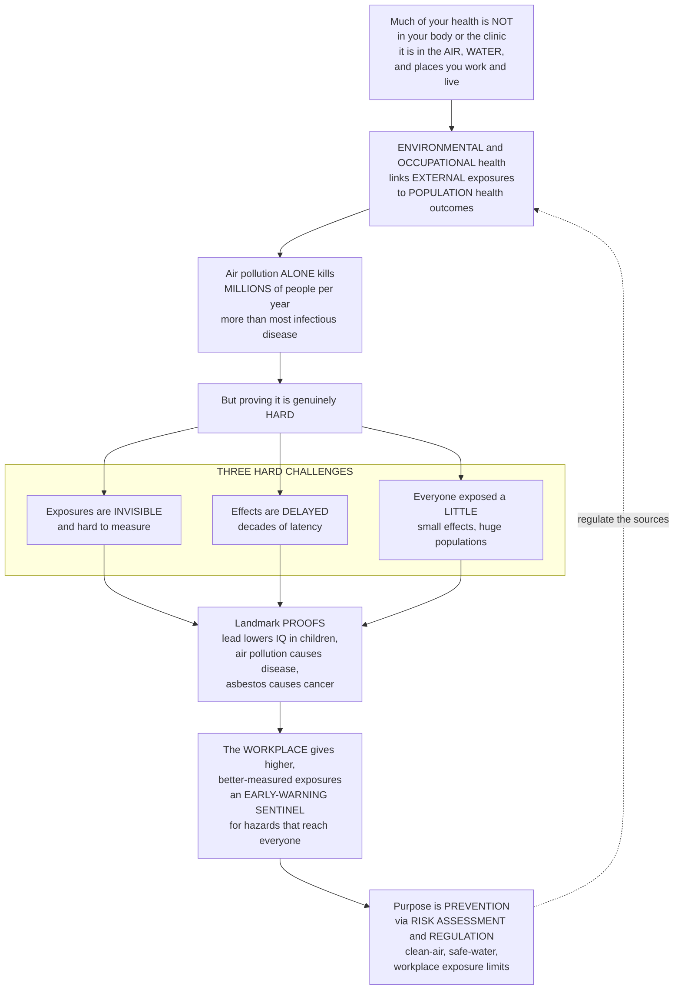

# 🏭 Environmental and Occupational Health

> [!abstract] TL;DR
> **Most of what determines your health is not inside your body or your doctor's office — it is in the *air* you breathe, the *water* you drink, and the places you *work* and *live*.** Environmental and occupational health is the **epidemiology of these external exposures**, and its impact is staggering: **air pollution alone kills millions of people every year worldwide** — more than most infectious diseases combined. The field's job is to link environmental exposures to health outcomes *across whole populations*, and it faces uniquely hard problems: exposures are often **invisible and hard to measure** (how much lead, exactly, did a whole neighbourhood absorb over twenty years?), effects can take **decades** to surface (asbestos causing cancer thirty years later), and *everyone* is exposed to a little — so you are hunting for **small effects in enormous populations**. This is where landmark epidemiology earned its stripes: proving that **lead lowers children's IQ**, that **air pollution causes heart and lung disease**, that **asbestos causes mesothelioma**. The **occupational** angle is powerful because the *workplace* delivers higher, better-measured exposures — coal miners' black lung, a chemical plant's cancer cluster — and so acts as an **early-warning sentinel** for hazards that later prove to affect everyone. The ultimate purpose is **prevention through regulation**: clean-air standards, safe drinking-water limits, and workplace exposure limits exist because environmental epidemiology *proved* the harm and **risk assessment** quantified "how much is safe." This note is the **population/epidemiologic** view; it complements the [[Health_Nutrition_and_Longevity/06_Public_Health_and_Prevention/Environmental_Health_and_Toxicology|toxicology note]], which supplies the dose-response biology beneath it.

---

## Intuition

**Analogy — the environment is a slow, silent author writing on your whole neighbourhood at once.** A clinician treats one patient with one sharp diagnosis. Environmental epidemiology reads a *biography written by the air, the water, and the workplace* — not on one person, but on an entire population, one faint letter per day, over decades. The lead in old pipes, the fine soot from traffic, the asbestos fibre inhaled on a shipyard floor: none of them announce themselves. There is no cough at the moment of injury, no bruise, no name attached to the pen. By the time the words are legible — a town's children with lower IQs, a cohort of welders with excess heart attacks, a factory's cluster of a rare cancer — the writing has been going on for a generation and the author is almost impossible to identify.

That is exactly what makes this field *hard*, and exactly why it matters. The signal is **invisible** (you cannot see PM2.5 or feel a microgram of lead), **delayed** (asbestos and mesothelioma are separated by thirty years), and **ubiquitous** (nearly everyone breathes polluted air a little, so you are chasing a *small* per-person risk hiding inside a *huge* population). And yet — here is the punchline — a tiny risk multiplied across millions of people becomes one of the largest death tolls on Earth. The whole discipline exists to make that invisible, delayed, diffuse harm *visible enough to regulate*: to prove the harm, quantify how much is safe, and then clean the air, filter the water, and cap the workplace dose before the next generation is exposed.

---

## How It Works

### Core mechanics

**1. Why the *population* view is indispensable.** The complementary toxicology note asks "what does this dose do to *a body*?" Environmental **epidemiology** asks "what does this exposure do to *a population*?" — because the harms that matter most are precisely the ones a single clinic visit cannot see. A per-person risk so small it is invisible in one patient becomes a public-health catastrophe once multiplied across a city. The field's central move is therefore to convert an individual-level exposure-response relationship into a **population attributable burden**.

**2. The exposure classes and their burden.** Environmental health catalogues where the harm comes from:
- **Air pollution** — **particulate matter (PM2.5, PM10)**, **ozone**, **nitrogen dioxide (NO2)**, both outdoor (traffic, industry) and indoor (household cooking smoke). This is a *leading global cause of mortality*, driving cardiovascular and respiratory disease and, increasingly, cognitive decline.
- **Water and sanitation** — pathogens, **arsenic**, and **lead** (the neurodevelopmental toxin behind the Flint crisis).
- **Toxic chemicals and heavy metals** — lead, mercury, pesticides, endocrine disruptors, and the persistent "forever chemicals," **PFAS**.
- **Radiation** — UV, radon, ionizing sources.
- **Climate change** — heat, shifting vector ranges, disasters (see the anthropogenic-climate note).
- The **built environment** and **food safety**, and the unifying idea of the **exposome** — the *totality of lifetime exposures*, the environmental complement to the genome.

**3. Occupational health — the workplace as a sentinel.** Workplaces concentrate hazards into **higher, better-characterized doses** than the general environment ever delivers: the **pneumoconioses** (coal workers' black lung, **silicosis**, and **asbestos** → mesothelioma), chemical exposures, noise-induced hearing loss, and ergonomic/injury risks. Because a factory cohort has a *known job, a known chemical, and a measurable dose*, occupational studies historically detected hazards *first* — serving as an **early-warning system** for exposures (asbestos, vinyl chloride, benzene) that later turned out to threaten the wider public. The catch is a built-in selection bias: the **healthy-worker effect**, where employed people are healthier than the general population, can *mask* a real occupational hazard unless the comparison group is chosen carefully.

**4. The four epidemiologic challenges.** Proving environmental harm is uniquely difficult:
- **Exposure assessment** — usually the hardest part. Exposures are invisible and must be reconstructed from **biomarkers** (blood lead, urinary metabolites), **environmental monitoring**, and job-exposure matrices; imperfect measurement causes **exposure misclassification** that biases effects, usually toward the null.
- **Long latency** — decades can separate exposure from disease, so studies need enormous follow-up and cases appear long after the exposure has changed (chronic-disease epidemiology).
- **Low-level ubiquitous exposure** — everyone gets a little, so **relative risks are small** but the **population attributable burden is vast**; **cohort** and **ecological** designs are the workhorses.
- **Confounding and causation** — pollution tracks with poverty, diet, and stress, so isolating the exposure and building a case strong enough to *regulate* demands Bradford-Hill-style reasoning, natural experiments, and biomarkers rather than randomized trials.

**5. Risk assessment — the regulatory payoff.** The formal bridge from science to policy is the four-step **risk-assessment framework**: **hazard identification** (can it cause harm?) → **dose-response assessment** (how much causes how much?) → **exposure assessment** (how much are people actually getting?) → **risk characterization** (the population risk with its uncertainty). This feeds **regulation and standards** — clean-air and safe-water limits, occupational exposure limits (OSHA/NIOSH), chemical bans, and the **precautionary principle**. It also exposes the **environmental-justice** dimension: exposure burden is *not* distributed by lottery but piles up on communities defined by poverty and race. Prevention itself follows a **hierarchy of controls**: elimination > substitution > engineering controls > administrative controls > personal protective equipment (PPE).

### Flow / architecture



---

## Key Concepts

### Secondary (intuitive foundation)
- **Your surroundings shape your health.** Dirty air, unsafe water, and hazardous workplaces cause a huge amount of disease — often *more* than medical care can undo — yet it is easy to ignore because the harm is slow and invisible.
- **Air pollution is a hidden mass killer.** The fine particles you cannot see (PM2.5) get deep into the lungs and bloodstream and cause heart and lung disease; worldwide, air pollution kills *millions* of people every year.
- **A little poison across many people adds up.** Even a *tiny* risk to each person becomes an enormous number of deaths when a whole city breathes it — small risk times big population equals big harm.
- **Some harms take decades to appear.** A worker breathing asbestos dust today may not develop cancer for thirty years, which is why the danger is so easy to miss and so important to prevent early.
- **Workplaces are the canary in the coal mine.** Jobs with high, measurable exposures (miners, factory workers) revealed dangers *first*, warning us about hazards that later affected everyone.
- **Prevention beats cure.** We have clean-air rules, safe-water limits, and workplace safety limits because scientists proved these exposures cause harm — stopping the exposure is the whole point.

### Undergraduate (mechanisms and metrics)
- **Environmental health defined.** The branch of public health addressing how the physical, chemical, and biological environment affects human health; the major exposure classes are **air, water, chemicals/metals, radiation, climate, and the built environment**.
- **The exposome.** The totality of environmental exposures across a lifetime — the missing environmental half of "nature and nurture" that genomics alone cannot capture.
- **Exposure assessment.** The often-hardest step: measuring exposure via **biomarkers**, **environmental monitoring**, and **job-exposure matrices**; imperfect measurement produces **exposure misclassification**, which typically biases estimated effects *toward the null*.
- **Exposure-response, no clear threshold.** For pollutants like PM2.5 the exposure-response relationship is often roughly *linear with no safe threshold* — risk keeps falling as concentration falls, even below current guidelines.
- **Population attributable burden.** Small per-person relative risks, multiplied across a large exposed population, yield a large *number* of attributable deaths — why ubiquitous low-level exposures matter enormously (cohort and ecological designs quantify this).
- **Occupational diseases and the sentinel role.** Pneumoconioses (**coal, silica, asbestos**), chemical carcinogens, noise, and injury; higher, better-measured workplace doses make occupational cohorts an early-warning system for population-wide hazards.
- **The healthy-worker effect.** A **selection bias**: employed populations are systematically healthier than the general population, so a naive comparison can hide a genuine occupational hazard.
- **The four-step risk assessment.** Hazard identification → dose-response → exposure assessment → risk characterization (US NRC "Red Book," 1983) — the formal pipeline from science to a numeric "safe" limit.

### Graduate (systems and control)
- **Latency and chronic-disease design.** Decades between exposure and disease demand long-running cohorts, careful handling of induction/latency periods, and awareness that current cases reflect *past* exposure — complicating attribution and evaluation of interventions.
- **Small relative risks, big attributable fractions.** Distinguish **relative risk** (small for ubiquitous pollutants) from the **population attributable fraction/burden** (large), and recognize that ecological/cohort studies estimating a slope near zero can still imply hundreds of thousands of deaths.
- **Exposure misclassification and its direction.** Non-differential misclassification of a continuous exposure generally attenuates the estimate toward the null; differential misclassification can bias either way — central to interpreting weak environmental signals (see the bias note).
- **Threshold vs linear-no-threshold at the population scale.** Whether a pollutant or carcinogen has a genuine safe threshold or acts under **linear-no-threshold** logic determines the shape of the population dose-response and the entire cost-benefit calculus of a standard (developed in the toxicology note).
- **The precautionary principle vs risk-based regulation.** When harm is plausible but not proven for a slow, low-dose, long-latency exposure, do regulators act (precaution, burden on the emitter) or wait for demonstrated risk (risk-based, burden on the regulator)? Both fail predictably; the choice is where most environmental-policy fights live.
- **Environmental justice.** The systematic co-location of pollution sources with poor and minority communities means exposure, confounding, and health inequity are entangled — an equity problem inseparable from the causal one.
- **Hierarchy of controls.** Prevention is ranked: **elimination > substitution > engineering controls > administrative controls > PPE** — a formal reason PPE (the last resort) is the *weakest* control, not the first.

---

## Python Demo

```python
# Environmental / occupational epidemiology, three hard-to-grasp ideas visualized:
#   (a) EXPOSURE-RESPONSE with NO clear threshold -- air-pollution (PM2.5)
#       concentration vs per-person excess mortality risk (roughly linear).
#   (b) POPULATION ATTRIBUTABLE BURDEN -- how a TINY per-person risk, multiplied
#       across a whole population, becomes a HUGE total death toll (why ubiquitous
#       low-level exposures matter enormously).
#   (c) LONG LATENCY -- an exposure pulse NOW (e.g. asbestos) produces disease
#       (mesothelioma) only DECADES later, peaking ~35 years after exposure.
# numpy + matplotlib only. Parameters are illustrative, not exact epidemiology.
import numpy as np
import matplotlib.pyplot as plt

# ---------- (a) exposure-response: PM2.5 -> excess mortality, no threshold -----
conc = np.linspace(0, 100, 500)          # PM2.5 concentration, ug/m^3
C0   = 2.4                               # theoretical-minimum-risk concentration
beta = 0.006                             # ~6% higher all-cause mortality per 10 ug/m^3
baseline = 800.0                         # baseline all-cause deaths per 100,000 / yr
RR = 1.0 + beta * np.maximum(conc - C0, 0.0)     # relative risk vs counterfactual
excess_per_100k = baseline * (RR - 1.0)          # attributable deaths per 100,000

WHO_2021 = 5.0      # WHO annual PM2.5 guideline (ug/m^3)
POLLUTED = 75.0     # a heavily polluted megacity

# ---------- (b) population attributable burden --------------------------------
mean_pm = 20.0                                   # mean population exposure above C0
per_person_risk = (baseline / 1e5) * beta * mean_pm   # annual excess death prob / person
pops = np.linspace(0, 300, 500)                  # population size, MILLIONS
attributable = pops * 1e6 * per_person_risk      # total attributable deaths / year
city_deaths    = 10.0  * 1e6 * per_person_risk   # a 10-million city
country_deaths = 300.0 * 1e6 * per_person_risk   # a 300-million country

# ---------- (c) latency: exposure now, disease decades later ------------------
years = np.arange(0, 61)                         # years since a one-time exposure
k, theta = 7.0, 5.0                              # gamma-shaped latency, peak at k*theta = 35
latency = (years ** k) * np.exp(-years / theta)
latency = latency / latency.max() * 100.0        # scaled to "cases per year" at peak
peak_year = years[np.argmax(latency)]

fig, ax = plt.subplots(1, 3, figsize=(18, 5.2))

# Panel A -----------------------------------------------------------------------
ax[0].plot(conc, excess_per_100k, lw=2.6, color="#c0392b")
ax[0].axvline(WHO_2021, ls="--", color="#0369a1")
ax[0].axvline(POLLUTED, ls=":", color="gray")
ax[0].annotate("WHO 2021\nguideline (5)", xy=(WHO_2021, excess_per_100k.max()*0.7),
               xytext=(14, excess_per_100k.max()*0.78), color="#0369a1", fontsize=8,
               arrowprops=dict(arrowstyle="->", color="#0369a1"))
ax[0].annotate("polluted\nmegacity (75)", xy=(POLLUTED, np.interp(POLLUTED, conc, excess_per_100k)),
               xytext=(45, np.interp(POLLUTED, conc, excess_per_100k)*0.45), fontsize=8,
               arrowprops=dict(arrowstyle="->", color="gray"))
ax[0].text(6, 6, "risk keeps rising even\nBELOW the guideline\n(no safe threshold)",
           color="#c0392b", fontsize=8)
ax[0].set_title("(a) Exposure-response: PM2.5 has NO clear threshold")
ax[0].set_xlabel("PM2.5 concentration (ug/m^3)")
ax[0].set_ylabel("Excess deaths per 100,000 / yr")
ax[0].grid(alpha=0.3)

# Panel B -----------------------------------------------------------------------
ax[1].plot(pops, attributable, lw=2.6, color="#2e8b57")
ax[1].plot([10], [city_deaths], "o", color="black", ms=8)
ax[1].plot([300], [country_deaths], "o", color="black", ms=8)
ax[1].annotate(f"10M city\n~{city_deaths:,.0f} deaths/yr", xy=(10, city_deaths),
               xytext=(30, city_deaths + attributable.max()*0.18), fontsize=8,
               arrowprops=dict(arrowstyle="->"))
ax[1].annotate(f"300M country\n~{country_deaths:,.0f} deaths/yr", xy=(300, country_deaths),
               xytext=(150, country_deaths*0.55), fontsize=8,
               arrowprops=dict(arrowstyle="->"))
ax[1].text(8, attributable.max()*0.05,
           f"per-person risk is TINY:\n{per_person_risk*100:.3f}% per year",
           color="#2e8b57", fontsize=8)
ax[1].set_title("(b) Tiny individual risk x huge population = massive burden")
ax[1].set_xlabel("Exposed population (millions)")
ax[1].set_ylabel("Total attributable deaths / yr")
ax[1].grid(alpha=0.3)

# Panel C -----------------------------------------------------------------------
ax[2].axvline(0, color="black", lw=2.0)
ax[2].text(0.6, 95, "EXPOSURE\n(e.g. asbestos)", color="black", fontsize=8)
ax[2].plot(years, latency, lw=2.6, color="#7c3aed")
ax[2].fill_between(years, latency, color="#7c3aed", alpha=0.15)
ax[2].axvline(peak_year, ls="--", color="gray")
ax[2].annotate(f"disease peaks ~{peak_year} yrs\nAFTER exposure",
               xy=(peak_year, 100), xytext=(peak_year - 33, 60), fontsize=8,
               arrowprops=dict(arrowstyle="->", color="gray"))
ax[2].set_title("(c) Long latency: exposure now, cancer decades later")
ax[2].set_xlabel("Years since exposure")
ax[2].set_ylabel("Mesothelioma incidence (relative)")
ax[2].grid(alpha=0.3)

plt.tight_layout()
plt.savefig("environmental_occupational_health.png", dpi=120, bbox_inches="tight")
plt.show()

# Numeric takeaways
print(f"Excess deaths per 100k at PM2.5 = 75    : {np.interp(75, conc, excess_per_100k):.1f}")
print(f"Per-person annual excess death risk     : {per_person_risk*100:.3f}%  (tiny)")
print(f"...but a 10M city -> {city_deaths:,.0f} attributable deaths/yr")
print(f"...and a 300M country -> {country_deaths:,.0f} attributable deaths/yr")
print(f"Disease incidence peaks {peak_year} years after the exposure (latency)")
```

**What it shows.** Panel (a) draws the exposure-response line for PM2.5 as **linear with no safe threshold** — attributable mortality keeps climbing right down through and *below* the WHO guideline, so there is no concentration you can declare "clean." Panel (b) is the field's most important and least intuitive fact made visible: the *individual* excess risk is minuscule (a fraction of a percent per year), yet the same slope multiplied by a **10-million city** produces roughly ten thousand deaths a year, and across a **300-million country** hundreds of thousands — which is why ubiquitous low-level exposures dominate the global disease burden. Panel (c) captures the **latency** trap: an exposure at year zero yields no disease for decades, with incidence peaking around 35 years later — the reason asbestos was banned long after workers were harmed, and the reason environmental epidemiology needs lifelong follow-up to see what a clinic never can.

---

## Real-World Applications

- **Leaded gasoline and children's IQ.** Decades of environmental epidemiology tied even low blood-lead levels to lower IQ and behavioural harm in children, establishing that lead has *no known safe level*. The phase-out of leaded gasoline and paint drove population blood-lead down by roughly 90 percent — one of public health's greatest prevention victories — and the **Flint water crisis** showed how quickly the harm returns when the safeguards fail.
- **The Harvard Six Cities Study (Dockery et al., 1993).** A landmark prospective cohort that linked long-term **PM2.5** exposure to increased cardiopulmonary mortality across six US cities, providing the causal backbone for the EPA's fine-particle standards and the WHO air-quality guidelines. It is the archetype of turning a small per-person relative risk into an enforceable population-protecting limit.
- **Asbestos and mesothelioma.** Occupational cohorts of insulators, shipyard workers, and miners revealed that asbestos causes a rare, almost uniformly fatal cancer after a **30-to-40-year latency** — the workplace acting as a sentinel that eventually justified near-global bans, decades after the exposures occurred.
- **Occupational exposure limits (OSHA/NIOSH).** Permissible exposure limits for benzene, silica, noise, and hundreds of chemicals are risk-assessment outputs: dose-response plus exposure assessment set the number, and the hierarchy of controls (elimination first, PPE last) sets how it is met.
- **Household air pollution.** Cooking with solid fuels indoors exposes billions to high PM2.5, causing a large share of global respiratory and cardiovascular deaths — a burden concentrated in low-income households, tackled through clean-cookstove and fuel-switching programs.
- **Climate change as a health threat multiplier.** Heat waves, expanding vector ranges, wildfire smoke, and worsened air quality push climate squarely into environmental epidemiology (see the anthropogenic-climate note), and the burden falls hardest on the same communities that already bear the pollution load.

---

## Common Pitfalls

- **Dismissing a real risk because it is "small" per person.** The cardinal error: because each individual's excess risk from PM2.5 or low-level lead is tiny, it looks negligible — but multiplied across millions it is one of the largest killers on Earth. Judging ubiquitous exposures by *individual* rather than *population* impact drastically understates them.
- **Ignoring latency and cutting follow-up short.** Effects can lag exposure by decades; a study that stops after ten years can *miss a real carcinogen entirely*, and current disease rates reflect *past* exposure, so an intervention can look useless simply because its payoff has not yet arrived.
- **Mismeasuring exposure and trusting the null.** Exposure assessment is the hardest step; crude proxies cause **exposure misclassification** that usually biases estimates *toward no effect*, so "we found nothing" can mean "we measured badly," not "it is safe."
- **The healthy-worker effect masquerading as safety.** Comparing an employed cohort to the general population makes a hazardous job look harmless, because workers are healthier to begin with — a **selection bias** that has hidden genuine occupational dangers.
- **Confounding by poverty.** Polluted neighbourhoods are also poor neighbourhoods; without careful adjustment, the exposure's effect is confounded with diet, stress, smoking, and healthcare access — and the environmental-justice reality that exposure and disadvantage travel together makes this both a statistical *and* an ethical problem.
- **Assuming a safe threshold where none exists.** For many pollutants and genotoxic carcinogens the exposure-response has no clear threshold, so "below the old limit" does not mean "no harm" — and standards set too high still leave a large residual burden.
- **Waiting for certainty on slow, diffuse harms.** Because chronic low-dose harm is genuinely hard to prove, demanding proof beyond all doubt (or letting industry manufacture doubt) delays regulation for exactly the exposures — asbestos, lead, tobacco, PFAS — where prevention matters most.

---

## Related Concepts

This note sits in **05 · Public Health Practice and Policy** and is the environmental/occupational leg of the applied section. It builds on the **exposure-and-population machinery** of the earlier sections and links tightly to its siblings, referenced here in prose. **Public Health Systems and Functions** supplies the surveillance, assessment, and policy-development functions through which environmental hazards are detected and regulated; **Social Determinants and Health Equity** is the frame for **environmental justice** — the unequal piling-up of exposure by poverty and race; **Chronic Disease and Lifestyle Epidemiology** shares the long-latency, small-effect, cohort-based methods this field depends on; **Health Policy and Economics of Public Health** is where risk assessment meets cost-benefit analysis and the precaution-versus-risk-based debate is decided; and **Bias, Selection and Information** formalizes the **healthy-worker effect** (selection) and **exposure misclassification** (information bias) that plague these studies. (Those siblings are referenced in prose; the wikilinks below point only to Glob-verified notes elsewhere in the vault.)

- [[Health_Nutrition_and_Longevity/06_Public_Health_and_Prevention/Environmental_Health_and_Toxicology|Environmental Health and Toxicology]] — the **individual/biological** complement: dose-response, the exposome, and "the dose makes the poison"; this note is its **population-epidemiologic** counterpart.
- [[Pharmacology/06_Safety_Personalization_and_Frontiers/Toxicology_and_Poisoning|Toxicology and Poisoning]] — the mechanistic toxicology of the metals, pesticides, and chemicals whose *population* effects are studied here.
- [[Pharmacology/01_Principles_of_Pharmacology/Dose_Response_and_Therapeutic_Index|Dose-Response and Therapeutic Index]] — the dose-response curve and safety-margin logic that risk assessment borrows to set environmental and occupational exposure limits.
- [[Meteorology_and_Climatology/04_Climate_System/Anthropogenic_Climate_Change|Anthropogenic Climate Change]] — climate as a threat multiplier for heat, air pollution, and vector-borne disease; the atmospheric science behind a major and growing environmental-health driver.

---

## Review Questions

1. **(Secondary)** Explain why air pollution can be one of the world's biggest causes of death even though the risk to any *single* person from breathing it is very small. Use the idea of "small risk times a big population."
2. **(Secondary/Undergraduate)** Why did dangerous exposures like asbestos often show up *first* among workers rather than in the general public? What makes the workplace a good "early-warning system," and what is the healthy-worker effect that can hide such dangers?
3. **(Undergraduate)** A cohort study of a common air pollutant finds a relative risk of only 1.06. Explain how such a small relative risk can still translate into a very large *population attributable burden*, and why exposure misclassification would most likely push this estimate *toward* the null.
4. **(Undergraduate)** Walk through the four steps of risk assessment (hazard identification, dose-response, exposure assessment, risk characterization) for setting a drinking-water limit on lead. At which step does the "no known safe level" finding for children most change the outcome?
5. **(Undergraduate/Graduate)** An occupational cohort exposed to a chemical in the 1980s shows no excess cancer when studied in 1995 but a clear excess by 2020. Using the concept of latency, explain the earlier "negative" result and what it implies about how long environmental cohorts must be followed.
6. **(Graduate)** Contrast the precautionary principle with risk-based regulation for a persistent chemical (like PFAS) suspected of low-dose harm that is genuinely hard to prove. Which failure mode does each approach risk, and how does the "manufacture of doubt" exploit the science?
7. **(Graduate)** Explain why confounding by poverty and the reality of environmental justice make it both statistically *and* ethically difficult to attribute a population's disease burden to a specific pollutant — and what study designs or evidence (natural experiments, biomarkers, exposure gradients) can partly substitute for a randomized trial.

---

## Sources

- Frumkin, H. (ed.). *Environmental Health: From Global to Local* — comprehensive text on environmental and occupational exposures, exposure assessment, and policy.
- Gordis, L. (Celentano & Szklo, eds.). *Epidemiology* — chapters on environmental and occupational epidemiology, latency, and causal inference for chronic exposures.
- World Health Organization. *Ambient (Outdoor) Air Pollution* fact sheets and Global Air Quality Guidelines (2021) — global mortality burden and PM2.5 / NO2 / ozone thresholds.
- Landrigan, P. J., et al. (2018). "The Lancet Commission on Pollution and Health." *The Lancet*, 391(10119), 462–512 — global disease and death burden from pollution and its inequitable distribution.
- Dockery, D. W., et al. (1993). "An Association between Air Pollution and Mortality in Six U.S. Cities." *New England Journal of Medicine*, 329(24), 1753–1759 — the landmark PM2.5-mortality cohort behind modern air standards.

---

#epidemiology #environmental-health #occupational-health #air-pollution #risk-assessment
