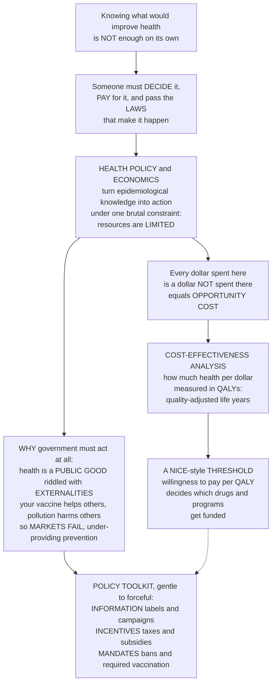

# ⚖️ Health Policy and the Economics of Public Health

> [!abstract] TL;DR
> Knowing what would improve health is **not enough** — someone has to **decide** to do it, **pay** for it, and pass the **laws** that make it happen. That is **health policy and economics**: turning epidemiological knowledge into action, under the brutal constraint that resources are **limited**. Every dollar spent on one health program is a dollar *not* spent on another — the **opportunity cost** — so how do you choose? Economists built a tool for this agonizing math: **cost-effectiveness analysis (CEA)**, which asks *how much health do we buy per dollar?* — usually measured in **QALYs** (Quality-Adjusted Life Years, a unit that combines the *length* and the *quality* of life). A treatment costing $5,000 per QALY is a bargain; one costing $500,000 per QALY may be unaffordable — and that ratio, the **ICER**, compared against a **willingness-to-pay threshold**, is how systems like the UK's **NICE** literally decide which drugs and programs to fund. The economics also explains *why* government must be involved at all: much of health is a **public good** or is riddled with **externalities** — your vaccination protects others (a benefit the market ignores), a factory's pollution harms neighbours (a cost the market ignores) — so markets alone **under-provide prevention and over-produce harm**, the economic justification for public-health regulation and spending. The policy tools range from gentle to forceful: **information** (labels, campaigns), **incentives** (taxes on tobacco and soda, subsidies for healthy food), and **mandates** (bans, required vaccination, clean-air laws). The best epidemiology in the world changes nothing until it becomes policy — and policy runs on the economics of scarcity and the politics of who decides.

---

## Intuition

**Analogy — the emergency room with one bed and a hallway full of patients.** Imagine you run an emergency department at 3 a.m. and you have a single free bed, one nurse, and a hallway crowded with people who all need help — a heart attack, a broken wrist, a child with a fever, someone in quiet despair. You cannot treat everyone at once. Every minute the nurse spends stitching the wrist is a minute *not* spent on the heart attack. You are forced, whether you like it or not, to ask a ruthless question: *where does this next unit of care do the most good?* Now zoom out from one night in one hospital to an entire country's health budget — the same problem, multiplied by a hundred million people and a thousand competing programs. The money is finite; the needs are not. **Health economics is the discipline of that hallway**: it accepts that resources are scarce and builds honest tools to decide who gets the bed.

The central tool is astonishingly simple to state. For each thing you *could* fund — a vaccine campaign, a cancer drug, a soda tax, a new hospital wing — you ask two numbers: *how much does it cost?* and *how much health does it buy?* Divide one by the other and you get a price tag on health itself: **dollars per healthy year gained**. A childhood vaccine might buy a healthy year for a few hundred dollars; an ultra-rare-disease drug might cost half a million dollars for the same healthy year. With a limited budget you cannot escape the arithmetic — funding the expensive one means *not* funding many cheap ones, and the cheap ones would have bought far more total health. That is why bodies like Britain's **NICE** draw a line — a **threshold** — and fund what falls below it. And there is a second, deeper reason government must act at all: some health benefits **spill over** onto people who never paid for them. When you get vaccinated you protect your neighbours too; when a factory pollutes, it harms people downwind who never agreed to it. A pure market, blind to these spillovers, buys *too little* vaccination and tolerates *too much* pollution — a **market failure** that only collective action, through taxes, subsidies, and laws, can correct. Intuition first: health is a hallway of competing needs and finite beds, and policy is the art of deciding wisely and legislating the decision into being.

---

## How It Works

### Core Mechanics

**1. Health policy is the machinery that turns knowledge into law.** Health policy is the set of **decisions, plans, laws, and regulations** that shape health and health systems. Epidemiology tells us *what* harms populations; policy is *how* society chooses to respond. It flows through a recognizable **policy process**: **agenda-setting** (a problem gains attention — a scandal, an outbreak, an advocacy campaign), **formulation** (options are drafted), **adoption** (a law or budget is passed), **implementation** (agencies and clinics act), and **evaluation** (did it work — feeding back into the next cycle). This is the same policy machinery analysed in [[Policy_Analysis_and_the_Policy_Process]].

**2. Evidence informs policy but does not determine it.** The ideal is **evidence-based policy** — decisions grounded in the best epidemiological data. The reality is a **gap between evidence and politics**: the same data can serve different values, and powerful **stakeholders** distort the outcome. Industry lobbying (tobacco, ultra-processed food, alcohol) fights regulation; advocacy groups push their cause; public opinion and media set what is even *thinkable*. This is the **political economy of health** — who wins and who loses — and it operates from the local council to the **WHO** and the World Bank at the global level.

**3. Health economics starts from one hard fact: scarcity.** Human health needs are effectively **unlimited**; every health system's budget is **finite**. That mismatch forces **prioritization**, and prioritization forces the concept of **opportunity cost** — the value of the best alternative you gave up. Spending here means *not* spending there. This is the founding idea of economics itself (see [[Scarcity_and_Opportunity_Cost]]): the true cost of a health program is not its price tag but the *health forgone* elsewhere because that money is now gone.

**4. Economic evaluation is the core tool — comparing costs against health outcomes.** To choose rationally you compare interventions on both axes at once. Three flavours dominate:
- **Cost-effectiveness analysis (CEA)** — cost per *natural* unit of health (a life-year gained, a case prevented, a death averted).
- **Cost-utility analysis (CUA)** — cost per **QALY** gained (or per **DALY** averted), where the QALY combines *length* and *quality* of life on a 0-to-1 scale. This is the workhorse; it lets you compare a hip replacement (adds quality) against a cancer drug (adds years) on one ruler. It is the mirror image of the **DALY** used to measure burden of disease.
- **Cost-benefit analysis (CBA)** — everything, including health itself, is **monetized** into dollars, so health programs can be compared against roads or schools.

**5. The ICER and the threshold decide what gets funded.** For a new intervention you compute the **incremental cost-effectiveness ratio**: `ICER = (cost_new − cost_old) / (QALY_new − QALY_old)` — the *extra* dollars per *extra* QALY. You then compare it to a **willingness-to-pay (WTP) threshold** — the most society will pay for a QALY. The UK's **NICE** uses roughly **£20,000–£30,000 per QALY**; the WHO once suggested a benchmark near 1–3× GDP per capita. Below the threshold, fund it; far above it, do not. Rank many interventions by ICER and you get a **league table** — buy the cheapest QALYs first and you extract the most health from a fixed budget. Agencies like **NICE**, the US **ICER**, and other **Health Technology Assessment (HTA)** bodies do exactly this to set coverage.

**6. But the QALY has ethical critics.** *Whose* QALY counts equally? Because QALYs weight *quality*, a year of life gained for a disabled person can score *lower* than for an able-bodied person — a charge of **disability discrimination**. The **"rule of rescue"** — our instinct to save the identified dying patient at any cost — collides with the cold efficiency of the league table. And aggregating QALYs can quietly sacrifice a few very sick people to help many mildly ill ones. Distributive fairness, not just efficiency, is at stake — the terrain of [[Justice_in_Health_and_Resource_Allocation]].

**7. Why government at all — market failure.** In a normal market, self-interested buyers and sellers reach an efficient outcome. Health breaks the assumptions:
- **Public-good character.** Clean air, mosquito control, and surveillance are **non-excludable and non-rival** — you cannot sell them one unit at a time, so markets under-supply them (see [[Public_Goods]]).
- **Externalities.** Vaccination has a **positive externality** (herd immunity protects others); pollution and secondhand smoke are **negative externalities** (harm to third parties). Markets ignore both, so they **under-provide prevention and over-produce harm** (see [[Externalities_and_Pigouvian_Tax]]).
- **Information asymmetry** and **equity** concerns compound the failure (see [[Market_Failures]]).
These failures are the economic *justification* for regulation, taxation, and public provision.

**8. The policy toolkit, from gentle to forceful.** Governments correct these failures with a ladder of instruments: **information** (nutrition labels, health warnings, education), **incentives / fiscal tools** (taxes on tobacco, alcohol, and sugar — *"sin taxes"* that are really **Pigouvian taxes** internalizing the externality; subsidies for vaccines and healthy food), and **regulation & mandates** (bans, product standards, required vaccination, clean-air and seatbelt laws — often the *most* effective and the most contested). Behind the whole ladder sits the **"nanny state"** debate: individual liberty versus collective health. And underneath it all sit **health-system models** (Beveridge tax-funded, Bismarck social-insurance, private insurance), the drive toward **universal coverage**, and a chronic **prevention-versus-treatment** spending imbalance — systems everywhere spend the vast majority on treating the sick and a sliver on preventing sickness.

### Flow / Architecture



*Read top to bottom: epidemiological knowledge is inert until someone decides, pays, and legislates. Because resources are limited, every choice carries an opportunity cost, so cost-effectiveness analysis prices health in QALYs and a threshold decides what to fund. A separate branch answers why government must act at all — public goods and externalities make markets fail — which motivates the policy toolkit of information, incentives, and mandates.*

---

## Key Concepts

### 🟢 Secondary (intuitive foundation)

- **Money for health is limited.** No country can afford every treatment for everyone, so someone must choose. Choosing to fund one thing means *not* funding another — that trade-off is called **opportunity cost**.
- **Health has a price per healthy year.** For any program you can ask "how much does it cost, and how much health does it buy?" Buying a healthy year of life for a few hundred dollars is a great deal; paying half a million for the same year may be too much.
- **The QALY.** A **Quality-Adjusted Life Year** is one year of life in full health. It combines *how long* you live with *how well* — so we can fairly compare a treatment that adds years to one that improves quality.
- **Why government must step in.** Your vaccination protects your neighbours, and a factory's pollution harms people nearby — effects a plain market ignores. So governments must act to encourage the good (vaccines) and discourage the bad (pollution, smoking).
- **Three ways to change behaviour.** Governments can **inform** you (warning labels), **nudge your wallet** (a tax on cigarettes, a subsidy for vegetables), or **make a rule** (ban smoking indoors, require vaccines for school). Rules are usually the most powerful — and the most argued-about.

### 🟡 Undergraduate (mechanisms and formalism)

- **The policy process:** agenda-setting → formulation → adoption → implementation → evaluation, a cycle in which **evidence** competes with **interests** (industry lobbying, advocacy, public opinion) — the political economy of health.
- **Economic evaluation types:** cost-effectiveness (cost per natural unit, e.g. life-year or case averted), **cost-utility** (cost per QALY / DALY averted), and cost-benefit (health monetized). CUA is dominant because the QALY is a common currency across unlike diseases.
- **The QALY formula:** `QALY = Σ (years in each health state × utility weight of that state)`, where a utility of 1 = full health and 0 = death (some states are rated *worse* than death, below 0). It is the maximize-me mirror of the minimize-me **DALY**.
- **The ICER:** `ICER = ΔCost / ΔQALY`. Only *incremental* comparisons matter — you compare an intervention to the next-best alternative, not to nothing.
- **The WTP threshold and the league table:** rank interventions by ICER, fund from the lowest ICER upward until the budget (or the threshold) is exhausted. NICE ≈ £20k–£30k/QALY; below the line = cost-effective. This is how HTA bodies (NICE, ICER, IQWiG) set coverage.
- **Market-failure taxonomy:** **public goods** (non-rival, non-excludable), **externalities** (positive — vaccination; negative — pollution, secondhand smoke), **information asymmetry** (patients cannot judge care quality), and **equity** — each a distinct economic reason markets misallocate health.
- **Pigouvian correction:** a tax equal to the marginal external *cost* (tobacco, sugar) makes the polluter/consumer pay the true social cost; a subsidy equal to the marginal external *benefit* (vaccines) closes the under-provision gap.
- **Health-system financing models:** **Beveridge** (tax-funded, e.g. NHS), **Bismarck** (mandated social insurance), **national/private insurance** — differing on how they pool risk and pursue **universal health coverage**.

### 🔴 Graduate (subtleties, critique, frontiers)

- **The threshold is not exogenous — it should reflect opportunity cost.** A fixed WTP threshold implicitly asserts what a QALY is *worth*, but the *correct* threshold is the health displaced elsewhere in a fixed budget (the "**k**" of the marginal displaced service). Empirical work (Claxton et al.) estimated the NHS's true opportunity-cost threshold nearer **£13,000/QALY**, *below* NICE's stated £20k–£30k — implying that approving drugs at the higher line may destroy more health than it creates. Threshold choice is thus an empirical, not merely normative, question.
- **Perspective changes the answer.** Costs and benefits differ under a **healthcare-payer**, **health-system**, or **societal** perspective (the last includes productivity, informal care, and non-health effects). The reference-case perspective (per the *Second Panel on Cost-Effectiveness in Health and Medicine*) materially shifts which programs pass — prevention and public-health interventions look far better from a societal viewpoint that counts averted productivity loss.
- **Discounting and time.** Future costs and QALYs are **discounted** (commonly 3–3.5%), which systematically penalizes **prevention** and vaccination (benefits arrive decades later) relative to acute treatment — a structural bias against exactly the interventions public health favours. Differential discounting of costs vs health is contested.
- **Aggregation vs distribution — the equity frontier.** Standard CUA is **utilitarian**: a QALY is a QALY regardless of *who* receives it. Extensions — **equity weighting**, **distributional cost-effectiveness analysis (DCEA)**, and the **extended CEA** used in global health — trade some efficiency for fairness, letting decision-makers see the health-*inequality* impact, not just the health-*total* impact. This directly engages [[Justice_in_Health_and_Resource_Allocation]] and Daniels' *accountability for reasonableness*.
- **The QALY's disability critique in law.** In the US, the Affordable Care Act effectively *banned* QALY-based coverage decisions in Medicare over disability-discrimination concerns (the ICER's use is politically constrained), whereas the UK embraces them — a live example of how the same economic tool is accepted or rejected on ethical-political grounds.
- **Second-best and unintended effects of fiscal tools.** Sin taxes are **regressive** (a soda tax takes a larger income share from the poor), can trigger **substitution** (to cheaper, worse alternatives or cross-border purchase), and depend on **price elasticity** — the demand response determines whether a tax mainly *reduces harm* or mainly *raises revenue*. Optimal design (tax the sugar, not the drink volume; earmark revenue for prevention) is an active policy-design problem overlapping [[Regulatory_Politics_and_Administrative_Law]].
- **The prevention paradox and political time-horizons.** Rose's insight: population-wide prevention offers each individual a *tiny* benefit while delivering a *large* aggregate gain — so it is easy to defund and politically thankless (no identifiable life is visibly saved), which, combined with electoral cycles shorter than prevention's payoff, structurally starves prevention despite its cost-effectiveness.
- **Global priority-setting under extreme scarcity.** In low-income settings the *Disease Control Priorities* project and WHO-CHOICE use **cost per DALY averted** with thresholds tied to income; the analytics are the same but the stakes — and the ethics of a much lower price on a life-year — are starkly different.

---

## Python Demo

```python
# Health policy & economics, in one figure of four panels:
#   (a) COST-EFFECTIVENESS -- each intervention has a cost and a health gain
#       (QALYs). The ratio cost/QALY (the ICER) is priced against a NICE-style
#       WILLINGNESS-TO-PAY THRESHOLD. A "league table" ranks interventions so a
#       LIMITED budget buys the MOST health per dollar (cheapest QALYs first).
#   (b) MARKET FAILURE & POLICY TOOLS -- vaccination has a POSITIVE EXTERNALITY:
#       the private market stops where PRIVATE benefit meets cost, under-providing
#       relative to the social optimum; a subsidy closes the gap. And a ladder of
#       policy tools (information vs tax vs mandate) trades effectiveness against
#       coerciveness when curbing a harmful good.
import numpy as np
import matplotlib.pyplot as plt

# ============================================================
# (a) COST-EFFECTIVENESS ANALYSIS  ->  ICER league table + budget frontier
# ============================================================
# name, incremental cost per person (GBP), incremental QALYs gained per person
interventions = [
    ("Childhood vaccination",    200,  0.40),
    ("Tobacco tax + cessation",  900,  0.45),
    ("Hypertension screening",   3000, 0.30),
    ("Statins (high risk)",      5000, 0.25),
    ("Dialysis",                 30000, 0.40),
    ("New cancer drug",          80000, 0.50),
    ("Ultra-rare disease drug",  300000, 0.60),
]
names = np.array([x[0] for x in interventions])
cost  = np.array([x[1] for x in interventions], dtype=float)
qaly  = np.array([x[2] for x in interventions], dtype=float)
icer  = cost / qaly                       # cost per QALY gained

WTP_low, WTP_high = 20000.0, 30000.0      # NICE-style thresholds (GBP per QALY)

# Rank by value (lowest cost per QALY first) -> the LEAGUE TABLE
order = np.argsort(icer)
names_s, cost_s, qaly_s, icer_s = names[order], cost[order], qaly[order], icer[order]

# Budget frontier: apply each intervention to a cohort of N people, fund
# cheapest-QALY-first, and accumulate spend vs health bought (concave frontier).
N = 10000.0
cum_cost = np.cumsum(cost_s * N)
cum_qaly = np.cumsum(qaly_s * N)
cum_cost = np.insert(cum_cost, 0, 0.0)     # start at origin
cum_qaly = np.insert(cum_qaly, 0, 0.0)
BUDGET = 60e6                              # fixed budget (GBP)

# ============================================================
# (b) POSITIVE EXTERNALITY of vaccination  ->  market under-provides
# ============================================================
Q = np.linspace(0, 100, 500)               # vaccination coverage / doses (units)
ext_benefit = 30.0                         # marginal EXTERNAL benefit (herd-immunity spillover)
PMB = 100.0 - Q                            # private marginal benefit (willingness to pay)
SMB = PMB + ext_benefit                    # social marginal benefit = private + spillover
MC  = 20.0 + 0.6 * Q                       # marginal cost of provision
Q_market = (100.0 - 20.0) / 1.6                       # PMB = MC
Q_social = (100.0 + ext_benefit - 20.0) / 1.6         # SMB = MC  (larger -> under-provision)

# Policy-tool ladder: curbing a harmful good (e.g. sugary drinks)
tools     = ["Information\n(labels)", "Incentive\n(tax)", "Mandate\n(ban/limit)"]
reduction = np.array([5.0, 15.0, 40.0])    # approx. % reduction in consumption
coercion  = np.array([1.0, 2.0, 3.0])      # relative liberty / political cost

# ============================ PLOT ============================
fig, axes = plt.subplots(2, 2, figsize=(14, 11))

# --- (a1) League table: cost per QALY vs the WTP threshold ---
ax = axes[0, 0]
colors = ["#0f766e" if v <= WTP_high else "#b91c1c" for v in icer_s]
y = np.arange(len(names_s))
ax.barh(y, icer_s, color=colors)
ax.set_yticks(y); ax.set_yticklabels(names_s, fontsize=8)
ax.set_xscale("log")
ax.axvline(WTP_low,  color="#0f766e", ls=":",  lw=1.8, label=f"WTP £{WTP_low:,.0f}/QALY")
ax.axvline(WTP_high, color="#b45309", ls="--", lw=1.8, label=f"WTP £{WTP_high:,.0f}/QALY")
ax.set_xlabel("Cost per QALY gained (£, log scale)  -- lower is better value")
ax.set_title("(a1) The league table: green = below threshold (fund), red = too costly")
ax.legend(fontsize=8, loc="lower right")
ax.grid(alpha=0.3, axis="x", which="both")

# --- (a2) Budget frontier: buying the most health per pound ---
ax = axes[0, 1]
ax.plot(cum_cost / 1e6, cum_qaly, "o-", color="#7c3aed", lw=2.3)
for i, nm in enumerate(names_s):
    ax.annotate(nm, (cum_cost[i+1] / 1e6, cum_qaly[i+1]),
                textcoords="offset points", xytext=(5, -8), fontsize=6.5)
ax.axvline(BUDGET / 1e6, color="#b91c1c", ls="--", lw=1.8,
           label=f"Budget £{BUDGET/1e6:.0f}M")
ax.set_xlabel("Cumulative spend (£ millions)")
ax.set_ylabel("Cumulative QALYs bought")
ax.set_title("(a2) Cheapest QALYs first: steep early gains, then diminishing returns")
ax.legend(fontsize=8, loc="lower right")
ax.grid(alpha=0.3)

# --- (b1) Positive externality: market under-provides vaccination ---
ax = axes[1, 0]
ax.plot(Q, PMB, color="#2563eb", lw=2, label="Private marginal benefit (demand)")
ax.plot(Q, SMB, color="#0f766e", lw=2.4, label="Social marginal benefit (+ spillover)")
ax.plot(Q, MC,  color="#b45309", lw=2, label="Marginal cost (supply)")
ax.axvline(Q_market, color="#b91c1c", ls="--", lw=1.6, label=f"Market Q = {Q_market:.0f} (too low)")
ax.axvline(Q_social, color="#0f766e", ls=":",  lw=1.8, label=f"Social optimum Q = {Q_social:.0f}")
mask = (Q >= Q_market) & (Q <= Q_social)
ax.fill_between(Q[mask], MC[mask], SMB[mask], color="#0f766e", alpha=0.18,
                label="Welfare lost to under-provision")
ax.set_xlabel("Vaccination coverage / doses (units)")
ax.set_ylabel("Value or cost per unit")
ax.set_title("(b1) Positive externality: markets buy too little prevention")
ax.legend(fontsize=7.5, loc="upper right")
ax.grid(alpha=0.3)

# --- (b2) Policy-tool ladder: effectiveness vs coerciveness ---
ax = axes[1, 1]
x = np.arange(len(tools))
ax.bar(x, reduction, color=["#93c5fd", "#3b82f6", "#1e3a8a"])
ax.set_xticks(x); ax.set_xticklabels(tools, fontsize=8)
ax.set_ylabel("Reduction in consumption (percent)", color="#1e3a8a")
ax.set_title("(b2) The intervention ladder: more effective, more coercive")
axT = ax.twinx()
axT.plot(x, coercion, "o-", color="#b91c1c", lw=2.3)
axT.set_ylabel("Coerciveness / liberty cost (relative)", color="#b91c1c")
axT.set_ylim(0, 3.6)
for xi, r in zip(x, reduction):
    ax.annotate(f"{r:.0f}%", (xi, r), textcoords="offset points",
                xytext=(0, 4), ha="center", fontsize=8)

plt.tight_layout()
plt.savefig("health_policy_economics.png", dpi=120, bbox_inches="tight")

# ---------------- printed summary ----------------
print("LEAGUE TABLE (cost per QALY, cheapest value first):")
for nm, v in zip(names_s, icer_s):
    verdict = "FUND (<= £30k)" if v <= WTP_high else "reject (> £30k)"
    print(f"  {nm:26s}  £{v:>9,.0f}/QALY   {verdict}")
funded = np.searchsorted(cum_cost, BUDGET)     # how many fit under the budget
print(f"\nWith a £{BUDGET/1e6:.0f}M budget, cheapest-first funds {funded} of "
      f"{len(names_s)} interventions, buying ~{cum_qaly[funded]:,.0f} QALYs.")
print(f"Externality: market coverage Q={Q_market:.0f} vs social optimum "
      f"Q={Q_social:.0f}  ->  a subsidy of {ext_benefit:.0f}/unit closes the gap.")
```

**What you see.** *Panel (a1)* is the **league table**: interventions ranked by cost per QALY on a log axis, with the NICE-style thresholds drawn in. Childhood vaccination and the tobacco tax buy a healthy year for hundreds of pounds (deep-green bargains); dialysis, the cancer drug, and especially the ultra-rare-disease drug sit far to the right, above the £30,000 line (red), where each QALY costs a fortune. *Panel (a2)* turns the same data into a **budget frontier**: fund the cheapest QALYs first and the curve rises steeply — enormous health for little money — then flattens into **diminishing returns** as only the expensive interventions remain; the red budget line shows exactly where the money runs out and which programs make the cut. *Panel (b1)* is the **externality** argument for government: because private buyers ignore the herd-immunity benefit they confer on others, the market settles at coverage Q≈50 where *private* benefit meets cost, well short of the social optimum Q≈69 where *social* benefit meets cost — the shaded wedge is the health society throws away, and a per-dose subsidy equal to the spillover erases it. *Panel (b2)* is the **policy ladder**: information cuts consumption a little, a tax more, a mandate most — but the red line shows effectiveness is bought with rising coerciveness, the exact trade-off at the heart of the "nanny state" debate.

---

## Real-World Applications

- **NICE (UK) — the threshold made real.** The National Institute for Health and Care Excellence literally computes ICERs for new drugs and technologies and recommends NHS funding largely against a **£20,000–£30,000 per QALY** threshold. It is the clearest working example of a country saying, explicitly and in public, "this much health is worth this much money" — and refusing to fund treatments that cost too much per QALY, a stance both praised for discipline and attacked when it denies a dying patient a drug.
- **Tobacco taxation — the single most cost-effective NCD policy.** The WHO's **MPOWER** package and decades of evidence make **excise taxes on cigarettes** the most effective, most cost-effective intervention against non-communicable disease: a Pigouvian tax that internalizes the external cost, cuts consumption (especially among the price-sensitive young), and raises revenue. It is externality economics and fiscal policy fused into public-health practice.
- **Sugar-sweetened-beverage taxes (Mexico, UK, Berkeley).** Mexico's 2014 soda tax and the UK's tiered **Soft Drinks Industry Levy** reduced sugary-drink purchases and, in the UK's case, drove *reformulation* (manufacturers cut sugar to dodge the higher tier) — a modern natural experiment in taxing a harmful good, complete with debates over regressivity and substitution.
- **Vaccination subsidies and mandates — correcting under-provision.** Free childhood immunization, school-entry vaccination requirements, and global financing through **Gavi** all exist because the market, blind to herd immunity's positive externality, would buy too little. This is the externality panel of the demo turned into standing policy — and it directly complements this vault's [[Vaccination_Herd_Immunity_and_Elimination]].
- **Global priority-setting under scarcity (Disease Control Priorities, WHO-CHOICE).** In low-income countries, ministries and donors use **cost per DALY averted** to choose between bed-nets, HIV treatment, and hypertension clinics with brutally limited budgets — the league table applied where the stakes of getting prioritization wrong are measured in lives.
- **Clean-air and smoke-free laws — mandates that worked.** Indoor smoking bans and the US Clean Air Act are regulatory mandates addressing **negative externalities** (secondhand smoke, particulate pollution); post-implementation drops in heart-attack admissions and respiratory disease are among public health's clearest before/after wins — the most forceful rung of the policy ladder, vindicated by evaluation.

---

## Common Pitfalls

- **Confusing cost with opportunity cost.** The real cost of funding a £500,000/QALY drug is not the cash — it is the *hundreds of QALYs* that same money would have bought in cheaper programs, now forgone. Ignoring the displaced health makes every expensive intervention look "worth it" in isolation.
- **Treating the threshold as a fixed law of nature.** The WTP threshold should reflect the health displaced elsewhere. Empirical work suggests the NHS's *true* opportunity-cost threshold may sit *below* NICE's stated £20k–£30k — meaning approvals at the higher line can *destroy* net health. A threshold is an assumption to be justified, not a constant.
- **Forgetting QALYs and DALYs run in opposite directions.** You *maximize* QALYs gained but *minimize* DALYs (burden) or DALYs *averted*. Mixing "we saved 500 DALYs" with QALY logic inverts the entire conclusion of an analysis.
- **Ignoring the perspective and the discount rate.** Prevention looks cost-ineffective from a narrow payer perspective with heavy discounting (its benefits arrive decades later) and cost-*effective* from a societal perspective. Quietly choosing the perspective that suits your conclusion is a common — and misleading — move.
- **Assuming the market will "handle it."** Health is riddled with public goods, externalities, and information asymmetry. Expecting a free market to supply the right amount of vaccination, surveillance, or clean air is an economic category error — these are textbook market failures that require collective action.
- **Reaching for a mandate first (or never).** Jumping straight to a ban ignores cheaper, less coercive tools and inflames the liberty backlash; but refusing ever to regulate — relying only on "educating people" — leaves the most effective rung of the ladder unused. The art is matching the tool to the failure.
- **Mistaking a soda/tobacco tax's incidence.** Sin taxes are **regressive** and can trigger substitution or cross-border buying. A tax designed only to raise revenue (taxing volume, not sugar; not earmarking proceeds) can miss its health target and fall hardest on the poor.
- **Believing evidence alone will win.** The best cost-effectiveness study loses to industry lobbying, electoral timelines, and the "rule of rescue" if you ignore the *politics*. Policy is where evidence meets interests — treating it as a purely technical exercise guarantees the analysis sits on a shelf.

---

## Related Concepts

This note **caps the Public Health Practice and Policy section** and turns the whole vault's epidemiology into action. Its **siblings** in this section extend it directly (referenced here in prose as the section fills in): *Public_Health_Systems_and_Functions* describes the institutions — agencies, financing, the essential public-health functions — that *execute* the policies priced here; *Health_Promotion_and_Disease_Prevention* supplies the interventions (behaviour change, screening, vaccination campaigns) whose cost-effectiveness this note evaluates and whose under-provision the externality argument explains; *Social_Determinants_and_Health_Equity* is the equity counterweight to raw efficiency — the distributional concerns that DCEA and the QALY-fairness critique bring into economic evaluation; *The_Epidemiologic_Transition_and_Burden_of_Disease* provides the **DALY** that is the mirror of the QALY used here and the burden estimates that set health priorities; and *Global_Health_and_International_Epidemiology* is where cost-per-DALY priority-setting plays out under the most extreme scarcity.

**Across the vault (Glob-verified links):**

- [[Scarcity_and_Opportunity_Cost]] — the founding economic idea beneath all of health economics: because resources are finite, the cost of any program is the best alternative forgone. *(Microeconomics vault)*
- [[Public_Goods]] — why clean air, surveillance, and mosquito control are non-rival and non-excludable, so markets under-supply them and government must provide them. *(Microeconomics vault)*
- [[Externalities_and_Pigouvian_Tax]] — the formal engine of the vaccination-subsidy and tobacco-tax arguments: positive and negative spillovers, and the tax/subsidy that internalizes them. *(Microeconomics vault)*
- [[Market_Failures]] — the umbrella taxonomy (public goods, externalities, asymmetric information, equity) that is the economic justification for public-health intervention. *(Microeconomics vault)*
- [[Policy_Analysis_and_the_Policy_Process]] — the agenda-setting-to-evaluation cycle and stakeholder politics through which health evidence becomes (or fails to become) law. *(Political Science vault)*
- [[Regulatory_Politics_and_Administrative_Law]] — how mandates, standards, and sin taxes are actually designed, enacted, and contested by regulators and interest groups. *(Political Science vault)*
- [[Global_Health_and_Health_Systems]] — health-system financing models (Beveridge/Bismarck/insurance), universal coverage, and DALY-guided global resource allocation. *(Health, Nutrition & Longevity vault)*
- [[Justice_in_Health_and_Resource_Allocation]] — the ethical critique of the QALY and the fairness principles (accountability for reasonableness, the rule of rescue, disability concerns) that constrain pure efficiency. *(Ethics & Applied Ethics vault)*
- [[Vaccination_Herd_Immunity_and_Elimination]] — the public good and positive externality that most vividly justifies subsidy and mandate; the herd-immunity spillover modelled in this note's externality panel. *(Epidemiology vault, Section 04)*

---

## Review Questions

**🟢 Secondary**
1. Explain, using the emergency-room hallway analogy, why a health system cannot simply fund every treatment for everyone, and what "opportunity cost" means in that setting.
2. What is a QALY, and why is it useful to have a single unit that combines *how long* someone lives with *how well* they live?
3. Give one example each of the three policy tools — information, incentive, and mandate — that a government could use to reduce smoking. Which is usually most effective, and why is it also the most controversial?

**🟡 Undergraduate**
4. Two cancer drugs cost £10,000 and £90,000 per patient and add 0.5 and 0.6 QALYs respectively over standard care. Compute each ICER and state which NICE would be more likely to fund at a £30,000/QALY threshold. Why does incremental (not total) comparison matter?
5. Explain why vaccination is a *positive* externality and pollution a *negative* one, and describe the specific policy tool (subsidy vs Pigouvian tax) that corrects each. In each case, is the market providing too much or too little?
6. A country ranks its health interventions in a "league table" by cost per QALY and funds from the cheapest upward until the budget is exhausted. Explain why this maximizes total health, and what an intervention *above* the funding cutoff line represents.

**🔴 Graduate**
7. NICE uses a £20,000–£30,000/QALY threshold, but empirical estimates put the NHS's true opportunity-cost threshold nearer £13,000/QALY. Explain what the "correct" threshold *should* represent, and argue what follows for net population health if drugs are approved above the true opportunity-cost threshold.
8. Critique the QALY on equity grounds. Explain (a) the disability-discrimination objection, (b) the "rule of rescue," and (c) how distributional cost-effectiveness analysis (DCEA) or equity weighting attempts to reconcile efficiency with fairness. Why did US law restrict QALY use in Medicare while the UK embraces it?
9. A finance ministry proposes a sugary-drink tax. Analyse it as a second-best Pigouvian instrument: address price elasticity of demand, regressivity, substitution effects, and tax design (taxing sugar content vs volume, earmarking revenue). Under what conditions does the tax mainly reduce harm rather than merely raise revenue?

---

## Sources

- Drummond, M. F., Sculpher, M. J., Claxton, K., Stoddart, G. L., & Torrance, G. W. (2015). *Methods for the Economic Evaluation of Health Care Programmes* (4th ed.). Oxford University Press — the standard text on CEA, CUA, QALYs, ICERs, and thresholds.
- Neumann, P. J., Sanders, G. D., Russell, L. B., Siegel, J. E., & Ganiats, T. G. (eds.) (2017). *Cost-Effectiveness in Health and Medicine* (2nd ed.). Oxford University Press — the "Second Panel" reference case, on perspectives, discounting, and reference-case methods.
- Weinstein, M. C., & Stason, W. B. (1977). "Foundations of cost-effectiveness analysis for health and medical practices." *New England Journal of Medicine*, 296(13), 716–721. [https://doi.org/10.1056/NEJM197703312961304](https://doi.org/10.1056/NEJM197703312961304) — the founding paper of health-CEA.
- World Health Organization (2014). *Health in All Policies: Framework for Country Action*. WHO, Geneva. [https://www.who.int/publications/i/item/9789241506908](https://www.who.int/publications/i/item/9789241506908) — the intersectoral, whole-of-government policy approach to health.
- Claxton, K., Martin, S., Soares, M., et al. (2015). "Methods for the estimation of the National Institute for Health and Care Excellence cost-effectiveness threshold." *Health Technology Assessment*, 19(14). [https://doi.org/10.3310/hta19140](https://doi.org/10.3310/hta19140) — the empirical opportunity-cost threshold study.

---

#epidemiology #health-policy #health-economics #cost-effectiveness #QALY
