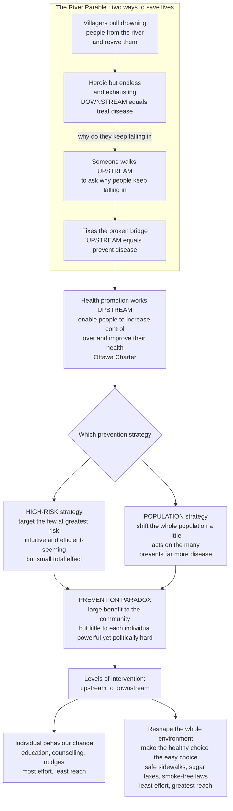

# 🌊 Health Promotion and Disease Prevention

> [!abstract] TL;DR
> Health promotion and disease prevention are how public health works **upstream** — stopping disease *before it starts* instead of only rescuing its victims. The organizing image is the **river parable**: rather than endlessly pulling drowning people out of the water, you walk upstream to find the **broken bridge** and fix it — moving from treating disease, to preventing it, to changing the *causes of the causes* (the social and environmental conditions in which people live). The pivotal insight is Geoffrey Rose's contrast between two prevention strategies. The **high-risk strategy** finds and treats the small number of people at greatest risk — intuitive and efficient-*seeming*, but limited, because **most cases actually arise from the huge number of people at moderate risk**, not the dangerous tail. The **population strategy** shifts the *whole* population's risk a little (everyone eats slightly less salt) and, because it acts on the many, prevents far more disease overall. This is the **prevention paradox**: a measure that brings large benefit to the community offers little to each participating individual — which is exactly why population prevention is powerful yet politically hard. And the highest-impact interventions are not lectures about willpower but **changes to the environment itself** — clean water, safe streets, sugar taxes, smoke-free laws — that *make the healthy choice the easy, default choice*.

---

## Intuition

**Analogy: the river and the broken bridge.** A famous public-health parable: villagers standing by a river keep seeing people float past, drowning. Heroically, they wade in, pull each one out, and revive them — again and again, day and night, until they are exhausted and the bodies never stop coming. Finally, one villager stops rescuing and walks **upstream** to ask *why* people keep falling in — and discovers a **broken bridge** upriver. Fixing the bridge stops the drownings at their source. Rescuing people from the water is **treating disease** (downstream); fixing the bridge is **preventing disease** (upstream). And if you go even further upstream — asking *why the bridge was never repaired* (no money, no one responsible, no safe crossing built) — you reach the **causes of the causes**: the social and environmental conditions that shape health long before any individual gets sick. That whole shift of attention, from the rescue to the source, is the philosophy of health promotion.

But the parable makes prevention sound simpler than it is, because prevention runs into a deep paradox. Imagine two ways to prevent heart attacks. The **high-risk** way finds the few people with dangerously high blood pressure and puts them on pills — obvious, targeted, satisfying. Yet it barely dents the total number of heart attacks, because **most heart attacks happen to the vast majority of people whose blood pressure is only *moderately* raised** — there are simply so many of them. The **population** way nudges the *whole* population's blood pressure down a notch — get everyone to eat a little less salt — and because it acts on the many, it prevents far more disease overall. The catch is Rose's **prevention paradox**: this powerful population measure gives almost nothing *noticeable* to any single person (*why should I bother eating less salt when my own risk hardly moves?*), which makes the most effective strategy the hardest one to sell. And the real leverage lives not in nagging individuals but in **reshaping the environment** so the healthy choice is the easy default — safe sidewalks, sugar taxes, smoke-free air. Understanding the upstream philosophy, the population-versus-high-risk strategies, and the prevention paradox *is* understanding how public health actually stops disease before it starts.

---

## How It Works

### Core Mechanics

**1. The upstream philosophy — three steps back from the sickbed.** Health improvement can act at increasingly upstream points:
- **Treat the disease** (downstream): clinical care for the person who is already ill — pull the drowning person out.
- **Prevent the disease** (mid-stream): stop it before onset — vaccinate, screen, quit smoking — fix the bridge.
- **Change the causes of the causes** (far upstream): reshape the **social and environmental determinants** — income, housing, education, food environment, air, transport — that decide who becomes exposed and susceptible in the first place. This is where the largest and most durable gains live, and where health promotion ultimately aims.

**2. Health promotion vs disease prevention — a positive frame vs a defensive one.** *Disease prevention* is defensive: it targets specific diseases and risk factors to stop bad outcomes. *Health promotion* is broader and positive — the **Ottawa Charter (WHO, 1986)** defines it as *"the process of enabling people to increase control over, and to improve, their health."* It is not just telling people to behave; it means **building healthy public policy, creating supportive environments, strengthening community action, developing personal skills, and reorienting health services**. Prevention stops disease; promotion builds the *conditions* for health.

**3. The levels of prevention (recap).** Health promotion spans the full ladder covered in the sibling *Natural_History_of_Disease_and_Prevention_Levels*: **primordial** (stop risk factors from ever arising — upstream policy), **primary** (prevent onset — vaccinate, remove exposure), **secondary** (catch it early via screening — see *Screening_Programs_and_Early_Detection*), and **tertiary** (limit damage in established disease). Health promotion lives mostly at the primordial and primary levels — the farthest upstream.

**4. Rose's two strategies — the core insight.** For any risk factor spread across a population you can pursue:
- **The high-risk strategy** — identify the individuals in the dangerous *tail* of the distribution and intervene on them (screen, then treat the few with very high blood pressure). *Strengths*: targeted, appropriate to the individual, cost-contained, avoids medicating the many, and the person's motivation is high because their risk is visibly high. *Weaknesses*: it requires **screening** to find people; it is **palliative, not radical** (it protects individuals without touching the underlying cause, so new high-risk people keep appearing); and its **population impact is limited**, because...
- **The population strategy** — shift the *whole distribution* of the risk factor a little (lower everyone's salt intake, blood pressure, or LDL by a small amount). *Strengths*: it is **radical** (it addresses the root cause), it has **large total impact**, and it is often behaviourally and economically efficient when delivered through policy. *Weaknesses*: the **prevention paradox**.

**5. The prevention paradox — why the best strategy is the hardest.** Rose's paradox: *"a preventive measure that brings large benefits to the community offers little to each participating individual."* Because most cases arise from the large **moderate-risk middle**, shifting everyone down a little prevents many cases in *aggregate* — but any single person's own risk barely changes, so motivation and acceptability are low, and a small harm imposed on many low-risk people (side effects, cost, inconvenience) can outweigh the diffuse benefit for them individually. The paradox is not a flaw in the arithmetic; it is why population prevention needs **policy and defaults**, not persuasion.

**6. The health-impact pyramid — where interventions actually bite.** Thomas Frieden's pyramid (2010) ranks intervention types by **population impact vs individual effort required**. From base (biggest impact, least individual effort) to apex (smallest impact, most effort):
1. **Socioeconomic factors** — poverty, education, income (the deepest determinants).
2. **Changing the context to make individuals' default decisions healthy** — clean water, sanitation, iodized salt, safe streets, sugar/salt/trans-fat policy.
3. **Long-lasting protective interventions** — vaccinations, fortification, one-off protection.
4. **Clinical care** — treating blood pressure, statins, ongoing management.
5. **Counseling and education** — "eat well, be active" — the *weakest* tier, because it depends entirely on sustained individual willpower against an unhealthy environment.
The lesson: **make the healthy choice the easy, default choice** — the lower tiers reach the most people with the least demand on any individual.

**7. Behaviour-change and policy tools.** At the individual end sit health-behaviour models (the **Health Belief Model**, the **Transtheoretical / stages-of-change model**), health education, counselling, and social marketing — useful but limited, and prone to **victim-blaming** if pushed without changing the environment. At the population/environmental end sit the highest-impact tools: **nudges and choice architecture** (defaults, placement, framing), and **regulation and fiscal measures** — tobacco taxes and smoke-free laws, **sugar/soda taxes**, salt-reduction agreements, trans-fat bans, seatbelt and helmet laws. These structural tools are consistently the most cost-effective, precisely because they do not depend on each person choosing well every day.

### Flow / Architecture



---

## Key Concepts

### Secondary Level

- **Upstream vs downstream.** *Downstream* is treating people who are already sick; *upstream* is fixing the causes so they never get sick. The river parable: stop pulling drowning people out and go fix the broken bridge.
- **Health promotion.** Helping whole communities become healthier — not just treating disease, but making it *easier* to live a healthy life (safe places to walk, healthy food, clean air).
- **Prevention.** Stopping a disease before it starts. It is cheaper and kinder than curing it — "an ounce of prevention is worth a pound of cure."
- **The prevention paradox (plain version).** A change that helps the whole community a lot can feel useless to any one person. Eating a little less salt barely changes *your* odds — but across millions of people it prevents thousands of heart attacks.
- **Make the healthy choice the easy choice.** The best way to change behaviour is to change the *surroundings*, not to nag. If the default is healthy — clean water on tap, sidewalks, smoke-free restaurants — people are healthy without having to fight for it every day.

### Undergraduate Level

- **The high-risk strategy.** Screen the population, find the individuals in the dangerous tail (very high blood pressure, very high LDL), and treat them. Targeted and individually appropriate, but requires screening, is *palliative* (does not remove the cause, so new high-risk people keep appearing), and reaches only a small share of total cases.
- **The population strategy.** Move the whole risk-factor distribution down a little for everyone (via policy, food supply, or environment). *Radical* (attacks the cause) and high-impact, but subject to the prevention paradox.
- **Why most cases come from the middle.** Risk rises with the factor, but the *number of people* is far greater in the moderate middle than in the extreme tail. Cases = people × risk-per-person, so the modest-risk majority generates more total cases than the high-risk few. Targeting only the tail can address only a fraction of cases.
- **The prevention paradox (formal).** Rose: a measure that brings large benefit to the community offers little to each participating individual. Consequence: low individual motivation, low acceptability, and the possibility that a small per-person harm outweighs the diffuse per-person benefit — even when the *population* benefit is large.
- **The health-impact pyramid.** Frieden's ranking of interventions by impact and effort: socioeconomic factors > changing the context/defaults > long-lasting protection (vaccines) > clinical care > counseling/education. Bottom tiers reach the most people for the least individual effort.
- **The Ottawa Charter's five action areas.** Build healthy public policy; create supportive environments; strengthen community action; develop personal skills; reorient health services. Health promotion is far more than health education.

### Graduate Level

- **When to use which strategy — and why to combine them.** The high-risk strategy is efficient when risk is highly concentrated, the tail is easy to identify, and treating the many would cause net harm (e.g., anticoagulation). The population strategy dominates when risk is continuously graded with no clear threshold, the factor is population-wide and policy-modifiable (salt, trans-fat, tobacco price), and most cases sit in the middle. In practice the two are **complementary**: population measures shift and thin the whole distribution while high-risk measures protect the residual tail — the "**directional-population plus high-risk**" combination Rose himself endorsed.
- **Continuous risk and the tyranny of the threshold.** Dichotomizing a continuous risk factor into "hypertensive vs normal" manufactures a boundary that biology does not have. Because the risk–exposure relationship is graded and usually convex, the bulk of attributable cases lies just *below* any clinical cutoff — the statistical engine of the prevention paradox and the strongest argument for shifting the mean rather than treating the tail.
- **Harms of mass prevention and the ethics of the well.** Population interventions medicalize or constrain many people who would never have become ill, so even small per-person harms (side effects, cost, autonomy loss, anxiety, the *nocebo* of being told you are "at risk") scale across millions. Justifying a population strategy therefore demands an especially favourable harm–benefit ratio and, often, *structural* delivery (changing the food supply) that imposes no per-person burden at all — one reason environmental/fiscal measures are ethically as well as epidemiologically attractive.
- **Lifestyle drift and the individualization trap.** Policies that begin by naming upstream, structural causes routinely "drift" back to downstream, individual-behaviour solutions (education campaigns, apps) because those are politically easier and commercially palatable. The result is **victim-blaming** and *widening* inequities, since behaviour-change interventions are taken up most by the already-advantaged (**intervention-generated inequality**). Effective promotion resists the drift and holds the structural line.
- **Agentic vs structural interventions and the equity gradient.** Interventions that require individual *agency* (choose the salad, download the tracker) tend to widen inequalities; interventions that change the *structure/default* (reformulate the food, fluoridate the water, ban trans-fat) tend to be equitable or pro-poor because they reach everyone regardless of resources. This gradient is a central design criterion for health promotion, tightly linked to *Social_Determinants_and_Health_Equity*.
- **Evidence, evaluation, and the "best buys."** Population and policy interventions are hard to evaluate with RCTs (they act on whole jurisdictions), so evidence leans on natural experiments, interrupted time series, and modelling — e.g., soda-tax pass-through and purchase changes, or salt-reduction and blood-pressure trends. WHO's **"best buys"** for non-communicable disease (tobacco taxation, salt reduction, restricting harmful alcohol, trans-fat elimination) codify the highest-return population measures — the applied face of Rose's argument.

---

## Python Demo

```python
# Rose's two strategies and the prevention paradox, made concrete, plus the
# health-impact pyramid that shows where interventions actually bite.
#
# (a) Take a population with a blood-pressure distribution where cardiovascular
#     RISK rises with blood pressure. Cases = people x risk-per-person, so most
#     CASES arise from the large MODERATE middle, not the small high-risk tail.
# (b) Compare the HIGH-RISK strategy (treat the tail) with the POPULATION
#     strategy (shift the whole distribution down a little) -> the population
#     strategy prevents more cases: the prevention paradox in numbers.
# (c) Frieden's health-impact pyramid: the base tiers (context, defaults)
#     reach the most people for the least individual effort.
import numpy as np
import matplotlib.pyplot as plt
from matplotlib.gridspec import GridSpec

rng = np.random.default_rng(7)

# ----- A population and its systolic blood-pressure distribution (mmHg) ----
N  = 100_000
bp = np.clip(rng.normal(130, 16, N), 90, 215)     # most people: MODERATE

# Absolute risk of a cardiovascular event rises steeply with blood pressure.
ref, r0, k = 115.0, 0.002, 0.045
def risk_of(x):
    return np.clip(r0 * np.exp(k * (x - ref)), 0.0, 0.90)

risk_base  = risk_of(bp)
cases_base = risk_base.sum()

# Where do the CASES come from? Bin blood pressure, sum expected cases per bin.
edges   = np.arange(90, 220, 5)
centers = (edges[:-1] + edges[1:]) / 2
people_per_bin = np.histogram(bp, bins=edges)[0]
cases_per_bin  = np.array([risk_base[(bp >= lo) & (bp < hi)].sum()
                           for lo, hi in zip(edges[:-1], edges[1:])])

# ----- Two strategies ------------------------------------------------------
thresh = 160.0                                    # "high-risk" threshold
tail   = bp > thresh
prevented_highrisk   = (risk_base[tail] * 0.35).sum()      # cut tail risk 35%
prevented_population = cases_base - risk_of(bp - 5.0).sum() # shift ALL -5 mmHg
share_tail = risk_base[tail].sum() / cases_base            # cases in the tail

# ----- Figure --------------------------------------------------------------
fig = plt.figure(figsize=(15, 10))
gs  = GridSpec(2, 2, height_ratios=[1.0, 0.9], hspace=0.38, wspace=0.28)
axA = fig.add_subplot(gs[0, 0])
axB = fig.add_subplot(gs[0, 1])
axC = fig.add_subplot(gs[1, :])

# (a) people vs cases across the distribution
axA.bar(centers, people_per_bin, width=4.6, color="#bfdbfe",
        label="people at each BP")
axA.set_xlabel("Systolic blood pressure (mmHg)")
axA.set_ylabel("Number of people", color="#1d4ed8")
axA.tick_params(axis="y", labelcolor="#1d4ed8")
axA.axvline(thresh, color="#111827", ls="--", lw=1.2)
axA.text(thresh + 1.5, people_per_bin.max() * 0.82,
         "high-risk\nthreshold", fontsize=8)
axA2 = axA.twinx()
axA2.bar(centers, cases_per_bin, width=2.1, color="#dc2626",
         label="expected cases")
axA2.set_ylabel("Expected cardiovascular cases", color="#dc2626")
axA2.tick_params(axis="y", labelcolor="#dc2626")
axA.set_title("Most CASES arise from the moderate middle,\n"
              "not the high-risk tail (the prevention paradox)")
axA.legend(loc="upper left", fontsize=8)
axA2.legend(loc="upper right", fontsize=8)

# (b) cases prevented by each strategy
names = ["High-risk\n(treat BP>160,\n-35% risk)",
         "Population\n(shift everyone\n-5 mmHg)"]
vals  = [prevented_highrisk, prevented_population]
axB.bar(names, vals, color=["#f59e0b", "#0f766e"])
for i, v in enumerate(vals):
    axB.text(i, v + 1, f"{v:.0f}", ha="center", fontsize=11, fontweight="bold")
axB.set_ylabel("Cardiovascular cases prevented")
axB.set_title("Same disease, two strategies:\nthe population strategy prevents more")
axB.grid(axis="y", alpha=0.25)

# (c) Frieden's health-impact pyramid
tiers = [
    ("Socioeconomic factors  (poverty, education, income)",              1.00, "#065f46"),
    ("Changing the context so defaults are healthy\n"
     "(clean water, safe streets, sugar and salt policy)",               0.80, "#047857"),
    ("Long-lasting protection  (vaccines, fortification)",               0.60, "#0d9488"),
    ("Clinical care  (treat blood pressure, statins)",                   0.42, "#2dd4bf"),
    ("Counseling and education  (eat well, be active)",                  0.26, "#99f6e4"),
]
maxw = 1.0
for i, (label, w, color) in enumerate(tiers):
    axC.barh(i, w, left=(maxw - w) / 2, height=0.85, color=color,
             edgecolor="white")
    axC.text(0.5, i, label, ha="center", va="center", fontsize=9,
             color="white" if i < 3 else "#134e4a")
axC.annotate("", xy=(-0.06, -0.3), xytext=(-0.06, len(tiers) - 0.7),
             arrowprops=dict(arrowstyle="->", color="#065f46", lw=2))
axC.text(-0.10, len(tiers) / 2 - 0.5, "increasing population impact",
         rotation=90, va="center", ha="center", fontsize=9, color="#065f46")
axC.annotate("", xy=(1.06, len(tiers) - 0.7), xytext=(1.06, -0.3),
             arrowprops=dict(arrowstyle="->", color="#b45309", lw=2))
axC.text(1.10, len(tiers) / 2 - 0.5, "increasing individual effort",
         rotation=90, va="center", ha="center", fontsize=9, color="#b45309")
axC.set_xlim(-0.16, 1.16)
axC.set_ylim(-0.6, len(tiers) - 0.4)
axC.axis("off")
axC.set_title("Frieden's health-impact pyramid: the base tiers reach the most "
              "people for the least individual effort")

plt.savefig("health_promotion_prevention.png", dpi=120, bbox_inches="tight")

# ----- printed summary -----------------------------------------------------
print(f"Total expected cases (no action):       {cases_base:6.0f}")
print(f"Share of cases in the high-risk tail:   {share_tail*100:5.1f}%  "
      f"(BP > {thresh:.0f})")
print(f"Cases prevented -- HIGH-RISK strategy:   {prevented_highrisk:6.0f}")
print(f"Cases prevented -- POPULATION strategy:  {prevented_population:6.0f}")
print(f"Population strategy prevents "
      f"{prevented_population / prevented_highrisk:.1f}x more disease.")
```

**What it shows.** Panel (a) overlays two things on the same blood-pressure axis: the light bars are the *number of people* at each pressure (a normal bell, most people in the moderate middle), and the red bars are the *expected cases* generated at each pressure. Even though risk climbs steeply toward the right, the cases pile up in the **middle**, because that is where nearly everyone lives — only a small slice of total cases sits beyond the high-risk threshold. Panel (b) turns that into strategy: the **high-risk** strategy treats the dangerous tail and prevents a modest number of cases, while the **population** strategy shifts *everyone's* pressure down just 5 mmHg and prevents several times more — the prevention paradox made numerical (the population strategy delivers a bigger total even though each individual's benefit is tiny). Panel (c) is Frieden's pyramid: the widest, most impactful tiers are the ones that change the *context and defaults* for everyone, while "counseling and education" — the intervention most people picture — sits at the narrow, high-effort apex. The whole figure is one argument: **to prevent the most disease, shift the many, not just the few, and do it by changing the environment rather than exhorting individuals.**

---

## Real-World Applications

- **Tobacco control (the population strategy's greatest triumph).** Smoking rates in high-income countries fell by more than half not mainly through cessation counseling but through **structural** measures: high tobacco **taxes** (the single most effective lever), **smoke-free laws**, advertising bans, plain packaging, and graphic warnings — WHO's **MPOWER** package. Each shifts the whole population's exposure; none depends on any individual smoker's willpower on a given day.
- **Sugar-sweetened-beverage taxes.** Mexico's 2014 soda tax and the UK's 2018 **Soft Drinks Industry Levy** are textbook population/fiscal interventions. The UK levy, tiered by sugar content, drove manufacturers to **reformulate** — cutting sugar in the supply itself, so consumers benefited by default without changing their choices (a base-of-the-pyramid, agency-free intervention).
- **Salt reduction — Rose's own example.** The UK Food Standards Agency salt-reduction programme quietly lowered salt across processed foods via voluntary reformulation targets, shifting the *whole population's* intake and mean blood pressure downward — preventing far more strokes and heart attacks in aggregate than treating only severe hypertension, with no benefit any individual would ever notice. The prevention paradox in the wild.
- **North Karelia Project (Finland, from 1972).** The founding community demonstration of the population strategy: facing the world's highest heart-disease mortality, Finland changed diet, food products, and smoking across an *entire region* — not just high-risk individuals — and cut cardiovascular deaths dramatically over decades. The blueprint for population-level CVD prevention.
- **Trans-fat bans and mandatory fortification.** Denmark's and New York City's trans-fat bans and universal **folic-acid fortification** of flour (preventing neural-tube defects) remove a harm or add a protection at the level of the food supply — the "changing the context" tier — reaching everyone equally, including those least able to change their own behaviour.
- **Water fluoridation, sanitation, seatbelt and helmet laws.** Classic "make the healthy choice automatic" measures: the protection is built into the environment or the law, so it operates without ongoing individual effort — the reason these rank among the most cost-effective public-health interventions ever deployed.

---

## Common Pitfalls

- **Individualizing structural problems (victim-blaming).** Treating obesity, smoking, or inactivity as pure failures of personal willpower — and responding only with education — ignores the food, built, and economic environment that shapes behaviour. It is ineffective *and* unjust, and it drifts attention away from the high-impact structural tiers.
- **Relying on the weakest tier (education alone).** Counseling and information sit at the *apex* of the health-impact pyramid — smallest reach, most individual effort. Programs built purely on "raising awareness" reliably under-deliver because they fight an unchanged environment.
- **Ignoring the prevention paradox.** Judging a population measure a failure because no individual feels a benefit, or because individual risk barely moves — when the *aggregate* effect across millions is large. The benefit is real but diffuse; measure it at the population level, not the person.
- **Chasing only the high-risk tail.** Targeting only the extreme end of a continuous risk factor can address only a minority of cases (as the demo shows), because most cases come from the moderate majority. Screen-and-treat is necessary but never sufficient for a population-wide risk factor.
- **Intervention-generated inequality (lifestyle drift).** Agency-heavy interventions (apps, campaigns, "eat better") are adopted most by the already-advantaged and can *widen* health inequalities. Effective promotion favours structural, default-changing measures that reach everyone regardless of resources — the equity argument linked to *Social_Determinants_and_Health_Equity*.
- **Underweighting harms to the low-risk many.** A population intervention exposes millions who would never have fallen ill; even tiny per-person harms (side effects, cost, autonomy loss, "at-risk" anxiety) scale up. This is why *structural* measures that impose no per-person burden (reformulating the food supply) are preferable to mass medication.
- **Discounting long latency.** Chronic-disease prevention pays off decades later (tobacco, diet, salt), so today's investment shows no immediate return — chronically under-motivating upstream action against diseases whose causes were "planted" a generation ago.
- **Confusing health promotion with health education.** The Ottawa Charter is five action areas, not a poster campaign. Reducing promotion to "telling people things" abandons policy, environments, and community action — where the leverage actually is.

---

## Related Concepts

This note is the **upstream / primary-prevention** heart of the *Public Health Practice and Policy* section, and it sits directly atop the prevention ladder introduced elsewhere in the vault. Its sibling notes each supply one adjacent piece: *Public_Health_Systems_and_Functions* describes the agencies and core functions that *deliver* promotion and prevention; *Natural_History_of_Disease_and_Prevention_Levels* is the primordial/primary/secondary/tertiary framework this note operationalizes at the population scale; *Screening_Programs_and_Early_Detection* is the deep dive on secondary prevention (the high-risk-detection machinery discussed here); *Social_Determinants_and_Health_Equity* is the "causes of the causes" that far-upstream promotion targets and the equity lens on agentic vs structural interventions; and *Chronic_Disease_and_Lifestyle_Epidemiology* is where these population strategies are applied to non-communicable disease. (Siblings are referenced in prose as the section fills in.)

Cross-vault connections (verified to exist):

- [[Determinants_of_Health]] — the upstream social, economic, and environmental "causes of the causes" that health promotion aims at before any disease begins. *(Health, Nutrition & Longevity vault)*
- [[Health_Behavior_and_Behavior_Change]] — the individual-level behaviour-change models (Health Belief, stages of change) that occupy the top tiers of the health-impact pyramid, and their limits. *(Health, Nutrition & Longevity vault)*
- [[Public_Health_and_Epidemiology]] — the broader population-health frame in which the upstream philosophy and the levels of prevention sit. *(Health, Nutrition & Longevity vault)*
- [[Nudges_and_Choice_Architecture]] — the "make the healthy choice the easy/default choice" toolkit, the behavioural-economics engine behind context-changing interventions. *(Behavioral Economics vault)*
- [[Behavioral_Public_Policy_and_Libertarian_Paternalism]] — the policy philosophy behind using defaults, taxes, and choice architecture to shift population behaviour while preserving choice. *(Behavioral Economics vault)*
- [[Regulatory_Politics_and_Administrative_Law]] — the regulatory and fiscal machinery (sin taxes, smoke-free mandates, food standards) through which the highest-impact population measures are actually enacted. *(Political Science vault)*

---

## Review Questions

### Secondary

1. Retell the river parable, and use it to explain the difference between *treating* disease and *preventing* it. What does "walking further upstream to fix the causes of the causes" mean?
2. In plain words, what is the *prevention paradox*? Why might eating slightly less salt feel pointless to you personally even though it prevents thousands of heart attacks across the country?
3. Give two examples of "making the healthy choice the easy choice" by changing the environment rather than telling people to try harder.

### Undergraduate

1. Contrast Rose's **high-risk** and **population** strategies for reducing cardiovascular disease. State one genuine strength and one genuine weakness of each, and explain why most cases arise from the moderate-risk middle rather than the high-risk tail.
2. Rank Frieden's health-impact pyramid from base to apex and explain *why* the base tiers achieve more population impact for less individual effort. Where does "health education" sit, and why is that a warning?
3. Define health promotion using the Ottawa Charter, and distinguish it from disease prevention. Name three of the Charter's five action areas and give a real intervention for each.

### Graduate

1. A health department can fund *either* a program that puts the top 5% of hypertensives on medication *or* a policy that lowers salt across the packaged-food supply, shifting the whole population's blood pressure down ~3 mmHg. Argue which prevents more disease and why, then explain the political and ethical reasons the more effective option is harder to enact (the prevention paradox, harms to the low-risk many, and delayed payoff).
2. Explain *intervention-generated inequality* and *lifestyle drift*. Why do agency-heavy interventions tend to widen health inequities while structural, default-changing interventions tend to be equitable? Design one promotion strategy that avoids the trap.
3. Population interventions are notoriously hard to evaluate with randomized trials. Using the soda-tax and salt-reduction examples, describe what evidence (natural experiments, interrupted time series, modelling, WHO "best buys") *can* justify a population strategy, and what counterfactual and confounding threats that evidence must address.

---

## Sources

- Rose, G. (1985). "Sick Individuals and Sick Populations." *International Journal of Epidemiology*, 14(1), 32–38. [https://doi.org/10.1093/ije/14.1.32](https://doi.org/10.1093/ije/14.1.32) — the original statement of the two strategies and the prevention paradox. (See also Rose, G. (1992). *The Strategy of Preventive Medicine*. Oxford University Press.)
- Frieden, T. R. (2010). "A Framework for Public Health Action: The Health Impact Pyramid." *American Journal of Public Health*, 100(4), 590–595. [https://doi.org/10.2105/AJPH.2009.185652](https://doi.org/10.2105/AJPH.2009.185652)
- World Health Organization (1986). *Ottawa Charter for Health Promotion*. First International Conference on Health Promotion. [https://www.who.int/publications/i/item/ottawa-charter-for-health-promotion](https://www.who.int/publications/i/item/ottawa-charter-for-health-promotion)
- Gordis, L. (Celentano, D. D., & Szklo, M., eds.). *Epidemiology* (6th ed.). Elsevier — chapters on prevention, health promotion, and public-health strategy.
- World Health Organization (2017). *Tackling NCDs: "Best Buys" and Other Recommended Interventions for the Prevention and Control of Noncommunicable Diseases.* [https://apps.who.int/iris/handle/10665/259232](https://apps.who.int/iris/handle/10665/259232)

---

#epidemiology #health-promotion #disease-prevention #prevention-paradox #population-strategy
