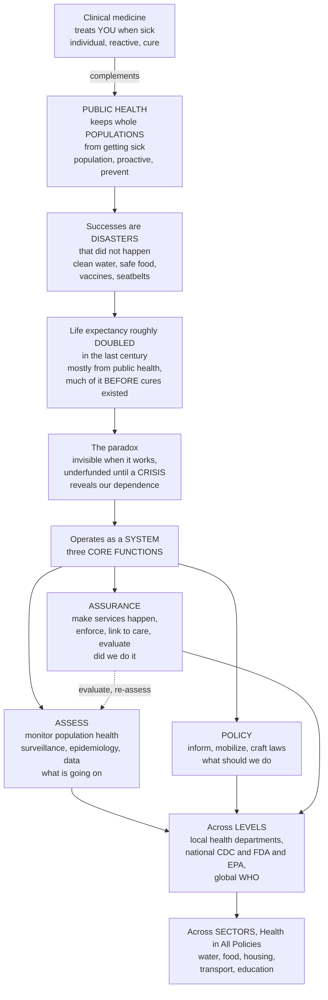

# 🛡️ Public Health Systems and Functions

> [!abstract] TL;DR
> **Clinical medicine treats *you* when you are sick; public health works — mostly invisibly — to keep *whole populations* from getting sick in the first place.** It is, in the Institute of Medicine's words, "what we, as a society, do collectively to assure the conditions in which people can be healthy." Its greatest triumphs are not dramatic cures but **disasters that never happened**: the clean water flowing from your tap, the safe food on your shelves, the vaccines that turned once-terrifying diseases into forgotten words, the seatbelt and clean-air laws. These measures have added more years to human life than all of curative medicine combined — **life expectancy roughly doubled in the last century, overwhelmingly from public health, not hospital cures** — and much of that mortality decline arrived *before* effective medical treatments existed. Yet public health is a victim of its own success: when it works, *nothing happens*, so it is invisible and chronically underfunded until a crisis suddenly reveals how much we depend on it. It operates as a **system** organized around three **core functions**: **Assessment** (monitor and diagnose population health through surveillance and epidemiology — "what's going on?"), **Policy Development** ("what should we do?"), and **Assurance** (make sure needed services actually happen — "did we do it?"). That system runs across **levels** — local health departments, national agencies like the CDC, and global bodies like the WHO — and across **every sector**, because health depends on water, food, housing, transport, and education, not just doctors. This opener frames the whole section: prevention, screening, environmental and occupational health, the social determinants and equity, and the policy and economics that follow.

---

## Intuition

**Analogy: the fire department you never notice, versus the ambulance you do.** Imagine a city with only ambulances — brilliant paramedics racing to every fire, pulling people from the flames, rushing burns to the hospital. Heroic, visible, and hopelessly losing. Now add a second, quieter institution: **fire codes, sprinklers, inspections, hydrants on every corner, and public education about not leaving the stove on.** This second institution has no dramatic rescues to show for its work — its success looks exactly like *an ordinary day where no building burned down*. Nobody thanks it, nobody photographs it, and in the annual budget fight it is the easiest line to cut, because you cannot see the fires it prevented. But it saves far more lives than every ambulance combined, and the day a fire finally rages out of control, the whole city suddenly remembers why it existed.

That second institution is **public health**. Clinical medicine is the ambulance — individual, reactive, treating the sick one patient at a time. Public health is the fire code — **population-scale, proactive, and prevention-first** — engineering the *conditions* so that fewer people ever get sick. Its wins are counterfactual (the cholera outbreak that didn't spread, the child who was never paralyzed by polio), which is exactly why it is undervalued: **a prevented disaster leaves no trace.** To make sense of an invisible thing, treat it as a *system* with a job description. That job has three verbs — it **assesses** the population's health (surveillance, epidemiology: *what's going on?*), it **develops policy** (*what should we do?*), and it provides **assurance** that the needed services actually reach people (*did we do it?*). Learn those three verbs, the levels they operate on, and the sectors they touch, and the invisible becomes legible.

---

## How It Works

### Core mechanics

**1. What public health *is* — the population, prevention lens.** Where clinical medicine asks "what is wrong with *this patient* and how do I cure it?", public health asks "what is affecting the health of *this population* and how do we prevent it?" The unit of analysis is the **population**, the default posture is **prevention** rather than treatment, and the toolkit is collective — laws, sanitation, immunization programs, safety regulation, environmental standards — not the prescription pad. Health is treated as something a *society produces*, not merely something a doctor repairs.

**2. The life-doubling record — mostly *not* from medicine.** In 1900 US life expectancy was about **47 years**; today it is roughly **78**. The dominant drivers were public-health measures — **clean water and sanitation, safer food and milk, control of infectious disease, vaccination, safer workplaces, family planning, motor-vehicle and tobacco-related safety**. The CDC's list of the **"Ten Great Public Health Achievements"** of the 20th century catalogs them. Crucially, the great declines in infectious mortality (tuberculosis, diarrheal disease) largely **preceded the arrival of effective drugs and vaccines** — the *McKeown thesis* — pointing to sanitation, nutrition, and living conditions rather than curative medicine. Historians estimate medical care accounts for only about **5 of the roughly 30 added years**; the rest came from prevention and improved conditions.

**3. The three core functions (IOM, 1988).** The Institute of Medicine's landmark report *The Future of Public Health* distilled the system into three functions that form a continuous cycle:
- **Assessment** — systematically **monitor and diagnose** the health of the population: surveillance, vital statistics, epidemiologic investigation, and data on hazards and risks. This is the "what's going on?" function — the sensing organ.
- **Policy Development** — use that evidence to **inform, educate, mobilize** communities and **craft policies, laws, and plans** that address priority problems. This is the "what should we do?" function — the deciding organ.
- **Assurance** — **ensure that the needed services are actually provided**, whether by enforcing laws and regulations, linking people to care, maintaining a competent workforce, or evaluating whether programs worked. This is the "did we do it, and did it work?" function — the acting organ. Its evaluation loops back to feed the next round of assessment.

**4. The Essential Public Health Services — the functions made operational.** The three functions are abstract, so they were operationalized into the **10 Essential Public Health Services** (originally 1994, **revised in 2020** to center equity). They map onto the functions: *assessment* covers monitoring health and diagnosing/investigating hazards; *policy development* covers informing/educating, mobilizing partnerships, and developing policies; *assurance* covers enforcing laws, linking to care, ensuring a competent workforce, and evaluating services — with **equity** and **research/innovation** running through all of them. They are the checklist a health department uses to know whether it is doing its whole job.

**5. The system and its structure — many levels, many disciplines, many sectors.** Public health is not one office but a **layered system**:
- **Local** health departments are the frontline — restaurant and water inspections, immunization clinics, vital records (birth/death certificates), communicable-disease follow-up, restaurant closures.
- **State/regional** authorities set standards, license, and coordinate.
- **National** agencies run the machinery of a whole country — in the US, the **CDC** (surveillance and response), **FDA** (food and drug safety), and **EPA** (environmental standards); elsewhere, national health ministries.
- **Global** bodies — the **WHO** and the **International Health Regulations (IHR)** — coordinate across borders, because pathogens and pollutants ignore them.
The work draws on many **disciplines** (epidemiology, biostatistics, environmental health, health policy, behavioral science, health education, laboratory science) and, critically, on many **sectors**. The **"Health in All Policies"** principle recognizes that housing, transport, food systems, education, and income — the **social determinants of health** — shape health more than clinical care does, so protecting health means acting far outside the health department.

**6. Prevention and population strategy — the strategic spine.** The system runs on the prevention ladder (**primary / secondary / tertiary**) and on Geoffrey Rose's insight that shifting the *whole population's* risk distribution slightly often prevents more disease than treating only the high-risk tail — even though the population strategy yields little visible benefit to any one person (the **prevention paradox**), which is precisely why it is politically hard.

**7. The investment paradox and its consequences.** Because prevention's payoff is **invisible and delayed** (averted, uncounted disasters), public health is chronically **underfunded relative to clinical care**, funded in **boom-and-bust cycles** that spike after each crisis and erode in the calm that follows. Layered on top are tensions over **individual liberty versus collective protection** (mandates, quarantine), **health equity**, and **politicization** — all of which make the *system* as much a political and organizational challenge as a technical one.

### Flow / architecture



---

## Key Concepts

### Secondary (intuitive foundation)

- **Public health vs the doctor.** A doctor treats *one sick person*; public health tries to stop *whole groups of people* from getting sick — through clean water, safe food, vaccines, and safety rules.
- **Prevention beats cure.** Public health mostly works *before* anyone is sick. Its biggest wins are things that *didn't* happen — an outbreak that never spread, a child never paralyzed by polio.
- **Why it seems invisible.** When public health works, nothing dramatic happens, so people forget it exists — and stop paying for it — until a crisis like a pandemic reminds everyone.
- **It doubled our lifespan.** A century ago people lived to about 47; now about 78. Most of that gain came from public-health measures like sanitation and vaccines, *not* from hospital treatments.
- **The three jobs.** Public health *checks* how healthy people are (assessment), *decides* what to do about it (policy), and *makes sure it actually happens* (assurance).

### Undergraduate (mechanisms and structure)

- **The IOM definition and the population lens.** "What we, as a society, do collectively to assure the conditions in which people can be healthy." The unit is the **population**, the posture is **prevention**, the tools are **collective** — distinguishing it from clinical medicine's individual, curative focus.
- **The three core functions.** **Assessment** (surveillance, epidemiology, data — *what's going on?*), **Policy Development** (evidence into laws, education, mobilization — *what should we do?*), and **Assurance** (deliver, enforce, evaluate — *did we do it?*) form a closed cycle.
- **The 10 Essential Public Health Services.** The operational checklist that turns the three functions into concrete activities, **revised in 2020** to place **equity** at the center.
- **The Ten Great Public Health Achievements.** Vaccination, motor-vehicle safety, safer workplaces, control of infectious diseases, decline in coronary/stroke deaths, safer/healthier foods, healthier mothers and babies, family planning, fluoridation of drinking water, and tobacco recognized as a hazard.
- **The multi-level system.** **Local** (inspections, clinics, vital records), **state**, **national** (CDC/FDA/EPA or a health ministry), and **global** (WHO, International Health Regulations) — each level with distinct authority and responsibility.
- **Governmental and non-governmental roles.** Government provides the legal authority, surveillance backbone, and safety-net services; NGOs, academia, and the private sector supply research, delivery, and advocacy.
- **Health in All Policies.** Because the **social determinants** (housing, income, education, transport, environment) dominate health outcomes, health-protective action must reach across sectors, not just the health department.

### Graduate (systems, strategy, and politics)

- **The McKeown thesis and the limits of medicine.** Thomas McKeown's argument that the historic decline in mortality owed more to **rising living standards, nutrition, and sanitation** than to medical intervention — the great infectious-mortality falls **preceded** effective drugs/vaccines. Contested in its particulars (it underweights specific public-health interventions like water purification), it remains the sharpest statement of why *prevention and conditions*, not cures, drove the epidemiologic transition.
- **Attribution of the lifespan gain.** Estimates (e.g., Bunker) attribute only about **5 of ~30** added 20th-century years to clinical care; the remainder reflects public health and broader social change — a decomposition with direct implications for how a society *allocates* its health budget between treatment and prevention.
- **Rose's population vs high-risk strategies and the prevention paradox.** Shifting the entire risk distribution usually prevents more total disease than treating the tail, yet confers negligible individual benefit — a structural reason population interventions are politically underpowered despite superior aggregate impact.
- **The investment paradox and boom-bust financing.** Prevention's benefits are **counterfactual, diffuse, and delayed**, so they are systematically **undercounted** in budgets that reward visible, attributable outputs; the result is chronic underfunding punctuated by post-crisis surges that recede once the crisis fades (the "**panic-and-neglect**" cycle).
- **The clinical–public-health resource imbalance.** High-income systems spend the vast majority of health dollars on **treatment** and a small single-digit fraction on **population-level prevention**, despite prevention's larger marginal return on population health — a persistent misallocation rooted in the visibility asymmetry.
- **Liberty versus collective health.** Mandates, quarantine, isolation, and regulation pit **individual autonomy** against **population protection**; the ethical and legal calibration of coercion (least-restrictive means, due process, proportionality) is a defining, recurring tension — and a lightning rod for **politicization**.
- **Equity as the organizing frame.** The 2020 revision of the Essential Services elevated **health equity** from one activity to the axis of the whole system, reframing assessment, policy, and assurance around the unequal distribution of the conditions for health.

---

## Python Demo

```python
# Public Health Systems and Functions -- two ideas visualized:
#   (a) THE PREVENTION IMPACT: the ~doubling of life expectancy over the last
#       century, decomposed to show that MOST of the gain came from PUBLIC-HEALTH
#       measures (sanitation, clean water, vaccines, safer food/work, tobacco
#       control) rather than clinical/medical treatment -- and that much of the
#       mortality decline PRECEDED effective cures (the McKeown-style point).
#   (b) THE INVESTMENT / INVISIBILITY PARADOX: prevention spends a small, VISIBLE
#       amount to avert a large, UNCOUNTED burden -- "the disasters that didn't
#       happen" -- so its enormous return is systematically invisible in budgets.
import numpy as np
import matplotlib.pyplot as plt

# ---------------- (a) LIFE EXPECTANCY RISE + ATTRIBUTION ----------------
years = np.array([1900, 1920, 1940, 1950, 1960, 1980, 2000, 2020])
life_exp = np.array([47.0, 54.1, 62.9, 68.2, 69.7, 73.7, 76.8, 78.0])  # US, approx

fig, (ax1, ax2) = plt.subplots(1, 2, figsize=(15, 6))

ax1.plot(years, life_exp, "o-", color="#0f766e", lw=2.8, label="US life expectancy at birth")
ax1.fill_between(years, 47, life_exp, color="#0f766e", alpha=0.08)

# Public-health milestones -- most predate or parallel, not follow, medical cures.
milestones = [
    (1908, "water\nchlorination"),
    (1920, "milk\npasteurization"),
    (1937, "safer food\n& sanitation"),
    (1955, "polio\nvaccine"),
    (1964, "tobacco\nreport"),
    (1968, "seatbelt\n& auto safety"),
]
for yr, label in milestones:
    le = np.interp(yr, years, life_exp)
    ax1.axvline(yr, color="#94a3b8", ls="--", lw=0.8)
    ax1.text(yr, 44.5, label, rotation=90, ha="center", va="top", fontsize=7, color="#475569")

ax1.annotate("Life expectancy roughly DOUBLED\n47 -> 78 years",
             xy=(2020, 78), xytext=(1935, 82), fontsize=9.5, color="#166534",
             arrowprops=dict(arrowstyle="->", color="#166534"))
ax1.set_title("(a) A century of prevention: life expectancy roughly doubled")
ax1.set_xlabel("Year")
ax1.set_ylabel("Life expectancy at birth (years)")
ax1.set_ylim(40, 88)
ax1.legend(loc="lower right", fontsize=8.5)
ax1.grid(alpha=0.25)

# Inset: attribution of the ~31-year gain (public health vs clinical medicine).
axins = ax1.inset_axes([0.10, 0.55, 0.34, 0.36])
gain_public, gain_clinical = 26.0, 5.0   # ~ Bunker-style split of the ~31-yr gain
axins.bar(["Public\nhealth", "Clinical\nmedicine"], [gain_public, gain_clinical],
          color=["#0f766e", "#f59e0b"])
for i, v in enumerate([gain_public, gain_clinical]):
    axins.text(i, v + 0.6, f"{v:.0f} yr", ha="center", fontsize=8, weight="bold")
axins.set_ylim(0, 32)
axins.set_title("Source of the added years", fontsize=8)
axins.tick_params(labelsize=7)

# ---------------- (b) THE INVESTMENT / INVISIBILITY PARADOX -------------
# For each program: a small VISIBLE cost buys a large, mostly UNCOUNTED averted
# burden -- illustrative, order-of-magnitude "return on prevention" units.
programs   = ["Clean water\n& sanitation", "Childhood\nvaccination", "Tobacco\ncontrol",
              "Road-safety\nlaws"]
visible_cost   = np.array([3.0, 2.0, 1.0, 1.5])      # what shows up in the budget
averted_burden = np.array([68.0, 44.0, 30.0, 18.0])  # disasters that did NOT happen

x = np.arange(len(programs))
w = 0.38
ax2.bar(x - w/2, visible_cost,   w, label="Visible cost (counted in budget)", color="#f59e0b")
ax2.bar(x + w/2, averted_burden, w, label="Averted burden (uncounted -- invisible)", color="#0f766e")

for i in range(len(programs)):
    ratio = averted_burden[i] / visible_cost[i]
    ax2.text(i + w/2, averted_burden[i] + 1.2, f"x{ratio:.0f}", ha="center",
             fontsize=9, weight="bold", color="#166534")

ax2.set_title("(b) The investment paradox: huge return, invisible in the ledger")
ax2.set_ylabel("Relative units (illustrative)")
ax2.set_xticks(x)
ax2.set_xticklabels(programs, fontsize=8.5)
ax2.legend(fontsize=8, loc="upper right")
ax2.grid(axis="y", alpha=0.25)
ax2.text(1.5, averted_burden.max()*0.60,
         "Success = the disaster that\ndidn't happen -> no line item -> underfunded",
         ha="center", fontsize=8.5, style="italic", color="#334155")

plt.tight_layout()
plt.savefig("public_health_systems_and_functions.png", dpi=130, bbox_inches="tight")
plt.show()

# ---------------- printed summary --------------------------------------
total_gain = life_exp[-1] - life_exp[0]
print(f"Life expectancy 1900 -> 2020: {life_exp[0]:.0f} -> {life_exp[-1]:.0f} "
      f"(+{total_gain:.0f} years, roughly doubled)")
print(f"Attributed: ~{gain_public:.0f} yr public health vs ~{gain_clinical:.0f} yr clinical care")
print("Return on prevention (averted burden / visible cost):")
for p, c, b in zip(programs, visible_cost, averted_burden):
    print(f"  {p.splitlines()[0]:22s} -> {b/c:5.0f}x")
```

**What it shows.** Panel (a) plots the roughly *doubling* of US life expectancy from about 47 to 78 years across the last century, with the great public-health milestones — water chlorination, pasteurization, food safety, vaccines, tobacco control, auto safety — marking the timeline; the inset decomposes the ~31-year gain and drives home the central, counter-intuitive fact that only about **5 years** trace to clinical medicine while roughly **26** came from **prevention and improved conditions** (much of it before effective cures existed). Panel (b) dramatizes the **investment paradox**: each prevention program spends a small, *visible* amount (the orange bar that appears in the budget) to avert a far larger, *uncounted* burden (the teal bar — the disasters that never happened), so a program returning many-fold its cost still looks like pure expense on the ledger — the structural reason the most successful public-health measures are the first to be cut.

---

## Real-World Applications

- **The sanitary revolution and clean water.** Chlorinated, filtered municipal water and sewage systems drained more mortality from cities than any drug — cholera and typhoid collapsed decades before antibiotics. It is the archetypal public-health achievement: **primary prevention at population scale**, invisible in daily life, catastrophic in its absence (as recurrent cholera outbreaks in conflict zones still show).
- **The CDC as the national assessment engine.** The US Centers for Disease Control and Prevention embodies the **Assessment** function — running national surveillance (notifiable diseases, the *MMWR*), investigating outbreaks (Epidemic Intelligence Service), and translating data into guidance. When it detects a signal, the **Policy** and **Assurance** functions across federal, state, and local levels are what turn detection into response.
- **The WHO and the International Health Regulations.** Global public health as a system: the WHO coordinates surveillance, declares **Public Health Emergencies of International Concern (PHEIC)**, and runs eradication and immunization programs. Smallpox eradication (1980) — surveillance plus ring vaccination across every level from village to WHO — is the system's crowning proof of concept.
- **Tobacco control.** A multi-decade, cross-sector policy campaign — the 1964 Surgeon General's report (assessment), taxation, advertising bans, smoke-free laws (policy), and enforcement plus cessation services (assurance) — that halved smoking prevalence and is among the largest life-expectancy gains of the late 20th century. A textbook of the three functions operating together over generations.
- **Motor-vehicle and road safety.** Seatbelt laws, drunk-driving enforcement, vehicle standards, and road engineering cut per-mile death rates by roughly 90% across the century — health protection delivered almost entirely *outside* the clinic, through **regulation and design** in the transport sector (Health in All Policies in action).
- **The COVID-19 pandemic — the paradox laid bare.** Decades of underinvestment left surveillance, laboratory, and workforce capacity thin; the crisis triggered an enormous, sudden surge of attention and funding — the boom half of the boom-bust cycle — and exposed how a normally invisible system underpins everything, alongside the acute liberty-versus-collective-protection tensions of mandates and closures.

---

## Common Pitfalls

- **Equating "health" with "health care."** The most common error: assuming doctors and hospitals produce health. Most of the gain came from **conditions** — water, food, housing, safety, behavior — that clinical care never touches. Conflating the two leads to over-investing in treatment and starving prevention.
- **Mistaking invisibility for ineffectiveness.** Because public health's successes are **disasters that did not happen**, they generate no visible output, and budget-makers cut what they cannot see. The absence of an outbreak is *not* evidence the system is unnecessary — it is evidence it is working.
- **Boom-and-bust funding ("panic and neglect").** Pouring resources in *during* a crisis and withdrawing them the moment it passes destroys the standing capacity — surveillance, labs, trained epidemiologists — that only pays off across the *next* crisis. Public-health capacity is a stock, not a tap.
- **Reducing the system to one function.** Treating public health as *only* surveillance (assessment) or *only* clinics (a sliver of assurance) misses that the power comes from the **closed loop** — assess, decide, act, evaluate, re-assess. A health department that monitors but cannot mobilize policy, or legislates but cannot ensure delivery, fails.
- **Ignoring the prevention paradox in politics.** Population strategies prevent the most disease but deliver no felt benefit to individuals, so they are politically fragile; framing them as if their aggregate success will be individually appreciated sets them up to be defunded.
- **Confusing the levels' roles.** Expecting a local health department to do national surveillance, or the WHO to inspect a restaurant, misallocates responsibility. Each level — local, national, global — has distinct authority; effective response requires them to interlock, not substitute.
- **Framing mandates as purely technical.** Quarantine, isolation, and vaccination requirements sit at the **liberty-versus-collective-protection** fault line. Treating them as if they were only epidemiology — ignoring the ethical, legal, and political calibration of coercion — invites backlash that undermines the science.

---

## Related Concepts

This is the **section opener** for **05 · Public Health Practice and Policy**. The notes that follow each drill into one facet of the system introduced here. *Health_Promotion_and_Disease_Prevention* expands the primary/primordial end of the prevention ladder and behavior change; *Screening_Programs_and_Early_Detection* develops secondary prevention and the biases that make it hard to evaluate; *Environmental_and_Occupational_Health* covers the environmental and workplace hazards a health department assesses and regulates; *Social_Determinants_and_Health_Equity* takes up the upstream "causes of the causes" and the equity axis now central to the essential services; and *Health_Policy_and_Economics_of_Public_Health* formalizes the policy-development function and the investment paradox into the economics of allocation. (These siblings are referenced in prose; the wikilinks below point only to Glob-verified notes elsewhere in the vault.)

- [[Epidemiology_and_Public_Health/01_Foundations_of_Epidemiology/Epidemiology_and_Public_Health_Overview|Epidemiology and Public Health Overview]] — the vault's front door; this note is the *systems and institutions* companion to that conceptual overview.
- [[Epidemiology_and_Public_Health/01_Foundations_of_Epidemiology/Natural_History_of_Disease_and_Prevention_Levels|Natural History of Disease and Levels of Prevention]] — the primary/secondary/tertiary prevention ladder and the prevention paradox that this system operationalizes.
- [[Epidemiology_and_Public_Health/01_Foundations_of_Epidemiology/The_Epidemiologic_Transition_and_Burden_of_Disease|The Epidemiologic Transition and Burden of Disease]] — the shift from infectious to chronic disease that public-health measures drove, and the metrics of population burden.
- [[Epidemiology_and_Public_Health/04_Infectious_Disease_Epidemiology/Infectious_Disease_Epidemiology|Infectious Disease Epidemiology]] — the surveillance-and-response machinery that the **Assessment** and **Assurance** functions run against outbreaks.
- [[Health_Nutrition_and_Longevity/06_Public_Health_and_Prevention/Public_Health_and_Epidemiology|Public Health and Epidemiology]] — a complementary population-health overview from the health-and-longevity vault. *(Health, Nutrition & Longevity vault)*
- [[Health_Nutrition_and_Longevity/06_Public_Health_and_Prevention/Global_Health_and_Health_Systems|Global Health and Health Systems]] — the WHO, health-system financing, and the global level of the public-health system. *(Health, Nutrition & Longevity vault)*
- [[Health_Nutrition_and_Longevity/01_Foundations_of_Health/Determinants_of_Health|Determinants of Health]] — the social determinants and "Health in All Policies" logic that make public health a cross-sector enterprise. *(Health, Nutrition & Longevity vault)*
- [[Political_Science/04_Public_Policy_and_Political_Economy/Policy_Analysis_and_the_Policy_Process|Policy Analysis and the Policy Process]] — the policy-development function seen through the lens of how public policy is actually made. *(Political Science vault)*
- [[Clinical_Medicine/06_Clinical_Reasoning_and_Modern_Medicine/The_Reach_and_Future_of_Clinical_Medicine|The Reach and Future of Clinical Medicine]] — the individual, curative counterpart whose reach public health complements and often dwarfs at the population scale. *(Clinical Medicine vault)*
- [[Sociology/06_Applied_and_Contemporary_Sociology/Health_Inequality_and_Medical_Sociology|Health Inequality and Medical Sociology]] — the social patterning of health that public-health assessment measures and equity-centered policy targets. *(Sociology vault)*

---

## Review Questions

### Secondary

1. Using the "fire department versus ambulance" analogy, explain the difference between public health and clinical medicine. Why do people tend to notice and value one far more than the other?
2. Name three public-health measures (not medical treatments) that helped roughly *double* human life expectancy over the last century, and say what each one prevents.
3. The three core functions of public health can be summed up as three questions: "What's going on?", "What should we do?", and "Did we do it?" Match each question to its function (assessment, policy, assurance) and give one example activity for each.

### Undergraduate

1. State the Institute of Medicine's definition of public health and use it to explain three ways public health differs from clinical medicine (unit of analysis, posture toward disease, and toolkit).
2. Describe how the three core functions form a **closed cycle**, and explain why a health department that performs assessment well but cannot mobilize policy or ensure delivery still fails at its mission.
3. Public health operates across **levels** (local, national, global). Assign each of these tasks to the appropriate level and justify it: inspecting a restaurant; declaring a Public Health Emergency of International Concern; setting national air-quality standards.

### Graduate

1. Explain the **McKeown thesis** and the roughly 5-of-30-years attribution of the 20th-century lifespan gain to clinical care. What does this decomposition imply about how a society *should* allocate marginal health spending between treatment and prevention, and what are the strongest objections to acting on it?
2. Analyze the **investment/invisibility paradox** and the boom-bust ("panic and neglect") financing cycle. Why does the counterfactual, diffuse, delayed nature of prevention's benefits make it structurally underfunded, and what mechanisms (accounting, institutional, political) might counteract this?
3. Public-health mandates (quarantine, vaccination requirements) sit at the tension between **individual liberty** and **collective protection**. Using a specific example, argue how a public-health authority should calibrate coercion — referencing least-restrictive means, proportionality, and the risk that politicization undermines the underlying science.

---

## Sources

- Institute of Medicine. (1988). *The Future of Public Health*. National Academies Press — the report that defined the three core functions (assessment, policy development, assurance). [https://doi.org/10.17226/1091](https://doi.org/10.17226/1091)
- Turnock, B. J. *Public Health: What It Is and How It Works* (6th ed.). Jones & Bartlett — the standard text on the public-health system, functions, and essential services.
- Gordis, L. (Celentano, D. D., & Szklo, M., eds.). *Epidemiology* (6th ed.). Elsevier — chapter on epidemiology and public health, prevention, and the population perspective.
- Centers for Disease Control and Prevention. (1999). "Ten Great Public Health Achievements — United States, 1900–1999." *MMWR*, 48(12), 241–243. [https://www.cdc.gov/mmwr/preview/mmwrhtml/00056796.htm](https://www.cdc.gov/mmwr/preview/mmwrhtml/00056796.htm)
- Centers for Disease Control and Prevention. "The 10 Essential Public Health Services" (2020 revision). [https://www.cdc.gov/public-health-gateway/php/about/index.html](https://www.cdc.gov/public-health-gateway/php/about/index.html)

---

#epidemiology #public-health #core-functions #prevention #health-systems
