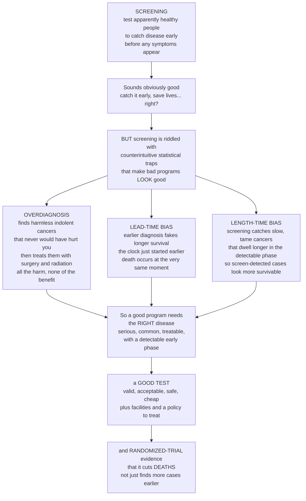

# 🔎 Screening Programs and Early Detection

> [!abstract] TL;DR
> **Screening** applies a test to *apparently healthy, symptom-free* people to catch disease early — in its silent, **detectable preclinical phase** — so treatment can start sooner. It sounds like an unambiguous good ("catch cancer early, save lives"), but it is one of the most **counterintuitive** areas of public health, riddled with statistical traps that make bad programs look brilliant and can end up *harming* healthy people. **Overdiagnosis** finds indolent cancers that would never have caused symptoms — and then treats them, delivering all the harm of surgery and radiation with none of the benefit. **Lead-time bias** makes survival-from-diagnosis look longer merely because the clock started earlier, even when death occurs at the exact same moment. **Length-time bias** means screening preferentially catches slow, tame cancers, so screen-detected cases *look* more survivable only because you cherry-picked the harmless ones. Because of these illusions, deciding whether to screen for a disease is a genuinely hard evidence question. Good screening demands the **right disease** (serious, common, treatable, with a detectable early phase — the **Wilson–Jungner** criteria), a **good test**, and, crucially, **randomized-trial evidence that it reduces DEATHS** — not just that it "finds more cases earlier." This is exactly why mammography and PSA screening are so fiercely debated.

---

## Intuition

**Analogy: a fire alarm in a city of ten thousand kitchens.** Imagine you install smoke detectors in every home to catch house fires early — obviously a good idea. But now run that intuition through the traps that plague screening. First, **most alarms that go off are burnt toast, not fires**: when real fires are rare, even a fairly accurate detector produces mostly false alarms, and every false alarm sends a fire crew smashing down a door — the *false-positive* harm. Second, some "fires" the detector flags are **embers that would have burned out on their own** and never threatened the house; but once flagged, the crew hoses everything down anyway, causing water damage to a home that was never in danger — that is **overdiagnosis and overtreatment**, harming the healthy. Third, suppose you want to prove your alarms save homes. You could measure "time from *alarm* to the house burning down" and boast it is getting longer — but if you simply detect fires *earlier*, that number grows even when exactly the same houses burn to the ground at exactly the same time: the **lead-time illusion**, an earlier clock, not a saved house. And because slow-smoldering fires trip the alarm for hours while flash fires are over in minutes, your alarms disproportionately catch the *slow* fires — which were the survivable ones anyway (**length-time bias**). The only honest question is not "do we detect more fires?" but "do fewer houses burn *down*?" — and answering it requires a controlled experiment, not a survival statistic.

Translated into medicine: the "kitchens" are asymptomatic people, the "fires" are diseases in their silent preclinical phase, and the "alarm" is a screening test. Screening's promise is real — you can genuinely intercept a deadly cancer before it spreads. But its intuitive appeal is exactly what makes its traps dangerous: the very statistics that *should* tell you a program works can be manufactured by biases even when it does nothing. Intuition first: understand the traps *before* you trust the survival curve.

---

## How It Works

### Core Mechanics

**1. Screening is secondary prevention — testing the well, not the sick.** Ordinary diagnosis begins when a patient *notices a symptom* and seeks care. Screening reaches *earlier*, into the **detectable preclinical phase (DPCP)** — the window after biological onset but before symptoms, during which a test can already turn positive. By shifting detection into that silent window, screening aims to start treatment while the disease is more curable. It is the operational heart of **secondary prevention**.

**2. Screening is not diagnosis — it only sorts, it does not confirm.** A screening test partitions the population into *screen-positive* (higher risk, needs follow-up) and *screen-negative*. A positive is **not a diagnosis**; it triggers a **diagnostic work-up** (biopsy, colonoscopy, confirmatory imaging) that establishes truth. This two-step structure is why a screening test is tuned for **high sensitivity** (miss few real cases) and tolerable specificity, accepting that some positives will be false and resolved downstream.

**3. When is screening worth doing? The Wilson–Jungner criteria (WHO, 1968).** Screening the healthy is only justified when a bundle of conditions holds, grouped into disease, test, and program:

- **The disease** must be an *important* health problem, *common* enough to be worth the effort, with a *recognizable latent or early symptomatic stage* and a *well-understood natural history* — and, most critically, an **effective treatment that works better when started early**. If early treatment is no better than late, finding disease sooner only lengthens the time you *know* you are sick.
- **The test** must be *valid* (good **sensitivity** and **specificity**), *acceptable* to the population, *safe*, and *inexpensive*.
- **The program** must have the *facilities* for diagnosis and treatment, an *agreed policy* on whom to treat, favorable *cost-effectiveness*, and it must run as a **continuing process**, not a one-off campaign.

**4. The three counterintuitive biases that fake success.** Because a program is judged by outcomes among the *screen-detected*, three biases can make a *useless* program look lifesaving:

- **Lead-time bias.** Screening moves diagnosis earlier by an interval (the **lead time**). Survival is measured *from diagnosis*, so it automatically grows longer even if the moment of death is unchanged. The clock started earlier; the patient did not live longer.
- **Length-time bias.** Slow-growing, indolent tumors spend *longer* in the detectable preclinical phase than fast, aggressive ones. A periodic screen is therefore far more likely to catch the slow, better-prognosis cases and miss the fast, lethal ones that surface between screens (interval cancers). Screen-detected cancers look more survivable — because they are a biased, *tame* sample.
- **Overdiagnosis.** The extreme of length bias: detecting non-progressive or ultra-slow "disease" that would *never* have caused symptoms or death in the person's lifetime. Overdiagnosis inflates apparent incidence and cure rates while inflicting **overtreatment** — real harm on someone who was never going to be harmed by the disease.

Add **healthy-screenee (volunteer) bias**: people who show up for screening are healthier and more health-conscious than those who do not, so they would have done better *regardless* of screening.

**5. The gold standard: randomized trials with a disease-specific mortality endpoint.** Because survival, five-year-survival, case-counts, and stage-shift are all corruptible by the biases above, the only clean proof that screening helps is a **randomized controlled trial** comparing *invited-to-screen* versus *not-invited* groups, measured on **disease-specific mortality** (deaths from that disease per population) — ideally alongside all-cause mortality. This asks the honest question: *do fewer people die?* — not *do we find more cases earlier?*

**6. Weighing benefits against harms — the number needed to screen.** Every program is a ledger. Benefits: deaths averted, some morbidity avoided. Harms: **false positives** (anxiety, invasive follow-up, cost), **false negatives** (false reassurance, delayed care), **overdiagnosis/overtreatment**, radiation and procedure risk, and money. The **number needed to screen (NNS)** — how many people must be screened over how many years to prevent one death — summarizes the benefit side and is often sobering (hundreds to thousands), which is why the *harm* side of the ledger cannot be waved away.

### Flow / Architecture



---

## Key Concepts

### Secondary Level

- **Screening.** Testing people who *feel fine* to find hidden disease early, before symptoms, so treatment can start sooner. A mammogram before you feel a lump; a blood-pressure check before a stroke.
- **Screening is not the same as a diagnosis.** A positive screen means "you *might* have it — let us check properly," not "you have it." It is followed by a proper diagnostic test to be sure.
- **Why "catch it early" is not automatically good.** Finding a disease sooner only helps if treating it sooner actually changes what happens to you. If early treatment is no better than later treatment, all screening does is make you *worry* for longer.
- **The four things that can go wrong.** *False alarm* (test positive but you are fine — leads to scary, sometimes harmful follow-up). *Missed case* (test negative but you are actually sick — false reassurance). *Overdiagnosis* (finding a harmless disease that would never have bothered you — then treating it and causing harm). *Illusions* that make screening look better than it is.
- **The honest question.** Not "did we find more cancers?" but "did *fewer people die*?" Only a careful experiment can answer that.

### Undergraduate Level

- **Detectable preclinical phase (DPCP) and the sojourn time.** The silent window between when a test *could* first detect disease and when symptoms *would* appear. Its length — the **sojourn time** — sets both whether screening is possible and how *often* you must screen: a long DPCP (cervical dysplasia, years) is screen-friendly; a near-zero DPCP is not.
- **Lead time.** The interval by which screening advances the diagnosis. It is the raw material of lead-time bias: survival measured from diagnosis is inflated by exactly the lead time even when death is not postponed.
- **Sensitivity, specificity, and predictive value in a healthy population.** A screening test's **sensitivity** (catches true cases) and **specificity** (clears the healthy) are fixed properties, but the **positive predictive value (PPV)** — the chance a positive is real — collapses when **prevalence** is low. In a healthy screened population most disease is *absent*, so even a very specific test produces *mostly false positives*. This is the Bayesian core shared with the clinical-diagnostics view.
- **Length-time bias, precisely.** A single screen is *length-biased sampling*: the probability a case is caught is roughly proportional to how long it sits in the DPCP. Slow tumors dwell longer and are over-sampled; fast tumors are under-sampled and surface as **interval cancers**. Screen-detected disease is therefore a prognostically favorable, non-representative slice.
- **Overdiagnosis vs false positive — a crucial distinction.** A *false positive* is a positive test in a person who does **not** have the disease. **Overdiagnosis** is a *correct* detection of a *real* histological disease that would never have progressed to cause symptoms or death. Both cause harm, but overdiagnosis is more insidious because the patient truly "has cancer" — and gets treated for it.
- **Number needed to screen (NNS).** The count of people who must be screened, over a defined period, to prevent one disease-specific death. It reframes headline "relative risk reductions" into concrete population effort and sits opposite the tally of false positives and overdiagnoses.
- **Program, not a test.** Screening is an *ongoing system* — invitation, testing, recall, diagnostic follow-up, treatment, quality control, and re-screening on a schedule — governed by an agreed policy. A one-off test without the follow-through is not a screening program.

### Graduate Level

- **Why survival is the wrong endpoint and mortality is the right one.** Five-year survival, case-fatality among detected cases, and stage-shift are all *confounded by construction* by lead-time and length-time bias and by overdiagnosis (which adds never-fatal "cases" to the survivor pool, mechanically raising survival). Only **disease-specific mortality in an intention-to-screen randomized comparison** breaks all three simultaneously, because randomization balances the biased sampling and the denominator is the whole invited population, not the detected cases. Watch **all-cause mortality** too: a program can lower disease-specific deaths yet cause equal harm elsewhere (treatment mortality), leaving total deaths unchanged.
- **Overdiagnosis as an identifiability problem.** For an *individual* screen-detected cancer you can almost never know whether it was overdiagnosed — the counterfactual (what it would have done untreated) is unobservable once you treat. Overdiagnosis is estimated at the *population* level, e.g. as the excess cumulative incidence in a screened arm that is never "paid back" by a later deficit after screening stops, or via long-term follow-up of untreated indolent disease. This unobservability is *why* it is so easy to deny and so hard to communicate.
- **The Wilson–Jungner criteria as a decision framework, updated.** The 1968 principles remain the backbone, but modern additions (Andermann et al., 2008) fold in *informed consent and equity*, *evidence from RCTs*, *program quality assurance*, and *explicit attention to overdiagnosis and opportunity cost*. The pivotal, most-violated criterion remains **treatment that is more effective when started early**; without it, an excellent test and a serious disease still produce a *harmful* program.
- **The genuine controversies map to the biases.** *Mammography*: real but modest mortality benefit with substantial overdiagnosis — the debate is about the ratio. *PSA for prostate cancer*: an enormous DPCP full of indolent tumors makes it the archetype of overdiagnosis; guidelines shifted to shared decision-making and active surveillance rather than reflexive treatment. *Cervical (Pap/HPV)* and *newborn metabolic screening*: clear wins — long DPCP, effective early treatment, favorable harm profile. *Lung-CT* and *colorectal*: RCT-supported in *defined high-risk* groups, illustrating that the right *target population* is part of the answer.
- **Selection and length bias in observational evaluations.** Case-control and cohort evaluations of screening are haunted by **healthy-screenee (self-selection) bias** and by **length bias in prevalent-screen detection**. Corrections exist (e.g. adjusting for the prevalence/incidence screen distinction, or the Miettinen approach to screening case-control studies), but they are fragile — reinforcing why the RCT with a mortality endpoint is the standard of proof.
- **Where this sits in the vault's logic.** Screening is the deep dive on the *secondary-prevention* stage introduced in the natural-history map; its biases are special cases of the selection- and information-bias machinery; its predictive-value arithmetic is the population face of the clinical diagnostics note; and its evidentiary standard is exactly the randomized-trial design used throughout epidemiology. It is where measurement, bias, prevention, and study design meet a decision that touches millions of healthy people.

---

## Python Demo

```python
# Screening: why "screen-detected patients live longer" can be an ILLUSION,
# and why screening a healthy (low-prevalence) population yields mostly false alarms.
#
# (a) LEAD-TIME BIAS  -- same person, same death, two survival measurements.
# (b) LENGTH-TIME BIAS -- a single screen over-samples slow, long-sojourn cancers.
# (c) PPV vs PREVALENCE -- in the healthy population most positives are FALSE.
# (d) BENEFIT vs HARM   -- per 1000 screened: deaths averted vs false positives
#                          and overdiagnoses (the ledger screening must balance).
import numpy as np
import matplotlib.pyplot as plt

rng = np.random.default_rng(7)
fig, axes = plt.subplots(2, 2, figsize=(14, 10))

# ----- (a) LEAD-TIME BIAS ----------------------------------------------------
axA = axes[0, 0]
# One patient's timeline. Death occurs at the SAME time either way.
bio_onset   = 0.0
screen_dx   = 2.0    # screening detects disease here (earlier)
clinical_dx = 6.0    # symptoms would surface here (usual diagnosis)
death       = 10.0
lead_time   = clinical_dx - screen_dx

# Two "survival from diagnosis" measurements for the identical life:
axA.hlines(y=2, xmin=screen_dx,   xmax=death, color="#0f766e", lw=9,
           label=f"screen-detected: survival = {death-screen_dx:.0f} yrs")
axA.hlines(y=1, xmin=clinical_dx, xmax=death, color="#b45309", lw=9,
           label=f"symptom-detected: survival = {death-clinical_dx:.0f} yrs")

for x, name, col in [(bio_onset, "biological\nonset", "#94a3b8"),
                     (screen_dx, "screen\ndetection", "#0f766e"),
                     (clinical_dx, "symptom\ndiagnosis", "#b45309"),
                     (death, "DEATH\n(same moment)", "#991b1b")]:
    axA.axvline(x, color=col, ls="--", lw=1.1)
    axA.text(x, 2.75, name, ha="center", va="bottom", fontsize=8, color=col)

axA.annotate("", xy=(clinical_dx, 0.45), xytext=(screen_dx, 0.45),
             arrowprops=dict(arrowstyle="<->", color="#6d28d9", lw=1.6))
axA.text((screen_dx + clinical_dx)/2, 0.25,
         f"lead time = {lead_time:.0f} yrs\n(survival inflated, death UNCHANGED)",
         ha="center", va="top", fontsize=8.5, color="#6d28d9")

axA.set_title("(a) Lead-time bias: earlier clock, not a longer life")
axA.set_xlabel("Time (years)")
axA.set_yticks([])
axA.set_ylim(0, 3.4)
axA.set_xlim(-0.5, 11)
axA.legend(loc="upper left", fontsize=8)

# ----- (b) LENGTH-TIME BIAS --------------------------------------------------
axB = axes[0, 1]
# Tumors have random sojourn times in the detectable preclinical phase.
# A single screen catches a tumor with prob ~ proportional to its sojourn
# (it is "on display" longer) -> length-biased sampling toward slow tumors.
n = 400_000
sojourn = rng.exponential(scale=2.0, size=n)          # all incident tumors
p_detect = sojourn / sojourn.max()                    # length-biased detection
screen_detected = sojourn[rng.random(n) < p_detect]   # what a screen catches

bins = np.linspace(0, 14, 60)
axB.hist(sojourn, bins=bins, density=True, alpha=0.55, color="#64748b",
         label=f"ALL incident tumors (mean sojourn {sojourn.mean():.1f} yr)")
axB.hist(screen_detected, bins=bins, density=True, alpha=0.65, color="#0f766e",
         label=f"SCREEN-detected (mean {screen_detected.mean():.1f} yr)")
axB.axvline(sojourn.mean(), color="#334155", ls="--", lw=1.2)
axB.axvline(screen_detected.mean(), color="#0f766e", ls="--", lw=1.2)
axB.set_title("(b) Length-time bias: screening over-samples slow, tame tumors")
axB.set_xlabel("Sojourn time in detectable phase (years) -- longer = slower/kinder")
axB.set_ylabel("Density")
axB.legend(fontsize=8)

# ----- (c) PPV vs PREVALENCE -------------------------------------------------
axC = axes[1, 0]
sens, spec = 0.90, 0.95                                # a genuinely GOOD test
prev = np.linspace(0.0005, 0.20, 600)
ppv = (sens * prev) / (sens * prev + (1 - spec) * (1 - prev))
axC.plot(prev * 100, ppv * 100, color="#7c3aed", lw=2.6)
for pv in [0.005, 0.02, 0.05]:
    y = (sens*pv) / (sens*pv + (1-spec)*(1-pv))
    axC.scatter([pv*100], [y*100], color="#7c3aed", zorder=5)
    axC.annotate(f"prev {pv*100:.1f}%\n-> PPV {y*100:.0f}%",
                 xy=(pv*100, y*100), xytext=(pv*100+2, y*100+8),
                 fontsize=8, arrowprops=dict(arrowstyle="->", color="#7c3aed"))
axC.set_title(f"(c) PPV collapses at low prevalence (sens {sens:.0%}, spec {spec:.0%})")
axC.set_xlabel("Disease prevalence in screened population (%)")
axC.set_ylabel("Positive predictive value (%)")
axC.set_ylim(0, 100)
axC.grid(alpha=0.3)

# ----- (d) BENEFIT vs HARM LEDGER (per 1000 screened, illustrative) ----------
axD = axes[1, 1]
# Stylized figures echoing mammography-style trials over ~10 yrs of screening.
per_1000 = {
    "Deaths averted":        1,
    "Overdiagnosed\n(overtreated)": 3,
    "False positives\n(recall/biopsy)": 100,
}
labels = list(per_1000.keys())
vals   = list(per_1000.values())
colors = ["#16a34a", "#dc2626", "#f59e0b"]
bars = axD.barh(labels, vals, color=colors)
for b, v in zip(bars, vals):
    axD.text(v + 1.5, b.get_y() + b.get_height()/2, f"{v}",
             va="center", fontsize=10, fontweight="bold")
axD.set_title("(d) The ledger: per 1000 people screened (illustrative)")
axD.set_xlabel("Number of people affected")
axD.set_xlim(0, 120)
axD.invert_yaxis()

plt.tight_layout()
plt.savefig("screening_and_early_detection.png", dpi=120, bbox_inches="tight")

# ----- printed summary -------------------------------------------------------
print("Lead-time bias: survival 'from diagnosis' went",
      f"{death-clinical_dx:.0f} -> {death-screen_dx:.0f} yrs, but death stayed at t={death:.0f}.")
print(f"Length-time bias: screen-detected mean sojourn {screen_detected.mean():.2f} yr",
      f"vs {sojourn.mean():.2f} yr for all tumors (screening cherry-picks slow ones).")
print(f"PPV at 0.5% prevalence with a 90/95 test: "
      f"{(sens*0.005)/(sens*0.005 + (1-spec)*0.995)*100:.1f}% -> most positives are FALSE.")
```

**What it shows.** Panel **(a)** draws a single patient whose death is fixed at year 10. Detecting the disease at year 2 (screen) instead of year 6 (symptoms) *doubles* the "survival from diagnosis" from 4 to 8 years — purely because the clock started earlier. That extra time *is* the lead time; no life was extended. Panel **(b)** simulates the length-biased sampling a single screen performs: because slow tumors linger in the detectable window, the screen-detected pile is shifted markedly toward long sojourn times — the tame, better-prognosis cancers — so "screen-detected patients do better" is partly an artifact of *which* cancers got caught. Panel **(c)** is the healthy-population trap: even a strong test (90% sensitivity, 95% specificity) yields a **positive predictive value of only ~8%** at 0.5% prevalence — over 90% of positives are false alarms — which is why we do not screen everyone for everything. Panel **(d)** lays the benefit against the harm on the same axis: for a headline "one death averted per 1000 screened," the same 1000 people absorb roughly 100 false positives and a few overdiagnoses/overtreatments — the ledger a screening program is ethically obliged to balance.

---

## Real-World Applications

- **Cervical cancer (Pap smear and HPV DNA) — the success story.** An exceptionally *long* detectable preclinical phase (pre-cancerous dysplasia progresses over years) plus *effective early treatment* (excising a lesion before it invades) makes cervical screening a textbook win: incidence and mortality fell dramatically wherever organized programs took hold. The move from cytology (Pap) to primary **HPV testing** raised sensitivity and lengthened safe screening intervals — a program getting *better* by respecting the natural history.
- **Breast cancer (mammography) — the hard debate.** RCTs show a *real but modest* reduction in breast-cancer mortality, accompanied by *substantial overdiagnosis* (ductal carcinoma in situ and slow invasive cancers that may never have surfaced) and many false-positive recalls. The controversy is not "does it work at all" but *the ratio* of lives saved to women overdiagnosed and over-treated — which is why guidelines diverge on the starting age and interval and increasingly stress **informed choice**.
- **Prostate cancer (PSA) — the overdiagnosis archetype.** Prostate cancer's huge reservoir of indolent, slow disease means PSA screening detects vast numbers of cancers that would never have caused harm, with treatment (surgery, radiation) risking incontinence and impotence. Trials showed at best a small mortality benefit swamped by overdiagnosis, driving guidelines toward **shared decision-making** and **active surveillance** instead of reflexive treatment.
- **Colorectal cancer (FIT, colonoscopy, sigmoidoscopy).** Backed by RCTs showing reduced colorectal-cancer mortality (and, by removing adenomas, some *incidence* reduction — screening that verges on primary prevention). A clear case where a treatable early stage and a real precursor lesion make screening worthwhile in the right age band.
- **Lung cancer (low-dose CT).** RCTs (NLST, NELSON) demonstrate mortality reduction — but *only* in a *defined high-risk* group (heavy smoking history and age range). It is the poster child for the principle that the correct *target population* is part of whether screening helps or harms; screen the low-risk and false positives and overdiagnosis dominate.
- **Newborn screening (heel-prick metabolic panel) — a near-unambiguous win.** Testing every newborn for rare, treatable conditions (phenylketonuria, congenital hypothyroidism, and others): a serious disease, a devastating outcome if missed, and a *highly effective early treatment* (dietary or hormonal) that prevents irreversible harm. When early treatment truly changes destiny, the Wilson–Jungner logic points firmly toward screening.

---

## Common Pitfalls

- **Judging screening by five-year survival.** The single most common error. Survival is inflated by lead-time and length-time bias and by overdiagnosis (never-fatal cases padding the survivor pool). A program can raise five-year survival from 60% to 90% while changing *zero* deaths. Only **disease-specific mortality from a randomized comparison** is trustworthy.
- **Confusing "we detect more cancers" with "we prevent deaths."** More case-detection is *expected* from screening even when it saves no one — because overdiagnosis manufactures extra cases. Rising incidence after a screening program launches is often a *warning sign* of overdiagnosis, not proof of benefit.
- **Treating a positive screen as a diagnosis.** A positive sorts you into "needs a proper work-up," not "has the disease." Acting on the screen alone — or letting patients hear "you have cancer" from a screening result — inflicts anxiety and sometimes treatment before truth is established.
- **Screening a low-prevalence population and being shocked by false positives.** Predictive value follows prevalence. Screen the general healthy population for a rare disease with any imperfect test and *most* positives will be false — a mathematical certainty, not a test defect. This is the population face of the diagnostics note's Bayesian point.
- **Overdiagnosis mistaken for a triumph.** "We cured all these early cancers!" — when many would never have progressed. The patient carries the *label* and the *treatment harm* for a disease that was never going to hurt them. Overdiagnosis is the quiet harm that headline survival statistics actively hide.
- **Ignoring healthy-screenee (volunteer) bias in observational data.** People who attend screening are systematically healthier and more health-conscious, so screened cohorts look better *regardless* of screening. Comparing attenders to non-attenders — instead of *invited* to *not invited* under randomization — bakes the bias in.
- **Skipping the "treatment must work better early" criterion.** A serious, common disease with a great test still yields a *harmful* program if early treatment is no better than treating at symptom onset. Then screening only lengthens the "sick" label and adds harm without benefit.
- **Forgetting screening is a program, not a test.** Without organized invitation, recall of positives, guaranteed diagnostic follow-up, treatment access, and quality assurance, even a good test fails — positives lost to follow-up, inequitable uptake, and unmonitored harms.

---

## Related Concepts

This note is the deep dive on the **secondary-prevention** stage introduced across the **Foundations** section, viewed at population-program scale. Its epidemiologic siblings each supply a piece of the argument: *Natural_History_of_Disease_and_Prevention_Levels* defines the detectable preclinical phase and where screening sits among the levels of prevention; *Measures_of_Disease_Frequency* provides the incidence and prevalence whose behavior signals overdiagnosis and governs predictive value; *Bias_Selection_and_Information* is the general machinery of which lead-time, length-time, and healthy-screenee bias are named special cases; *Health_Promotion_and_Disease_Prevention* covers the *primary*-prevention alternative that screening is often (wrongly) pitted against; and *Public_Health_Systems_and_Functions* frames the program infrastructure — invitation, recall, quality assurance — that turns a test into a screening program. (These siblings are referenced in prose as the section fills in.) The demand for **randomized evidence on a mortality endpoint** is the population instance of the design taught in the RCT sibling.

Cross-vault connections (verified to exist):

- [[Medical_Testing_and_Diagnostics]] — the clinical-diagnostics complement: sensitivity, specificity, ROC, and the prevalence-driven **predictive value** arithmetic that decides whether a screening test can actually exploit the detectable phase. *(Clinical Medicine vault)*
- [[Neoplasia_and_Cancer_Biology]] — why *indolent* and slow-growing cancers exist at all; the biology of tumor heterogeneity is the mechanistic root of length-time bias and overdiagnosis. *(Clinical Medicine vault)*
- [[Bayesian_Statistics]] — the formal engine behind updating disease probability from a positive screen, and why a low prior (prevalence) yields a low posterior (PPV) even after a positive test. *(Mathematics vault)*
- [[Public_Health_and_Epidemiology]] — the broader population-health frame in which screening sits as one secondary-prevention tool among many. *(Health, Nutrition & Longevity vault)*

---

## Review Questions

### Secondary

1. Using the smoke-alarm analogy, explain what "overdiagnosis" is and why finding *and treating* a harmless disease can hurt a healthy person.
2. Why is a positive screening test not the same as being diagnosed with a disease? What happens next after a positive screen?
3. A clinic advertises that "patients whose cancer is found by screening live twice as long as patients who wait for symptoms." Give one reason this could be true even if screening saves no lives at all.

### Undergraduate

1. Define the **detectable preclinical phase** and **sojourn time**, and explain precisely how differences in sojourn time between fast and slow tumors produce **length-time bias**. What are "interval cancers" and why do they matter?
2. A screening test has 90% sensitivity and 95% specificity. In a population where the disease prevalence is 0.5%, compute the positive predictive value and explain in words why most positives are false. What does this imply about screening low-risk populations?
3. State the core **Wilson–Jungner criteria**. Which single criterion, if violated, makes a program harmful even when the disease is serious and the test is excellent — and why?

### Graduate

1. A new screening program reports that five-year survival among screen-detected patients is 88% versus 55% for symptom-detected patients, and that far more early-stage cancers are now diagnosed. Name and explain the **three biases** (plus overdiagnosis's mechanism) that could generate this pattern with *zero* mortality benefit, and specify the study design and endpoint that would settle the question.
2. Explain why **overdiagnosis cannot generally be identified in an individual patient** and must be estimated at the population level. Describe one method for estimating it, and discuss why this unobservability makes overdiagnosis so difficult to communicate and so easy to deny.
3. Contrast the evidence and harm–benefit profiles of **PSA screening for prostate cancer** and **cervical screening with HPV testing**. Using the natural-history and Wilson–Jungner frameworks, argue *why* one is contested and the other is a public-health success, and what the shift toward "shared decision-making" and "active surveillance" is trying to fix.

---

## Sources

- Wilson, J. M. G., & Jungner, G. (1968). *Principles and Practice of Screening for Disease*. WHO Public Health Papers No. 34. Geneva: World Health Organization. [https://apps.who.int/iris/handle/10665/37650](https://apps.who.int/iris/handle/10665/37650)
- Gordis, L. (Celentano, D. D., & Szklo, M., eds.). *Epidemiology* (6th ed.). Elsevier — chapter on "The Epidemiologic Approach to Evaluating Screening Programs" (lead-time, length-time bias, and study designs).
- Welch, H. G., Schwartz, L. M., & Woloshin, S. (2011). *Overdiagnosed: Making People Sick in the Pursuit of Health*. Beacon Press.
- Croswell, J. M., Ransohoff, D. F., & Kramer, B. S. (2010). "Principles of cancer screening: lessons from history and study design issues." *Seminars in Oncology*, 37(3), 202–215. [https://doi.org/10.1053/j.seminoncol.2010.05.006](https://doi.org/10.1053/j.seminoncol.2010.05.006)
- Andermann, A., Blancquaert, I., Beauchamp, S., & Déry, V. (2008). "Revisiting Wilson and Jungner in the genomic age: a review of screening criteria over the past 40 years." *Bulletin of the World Health Organization*, 86(4), 317–319. [https://doi.org/10.2471/BLT.07.050112](https://doi.org/10.2471/BLT.07.050112)

---

#epidemiology #screening #overdiagnosis #lead-time-bias #early-detection
