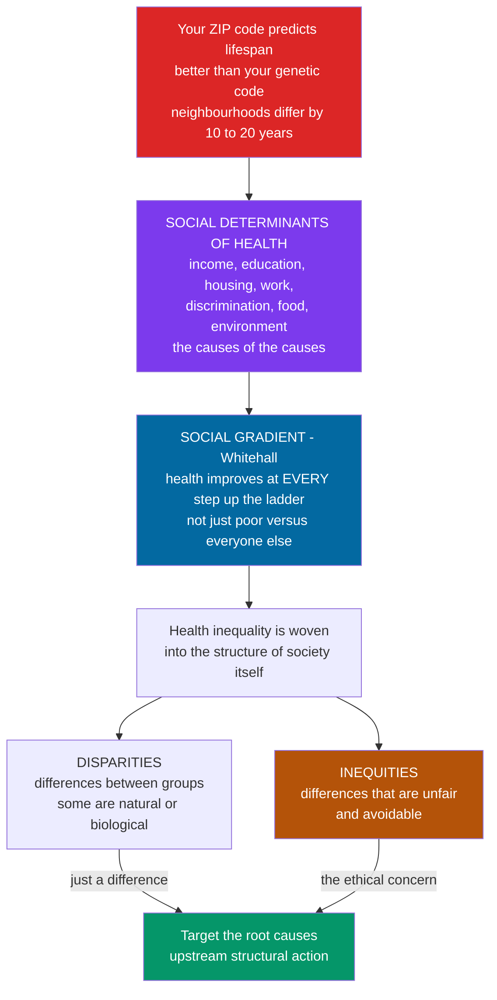

# ⚖️ Social Determinants and Health Equity

> [!abstract] TL;DR
> Here is a fact that reframes everything about health: **your ZIP code predicts your lifespan better than your genetic code.** In many cities, people living a few subway stops apart differ in life expectancy by **10, 15, even 20 years** — not mainly because of medical care or personal choices, but because of the **social determinants of health (SDOH)**: the conditions in which people are *born, grow, live, work, and age* — income, education, housing, neighbourhood, working conditions, discrimination, and access to healthy food and safe environments. These are the **"causes of the causes,"** the upstream forces that shape the immediate risk factors clinicians treat. The **Whitehall studies** revealed something even more striking — a **social gradient**: health improves at *every* step up the social ladder, so that even people near the top are healthier than those just below them. Health inequality is not just poverty versus everyone else; it is woven into the structure of society itself. The crucial distinction is between health **disparities** (any difference between groups — some are merely biological, like men versus women) and health **inequities** (disparities that are *unfair and avoidable*, rooted in unjust social conditions). Public health's modern mission increasingly targets these root causes, because you cannot fix health by treating patients one at a time when the disease is being *manufactured* by the conditions of their lives.

---

## Intuition

**Analogy:** Imagine a doctor bailing water out of a sinking boat with a bucket. She is skilled and works furiously, and she saves that boat. But there are a thousand boats, and every one has the same hole drilled in the same spot by the same drill. No amount of bailing fixes the drill. **Curative medicine is the bucket; the social determinants of health are the drill.** You can treat one patient's heart attack, one child's asthma, one mother's diabetes — but if the drill keeps boring holes, the water keeps rising, patient after patient, generation after generation. The only way to stop the flooding is to go *upstream* and take away the drill.

Now picture a staircase of a hundred steps, from the poorest tenant on the ground floor to the wealthiest owner at the top. You might expect health to be a *cliff* — the poor in danger, everyone else fine. But the Whitehall studies of British civil servants — all employed, all housed, none in absolute poverty — found instead a smooth **gradient**: at every single step up, health gets a little better. The second-from-the-top does worse than the top. This is the deepest and most unsettling finding in the field: health tracks social status *continuously, all the way up*. Where you stand on the ladder is quite literally written into your arteries, your immune system, and your years of life.

---

## How It Works

### Core mechanics

1. **Name the determinants.** The WHO defines the social determinants of health as "the conditions in which people are born, grow, live, work, and age." Concretely: **income and wealth**, **education**, **employment and working conditions**, **housing and neighbourhood**, **food security**, **social support and cohesion**, **discrimination and racism**, and **access to health care and safe environments**.
2. **See them as the "causes of the causes."** A patient has a heart attack. The proximate cause is a blocked artery; behind it sit cholesterol, blood pressure, smoking. But behind *those* sit the job with no control, the neighbourhood with no safe place to walk and only fast food, the paycheck that ran out before the month did. The social determinants act *through* the proximate risk factors, not instead of them — so they are systematically upstream (this connects to prevention levels and the natural history of disease).
3. **Weigh them against medicine.** Population-health estimates repeatedly find that medical care accounts for only about **10–20 percent** of what determines health outcomes; the great majority is set by behaviour, environment, and — upstream of both — social and economic conditions.
4. **Find the gradient.** The Whitehall studies (Marmot) showed a continuous, stepwise mortality gradient across *all* levels of the occupational hierarchy — driven partly by **control**, status, and chronic stress, not just money.
5. **Ask how it "gets under the skin."** Chronic stress from low status, insecurity, and discrimination keeps the HPA axis and sympathetic nervous system switched on, raising **allostatic load** — the cumulative biological wear that converts social disadvantage into cardiovascular and metabolic disease. This is the **biological embedding** of inequality.
6. **Separate difference from injustice.** A **disparity** is any difference in health between groups; some are natural or biological. An **inequity** is a disparity that is *systematic, socially produced, avoidable, and unfair* — the ethical concern that motivates action.
7. **Act upstream.** Because the disease is manufactured by social conditions, the highest-leverage interventions are structural — housing, income, education, anti-discrimination, "Health in All Policies" — not one more clinic visit.

### Flow / architecture



---

## Key Concepts

### Secondary level

- **Social determinants of health** are the everyday conditions that keep people healthy or make them sick — money, schooling, jobs, housing, food, neighbourhood, and how fairly they are treated — far more than doctors and hospitals alone.
- **ZIP code vs genetic code.** Where you live can predict how long you live better than your genes can. Two neighbourhoods a short bus ride apart can differ by 10–20 years of life expectancy.
- **The social gradient.** It is not simply "the poor get sick and everyone else is fine." At *every* step up the social ladder, health tends to improve a little more.
- **Disparities vs inequities.** A **disparity** is any difference in health between groups. An **inequity** is a difference that is *unfair and could have been avoided* — that is the one we have a duty to fix.
- **Upstream vs downstream.** Treating a sick patient is *downstream*. Fixing the housing, income, and conditions that made them sick is *upstream*.

### Undergraduate level

- **The WHO framing and the "causes of the causes."** The WHO Commission on Social Determinants of Health (2008) argued that the social gradient is "not a natural phenomenon" but the product of poor policies, unfair economics, and bad politics — the upstream forces that produce the downstream risk factors. See the complementary [[Health_Nutrition_and_Longevity/01_Foundations_of_Health/Determinants_of_Health|Determinants of Health]] note for the five-category accounting.
- **The Whitehall studies and the social gradient (Marmot).** Longitudinal cohorts of British civil servants — none in poverty — still showed a *continuous* mortality gradient by employment grade. **Job control** and status, not just income, tracked cardiovascular risk (Karasek's demand–control model). This is the sociological heart of [[Sociology/06_Applied_and_Contemporary_Sociology/Health_Inequality_and_Medical_Sociology|Health Inequality and Medical Sociology]].
- **Health equality vs health equity.** *Equality* gives everyone the same resource; *equity* allocates by **need** to achieve fair *outcomes*. Giving every school the same funding is equality; giving more to schools serving disadvantaged children is equity. Health equity is the goal; identical treatment often is not enough.
- **Horizontal vs vertical equity.** *Horizontal* equity: equal treatment of those with equal need. *Vertical* equity: appropriately *unequal* treatment of those with *unequal* need (more resources to greater need).
- **Specific inequities.** By **socioeconomic status**, by **race/ethnicity and structural racism**, by **gender**, and by **geography** (the environmental-justice dimension of unequally distributed toxic exposures). Compare [[Sociology/02_Social_Stratification_and_Inequality/Poverty_Social_Mobility_and_Life_Chances|Poverty, Social Mobility and Life Chances]] and [[Sociology/02_Social_Stratification_and_Inequality/Race_Ethnicity_and_Racism|Race, Ethnicity and Racism]].
- **Life-course and early-childhood effects.** Exposures accumulate; prenatal and early-life conditions leave lifelong marks (the DOHaD / fetal-programming hypothesis). Health at 60 reflects advantages reaching back to the womb.

### Graduate level

- **Fundamental cause theory (Link & Phelan, 1995).** Socioeconomic status is a *fundamental* cause of disease because it commands flexible resources — money, knowledge, power, prestige, beneficial social ties — that protect health *regardless of which specific diseases or risk factors dominate an era*. This is why curing one disease rarely closes the gradient: the resources simply re-deploy to the next frontier. It predicts that a purely biomedical fix leaves the social gap intact.
- **Allostatic load and biological embedding.** Repeated activation of the stress response under chronic disadvantage produces measurable physiological wear — elevated cortisol, inflammation, blunted immune function, shorter telomeres. Geronimus's **weathering hypothesis** documents accelerated biological ageing among Black Americans, explaining why infant mortality can be higher for college-educated Black women than for white women who did not finish high school: cumulative racism outweighs the protective effect of individual education.
- **Ecosocial theory (Krieger).** Bodies literally *embody* social conditions across the life course and across generations, integrating epidemiologic pattern with social and biological pathways rather than treating "social" and "biological" as rivals.
- **Measuring inequity.** Beyond simple group gaps, social epidemiology uses the **slope and relative indices of inequality** (regression across the full gradient), the **concentration index and concentration curve** (health concentrated among the poor or rich), and **decomposition methods** to attribute the gap to its determinants. Measuring the *whole gradient* matters because threshold measures miss most of the injustice.
- **The limits of downstream / behavioural framing.** "Just tell people to eat better" assumes agency that food deserts, precarious work, unsafe streets, and marketing undercut — and it can *widen* inequities, because the already-advantaged act on advice more easily (**intervention-generated inequality**). Blaming individuals for structurally produced risk is a form of **victim-blaming**.
- **The individual–structural tension.** How much health responsibility rests with the person versus the society that shaped their choices is the central normative fault line of the field — and the bridge to [[Ethics_and_Applied_Ethics/02_Bioethics_and_Medical_Ethics/Justice_in_Health_and_Resource_Allocation|Justice in Health and Resource Allocation]] and [[Political_Science/04_Public_Policy_and_Political_Economy/Welfare_States_and_Social_Policy|Welfare States and Social Policy]].

---

## Python Demo

```python
# Social Determinants of Health and Health Equity
# (1) THE SOCIAL GRADIENT: life expectancy rises monotonically at every step
#     up the socioeconomic ladder (Whitehall), contrasted with a naive
#     "poverty threshold" model.
# (2) THE ZIP-CODE EFFECT: the life-expectancy gap between neighbourhoods a
#     few subway stops apart dwarfs the swing attributable to genes.
# (3) EQUALITY vs EQUITY: identical resources leave the gap intact;
#     allocating by need narrows the outcome gap.
import numpy as np
import matplotlib.pyplot as plt

fig, ax = plt.subplots(1, 3, figsize=(16, 5))

# --- Panel 1: the social gradient (smooth staircase, not a threshold) ------
decile = np.arange(1, 11)                       # 1 = poorest, 10 = richest
# monotone-increasing, concave life expectancy: gains at EVERY step
gradient_le = 71 + 1.7 * decile - 0.055 * decile**2
assert np.all(np.diff(gradient_le) > 0), "gradient must be monotonic"
# naive threshold model: flat below a poverty line, flat above
threshold_le = np.where(decile <= 3, 74.0, 82.0)

ax[0].plot(decile, gradient_le, "o-", color="#7c3aed", lw=2.6, ms=8,
           label="Social gradient (reality)")
ax[0].step(decile, threshold_le, where="mid", color="#9ca3af", lw=2.0,
           linestyle="--", label="Poverty-threshold model (wrong)")
ax[0].set_title("The Social Gradient of Health")
ax[0].set_xlabel("Socioeconomic position (income decile)")
ax[0].set_ylabel("Life expectancy (years)")
ax[0].set_xticks(decile)
ax[0].legend(fontsize=8, loc="lower right")
ax[0].grid(alpha=0.3)
ax[0].annotate("health improves at\nEVERY rung, not just\nabove a poverty line",
               xy=(7, gradient_le[6]), xytext=(3.2, 84.6), fontsize=8,
               arrowprops=dict(arrowstyle="->", color="#7c3aed"))

# --- Panel 2: the ZIP-code effect vs the genetic swing ---------------------
hoods = ["Wealthy\nneighbourhood", "Middle", "Poor\nneighbourhood"]
hood_le = np.array([87.0, 78.0, 69.0])          # a few subway stops apart
ax[1].bar(hoods, hood_le, color=["#059669", "#f59e0b", "#dc2626"])
ax[1].set_ylim(60, 92)
ax[1].set_title("Your ZIP Code vs Your Genetic Code")
ax[1].set_ylabel("Life expectancy (years)")
gap = hood_le[0] - hood_le[-1]
ax[1].annotate("", xy=(0, hood_le[0]), xytext=(0, hood_le[-1]),
               arrowprops=dict(arrowstyle="<->", color="#111827", lw=1.6))
ax[1].text(0.18, 77.5, f"{gap:.0f}-year gap\nacross a few\nsubway stops",
           fontsize=8, color="#111827")
ax[1].text(1.35, 62, "genes typically move\nlifespan only a few years",
           fontsize=8, color="#374151")
for i, v in enumerate(hood_le):
    ax[1].text(i, v + 0.4, f"{v:.0f}", ha="center", fontweight="bold")

# --- Panel 3: equality vs equity -------------------------------------------
groups = ["High\nneed", "Medium\nneed", "Low\nneed"]
baseline = np.array([60.0, 75.0, 88.0])         # starting health score
budget = 30.0                                   # total extra resource units
equal_alloc = np.full(3, budget / 3)            # EQUALITY: identical shares
weights = (baseline.max() - baseline) + 3.0     # EQUITY: more where need is greater
equity_alloc = budget * weights / weights.sum()
equal_out = baseline + 0.6 * equal_alloc        # outcome = baseline + 0.6 * resource
equity_out = baseline + 0.6 * equity_alloc

x = np.arange(3); w = 0.35
ax[2].bar(x - w / 2, equal_out, w, color="#9ca3af", label="Equality: same to all")
ax[2].bar(x + w / 2, equity_out, w, color="#2563eb", label="Equity: by need")
ax[2].plot(x, baseline, "ko--", lw=1.2, ms=6, label="Baseline (no action)")
ax[2].set_xticks(x); ax[2].set_xticklabels(groups)
ax[2].set_ylabel("Health outcome score")
ax[2].set_title("Equality vs Equity")
ax[2].legend(fontsize=8, loc="lower right")
ax[2].grid(axis="y", alpha=0.3)

plt.tight_layout()
plt.savefig("social_determinants_health_equity.png", dpi=130, bbox_inches="tight")

# --- console summary -------------------------------------------------------
print("Panel 1  gradient LE poorest -> richest decile:",
      round(gradient_le[0], 1), "->", round(gradient_le[-1], 1),
      "| gap:", round(gradient_le[-1] - gradient_le[0], 1), "years")
print("Panel 2  ZIP-code life-expectancy gap:", round(float(gap), 1), "years")
print("Panel 3  outcome spread (max - min):",
      "equality =", round(float(equal_out.max() - equal_out.min()), 1),
      "| equity =", round(float(equity_out.max() - equity_out.min()), 1),
      "(smaller = fairer outcomes)")
```

**What it shows.** Panel 1 is the signature finding: life expectancy climbs **at every rung** of the ladder — a smooth staircase, not the cliff that a "poverty threshold" model predicts. Panel 2 dramatizes the ZIP-code effect: an ~18-year gap between neighbourhoods a short ride apart, far larger than the few years genes typically move lifespan. Panel 3 makes the equality-versus-equity distinction concrete: handing every group the *same* extra resource preserves the outcome gap, while allocating **by need** compresses it — the operational meaning of health equity.

---

## Real-World Applications

> **The Marmot Review — "Fair Society, Healthy Lives" (UK, 2010).** Marmot translated the social-gradient evidence into national policy, arguing for **proportionate universalism**: universal action scaled to need rather than programmes targeting only the poorest. Because the gradient runs the whole length of the ladder, poverty-only targeting leaves most of the inequity untouched. The review reframed health as a whole-of-government concern spanning early childhood, education, housing, and income — not a health-department silo.

> **"Health in All Policies" (Finland, WHO).** Recognizing that transport, zoning, taxation, and labour law shape health more than clinics do, jurisdictions embed a health-equity lens into *non-health* policymaking — evaluating a new highway or housing scheme for its downstream effects on air quality, walkability, and exposure gradients before it is built.

> **SDOH screening in health systems (Kaiser Permanente, NHS, US Medicaid).** Providers now screen patients for food insecurity, housing instability, and social isolation and refer to social services — treating the "causes of the causes" alongside the presenting complaint. Payment reforms increasingly reward reducing avoidable admissions that originate in social conditions.

> **The WHO Commission on Social Determinants of Health (2008).** Its report *Closing the Gap in a Generation* set the global agenda: improve daily living conditions, tackle the inequitable distribution of power/money/resources, and measure and understand the problem. It anchors global-health work on inequities *between and within* countries — the concern of [[Sociology/02_Social_Stratification_and_Inequality/Global_Inequality_and_Development|Global Inequality and Development]].

> **RWJF and "life expectancy by subway stop."** Maps published by the Robert Wood Johnson Foundation and NYU showed life expectancy swinging by 10–20 years between adjacent transit stops in cities like New York, London, and Washington DC — the single most viral illustration of the "ZIP code beats genetic code" thesis.

In this vault's practice-and-policy section, this note underpins the sibling topics **Public Health Systems and Functions** (the assessment/policy/assurance machinery that acts on determinants), **Health Promotion and Disease Prevention** (upstream, population-level interventions), **Environmental and Occupational Health** (the physical-exposure determinants and environmental justice), **Health Policy and Economics of Public Health** (the fiscal and regulatory levers), and **Nutritional and Social Epidemiology** (the methods that measure how social exposures produce disease).

---

## Common Pitfalls

- **Confusing inequality with inequity.** Not every health difference is unjust — some (age-related decline; some sex differences) are unavoidable and biological. The ethical claim attaches *only* to differences that are systematic, socially produced, and avoidable. Sloppy use of the terms muddies the policy argument and invites bad-faith rebuttals.
- **Treating the gradient as a poverty threshold.** The costliest policy error is to target only the poorest quintile. The Whitehall gradient is *continuous* — the second-from-top does worse than the top — so poverty-only programmes improve the bottom while leaving most of the inequity intact. The remedy is **proportionate universalism**.
- **Victim-blaming / behaviour-only framing.** "Just eat better and exercise" assumes agency that structural constraints undercut, and it tends to *widen* inequities because the advantaged act on advice more easily. Health behaviours are **socially patterned**, not freely chosen in a vacuum — they are outcomes of the determinants, not independent causes.
- **Equating health with health care.** Medical care is essential but is only ~10–20 percent of what determines outcomes. Over-investing there while ignoring housing, income, and discrimination yields diminishing returns and cannot close the gradient — the prediction of **fundamental cause theory**.
- **Reifying genetics or race as biology.** "It's genetic" or "it's a racial difference" often smuggles a social cause into a biological costume. Most racial health disparities trace to structural racism, segregation, and chronic stress — not inherited genotype.
- **Measuring only group gaps.** Reporting a single "rich minus poor" difference hides the shape of the gradient. Slope/relative indices of inequality and concentration indices capture inequity across the *whole* distribution; threshold metrics miss most of it.
- **Ecological and life-course blind spots.** Attributing an area's ill health to its current residents' choices ignores neighbourhood effects and the fact that much adult disease was programmed in early life — interventions timed too late fight uphill against embedded biology.

---

## Related Concepts

- [[Health_Nutrition_and_Longevity/01_Foundations_of_Health/Determinants_of_Health|Determinants of Health]] — the complementary five-category accounting (behaviour, genetics, social/economic, environment, health care); this note is its equity-and-policy deep dive.
- [[Sociology/06_Applied_and_Contemporary_Sociology/Health_Inequality_and_Medical_Sociology|Health Inequality and Medical Sociology]] — the sociological treatment of the gradient, Whitehall, structural violence, and medicalization; the closest companion.
- [[Sociology/02_Social_Stratification_and_Inequality/Poverty_Social_Mobility_and_Life_Chances|Poverty, Social Mobility and Life Chances]] — how income, class, and mobility structure the "life chances" that become health outcomes.
- [[Sociology/02_Social_Stratification_and_Inequality/Race_Ethnicity_and_Racism|Race, Ethnicity and Racism]] — structural racism and the weathering hypothesis as drivers of racial health inequity.
- [[Sociology/02_Social_Stratification_and_Inequality/Global_Inequality_and_Development|Global Inequality and Development]] — the between- and within-country inequities that make SDOH a global-health concern.
- [[Political_Science/04_Public_Policy_and_Political_Economy/Welfare_States_and_Social_Policy|Welfare States and Social Policy]] — Esping-Andersen's regimes explain why decommodifying welfare states produce shallower health gradients; the policy machinery for upstream action.
- [[Ethics_and_Applied_Ethics/02_Bioethics_and_Medical_Ethics/Justice_in_Health_and_Resource_Allocation|Justice in Health and Resource Allocation]] — what makes a health difference *unfair*, and how to allocate scarce resources justly (the ethics of equity).
- [[Ethics_and_Applied_Ethics/04_Environmental_and_Animal_Ethics/Environmental_Justice_and_Sustainability|Environmental Justice and Sustainability]] — the unequal distribution of toxic and environmental burdens that constitutes the physical-exposure determinant.
- [[Ethics_and_Applied_Ethics/05_Social_Political_and_Economic_Ethics/Distributive_Justice_and_Inequality|Distributive Justice and Inequality]] — the broader theories of fair distribution (Rawls, capabilities) that ground health-equity claims.
- [[Epidemiology_and_Public_Health/01_Foundations_of_Epidemiology/Natural_History_of_Disease_and_Prevention_Levels|Natural History of Disease and Prevention Levels]] — the upstream/downstream framing that locates SDOH before primary prevention.
- [[Epidemiology_and_Public_Health/01_Foundations_of_Epidemiology/The_Epidemiologic_Transition_and_Burden_of_Disease|The Epidemiologic Transition and Burden of Disease]] — DALYs and HALE, the metrics that quantify how much burden upstream action can move.
- [[Epidemiology_and_Public_Health/03_Causal_Inference_Bias_and_Confounding/Causal_Inference_in_Epidemiology|Causal Inference in Epidemiology]] — how the field establishes that social conditions *cause* disease rather than merely correlate.

---

## Review Questions

### Secondary

1. Explain the phrase "your ZIP code predicts your lifespan better than your genetic code." What does it claim about the relative importance of neighbourhood conditions versus genes and medical care?
2. What is the difference between a health **disparity** and a health **inequity**? Give one example of a disparity that is *not* an inequity, and one that *is*.
3. Using a bailing-out-a-boat analogy, explain the difference between *downstream* (curative) and *upstream* (structural) approaches to public health.

### Undergraduate

1. The Whitehall studies found a continuous health gradient among employed civil servants with no one in poverty. Why does this argue against poverty-*only* health programmes, and what does "proportionate universalism" propose instead?
2. Distinguish health **equality** from health **equity**, and horizontal from vertical equity. Using a fixed budget across three groups with different baseline need, describe an allocation that maximizes *equality* and one that maximizes *equity*, and explain which better closes the outcome gap.
3. Why are health behaviours (smoking, diet) described as "socially patterned"? What does this imply about interventions that target individual behaviour without changing social conditions?

### Graduate

1. State fundamental cause theory (Link & Phelan) precisely. Why does it predict that curing a single disease, or a purely biomedical intervention, will *not* close the social gradient? What kind of intervention would it predict *can*?
2. Design a study to distinguish **social causation** (low SES causes ill health) from **social selection / drift** (ill health causes downward mobility) for a chronic condition. What confounders and life-course dynamics complicate the inference, and how does the biological embedding of stress (allostatic load, epigenetics) blur the boundary?
3. A minister proposes to measure "health inequality" as the single gap in life expectancy between the richest and poorest quintiles. Critique this as a measure of inequity, and propose an alternative (e.g., slope/relative index of inequality or concentration index) that captures the whole gradient. What normative assumptions does each measure encode?

---

## Sources

- Marmot, M. (2015). *The Health Gap: The Challenge of an Unequal World.* Bloomsbury; and Marmot, M. et al. (1991). "Health inequalities among British civil servants: the Whitehall II study." *The Lancet*, 337(8754), 1387–1393. [https://www.thelancet.com/journals/lancet/article/PII0140-6736(91)93068-K/abstract](https://www.thelancet.com/journals/lancet/article/PII0140-6736(91)93068-K/abstract)
- WHO Commission on Social Determinants of Health (2008). *Closing the Gap in a Generation: Health Equity Through Action on the Social Determinants of Health.* World Health Organization. [https://www.who.int/publications/i/item/WHO-IER-CSDH-08.1](https://www.who.int/publications/i/item/WHO-IER-CSDH-08.1)
- Link, B. G., & Phelan, J. (1995). "Social conditions as fundamental causes of disease." *Journal of Health and Social Behavior*, 35(Extra Issue), 80–94. [https://www.jstor.org/stable/2626958](https://www.jstor.org/stable/2626958)
- Braveman, P. (2006). "Health disparities and health equity: concepts and measurement." *Annual Review of Public Health*, 27, 167–194. [https://www.annualreviews.org/doi/10.1146/annurev.publhealth.27.021405.102103](https://www.annualreviews.org/doi/10.1146/annurev.publhealth.27.021405.102103)
- Marmot, M. (2010). *Fair Society, Healthy Lives: The Marmot Review.* UCL Institute of Health Equity. [https://www.instituteofhealthequity.org/resources-reports/fair-society-healthy-lives-the-marmot-review](https://www.instituteofhealthequity.org/resources-reports/fair-society-healthy-lives-the-marmot-review)

---

#epidemiology #social-determinants #health-equity #social-gradient #health-disparities
