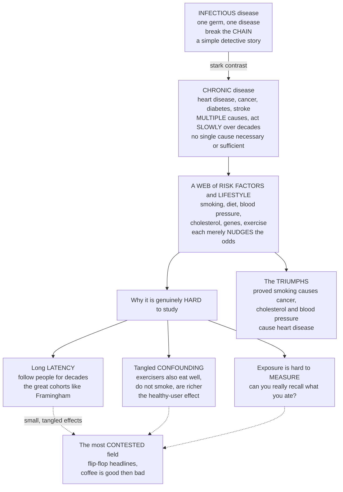

# 🫀 Chronic Disease and Lifestyle Epidemiology

> [!abstract] TL;DR
> **Infectious-disease epidemiology has a satisfying simplicity — one germ, one disease, break the chain. Chronic-disease epidemiology is a fundamentally *harder* detective story, because the causes are *multiple*, act *slowly* over decades, and no single factor is either necessary or sufficient.** Heart disease, cancer, diabetes, and stroke — the **non-communicable diseases (NCDs)** that are now the leading killers in the developed world and, increasingly, everywhere — are not caused by any one thing. They emerge from a *web of causation*: smoking, diet, blood pressure, cholesterol, genes, physical inactivity, and stress, each merely *nudging the odds*, compounding over forty years. This is the epidemiology of **risk factors** and **lifestyle**, and it faces three brutal obstacles: **long latency** (you must follow people for decades — hence the great cohort studies like **Framingham**), pervasive **confounding** (people who exercise also eat better, smoke less, and are richer — so how do you isolate exercise's own effect?), and the sheer difficulty of **measuring lifestyle** accurately (can you truly recall what you ate?). Despite this, risk-factor epidemiology delivered some of history's most consequential discoveries — proving **smoking causes cancer**, that **cholesterol and blood pressure cause heart disease**, that **diet and exercise matter** — findings that reshaped how billions live. It is also the most *contested* area of the field, plagued by the flip-flopping headlines ("coffee is good / bad for you") that arise precisely because teasing small effects of tangled lifestyle factors out of observational data is so genuinely hard. This opener frames the vault's final section: the epidemiology of multifactorial, slow-onset, lifestyle-driven disease — its triumphs, its methods, and its pitfalls.

---

## Intuition

**Analogy — a single murderer versus a conspiracy that takes forty years.** Infectious-disease epidemiology is a classic whodunit with *one* culprit. There is a body (a cholera death), a weapon (contaminated water), and a single perpetrator (the *Vibrio*). Find the germ, break the chain, case closed — clean and satisfying. Chronic-disease epidemiology is the opposite kind of mystery: a *conspiracy*. When a 68-year-old has a heart attack, there is no single killer to arrest. It was the cigarettes he smoked in his thirties, *and* the blood pressure that crept up unnoticed, *and* the cholesterol, *and* the genes he inherited, *and* the decades at a desk, *and* the diet — no one of them "did it," yet together, acting slowly over forty years, they did. Worse, the suspects all know each other and cover for one another: the man who jogs also tends to eat well, avoid tobacco, sleep enough, and earn more — so when jogging looks protective, you can never be sure it was the jogging and not the *company it keeps*.

That is the whole predicament. The causes are **multiple** (a web, not a chain), they act with **long latency** (the exposure and the disease are decades apart), and they are hopelessly **entangled** with one another and with wealth, education, and habit. To even *see* the effect of one risk factor you must follow tens of thousands of people for thirty years — the heroic **cohort studies** — and then wrestle with the fact that you can't cleanly separate the jogger's exercise from the jogger's salad. This is why nutrition headlines flip-flop, and why the very same difficulty makes the field's *successes* — nailing smoking as a cause of cancer, cholesterol and blood pressure as causes of heart disease — such towering achievements. Understanding how epidemiology cracks a slow, multifactorial, lifestyle-driven conspiracy is understanding the science behind nearly every health recommendation you have ever heard.

---

## How It Works

### Core mechanics

**1. The defining shift — from one cause to a web of causes.** Infectious epidemiology inherited **Koch's postulates**: a single agent that is *necessary* (no germ, no disease) and largely *sufficient*. Chronic disease shatters that model. It follows the **web of causation** and the **sufficient-component-cause** (Rothman "causal pie") framework: a disease occurs when *enough* component causes assemble into a sufficient set, and any given factor (smoking, hypertension) is neither necessary nor sufficient on its own — it is one slice of many possible pies. This is why we speak of **risk factors**, not *the* cause: each factor shifts probability rather than flipping a switch.

**2. Long latency and lifelong risk accumulation.** Between exposure and disease lie *decades*. Atherosclerosis begins in adolescence and kills at 65; a carcinogen's damage surfaces 20–40 years later. Risk **accumulates** across the life course, so cause and effect are separated by a gulf that no short study can bridge — the fundamental reason chronic-disease epidemiology *needs* long-term **cohort studies**.

**3. The core paradigm — risk-factor epidemiology built on cohorts.** The great insight (mid-20th century) was to *follow* healthy people, measure their exposures, and *wait*:
- **Framingham Heart Study** (1948– ) followed a whole town for generations and gave us the very term "risk factor," identifying high blood pressure, high cholesterol, smoking, and diabetes as drivers of cardiovascular disease.
- **British Doctors Study** (Doll & Hill, 1951– ) followed physicians and proved **smoking causes lung cancer** and heart disease.
- **Nurses' Health Study** (1976– ) linked diet, hormones, and lifestyle to chronic disease across hundreds of thousands of person-years.

**4. The big risk factors — behavioral and metabolic.** WHO frames most NCD burden around **four behavioral risks** — **tobacco, poor diet, physical inactivity, and harmful alcohol** — which act largely *through* four **metabolic risks**: **raised blood pressure, raised blood glucose, raised blood lipids, and overweight/obesity**. Behavior upstream, physiology midstream, disease downstream.

**5. From single causes to risk *profiles* — risk scores.** Because no factor decides alone, prediction moved to **multivariable risk scores**: the **Framingham Risk Score** (and successors like ASCVD/QRISK) combines age, sex, blood pressure, cholesterol, smoking, and diabetes into a single **10-year risk** estimate via a logistic/Cox model. The unit of prediction became the *profile*, not the factor.

**6. Why the methods are so hard — three obstacles.**
- **Long latency** forces decades of follow-up, expense, and loss-to-follow-up.
- **Confounding by lifestyle** is pervasive: healthy behaviors *cluster* (the **healthy-user effect**) and correlate with **socioeconomic status**, so any single habit is entangled with a dozen others and with wealth. Isolating one effect demands heavy statistical adjustment — and you can only adjust for what you measured.
- **Measurement error** is severe: diet and activity are captured by **recall** (food-frequency questionnaires) that people misremember, biasing estimates and blurring real effects. Add **reverse causation** (early, undiagnosed disease changes behavior — the sick person stops drinking, making alcohol look protective).

**7. Why RCTs are often impossible — and why headlines flip-flop.** You cannot randomize people to smoke for 30 years, and long-term diet trials are costly and leaky. So the field leans on **observational** data, where residual confounding and measurement error survive. The result is the notorious **flip-flopping** of nutritional epidemiology — small, tangled effects estimated from imperfect self-report produce today's "X prevents cancer" and tomorrow's reversal. The strongest chronic-disease conclusions (smoking, blood pressure, cholesterol) are the ones where effects are *large*, dose–response is clear, biology is coherent, and evidence converges across designs.

**8. The triumphs and the two prevention strategies.** Despite the difficulty, the field reshaped public health: **smoking → lung cancer and heart disease**, **cholesterol and blood pressure → cardiovascular disease**, and the benefits of physical activity. Acting on this knowledge splits into Geoffrey Rose's two strategies: the **high-risk approach** (find and treat the people with the worst risk scores) versus the **population approach** (shift the *entire* distribution — a tobacco tax, salt reduction, cleaner food supply — which averts more total disease because most cases arise from the vast middle, not the extreme tail).

### Flow / architecture



---

## Key Concepts

### 🟢 Secondary (intuitive foundation)

- **Chronic (non-communicable) disease** — long-lasting illness that does *not* spread person-to-person: heart disease, cancer, diabetes, stroke, chronic lung disease. In wealthy countries they are now the leading causes of death.
- **Many causes, no single culprit** — unlike a germ, a chronic disease has *several* contributing causes, and no one of them is enough by itself. They add up.
- **Risk factor** — something that raises your *chances* of disease (smoking, high blood pressure, being inactive) without guaranteeing it.
- **Lifestyle matters** — the "big four" behaviors behind most chronic disease are **smoking, poor diet, too little exercise, and too much alcohol**.
- **Slow to show up** — the damage builds silently for *decades*, so you cannot see the cause and the disease at the same time.
- **Why the news keeps changing** — because the effects are small and habits are tangled together, single studies disagree, producing "good for you / bad for you" flip-flops.

### 🟡 Undergraduate (mechanisms and formalism)

- **Web of causation & sufficient-component-cause model** — disease results when enough component causes complete a "causal pie"; any single factor is neither necessary nor sufficient (Rothman).
- **Latency and risk accumulation** — the long, life-course gap between exposure and disease that makes cohort follow-up essential.
- **The landmark cohorts** — Framingham (cardiovascular risk factors, the *origin* of the term), British Doctors (smoking → cancer), Nurses' Health Study (diet & lifestyle) — the engines of risk-factor discovery.
- **Behavioral vs metabolic risk factors** — behaviors (tobacco, diet, inactivity, alcohol) act through metabolic mediators (blood pressure, glucose, lipids, adiposity) to cause disease.
- **Multivariable risk scores** — Framingham/ASCVD/QRISK: combine several risk factors via logistic or Cox regression into a single **10-year risk** — the shift from single causes to risk *profiles*.
- **Healthy-user effect & confounding by lifestyle/SES** — healthy behaviors and higher socioeconomic status co-occur, entangling every exposure; adjustment is required but limited by what was measured.
- **Measurement error & reverse causation** — recall-based diet/activity data are noisy and biased; early disease can alter behavior, faking associations.

### 🔴 Graduate (subtleties, critique, frontiers)

- **Residual & unmeasured confounding** — the ceiling on observational chronic-disease inference: you can only adjust for measured, well-measured confounders, so entangled lifestyle/SES effects persist. This is *the* reason strong RCT evidence (statins, blood-pressure drugs) sometimes overturns observational belief (as vitamin E and hormone-replacement therapy famously did).
- **Why nutritional epidemiology is contested** — tiny true effect sizes, correlated dietary components, exposure measurement error, multiple comparisons, and publication bias jointly manufacture non-reproducible, flip-flopping findings; triangulation and pre-registration are the correctives.
- **Bradford Hill viewpoints as the substitute for randomization** — strength, dose–response, consistency, temporality, biological plausibility, and experiment (e.g. cessation trials) were the framework that let the field conclude **smoking causes cancer** without an RCT.
- **Mendelian randomization** — using genetic variants (randomized at conception) as instrumental variables to break confounding and test causality of exposures like LDL cholesterol, alcohol, or BMI — a modern rescue for observational causal inference.
- **Population vs high-risk prevention (Rose)** — the *prevention paradox*: a measure benefiting the population may offer little to each individual, and most cases arise from the many at modest risk, not the few at high risk — favoring distribution-shifting policy over targeting.
- **Population Attributable Fraction (PAF)** — the share of disease that would be averted if a risk factor were removed; quantifies public-health priority among tangled multifactorial causes.
- **The global NCD agenda** — the epidemiologic and *nutrition* transitions are exporting chronic disease to low- and middle-income countries; WHO's Global Action Plan sets targets (tobacco, salt, physical activity, hypertension control) and NCD surveillance tracks risk-factor prevalence, not just cases.

---

## Python Demo

```python
# Chronic-disease & lifestyle epidemiology, two hard truths visualized:
#   (a) MULTIFACTORIAL RISK ACCUMULATION: no single risk factor is decisive,
#       but they COMPOUND. A Framingham-style logistic risk score turns
#       age + smoking + high BP + high cholesterol + diabetes into a 10-year
#       cardiovascular risk that climbs steeply as factors stack up.
#   (b) LIFESTYLE CONFOUNDING (why observational habit findings flip-flop):
#       a HARMLESS habit looks protective ONLY because the people who do it
#       also live healthier lives. Adjust for lifestyle -> the effect vanishes.
import numpy as np
import matplotlib.pyplot as plt

rng = np.random.default_rng(7)

# ============================================================
# (a) RISK-FACTOR ACCUMULATION -> logistic 10-year risk score
# ============================================================
intercept = -5.2                    # low baseline log-odds for a middle-aged adult
factors = ["Age 60\n(vs 40)", "+ Smoking", "+ High\nblood pressure",
           "+ High\ncholesterol", "+ Diabetes"]
betas   = np.array([1.4, 0.9, 1.1, 0.8, 1.0])   # each factor's log-odds contribution

# Stack the factors one at a time; convert cumulative log-odds -> probability.
logit = intercept + np.concatenate([[0.0], np.cumsum(betas)])
risk  = 1.0 / (1.0 + np.exp(-logit))            # 10-year risk after each addition
steps = ["Baseline"] + factors

# ============================================================
# (b) LIFESTYLE CONFOUNDING -> crude vs adjusted association
# ============================================================
N = 60_000
# Latent "healthy lifestyle" score: exercise, good diet, non-smoking, wealth.
healthy = rng.normal(0.0, 1.0, N)

# Healthy-user effect: healthier people are MORE likely to adopt the habit.
p_habit = 1.0 / (1.0 + np.exp(-(0.2 + 1.3 * healthy)))
habit   = rng.random(N) < p_habit

# Disease depends ONLY on lifestyle, NOT on the habit (true effect = zero).
p_disease = 1.0 / (1.0 + np.exp(-(-1.0 - 1.4 * healthy)))
disease   = rng.random(N) < p_disease

# CRUDE relative risk: disease in habit vs no-habit (ignores lifestyle).
rr_crude = disease[habit].mean() / disease[~habit].mean()

# ADJUSTED: stratify by lifestyle tertile, average within-stratum RRs.
cuts   = np.quantile(healthy, [1/3, 2/3])
strata = np.digitize(healthy, cuts)
rr_strata = []
for s in np.unique(strata):
    m  = strata == s
    h  = disease[m & habit].mean()
    nh = disease[m & ~habit].mean()
    rr_strata.append(h / nh)
rr_adj = np.mean(rr_strata)

# ============================================================
# Plot
# ============================================================
fig, (ax1, ax2) = plt.subplots(1, 2, figsize=(15, 6))

# --- (a) risk climbs as factors accumulate ---
colors = plt.cm.Reds(np.linspace(0.35, 0.95, len(steps)))
ax1.bar(range(len(steps)), risk * 100, color=colors, edgecolor="black")
for i, r in enumerate(risk):
    ax1.text(i, r * 100 + 1.2, f"{r*100:.0f}", ha="center", fontsize=9, weight="bold")
ax1.set_xticks(range(len(steps)))
ax1.set_xticklabels(steps, fontsize=8)
ax1.set_ylabel("Estimated 10-year cardiovascular risk (percent)")
ax1.set_title("(a) No single cause is decisive, but risk factors COMPOUND")
ax1.set_ylim(0, 100)
ax1.grid(axis="y", alpha=0.3)

# --- (b) crude vs adjusted vs true ---
bars   = ["Crude\n(unadjusted)", "Adjusted for\nlifestyle", "TRUE effect\n(by design)"]
values = [rr_crude, rr_adj, 1.0]
bcol   = ["#c0392b", "#27ae60", "#7f8c8d"]
ax2.bar(bars, values, color=bcol, edgecolor="black")
for i, v in enumerate(values):
    ax2.text(i, v + 0.02, f"RR = {v:.2f}", ha="center", fontsize=10, weight="bold")
ax2.axhline(1.0, color="black", ls="--", lw=1.3)
ax2.text(2.35, 1.02, "no effect", fontsize=8, va="bottom")
ax2.set_ylabel("Relative risk of disease (habit vs no habit)")
ax2.set_title("(b) A harmless habit looks PROTECTIVE until you adjust for lifestyle")
ax2.set_ylim(0, max(1.15, rr_crude * 1.25))
ax2.grid(axis="y", alpha=0.3)

plt.tight_layout()
plt.savefig("chronic_disease_lifestyle_epidemiology.png", dpi=130, bbox_inches="tight")
plt.show()

# Numeric takeaways
print(f"10-year risk, baseline only          : {risk[0]*100:5.1f}%")
print(f"10-year risk, all 5 factors stacked  : {risk[-1]*100:5.1f}%")
print(f"Crude relative risk (looks protective): {rr_crude:.2f}")
print(f"Lifestyle-adjusted relative risk      : {rr_adj:.2f}  (true = 1.00)")
```

**What it shows.** Panel (a) makes the multifactorial web visible: age alone gives a modest 10-year risk, but each added factor — smoking, blood pressure, cholesterol, diabetes — ratchets it upward until the *combination* dominates, even though no single slice was decisive. That is why chronic-disease medicine treats **risk profiles**, not lone causes. Panel (b) dramatizes the field's central trap: because healthier people are more likely to adopt the habit, the **crude** relative risk makes a truly *inert* habit look protective (RR well below 1); **stratifying on lifestyle** collapses the effect back to ~1.0 — its true value. Swap "habit" for coffee, moderate wine, or a supplement, and you have the machinery behind every flip-flopping nutrition headline.

---

## Real-World Applications

- **Smoking and cancer (Doll & Hill, British Doctors Study).** The prospective cohort of physicians produced the definitive human evidence that smoking causes lung cancer and cardiovascular disease — arguably the single most consequential finding in the field's history, and the template for using Bradford Hill's viewpoints instead of an (impossible) RCT.
- **The Framingham Heart Study.** Coined "risk factor" and identified high blood pressure, high cholesterol, smoking, and diabetes as causes of heart disease; its multivariable **risk score** put a number on individual cardiovascular risk and reshaped clinical prevention worldwide.
- **Statins and blood-pressure control.** Observational cholesterol/BP findings were confirmed by large RCTs, turning epidemiologic association into the two most widely prescribed classes of preventive medication — a rare, clean handoff from observation to trial to population impact.
- **Tobacco control policy (population strategy).** Taxes, advertising bans, smoke-free laws, and plain packaging shifted the *whole* population's smoking distribution downward — Rose's population approach — averting far more disease than treating high-risk smokers alone.
- **The global NCD agenda (WHO).** As the epidemiologic and nutrition transitions carry chronic disease into low- and middle-income countries, WHO's Global Action Plan on NCDs sets population targets (tobacco, salt, physical activity, hypertension and diabetes control) and drives risk-factor **surveillance** rather than case counting.
- **Nutritional epidemiology's cautionary tales.** Observational claims for **vitamin E**, **beta-carotene**, and **hormone-replacement therapy** as protective were overturned by RCTs — vivid demonstrations that residual lifestyle confounding, not biology, drove the original signals.

---

## Common Pitfalls

- **Importing single-cause thinking from infectious disease.** Asking "what *is* the cause of heart disease?" is a category error. Chronic disease has *component* causes; the right questions are "how much does this factor shift risk?" and "what fraction of disease would removing it avert (the PAF)?"
- **Trusting a crude observational association.** The healthy-user effect and socioeconomic clustering make almost every lifestyle exposure look better (or worse) than it is until adjusted — and adjustment is only as good as the confounders you measured, so **residual confounding** always lurks.
- **Ignoring measurement error and recall bias.** Food-frequency questionnaires and activity recall are noisy and systematically biased; treating self-reported diet as precise exposure data inflates false precision and blurs true effects.
- **Overlooking reverse causation.** Early, undiagnosed disease changes behavior (people who feel unwell stop drinking, lose weight, or exercise less), so cross-sectional "protective" habits may be *consequences* of health, not causes of it.
- **Over-reading a single study.** Because chronic-disease effects are small and tangled, any one paper is fragile. The flip-flopping headlines come from treating individual studies as verdicts instead of demanding **consistency, dose–response, and triangulation** across designs (including Mendelian randomization and RCTs).
- **Confusing high-risk and population prevention.** Targeting only the highest-risk individuals misses the *prevention paradox*: most cases arise from the large group at modest risk, so distribution-shifting policy often prevents more disease than intensive treatment of the few.
- **Assuming an RCT is always the answer.** For lifelong exposures like smoking or diet, randomization is infeasible or unethical; dismissing all observational evidence as "just correlation" would have delayed the smoking–cancer conclusion by decades. The skill is judging *when* observational evidence is strong enough.

---

## Related Concepts

This is the **section opener for 06 · Chronic, Global and Frontier Epidemiology**, and it sits atop the entire non-communicable-disease agenda that dominates the *post*-transition world. Its section siblings extend it directly and are referenced here in prose (they are the companion notes of this final section): **The Epidemiologic Transition and Burden of Disease** (in Foundations) is the demographic backdrop — the shift from infectious to chronic killers — that *creates* the subject of this note; **Nutritional and Social Epidemiology** drills into the two hardest exposures introduced here (diet and the socioeconomic gradient), where confounding and measurement error bite hardest; **Health Promotion and Disease Prevention** develops the high-risk-versus-population strategies and the primary-prevention levers for NCDs; **Confounding and Effect Modification** is the methodological engine behind the healthy-user problem this note dramatizes; and **Genetic and Molecular Epidemiology** supplies the gene–environment and Mendelian-randomization tools that increasingly rescue causal inference for lifestyle exposures. (These siblings are referenced in prose; the wikilinks below point only to Glob-verified notes elsewhere in the vault.)

- [[Epidemiology_and_Public_Health/02_Study_Designs/Cohort_Studies|Cohort Studies]] — the workhorse design of the field: the *only* way to observe long-latency risk factors, as Framingham and the British Doctors Study proved.
- [[Epidemiology_and_Public_Health/02_Study_Designs/Randomized_Controlled_Trials_in_Populations|Randomized Controlled Trials in Populations]] — the gold standard that is usually *infeasible* for lifestyle exposures, forcing reliance on observational data (and occasionally overturning it, as with vitamin E).
- [[Epidemiology_and_Public_Health/03_Causal_Inference_Bias_and_Confounding/Bias_Selection_and_Information|Bias, Selection and Information]] — recall bias and exposure measurement error, the reason self-reported diet and activity data are so treacherous.
- [[Epidemiology_and_Public_Health/01_Foundations_of_Epidemiology/Natural_History_of_Disease_and_Prevention_Levels|Natural History of Disease and Prevention Levels]] — the slow preclinical course and the primary/secondary/tertiary prevention framework this note applies to NCDs.
- [[Epidemiology_and_Public_Health/05_Public_Health_Practice_and_Policy/Public_Health_Systems_and_Functions|Public Health Systems and Functions]] — where the NCD policy agenda and risk-factor surveillance are actually delivered.
- [[Epidemiology_and_Public_Health/04_Infectious_Disease_Epidemiology/Infectious_Disease_Epidemiology|Infectious Disease Epidemiology]] — the *contrast* that defines this note: dependent cases, single agents, and breakable chains, versus independent cases and multifactorial webs.
- [[Clinical_Medicine/02_Cardiovascular_and_Respiratory_Disease/Cardiovascular_Pathophysiology|Cardiovascular Pathophysiology]] — the within-body mechanism (atherosclerosis) behind the archetypal chronic disease whose risk factors this field discovered.
- [[Clinical_Medicine/03_Metabolic_Endocrine_and_Renal/Diabetes_Mellitus_and_Glucose_Regulation|Diabetes Mellitus and Glucose Regulation]] — a leading NCD and a key metabolic risk factor that amplifies cardiovascular risk.
- [[Clinical_Medicine/01_Foundations_of_Disease_and_Pathophysiology/Neoplasia_and_Cancer_Biology|Neoplasia and Cancer Biology]] — the biology of cancer, the disease at the center of the smoking-causes-cancer triumph and the "everything causes cancer" contradictions.
- [[Health_Nutrition_and_Longevity/01_Foundations_of_Health/Determinants_of_Health|Determinants of Health]] — the upstream "causes of the causes" (socioeconomic status, environment) that entangle every lifestyle risk factor.
- [[Health_Nutrition_and_Longevity/05_Aging_and_Longevity/Blue_Zones_and_Lifestyle_Longevity|Blue Zones and Lifestyle Longevity]] — the population-level lifestyle patterns associated with low chronic-disease burden and long life.
- [[Health_Nutrition_and_Longevity/06_Public_Health_and_Prevention/Health_Behavior_and_Behavior_Change|Health Behavior and Behavior Change]] — how the behavioral risk factors (tobacco, diet, activity) are actually changed at individual and population scale.
- [[Behavioral_Economics/06_Applications_Policy_and_Frontiers/Behavioral_Economics_in_Health_and_Retirement|Behavioral Economics in Health and Retirement]] — why people persist in risky lifestyles despite known consequences, and the nudge levers that shift the risk-factor distribution.

---

## Review Questions

**🟢 Secondary**
1. In your own words, why is finding the cause of heart disease *harder* than finding the cause of cholera? Use the idea that heart disease has "many causes, no single culprit."
2. Name the "big four" lifestyle risk factors behind most chronic disease, and explain what a "risk factor" is (versus a guaranteed cause).
3. Why do health headlines about food ("coffee is good / coffee is bad") keep changing? Give one reason connected to how hard it is to study lifestyle.

**🟡 Undergraduate**
4. Explain the **healthy-user effect** and, using the Python demo's logic, describe how a genuinely useless habit could appear "protective" in a crude analysis but not after adjusting for lifestyle.
5. Why does chronic-disease epidemiology *depend* on long-term cohort studies rather than case-control or cross-sectional designs? Tie your answer to latency and risk accumulation.
6. Distinguish **behavioral** from **metabolic** risk factors and explain how the two are related in the pathway to cardiovascular disease. Why did the field move from single factors to multivariable **risk scores**?

**🔴 Graduate**
7. Randomizing people to smoke for 30 years is impossible. Using Bradford Hill's viewpoints, explain how epidemiologists nonetheless concluded that smoking *causes* lung cancer, and why the same confidence is harder to reach for, say, a specific dietary nutrient.
8. Observational studies suggested vitamin E and hormone-replacement therapy were protective, but RCTs found no benefit (or harm). Explain, in terms of residual confounding and the healthy-user effect, why this pattern recurs — and how **Mendelian randomization** attempts to escape it.
9. A health minister must choose between an intensive statin program for the highest-risk 5% and a population-wide salt-reduction policy. Using Rose's population-versus-high-risk framework and the prevention paradox, argue which is likely to avert more total disease and what each strategy sacrifices.

---

## Sources

- Gordis, L. (Celentano & Szklo, eds.). *Epidemiology* (6th ed.), Elsevier — chapters on chronic-disease epidemiology, risk factors, cohort studies, and causal inference.
- Kannel, W. B., et al. "Factors of risk in the development of coronary heart disease — six-year follow-up experience: The Framingham Study." *Annals of Internal Medicine* (1961), and subsequent Framingham Heart Study reports — origin of the "risk factor" concept and multivariable risk scoring.
- Doll, R., & Peto, R. "The causes of cancer: quantitative estimates of avoidable risks of cancer in the United States today." *JNCI* (1981) — landmark attribution of cancer to tobacco, diet, and lifestyle.
- World Health Organization. *Noncommunicable Diseases* fact sheets and the *Global Action Plan for the Prevention and Control of NCDs* — the "big four" behavioral risks, metabolic risks, and global targets.
- Rose, G. "Sick individuals and sick populations." *International Journal of Epidemiology* (1985) — the population-versus-high-risk prevention strategies and the prevention paradox.

---

#epidemiology #chronic-disease #risk-factors #lifestyle #non-communicable-disease
