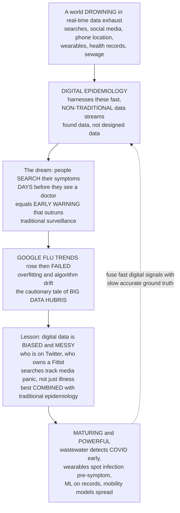

# 📡 Digital Epidemiology and Big Data

> [!abstract] TL;DR
> Traditional epidemiology is **slow and expensive** — surveys, notifiable-disease reports, and cohort studies that take months or years to see the shape of a health problem. But we now live in a world **drowning in real-time data exhaust**: billions of Google searches, social-media posts, smartphone location pings, wearable heart-rate traces, electronic health records, and even the virus fragments flushed into a city's sewage. **Digital epidemiology** (also *infodemiology* or *digital disease detection*) harnesses these vast, fast, **non-traditional** data streams to monitor and predict population health in **near-real time** — the shift from *designed* data we deliberately collect to *found* data that modern life continuously emits. The seductive dream: when a flu outbreak starts, people **search their symptoms online days before they visit a doctor**, so mining search queries could raise an alarm that *outruns* traditional surveillance. That dream had a famous rise and fall. **Google Flu Trends** launched to great fanfare, predicting flu from searches — then **embarrassingly failed**, drifting out of calibration and badly *over*-estimating the 2012–13 season, becoming the field's canonical cautionary tale of **"big data hubris"**: the belief that enough data can replace careful thinking. The lesson was *not* that digital data is useless, but that it is **biased and messy** — who is on Twitter? who owns a Fitbit? searches spike with media panic, not just illness — and that it works best **combined with** traditional epidemiology, never replacing it. Today the field is maturing powerfully: **wastewater** surveillance detecting COVID days early, **wearables** flagging infection before symptoms, **machine learning** on health records, and **mobility** data modeling spread. Digital epidemiology is the exciting, cautionary **frontier where epidemiology meets big data and AI** — vast new power that demands the same old rigor about **bias and causation**.

---

## Intuition

**Analogy first — the old census-taker versus the city's exhaust fumes.** Imagine you want to know how sick a city is. The traditional way is a diligent **census-taker**: they design a careful survey, knock on a representative sample of doors, wait weeks for clinics to file their reports, and eventually hand you a slow, accurate, expensive snapshot of what was true *last month*. Now imagine a second method. The city is constantly breathing out **exhaust** — every web search typed in a moment of worry, every fevered tweet, every phone that pings a cell tower, every smartwatch logging a racing resting heart rate, every toilet flushing traces of a virus into the sewers. This exhaust is enormous, it is instantaneous, and nobody had to be *asked* to produce it. **Digital epidemiology is the art of reading the city's exhaust instead of waiting for the census-taker** — trading the slow, clean survey for a torrent of fast, dirty signals that might reveal an outbreak while it is still small.

The most electrifying promise is **early warning**. A person with a scratchy throat and a fever will, on average, *search* "flu symptoms" or "fever aches" **days before** they ever sit in a doctor's waiting room to become a counted case. If searches rise before cases do, then watching the search stream is like hearing the distant rumble before the storm — a leading indicator that beats official surveillance by a crucial head start. This exact promise produced the field's most famous cautionary tale: **Google Flu Trends**, launched with fanfare, seemed to predict flu activity from search volume alone — and then it **drifted and blew up**, wildly *overestimating* a flu season, because a model tuned to a noisy proxy that also responds to news coverage and Google's own changing search suggestions cannot be trusted to keep tracking the truth. This became the textbook example of **"big data hubris"**: the mistaken faith that sheer volume of data is a substitute for understanding *where the data comes from* and *what biases it carries*.

That is the whole tension of this frontier in one story. The exhaust is **biased and messy**: the people who search, tweet, and wear Fitbits are **not the general population** (they skew younger, richer, more urban, more anxious), and their behavior tracks **media attention** as much as actual illness. So the mature lesson is not "big data replaces epidemiology" but the opposite — digital signals are **fast but treacherous**, traditional surveillance is **slow but trustworthy**, and the real power comes from **fusing** them: let the digital stream give you the early rumble, and let the slow, accurate ground truth keep it honest and recalibrated. Do that well and the payoff is spectacular — **wastewater** monitoring caught COVID surges days before clinical cases, **wearables** detected infections before people felt sick, and **mobility** data let modelers watch a pathogen spread across a country in real time. Digital epidemiology is the place where epidemiology shakes hands with big data and AI: unprecedented speed and scale, shadowed at every step by the ancient discipline's hardest questions about **bias, representativeness, and causation**.

---

## How It Works

### Core mechanics — from data exhaust to an actionable estimate

1. **Start from *found* data, not *designed* data.** Classical epidemiology *designs* its data: it defines a population, samples it, and collects exactly the variables it needs. Digital epidemiology instead repurposes data **generated for other reasons** — the "data exhaust" of searching, posting, moving, and being cared for. This is the foundational trade: you gain enormous **volume, velocity, and reach**, but you lose control over **who is represented** and **what each number actually means**.
2. **Tap the streams.** The raw material spans **internet search queries** (Google Trends), **social media** (symptom and sentiment posts), **smartphone mobility / location** (contact and spread modeling), **wearables and sensors** (heart rate, temperature, activity — pre-symptomatic infection signals), **electronic health records and insurance claims** (large-scale real-world data), **wastewater / environmental** sampling (population-level pathogen shedding), **genomic sequences**, and **news / media scraping** for event-based detection (HealthMap, ProMED).
3. **Turn signals into estimates with data science.** These streams are **high-volume, high-velocity, and unstructured**, so the analytic engine is **machine learning and statistics**: text classification to find symptom reports, regression and time-series models to map a proxy onto disease activity, and anomaly detection to flag the unexpected. The two headline tasks are **nowcasting** (estimating disease activity *right now*, before slow official data arrives) and **forecasting** (predicting the near future).
4. **Fuse, do not replace.** The mature architecture treats the digital stream as a **fast, biased sensor** that must be continuously **recalibrated against slow, accurate ground truth** (the notifiable-disease reports it aims to beat). Data **fusion** keeps the timeliness of the digital signal while anchoring its level and correcting its drift — the specific fix that Google Flu Trends lacked.
5. **Guard against the traps at every step.** Because the data are *found*, the pipeline must actively defend against **selection bias** (the data-generating population is not the target population), **noise and confounding** (searches surge with *media panic*, not only illness), **algorithm drift** (the platform changes underneath you — Google's autosuggest itself inflated flu searches), **spurious correlation**, and **privacy / consent** hazards from surveilling people's digital lives.

### Flow / architecture



*Read top to bottom: the data exhaust of modern life feeds digital epidemiology, whose dream of early warning was punctured by the Google Flu Trends failure; the hard lesson about bias and combination reshaped the field into a maturing discipline that fuses fast digital signals with slow, trustworthy surveillance.*

---

## Key Concepts

### Secondary (intuitive)

- **Digital epidemiology reads the city's "data exhaust."** Instead of slow surveys and clinic reports, it watches the fast digital traces we all leave — searches, posts, phone locations, smartwatches, and even sewage — to track health in near-real time.
- **The dream is early warning.** People often **search their symptoms before they see a doctor**, so watching searches could sound an alarm days ahead of the official case count.
- **Google Flu Trends is the famous flop.** It tried to predict flu from Google searches, worked for a while, then **badly over-predicted** and was shut down — the classic warning about *"big data hubris."*
- **The data is biased and messy.** The people who search, tweet, and wear fitness trackers **are not everybody**, and searches spike with *scary news*, not only real sickness. So digital signals are fast but not to be trusted alone.
- **Best combined, not alone.** The winning approach **fuses** fast digital signals with slow-but-accurate traditional surveillance — and modern successes like **wastewater** testing prove how powerful that combination can be.

### Undergraduate (formal)

- **Definition.** Digital epidemiology uses data generated **outside** the traditional public-health system — digital traces and big data — to monitor, understand, and predict population health, often in **near-real time**. It is the shift from *designed* data collection (samples, questionnaires, registries) to *found* data ("data exhaust").
- **The canonical data sources.** Search queries (Google Trends), social media, mobility/location, wearables, EHR/claims, wastewater/environmental sampling, genomic sequences, and media scraping — each with its own coverage, latency, and bias profile.
- **Nowcasting vs forecasting.** **Nowcasting** estimates the *current* (as-yet-unreported) disease level by exploiting a fast proxy while slow official data are still being finalized; **forecasting** projects the near future. Both lean on [[AI-ML/01_Classical_ML/Time_Series_Analysis|time-series models]] and machine learning.
- **The three "V"s and one "found."** Big data is characterized by **volume, velocity, and variety** — but the epidemiologically decisive property is that it is **found**, so representativeness is *not guaranteed by design* and must be established, not assumed.
- **The Google Flu Trends failure, dissected.** GFT combined **overfitting** (a model with too many search terms tuned to too little ground truth), **algorithm dynamics** (Google kept changing autosuggest and search behavior, altering the input), and **failure to recalibrate** against the CDC data it was trying to beat. The result: it missed the 2009 H1N1 off-season surge and *doubled* the true incidence in 2012–13.
- **"Big data hubris."** Coined by Lazer et al. (2014): the implicit assumption that big data are a **substitute** for, rather than a **supplement** to, traditional data collection and analysis. The corrective is **data fusion** — GFT plus CDC data beat either alone.

### Graduate (mechanistic and systems)

- **Selection bias, formalized.** Let the target estimand be population prevalence, but the observed digital sample be drawn with **participation probability** that depends on covariates *and* on the outcome. When the data-generating mechanism is correlated with the outcome (anxious, symptomatic, connected users over-search), the naive estimate is biased by an amount that does **not shrink with sample size** — Meng's "big data paradox": the error of a huge non-probability sample can exceed that of a tiny random one. This is a [[Computational_Social_Science/01_Foundations/Measurement_and_Validity_in_Digital_Data|measurement-validity]] problem, not a variance problem.
- **Proxy validity and confounding.** A digital signal `x_t` is used as a proxy for latent disease `y_t` via a learned map `y_hat = f(x_t)`. Validity fails when `x_t` also responds to **confounders** — media coverage, seasonality, platform UI changes — so that `f` estimated in-sample **does not transport** out-of-sample (covariate shift / concept drift). The remedy is continuous refitting and **fusion with ground truth**, treating `x_t` as a noisy sensor in a state-space / Kalman-style [[AI-ML/01_Classical_ML/Time_Series_Analysis|nowcasting]] model rather than a standalone predictor.
- **Overfitting and out-of-sample collapse.** GFT selected ~45 terms from 50 million candidates against ~150 weekly CDC points — a regime where [[AI-ML/01_Classical_ML/Evaluation/Cross_Validation|cross-validation]] and regularization are essential and were insufficiently heeded; many selected terms were **seasonal but non-causal** (e.g., "high school basketball"), so the model fit winter, not flu.
- **Data fusion / assimilation.** Combine a **fast, biased** stream (digital) with a **slow, accurate** stream (surveillance) so the fused nowcast inherits the timeliness of the former and the calibration of the latter — e.g., a dynamic linear model where the digital signal updates the state between slow observations, and each arriving ground-truth point **re-anchors** the level (ARGO and successors did exactly this, decisively out-performing GFT).
- **Wastewater-based epidemiology (WBE).** Measures pathogen RNA/DNA shed into sewersheds — a **population-level, test-independent leading indicator** immune to individual care-seeking and test-availability bias, which rises days before clinical cases. Its biases are *catchment*-level (sewer coverage, dilution, decay), not selection at the individual level — a fundamentally different, often milder, bias profile.
- **Privacy, ethics, and re-identification.** Mobility and EHR data enable surveillance overreach; "anonymized" location traces are notoriously **re-identifiable** from a few spatiotemporal points. Governance (consent, aggregation, differential privacy) is not an add-on but a precondition for a sustainable data supply.
- **Correlation without understanding.** The deepest trap: big data delivers *predictive* correlations at scale but does **not** by itself yield causal structure. Digital epidemiology therefore does not repeal the discipline's core demands — control of confounding, attention to selection, and explicit causal reasoning remain mandatory (this note's link to *Causal Inference in Epidemiology*).

---

## Python Demo

```python
# Digital epidemiology, two lessons in one figure (numpy + matplotlib):
#   (a) EARLY SIGNAL, then the GOOGLE-FLU OVERFITTING / DRIFT failure.
#       A search-query proxy LEADS true flu incidence by a couple of weeks
#       (great early warning). A model is fit to it on Season 1 and tracks
#       beautifully IN-SAMPLE. Out-of-sample (Season 2) a media-panic surge
#       inflates searches without matching real illness, so the naive
#       digital-only model DRIFTS and badly OVER-predicts -- "big data hubris."
#   (b) DATA FUSION beats either alone. The slow traditional stream is accurate
#       but arrives with a reporting LAG; the digital stream is fast but biased.
#       A nowcast that recalibrates the digital signal against the most recent
#       AVAILABLE ground truth keeps the timeliness AND kills the drift,
#       beating both the digital-only and the lagging traditional estimate.
import numpy as np
import matplotlib.pyplot as plt

rng = np.random.default_rng(2013)          # the year Google Flu Trends blew up

weeks = np.arange(0, 104)                  # two flu seasons, weekly
def bump(center, width, height):           # a single seasonal wave
    return height * np.exp(-0.5 * ((weeks - center) / width) ** 2)

# --- ground truth: two winter flu seasons (unknown in real time) ---
truth = 5 + bump(12, 4, 60) + bump(64, 4, 78)

# --- digital proxy: LEADS truth by ~2 weeks, plus a Season-2 media-panic spike ---
lead = 2
proxy_core  = bump(12 - lead, 4, 60) + bump(64 - lead, 4, 78)
media_panic = bump(56, 3, 55)              # spurious surge: news coverage, not illness
proxy = proxy_core + media_panic + rng.normal(0, 2.0, weeks.size)
proxy = np.clip(proxy, 0, None)

# --- fit a naive digital-only model on Season 1 (weeks 0..51), predict all ---
train = weeks < 52
slope, intercept = np.polyfit(proxy[train], truth[train], 1)
digital = slope * proxy + intercept        # digital-only estimate everywhere

# --- traditional surveillance: accurate SHAPE but arrives late (reporting lag) ---
lag = 3
traditional = np.empty_like(truth)
traditional[:lag] = truth[0]
traditional[lag:] = truth[:-lag] + rng.normal(0, 1.5, truth.size - lag)  # slow but true

# --- FUSION nowcast: rescale digital using recent OBSERVED ground truth only ---
window = 6
fused = digital.copy()
for t in range(weeks.size):
    obs_end = t - lag                      # only data older than the lag is known
    if obs_end > window:
        num = truth[obs_end - window:obs_end].sum()
        den = digital[obs_end - window:obs_end].sum()
        if den > 0:
            fused[t] = digital[t] * (num / den)   # re-anchor level -> corrects drift

def rmse(a, b, mask):                      # error over Season 2 (the honest test)
    return float(np.sqrt(np.mean((a[mask] - b[mask]) ** 2)))
s2 = (weeks >= 52) & (weeks <= 90)
rmse_dig  = rmse(digital, truth, s2)
rmse_trad = rmse(traditional, truth, s2)
rmse_fuse = rmse(fused, truth, s2)

fig, (ax1, ax2) = plt.subplots(1, 2, figsize=(15, 5.6))

# ---------- (a) early signal, then overfit drift ----------
ax1.axvspan(0, 51, color="#e9ecef", label="Season 1: model TRAINED here")
ax1.plot(weeks, truth,   color="black",   lw=2.5, label="True flu incidence")
ax1.plot(weeks, digital, color="#e8590c", lw=2.2, ls="--",
         label="Digital-only model (Google-Flu style)")
ax1.annotate("proxy LEADS cases\n-> early warning",
             xy=(9, 40), xytext=(18, 66),
             arrowprops=dict(arrowstyle="->", color="#2b8a3e", lw=1.5),
             fontsize=8, color="#2b8a3e")
ax1.annotate("OUT-OF-SAMPLE DRIFT:\ndigital model OVER-predicts\n(big data hubris)",
             xy=(58, digital[58]), xytext=(30, 118),
             arrowprops=dict(arrowstyle="->", color="#c92a2a", lw=1.5),
             fontsize=8, color="#c92a2a")
ax1.set_title("(a) Early signal, then the Google Flu failure mode")
ax1.set_xlabel("Week"); ax1.set_ylabel("Flu activity (cases)")
ax1.legend(loc="upper left", fontsize=8)

# ---------- (b) data fusion beats either alone ----------
ax2.plot(weeks, truth,       color="black",   lw=2.6, label=f"True incidence")
ax2.plot(weeks, digital,     color="#e8590c", lw=1.8, ls="--",
         label=f"Digital only  (RMSE {rmse_dig:.1f})")
ax2.plot(weeks, traditional, color="#1c7ed6", lw=1.8, ls=":",
         label=f"Traditional, lagged  (RMSE {rmse_trad:.1f})")
ax2.plot(weeks, fused,       color="#2b8a3e", lw=2.6,
         label=f"FUSED nowcast  (RMSE {rmse_fuse:.1f})")
ax2.set_xlim(45, 92)
ax2.set_title("(b) Data fusion: fast digital + slow ground truth wins")
ax2.set_xlabel("Week (Season 2)"); ax2.set_ylabel("Flu activity (cases)")
ax2.legend(loc="upper right", fontsize=8)

plt.tight_layout()
plt.show()

# ---------- console summary ----------
print(f"(a) Digital model fit on Season 1: slope={slope:.2f}, intercept={intercept:.1f}")
print(f"    Season-2 media-panic spike inflates the proxy -> the model over-predicts.")
print(f"(b) Season-2 RMSE vs truth:")
print(f"      digital only     : {rmse_dig:6.2f}  (fast, but drifts -- Google Flu)")
print(f"      traditional lag  : {rmse_trad:6.2f}  (accurate shape, but late)")
print(f"      FUSED nowcast    : {rmse_fuse:6.2f}  (best of both -> combine, do not replace)")
```

**What you see.** *Panel (a)* stages the field's whole morality play. The orange digital model **rises before** the black truth — the genuine, valuable early-warning lead that made search-based flu tracking so alluring. On Season 1, where it was **trained**, it fits almost perfectly. But Season 2 carries a **media-panic surge** that inflates searches *without* matching real illness, and the naive digital-only model — with no anchor to ground truth — **drifts and dramatically over-predicts** the peak. That is Google Flu Trends in miniature: overfitting plus drift equals *big data hubris*. *Panel (b)* shows the mature fix. The blue traditional estimate is accurate in shape but arrives **late** (a reporting lag), and the orange digital estimate is timely but biased. The green **fused nowcast** rescales the fast digital signal using only the ground truth already observed — inheriting the digital stream's **timeliness** while the recent-truth anchor **kills the drift**, and it wins on Season-2 RMSE against both. The moral the whole field learned: *combine, do not replace.*

---

## Real-World Applications

- **Google Flu Trends — the founding cautionary tale.** Google's 2008 system estimated influenza activity from search volume and initially tracked the CDC well, but it **missed the 2009 H1N1 off-season surge** and then **overestimated the 2012–13 peak by roughly double**, before being retired in 2015. Dissected by Lazer et al. (2014), it became the permanent reference case for **overfitting, algorithm drift, and the failure to fuse with ground truth** — and, paradoxically, the best argument *for* a disciplined digital epidemiology.
- **Wastewater-based surveillance for COVID-19.** Measuring SARS-CoV-2 RNA in municipal sewage gives a **population-level, testing-independent leading indicator** that repeatedly rose **days before** clinical case reports and stayed reliable even after home testing collapsed official counts. It is the clearest success of the "found data, done rigorously" ethos and now a standing CDC/WHO capability.
- **Wearables for pre-symptomatic infection detection.** Studies using Fitbit, Apple Watch, and Oura ring data (e.g., Stanford's work and the *DETECT* study) showed that **resting heart rate, temperature, and activity anomalies** can flag influenza and COVID-19 infection **before symptoms**, pointing toward continuous, individual-level early warning — with the standing caveat that wearable owners are a skewed, affluent slice of the population.
- **Mobility data and epidemic modeling.** Aggregated, anonymized **smartphone mobility** (Google/Meta mobility reports, cell-phone flows) let modelers estimate contact-rate changes, quantify the effect of lockdowns, and seed **spatially explicit spread models** during COVID-19 — a direct bridge between digital traces and classical [[Systems_Thinking_and_Complexity/03_Networks_and_Connectivity/Network_Dynamics_and_Contagion|contagion dynamics]].
- **Event-based surveillance from media scraping.** **HealthMap**, **ProMED**, and WHO's **EIOS** continuously mine news, official reports, and online chatter to detect outbreak signals — HealthMap flagged unusual pneumonia reports around Wuhan in late December 2019, days before formal notifications, illustrating the value (and the noise) of unstructured digital signals.
- **EHR and claims-based real-world evidence.** Large federated networks (Sentinel, OHDSI/OMOP, TriNetX) mine tens of millions of electronic records for **drug safety, disease incidence, and post-market surveillance** — big-data epidemiology at scale, where the central challenge is confounding and selection in *found* clinical data rather than timeliness.

---

## Common Pitfalls

- **"Big data hubris" — assuming volume replaces rigor.** The signature error of Google Flu Trends: believing that enough data makes careful sampling, calibration, and causal thinking unnecessary. Big data is a **supplement**, not a substitute; the discipline's demands about bias and confounding do not evaporate at scale.
- **Ignoring selection bias / representativeness.** The people who search, tweet, and wear fitness trackers are **younger, richer, more urban, and more anxious** than the general population. A signal computed from them silently answers a different question than the one you asked — and, per the **big data paradox**, this bias does *not* shrink as the sample grows.
- **Mistaking media panic for disease.** Search and social signals surge with **news coverage and fear**, not only true incidence. A model that cannot separate the two will amplify every scare into a phantom epidemic — exactly the confounding that inflated the GFT 2012–13 estimate.
- **Overfitting a proxy to sparse ground truth.** Selecting many predictors against few outcome observations (GFT: dozens of terms, ~150 weekly points) invites terms that are **seasonal but non-causal**. Without [[AI-ML/01_Classical_ML/Evaluation/Cross_Validation|honest cross-validation]] and regularization, the model fits *winter*, not *flu*, and collapses out-of-sample.
- **Forgetting algorithm dynamics / drift.** The platform changes underneath you: Google altered autosuggest and search behavior, shifting the very input GFT depended on. A found-data signal is **not stationary**; models must be continuously re-fit and **re-anchored to ground truth**, never set-and-forget.
- **Failing to fuse with traditional surveillance.** The single most important corrective. Digital signals should be treated as **fast, biased sensors** feeding a nowcast that is continuously recalibrated by slow, accurate reports — the difference between ARGO's success and GFT's failure.
- **Neglecting privacy, consent, and re-identification.** Mobility and health-record streams enable surveillance overreach, and "anonymized" location data is often **re-identifiable** from a handful of points. Weak governance erodes public trust and, ultimately, the data supply itself.
- **Confusing correlation with causal understanding.** Big data yields *predictive* correlations, not causal structure. Acting on a spurious correlation (or assuming a proxy will keep working because it did before) is how digital epidemiology quietly reproduces every classical error at greater speed and scale.

---

## Related Concepts

**Within this vault (Section 06 and beyond, prose references).** Digital epidemiology is the modern, big-data extension of classical *Surveillance and Disease Monitoring* — where that note introduced syndromic, wastewater, search-query, and genomic streams as the leading edge of the "early-warning radar," this note develops their promise and perils in full. Its central cautionary thread runs straight back to *Bias, Selection and Information*: the whole Google-Flu lesson is that **selection bias and unrepresentative data-generating populations** do not vanish at scale, and to *Causal Inference in Epidemiology*, because big data delivers correlations, never causal structure, on its own. It is the applied cousin of *Genetic and Molecular Epidemiology* — both are data-intensive frontiers where sequencing, sensors, and machine learning multiply the volume of evidence without repealing the need for epidemiologic judgment — and it operationalizes the real-time detection that *Pandemics and Emerging Infections* depends on, with wastewater and mobility signals proving their worth during COVID-19. Finally it is a defining strand of *The Reach and Future of Epidemiology*, the frontier where the field bridges to data science and AI while carrying its hardest questions about bias and causation forward. *(These siblings are referenced in prose; the wikilinks below point only to Glob-verified notes elsewhere in the vault.)*

**Across the vault (Glob-verified links).**

- [[AI-ML/01_Classical_ML/Time_Series_Analysis|Time Series Analysis and Forecasting]] — the modeling backbone of nowcasting and forecasting: baselines, seasonality, change points, and the state-space fusion that anchors a fast proxy to slow ground truth.
- [[AI-ML/01_Classical_ML/Anomaly_Detection|Anomaly Detection]] — the machine-learning generalization of aberration/outbreak detection: separating a genuine signal from noisy, high-velocity digital streams.
- [[AI-ML/01_Classical_ML/Evaluation/Cross_Validation|Cross-Validation]] — the discipline against overfitting that Google Flu Trends under-used; why in-sample fit is not out-of-sample truth.
- [[Computational_Social_Science/01_Foundations/Big_Data_and_the_Social_Sciences|Big Data and the Social Sciences]] — the sibling paradigm across the social sciences, sharing the exact promise (scale, speed) and perils (bias, hubris) of found data.
- [[Computational_Social_Science/01_Foundations/Digital_Traces_and_Found_Data|Digital Traces and Found Data]] — the general theory of "data exhaust" and repurposed traces that digital epidemiology applies to health.
- [[Computational_Social_Science/01_Foundations/Measurement_and_Validity_in_Digital_Data|Measurement and Validity in Digital Data]] — the formal treatment of whether a digital proxy actually measures what you think, the crux of the Google-Flu failure.
- [[Data_Analytics/01_Foundations/Data_Analytics_Overview|Data Analytics Overview]] — the data-science toolkit (pipelines, EDA, visualization, modeling) that turns raw streams into public-health estimates.
- [[Systems_Thinking_and_Complexity/03_Networks_and_Connectivity/Network_Dynamics_and_Contagion|Network Dynamics and Contagion]] — the contagion and mobility-network models that digital mobility data feed to simulate real-time spread.

---

## Review Questions

**Secondary.** Using the "city's data exhaust" analogy, explain what digital epidemiology is and why it can sometimes warn of an outbreak *before* the traditional public-health system does. Then, in your own words, tell the story of **Google Flu Trends** — what it tried to do, and why "big data hubris" is the lesson people remember. Give one concrete reason the people who generate digital data (searches, tweets, Fitbit data) are **not** a fair sample of everyone.

**Undergraduate.** A team builds a model that predicts weekly flu cases from Google search volume, and it fits last year's data almost perfectly. (a) Explain the difference between this model's strong **in-sample** performance and how it might behave **out-of-sample**, and name two mechanisms — one about the *model* and one about the *platform* — that could make it drift. (b) Define **nowcasting** and explain why a fast digital proxy is useful even when it is biased. (c) Describe how **data fusion** with slow, accurate surveillance could fix the model, and why this is "combine, not replace."

**Graduate.** State the **big data paradox** (Meng) in words and explain why the estimation error of a massive non-probability digital sample need **not** shrink toward zero as the sample grows — contrast this with a small random sample. Then, treating a digital signal `x_t` as a proxy for latent disease `y_t`, explain precisely why a map `f` estimated in-sample can fail to transport out-of-sample (identify the confounder and the type of distribution shift involved), and describe one concrete **fusion / assimilation** scheme that corrects for it. Finally, explain why **wastewater-based epidemiology** has a fundamentally *different and often milder* bias profile than search- or social-media-based signals.

---

## Sources

- Salathé, M., Bengtsson, L., Bodnar, T. J., et al. (2012). "Digital Epidemiology." *PLoS Computational Biology*, 8(7), e1002616. [https://doi.org/10.1371/journal.pcbi.1002616](https://doi.org/10.1371/journal.pcbi.1002616)
- Lazer, D., Kennedy, R., King, G., & Vespignani, A. (2014). "The Parable of Google Flu: Traps in Big Data Analysis." *Science*, 343(6176), 1203–1205. [https://doi.org/10.1126/science.1248506](https://doi.org/10.1126/science.1248506)
- Brownstein, J. S., Freifeld, C. C., & Madoff, L. C. (2009). "Digital Disease Detection — Harnessing the Web for Public Health Surveillance." *New England Journal of Medicine*, 360(21), 2153–2157. [https://doi.org/10.1056/NEJMp0900702](https://doi.org/10.1056/NEJMp0900702)
- Buckee, C. O., Balsari, S., Chan, J., et al. (2020). "Aggregated mobility data could help fight COVID-19." *Science*, 368(6487), 145–146. [https://doi.org/10.1126/science.abb8021](https://doi.org/10.1126/science.abb8021)
- Yang, S., Santillana, M., & Kou, S. C. (2015). "Accurate estimation of influenza epidemics using Google search data via ARGO." *PNAS*, 112(47), 14473–14478. [https://doi.org/10.1073/pnas.1515373112](https://doi.org/10.1073/pnas.1515373112)

---

#epidemiology #digital-epidemiology #big-data #google-flu-trends #wastewater-surveillance
