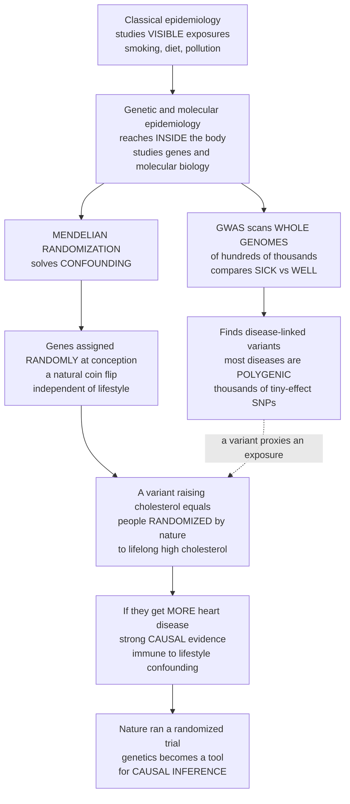

# 🧬 Genetic and Molecular Epidemiology

> [!abstract] TL;DR
> Classical epidemiology studies the exposures you can *see* — smoking, diet, pollution — but **genetic and molecular epidemiology reaches inside the body**, asking how our **genes** and molecular biology shape who gets sick, and how genes and environment interact. Its flagship tool, the **genome-wide association study (GWAS)**, is epidemiology at massive scale: scan the whole genome of hundreds of thousands of people, compare the sick with the well, and find which of millions of tiny variants (**SNPs**) are over-represented in disease — revealing that most common diseases are highly **polygenic** (thousands of small-effect variants) and enabling **polygenic risk scores**. But genetic epidemiology also cracked one of observational epidemiology's oldest, most maddening problems — **confounding** — with a strikingly clever trick called **Mendelian randomization (MR)**. The insight: your genes are dealt at conception in a natural coin flip, *independent* of your later lifestyle and social circumstances. So a variant that, say, raises lifelong cholesterol effectively **randomizes people by nature** to high cholesterol — and if *they* suffer more heart disease, that is strong **causal** evidence, immune to the lifestyle confounding that plagues ordinary studies. Nature ran a randomized trial for us. This turns genetics into a **tool for causal inference**, helping settle the flip-flopping questions (does alcohol cause cancer? does obesity cause diabetes?) that ordinary epidemiology cannot. Add the **molecular / omics frontier** — biomarkers, transcriptomics, proteomics, metabolomics, epigenomics, the microbiome, the "exposome" — and you have the branch where population health science merges with the genomics revolution.

---

## Intuition

**Analogy — from watching the outside of the body to reaching inside it.** Classical epidemiology is a detective who works from the *outside*: it watches what people do — how much they smoke, what they eat, the air they breathe — and correlates those visible habits with who falls ill. But the detective can never see *inside*. Two problems haunt this outside-only view. First, the deepest causes of disease may be **molecular** — a gene variant, a protein, a methylation mark — invisible to any questionnaire. Second, the visible habits are hopelessly tangled: people who drink wine also tend to be richer, exercise more, and eat better, so you can never tell whether the *wine* or the *lifestyle* did the work. Genetic and molecular epidemiology hands the detective an X-ray machine and a DNA lab, and it solves *both* problems at once.

The first tool, the **genome-wide association study (GWAS)**, is brute-force epidemiology aimed inward. Take a disease — type 2 diabetes, schizophrenia, coronary heart disease — round up hundreds of thousands of people, read out millions of positions in each genome, and ask a simple question a million times over: *is this particular letter of DNA more common in the sick than the well?* Almost every position says "no." A handful shout "yes," and those are the genes involved in the disease. The catch is scale: because you run millions of tests, you need a punishingly strict bar for significance (about **5 in 100 million**), which is why the picture that comes out — the famous **Manhattan plot** — is a flat cityscape of noise with a few skyscrapers of genuine signal rising above it.

The second tool, **Mendelian randomization**, is the beautiful part. Recall why the wine study is untrustworthy: wine-drinking is *confounded* with wealth and health-consciousness. Now consider a gene variant that happens to make people metabolize alcohol differently and drink less. Here is the magic: **which variant you inherited was decided by a coin flip at conception** (Mendel's law of random assortment), *before* you had any lifestyle, income, or diet. Nature randomized you. So if the people who inherited the "drinks less" variant get *less* cancer, that comparison is protected from the confounding that ruins the ordinary wine study — because your genes were assigned at random and cannot be caused by your later habits. A gene that shifts cholesterol becomes a "natural experiment" for lifetime cholesterol; a gene that shifts body-mass becomes a natural experiment for obesity. **It is as though nature ran a randomized controlled trial for you, decades in advance, and all the epidemiologist has to do is read out the result.** That is how genetics became a machine for *causal* inference, capable of settling the very questions — does cholesterol truly cause heart disease? does obesity truly cause diabetes? — that flip-flopping lifestyle studies never can.

---

## How It Works

### Core mechanics — genes and molecules as both cause and instrument

1. **Foundations: heritability and familial aggregation.** Long before DNA could be read, genetic epidemiology asked *how much* of a disease is inherited. **Twin studies** (comparing identical vs fraternal twins) and **family studies** partition variation into genetic vs environmental components, yielding a **heritability** estimate. High familial clustering flags a genetic contribution and motivates the hunt for the responsible variants. The field then shifted from **single-gene linkage** mapping (which works for rare Mendelian disorders in big pedigrees) to **complex-trait** association (needed because common diseases are driven by *many* genes plus environment).
2. **GWAS — scanning the whole genome.** In a large case-control or cohort sample, genotype **millions of single-nucleotide polymorphisms (SNPs)** and test each one for association with the disease (typically a per-SNP logistic regression, adjusted for ancestry). Because you perform millions of tests, the **multiple-testing** burden is enormous, so the **genome-wide significance threshold** is set at roughly **5 × 10⁻⁸** (a Bonferroni-style correction for ~1 million independent tests). Results are drawn as a **Manhattan plot**: −log₁₀(p-value) up the y-axis, genomic position along the x-axis, with the significance line near 7.3.
3. **What GWAS revealed — polygenicity and missing heritability.** For most common traits, no single "gene for" the disease exists; instead **thousands of variants each nudge risk by a tiny amount** — the trait is highly **polygenic**. Summing these effects across the genome produces a **polygenic risk score (PRS)** that stratifies individual risk. Yet the discovered variants explain only part of the twin-estimated heritability — the **"missing heritability"** puzzle (rare variants, gene-gene interaction, and overestimated heritability all contribute).
4. **From association to Mendelian randomization.** GWAS finds variants that *proxy* a modifiable exposure — an LDL-cholesterol-raising SNP, a BMI-raising SNP, an alcohol-metabolism SNP. Because alleles are **randomly assorted at conception** (Mendel's second law) and **fixed for life**, such a variant is generally **unconfounded** by lifestyle and socioeconomics and **immune to reverse causation** (disease cannot change the DNA you were born with). It therefore behaves like the random assignment in a trial.
5. **Mendelian randomization as instrumental-variables inference.** MR uses the genetic variant *Z* as an **instrumental variable** for exposure *X* to estimate the causal effect on outcome *Y*. The core estimate is the **Wald ratio**: (effect of gene on outcome) ÷ (effect of gene on exposure), i.e. `β_ZY / β_ZX`. Because *Z* is independent of confounders, this ratio recovers the true causal slope even when the naive observational association is badly biased. Modern MR combines many instruments (multi-SNP scores, MR-Egger, weighted median) to guard against violations.
6. **The MR assumptions (and their limits).** MR is valid only if the instrument (i) is **associated with the exposure** (relevance — weak instruments bias toward the confounded estimate), (ii) affects the outcome **only through the exposure** (no **pleiotropy** — the gene must not influence disease by a second pathway), and (iii) is **independent of confounders** (usually true by Mendel, but broken by **population stratification** — ancestry differences that correlate with both genotype and disease).
7. **Molecular epidemiology — measuring the middle of the causal chain.** Beyond germline DNA, molecular epidemiology inserts **biomarkers** of exposure, susceptibility, and early biological effect into study designs, spanning the **omics** layers: **genomics, transcriptomics, proteomics, metabolomics, epigenomics, the microbiome**, and the integrative **"exposome"** (the totality of lifetime exposures). These molecular measures sharpen fuzzy questionnaire exposures (reducing **misclassification bias**), reveal mechanism, and enable **molecular subtyping** — dividing a clinically single disease into molecularly distinct entities (the program of **molecular pathological epidemiology**).

### The genome as detective and as natural experiment



*Read top to bottom: classical epidemiology watches the outside; genetic and molecular epidemiology reaches inside. One branch (GWAS) scans whole genomes to discover polygenic disease variants; the other branch (Mendelian randomization) exploits nature's random assignment of genes at conception to turn a disease variant into a natural experiment that defeats confounding.*

---

## Key Concepts

### Secondary (intuitive)

- **Genes as clues to disease.** Some illnesses run in families. Genetic epidemiology reads people's DNA to find *which* genes make a disease more likely — reaching inside the body where habits questionnaires cannot see.
- **The genome-wide scan.** A **GWAS** reads millions of tiny spots in the DNA of huge numbers of people and asks, over and over, "is this spot more common in the sick?" The rare "yes" answers point to disease genes — pictured in the skyscraper-and-noise **Manhattan plot**.
- **Nature's coin flip.** Which genes you inherit is decided *at conception*, at random, before you ever pick up a habit. That randomness is the key to the whole trick.
- **A gene as a natural experiment.** If a gene makes people have higher cholesterol for life, then people with that gene were *randomly assigned* to high cholesterol by nature — so if they get more heart disease, cholesterol probably *causes* heart disease.
- **Molecules, not just habits.** Instead of only asking "how much do you drink?", molecular epidemiology can *measure* substances in the blood — a far more accurate readout of what the body actually experienced.

### Undergraduate (formal)

- **Genetic epidemiology.** The study of the role of **genetic factors and gene–environment interaction** in disease in populations. It began with **heritability** (twin/family studies partitioning variance into genetic vs environmental) and progressed from **linkage analysis** (single-gene, rare Mendelian disorders) to **association analysis** (common, complex traits).
- **GWAS mechanics.** Genotype ~10⁶–10⁷ **SNPs**; test each for disease association; correct for the massive **multiple-testing** problem with a **genome-wide significance** threshold ≈ **5 × 10⁻⁸**. Adjust for **population stratification** (via principal components) to prevent ancestry from acting as a confounder.
- **Polygenicity and PRS.** Common diseases are **highly polygenic**: risk is spread across thousands of small-effect loci. A **polygenic risk score** aggregates these into a single per-person risk index — a pillar of precision medicine — while the gap between GWAS-explained and twin-estimated heritability is the **"missing heritability."**
- **Mendelian randomization.** Uses a genetic variant as an **instrumental variable** for a modifiable exposure. Valid instruments must satisfy **relevance** (associated with exposure), the **exclusion restriction** (affect outcome only via exposure — no pleiotropy), and **independence** from confounders. The **Wald ratio** `β_ZY / β_ZX` estimates the causal effect; because genotype is randomized at conception and fixed for life, MR is protected from lifestyle confounding and reverse causation.
- **Molecular epidemiology.** Integrates **biomarkers** (of exposure, susceptibility, early effect) and **omics** measurements into epidemiologic designs, improving exposure/outcome measurement (reducing **misclassification**), adding mechanistic insight, and enabling **molecular subtyping** of disease.

### Graduate (mechanistic and systems)

- **The MR causal diagram and its failure modes.** MR is a **directed acyclic graph** in which `Z → X → Y`, with `Z` d-separated from the confounder `U`. **Horizontal pleiotropy** (`Z → Y` off-pathway) violates the exclusion restriction and biases the estimate; **MR-Egger regression**, **weighted-median**, and **MR-PRESSO** estimators relax or detect it. **Weak instruments** (small `β_ZX`) inflate finite-sample bias toward the confounded observational estimate and are diagnosed with the **F-statistic**. **Population stratification**, **assortative mating**, and **dynastic effects** (parental genotype acting through the environment) can each break the independence assumption; **within-sibship** and family-based MR designs address them.
- **Two-sample and multivariable MR.** `β_ZX` and `β_ZY` can be taken from **two separate GWAS** (exposure GWAS and outcome GWAS), enabling MR on published summary statistics at biobank scale (**two-sample MR**). **Multivariable MR** conditions on multiple correlated exposures (e.g. LDL vs triglycerides vs HDL) to isolate which lipid fraction is causal — the analysis that helped exonerate HDL and indict LDL and Lp(a).
- **From polygenic architecture to biology.** Most GWAS hits lie in **non-coding regulatory regions**, so mapping a signal to a **causal gene and mechanism** requires fine-mapping, expression-QTL (**eQTL**) colocalization, and functional assays — the "**association-to-function**" bottleneck. **Omnigenic** models propose that peripheral "trans" genes propagate small effects through regulatory networks into a few "core" genes, explaining pervasive polygenicity.
- **Ancestry diversity and PRS portability.** Because most GWAS were conducted in populations of European ancestry, **polygenic risk scores transfer poorly** across ancestries (linkage-disequilibrium and allele-frequency differences), risking that precision medicine widens rather than narrows health disparities — a central equity problem of the field.
- **Molecular pathological epidemiology and the exposome.** Rather than treating "colorectal cancer" as one outcome, **molecular pathological epidemiology** stratifies it by molecular subtype (e.g. microsatellite-instability, *BRAF*/*KRAS* status), allowing exposure effects to be estimated *within* mechanistically homogeneous disease classes. The **exposome** program pushes the same logic on the exposure side — measuring the full internal chemical/omics milieu — to close the gap between crude questionnaire exposures and true biological dose.
- **Drug-target validation by MR.** Because a gene encoding a **drug target** can be perturbed genetically (e.g. *PCSK9*, *HMGCR*, *IL6R* variants), MR provides a "**natural trial**" of the target *before* a clinical trial — predicting efficacy and on-target side effects and de-risking pharmaceutical pipelines (MR support for a target roughly doubles the probability of trial success).

---

## Python Demo

```python
# Genetic epidemiology, two flagship tools in one figure:
#   (a) GWAS / MANHATTAN PLOT -- simulate a genome-wide association scan. Most SNPs are
#       NULL (p-values ~ Uniform) but a few TRUE disease variants have tiny p-values.
#       We plot -log10(p) across genomic position with the genome-wide significance line
#       at 5e-8. The strict threshold exists because we run MILLIONS of tests
#       (multiple testing): a naive 0.05 cutoff would flag ~50,000 false SNPs per million.
#   (b) MENDELIAN RANDOMIZATION -- an exposure (cholesterol X) is CONFOUNDED with an
#       outcome (heart disease Y) by an unmeasured factor U (lifestyle/SES), so the naive
#       association is biased. A GENETIC INSTRUMENT Z (an LDL-raising variant, assigned at
#       conception and INDEPENDENT of U) recovers the TRUE causal effect via the
#       instrumental-variable Wald ratio -- defeating the confounding that fools OLS.
import numpy as np
import matplotlib.pyplot as plt

rng = np.random.default_rng(2003)          # year of Davey Smith & Ebrahim's MR manifesto

# ===================== (a) GWAS: the Manhattan plot =====================
n_chrom, snps_per_chrom = 22, 500
n_snps = n_chrom * snps_per_chrom
chrom  = np.repeat(np.arange(1, n_chrom + 1), snps_per_chrom)
x_pos  = np.arange(n_snps)

pvals = rng.uniform(0, 1, n_snps)          # the vast majority of SNPs are NULL
true_hits = rng.choice(n_snps, size=6, replace=False)   # plant a few real signals
pvals[true_hits] = 10.0 ** (-rng.uniform(9, 15, size=6))  # p ~ 1e-9 .. 1e-15

neglog_p      = -np.log10(pvals)
gws_threshold = -np.log10(5e-8)            # ~7.30: genome-wide significance
n_signif      = int(np.sum(neglog_p > gws_threshold))

# ===================== (b) Mendelian randomization =====================
n = 5000
U = rng.normal(0, 1, n)                     # UNMEASURED confounder (lifestyle / SES)
Z = rng.binomial(2, 0.30, n)               # genetic instrument: 0/1/2 LDL-raising alleles
                                            # assigned at conception, INDEPENDENT of U

beta_true = 0.35                            # TRUE causal effect of cholesterol on disease
b_zx      = 0.60                            # per-allele effect of the variant on cholesterol
X = 3.0 + b_zx * Z + 0.5 * U + rng.normal(0, 0.4, n)   # exposure: gene + confounder
Y = beta_true * X + 0.6 * U + rng.normal(0, 0.4, n)    # outcome: causal X + confounder U

# Naive (confounded) observational association: OLS slope of Y on X -- BIASED by U
b_naive = np.polyfit(X, Y, 1)[0]

# Mendelian randomization = instrumental-variable Wald ratio:
#   beta_MR = Cov(Z, Y) / Cov(Z, X)  -- uses ONLY gene-driven variation, immune to U
b_mr = (np.cov(Z, Y)[0, 1] / np.var(Z)) / (np.cov(Z, X)[0, 1] / np.var(Z))

# ============================== plotting ==============================
fig, (ax1, ax2) = plt.subplots(1, 2, figsize=(15, 5.5))

# --- panel (a): Manhattan plot ---
colors = np.where(chrom % 2 == 0, "#4C72B0", "#55A868")
ax1.scatter(x_pos, neglog_p, c=colors, s=8, alpha=0.7)
ax1.scatter(x_pos[true_hits], neglog_p[true_hits], facecolors="none",
            edgecolors="#C44E52", s=120, linewidths=2.0, label="true disease variants")
ax1.axhline(gws_threshold, color="red", ls="--", lw=1.6,
            label="genome-wide significance  p = 5e-8")
ticks = [i * snps_per_chrom + snps_per_chrom // 2 for i in range(0, n_chrom, 2)]
ax1.set_xticks(ticks)
ax1.set_xticklabels([str(c) for c in range(1, n_chrom + 1, 2)], fontsize=8)
ax1.set_xlabel("chromosome (genomic position)")
ax1.set_ylabel("-log10(p-value)")
ax1.set_title("(a) GWAS Manhattan plot:\ntrue hits rise above a sea of null SNPs")
ax1.legend(loc="upper right", fontsize=8)

# --- panel (b): Mendelian randomization defeats confounding ---
sc = ax2.scatter(X, Y, c=U, cmap="coolwarm", s=6, alpha=0.35)
xs = np.linspace(X.min(), X.max(), 50)
ax2.plot(xs, np.polyval(np.polyfit(X, Y, 1), xs), color="black", lw=2.6,
         label=f"naive OLS (confounded)  b = {b_naive:.2f}")
ax2.plot(xs, Y.mean() + b_mr * (xs - X.mean()), color="#8E44AD", lw=2.6, ls="--",
         label=f"MR / IV estimate  b = {b_mr:.2f}")
ax2.plot([], [], " ", label=f"TRUE causal effect  b = {beta_true:.2f}")
ax2.set_xlabel("cholesterol  (exposure X)")
ax2.set_ylabel("heart disease  (outcome Y)")
ax2.set_title("(b) Mendelian randomization:\ngenetic instrument recovers the truth")
ax2.legend(loc="upper left", fontsize=8)
fig.colorbar(sc, ax=ax2, label="unmeasured confounder U")

plt.tight_layout()
plt.show()

print(f"(a) GWAS: {len(true_hits)} true variants planted; "
      f"{n_signif} SNPs exceed genome-wide significance")
print(f"    threshold -log10(5e-8) = {gws_threshold:.2f}")
print(f"(b) TRUE causal effect       beta = {beta_true:.2f}")
print(f"    Naive OLS (confounded)   beta = {b_naive:.2f}   (biased upward by U)")
print(f"    Mendelian randomization  beta = {b_mr:.2f}   (recovers the truth)")
```

**What you see.** *Panel (a)* is a GWAS in miniature. Almost every SNP produces a p-value drawn from noise, so its −log₁₀(p) hovers low, forming the flat "street" of the **Manhattan plot**; only the handful of **true disease variants** (circled) punch through the red **genome-wide-significance line at 5 × 10⁻⁸**. The demo makes the multiple-testing logic concrete: with millions of tests, a conventional p < 0.05 cutoff would declare tens of thousands of null SNPs "significant," so the threshold must be brutally strict to keep the skyscrapers real. *Panel (b)* is Mendelian randomization defeating confounding. The points are coloured by the hidden confounder **U**: because U raises *both* cholesterol and heart disease, the black **naive OLS** line is far too steep (≈ 0.8), badly overstating the true effect (0.35). But the **genetic instrument Z** was assigned independently of U, so the purple **MR / instrumental-variable** slope uses only the gene-driven slice of cholesterol variation and lands squarely on the true causal effect. The observational study is fooled; the natural experiment written into the genome is not.

---

## Real-World Applications

- **LDL cholesterol, HDL, and heart disease — MR settles a decades-long debate.** Observational studies suggested that *raising* HDL ("good cholesterol") would protect the heart. Mendelian randomization on HDL-raising variants found **no causal benefit**, while LDL- and Lp(a)-raising variants were robustly **causal** — foretelling the failure of HDL-raising CETP-inhibitor trials and validating aggressive LDL-lowering. A textbook case of MR overturning confounded observational belief.
- **PCSK9 and the birth of a blockbuster drug class.** People carrying natural **PCSK9 loss-of-function variants** have lifelong low LDL and strikingly low heart-disease risk — a genetic "natural trial" that de-risked the target and led directly to **PCSK9-inhibitor drugs** (evolocumab, alirocumab). MR-style genetic evidence is now routine in **drug-target validation**.
- **Alcohol and disease via the ALDH2 "flushing" variant.** In East Asian populations, an **ALDH2** variant makes alcohol unpleasant, lowering lifelong intake independent of lifestyle. Using it as an instrument shows alcohol **causally** raises blood pressure and esophageal cancer risk — cutting through the confounding (and reverse-causation "sick-quitter") problems that muddy observational alcohol studies.
- **Polygenic risk scores in the clinic.** GWAS-derived **PRS** now identify individuals at monogenic-equivalent risk for coronary artery disease, breast cancer, and type 2 diabetes, informing earlier screening and prevention — the operational core of **precision public health**, tempered by the serious **ancestry-portability** limitation.
- **UK Biobank and biobank-scale MR.** Half-a-million-participant resources with linked genomes, biomarkers, and health records power **two-sample MR** across thousands of exposure-outcome pairs (a "MR-EVE"/phenome-wide screen), rapidly testing whether BMI, CRP, education, vitamin D, or coffee are *causal* for dozens of diseases.
- **Molecular and omics epidemiology of cancer.** Measuring **biomarkers** and molecular subtypes (e.g. HPV status in oropharyngeal cancer, mutational signatures, blood metabolomics) sharpens exposure assessment and reveals mechanism — the program of **molecular pathological epidemiology**.

---

## Common Pitfalls

- **Pleiotropy breaks Mendelian randomization.** MR is only valid if the instrument affects the outcome *solely* through the exposure. A variant with **horizontal pleiotropy** (a second, off-pathway effect on disease) violates the exclusion restriction and yields a false causal estimate. Always probe with MR-Egger, weighted-median, and biological plausibility — never trust a single-SNP Wald ratio blindly.
- **Weak instruments bias toward the confounded answer.** If the genetic variant explains little of the exposure (small `β_ZX`, low F-statistic), the MR estimate drifts back toward the very observational bias it was meant to escape. Check instrument strength before believing the result.
- **Population stratification masquerades as association.** If cases and controls differ in ancestry, allele frequencies that merely *track* ancestry can look disease-associated (a classic **confounding** artefact — the "chopsticks gene" fallacy). Failing to adjust for ancestry (principal components) produces spurious GWAS hits and invalid MR.
- **Treating a GWAS hit as "the gene."** Most signals sit in **non-coding regulatory DNA** and are correlated (via linkage disequilibrium) with the true causal variant, which may act on a *distant* gene. Naming the nearest gene as causal without fine-mapping and functional follow-up is a frequent, embarrassing error — the **association-to-function** gap.
- **Over-selling polygenic risk scores — and exporting them across ancestries.** A PRS trained in European-ancestry data can **misclassify risk in other populations**, potentially widening health disparities. PRS give *relative* risk in a population, not deterministic destiny, and must be validated in the target ancestry before clinical use.
- **Confusing "heritable" with "genetic and unchangeable."** A high heritability estimate describes variance *in a particular population and environment*; it says nothing about whether an environmental intervention can help. Height is highly heritable yet rose with nutrition — heritability is not fate.
- **Ignoring multiple testing (or over-correcting).** The 5 × 10⁻⁸ threshold exists because a million tests make 0.05 meaningless; but applying genome-wide strictness to a single pre-specified candidate SNP would be needlessly conservative. Match the correction to the number of tests actually performed.

---

## Related Concepts

**Within this vault (Section 06 and beyond — prose references).** This note is the genomics leg of **Section 06 – Chronic, Global and Frontier Epidemiology**. Its sibling *Chronic Disease and Lifestyle Epidemiology* supplies the visible-exposure studies (smoking, diet, obesity) whose stubborn **confounding** Mendelian randomization was invented to defeat — the two notes are direct partners, one posing the causal questions and the other answering them with DNA. Reaching back to Section 03, *Causal Inference in Epidemiology* provides the counterfactual and Bradford-Hill scaffolding on which MR is a spectacular special case (nature's randomization delivering exchangeability), and *Directed Acyclic Graphs and Modern Causal Methods* gives the exact `Z → X → Y` graph and the instrument, pleiotropy, and collider logic that make MR rigorous; *Nutritional and Social Epidemiology* shares MR's core motivation, since diet and socioeconomic exposures are the most confounded of all and among MR's most valuable targets. Finally, *The Reach and Future of Epidemiology* frames genetic and molecular methods as the field's causal-inference and precision-public-health frontier.

**Across the vault (Glob-verified links).**

- [[Genetics/05_Human_and_Medical_Genetics/Complex_Trait_Genetics_and_GWAS|Complex Trait Genetics and GWAS]] — the genetics-side companion to this note: the SNP-array machinery, linkage disequilibrium, heritability, and GWAS discovery that genetic epidemiology deploys at population scale.
- [[Genetics/05_Human_and_Medical_Genetics/Human_Genome_and_Genetic_Variation|Human Genome and Genetic Variation]] — the raw material: SNPs, indels, and structural variation, and why common variation is what GWAS and polygenic scores exploit.
- [[Genetics/02_Classical_and_Population_Genetics/Population_Genetics_and_Hardy_Weinberg|Population Genetics and Hardy-Weinberg]] — allele frequencies, random assortment (the basis of MR's "natural randomization"), and the **population stratification** that can confound both GWAS and MR.
- [[Genetics/02_Classical_and_Population_Genetics/Quantitative_Genetics_and_Heritability|Quantitative Genetics and Heritability]] — the twin/family variance-partitioning foundation of genetic epidemiology and the reference point for the "missing heritability" puzzle.
- [[Econometrics/05_Causal_Inference/Instrumental_Variables|Instrumental Variables]] — the identical estimator from econometrics: MR *is* an instrumental-variable design, with the same relevance, exclusion, and independence assumptions and the same Wald-ratio / 2SLS mechanics.
- [[Clinical_Medicine/06_Clinical_Reasoning_and_Modern_Medicine/Precision_Medicine_and_Genomics_in_the_Clinic|Precision Medicine and Genomics in the Clinic]] — where polygenic risk scores and genomic stratification move from population discovery to individual patient care.
- [[Clinical_Medicine/01_Foundations_of_Disease_and_Pathophysiology/Genetic_and_Congenital_Disease|Genetic and Congenital Disease]] — the single-gene (Mendelian) end of the spectrum, contrasting with the polygenic common-disease architecture GWAS revealed.
- [[Genetics/05_Human_and_Medical_Genetics/Pharmacogenomics_and_Personalized_Medicine|Pharmacogenomics and Personalized Medicine]] — how germline variation shapes drug response, the pharmacogenomic corner of molecular epidemiology and precision prescribing.
- [[Pharmacology/04_Drug_Discovery_Pipeline/Target_Identification_and_Validation|Target Identification and Validation]] — MR as a "natural trial" of a drug target (PCSK9, HMGCR, IL6R), de-risking pipelines before clinical trials begin.
- [[Biology/13_Biotechnology_and_Genomics/Genomics_and_Bioinformatics|Genomics and Bioinformatics]] — the sequencing and computational infrastructure underpinning the omics layers (genomics, transcriptomics, proteomics) of molecular epidemiology.

---

## Review Questions

**Secondary.** A study finds that people who drink red wine have less heart disease, but you suspect the wine-drinkers are simply wealthier and healthier overall. Explain how a *gene* that makes some people naturally drink less alcohol could act like a "natural experiment" that gets around this problem — and why the fact that genes are dealt out at conception, before anyone develops a lifestyle, is the crucial ingredient.

**Undergraduate.** Describe how a **genome-wide association study** works and why its significance threshold is set near **5 × 10⁻⁸** rather than the usual 0.05. Then explain what a **polygenic risk score** is and what the term **"missing heritability"** refers to. Finally, state the three assumptions a genetic variant must satisfy to be a valid instrument in **Mendelian randomization**, and give one real-world example where MR overturned a belief that came from ordinary observational studies.

**Graduate.** Mendelian randomization is formally an instrumental-variables design with the causal graph `Z → X → Y` and confounder `U`. (a) Write the **Wald-ratio** estimator and explain why it recovers the causal effect even when the naive regression of `Y` on `X` is confounded by `U`. (b) Explain how **horizontal pleiotropy**, **weak instruments**, and **population stratification** each violate MR's assumptions, and name one estimator or design that mitigates each. (c) Discuss why **polygenic risk scores** transfer poorly across ancestries and what this implies for the equity of precision public health.

---

## Sources

- Davey Smith, G., & Ebrahim, S. (2003). *"Mendelian randomization": can genetic epidemiology contribute to understanding environmental determinants of disease?* International Journal of Epidemiology, 32(1), 1–22 — the founding manifesto of MR.
- Visscher, P. M., Wray, N. R., Zhang, Q., et al. (2017). *10 Years of GWAS Discovery: Biology, Function, and Translation.* American Journal of Human Genetics, 101(1), 5–22 — the definitive survey of what GWAS revealed (polygenicity, missing heritability, PRS).
- Rothman, K. J., Greenland, S., & Lash, T. L. *Modern Epidemiology* (3rd ed.). Lippincott Williams & Wilkins — the "Genetic Epidemiology" and molecular-epidemiology chapters.
- Khoury, M. J., Beaty, T. H., & Cohen, B. H. *Fundamentals of Genetic Epidemiology.* Oxford University Press — heritability, familial aggregation, linkage-to-association, and study design.
- Lawlor, D. A., Harbord, R. M., Sterne, J. A. C., et al. (2008). *Mendelian randomization: using genes as instruments for making causal inferences in epidemiology.* Statistics in Medicine, 27(8), 1133–1163 — the assumptions, estimators, and pitfalls of MR.

---

#epidemiology #genetic-epidemiology #GWAS #mendelian-randomization #molecular-epidemiology
