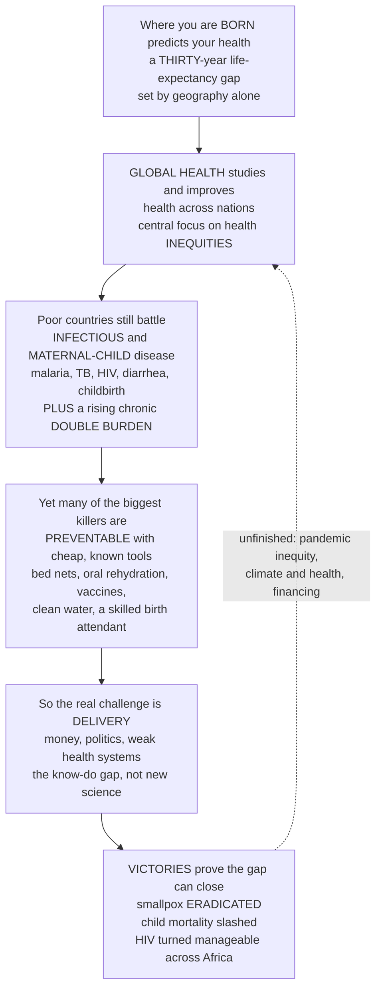

# 🌍 Global Health and International Epidemiology

> [!abstract] TL;DR
> **Where you are born is one of the most powerful predictors of your health and how long you will live** — a child born in one country may expect to live past 80, another in a different country barely past 50, a gap of **thirty years** determined by nothing but the accident of geography. **Global health** is the study, research, and practice of improving health and achieving **equity** in health for *all* people worldwide, with a special focus on these vast **inequities** between rich and poor nations and on transnational threats. The disease landscape differs dramatically: low- and middle-income countries still battle the **infectious diseases and maternal/child deaths** that wealthy countries conquered a century ago — malaria, tuberculosis, HIV, diarrheal and respiratory disease, death in childbirth — while facing a rising **"double burden"** as chronic non-communicable diseases arrive on top. What is striking is that **many of the biggest killers are utterly preventable or treatable with cheap, known tools** — a bed net, oral rehydration salts, a vaccine, clean water, a skilled birth attendant — so global health is often less about scientific mystery than about **delivery, money, and politics**: getting known solutions to the people who need them. It grapples with weak health **systems**, poverty as both cause and consequence of ill health, epidemics that cross borders (a pandemic anywhere threatens everyone), and the fraught role of foreign aid and international institutions (WHO, the World Bank, the Global Fund, Gavi, the Gates Foundation). And it has scored monumental victories — **smallpox eradicated**, child mortality more than halved, HIV turned from a death sentence into a manageable condition across Africa. This note is the **epidemiologic view** of global health; it complements the health-systems view held elsewhere in the vault.

---

## Intuition

**Analogy — the lottery of the delivery-room door.** Imagine two newborns crying in two delivery rooms on the same morning. The first is born in Tokyo or Geneva; barring accident she can expect to see her 84th birthday. The second is born in a rural district of Chad or Lesotho, and the actuarial tables give him barely past 50 — and a frightening chance of not reaching his fifth birthday at all. **Nothing separates these two babies but the door they were carried through.** Same species, same biology, same human potential — a *thirty-year* gap in expected life written by geography alone. Global health is, at its heart, the study of *why that gap exists* and the collective effort to close it.

Now look closer at *what* threatens the second child, and a second surprise appears. He is not dying of some exotic, incurable, high-technology disease. He is at risk from **malaria** (stopped by a $2 bed net), from **diarrhea** (stopped by a sachet of salt and sugar dissolved in water), from **measles and diphtheria** (stopped by vaccines that cost cents), from being born without a **skilled attendant** at the birth, from **dirty water**. The tragedy of global health is that we already *have* the cures. The great killers of the poor are, for the most part, **not scientific mysteries** — they are **delivery failures**. The distance between a child who lives and a child who dies is often not a laboratory breakthrough but a supply chain, a clinic, a trained midwife, a functioning cold chain for vaccines, and the money and political will to make all of that reach the last village. So global health becomes as much a problem of **economics, logistics, and politics** as of biology — a field where a spreadsheet and a road can save more lives than a microscope.

And there is a third layer the analogy must capture: **the two babies are not in separate worlds — they are on the same planet, breathing the same air, connected by the same airplanes.** A new pathogen that spills over in one poor region can be in every capital within days; drug-resistant tuberculosis does not respect passports; a pandemic anywhere is a threat everywhere. So global health is not charity from the healthy to the sick — it is a shared human enterprise, part moral obligation and part enlightened self-interest, to close a gap that is at once one of the great injustices and one of the great solvable problems of our age.

---

## How It Works

### Core Mechanics

**1. Global health defined — equity is the distinguishing word.** *Global health* is the study, research, and practice that places priority on **improving health and achieving equity in health for all people worldwide**. It differs from its predecessors by emphasis, not just geography. **International health** and **tropical medicine** historically meant wealthy-country experts studying the exotic diseases of poor countries — a one-directional, often colonial gaze. Global health reframes the enterprise around **transnational issues** (problems that cross borders, from pandemics to migration to climate) and around **equity** — a deliberate focus on the health of the *disadvantaged*, wherever they live, and on the *fairness* of the distribution of health, not merely its average.

**2. The burden and its inequities — the Preston relationship.** The central empirical fact is the sheer **magnitude of the gap**: life expectancy ranges roughly from the low 50s to the mid-80s across nations, and under-5 mortality can differ *tenfold* or more. Much of this tracks national income along the **Preston curve** — a steeply rising, then flattening, relationship between income per person and life expectancy. Two lessons hide in its shape. First, the curve is **steep at the bottom**: for the poorest countries, small gains in income (and the water, food, and health services it buys) yield *large* gains in survival — the poor have the most to gain. Second, the curve has **shifted upward over time**: countries today live longer at every income level than they did decades ago, because *knowledge and technology* (vaccines, antibiotics, oral rehydration) diffuse independently of income. Health is not purchased by GDP alone — it is delivered.

**3. The epidemiologic profile of low- and middle-income countries.** Where wealthy nations sit deep in the chronic-disease end of the epidemiologic transition, poorer nations still carry a heavy load of:
- **Infectious disease** — led by the "big three" of **HIV/AIDS, tuberculosis, and malaria**, plus **diarrheal** and **lower-respiratory** infections (the great child-killers), and a cluster of **neglected tropical diseases** (schistosomiasis, soil-transmitted helminths, lymphatic filariasis) that disable enormous numbers while rarely making headlines.
- **Maternal and child mortality** — death in pregnancy and childbirth, and the neonatal, infant, and under-5 deaths that dominate the burden of the poorest countries. The counter-interventions are famously cheap and effective: **immunization**, **oral rehydration salts (ORS)** for diarrhea, **skilled birth attendance**, **antenatal care**, **exclusive breastfeeding**, and basic **nutrition**.
- **Under-nutrition** — stunting and micronutrient deficiency that both kill directly and amplify every other disease.
- **The rising "double burden"** — even as infections persist, **non-communicable diseases** (heart disease, diabetes, cancer, driven by a nutrition transition, tobacco, and urban life) surge, so a single stretched health system must fight bed nets *and* blood-pressure clinics at once.

**4. The Global Burden of Disease framework — a common ledger.** To compare a malaria death in a child with years of disability from depression or a stroke in an adult, global health uses the **DALY** (Disability-Adjusted Life Year = years of life lost to early death + years lived with disability). The **Global Burden of Disease** enterprise estimates DALYs, deaths, and risk-factor attribution for every country, age, and sex — the balance sheet that tells the world *where the suffering is* and *where a dollar averts the most of it* (see the burden-of-disease note in this vault's foundations section).

**5. The primacy of delivery, systems, and the "know–do gap."** The defining insight of modern global health is that the bottleneck is usually **not new science but delivery**. Millions die each year from conditions with **existing, cheap, effective interventions** that simply fail to reach them — the **know–do gap**. Closing it depends on **health systems**: the workforce (there is a global shortage of millions of doctors, nurses, and community health workers), supply chains and the vaccine **cold chain**, financing, information systems, and **access**. This is why "strengthen the system" competes with "attack the disease" as a strategy (see below), and why health is so tightly bound to **development**.

**6. Health and poverty — a two-way street.** Poverty and ill health form a vicious cycle: poverty *causes* disease (through malnutrition, unsafe water, poor housing, and lack of care — the **"diseases of poverty"**), and disease *causes* poverty (through lost work, catastrophic health spending, and the drag of a sick workforce on economic growth). The **social determinants of health** operate at global scale here — the same gradient that produces inequity *within* countries produces vast gaps *between* them (see the equity note). Investing in health is therefore also investing in development, and vice versa.

**7. Transnational drivers and global health security.** Trade, migration, and above all **pandemics** make health a border-crossing problem. A pathogen emerging anywhere can reach everywhere within its incubation period; antimicrobial resistance spreads through global food and travel networks; climate change shifts the range of vector-borne disease. **Global health security** — the collective capacity to detect and respond to these shared threats — is thus both a humanitarian and a self-interested imperative (see the pandemics note).

**8. The actors and governance.** Global health is a crowded, contested arena: the **WHO** (the UN's normative and coordinating health agency), the **World Bank** and **UNICEF**, disease-specific financing bodies like the **Global Fund** (HIV, TB, malaria) and **Gavi** (vaccines), giant philanthropies (the **Gates Foundation**), thousands of **NGOs**, and **bilateral aid** programs (e.g. PEPFAR). Global goals have framed the agenda — the **Millennium Development Goals (MDGs, 2000–2015)** and now the **Sustainable Development Goals**, whose **SDG 3** targets health for all. Persistent debates run through the whole field: the **effectiveness of aid**; **vertical** (disease-specific, fast, measurable) versus **horizontal** (systems-strengthening, durable, harder to measure) programs — and the "diagonal" attempts to combine them; **dependency** and the sustainability of donor funding; and a growing movement to **decolonize global health** — to correct the power and funding imbalances by which decisions about poor countries' health have long been made in rich ones.

**9. Triumphs and open challenges.** The victories are real and vast: the **eradication of smallpox** (1980) — the only human disease ever eliminated; the near-eradication of **polio**; a **halving of under-5 mortality** since 1990; and the **scale-up of HIV treatment** (antiretrovirals) that turned AIDS from a death sentence into a chronic condition for millions across sub-Saharan Africa. The open challenges are equally large: **pandemic inequity** (the stark unfairness of vaccine access laid bare by COVID-19), **climate-and-health**, the financing gap, and the unfinished business of the poorest and most fragile settings.

**10. Doing epidemiology in low-resource settings.** A methodological thread runs beneath all of this: much of the world lacks the **vital registration** and **surveillance** systems that produce reliable data. Cause of death is often unknown; **verbal autopsy**, sample registration, demographic surveillance sites, and **modeled estimates** (with wide uncertainty) substitute for censuses. Global health epidemiology is partly the craft of measuring health *well* where the data are *weak* — a caveat that must attach to every global number.

### Flow / Architecture



---

## Key Concepts

### 🟢 Secondary (intuitive foundation)

- **The geography lottery.** Where a baby is born can mean a *thirty-year* difference in how long it lives — the single biggest injustice global health tries to fix.
- **Global health** is the effort to improve health and make it more **fair** for everyone on Earth, focusing on the poorest and on problems that cross borders.
- **Different diseases in different places.** Rich countries mostly fight chronic diseases of old age; poor countries still fight **infections** (malaria, TB, HIV) and deaths of **mothers and babies** — and increasingly *both* at once (the "double burden").
- **We already have the cures.** Bed nets, a sachet of rehydration salts, vaccines, clean water, and a trained midwife could prevent millions of deaths — the problem is **getting them to people**, not inventing them.
- **A shared world.** A disease anywhere can spread everywhere, so helping others is also protecting ourselves.
- **It works.** Smallpox was wiped off the Earth; far fewer children die young than 30 years ago; HIV is now survivable — proof the gap can close.

### 🟡 Undergraduate (mechanisms and formalism)

- **Global vs international vs tropical.** Global health = **equity + transnational focus + multidisciplinary**; international/tropical medicine were narrower, often one-directional predecessors.
- **The Preston curve.** Life expectancy rises steeply with income per capita then **flattens**; the curve is steep at the bottom (the poor gain most) and has **shifted up over time** (technology diffuses independent of income).
- **The "big three"** (HIV/AIDS, tuberculosis, malaria), **diarrheal + lower-respiratory** infections as child-killers, and **neglected tropical diseases** as a disabling, low-visibility cluster.
- **Maternal and child health interventions** — immunization, **ORS**, skilled birth attendance, antenatal care, breastfeeding, nutrition — the cheap, high-yield core of survival gains.
- **The double burden** — persistent infectious/maternal disease *plus* rising NCDs from the nutrition transition, tobacco, and urbanization, straining a single system.
- **DALYs and the Global Burden of Disease** — the common currency (YLL + YLD) and the ledger used to compare and prioritize burden across countries.
- **The know–do gap** and **health systems** — workforce shortages, supply chains, the vaccine **cold chain**, financing, and access as the true bottleneck.
- **Vertical vs horizontal programs** — disease-specific campaigns vs systems-strengthening; the trade-off between speed/measurability and durability.
- **The actors** — WHO, World Bank, UNICEF, the **Global Fund**, **Gavi**, the **Gates Foundation**, NGOs, bilateral aid; the **MDGs → SDGs (SDG 3)** goal framework.

### 🔴 Graduate (subtleties, critique, frontiers)

- **Equity vs equality vs the Preston shift.** Distinguish reducing the *average* burden from reducing the *distribution* of it; interrogate whether within-country inequality (a poor district a full transition-stage behind a rich one in the same nation) is masked by national aggregates (the **ecological trap**).
- **Vertical–horizontal, and "diagonal" approaches.** The empirical and political-economy debate over whether disease-specific financing (PEPFAR, the Global Fund) strengthens or distorts health systems, and whether **diagonal** strategies (using disease programs as a scaffold to build general capacity) resolve it.
- **Aid effectiveness and dependency.** Fungibility of aid, the sustainability and volatility of donor financing, parallel donor systems that fragment ministries, and the transition from donor dependence to domestic financing as countries grow.
- **Decolonizing global health.** Structural critiques of *who sets agendas, who holds the money, whose knowledge counts* — the concentration of funding, authorship, and leadership in the Global North, and movements to shift power, data ownership, and priority-setting to affected countries (see *Reimagining Global Health*, Farmer et al.).
- **Global health security and its governance failures.** The **International Health Regulations**, WHO's authority and its limits, and the political economy of preparedness — vaccine nationalism and the COVID-19 access gap as a case study in how equity and security intertwine.
- **Measurement in weak-data settings.** Verbal autopsy, sample and sentinel surveillance, demographic surveillance sites, small-area estimation, and Bayesian modeled estimates (with explicit uncertainty) — and the epistemics of quoting **modeled** global numbers as if they were counts.
- **Cost-effectiveness and priority-setting.** **Cost per DALY averted** (WHO-CHOICE, *Disease Control Priorities*) as the workhorse of allocation, its equity blind spots, and the *Global Health 2035* "grand convergence" thesis — that a feasible package of investments could bring under-5 and infectious mortality in poor countries down to today's best-performing middle-income levels within a generation.
- **Climate–health and the next frontier.** Shifting vector ranges, heat, food and water security, and displacement as emerging drivers that will reshape the global burden.

---

## Python Demo

```python
# Global Health and International Epidemiology, in two pictures:
#   (a) HEALTH INEQUITY ACROSS NATIONS -- the PRESTON CURVE.
#       Life expectancy vs national income (GDP per capita) across countries:
#       health rises STEEPLY with income at the bottom, then FLATTENS. The gap
#       between the poorest and richest nations is enormous (~30 years), and the
#       steep bottom means the poor have the MOST to gain from modest progress.
#   (b) INTERVENTION IMPACT -- a cheap known tool cutting mortality.
#       Insecticide-treated BED NETS scaled up against malaria: as coverage
#       climbs, malaria deaths fall far below the no-intervention counterfactual.
#       The shaded gap between the curves is DEATHS AVERTED by a simple net.
import numpy as np
import matplotlib.pyplot as plt

rng = np.random.default_rng(42)

# ----------------------------------------------------------------------
# (a) PRESTON CURVE -- life expectancy vs GDP per capita across nations
# ----------------------------------------------------------------------
# ~60 synthetic countries spanning very poor to very rich (log-spaced income).
gdp = np.exp(rng.uniform(np.log(600), np.log(90_000), size=60))   # USD per capita

# Saturating (Preston) relationship: steep rise then a ceiling near ~84 years.
ceiling, floor, k = 84.0, 40.0, 4.0e-4
life_exp = ceiling - (ceiling - floor) * np.exp(-k * gdp)
life_exp += rng.normal(0, 2.2, size=gdp.size)                     # country-level scatter

# A smooth reference curve to draw the underlying relationship.
gdp_grid = np.linspace(gdp.min(), gdp.max(), 400)
le_curve = ceiling - (ceiling - floor) * np.exp(-k * gdp_grid)

poorest = life_exp[np.argmin(gdp)]
richest = life_exp[np.argmax(gdp)]

# ----------------------------------------------------------------------
# (b) BED NETS vs MALARIA -- intervention impact over 2000..2020
# ----------------------------------------------------------------------
years = np.arange(2000, 2021)
# Net coverage scales up logistically from ~2% to ~55% of the at-risk population.
coverage = 0.02 + 0.53 / (1.0 + np.exp(-(years - 2010) / 3.0))
at_risk = 500e6 * (1.0 + 0.012 * (years - 2000))     # slowly growing at-risk pop
baseline_death_rate = 1.6e-3                          # deaths per person-year, no nets
net_efficacy = 0.55                                   # fractional mortality cut at full coverage

deaths_no_nets = baseline_death_rate * at_risk                        # counterfactual
deaths_actual  = baseline_death_rate * at_risk * (1 - net_efficacy * coverage)
averted = deaths_no_nets - deaths_actual

# ----------------------------------------------------------------------
# Plot
# ----------------------------------------------------------------------
fig, (ax1, ax2) = plt.subplots(1, 2, figsize=(15, 6))

# --- (a) Preston curve ---
ax1.scatter(gdp, life_exp, s=45, c=life_exp, cmap="viridis",
            edgecolor="k", linewidth=0.4, zorder=3)
ax1.plot(gdp_grid, le_curve, color="crimson", lw=2.2, zorder=2,
         label="Preston relationship")
ax1.set_xscale("log")
ax1.set_xlabel("GDP per capita (USD, log scale)")
ax1.set_ylabel("Life expectancy at birth (years)")
ax1.set_title("(a) Health inequity across nations: the Preston curve")
ax1.annotate("", xy=(gdp.max(), richest), xytext=(gdp.max(), poorest),
             arrowprops=dict(arrowstyle="<->", color="black", lw=1.6))
ax1.text(gdp.max() * 0.42, (poorest + richest) / 2,
         f"~{richest - poorest:.0f}-year\ngap", fontsize=10, ha="right")
ax1.text(1200, floor + 6, "steep at the bottom:\nthe poor gain the most",
         fontsize=8.5, color="crimson")
ax1.legend(loc="lower right", fontsize=9)
ax1.grid(alpha=0.25, which="both")

# --- (b) bed nets vs malaria ---
ax2.plot(years, deaths_no_nets / 1e3, color="crimson", lw=2.4, ls="--",
         label="Counterfactual: no bed nets")
ax2.plot(years, deaths_actual / 1e3, color="steelblue", lw=2.6,
         label="Actual: with bed-net scale-up")
ax2.fill_between(years, deaths_actual / 1e3, deaths_no_nets / 1e3,
                 color="seagreen", alpha=0.25, label="Deaths averted by nets")
ax2.set_xlabel("Year")
ax2.set_ylabel("Annual malaria deaths (thousands)")
ax2.set_title("(b) Intervention impact: a $2 bed net cuts mortality")
axc = ax2.twinx()
axc.plot(years, coverage * 100, color="darkorange", lw=1.8, alpha=0.8)
axc.set_ylabel("Net coverage (percent of at-risk)", color="darkorange")
axc.set_ylim(0, 100)
ax2.legend(loc="lower left", fontsize=8.5)
ax2.grid(alpha=0.25)

plt.tight_layout()
plt.savefig("global_health_and_international_epidemiology.png", dpi=130,
            bbox_inches="tight")
plt.show()

# ---------------------------------------------------------------- numeric takeaways
print(f"(a) Poorest-nation life expectancy : {poorest:4.1f} years")
print(f"(a) Richest-nation life expectancy : {richest:4.1f} years")
print(f"(a) The geography gap              : {richest - poorest:4.1f} years")
print(f"(b) Malaria deaths 2000 (no nets)  : {deaths_no_nets[0] / 1e3:6.0f}k")
print(f"(b) Malaria deaths 2020 with nets  : {deaths_actual[-1] / 1e3:6.0f}k")
print(f"(b) Cumulative deaths averted      : {averted.sum() / 1e6:5.2f} million (2000-2020)")
```

**What you see.** Panel (a) is the **Preston curve**: each dot is a country, life expectancy plotted against income on a log axis. The relationship is steep among the poorest nations — where a little income (and the clean water, food, and health services it buys) yields large survival gains — then **flattens** into a plateau near the mid-80s, so the very richest nations differ little among themselves. The double-headed arrow marks the roughly **30-year gap** between the poorest and richest countries: the single fact global health exists to explain and to close. Panel (b) makes the field's central claim concrete: as insecticide-treated **bed-net coverage** (orange line) scales from a few percent to over half the at-risk population, actual malaria deaths (blue) peel away from the no-intervention counterfactual (red dashed), and the green wedge between them — **millions of deaths averted** — is bought not by a scientific breakthrough but by delivering a cheap, known tool to the people who need it.

---

## Real-World Applications

- **Smallpox eradication (WHO, 1966–1980).** The template victory: a global, coordinated **surveillance-and-containment** campaign wiped an ancient killer off the Earth — the only human disease ever eradicated — proving that coordinated international action can close the gap.
- **HIV treatment scale-up (PEPFAR, the Global Fund).** Antiretroviral therapy, financed and delivered at scale across sub-Saharan Africa since the mid-2000s, turned HIV from a death sentence into a manageable chronic condition for millions — the largest disease-specific health intervention in history.
- **Malaria control (bed nets, the Global Fund, RBM).** Mass distribution of insecticide-treated nets, indoor spraying, and artemisinin combination therapy cut malaria deaths dramatically after 2000 — the archetypal "cheap tool, huge impact, delivery is everything" story that panel (b) models.
- **Child survival (GOBI, Gavi, ORS).** UNICEF's child-survival revolution (growth monitoring, **oral rehydration**, breastfeeding, immunization) and Gavi's vaccine financing helped **halve under-5 mortality** since 1990 — one of development's greatest successes.
- **Polio eradication (GPEI).** The WHO/Rotary/CDC/UNICEF/Gates initiative has brought wild poliovirus to the brink of eradication, illustrating both the power and the difficulty (conflict, mistrust, the "last mile") of vertical campaigns.
- **The COVID-19 vaccine-equity gap.** COVAX and the stark disparity between rich-country booster campaigns and poor-country first-dose shortages made **global health security and equity** vividly, and tragically, concrete — a reservoir of unvaccinated people is a reservoir for new variants that threaten everyone.
- **Priority-setting tools (Disease Control Priorities, WHO-CHOICE).** Ministries and donors use **cost-per-DALY-averted** analyses to allocate constrained budgets, and the *Global Health 2035* "grand convergence" agenda argues a feasible investment package could bring poor-country mortality down to best-performing-middle-income levels within a generation.

---

## Common Pitfalls

- **Mistaking a delivery problem for a science problem.** The great killers of the poor mostly have known, cheap cures; pouring resources into novel R&D while ignoring supply chains, workforce, and financing repeats the field's oldest error. The bottleneck is usually the **know–do gap**, not the lab.
- **The "parachute" / colonial stance.** Treating poor countries as passive recipients of Northern expertise — designing programs *for* rather than *with* them — undermines sustainability and equity. The **decolonizing-global-health** critique targets exactly this concentration of money, agenda-setting, and authorship.
- **Over-selling vertical campaigns.** Disease-specific programs are fast and measurable but can **fragment** and even weaken the general health system (parallel supply chains, poached staff, distorted priorities). Ignoring the horizontal/systems dimension buys short-term wins at long-term cost.
- **Reading GDP as destiny — or as irrelevant.** The Preston curve shows income matters *and* that the curve shifts up over time as knowledge diffuses. Both "just grow the economy" and "money doesn't matter, only technology" are half-truths; **delivery of known tools** is what moves countries above the curve.
- **Aggregation hides inequity.** National averages mask steep **within-country** gaps (rural vs urban, rich vs poor districts) — the ecological trap. A country "on track" nationally can be leaving whole populations a transition-stage behind.
- **Quoting modeled estimates as counts.** Much of the global burden runs on **modeled** numbers with wide uncertainty, built where vital registration is weak. Citing a point estimate without its interval, or treating it as a census, overstates precision.
- **Aid dependency and volatility.** Programs financed entirely by fickle external donors collapse when priorities shift; sustainability requires a planned transition toward **domestic financing** and country ownership.
- **Forgetting self-interest and solidarity are aligned.** Framing global health as pure charity misses that pandemics, resistance, and instability cross borders — under-investing in others' health is, ultimately, under-investing in one's own security.

---

## Related Concepts

This note anchors the **global** leg of the vault's frontier section and takes the **epidemiologic view** of global health. It builds directly on foundations laid earlier: *The Epidemiologic Transition and Burden of Disease* supplies the DALY currency and the double-burden framing that this note applies across countries; *Social Determinants and Health Equity* provides the equity lens that, scaled up, becomes the between-country gap at the center of global health; *Pandemics and Emerging Infections* is the transnational-threat and global-health-security counterpart; *Health Policy and Economics of Public Health* supplies the cost-per-DALY priority-setting and aid-financing machinery; and *Chronic Disease and Lifestyle Epidemiology* is the non-communicable half of the double burden now surging in poorer nations. (These siblings are referenced in prose; the wikilinks below point only to Glob-verified notes elsewhere in the vault.)

Across the vault:

- [[Health_Nutrition_and_Longevity/06_Public_Health_and_Prevention/Global_Health_and_Health_Systems|Global Health and Health Systems]] — the **health-systems view** of global health that this epidemiologic note complements; delivery, financing, and system-strengthening in depth.
- [[Health_Nutrition_and_Longevity/06_Public_Health_and_Prevention/Infectious_Disease_Vaccines_and_Immunity|Infectious Disease, Vaccines and Immunity]] — the immunity and vaccine science behind the cheap tools (immunization, the cold chain) that drive child-survival gains.
- [[Macroeconomics/02_Economic_Growth/Development_Economics|Development Economics]] — the two-way link between poverty and health, the Preston curve, and health as both cause and consequence of development.
- [[Sociology/02_Social_Stratification_and_Inequality/Global_Inequality_and_Development|Global Inequality and Development]] — the structural North–South inequalities that produce the between-country health gap and shape the politics of aid.
- [[Political_Science/03_International_Relations/International_Institutions_and_Multilateralism|International Institutions and Multilateralism]] — the WHO, World Bank, and multilateral governance through which global health is coordinated, funded, and contested.

---

## Review Questions

**🟢 Secondary**
1. Using the "delivery-room door" idea, explain what is meant by a *thirty-year* gap in life expectancy, and name two cheap tools that could save a child born on the wrong side of that gap.
2. Why is it often said that global health is "less about scientific mystery than about delivery, money, and politics"? Give an example.
3. Name one monumental victory of global health and explain in one sentence why it matters.

**🟡 Undergraduate**
4. Describe the **Preston curve**. What do its steep bottom and flat top each tell us, and why does the curve rise over time even at the same income level?
5. What is the **"double burden"** of disease, and why do middle-income countries face it more acutely than either the poorest or the richest nations?
6. Contrast **vertical** and **horizontal** health programs. Give one advantage and one risk of each, and explain what a "diagonal" approach tries to achieve.

**🔴 Graduate**
7. A donor must choose between funding a disease-specific antiretroviral program and a general primary-care system-strengthening program in the same low-income country. Lay out the equity, effectiveness, sustainability, and dependency considerations on each side, and justify a recommendation.
8. The COVID-19 vaccine rollout exposed a stark equity gap between rich and poor countries. Analyze this as *both* a moral failure *and* a global-health-security failure, and explain how the two framings lead to different (and overlapping) policy prescriptions.
9. Critique the reliance on **cost-per-DALY-averted** as a priority-setting tool in global health. What does it capture well, what equity and distributional concerns does it miss, and how might the "grand convergence" agenda of *Global Health 2035* address or aggravate them?

---

## Sources

- Skolnik, R. (2021). *Global Health 101* (4th ed.). Jones & Bartlett Learning — the standard introductory text on burden, systems, and priorities.
- Jamison, D. T., Summers, L. H., Alleyne, G., et al. (2013). "Global health 2035: a world converging within a generation." *The Lancet*, 382(9908), 1898–1955. (See also the *Disease Control Priorities* project, 3rd ed.)
- Farmer, P., Kim, J. Y., Kleinman, A., & Basilico, M. (Eds.) (2013). *Reimagining Global Health: An Introduction*. University of California Press.
- Preston, S. H. (1975). "The changing relation between mortality and level of economic development." *Population Studies*, 29(2), 231–248.
- World Health Organization. *World Health Statistics* (annual) and *SDG 3 monitoring* — [who.int/data](https://www.who.int/data) and the WHO *Global Health Observatory*.

---

#epidemiology #global-health #health-equity #disease-burden #international-health
