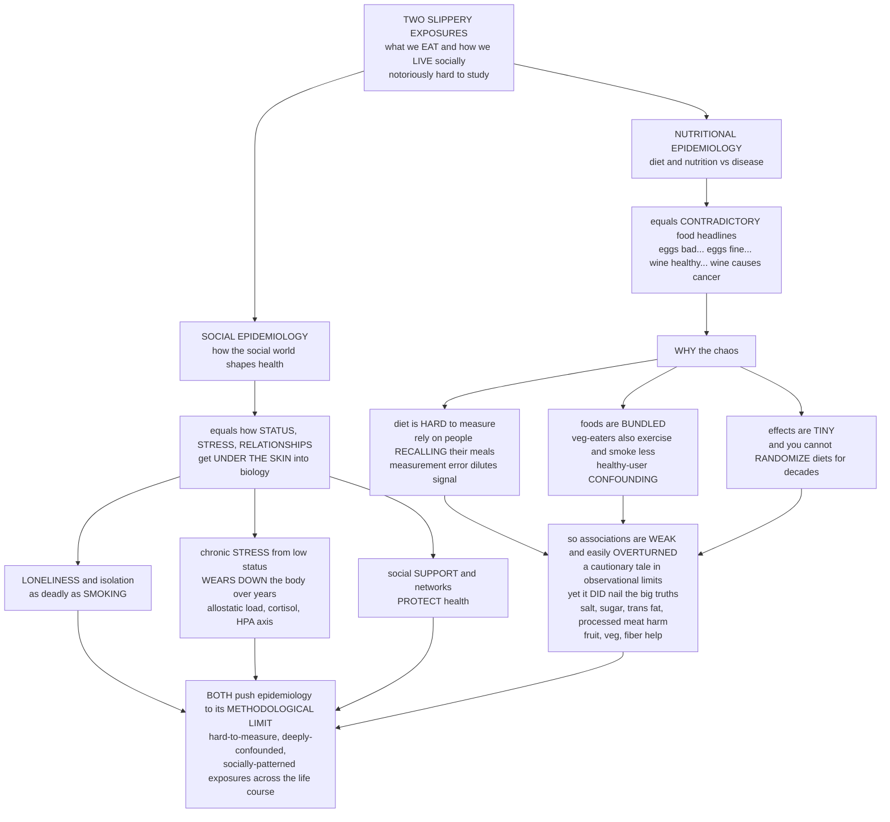

# 🍎 Nutritional and Social Epidemiology

> [!abstract] TL;DR
> Two specialized branches of epidemiology tackle the exposures that are hardest to pin down: **what we eat** and **how we live socially**. **Nutritional epidemiology** is why the news is a churn of contradictory food headlines — *eggs are deadly! eggs are fine! wine is heart-healthy! wine causes cancer!* The chaos is not incompetence; it is baked into the problem. Diet is measured by asking people to **remember and honestly report** what they ate (notoriously inaccurate), foods travel in **bundles** (people who eat more vegetables also exercise more and smoke less — confounding everywhere), effect sizes are **tiny**, and you can almost never **randomize** people's diets for the decades a chronic disease takes to appear. So diet–disease associations tend to be **weak, confounded, and easily overturned** — a cautionary tale about the limits of observational epidemiology, even though the field *did* establish the big, robust truths (too much salt, sugar, and processed meat harm; fruit, vegetables, and fiber help). **Social epidemiology** studies how the social world — status, stress, relationships, discrimination, community — gets **"under the skin"** to shape biology and health. Its striking findings: **loneliness and social isolation are as deadly as smoking**; chronic **stress from low social status literally wears down the body** (allostatic load); strong social networks and support **protect** health. Together the two fields push epidemiology to its methodological limit — studying elusive, deeply-confounded, socially-patterned exposures — while revealing that diet and the social environment are among the most powerful, and most underappreciated, determinants of health. *Educational content, not individual medical or dietary advice.*

---

## Intuition

**Analogy — two of the slipperiest fish in the epidemiological sea.** Imagine you are a detective trying to convict two suspects, but every witness is unreliable and every clue is tangled with a dozen others. That is what it is like to study **diet** and the **social world** as causes of disease — and it explains two things you have surely noticed about health news.

First, why does the science of food **flip-flop** so much? Picture trying to prove that eating eggs harms your heart. You cannot follow ten thousand people around the kitchen for thirty years, so you hand them a questionnaire and ask them to *remember* how many eggs they ate last year — a memory most people cannot reconstruct for last *week*. That fuzzy recall smears the real signal into noise. Worse, the egg-eaters differ from the egg-avoiders in a hundred *other* ways — they may exercise less, smoke more, eat more bacon alongside — so any "egg effect" you see is hopelessly **bundled** with the effects of everything egg-eaters happen to do. And the true effect of one food, if it exists at all, is *minuscule*. Fuzzy measurement + tangled bundles + tiny signal + no ability to run the clean experiment = **weak, contradictory findings that overturn every few years**. Nutritional epidemiology is thus a live demonstration of how badly observational study strains when the exposure is hard to measure and deeply confounded — even as it *did* nail the robust conclusions everyone agrees on.

Second, why would being **lonely** be as dangerous as **smoking**? Here the exposure is not a nutrient but your **place in the social web** — your status, your relationships, the chronic stress of scraping by at the bottom of a hierarchy. Social epidemiology's astonishing discovery is that these intangible social conditions get **"under the skin"**: chronic stress floods the body with cortisol and, year after year, physically **wears it down** (a process called *allostatic load*), so that low social status shortens life through biology, not just bad luck. Its landmark findings — **isolation and loneliness carrying a mortality risk comparable to smoking**, and **social support acting as a genuine protective factor** — reveal that we are profoundly social creatures whose health is shaped by the community around us. Both fields stare down the same methodological monster (elusive, confounded, socially-patterned exposures) and both deliver the same humbling lesson: the determinants of health that matter most are often the ones hardest to measure.

---

## How It Works

### Core Mechanics

**1. Nutritional epidemiology: measuring the unmeasurable meal.** The field studies how **diet and nutrition** relate to disease across populations, and it lives or dies by **dietary assessment** — none of which is good. *Food-frequency questionnaires (FFQs)* ask how often you ate each food over months or years (cheap, scalable, but crude and memory-dependent). *24-hour recalls* ask about yesterday (more accurate for a day, but one day poorly represents a habit). *Food diaries* record intake in real time (better, but burdensome and behavior-changing). *Biomarkers* (blood, urine, adipose measures of nutrients) sidestep memory but exist for only a few nutrients and can themselves reflect metabolism, not intake. Analysis then happens at three levels: single **nutrients** (vitamin C), whole **foods** (oranges), or **dietary patterns** (a Mediterranean diet) — the last being the most robust because people eat *patterns*, not isolated molecules.

**2. Why nutritional findings flip-flop — four compounding weaknesses.** (i) **Measurement error.** Self-reported intake is riddled with recall and reporting bias and day-to-day variation. When this error is **non-differential** (unrelated to disease status), it produces *regression dilution* — it drags associations **toward the null**, hiding real effects; when it is **differential** (sick people recall differently — *recall bias*), it can distort effects in either direction. (ii) **Pervasive confounding.** Diet correlates with socioeconomic status, exercise, smoking, and overall health-consciousness — the **"healthy-user" effect** — so a food that merely *travels with* a healthy lifestyle inherits an undeserved health halo. (iii) **Small effect sizes.** True single-food effects on chronic disease are tiny, so they are easily swamped by the residual bias that measurement error and confounding leave behind. (iv) **No long-term randomization.** You cannot ethically or practically randomize people's *whole diets* for the decades chronic disease requires, so the gold-standard experiment is off the table. Stack these four and you get **fragile associations that reverse** with the next study — and the sensational contradictory headlines (the target of John **Ioannidis's** critiques of implausible nutrition claims).

**3. What nutritional epidemiology got *right*.** The failures are real, but so are the successes — precisely where effects are *large* and confounding cannot explain them: **scurvy and deficiency diseases** (vitamin C, thiamine, iodine, folate); the harms of **trans fats**, excess **salt** (blood pressure), **sugar-sweetened beverages**, and **processed/red meat**; the benefits of **fruit, vegetables, and fiber**; and the broad **diet–heart** story. The lesson is calibration, not nihilism: trust **triangulation** across study designs, and lean on **Mendelian randomization** (using genetic variants as unconfounded natural "randomizers" of intake — a bridge to genetic epidemiology) when observation alone cannot decide.

**4. Social epidemiology: how the social world gets under the skin.** This branch studies how **social factors and structures distribute health and disease** — and by what biological pathways they become embodied. Building on the *social determinants* and the *social gradient* (health improves stepwise up the status ladder), it examines: **psychosocial mechanisms** — chronic **stress** and **allostatic load**, the cumulative biological wear of repeatedly firing the HPA-axis/cortisol stress response, which is the mechanism of *biological embedding* of adversity (documented in the **Whitehall** studies of British civil servants, where lower rank meant more stress and worse health despite universal healthcare); **social relationships** — social support, network structure, and **isolation/loneliness** as a mortality risk factor comparable to smoking (Berkman & Syme's Alameda County cohort; Holt-Lunstad's meta-analysis); **social capital and cohesion**; **discrimination and racism** as chronic health exposures; **work stress**; and **neighborhood/place effects** (studied with *multilevel* models that separate individual from contextual causes).

**5. The shared theme, and the shared hazard.** Both fields chase exposures that are **hard to measure, deeply confounded, and socially patterned**, often across a **life course** (early-life and cumulative exposures shaping adult disease). Diet is confounded by the social gradient; social conditions are confounded by diet and behavior; and both are entangled with everything else about how people live. This is exactly why they sit on the **methodological frontier** — and why reading their evidence *critically* is a core epidemiological skill.

### Flow / Architecture



*Read the two spines as the two branches: nutritional epidemiology (left) collapses under measurement error, confounding, tiny effects, and un-randomizability into fragile, flip-flopping findings — yet still established the robust dietary truths; social epidemiology (right) traces how status, stress, and relationships become embodied biology. Both converge on the same frontier: the exposures that matter most are the ones hardest to study cleanly.*

---

## Key Concepts

### Secondary (intuitive foundation)
- **Nutritional epidemiology = the science behind confusing food news.** It studies whether what you eat makes you sick or well. The reason it keeps changing its mind is that measuring diet is genuinely hard.
- **Why diet studies flip-flop.** You have to *ask* people what they ate and hope they remember and tell the truth (they often don't), healthy foods come packaged with healthy *habits* (so it's hard to tell which helped), the effect of any one food is tiny, and you can't lock people into a diet for thirty years to run a fair test.
- **What it still got right.** Despite the chaos, the big lessons are solid: too much salt, sugar, and processed meat is bad; fruit, vegetables, and fiber are good.
- **Social epidemiology = your social life is a health factor.** It studies how your status, stress, friendships, and community affect your body. Being cut off from people is genuinely dangerous.
- **The headline finding.** Loneliness and isolation can be **as deadly as smoking**, and constant stress from being at the bottom of the pecking order slowly wears your body out. Good relationships protect you.

### Undergraduate (formal definitions)
- **Dietary assessment methods, ranked by trade-off.** *FFQ* (broad habits, cheap, crude), *24-hour recall* (one accurate day, poor for habits), *food diary* (real-time, burdensome), *biomarkers* (objective but limited to few nutrients). Nutrient vs food vs **dietary-pattern** analysis, with patterns generally the most robust.
- **Non-differential vs differential measurement error.** *Non-differential* misclassification (error unrelated to outcome) biases associations **toward the null** via **regression dilution** — real effects look weaker or absent. *Differential* error (e.g., **recall bias**, where cases remember diet differently) can bias in *either* direction and can *manufacture* associations.
- **The healthy-user (healthy-adherer) effect.** A specific confounding pattern: people who adopt a "healthy" food or supplement also adopt many other health-protective behaviors, giving the food a spurious protective association that shrinks or vanishes on adjustment.
- **The social gradient and Whitehall.** Health improves in a *stepwise gradient* up the socioeconomic ladder — not just poor-vs-rich, but each rung above the last. The Whitehall studies showed this among employed civil servants, implicating **status-linked chronic stress**, not just poverty or access.
- **Allostatic load.** The cumulative "wear and tear" on the body from chronic activation of stress-response systems (HPA axis, cortisol, sympathetic nervous system, cardiovascular and metabolic strain). The proposed biological mechanism by which social adversity becomes disease — *biological embedding*.
- **Social relationships and mortality.** Berkman & Syme (Alameda County) and Holt-Lunstad et al. (meta-analysis) established that weak social ties predict higher mortality, with an effect size **comparable to smoking** and larger than obesity or physical inactivity.

### Graduate (analysis, bias, and design nuance)
- **Regression dilution / attenuation formally.** Under classical measurement error, the estimated exposure–outcome slope is the true slope times the **reliability ratio** `λ = var(X_true) / (var(X_true) + var(error))`. As dietary error grows, `λ → 0` and the estimate collapses toward the null — quantifiable and correctable by **regression calibration** if a validation sub-study measures the true intake in a subsample.
- **Why nutritional confounding is nearly irreducible.** Dietary components are **collinear** (fiber, fruit, vegetables, and whole grains move together), so isolating one nutrient's effect requires adjusting for its correlates — which also removes shared signal and inflates variance. Combined with residual confounding by unmeasured lifestyle, this leaves point estimates unstable and design-dependent, producing the **flip-flop** across studies. The remedies are **triangulation** (do designs with *different* biases agree?) and **Mendelian randomization**, which uses germline genetic variants as instruments to estimate lifelong intake effects free of reverse causation and behavioral confounding.
- **The Ioannidis critique, precisely.** Many nutritional associations imply implausibly large hazard changes from single foods that, when aggregated, exceed all plausible mortality — a signature of residual confounding and selective reporting rather than causation. The corrective is skepticism toward small relative risks (roughly RR < 1.5) from single observational nutrition studies, and reliance on effect sizes that survive triangulation.
- **Psychosocial pathways and their measurement.** Allostatic load is operationalized as a **composite index** of biomarkers (cortisol, catecholamines, blood pressure, waist–hip ratio, HbA1c, inflammatory markers such as CRP/IL-6, lipids). Social exposure is captured via **social network indices**, perceived support scales, and objective isolation measures — each with its own validity and confounding concerns, and each entangled with SES and health behavior.
- **Multilevel and life-course design.** Neighborhood and contextual effects require **multilevel (hierarchical) models** to separate compositional (who lives there) from contextual (the place itself) causes, guarding against the **ecological fallacy**. **Life-course epidemiology** models *critical/sensitive periods*, *accumulation of risk*, and *chains of risk*, since both diet and social adversity act cumulatively from early life — making cross-sectional snapshots badly confounded by time.
- **Discrimination and racism as exposures.** Modern social epidemiology treats structural and interpersonal racism as chronic stressors and structural determinants (e.g., the *weathering hypothesis*), demanding measures of exposure that are themselves socially patterned and hard to disentangle from SES — the confounding problem in its most consequential form.

---

## Python Demo

```python
# Nutritional & social epidemiology in four pictures.
#   NUTRITIONAL (why findings are fragile):
#     (a) MEASUREMENT ERROR / regression dilution -- a REAL diet effect is dragged
#         toward the NULL as self-reported intake gets noisier (recall error).
#     (b) HEALTHY-USER CONFOUNDING -- a food correlated with a healthy lifestyle looks
#         protective, but the "benefit" collapses once you adjust for lifestyle.
#   SOCIAL (why the social world matters):
#     (c) ISOLATION vs SMOKING -- lacking social ties carries a mortality risk
#         comparable to smoking (proportional-hazards survival curves).
#     (d) ALLOSTATIC LOAD -- chronic social stress "under the skin" accumulates
#         physiological wear that crosses a disease threshold YEARS earlier.
import numpy as np
import matplotlib.pyplot as plt

rng = np.random.default_rng(1988)   # year Willett's "Nutritional Epidemiology" appeared
fig, axes = plt.subplots(2, 2, figsize=(14, 10))

# ===== (a) NUTRITIONAL: recall error dilutes a REAL diet effect toward the null ======
axA = axes[0, 0]
n = 40_000
var_true = 1.0
X_true = rng.normal(0, np.sqrt(var_true), n)      # standardized TRUE intake (e.g. fiber)
beta_true = 0.80                                  # the REAL diet -> outcome effect
Y = beta_true * X_true + rng.normal(0, 1.0, n)    # a continuous health outcome

err_sd = np.linspace(0, 2.5, 40)                  # worsening dietary self-report error
est_beta = []
for s in err_sd:
    X_obs = X_true + rng.normal(0, s, n)          # what the questionnaire records
    est_beta.append(np.cov(X_obs, Y)[0, 1] / np.var(X_obs))
est_beta = np.array(est_beta)
reliability = var_true / (var_true + err_sd**2)   # attenuation (reliability) ratio
theory = beta_true * reliability

axA.plot(err_sd, est_beta, "o", ms=4, color="#2980B9", alpha=0.7, label="estimated effect")
axA.plot(err_sd, theory, "-", color="#C0392B", lw=2, label="theory: beta x reliability")
axA.axhline(beta_true, ls="--", color="#27AE60", lw=1.5, label="TRUE effect = 0.80")
axA.axhline(0, ls=":", color="gray", lw=1.5, label="null (no effect)")
axA.set_title("(a) NUTRITIONAL: recall error dilutes a REAL effect toward null")
axA.set_xlabel("Dietary self-report error, SD  -- worse recall ->")
axA.set_ylabel("Estimated diet-disease effect")
axA.legend(fontsize=8); axA.grid(alpha=0.3)

# ===== (b) NUTRITIONAL: healthy-user confounding fakes a protective food =============
axB = axes[0, 1]
m = 200_000
Z = rng.normal(0, 1, m)                                    # healthy-lifestyle index
p_food = 1 / (1 + np.exp(-(1.3 * Z)))                      # healthier -> eats the food
food = (rng.random(m) < p_food).astype(int)
# disease depends ONLY on lifestyle Z; the food itself has ZERO true effect
p_dis = 1 / (1 + np.exp(-(-1.5 - 1.6 * Z + 0.0 * food)))
dis = (rng.random(m) < p_dis).astype(int)

def rr(e, y):
    return np.mean(y[e == 1]) / np.mean(y[e == 0])

crude = rr(food, dis)                                       # looks protective (< 1)
# stratified (Mantel-Haenszel-style) risk ratio across quintiles of the lifestyle index
qs = np.quantile(Z, np.linspace(0, 1, 6))
num = den = 0.0
for i in range(5):
    msk = (Z >= qs[i]) & (Z <= qs[i + 1])
    e, y = food[msk], dis[msk]
    a = np.sum((e == 1) & (y == 1)); b = np.sum((e == 1) & (y == 0))
    c = np.sum((e == 0) & (y == 1)); d = np.sum((e == 0) & (y == 0)); N = a + b + c + d
    num += a * (c + d) / N
    den += c * (a + b) / N
adj = num / den                                            # collapses to ~1

axB.bar(["Crude\n(looks protective)", "Adjusted for\nlifestyle"], [crude, adj],
        color=["#C0392B", "#27AE60"])
axB.axhline(1.0, ls="--", color="gray", lw=1.5, label="RR = 1 (no real effect)")
for i, v in enumerate([crude, adj]):
    axB.text(i, v + 0.02, f"{v:.2f}", ha="center", fontsize=11)
axB.set_title("(b) NUTRITIONAL: healthy-user confounding\napparent benefit vanishes after adjustment")
axB.set_ylabel("Disease risk ratio (food vs none)")
axB.set_ylim(0, 1.2)
axB.legend(fontsize=8); axB.grid(axis="y", alpha=0.3)

# ===== (c) SOCIAL: isolation as deadly as smoking ===================================
axC = axes[1, 0]
yrs = np.arange(0, 21)
h0 = 0.020                                    # baseline annual hazard (well-connected)
for label, hr, col in [("Well-connected (ref)", 1.00, "#27AE60"),
                       ("Socially isolated", 1.50, "#C0392B"),
                       ("Smoker", 1.60, "#7F8C8D")]:
    S = np.exp(-h0 * hr * yrs)
    axC.plot(yrs, 100 * S, lw=2.4, color=col, label=f"{label}  HR = {hr:.2f}")
axC.set_title("(c) SOCIAL: isolation rivals smoking as a mortality risk")
axC.set_xlabel("Years of follow-up")
axC.set_ylabel("Percent surviving")
axC.legend(fontsize=8); axC.grid(alpha=0.3)

# ===== (d) SOCIAL: chronic stress "under the skin" (allostatic load) =================
axD = axes[1, 1]
age = np.arange(20, 81)
load_low  = 1.0 + 0.050 * (age - 20)                          # high status, gentle wear
load_high = 1.0 + 0.055 * (age - 20) + 0.0011 * (age - 20)**2 # low status, accelerating
threshold = 4.0
axD.plot(age, load_low,  lw=2.4, color="#27AE60", label="High social status (low stress)")
axD.plot(age, load_high, lw=2.4, color="#C0392B", label="Low social status (chronic stress)")
axD.axhline(threshold, ls="--", color="gray", lw=1.5, label="disease threshold")
for arr, col in [(load_low, "#27AE60"), (load_high, "#C0392B")]:
    idx = int(np.argmax(arr >= threshold))
    if arr[idx] >= threshold:
        axD.scatter([age[idx]], [threshold], color=col, zorder=5, s=60)
        axD.annotate(f"crosses at age {age[idx]}", (age[idx], threshold),
                     textcoords="offset points", xytext=(0, -18), ha="center",
                     fontsize=8, color=col)
axD.set_title("(d) SOCIAL: chronic stress wears the body sooner\nallostatic load crosses disease threshold earlier")
axD.set_xlabel("Age (years)")
axD.set_ylabel("Cumulative allostatic load (physiological wear)")
axD.legend(fontsize=8); axD.grid(alpha=0.3)

plt.tight_layout()
plt.savefig("nutritional_and_social_epidemiology.png", dpi=120, bbox_inches="tight")

# ----- printed summary --------------------------------------------------------------
print("=== NUTRITIONAL epidemiology (why findings are fragile) ===")
print(f"(a) recall error drags the true 0.80 effect toward 0 as reporting worsens.")
print(f"(b) food risk ratio: crude {crude:.2f} (looks protective) -> adjusted {adj:.2f} (no real effect).")
print("=== SOCIAL epidemiology (why the social world matters) ===")
print("(c) isolation HR 1.50 vs smoking HR 1.60 -- comparable mortality risk.")
print("(d) chronic social stress crosses the disease threshold years earlier than high status.")
```

**What you see.** Panel **(a)** is the engine of the flip-flop: a genuine diet effect of 0.80 is dragged steadily **toward zero** as the dietary questionnaire gets noisier — the estimated effect tracks the theoretical `beta × reliability` curve exactly. With realistic recall error a real, moderate effect can look like *nothing*, which is why single studies disagree. Panel **(b)** is the healthy-user trap: a food that has **no true effect** looks strongly **protective** (crude RR well below 1) purely because the people who eat it live healthier lives — and the "benefit" **collapses to ~1** once you compare like with like within lifestyle strata. Together (a) and (b) explain why nutritional headlines whipsaw. Panel **(c)** flips to social epidemiology's signature result: under proportional hazards, **social isolation (HR ~1.5)** bends the survival curve nearly as far down as **smoking (HR ~1.6)** — being disconnected is a mortality risk on the same scale as a cigarette habit. Panel **(d)** shows the *mechanism*: chronic stress from low social status accumulates **allostatic load** that crosses a disease threshold **years earlier** than the gentle wear of high status — the social world literally getting under the skin.

---

## Real-World Applications

- **The egg / dietary-cholesterol reversal — the flip-flop in miniature.** For decades dietary cholesterol (eggs) was condemned as a heart-disease driver; large cohorts and trials later found little effect for most people, and the 2015 U.S. Dietary Guidelines dropped the cholesterol cap. The whiplash is the archetype: a small true effect, measured by recall, confounded by everything else egg-eaters do, and never cleanly randomized. It is *the* teaching case for reading single nutrition studies skeptically.
- **The "moderate drinking is heart-healthy" saga.** Observational studies long showed a J-shaped curve where light drinkers outlived abstainers — a finding heavily undermined by the **"sick-quitter"** confounder (many abstainers had *quit* because they were already ill) and healthy-user effects. Mendelian-randomization and re-analyses now point toward no safe cardiac-protective dose, and alcohol as a carcinogen. A confounding-and-reverse-causation cautionary tale that shifted global guidance.
- **The Whitehall studies — status under the skin.** Following British civil servants, Marmot and colleagues found a **stepwise social gradient** in mortality: each rung down the employment hierarchy carried higher risk, even though all had jobs and healthcare. Because access could not explain it, the finding put **status-linked chronic stress** at the center of social epidemiology and reframed inequality as a biological, not merely economic, exposure.
- **Loneliness as a public-health emergency.** Holt-Lunstad's meta-analyses quantified weak social relationships as a mortality risk **comparable to smoking 15 cigarettes a day** and greater than obesity — evidence that drove the UK to appoint a Minister for Loneliness (2018) and the U.S. Surgeon General to issue a 2023 advisory on the "epidemic of loneliness." A social-epidemiology finding translated directly into national policy.
- **The Roseto effect and social cohesion.** The tight-knit Italian-American town of Roseto, Pennsylvania, had strikingly low heart-disease mortality despite conventional risk factors — attributed to dense social ties and cohesion — and mortality *rose* as the community "Americanized" and fragmented across generations. A natural experiment in **social capital** as a protective health exposure.
- **Weathering and racial health inequities.** Geronimus's *weathering hypothesis* uses social-epidemiological methods to show that the chronic stress of racism and disadvantage accelerates biological aging (via allostatic load), helping explain persistent Black–White gaps in maternal and cardiovascular outcomes that income alone does not. Discrimination treated as a measurable, embodied exposure.

---

## Common Pitfalls

- **Trusting a single observational nutrition study.** One cohort reporting that a food raises or lowers a disease by 20–30% is weak evidence: with recall-based intake, healthy-user confounding, and tiny true effects, such results routinely reverse. Wait for **triangulation** across designs (and ideally Mendelian randomization) before believing a small relative risk.
- **Forgetting that measurement error usually hides real effects.** People assume noisy diet data *inflates* findings; classically, non-differential error does the opposite — **regression dilution toward the null**. A "no effect" result may be a real effect erased by bad measurement, which is why validation sub-studies and calibration matter.
- **Missing the healthy-user (and sick-quitter) confounder.** Any food, supplement, or behavior adopted by the health-conscious inherits a spurious health halo; any group of "abstainers" may be contaminated by people who quit *because* they were sick. Both fabricate associations that adjustment or better design dissolves.
- **Adjusting away the social exposure.** In social epidemiology, "controlling for" income, education, and behavior can *over-adjust* — those variables may be **mediators** on the pathway from social position to disease, not confounders. Blindly adjusting for them makes the social gradient vanish and hides the very effect you are studying.
- **Committing the ecological fallacy.** Neighborhood or country-level correlations (poorer areas have more disease) do not license individual causal claims. Contextual (place) and compositional (people) effects must be separated with **multilevel** analysis, not inferred from aggregate data.
- **Treating "social" causes as soft or unmeasurable.** Isolation, status, and discrimination have effect sizes rivaling classic biomedical risk factors and concrete biological mechanisms (cortisol, inflammation, allostatic load). Dismissing them as intangible ignores some of the strongest and most policy-relevant findings in epidemiology.

---

## Related Concepts

This note sits on the **Chronic, Global and Frontier Epidemiology** frontier of the vault, reached from the hub, the [[Epidemiology_and_Public_Health/01_Foundations_of_Epidemiology/Epidemiology_and_Public_Health_Overview|Epidemiology and Public Health Overview]]. It is best read against its section siblings (referenced in prose as the section fills in): *Chronic_Disease_and_Lifestyle_Epidemiology* supplies the multifactorial, long-latency chronic-disease context in which diet and social conditions act; *Social_Determinants_and_Health_Equity* is the upstream companion to the social branch here — the structural forces (income, education, place, policy) whose downstream psychosocial and behavioral pathways this note traces "under the skin"; *Confounding_and_Effect_Modification* is the analytic core these fields lean on hardest, since the healthy-user effect is confounding in its most stubborn form; *Bias_Selection_and_Information* is the home of the measurement-error and recall-bias machinery that dilutes and distorts dietary findings; and *Genetic_and_Molecular_Epidemiology* provides **Mendelian randomization**, the design that rescues diet–disease inference from confounding by using genes as natural randomizers.

**Across the vault (Glob-verified links).**

- [[Health_Nutrition_and_Longevity/02_Nutrition_Science/Nutrition_Myths_and_Evidence|Nutrition Myths and Evidence]] — the applied counterpart: how flip-flopping nutritional-epidemiology findings become the diet myths and hierarchy-of-evidence lessons a health-literate reader must navigate.
- [[Health_Nutrition_and_Longevity/04_Sleep_Stress_and_Mental_Wellbeing/Social_Connection_and_Health|Social Connection and Health]] — the physiology and everyday reality behind social epidemiology's central finding that isolation kills and connection protects.
- [[Health_Nutrition_and_Longevity/04_Sleep_Stress_and_Mental_Wellbeing/Stress_and_the_Stress_Response|Stress and the Stress Response]] — the HPA-axis / cortisol biology of the chronic-stress pathway that underlies allostatic load and the biological embedding of social adversity.
- [[Sociology/06_Applied_and_Contemporary_Sociology/Health_Inequality_and_Medical_Sociology|Health Inequality and Medical Sociology]] — the sociological theory of the social gradient, medicalization, and structural inequality that social epidemiology operationalizes into measurable exposures.
- [[Psychology/05_Motivation_and_Emotion/Stress_and_Coping|Stress and Coping]] — the psychological models of stress appraisal, coping, and social support that connect subjective social experience to the physiological wear this note quantifies.
- [[Clinical_Medicine/03_Metabolic_Endocrine_and_Renal/Nutritional_and_Metabolic_Disorders|Nutritional and Metabolic Disorders]] — the clinical end of the diet story: the deficiency diseases and diet-driven metabolic conditions that are nutritional epidemiology's clearest, least-contested successes.

---

## Review Questions

1. **(Secondary)** Explain to a friend why the news keeps changing its mind about whether eggs, wine, or coffee are good or bad for you. Give at least two reasons that make diet so hard to study, and then explain why "loneliness is as dangerous as smoking" is *not* the same kind of shaky finding — what makes the social result more solid?
2. **(Undergraduate)** A cohort study reports that people who eat a certain "superfood" have 30% lower heart-disease risk. Name the specific confounder most likely inflating this benefit and explain the "healthy-user effect." Separately, a different study finds *no* association between fiber intake and colon cancer despite good biological reasons to expect one — explain how **non-differential measurement error** in the food-frequency questionnaire could have produced this null through regression dilution. What kind of study would you trust more, and why?
3. **(Graduate)** You are asked to estimate the causal effect of the Mediterranean diet on cardiovascular mortality, and separately the effect of the social gradient on the same outcome. For the diet, explain why standard multivariable adjustment is inadequate and how **Mendelian randomization** and **triangulation** address the confounding and reverse-causation problems. For the social gradient, explain why adjusting for income, behavior, and access can constitute **over-adjustment** (mediators, not confounders), how **allostatic load** and **multilevel** models help identify the mechanism and level of causation, and why life-course structure matters. What does the contrast reveal about the shared methodological frontier these two fields occupy?

---

## Sources

- Willett, W. (2013). *Nutritional Epidemiology* (3rd ed.). Oxford University Press — the standard text on dietary assessment, measurement error, and diet–disease study design.
- Berkman, L. F., Kawachi, I., & Glymour, M. M. (Eds.). (2014). *Social Epidemiology* (2nd ed.). Oxford University Press — the definitive account of social determinants, psychosocial pathways, and allostatic load.
- Ioannidis, J. P. A. (2013). "Implausible results in human nutrition research." *BMJ*, 347, f6698. [https://doi.org/10.1136/bmj.f6698](https://doi.org/10.1136/bmj.f6698)
- Holt-Lunstad, J., Smith, T. B., & Layton, J. B. (2010). "Social relationships and mortality risk: a meta-analytic review." *PLoS Medicine*, 7(7), e1000316. [https://doi.org/10.1371/journal.pmed.1000316](https://doi.org/10.1371/journal.pmed.1000316)
- Marmot, M. G., et al. (1991). "Health inequalities among British civil servants: the Whitehall II study." *The Lancet*, 337(8754), 1387–1393 — the foundational demonstration of the social gradient in health.

---

#epidemiology #nutritional-epidemiology #social-epidemiology #measurement-error #allostatic-load
