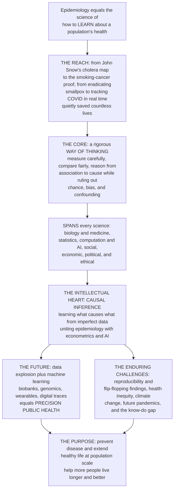

# 🌍 The Reach and Future of Epidemiology

> [!abstract] TL;DR
> This is the **capstone** of the whole Epidemiology and Public Health vault. Step back and see the field whole: epidemiology is nothing less than **the science of how to LEARN about the health of populations** — and its reach is astonishing. From John Snow's 1854 cholera map to the proof that smoking causes cancer, from **eradicating smallpox** to tracking COVID in real time, epidemiology has quietly saved more lives than perhaps any other science — not by curing individuals but by revealing **what makes populations sick and how to stop it**. Its core is a rigorous **way of thinking** that turns out to be universal: *measure carefully, compare fairly, and reason cautiously from association to cause while ruling out chance, bias, and confounding.* That toolkit reaches across nearly everything — it is applied biology and medicine, but also deeply **statistical, computational, social, economic, political, and ethical** — and its intellectual heart, **causal inference** (learning what causes what from imperfect data), is now recognized as one of the deepest problems in all of science, uniting epidemiology with **econometrics, statistics, and AI**. The future is dazzling and daunting: an explosion of new **data** (genomics, wearables, electronic records, digital traces) and new **methods** (machine learning, causal AI) promises **precision public health** — yet the field must confront enduring challenges: the reproducibility crisis and flip-flopping findings, health inequities that stubbornly persist, **climate change** as the century's great health threat, the certainty of future **pandemics**, and the perennial gap between **knowing** what works and actually **doing** it.

---

## Intuition

**Analogy — step back, and see epidemiology whole.** Imagine standing over a city at night and being asked a simple, staggering question: *why do some of these people get sick and die, and others don't — and what could we change to save them?* You cannot run to each house. You cannot open each body. All you have are **patterns** — who lives where, who drinks from which pump, who smokes, who is rich or poor, who fell ill and who did not. Epidemiology is the science invented to answer that question from exactly this vantage: **learning about the health of a whole population from the traces it leaves.** When John Snow walked cholera-stricken London in 1854, mapped the deaths, and traced them to a single water pump on Broad Street, he did not cure a single patient — he *removed the pump handle* and stopped an outbreak by **reasoning from a pattern to a cause.** That move — measure, compare, infer cause, act — is the whole science in miniature, and it has been repeated at ever grander scale ever since: to prove that cigarettes cause lung cancer, to design the vaccination campaign that **erased smallpox from the earth**, to identify the risk factors behind heart disease, and to steer a planet through a pandemic in real time.

Now notice how far that one habit of mind reaches. To find *what makes populations sick*, epidemiology must borrow from **everything**: the *biology and medicine* of disease mechanisms, the *statistics and mathematics* of inference, the *computation and data science* of billions of records, the *social sciences* of why the poor die younger, the *economics* of what interventions are worth their cost, the *politics* of health policy, and the *ethics* of experimenting on human populations. It is the **integrative, methodological science** — less a subject than a *rigorous way of learning* that can be pointed at any question of who lives and who dies. And its intellectual heart is the single hardest move in all of empirical science: **causal inference**, prising apart *cause* from mere *correlation* using imperfect, observational data — the same problem that occupies econometrics, statistics, and modern AI. This note surveys that immense **reach** across human knowledge, and epidemiology's dazzling, daunting **future** — an explosion of data and methods promising *precision public health*, shadowed by enduring struggles with reproducibility, inequity, climate, and pandemics. It is the culminating synthesis of this vault: the ongoing human project of learning, from the patterns of who lives and who dies, **how to make more people live longer and better.**

---

## How It Works

### The reach — an integrative, methodological science

Epidemiology is not one discipline but a **way of learning** that draws nearly all of them into practical use on the health of populations:

1. **Biology and medicine** supply the **mechanisms** — how pathogens spread, how a carcinogen damages a cell, how a risk factor injures an artery — the substrate that makes an association *plausible* as a cause.
2. **Statistics and mathematics** turn raw counts into **inference**: rates, risk ratios, confidence intervals, regression, and the compartmental models that forecast an epidemic. This is epidemiology's native language.
3. **Computation and data science / AI** now handle the **scale**: million-person biobanks, whole electronic health records, genome-wide data, and real-time digital traces that Snow could never have dreamed of.
4. **The social sciences** — sociology and psychology — explain the **social determinants** of health and the **behavior** that drives exposure: why the poor, the marginalized, and the stressed fall ill and die younger.
5. **Economics** weighs **cost-effectiveness** — which of many possible interventions buys the most health per dollar, the discipline of health economics.
6. **Political science and policy** decide whether knowledge becomes **action**: laws, funding, governance, and the machinery of public health that turns a finding into a program.
7. **Ethics** governs the whole enterprise — the morality of experimenting on populations, of surveillance and privacy, and, above all, of **equity** as the field's moral compass.

All of this converges not on an individual patient but on the **population** — the distinctive object epidemiology alone takes as its unit of analysis.

### The historical arc — from pumps, to risk factors, to molecules and causal inference

- **The sanitary era (1800s).** Snow's cholera map and the sanitary movement founded the field: clean water and sewers drove down infectious mortality *before germ theory even explained why*. Epidemiology began as **shoe-leather** observation married to bold inference.
- **The risk-factor and chronic-disease era (mid-1900s).** As infections receded, the great cohort studies — above all **Framingham** for heart disease and **Doll and Hill** for smoking and lung cancer — invented the modern toolkit of the cohort, the case-control study, and the concept of the **risk factor**, proving causation for diseases with no single microbe.
- **The molecular and causal-inference eras (late 1900s onward).** Epidemiology reached *inward* to genes, biomarkers, and the exposome, and *upward* to a rigorous **theory of causal inference** — potential outcomes, directed acyclic graphs, and target trials — that finally made explicit the logic Snow used by instinct.

### The intellectual core — a way of thinking, and causal inference

Beneath every study lies one method: **measure** a population's health carefully, **compare** groups *fairly* (making the compared groups exchangeable), and **infer** cautiously from association toward cause — all while ruling out the three great impostors of **chance, bias, and confounding**. The hardest step, learning **what causes what from imperfect observational data**, is now recognized as a central problem across all of science, uniting epidemiology with **econometrics, statistics, and artificial intelligence** under a shared language of causality.

### The frontiers, the enduring challenges, and the purpose



*Read top to bottom: a simple definition of the field unfolds into its vast reach and life-saving track record; that reach rests on a single way of thinking whose heart is causal inference; from that heart run two paths — a dazzling data-and-methods future toward precision public health, and a set of enduring challenges that data alone cannot solve — both ultimately judged by the same purpose at the bottom.*

---

## Key Concepts

### Secondary (intuitive)

- **Epidemiology studies whole populations, not single patients.** A doctor asks "why is *this* person sick?"; an epidemiologist asks "why do *these* people get sick, and how do we stop it?" — and answers from patterns, not from one body.
- **It has quietly saved enormous numbers of lives.** Clean water, the smoking-cancer proof, vaccination campaigns, and seatbelt and diet advice all came from epidemiology — it prevents disease rather than curing it, so its victories are often invisible.
- **Its trick is careful comparison.** Compare people who were exposed with people who were not, as *fairly* as possible, and see who gets sick. Almost everything follows from doing that comparison honestly.
- **"Correlation is not causation" is the whole struggle.** Two things happening together does not mean one caused the other. Deciding *when* an association really is a cause is the field's central, hardest job.
- **The future is more data and smarter methods — but the same old traps.** Genes, phones, and health records give epidemiologists oceans of new data; the danger is drowning in false patterns unless the careful thinking keeps up.

### Undergraduate (formal)

- **Epidemiology as the basic science of public health.** It provides the **measurement** (rates, risks, disease frequency) and the **inference** (study design, association, causal reasoning) on which all evidence-based prevention and policy rest — the quantitative backbone of the field.
- **The three impostors: chance, bias, and confounding.** Before an association can be called causal it must survive **chance** (ruled out by statistical inference and replication), **bias** (systematic error in selection or measurement), and **confounding** (a third variable driving both exposure and outcome). Distinguishing these is the discipline's core skill.
- **The hierarchy of designs.** Ecological and cross-sectional studies generate hypotheses; case-control and cohort studies test them observationally; the **randomized controlled trial** approximates the ideal comparison by making exposed and unexposed groups exchangeable by design — the reason randomization is epidemiology's gold standard.
- **The Bradford Hill considerations.** Strength, consistency, temporality, biological gradient, plausibility, and experiment are the classic viewpoints for judging whether an association is causal — the informal logic that the modern causal framework later formalized.
- **The epidemiologic transition.** As societies develop, the dominant burden shifts from **infectious** disease that kills the young toward **chronic, non-communicable** disease of the old — reshaping what epidemiology must study and driving the field's move from outbreaks to risk factors.
- **Surveillance and the outbreak.** Continuous monitoring of a population's health — the field's early-warning system — turns scattered case reports into the detection of an epidemic, and links epidemiology directly to real-time public-health action.

### Graduate (integrative and systems)

- **Epidemiology as the science of counterfactuals.** Modern epidemiology recasts causation in the **potential-outcomes** framework: a causal effect is the contrast between the outcome that *did* occur and the counterfactual that *would* have occurred under a different exposure — never both observed. Every study is then an attempt to estimate that unobservable contrast, and every bias is a way the estimate can fail. This is the same formalism used across **econometrics, statistics, and causal machine learning** — the deepest unification in the field.
- **DAGs, target trials, and the identification problem.** Directed acyclic graphs make assumptions about confounding and selection *explicit and testable*, distinguishing confounders (adjust) from colliders and mediators (do not naively adjust); the **target-trial** paradigm disciplines observational analysis by emulating the randomized experiment one wishes could be run. Identification — *can this effect even be estimated from these data?* — precedes estimation.
- **The precision-public-health frontier, and its hype.** Biobanks, multi-omics, wearables, electronic records, and digital traces, coupled with machine learning, promise to **target interventions** to the individuals and moments where they help most. Yet prediction is not causation, and a model that forecasts risk exquisitely may say nothing about what to *change* — the central caution against confusing a powerful predictor for an actionable cause.
- **The reproducibility crisis as an epistemological reckoning.** Flip-flopping nutritional and observational findings, the file-drawer problem, p-hacking, and multiple comparisons exposed how fragile naive association-hunting is; the response — pre-registration, **triangulation** across designs with different biases, and explicit causal thinking — is remaking the field's standards of rigor.
- **The know-do gap and equity as the moral compass.** Epidemiology's hardest unsolved problems are not only methodological. Persistent **health inequities** track social and economic position with brutal consistency; **climate change** is emerging as the century's defining health threat; the next **pandemic** is a certainty, not a possibility; and even settled knowledge routinely fails to become policy or practice — the **know-do gap**. The field's ultimate purpose is not publication but **preventing disease and extending healthy life at population scale.**

---

## Python Demo

```python
# THE SWEEP AND FUTURE OF EPIDEMIOLOGY, in four pictures.
#   (A) THE LIVES-SAVED ARC: global life expectancy roughly DOUBLED over ~200 years,
#       an ascent that epidemiology helped drive -- annotated with the milestones the
#       field enabled (Snow / sanitation, germ theory, smoking-cancer proof, vaccines,
#       cardiovascular risk factors).
#   (B) THE EPIDEMIOLOGIC TRANSITION: as sanitation and vaccines beat back infection,
#       the leading causes of death shifted from INFECTIOUS (killers of the young) to
#       CHRONIC / non-communicable disease -- the shift epidemiology tracked and mapped.
#   (C) THE DATA EXPLOSION: the scale of an epidemiologic "study" leapt from Snow's
#       dozens of deaths to Framingham's thousands, to million-person biobanks, to
#       BILLIONS of real-time digital traces -- the data revolution enabling the future.
#   (D) THE REACH: epidemiology as an integrative science, radiating across biology,
#       statistics, computation/AI, social science, economics, policy, and ethics.
#
# Figures are illustrative, textbook-level approximations -- not precise historical data.
import numpy as np
import matplotlib.pyplot as plt

fig = plt.figure(figsize=(15, 11))
fig.suptitle("The reach and future of epidemiology: learning, from the patterns of who lives and who dies",
             fontsize=15, fontweight="bold")

# ------------------------------------------------------------------
# (A) Life expectancy over ~200 years, with epidemiology-driven milestones
# ------------------------------------------------------------------
axA = fig.add_subplot(2, 2, 1)
yr = np.array([1800, 1850, 1880, 1900, 1920, 1950, 1965, 1980, 2000, 2020])
le = np.array([  30,   32,   34,   36,   40,   48,   56,   63,   67,   73])
axA.plot(yr, le, "-o", color="#1f77b4", lw=2.4, ms=6)
axA.axhline(le[0], color="grey", ls=":", lw=1)
axA.axhline(le[-1], color="grey", ls=":", lw=1)
axA.annotate("", xy=(1815, le[-1]), xytext=(1815, le[0]),
             arrowprops=dict(arrowstyle="<->", color="#d62728", lw=2))
axA.text(1822, (le[0] + le[-1]) / 2, f"~{le[-1]/le[0]:.1f}x\n(nearly doubled)",
         color="#d62728", fontsize=10, fontweight="bold", va="center")
milestones = {
    1854: "Snow's cholera map\n& the sanitary movement",
    1882: "Germ theory\nconfirmed",
    1954: "Doll & Hill:\nsmoking causes cancer",
    1965: "Framingham:\nCVD risk factors",
    1980: "Smallpox declared\neradicated",
}
for mx, label in milestones.items():
    my = np.interp(mx, yr, le)
    axA.annotate(label, xy=(mx, my), xytext=(mx, my - 12 if mx < 1900 else my + 9),
                 fontsize=7.0, ha="center", color="#333333",
                 arrowprops=dict(arrowstyle="->", color="#888888", lw=0.8))
axA.set_title("(A) The lives-saved arc:\nlife expectancy doubled, milestones epidemiology enabled")
axA.set_xlabel("Year"); axA.set_ylabel("Life expectancy at birth (years)")
axA.set_xlim(1790, 2035); axA.set_ylim(12, 90); axA.grid(alpha=0.3)

# ------------------------------------------------------------------
# (B) The epidemiologic transition -- share of deaths, infectious vs chronic
# ------------------------------------------------------------------
axB = fig.add_subplot(2, 2, 2)
t = np.linspace(1900, 2020, 200)
infectious = 45 / (1 + np.exp((t - 1945) / 12)) + 5
chronic    = 80 / (1 + np.exp(-(t - 1950) / 15)) + 8
tot = infectious + chronic
infectious = 100 * infectious / tot
chronic    = 100 * chronic / tot
axB.stackplot(t, chronic, infectious,
              labels=["Chronic / non-communicable\n(heart disease, cancer, dementia)",
                      "Infectious & nutritional\n(historically dominant)"],
              colors=["#8E44AD", "#E67E22"], alpha=0.85)
axB.set_title("(B) The epidemiologic transition:\ninfectious -> chronic disease")
axB.set_xlabel("Year"); axB.set_ylabel("Share of deaths (%)")
axB.set_xlim(1900, 2020); axB.set_ylim(0, 100)
axB.legend(loc="center left", fontsize=8, framealpha=0.9)

# ------------------------------------------------------------------
# (C) The data explosion -- scale of an epidemiologic study over time (log)
# ------------------------------------------------------------------
axC = fig.add_subplot(2, 2, 3)
studies = ["Snow's\ncholera\n(1854)", "Doll & Hill\ncohort\n(1950s)",
           "Framingham\n(ongoing)", "Nurses'\nHealth Study", "UK Biobank\n(~2010)",
           "Real-time\ndigital streams\n(2020s)"]
n = np.array([616, 40000, 5209, 121700, 500000, 5e9])  # subjects / records
xpos = np.arange(len(studies))
axC.bar(xpos, n, color=plt.cm.viridis(np.linspace(0.15, 0.9, len(studies))))
axC.set_yscale("log")
axC.set_xticks(xpos); axC.set_xticklabels(studies, fontsize=7)
axC.set_title("(C) The data explosion:\nfrom Snow's dozens to billion-record digital streams")
axC.set_ylabel("Subjects / records (log scale)")
axC.grid(alpha=0.3, axis="y", which="both")
for x, v in zip(xpos, n):
    axC.text(x, v * 1.6, f"{v:,.0f}" if v < 1e6 else f"{v:.0e}",
             ha="center", fontsize=6.5)

# ------------------------------------------------------------------
# (D) The reach -- epidemiology's cross-disciplinary span as a radar
# ------------------------------------------------------------------
axD = fig.add_subplot(2, 2, 4, polar=True)
cats = ["Biology &\nmedicine", "Statistics\n& math", "Computation\n& AI",
        "Social\nscience", "Economics", "Policy &\npolitics", "Ethics"]
reach = np.array([9, 10, 8, 8, 6, 7, 7])  # illustrative "reach" weights, 0-10
ang = np.linspace(0, 2 * np.pi, len(cats), endpoint=False)
ang_c = np.concatenate([ang, ang[:1]])
reach_c = np.concatenate([reach, reach[:1]])
axD.plot(ang_c, reach_c, color="#2ca02c", lw=2.2)
axD.fill(ang_c, reach_c, color="#2ca02c", alpha=0.25)
axD.set_xticks(ang); axD.set_xticklabels(cats, fontsize=7.5)
axD.set_yticks([2, 4, 6, 8, 10]); axD.set_ylim(0, 10)
axD.set_title("(D) The reach: an integrative,\nmethodological science", pad=18)

plt.tight_layout(rect=[0, 0, 1, 0.95])
plt.savefig("reach_future_epidemiology.png", dpi=130)
plt.show()

print(f"(A) Life expectancy: {le[0]} -> {le[-1]} yr  = {le[-1]/le[0]:.2f}x over ~220 yr")
print(f"(B) Infectious share of deaths: ~{infectious[0]:.0f}% (1900) -> ~{infectious[-1]:.0f}% (2020)")
print(f"(C) Study scale: {n[0]:,.0f} (Snow, 1854) -> {n[-1]:.0e} records (2020s)"
      f"  = ~{n[-1]/n[0]:.0e}x larger")
print("(D) Reach spans biology, statistics, computation, social science, economics, policy, ethics")
```

**What you see.** *Panel (A)* renders epidemiology's greatest gift as one rising line — global life expectancy climbing from roughly **30 to over 70 years**, a near-doubling — and pins to it the milestones the field made possible: Snow's cholera map and the sanitary movement, the confirmation of germ theory, the smoking-cancer proof, the discovery of cardiovascular risk factors, and the **eradication of smallpox**. Almost none of these was a cure; each was a *pattern, correctly reasoned into a cause, and then acted upon.* *Panel (B)* shows the **epidemiologic transition** that success created: as infectious killers of the young were beaten back, the burden shifted to the **chronic diseases of aging** — the very shift that pushed epidemiology from outbreak-chasing toward the risk-factor science of cohorts. *Panel (C)* captures the engine of the coming era: the scale of a single study leaping from Snow's **616 deaths** to million-person **biobanks** and **billions** of real-time digital records — the data explosion that both enables *precision public health* and multiplies the ways to be fooled by chance. *Panel (D)* is the whole argument of this note in one shape: epidemiology as an **integrative, methodological science**, radiating across biology, statistics, computation, the social sciences, economics, policy, and ethics — a *way of learning*, pointed at the health of populations.

---

## Real-World Applications

> **Example — steering a planet through a pandemic in real time.** During COVID-19, epidemiology was, for once, visible to everyone. Compartmental models estimated the reproduction number and projected hospital demand; case and death **surveillance** tracked the epidemic day by day; **case-control and cohort studies** and eventually randomized trials measured vaccine effectiveness and which treatments worked; genomic epidemiology traced variants as they emerged; and the whole apparatus fed directly into **policy** — lockdowns, masking, vaccine rollout. It was the field's entire toolkit — measurement, inference, causal reasoning, and translation to action — compressed into a live, global emergency. The certainty of a *next* pandemic is exactly why this capacity, developed in this vault's infectious-disease section, matters. See [[Pandemics_and_Emerging_Infections]] for that machinery.

The reach and future of epidemiology show up across the whole of health:

- **Proving what causes chronic disease.** The cohort and case-control designs that linked smoking to cancer and cholesterol and blood pressure to heart disease remain the template for identifying modifiable risk factors — the science tracked by [[The_Epidemiologic_Transition_and_Burden_of_Disease]].
- **Formalizing causal inference.** The move from Bradford Hill's informal viewpoints to explicit **directed acyclic graphs**, potential outcomes, and target-trial emulation is the field's deepest recent advance — the machinery detailed in [[Directed_Acyclic_Graphs_and_Modern_Causal_Methods]], and the same logic now shared with econometrics and causal AI.
- **Precision public health.** Biobanks, polygenic risk scores, wearables, and machine learning aim to target screening and prevention to the people and moments where they help most — powerful, but only as trustworthy as the causal reasoning behind them.
- **Confronting the reproducibility crisis.** Pre-registration, triangulation, and honest handling of multiplicity are remaking standards after decades of flip-flopping observational findings — the rigor anchored in [[Statistical_Inference_and_Uncertainty]] and the study of [[Bias_Selection_and_Information]].
- **The enduring frontiers.** Persistent health **inequities**, **climate change** as a health threat, and the **know-do gap** between evidence and policy are the problems data alone will not solve — the translation layer that lives in [[Public_Health_Systems_and_Functions]].

---

## Common Pitfalls

- **Mistaking correlation for causation.** The field's oldest and deepest trap. An association can arise from chance, bias, reverse causation, or a lurking **confounder**; declaring cause without ruling these out is how epidemiology embarrasses itself — and how flip-flopping headlines are born. The entire discipline exists to make this move *carefully*.
- **Worshipping prediction over explanation.** A machine-learning model can forecast who will fall ill with uncanny accuracy while telling you *nothing* about what to change. Prediction and causation are different problems; precision public health fails when it confuses a powerful predictor for an actionable lever.
- **Drowning in big data.** More data is not more truth. Million-person datasets can produce vanishingly small p-values for utterly spurious associations, and inherit the **biases** of who gets recorded. Scale magnifies both signal and error; without causal thinking it magnifies error faster.
- **The ecological fallacy and its cousins.** Inferring about individuals from group-level correlations, or generalizing from an unrepresentative sample, quietly wrecks conclusions. Every design has its characteristic bias; knowing which one threatens *your* study is half the craft.
- **Ignoring equity — the field's moral compass.** Averages hide the people who suffer most. An intervention that improves the population mean while widening the gap between rich and poor has, by epidemiology's own lights, partly failed. Equity is not an add-on to the science; it is its purpose.
- **The know-do gap — mistaking knowing for doing.** A proven finding that never changes a policy or a life is a failure of the enterprise, not a success of the paper. Epidemiology's hardest problems are often not in the data at all, but in translation, politics, and delivery.
- **Reading this as an individual's medical advice.** This capstone surveys the *scope and direction* of a science of **populations** at a textbook level. It is emphatically **not** guidance for any one person's health, which depends on a qualified clinician and individual circumstances.

---

## Related Concepts

**Within this vault (siblings, prose references).** This note is the **capstone** that closes the Epidemiology and Public Health vault, drawing all six sections into a single view. It completes the arc opened by the vault's hub, *Epidemiology and Public Health Overview*, which introduced epidemiology as the basic science of public health. Its intellectual center of gravity is *Causal Inference in Epidemiology* — the potential-outcomes and identification logic that this note elevates to a problem uniting all of science. Its frontiers are developed in the other Section 06 notes on chronic, global, and frontier epidemiology: *Digital Epidemiology and Big Data* (the data-and-methods revolution behind precision public health), *Genetic and Molecular Epidemiology* (the reach inward to genes and the exposome), and *Global Health and International Epidemiology* (the planetary and equity scale). And its moral compass is *Social Determinants and Health Equity*, the study of why the poor and marginalized die younger. Those are prose references to sibling notes in this vault. This note *does* wikilink to the mechanism, method, and translation notes it directly synthesizes.

**Across the vault-verse (Glob-verified links).**

- [[Health_Nutrition_and_Longevity/06_Public_Health_and_Prevention/Public_Health_and_Epidemiology|Public Health and Epidemiology]] — the applied, prevention-focused companion to this methodological capstone; the "what to do with the knowledge" view.
- [[Health_Nutrition_and_Longevity/06_Public_Health_and_Prevention/The_Future_of_Health_and_Medicine|The Future of Health and Medicine]] — the same data-and-precision future seen from the health-and-longevity side.
- [[Health_Nutrition_and_Longevity/06_Public_Health_and_Prevention/Global_Health_and_Health_Systems|Global Health and Health Systems]] — the systems and global-equity layer where epidemiologic knowledge must become delivery.
- [[Clinical_Medicine/06_Clinical_Reasoning_and_Modern_Medicine/The_Reach_and_Future_of_Clinical_Medicine|The Reach and Future of Clinical Medicine]] — the sibling capstone for the *individual* patient; epidemiology is its population-scale counterpart, supplying the evidence clinical medicine acts on.
- [[Clinical_Medicine/06_Clinical_Reasoning_and_Modern_Medicine/Evidence_Based_Medicine_and_Clinical_Trials|Evidence Based Medicine and Clinical Trials]] — the randomized trial and evidence hierarchy that epidemiology and clinical medicine share.
- [[Meteorology_and_Climatology/04_Climate_System/Anthropogenic_Climate_Change|Anthropogenic Climate Change]] — the century's defining health threat that the field's climate-and-health frontier confronts.
- [[Systems_Thinking_and_Complexity/06_Applied_Systems_Thinking/Sustainability_and_Planetary_Boundaries|Sustainability and Planetary Boundaries]] — the planetary-health framing in which population health and environmental limits meet.

**Mechanism, method, and translation anchors (this vault).**

- [[Directed_Acyclic_Graphs_and_Modern_Causal_Methods]] — the formal machinery of the causal-inference core this note calls the field's intellectual heart.
- [[Statistical_Inference_and_Uncertainty]] — the handling of chance and uncertainty at the root of the reproducibility crisis.
- [[Bias_Selection_and_Information]] — the systematic errors that separate honest comparison from false conclusion.
- [[The_Epidemiologic_Transition_and_Burden_of_Disease]] — the shift from infectious to chronic disease that reshaped what the field studies.
- [[Pandemics_and_Emerging_Infections]] — the pandemic-preparedness frontier, a certainty of the future.
- [[Public_Health_Systems_and_Functions]] — the translation layer where evidence becomes action, home of the know-do gap.

---

## Review Questions

**Secondary.** Epidemiology is described as "the science of how to learn about the health of populations." Using John Snow and the Broad Street pump, explain what it means to solve a health problem *without curing a single patient* — how did reasoning from a pattern to a cause stop an outbreak? Then name two other times in history epidemiology saved lives at large scale, and say why its victories are often invisible.

**Undergraduate.** Explain the phrase "correlation is not causation" as the central problem of epidemiology, and describe the **three impostors** — chance, bias, and confounding — that stand between an association and a causal claim. Why does a **randomized controlled trial** handle confounding so much more cleanly than an observational cohort, and why, despite that, must most of epidemiology still rely on observational data? Connect your answer to the epidemiologic transition: why did proving causation get *harder* as the leading diseases shifted from infectious to chronic?

**Graduate.** This note claims epidemiology's intellectual heart — **causal inference from imperfect data** — is one of the deepest problems in all of science, uniting it with econometrics, statistics, and AI. Defend or challenge that claim along three axes: (1) what the potential-outcomes and DAG frameworks add over Bradford Hill's informal viewpoints; (2) why "precision public health," for all its data and machine learning, does **not** dissolve the causation problem but can actually *sharpen* the temptation to confuse prediction with cause; and (3) why the field's hardest unsolved problems — reproducibility, health inequity, climate change, and the know-do gap — are as much *methodological, moral, and political* as they are technical. What does your analysis imply about where the future of epidemiology will actually be won: in the data, or beyond it?

---

## Sources

- Rothman, K. J., Greenland, S., & Lash, T. L. — *Modern Epidemiology* (3rd ed., Lippincott Williams & Wilkins, 2008). — the standard graduate reference for measurement, bias, confounding, and causal reasoning.
- Hernán, M. A., & Robins, J. M. — *Causal Inference: What If* (Chapman & Hall/CRC, 2020). — [miguelhernan.org/whatifbook](https://miguelhernan.org/whatifbook) — the modern potential-outcomes and target-trial framework.
- Centers for Disease Control and Prevention (1999). "Ten Great Public Health Achievements — United States, 1900–1999." *MMWR*, 48(12), 241–243. — [cdc.gov/mmwr/preview/mmwrhtml/00056796.htm](https://www.cdc.gov/mmwr/preview/mmwrhtml/00056796.htm)
- Frieden, T. R. (2015). "The Future of Public Health." *New England Journal of Medicine*, 373(18), 1748–1754. — [doi.org/10.1056/NEJMsa1511248](https://doi.org/10.1056/NEJMsa1511248)
- Khoury, M. J., Iademarco, M. F., & Riley, W. T. (2016). "Precision Public Health for the Era of Precision Medicine." *American Journal of Preventive Medicine*, 50(3), 398–401. — [doi.org/10.1016/j.amepre.2015.08.031](https://doi.org/10.1016/j.amepre.2015.08.031)

---

#epidemiology #future-of-epidemiology #causal-inference #precision-public-health #capstone
