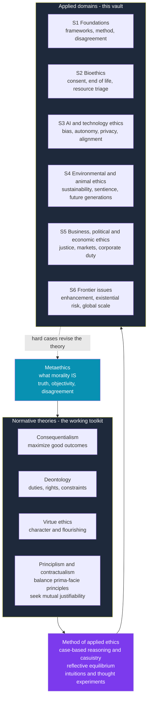

# ⚖️ Applied Ethics Overview

> [!abstract] TL;DR
> **Applied ethics** is the branch of moral philosophy that puts theory to work on concrete, contested, real-world problems — a dying patient's request, a biased hiring algorithm, a warming planet, a drone strike. It sits atop two more abstract layers: **metaethics** (the *nature* of morality — are moral claims true?) and **normative ethics** (the general theories — consequentialism, deontology, virtue). Applied ethics rarely *deduces* a verdict from one theory; it reasons **from cases**, tests principles against **intuitions**, and seeks **reflective equilibrium**. This note is the entry point to a six-section vault covering bioethics, AI and technology ethics, environmental and animal ethics, business and political and economic ethics, and frontier issues. It is the *applied* complement to the theoretical [[Applied_Ethics|Philosophy vault's Ethics section]] — it uses that theory rather than re-deriving it.

## Intuition — analogy first

Normative ethics is the **grammar** of morality; applied ethics is **actually speaking the language** in a room where people are shouting.

Anyone can memorize grammar rules — subject, verb, object; "maximize good outcomes," "never treat a person merely as a means," "act as the virtuous person would." But knowing the rules is not the same as holding a *conversation* under pressure, in dialect, about something that matters. A native speaker in a real argument must improvise: the textbook rule is ambiguous here, two rules collide there, and this idiom has no clean translation into that one. Fluency is the *judgment* to say the right thing in *this* messy situation, not the ability to recite the rulebook.

Applied ethics is that fluency for hard cases. Consequentialism and Kantian duty are the grammar; a ventilator shortage, a self-driving car's split-second choice, or a carbon tax that helps the future but hurts the poor now is the live conversation. The applied ethicist reasons *from* the theories **and** *from* strong judgments about the case, revising each in light of the other. That is why applied ethics is a genuine discipline and not a lookup table — and why competent, informed people still disagree.

---

## How It Works — Theory Feeding the Applied Domains

Applied ethics is best pictured as a **stack**. At the base is **metaethics**, asking what morality even *is*. Above it sits **normative ethics** — the rival general theories that serve as the working **toolkit**. A layer of **method** (case-based reasoning plus reflective equilibrium) translates abstract tools into verdicts. And at the top are the **applied domains** where the action happens. The three levels are nested but not a one-way pipe: hard cases at the top routinely *push back* and force revision of the theory below.

- **Metaethics** — the nature and status of moral claims (objective? relative? cognitively meaningful?). Deep dive: [[Metaethics]]. Its practical upshot — that reasonable people *persistently disagree* without either being irrational — is what makes applied ethics contested rather than a solved calculation.
- **Normative ethics** — the general theories used as tools, sketched below. Full treatments live in the Philosophy vault.
- **Method** — how a general tool decides a particular case: case-based **casuistry**, **thought experiments**, weighing **moral intuitions**, and **reflective equilibrium**.
- **Applied domains** — the six sections of this vault.



### The Normative Toolkit in Brief

Applied ethics borrows four families of tools. Each is a *lens*, not a formula, and they often disagree — which is the whole point of the [[#Python Demo — one problem, three verdicts|demo below]].

| Tool | Core question | What it maximizes / protects | Deep dive |
|---|---|---|---|
| **Consequentialism / utilitarianism** | What produces the best outcomes? | Aggregate welfare, well-being | [[Consequentialism_and_Utilitarianism]] |
| **Deontology** | What are my duties and the rights I must not violate? | Rights and constraints, whatever the outcome | [[Deontology_and_Kantian_Ethics]] |
| **Virtue ethics** | What would a person of good character do? | Character, practical wisdom, flourishing | [[Virtue_Ethics]] |
| **Principlism and contractualism** | Which prima-facie principles apply, and could all affected reasonably accept the rule? | Balanced principles, mutual justifiability | *[[Ethical_Frameworks_in_Practice]]* (this section) |

### The Method: Reasoning From Cases

Because no single theory settles every case, applied ethics leans on a distinctive method, treated in depth in *[[Moral_Reasoning_and_Case_Analysis]]* (this section):

1. **Casuistry** — reason outward from settled **paradigm cases** by analogy, the way medicine and law use precedent. An ethics committee of a utilitarian, a Kantian, and a virtue theorist can converge on a policy even while disagreeing about theory.
2. **Thought experiments and intuitions** — cases like the trolley problem are *stress tests* that force principles and firm judgments into productive conflict.
3. **Reflective equilibrium** (Rawls) — move back and forth between principles and case judgments, revising either, until the whole web coheres. Neither intuition nor principle is treated as infallible.

### Why It Matters Now

Technology, medicine, and **global scale** now generate novel dilemmas *faster than intuition or tradition can settle them*. Gene editing, machine decision-making, planetary-scale environmental change, and interventions that affect people not yet born are situations our inherited moral instincts never evolved to handle. Applied ethics is the discipline for building justified answers when the old maps run out.

### Ethics Is Not Law, and Not a Code of Conduct

Three normative systems overlap but are **not identical**:

- **Ethics vs law.** Law is enforceable and territorial; ethics is critical and universalizing. Acts can be *legal but immoral* (historic slavery) or *immoral but legal* (some cruel speech). Ethics judges the law from outside — see [[Philosophy_of_Law_Jurisprudence]] for how the natural-law vs positivism debate frames exactly this gap.
- **Ethics vs professional codes.** A profession's code (medical, engineering, legal) operationalizes ethics for a domain, but codes can be incomplete, self-serving, or lag new technology. "It's in the code" answers a compliance question, not the deeper moral one.

### Roadmap of the Six Sections

1. **S1 · Foundations of Applied Ethics** *(you are here)* — frameworks as tools, the method of case analysis, and the fact of moral disagreement. Siblings: *[[Ethical_Frameworks_in_Practice]]*, *[[Moral_Reasoning_and_Case_Analysis]]*, *[[Metaethics_and_Moral_Disagreement]]*.
2. **S2 · Bioethics and Medical Ethics** — autonomy and consent, end-of-life, resource allocation and triage, research ethics.
3. **S3 · AI and Technology Ethics** — algorithmic bias, automation and autonomy, privacy and surveillance, value alignment and accountability.
4. **S4 · Environmental and Animal Ethics** — sustainability, obligations to future generations, animal welfare and sentience, climate justice.
5. **S5 · Business, Political, and Economic Ethics** — corporate responsibility, distributive justice, markets and their moral limits, whistle-blowing.
6. **S6 · Frontier and Emerging Issues** — human enhancement, existential and catastrophic risk, ethics at global scale, moral uncertainty.

---

## Key Concepts

### Secondary — the picture everyone should hold

- **The three levels.** *Metaethics* (what morality is) → *normative ethics* (the general theories) → *applied ethics* (specific cases). They nest: you cannot fully settle a case without a theory, and defending a theory eventually raises metaethical questions.
- **The four tools.** Consequentialism (outcomes), deontology (duties and rights), virtue ethics (character), and principlism/contractualism (balancing principles). Know each in one sentence.
- **Ethics ≠ law ≠ etiquette ≠ religion.** Each can be evaluated *by* ethics from the outside.

### Undergraduate — the working machinery

- **Reflective equilibrium and casuistry.** How verdicts are actually reached — by coherence and analogy to paradigm cases, not deduction from a single axiom.
- **Prima-facie duties.** Ross's insight (and Beauchamp and Childress's four bioethics principles) that duties are *defeasible* and must be *balanced* case by case — no master rule ranks them in advance.
- **The scope of the moral community.** Many applied disputes (which humans, which animals, could an AI count?) are really one question: *whose interests count?* Fixing that criterion often does more work than choosing a theory.
- **Moral pluralism.** Multiple genuine values (welfare, liberty, equality, loyalty) that are not reducible to a single currency and can irreducibly conflict.

### Graduate — the contested frontier

- **Underdetermination of cases by theory.** Even a fully specified theory rarely yields a unique verdict for a rich real case; empirical facts, framing, and the reference class do heavy lifting. This is why applied ethics is *framework-dependent*, not merely theory-application.
- **Particularism vs generalism.** Dancy's challenge that morally relevant features can flip valence across contexts, threatening the very idea of stable principles — and the casuist reply.
- **Moral uncertainty.** How to act when you assign credence to *several* incompatible normative theories at once (expected-choiceworthiness approaches, and their problem of intertheoretic value comparison).
- **Non-ideal theory and moral expertise.** Whether there are ethics *experts* whose judgments deserve deference, and how to reason well under unjust background conditions rather than idealized ones.

---

## Python Demo — one problem, three verdicts

The single most important lesson of applied ethics is that **the same options can be ranked differently by different frameworks** — so *which framework you adopt is itself a moral choice*. Below, four scarce-resource allocation policies are each scored on four morally relevant dimensions (welfare produced, rights respected, fairness of distribution, virtue of character expressed), then aggregated three ways: a **consequentialist** weighting (welfare dominates), a **deontological** rule (rights act as a lexical *constraint* — violate them and you are impermissible), and an **egalitarian** rule (prioritize fair distribution and the worst-off). The rankings diverge sharply. Uses only numpy and matplotlib.

```python
# Same options, three ethical frameworks, divergent rankings.
import numpy as np
import matplotlib.pyplot as plt

dims    = ["Welfare", "Rights", "Fairness", "Virtue"]
options = ["Utility-max triage", "First-come first-served",
           "Equal lottery", "Priority to worst-off"]

# rows = options, cols = dimensions, each scored 0..10 by domain experts
S = np.array([
    [9, 4, 3, 5],   # Utility-max triage: great welfare, weak on rights/fairness
    [6, 7, 5, 5],   # First-come first-served: procedurally neutral
    [5, 8, 9, 6],   # Equal lottery: strong rights + fairness
    [6, 6, 8, 8],   # Priority to worst-off: fair + compassionate
], dtype=float)

RIGHTS, FAIR = dims.index("Rights"), dims.index("Fairness")

# 1) Consequentialist: weighted sum, welfare dominates
w_conseq = np.array([0.70, 0.10, 0.10, 0.10])
conseq = S @ w_conseq

# 2) Deontological: rights are a LEXICAL CONSTRAINT.
#    Below the rights threshold => impermissible (ranked last, score -inf).
#    Among permissible options, rank by rights first (welfare only breaks ties).
threshold   = 6.0
permissible = S[:, RIGHTS] >= threshold
deont = np.where(permissible, S[:, RIGHTS] + 0.01 * S[:, 0], -np.inf)

# 3) Egalitarian (Rawlsian): prioritize fair distribution, then the worst-off dim.
egal = S[:, FAIR] + 0.01 * S.min(axis=1)

def ranks(scores):           # rank 1 = best (highest score)
    order = np.argsort(-scores, kind="stable")
    r = np.empty_like(order)
    r[order] = np.arange(1, len(scores) + 1)
    return r

frameworks = ["Consequentialist", "Deontological", "Egalitarian"]
rank_mat = np.vstack([ranks(conseq), ranks(deont), ranks(egal)]).T  # options x frameworks

for name, sc in zip(frameworks, [conseq, deont, egal]):
    print(f"{name:16s} scores: {np.round(np.where(np.isfinite(sc), sc, -99), 2)}")
print("\nRanks (1 = best):\n", rank_mat)

# --- Plot: option-by-framework ranking heatmap ---
fig, ax = plt.subplots(figsize=(7.5, 4.5))
im = ax.imshow(rank_mat, cmap="RdYlGn_r", vmin=1, vmax=len(options))
ax.set_xticks(range(len(frameworks))); ax.set_xticklabels(frameworks)
ax.set_yticks(range(len(options)));    ax.set_yticklabels(options)
for i in range(len(options)):
    for j in range(len(frameworks)):
        ax.text(j, i, f"#{rank_mat[i, j]}", ha="center", va="center",
                color="black", fontweight="bold")
ax.set_title("Same options, different verdicts\nranking (No.1 = best) under three frameworks")
fig.colorbar(im, ax=ax, label="rank  (1 = best, 4 = worst)")
plt.tight_layout()
plt.savefig("applied_ethics_framework_rankings.png", dpi=120)
plt.show()
```

**What you see.** *Utility-max triage* is ranked **#1 by the consequentialist** but **#4 (worst) by both the deontologist and the egalitarian** — its high welfare cannot buy back the rights it tramples or the unfairness it produces. *Equal lottery* is the mirror image: **worst under consequentialism, best under the other two.** No option wins everywhere. That structural disagreement — not sloppiness — is why applied-ethics debates are hard, and why naming *which* framework you are using is the first move in any honest argument.

---

## Real-World Applications

> **Example:** **Hospital ethics committees and IRBs** literally run this vault's method. A committee facing a ventilator shortage or a contested end-of-life request does not deduce an answer from utilitarianism; it balances Beauchamp and Childress's four *prima-facie* principles (autonomy, beneficence, non-maleficence, justice) case by case — casuistry and reflective equilibrium in institutional form.

- **AI ethics boards and algorithmic auditing.** The **COMPAS** recidivism controversy and regulation like the **EU AI Act** are applied ethics operationalized — trading predictive welfare against fairness and rights, exactly the tension the demo dramatizes (S3).
- **Environmental policy and the discount rate.** How much to weigh future generations against present costs (the Stern vs Nordhaus dispute over climate discounting) is a live applied-ethics choice with trillion-dollar stakes (S4).
- **Corporate codes and ESG.** Business ethics codes, whistle-blower protections, and stakeholder-vs-shareholder debates apply deontological duties and distributive-justice theory to markets (S5).
- **Just war and rules of engagement.** *Jus ad bellum* and *jus in bello* are the oldest applied-ethics tradition, now stress-tested by drones and autonomous weapons (S3/S6).

---

## Common Pitfalls

- **Treating applied ethics as deduction from one theory.** Most hard cases involve *conflicting* principles with no master rule to rank them. The work is in the weighing, not a calculation — and pretending otherwise hides the real disagreement.
- **Confusing legal with ethical.** "It's legal" and "it's in the professional code" answer *compliance* questions, not moral ones. See [[Philosophy_of_Law_Jurisprudence]].
- **The is–ought slide.** Inferring what we *ought* to do from what is *natural*, *widespread*, or *technically possible* smuggles in an unstated normative premise. Descriptive facts never settle a normative question by themselves (see [[Metaethics]]).
- **Framework cherry-picking.** Choosing the theory that yields the answer you already wanted, and switching frameworks between cases to stay comfortable. State your framework *before* you know the verdict.
- **Forgetting the moral-status question.** Debates about abortion, animals, future people, and AI often stall because the parties never asked *whose interests count* — the criterion that fixes what any theory then aggregates or protects.

---

## Related Concepts

*(All links below are verified to exist. Sibling notes in italics elsewhere on this page — Ethical_Frameworks_in_Practice, Moral_Reasoning_and_Case_Analysis, Metaethics_and_Moral_Disagreement — are planned for this section and not yet written.)*

- [[What_Is_Ethics]] — the branch structure (metaethics / normative / applied) that this vault sits inside; the theoretical parent of this survey.
- [[Applied_Ethics]] — the Philosophy vault's *theoretical* treatment of applied ethics (bioethics, animal, AI, just war); this note is its practice-oriented, vault-organizing complement rather than a duplicate.
- [[Consequentialism_and_Utilitarianism]] — the outcome-maximizing tool; engine of the demo's consequentialist ranking.
- [[Deontology_and_Kantian_Ethics]] — duties and rights-as-constraints; the demo's lexical deontological rule.
- [[Virtue_Ethics]] — character and flourishing; the "virtue" scoring dimension and clinical care ethics.
- [[Metaethics]] — why persistent moral disagreement need not mean "no fact of the matter"; grounds the whole stack.
- [[Philosophy_of_Law_Jurisprudence]] — the ethics-vs-law boundary and the natural-law/positivism debate over whether unjust law is really law.
- Cross-vault: [[_MOC_AI_ML_Master]] — the technical grounding of the bias, privacy, and alignment problems that S3 treats ethically.

---

## Review Questions

1. **(Secondary)** Distinguish metaethics, normative ethics, and applied ethics with one example question each. Why can't you fully answer an applied question (e.g., "Is voluntary euthanasia permissible?") without touching the other two levels?
2. **(Undergraduate)** A colleague argues "gene editing is unnatural, therefore it's wrong." Name the fallacy, identify the hidden premise, and explain how reflective equilibrium would handle a clash between that intuition and a principle like "reduce preventable suffering."
3. **(Graduate)** In the Python demo, *Utility-max triage* is best under consequentialism yet worst under both other frameworks. Given genuine uncertainty about which framework is correct, how might a *moral-uncertainty* approach choose among the four policies — and what problem does intertheoretic value comparison pose for that method?

---

## Sources

- Beauchamp, T. L. & Childress, J. F. (2019). *Principles of Biomedical Ethics* (8th ed.). Oxford University Press.
- Rachels, J. & Rachels, S. (2019). *The Elements of Moral Philosophy* (9th ed.). McGraw-Hill.
- Singer, P. (ed.) (1993). *A Companion to Ethics*. Blackwell.
- LaFollette, H. (ed.) (2014). *Ethics in Practice: An Anthology* (4th ed.). Wiley-Blackwell.
- Rawls, J. (1971). *A Theory of Justice*. Harvard University Press (reflective equilibrium).

---

#ethics #applied-ethics #moral-philosophy #normative-ethics #overview
