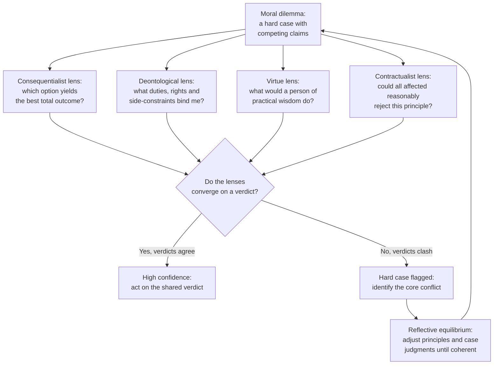

# 🧭 Ethical Frameworks in Practice

> [!abstract] TL;DR
> The major normative theories are not rival final answers you must pick between so much as **complementary analytical tools** for dissecting a hard case. **Consequentialism** asks which option produces the best outcomes; **deontology** asks which duties, rights, and side-constraints bind you regardless of outcome; **virtue ethics** asks what a person of practical wisdom would do; **contractualism** asks which principles no affected party could reasonably reject; and the **ethics of care** asks what the concrete web of relationships and dependencies demands. In practice — bioethics, war, professional codes, policy — analysts run a case through **several lenses at once**: where they *converge* you have high confidence, where they *diverge* you have located the genuinely hard question. **Principlism** and **reflective equilibrium** are the workaday methods that turn this pluralism into decisions. This note is the *applied* companion to the theory-first treatments in [[Consequentialism_and_Utilitarianism]], [[Deontology_and_Kantian_Ethics]], and [[Virtue_Ethics]].

## Intuition — analogy first

Think of a moral dilemma as a **scene you are photographing**, and each ethical framework as a **different lens or filter** you can screw onto the camera. The scene never changes — the same people, the same stakes, the same facts — but each lens **foregrounds something different** and pushes the rest into blur.

- The **consequentialist filter** is a wide-angle lens that pulls the whole future into frame: it foregrounds *outcomes* — who ends up better or worse off — and blurs the identity of who acts and how.
- The **deontological filter** is a spotlight that lands on *duties and rights*: it foregrounds the act itself, the promise kept or the line not crossed, and dims the downstream tally.
- The **virtue filter** is a portrait lens focused on the *photographer*: what does taking this shot reveal about your character and judgment?
- The **contractualist filter** is a group photo taken from *everyone's seat at once*: would each person in the frame accept the rule you are following?

No single lens gives the "true" picture — a portrait lens is not "wrong" for blurring the background. The skilled ethicist, like a skilled photographer, **shoots the same scene through several lenses and compares the exposures**. When four lenses all frame the same subject, you can trust it. When they fight over what belongs in focus, you have found the part of the moral scene that is genuinely contested — and that is exactly where careful reasoning has to go to work.

---

## How It Works

Applied ethics rarely proceeds by deducing a verdict from one grand theory. Instead it treats the frameworks as a **panel of expert consultants**, each of whom analyzes the case in its own vocabulary, after which you reconcile their reports. The mechanics of each lens:

**1. Consequentialism as a case tool.** You enumerate the options, forecast each option's outcomes for *all* affected parties, and rank options by aggregate good. The applied questions are always: *what good is being maximized?* — hedonic pleasure, satisfied **preferences**, or objective **welfare/health**? — and *how is it aggregated?* Its purest institutional form is **cost-benefit analysis (CBA)**: monetize costs and benefits, discount to present value, choose the largest net benefit. CBA is applied consequentialism with a price tag, and it inherits both the power and the pathologies of aggregation (see [[Justice_and_Rawls]] on the *separateness of persons*).

**2. Deontology as a case tool.** Instead of a running tally, you check the option against a set of **constraints**: Does it treat anyone as a *mere means*? Does it violate a **right** that functions as a *side-constraint* (a wall you may not cross even for a good outcome)? Could you will the underlying maxim as a **universal law** (the categorical imperative)? Two distinctions do most of the applied work: **acts vs omissions** (killing vs letting die) and **intending vs merely foreseeing** a harm. The latter powers the **Doctrine of Double Effect (DDE)** — a harm you foresee but do not intend, as a side effect of a good act, can be permissible where intending the same harm would not be. DDE is the engine behind palliative sedation in medicine and the discrimination/proportionality rules in *just war* theory.

**3. Virtue ethics as a case tool.** You ask not "which rule applies?" but "what would a person of good character and **practical wisdom (phronesis)** do here?" In practice this becomes the **role-model method** (what would the exemplary physician, engineer, or judge do?) and underwrites **professional ethics** and codes of conduct, where the goal is to cultivate practitioners who reliably perceive and respond well, not merely follow rules.

**4. Contractualism / contractarianism as a case tool.** Rawls's **veil of ignorance** asks you to design the rule *not knowing which affected party you will turn out to be* — a bias-stripping device for policy and institutional design. Scanlon's contractualism reframes rightness as: an act is wrong if it is disallowed by any principle that **no one could reasonably reject**. This directly models fairness disputes, foregrounding the *strongest individual objection* rather than the aggregate.

**5. Ethics of care as a corrective.** Against the impartial, universalizing tilt of the four above, care ethics foregrounds **concrete relationships, dependency, and responsibility** — the parent, the nurse, the caregiver. It is less a rival calculator than a reminder of what the impartial lenses systematically underweight.

**6. Putting them together.** The dominant applied method in medicine is **principlism** (Beauchamp & Childress): four *mid-level principles* — **autonomy, beneficence, non-maleficence, justice** — that different theories all endorse, applied and balanced case by case. When principles or frameworks conflict, you seek **reflective equilibrium**: iterate between your theoretical principles and your considered judgments about particular cases, revising each until they cohere. Convergence across lenses raises confidence; divergence flags the hard cases.



---

## Key Concepts

### Secondary — the three big lenses
- **Outcomes vs rules vs character.** The simplest map: consequentialism judges an act by its *results*, deontology by whether it obeys the right *rules and rights*, virtue ethics by what it reveals about *character*.
- **Same scene, different focus.** The frameworks are tools that highlight different features of one case, not competing verdicts you must rank once and for all.
- **Convergence is reassuring.** When "best outcome," "keeps its promises," and "what a good person would do" all point the same way, the decision is easy and safe.

### Undergraduate — the working distinctions
- **Act vs rule consequentialism.** Judge *this* act by its utility, or judge the *general rule* whose adoption maximizes utility. Rule versions protect promises and rights as reliable practices.
- **The good to be maximized.** *Hedonic* (pleasure/pain), *preference* (satisfied desires), or *welfare/objective-list* (health, knowledge, relationships). CBA usually monetizes a preference-satisfaction proxy (willingness to pay).
- **The categorical imperative & rights as side-constraints.** Act only on maxims you could universalize; never treat humanity as a *mere means*. Rights are walls, not weights — they bind *even when* crossing them would improve the tally.
- **Doctrine of Double Effect (DDE).** Four conditions: the act itself is permissible; the bad effect is *foreseen but not intended*; the bad effect is not the *means* to the good; and there is *proportionate* reason. Central to end-of-life medicine and *just war*.
- **Phronesis & the role-model method.** Practical wisdom is the perceptual skill of seeing what a situation calls for; professional ethics cultivates it via exemplars and case apprenticeship.
- **Veil of ignorance & "what we owe to each other."** Rawlsian fairness-by-ignorance for institutional design; Scanlonian *reasonable rejectability* for interpersonal wrongs.
- **The four principles (principlism).** Autonomy, beneficence, non-maleficence, justice — a shared, theory-neutral vocabulary for clinical ethics.

### Graduate — aggregation, constraints, and method
- **The pathologies of aggregation.** The **utility monster** (Nozick): strict summation can demand feeding everything to whoever converts resources into the most utility. The **separateness of persons** (Rawls, Nozick): summing welfare across people treats one person's loss as *compensable* by another's gain, though no single subject experiences the net — the deepest objection to consequentialism and to naive CBA.
- **Acts/omissions & intending/foreseeing under pressure.** Both distinctions are doing heavy lifting in DDE, in withdrawal-of-treatment debates, and in the trolley cases; their moral weight is fiercely contested (consequentialists deny they matter intrinsically).
- **Contractualism vs contractarianism.** Scanlon's contractualism is *non-aggregative and individualist* (it looks to the single strongest objection), which blocks some utilitarian trades but generates its own problem aggregating small harms across many people. Hobbesian/Gauthier *contractarianism* grounds morality in mutual advantage, which struggles with those who cannot reciprocate — precisely where **care ethics** presses.
- **CBA as institutionalized consequentialism.** Value-of-statistical-life figures, discount rates, and QALY weights are where abstract "maximize the good" becomes contested policy engineering; distributional weighting is the point of contact with **prioritarianism** and [[Justice_and_Rawls]].
- **Reflective equilibrium as the meta-method.** Narrow (coherence among your own judgments and principles) vs wide (also weighing rival theories and background arguments). It is the epistemology that makes framework-pluralism more than relativism.
- **Convergence/divergence as evidence.** Cross-framework *convergence* is treated as robustness (like agreement across independent models); *divergence* isolates the load-bearing moral assumption a case turns on.

---

## Python Demo

A "moral calculator" for a real allocation shape: **6 patients, only 3 doses** of a scarce life-saving drug. Each framework is a different allocation *rule*, and the whole point is that they pick **different patients** and encode different **efficiency-equity tradeoffs**.

```python
# Requires only numpy + matplotlib.
# Same dilemma, three ethical rules -> three different allocations.
import numpy as np
import matplotlib.pyplot as plt

# --- The dilemma: 6 patients, 3 doses of a scarce life-saving drug -----------
patients = np.array(["A", "B", "C", "D", "E", "F"])
n_doses  = 3

# baseline_health in [0, 1]: well-being WITHOUT the drug (higher = already better off)
baseline  = np.array([0.10, 0.20, 0.35, 0.55, 0.72, 0.82])
# qaly_gain: quality-adjusted life-years gained IF treated.
# Built-in tension: the already-healthier patients can gain MORE from treatment.
qaly_gain = np.array([2.0, 3.0, 4.0, 7.0, 8.0, 9.0])
# arrival order (1 = first through the door) -> a first-come procedural RIGHT
arrival   = np.array([3, 1, 5, 2, 6, 4])

def allocate(scores, k=n_doses):
    """Give the drug to the k highest-scoring patients; return a 0/1 mask."""
    winners = np.argsort(-scores, kind="stable")[:k]
    mask = np.zeros_like(scores, dtype=int)
    mask[winners] = 1
    return mask

# 1) UTILITARIAN: maximize total QALYs -> rank by raw benefit.
util_mask  = allocate(qaly_gain)

# 2) PRIORITARIAN / EGALITARIAN: concave weighting favors the worse-off.
#    score = benefit * (1 - baseline): a unit of health counts for MORE
#    when the recipient starts off badly. Equity pulls against pure efficiency.
prior_mask = allocate(qaly_gain * (1.0 - baseline))

# 3) DEONTOLOGICAL first-come-first-served: a procedural RIGHT, blind to outcomes.
#    Earlier arrival = stronger claim; QALYs are simply not consulted.
deont_mask = allocate(-arrival.astype(float))

rules = ["Utilitarian",  "Prioritarian", "Deontological"]
subs  = ["max total QALYs", "weight worse-off", "first-come right"]
masks = np.vstack([util_mask, prior_mask, deont_mask])

# --- Outcome metrics: efficiency vs equity -----------------------------------
worst_off = baseline <= 0.35                 # A, B, C are the badly-off group
totals    = masks @ qaly_gain                # total QALYs realized per rule
served_wo = masks @ worst_off.astype(int)    # worst-off patients treated per rule

print(f"{'RULE':14s}{'total QALYs':>13s}{'worst-off served':>18s}")
for r, t, w in zip(rules, totals, served_wo):
    treated = "".join(patients[masks[rules.index(r)] == 1])
    print(f"{r:14s}{t:13.1f}{w:>15d}/3   -> {treated}")

# --- Plots -------------------------------------------------------------------
fig, (ax1, ax2) = plt.subplots(1, 2, figsize=(12, 4.6))

# Panel A: WHO gets the drug under each rule
ax1.imshow(masks, cmap="Greens", aspect="auto", vmin=0, vmax=1)
ax1.set_xticks(range(len(patients)))
ax1.set_xticklabels([f"{p}\nq={q:.0f}\nh={h:.2f}"
                     for p, q, h in zip(patients, qaly_gain, baseline)])
ax1.set_yticks(range(len(rules)))
ax1.set_yticklabels([f"{r}\n({s})" for r, s in zip(rules, subs)])
ax1.set_title("Who receives the scarce drug (Rx = treated)")
for i in range(masks.shape[0]):
    for j in range(masks.shape[1]):
        ax1.text(j, i, "Rx" if masks[i, j] else "-", ha="center", va="center",
                 color="white" if masks[i, j] else "gray", fontsize=10)

# Panel B: efficiency (total QALYs) vs equity (worst-off served), twin axes
x = np.arange(len(rules))
ax2.bar(x - 0.2, totals, width=0.4, color="#2563eb", label="Total QALYs")
ax2.set_ylabel("Total QALYs (efficiency)", color="#2563eb")
ax2.set_ylim(0, 26)
ax2b = ax2.twinx()
ax2b.bar(x + 0.2, served_wo, width=0.4, color="#d97706", label="Worst-off served")
ax2b.set_ylabel("Worst-off patients served (of 3)", color="#d97706")
ax2b.set_ylim(0, 3.2)
ax2.set_xticks(x); ax2.set_xticklabels(rules)
ax2.set_title("Efficiency vs equity tradeoff")

plt.tight_layout()
plt.savefig("moral_calculator.png", dpi=120)
plt.show()
```

**What it shows.** The utilitarian rule treats **D, E, F** — the three with the largest QALY gains — realizing **24 QALYs** but abandoning *every* worst-off patient. The prioritarian rule treats **B, C, D**, sacrificing efficiency (**14 QALYs**) to serve two of the three badly-off patients. The first-come deontological rule treats **A, B, D** (**12 QALYs**), consulting neither benefit nor need — yet its blind procedure happens to reach the very worst-off patient A. Three defensible rules, three different people saved: the numbers make the *equity-efficiency* and *aggregation-vs-individual-claim* tradeoffs each framework encodes fully explicit.

---

## Real-World Applications

- **Clinical ethics (principlism).** Hospital ethics committees run cases through autonomy / beneficence / non-maleficence / justice rather than one grand theory — the applied default in medicine worldwide.
- **End-of-life medicine (DDE).** Palliative sedation and high-dose opioids that may hasten death are justified via double effect: the intended good is relief of suffering; shortened life is foreseen, not intended.
- **Pandemic and ICU triage.** Ventilator and vaccine allocation protocols (e.g., during COVID-19) blend *utilitarian* life-years-saved criteria with *egalitarian/prioritarian* tie-breakers and *procedural* fairness — the exact tension in the demo above.
- **Health-policy CBA / QALYs.** Agencies such as the UK's NICE use cost-per-QALY thresholds — applied consequentialism — while critics invoke the *separateness of persons* and disability-discrimination objections.
- **Just war and the laws of armed conflict.** Discrimination (non-combatant immunity) and proportionality operationalize deontological constraints plus DDE for foreseen civilian harm.
- **Professional and business ethics.** Engineering, legal, and medical codes lean on *virtue*/role-model reasoning: cultivate practitioners of good judgment rather than enumerate every rule.
- **Public policy design.** Rawls's veil of ignorance is used as a heuristic for fair institutional and tax design; regulatory CBA (e.g., value-of-statistical-life analysis) is its consequentialist counterpart.
- **AI and autonomous systems.** Self-driving-car "trolley" tradeoffs, algorithmic fairness, and content-moderation policy are argued explicitly in consequentialist vs deontological vs contractualist terms.

---

## Common Pitfalls

- **Framework shopping (motivated reasoning).** Picking whichever lens rationalizes a conclusion you already wanted. The safeguard is committing to run *all* the lenses and reporting divergence honestly.
- **Treating frameworks as mutually exclusive.** In practice they are complementary diagnostic tools; a case analysis that uses only one is usually incomplete, not "principled."
- **False precision in cost-benefit analysis.** Monetizing lives and discounting the future can launder contested value judgments as arithmetic; a confident number can hide a buried moral assumption.
- **Ignoring the separateness of persons.** Aggregation (utilitarian or CBA) can license sacrificing an individual for a net gain no single subject experiences — the standard trap when only the consequentialist lens is used.
- **Conflating act and rule consequentialism.** Many "gotcha" objections hit *act* versions but are deflected by *rule* versions; sloppy application blurs the two.
- **Misusing double effect.** DDE is abused when the "unintended" harm is really the *means* to the good, or when "proportionate reason" is asserted rather than argued — it is a test to pass, not a label to apply.
- **Mistaking convergence for proof.** Agreement across lenses raises confidence but is not truth; shared blind spots (e.g., all impartialist theories underweighting care relationships) can make four lenses wrong together.
- **Overusing impartial frameworks in intimate contexts.** Applying utilitarian or contractualist calculus to family and caregiving relations is exactly what care ethics warns against.

---

## Related Concepts

- [[Consequentialism_and_Utilitarianism]] — the theoretical treatment of the outcomes lens; this note applies its act/rule split and aggregation problems to real cases and CBA.
- [[Deontology_and_Kantian_Ethics]] — the theory behind duties, the categorical imperative, and rights-as-side-constraints; here operationalized via DDE and the acts/omissions distinction.
- [[Virtue_Ethics]] — the character lens; applied here as phronesis, the role-model method, and professional ethics.
- [[Justice_and_Rawls]] — the veil of ignorance and difference principle; the source of the contractualist lens and the *separateness of persons* critique of aggregation.
- [[The_Social_Contract]] — the contractarian/contractualist tradition Rawls and Scanlon extend, supplying the "what we owe to each other" lens.
- [[Liberty_and_Rights]] — how rights function as constraints on outcome-maximizing action, central to the deontological lens.
- [[Applied_Ethics]] — the Philosophy-vault survey of ethics applied to concrete domains; this note is its methods-focused, framework-comparison companion.
- [[Metaethics]] — whether any of these frameworks tracks moral *truth*, and what reflective equilibrium justifies epistemically.
- [[What_Is_Ethics]] — situates these normative frameworks within the broader map of moral philosophy.

---

## Review Questions

1. **(Comprehension)** A patient is dying in pain; a dose of opioids sufficient to relieve the pain may also hasten death. Using the four conditions of the Doctrine of Double Effect, explain why a physician may permissibly administer it, and identify which condition a lethal *euthanasia* injection would fail.
2. **(Application)** Re-run the drug-allocation demo in your head with a new patient G who has baseline health 0.05 (the worst off) but a QALY gain of only 1.0. Under which of the three rules — utilitarian, prioritarian, first-come — does G receive the drug, and what does the pattern reveal about how each framework trades efficiency against helping the worst-off?
3. **(Synthesis / evaluation)** Two analysts examine an autonomous-vehicle crash-avoidance policy. The consequentialist lens and the contractualist lens *converge* on the same verdict; the deontological lens *diverges*. Explain how the convergence/divergence heuristic and reflective equilibrium should shape their next move, and why "three-out-of-four frameworks agree" is not, by itself, a proof that the majority verdict is correct.

---

## Sources

- Beauchamp, T. L., & Childress, J. F. (2019). *Principles of Biomedical Ethics* (8th ed.). Oxford University Press. (Principlism and the four mid-level principles.)
- Rawls, J. (1971). *A Theory of Justice*. Harvard University Press. (Original position, veil of ignorance, separateness of persons.)
- Scanlon, T. M. (1998). *What We Owe to Each Other*. Harvard University Press. (Contractualism and reasonable rejectability.)
- Foot, P. (1967). "The Problem of Abortion and the Doctrine of the Double Effect." *Oxford Review*, 5. (Applied DDE and the acts/omissions distinction.)
- Nozick, R. (1974). *Anarchy, State, and Utopia*. Basic Books. (Utility monster; rights as side-constraints.)
- Held, V. (2006). *The Ethics of Care: Personal, Political, and Global*. Oxford University Press. (Care as a corrective to impartialist theories.)

---

#ethics #normative-ethics #consequentialism #deontology #virtue-ethics
