# ⚖️ Metaethics and Moral Disagreement

> [!abstract] TL;DR
> Metaethics asks what we are *doing* when we make a moral claim — reporting a fact, expressing a feeling, or issuing a command — and whether any moral claim is objectively true. Applied ethics usually *assumes* an answer without noticing. This note takes the applied reader's view: it maps the main positions (**cognitivism vs non-cognitivism**, **realism vs anti-realism**, plus **error theory**, **constructivism**, and **relativism**), works through the **argument from moral disagreement** (does deep, persistent disagreement prove there are no moral facts?), and shows the practical stakes: if relativism is true, cross-cultural criticism and universal **human rights** look shaky; if realism is true, we can be *wrong* and there is something to discover. The pragmatic escape hatch is **overlapping consensus** (Rawls) — real-world ethics can often proceed even when the metaethics stays unsettled.

## Intuition

**Analogy.** Two neighbours are arguing over a fence. One says *"cutting down that shared oak was wrong."* The other says *"no it wasn't."* Now step back and ask a stranger question: when the first neighbour says *"wrong,"* what kind of move is she making?

Three answers compete, and every heated moral argument sits on one of them without saying so:

- **Reporting a fact** — "It is wrong" is like "it is raining." There is a moral fact out there and she is describing it; one of them is simply *mistaken*, the way you can be mistaken about the weather.
- **Expressing a feeling** — "It is wrong" is really "*Boo* to cutting the oak!" — a disguised emotion, so there is no fact for either party to be right or wrong about, only clashing attitudes.
- **Issuing a command** — "It is wrong" is really "*Don't* cut oaks!" — a universal prescription she is committing herself and everyone to, not a description of anything.

That is the whole of metaethics in one fence dispute. Notice the argument is **not** about whether cutting the oak was wrong — that is first-order **normative** ethics. Metaethics asks what *sort of thing* the judgment is, whether it can be *true*, and how anyone could *know*. And that abstract-sounding question turns out to decide something intensely practical: whether a human-rights court in one country has any standing to tell another country it is doing something genuinely *wrong*, or is merely broadcasting its own local "boo."

> For the deep, positions-first treatment (Frege–Geach, the open-question argument, companions-in-guilt), see [[Metaethics]]. This note is the **applied companion**: what turns on the answer, and how to reason well when the answer is contested.

---

## How It Works

### The three questions metaethics stacks under every moral debate

1. **Semantics** — What does *"X is wrong"* even *mean*? Does it state a fact (and so is capable of truth or falsity) or perform some other job (venting, commanding, planning)?
2. **Ontology** — Are there moral *facts* or *properties* at all? If so, are they part of the natural world, mind-independent, or built by us?
3. **Epistemology** — If moral facts exist, *how could we ever know them* — by reason, intuition, perception, or reflective adjustment of our beliefs?

### The two master axes

- **Cognitivism vs non-cognitivism** (a claim about *semantics*): cognitivists say a moral utterance expresses a **belief** that is true or false; non-cognitivists say it expresses a **non-belief attitude** — approval, disapproval, a plan, a prescription. Non-cognitivism comes in flavours: **emotivism** ("boo/hurrah"), **prescriptivism** (moral claims are universalizable imperatives — R.M. Hare), and **expressivism** (attitudes that *earn back* the surface grammar of truth — Blackburn, Gibbard).
- **Realism vs anti-realism** (a claim about *ontology*): realists say there are **objective, mind-independent moral facts**; anti-realists deny this. Realism splits into **naturalism** (moral facts just *are* natural facts about welfare, flourishing, cooperation — discoverable like other facts) and **non-naturalism** (moral facts are real but *sui generis*, known by intuition — Moore, Parfit).

### The anti-realist family (the positions that matter most for applied ethics)

- **Error theory** (J.L. Mackie): moral language *tries* to describe objective values, but no such values exist, so **all** positive moral claims are systematically *false* — the way all "the ghost did it" claims are false. Mackie argues from **queerness** (objective values would be metaphysically and epistemically bizarre) and from **relativity/disagreement** (variation is better explained by differing ways of life than by differing perception of one moral reality).
- **Constructivism** (Rawls, Korsgaard): moral truths are not *found* but *constructed* — they are whatever principles suitably situated rational agents would agree to. This keeps genuine right-and-wrong (so it is not "anything goes") without positing a moral realm floating free of agents.
- **Relativism**: moral truth is real but **indexed** — true *relative to* a culture (cultural relativism) or an individual (subjectivism). "Wrong-for-us" and "right-for-them" can both hold with no further fact settling it.

### Two foundations that constrain everything above

- **The is–ought gap** (Hume): a valid deductive argument cannot squeeze an *ought* conclusion out of purely *is* premises without a hidden normative premise. You cannot read morality straight off the facts of nature.
- **The naturalistic fallacy** (Moore): you cannot simply *define* "good" as any natural property (pleasure, fitness, what-society-approves), because "this maximizes pleasure, but is it *good*?" always remains a sensible, open question.

### Flow / Architecture — the metaethics landscape and its applied payoff

```mermaid
flowchart TD
    Q["Two people say<br/>'that practice is wrong'"] --> A{"Are moral claims<br/>truth-apt beliefs?"}
    A -->|"No, they express attitudes"| NC["Non-cognitivism<br/>anti-realist"]
    NC --> EMO["Emotivism<br/>'Boo to it!'"]
    NC --> PRE["Prescriptivism<br/>'Do not do it!'"]
    NC --> EXP["Expressivism<br/>attitudes that mimic truth-talk"]
    A -->|"Yes, they can be true or false"| C["Cognitivism"]
    C --> T{"Are any of them<br/>actually true?"}
    T -->|"None, all systematically false"| ERR["Error theory<br/>Mackie: queerness plus disagreement"]
    T -->|"True but mind-dependent"| CON["Constructivism<br/>true by rational agreement<br/>Rawls, Korsgaard"]
    T -->|"True but culture-indexed"| REL["Relativism<br/>true relative to culture or person"]
    T -->|"True and mind-independent"| RE["Moral realism"]
    RE --> NATU["Naturalism<br/>moral facts are natural facts"]
    RE --> NONN["Non-naturalism<br/>sui generis moral facts"]
    ERR --> APP["Applied stakes<br/>Can we criticise other cultures?<br/>Are human rights discoverable<br/>or merely imposed?"]
    REL --> APP
    CON --> APP
    RE --> APP
    style Q fill:#7c3aed,color:#fff
    style A fill:#d97706,color:#fff
    style T fill:#d97706,color:#fff
    style ERR fill:#dc2626,color:#fff
    style REL fill:#db2777,color:#fff
    style CON fill:#0891b2,color:#fff
    style RE fill:#059669,color:#fff
    style APP fill:#1e3a8a,color:#fff
```



---

## Key Concepts

### Secondary (explain it to a curious beginner)

- **First-order vs meta-level.** *"Is euthanasia wrong?"* is first-order ethics. *"Is there even a fact of the matter about whether euthanasia is wrong?"* is metaethics. Same words, different altitude.
- **Objective vs relative.** An **objective** claim is true regardless of who is judging; a **relative** claim is true only "for" a culture or a person. Metaethics asks which kind moral claims are.
- **Descriptive vs normative relativism.** *Descriptive* relativism is the uncontroversial empirical fact that cultures **do** disagree about morals. *Normative/metaethical* relativism is the contested philosophical claim that therefore there is **no fact** making one of them right. The second does **not** follow automatically from the first — that inference is the whole debate.

### Undergraduate (the working vocabulary)

- **The argument from moral disagreement.** Premise: moral disagreement is deep, widespread, and persists even among informed, sincere people. Conclusion: therefore there are no objective moral facts (if there were, we would have converged, as we do in science). This is anti-realism's most intuitive weapon and the reason relativism feels obvious.
- **The realist replies** (three moves worth memorising):
  1. **Non-moral roots.** Much apparent *moral* disagreement is really disagreement over **non-moral facts** — whether a fetus is a person, whether a policy actually reduces harm, what a god commanded. Resolve the facts and the moral gap often shrinks.
  2. **Disagreement is everywhere.** Physicists, historians, and mathematicians disagree persistently too, yet we do not conclude there is no objective physics. Disagreement alone does not refute objectivity.
  3. **Distorting factors.** Self-interest, tradition, and limited information predictably warp moral perception, so persistent disagreement is *expected* even if there are moral facts.
- **Moral epistemology.** If there are moral truths, how do we access them? Candidates: **rational intuition** (some claims are self-evident — gratuitous cruelty is wrong), **reason** (derive principles from consistency, as in Kant), and **reflective equilibrium** (Rawls) — go back and forth adjusting principles and case-judgments until they cohere, the way you fit a scientific theory to data.
- **The tolerance paradox.** Relativism is often adopted to *ground* tolerance ("who are we to judge?"). But "you ought to be tolerant of all cultures" is itself a **universal, non-relative** moral claim — so relativism cannot consistently mandate tolerance. And if a culture's values include *intolerance*, relativism gives you no standing to object.

### Graduate (where the real difficulty lives)

- **Error theory is not nihilism-in-practice.** A Mackiean can adopt **moral fictionalism** — keep using moral talk as a useful, action-coordinating fiction while denying it is literally true — much as we keep talking about sunrises after Copernicus.
- **Constructivism as the applied ethicist's friend.** By locating moral truth in what agents *would* agree to under fair conditions, constructivism delivers robust, criticisable moral standards **without** the metaphysical cost of realism — attractive precisely because it can underwrite human-rights talk while dodging the queerness objection.
- **Overlapping consensus** (Rawls, *Political Liberalism*). The decisive practical insight: a stable public morality does **not** require agreement on metaethics. A Kantian, a utilitarian, and a religious natural-law theorist can each endorse *"torture is prohibited"* **from within their own incompatible foundations**. Applied ethics can therefore proceed on shared conclusions while the deep disagreement about *why* stays permanently open.
- **Convergence as evidence.** Some realists argue that where inquiry *does* drive moral convergence (the near-universal modern rejection of slavery, chattel ownership of spouses, torture-as-entertainment) it looks less like coincidence and more like a signal of a mind-independent target being tracked over time.

---

## Python Demo

Is moral disagreement *resolvable*? One way to make the question precise is to model deliberation as an **opinion-dynamics** process and ask under what conditions a population of morally divided agents **converges to consensus**, **fragments into stable camps**, or **polarizes**. We use the classic **Hegselmann–Krause bounded-confidence** model: each agent holds a moral opinion in `[0, 1]` and, each round, moves toward the *average* of only those others whose opinions are within an **openness threshold** `epsilon` — you only update toward people you are willing to take seriously. The single knob `epsilon` (how open agents are to differing views) turns out to control which of the three outcomes you get — a compact, testable picture of when disagreement can and cannot be argued away.

```python
# Bounded-confidence (Hegselmann-Krause) model of moral deliberation.
# One knob -- openness threshold epsilon -- flips the population between
# consensus, a few stable camps, and hard fragmentation.
import numpy as np
import matplotlib.pyplot as plt

rng = np.random.default_rng(42)

def deliberate(opinions, epsilon, steps):
    """Each round, every agent averages the opinions within epsilon of its own."""
    N = len(opinions)
    traj = np.zeros((steps + 1, N))
    x = opinions.copy()
    traj[0] = x
    for t in range(steps):
        x_new = np.empty_like(x)
        for i in range(N):
            trusted = np.abs(x - x[i]) <= epsilon   # who agent i listens to
            x_new[i] = x[trusted].mean()
        x = x_new
        traj[t + 1] = x
    return traj

def count_camps(final, tol=1e-2):
    """Number of distinct opinion clusters that survive."""
    vals = np.sort(final)
    return 1 + int(np.sum(np.diff(vals) > tol))

N, STEPS = 60, 25
init = rng.uniform(0.0, 1.0, N)          # same starting spread for a fair comparison
cases = [(0.05, "Low openness"), (0.15, "Moderate openness"), (0.35, "High openness")]

fig, axes = plt.subplots(1, 3, figsize=(15, 5), sharey=True)
for ax, (eps, name) in zip(axes, cases):
    traj = deliberate(init, eps, STEPS)
    camps = count_camps(traj[-1])
    for i in range(N):
        ax.plot(range(STEPS + 1), traj[:, i], lw=0.8, alpha=0.55)
    ax.set_title(f"{name}\nepsilon={eps} -> {camps} surviving camp(s)")
    ax.set_xlabel("deliberation round")
    ax.set_ylim(0, 1)
    print(f"epsilon={eps:<4}: {camps} camp(s) after {STEPS} rounds")

axes[0].set_ylabel("moral opinion  (0 = permissible ... 1 = wrong)")
fig.suptitle("When is moral disagreement resolvable? Openness controls the outcome",
             fontsize=13)
plt.tight_layout()
plt.show()
```

**What you see.** With **low openness** (`epsilon = 0.05`) the population freezes into many stubborn camps — persistent disagreement, no convergence. With **moderate openness** it settles into a *few* stable clusters — pluralism, not consensus. With **high openness** (`epsilon = 0.35`) everyone converges to a single shared view. The lesson is deliberately double-edged: convergence is possible **but conditional**. A realist reads the high-`epsilon` regime as evidence that sincere, mutually-attentive inquiry *tracks a common target*; an anti-realist notes that convergence here is a pure artifact of social averaging with **no truth-term anywhere in the model** — agents can converge on anything, or nothing. The model shows *when* disagreement dissolves, but stays silent on *whether the consensus is correct* — which is exactly the metaethical residue no dynamics can settle.

---

## Real-World Applications

> **Example — The Universal Declaration of Human Rights (1948) as overlapping consensus.** The drafting committee spanned Confucian, Islamic, Catholic, Marxist, and liberal-secular delegates who profoundly disagreed about *why* humans have rights. Jacques Maritain's famous remark captured the strategy: *"we agree about the rights but on condition that no one asks us why."* The UDHR is a working monument to Rawls's point — a durable applied-ethics instrument built on **shared conclusions despite unresolved metaethical foundations**. It is also the pressure point where relativism bites: a normative relativist has trouble explaining how a *universal* declaration could be binding on a culture that rejects it.

- **Cross-cultural business and medical ethics.** A multinational deciding whether to follow local norms on bribery, gender segregation, or informed consent is choosing, implicitly, between relativism ("when in Rome") and realism ("some practices are wrong wherever they occur"). Naming the metaethical assumption improves the decision.
- **Bioethics committees.** They routinely reach agreement on protocols (e.g., limits on gene editing) via reflective equilibrium and overlapping consensus, without members agreeing on whether the underlying values are objective — a live demonstration that applied ethics need not wait for metaethics.
- **AI value alignment.** "Whose values, and are any of them *correct*?" is a metaethics question in engineering clothing. Constructivist framings (align to what suitably idealized humans would agree to) are attractive precisely because they sidestep needing moral realism to be true.

---

## Common Pitfalls

- **Sliding from descriptive to normative relativism.** "Cultures disagree about morality" (true, empirical) does **not** entail "no culture is right" (contested, philosophical). Anthropology's *methodological* relativism — understand a culture on its own terms before judging — is a research ethic, **not** the metaethical claim that judgment is impossible (see [[Classical_Anthropological_Theory]], which draws this exact line).
- **Thinking anti-realism means "anything goes."** An expressivist can condemn cruelty with full force; an error theorist can be a fictionalist; a constructivist has robust standards. Denying that torture is *objectively* wrong is not endorsing torture — do not confuse a claim about moral *metaphysics* with a claim about how to *behave*.
- **Confusing metaethics with normative ethics.** A committed metaethical realist still has to do the hard first-order work of figuring out *which* acts are right. Realism buys you a *target*, not the *answers*.
- **The self-refutation of naive relativism.** "All truth is relative" and "you ought to tolerate every culture" are both stated as **non-relative universals**, so consistent relativism cannot assert them. Watch for relativism smuggling in the very objectivity it denies.
- **Treating disagreement as automatically decisive.** Persistent disagreement is real evidence, but physics and mathematics have it too. The realist's job is to show moral disagreement traces to non-moral facts and distorting factors; the anti-realist's job is to show a residue of *irreducible* disagreement remains. Do not grant either side the inference for free.
- **Merging Hume's gap with Moore's fallacy.** They point the same way but differ: Hume's is a **logical** point about deductive inference (no *ought* from *is*); Moore's is a **semantic** point about the meaning of "good." Keep them distinct.

---

## Related Concepts

- [[Metaethics]] — the deep, positions-first philosophical treatment (semantics/ontology/epistemology, Frege–Geach, open-question argument); this note is its applied companion.
- [[Applied_Ethics]] — where first-order moral problems get solved; the reason metaethical skepticism need not paralyze practice.
- [[What_Is_Ethics]] — the base distinction between normative ethics and metaethics, and the naturalistic fallacy in outline.
- [[The_Sophists_and_Relativism]] — Protagoras' "man is the measure of all things," the ancient origin of the relativism debate.
- [[Classical_Anthropological_Theory]] — Boas and cultural relativism; explicitly separates *methodological* relativism from *moral* relativism, the pitfall above.
- [[Human_Rights_Law]] — the practical arena where realism-vs-relativism has direct legal stakes (universality vs cultural sovereignty).
- [[Theories_of_Justification]] — moral epistemology parallels general epistemology; reflective equilibrium is a coherentist justification structure.
- [[What_Is_Knowledge]] — the question of how we could *know* moral facts mirrors the analysis of knowledge and justified belief.

---

## Review Questions

1. **Conceptual.** Distinguish *cognitivism/non-cognitivism* from *realism/anti-realism*, and locate emotivism, error theory, constructivism, and naturalist realism on both axes. Why can these two distinctions not be collapsed into a single one?
2. **Scenario.** A human-rights NGO condemns a foreign government's practice as "a violation of universal rights." A relativist official replies, "those are *your* values, not ours." Reconstruct the official's argument, then give the two strongest responses available to (a) a moral realist and (b) a Rawlsian who wants to defend the criticism *without* claiming moral realism is true.
3. **Trade-off.** The argument from moral disagreement is anti-realism's best case. Lay out the argument, then evaluate the three standard realist replies (non-moral roots, ubiquity of disagreement, distorting factors). Does the opinion-dynamics model in the demo *support* or *undercut* the realist claim that sincere inquiry converges on truth — and why is convergence, by itself, not enough to establish realism?

---

## Sources

- Mackie, J.L. (1977). *Ethics: Inventing Right and Wrong.* Penguin. (Error theory; the arguments from relativity/disagreement and queerness.)
- Rawls, J. (1993). *Political Liberalism.* Columbia University Press. (Overlapping consensus; reflective equilibrium.)
- Sayre-McCord, G. (2023). "Metaethics." *Stanford Encyclopedia of Philosophy.* https://plato.stanford.edu/entries/metaethics/
- Gowans, C. (2021). "Moral Relativism." *Stanford Encyclopedia of Philosophy.* https://plato.stanford.edu/entries/moral-relativism/
- Hegselmann, R. & Krause, U. (2002). "Opinion Dynamics and Bounded Confidence: Models, Analysis and Simulation." *Journal of Artificial Societies and Social Simulation* 5(3). https://www.jasss.org/5/3/2.html

---

#ethics #metaethics #moral-realism #relativism #moral-disagreement
