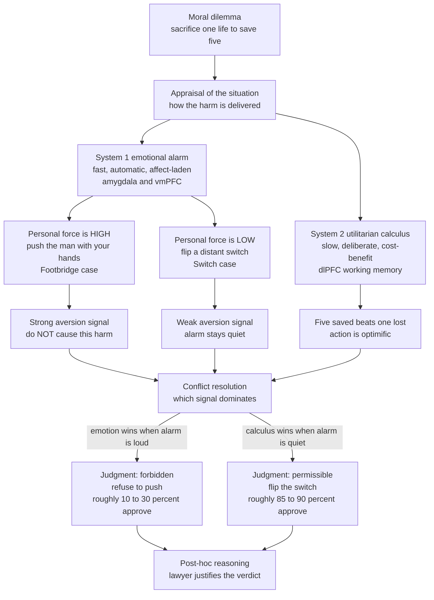

# 🧠⚖️ Moral Psychology and Intuitions

> [!abstract] TL;DR
> **Moral psychology** is the *empirical* side of ethics: instead of asking what we *ought* to do, it asks how humans *actually* form moral judgments. The dominant finding of the last three decades is deflationary for the rationalist picture — most moral verdicts arrive fast, automatic, and affect-laden, and much of our "reasoning" is **post-hoc justification** of a gut feeling we already had (Haidt's *social intuitionist model* — "the emotional dog and its rational tail"). Greene's dual-process work locates the mechanism: an **emotional alarm** fires hard for up-close, personal harm (pushing a man off a footbridge) and barely at all for impersonal harm (flipping a switch), which is why people accept the switch and refuse the push even though both trade one life for five. This raises the **debunking worry** for normative ethics — if an intuition is an evolved heuristic or an emotional artifact, does it carry any justificatory authority?

---

## Intuition

**Analogy: the lawyer, not the judge.**

Imagine you are told a story: a family's dog is killed by a car, so the family cooks and eats it for dinner. No one is harmed, nothing is stolen, nobody even knows. Most people instantly feel it is *wrong* — and only then start scrambling for a reason ("it might make them sick," "someone could see"). When each reason is knocked down, the feeling of wrongness does not budge. People become **"morally dumbfounded"**: certain it is wrong, unable to say why, and unwilling to give up the verdict.

That is the core empirical claim. Your moral mind is usually not a **judge** who hears arguments and *then* rules. It is a **lawyer** who has already been handed the verdict by a fast, emotional intuition and whose job is to build the case *afterward*. The conscious reasoning we are so proud of is frequently the tail; the intuitive, affect-laden dog is what actually wags. Ethics-as-calm-calculation is the exception; ethics-as-gut-reaction-plus-rationalization is the default.

---

## How It Works

### Core Mechanics

**1. The rationalist starting point (Kohlberg).** For most of the 20th century, moral psychology was *rationalist*: Piaget and then Kohlberg treated moral maturity as a ladder of ever-more-sophisticated *reasoning* about justice, climbing from "avoid punishment" (preconventional) through "obey the law" (conventional) to abstract universal principles (postconventional). Judgment was assumed to *follow from* reasoning. (See [[Moral_Development]].) The problem: reasoning ability turned out to be a poor predictor of moral *behavior*, and people reach confident verdicts long before — and often independent of — any articulable argument.

**2. The intuitionist turn (Haidt's social intuitionist model, 2001).** Haidt inverted the causal arrow. In the **social intuitionist model**, a situation triggers a fast, automatic **moral intuition** (a flash of approval or disgust); the *judgment* follows almost immediately; and *reasoning* is recruited afterward, mostly to justify the judgment to oneself and persuade others. Private reasoning rarely overturns your own intuition — but *other people's* arguments and the social pull of a group can seed new intuitions. Hence "social" intuitionism: moral change is mostly interpersonal, not the fruit of solitary logic.

**3. Moral Foundations Theory (Haidt & Graham).** If intuitions come first, *which* intuitions? MFT proposes a small set of evolved, culturally tuned "taste receptors" of the moral sense:
- **Care / Harm** — sensitivity to suffering and cruelty.
- **Fairness / Cheating** — reciprocity, proportionality, justice.
- **Loyalty / Betrayal** — group solidarity, "us vs them."
- **Authority / Subversion** — respect for hierarchy, tradition, legitimate order.
- **Sanctity / Degradation** — purity, disgust, the sacred vs the profane.
- **Liberty / Oppression** — resentment of domination and coercion (added later).

The politically load-bearing finding: self-described progressives rest moral judgment mostly on **Care** and **Fairness**, while conservatives draw on **all** foundations more evenly, giving substantial weight to Loyalty, Authority, and Sanctity. Much intractable political disagreement is not one side being irrational — it is different foundations being *active*. (See [[Political_Psychology_and_Ideology]].)

**4. Dual-process mechanism (Greene's fMRI work).** Greene supplied the neural "how." Scanning people as they judged **trolley dilemmas**, he found two competing processes (a moral instance of general [[Dual_Process_Theory]]):
- A fast, **emotional/intuitive** process (engaging medial prefrontal cortex, amygdala, posterior cingulate) that generates a strong prepotent **aversion to causing harm up close and personally**.
- A slow, **controlled/utilitarian** process (engaging dorsolateral prefrontal cortex, the brain's cost-benefit machinery) that computes "5 > 1, so act."

The decisive variable is **personal force / "up-closeness"**: in the **Switch** case you divert a trolley by flipping a lever (impersonal — weak alarm), and ~85–90% approve killing one to save five. In the **Footbridge** case you must *shove* a large man off a bridge with your own hands (personal — the emotional alarm screams), and only ~10–30% approve, *despite identical arithmetic*. The utilitarian answer wins when the emotional signal is quiet and loses when it is loud.

**5. Moral emotions and their evolutionary origins.** The "alarms" are specific emotions, each doing adaptive work: **empathy/sympathy** (motivates care), **guilt** (repairs relationships you damaged), **shame** (protects standing in the group), **disgust** (polices purity/sanctity, co-opted from pathogen avoidance), **gratitude** and **moral outrage/anger** (enforce reciprocity by rewarding cooperators and punishing cheats). Evolutionary theory explains why such feelings exist at all: **kin selection** (Hamilton) makes sacrifice for relatives pay in gene copies; **reciprocal altruism** (Trivers) and **repeated-game cooperation** (tit-for-tat, indirect reputation) make it pay to be — and to *feel* — trustworthy, guilty, and vengeful. Moral emotions are the proximate machinery implementing the ultimate logic of the [[Cooperation_and_Evolutionary_Game_Theory|evolution of cooperation]]. (See [[Foundations_of_Evolutionary_Psychology]].)

**6. The debunking worry.** Here is where empirical psychology collides with **normative ethics**. If a widely shared intuition is really the output of an evolved heuristic calibrated for ancestral small-group life, or a hardwired emotional reflex to *physical proximity*, why should it carry any **justificatory authority** about what is *actually right*? Greene argues the footbridge aversion tracks a **morally irrelevant** feature — whether harm is delivered by muscle or by a mechanism — and should therefore be *distrusted*, tilting the argument toward utilitarian conclusions. Others (e.g., defenders of intuition as evidence) reply that *every* moral belief has some causal genealogy, so a genealogy alone cannot selectively debunk the intuitions you happen to dislike. This is the live tension moral reasoning must adjudicate. (See [[Metaethics]].)

### Flow / Architecture



---

## Key Concepts

### Secondary (intuitive level)

- Most moral judgments feel like a **gut reaction**, not a calculation — you *feel* something is wrong before you can say why.
- We are good at inventing reasons *after* the fact to defend feelings we already had. Haidt calls this **"the emotional dog and its rational tail."**
- The **trolley problem**: almost everyone will flip a switch to redirect a runaway trolley so it kills one person instead of five — but almost no one will *push* a person off a bridge to stop it, even though the trade (one life for five) is the same. The difference is that pushing *feels* horrifying.
- People care about different moral "flavors": kindness and fairness, but also loyalty, respect for authority, and purity. Which flavors you weigh most heavily lines up with your politics.

### Undergraduate (mechanistic level)

- **Rationalism vs intuitionism:** Kohlberg's stages assume judgment *follows* reasoning; Haidt's **social intuitionist model** reverses it — intuition → judgment → post-hoc reasoning, with genuine change coming socially rather than from private logic.
- **Moral dumbfounding:** the empirical signature of intuitionism — subjects stay certain of a verdict after every stated reason has been refuted (harmless incest, eating the family dog, cleaning a toilet with a flag).
- **Moral Foundations Theory:** Care, Fairness, Loyalty, Authority, Sanctity, (Liberty). Progressives weight Care/Fairness; conservatives spread weight across all — a mechanistic account of *why* moral debate is often two groups with different active foundations talking past each other.
- **Dual-process moral judgment (Greene):** an automatic emotional response vs a controlled utilitarian computation. The **personal/impersonal distinction** (personal force, "up-closeness") predicts the Switch-vs-Footbridge gap; cognitive load and time pressure *reduce* utilitarian responding, drugs and lesions that blunt emotion *increase* it.
- **Moral emotions:** guilt, shame, disgust, empathy, gratitude, moral outrage — each an evolved enforcement/repair mechanism, not noise.

### Graduate (theoretical and critical level)

- **What "intuition" is doing evidentially:** intuitionists treat considered moral intuitions as *data* (like perceptions) that theories must fit — the method of **reflective equilibrium**. Debunkers treat them as *symptoms* to be explained away. The whole dispute turns on whether a causal explanation of a belief is also a *defeater* for it.
- **The debunking argument, precisely:** (i) intuition X is caused by process P; (ii) P is not truth-tracking with respect to the moral facts (it tracks proximity, kinship, disgust, in-group cues); therefore (iii) X gives us no reason to believe its content. Greene runs this against deontological intuitions specifically; Singer generalizes it to license a more impartial, utilitarian ethic. Street runs a *global* version (the "Darwinian Dilemma") threatening moral realism itself.
- **The symmetry/self-undermining objection:** every moral belief — including utilitarian ones — has an evolutionary/psychological genealogy. If genealogy debunks, it debunks *everything*, so the debunker owes a principled reason why *these* intuitions (emotional, deontological) are corrupted while *those* (the impartial calculus) are trustworthy. Greene's answer: distrust the ones sensitive to demonstrably morally-irrelevant factors.
- **"Is" does not settle "ought" (Hume's guillotine):** descriptive moral psychology cannot, by itself, entail a normative conclusion. Its bite is *indirect* — it can show that a purported justification is actually a rationalization, that an intuition tracks an irrelevant variable, or that a principle we endorse is not the one actually driving our verdicts. Adjudicating that bite is the job of normative moral reasoning, not psychology.
- **Replication caveats:** several load-bearing findings (some moral-priming and cleanliness/disgust effects, the strong reading of ego-depletion, parts of the embodied-morality literature) have weakened under replication. The *core* dual-process trolley pattern is robust; the surrounding "emotion contaminates judgment" studies are more contested than popular accounts suggest.

---

## Python Demo

```python
# Greene's dual-process account of the trolley/footbridge dissonance.
# Two competing signals decide whether a harmful-but-optimific act is approved:
#   (1) a UTILITARIAN drive  -> favours acting (5 saved > 1 lost), ~constant
#   (2) an EMOTIONAL AVERSION -> opposes acting, scaling with "personal force"
#       (emotional salience s): strong for an up-close PUSH (footbridge),
#       weak for an impersonal SWITCH.
# We sweep emotional salience from 0 (fully impersonal) to 1 (maximally
# personal) and predict the population APPROVAL RATE of the harmful action,
# reproducing the large switch-vs-footbridge gap.

import numpy as np
import matplotlib
matplotlib.use("Agg")
import matplotlib.pyplot as plt

rng = np.random.default_rng(0)

# --- Model of a single decision ------------------------------------------
# Net "approve" score for one person on one dilemma:
#     score = w_util * utilitarian_benefit  -  w_emot * emotional_salience  + noise
# Approve the harmful-but-optimific act iff score > 0.
# Individuals differ in how much they weight the calculus vs the alarm.

N = 40000                     # simulated people per dilemma
util_benefit = 1.0            # 5 saved minus 1 lost, normalised; CONSTANT across cases

def approval_rate(salience):
    # Heterogeneous population: utilitarian weight and emotional sensitivity vary.
    w_util = rng.normal(1.0, 0.35, N)          # strength of cost-benefit reasoning
    w_emot = np.clip(rng.normal(2.2, 0.6, N), 0.0, None)  # sensitivity to the alarm
    noise  = rng.normal(0.0, 0.25, N)          # situational/idiosyncratic noise
    score  = w_util * util_benefit - w_emot * salience + noise
    return np.mean(score > 0.0)

salience_grid = np.linspace(0.0, 1.0, 101)
approval = np.array([approval_rate(s) for s in salience_grid])

# --- The two canonical cases as points on the same curve -----------------
s_switch, s_footbridge = 0.08, 0.90            # low vs high personal force
a_switch      = approval_rate(s_switch)
a_footbridge  = approval_rate(s_footbridge)

print("Approval of harmful act by emotional salience (personal force):")
print(f"  SWITCH     (salience={s_switch:.2f}) : {a_switch*100:5.1f}% approve  <- impersonal")
print(f"  FOOTBRIDGE (salience={s_footbridge:.2f}) : {a_footbridge*100:5.1f}% approve  <- personal push")
print(f"  DUAL-PROCESS GAP                     : {(a_switch - a_footbridge)*100:5.1f} percentage points")

# --- Plot -----------------------------------------------------------------
plt.figure(figsize=(9, 5.5))
plt.plot(salience_grid, approval * 100, color="#2563eb", lw=2.6,
         label="Predicted approval of the harmful-but-optimific act")
plt.scatter([s_switch], [a_switch * 100], color="#059669", zorder=5, s=90)
plt.scatter([s_footbridge], [a_footbridge * 100], color="#dc2626", zorder=5, s=90)
plt.annotate("SWITCH\nimpersonal, alarm quiet\ncalculus wins",
             (s_switch, a_switch * 100), textcoords="offset points",
             xytext=(35, -8), color="#059669", fontsize=9,
             arrowprops=dict(arrowstyle="->", color="#059669"))
plt.annotate("FOOTBRIDGE\npersonal push, alarm loud\nemotion wins",
             (s_footbridge, a_footbridge * 100), textcoords="offset points",
             xytext=(-150, 40), color="#dc2626", fontsize=9,
             arrowprops=dict(arrowstyle="->", color="#dc2626"))
plt.axhline(50, color="#6b7280", ls=":", lw=1, label="50 percent line")
plt.xlabel("Emotional salience  /  personal force of the harm  (0 = impersonal, 1 = up-close)")
plt.ylabel("Percent of people approving the action")
plt.title("Dual-process moral judgment: the trolley switch-vs-footbridge gap")
plt.ylim(-2, 102)
plt.legend(loc="upper right", fontsize=9)
plt.grid(alpha=0.3)
plt.tight_layout()
plt.savefig("dual_process_trolley.png", dpi=110, bbox_inches="tight")
plt.show()
```

**What the demo shows:** The utilitarian benefit is held *constant* (one life traded for five in every case), so a pure consequentialist would predict a flat, high approval line. Instead, approval collapses as **emotional salience / personal force** rises. At low salience (the **Switch**, green) the alarm is quiet and the cost-benefit computation carries the majority to approval; at high salience (the **Footbridge**, red) the emotional aversion overwhelms the identical arithmetic and approval craters. The single sweep reproduces Greene's central empirical signature — a ~55–70 point gap between two dilemmas with the *same* payoff — purely from an emotion signal competing with a utilitarian one. Tune `w_emot` downward (blunted affect, as in vmPFC-lesion patients) and the whole curve lifts toward utilitarian responding, matching the neuroscience.

---

## Real-World Applications

> **Autonomous-vehicle ethics ("the trolley problem goes to production"):** MIT's *Moral Machine* collected ~40 million trolley-style choices across 233 countries to probe how people want self-driving cars to distribute unavoidable harm. The data show exactly the intuition-driven, culturally-clustered patterns moral psychology predicts (e.g., strong global preference for sparing more lives and the young, but sharp cross-cultural variation on age, status, and rule-following). Engineers cannot simply pick "the" moral answer because populations do not share one.

> **Political persuasion and depolarization:** Moral Foundations Theory is used to *reframe* arguments across the aisle — presenting an environmental case in Sanctity/purity terms for conservatives, or a patriotism/Loyalty frame for military-service messaging. Reframing a policy to activate the audience's *own* dominant foundations measurably increases persuasion, because you are seeding a compatible intuition rather than out-arguing an incompatible one.

> **Public-health and disgust:** the Sanctity/disgust foundation is deliberately engaged (and sometimes exploited) in messaging about hygiene, food safety, and out-group stigma. Understanding disgust as an evolved, easily-misfiring purity alarm explains both why "gross-out" campaigns change behavior and why the same circuitry fuels dehumanization.

> **Medical and end-of-life decisions:** the personal/impersonal distinction shows up in clinicians' asymmetric comfort with *withdrawing* vs *withholding* treatment, and with acts-vs-omissions generally — a live case where recognizing an intuition as possibly tracking a morally-irrelevant feature (who "did" the harm) matters for policy.

> **AI value alignment:** debates over whether to align models to *stated* human values or *revealed* intuitive judgments inherit this whole literature — including the debunking worry, since crowd-sourced moral intuitions may encode biases we would, on reflection, want to override.

---

## Common Pitfalls

- **Committing the naturalistic fallacy (is → ought):** discovering that an intuition is *natural*, *universal*, or *evolved* does not make its verdict *correct*. Moral psychology describes; it cannot by itself prescribe. Its normative payoff is always indirect.
- **Over-reading the debunking argument as self-refuting-proof:** genealogical debunking cuts both ways — utilitarian intuitions have genealogies too. Treating "it evolved" as an automatic refutation of *only* the intuitions you dislike is special pleading; a principled debunker must point to a *specific* morally-irrelevant factor being tracked.
- **Treating the trolley problem as settling anything about real ethics:** hypothetical, sanitized dilemmas with certain outcomes and no consequences are excellent *probes of intuition* but poor models of messy real decisions with uncertainty, relationships, and repeated interaction. Do not confuse the instrument with the territory.
- **Assuming "intuition = emotion = bias = bad":** intuitions are often *well-calibrated* fast heuristics (see [[Cognitive_Biases_and_Heuristics]]); some encode hard-won moral wisdom (revulsion at cruelty). The task is discrimination — *which* intuitions to trust — not blanket suspicion or blanket deference.
- **Mistaking post-hoc reasoning for the cause of the judgment:** the fluency of your justification does not mean it produced your verdict. This is the single most seductive error, because introspection *feels* like it reports the causal path when it usually reports the rationalization.
- **Citing the shakier findings as settled:** several buzzy results (moral cleansing, some disgust-priming, strong ego-depletion) have not replicated well. The robust core is the dual-process trolley pattern; be precise about what the evidence actually supports.
- **Confusing Moral Foundations with the claim that all foundations are equally *valid*:** MFT is a *descriptive* map of what people moralize, not a normative endorsement that Loyalty or Sanctity intuitions are as justifiable as Care. Describing a foundation is not ratifying it.

---

## Related Concepts

- [[Moral_Development]] — the rationalist tradition (Piaget, Kohlberg, Gilligan) that moral psychology's intuitionist turn was reacting against; read together to see the pivot from "judgment follows reasoning" to "reasoning follows intuition."
- [[Dual_Process_Theory]] — the general fast/intuitive vs slow/deliberative architecture that Greene applies to moral cognition; the trolley gap is a moral instance of System 1 vs System 2.
- [[Cognitive_Biases_and_Heuristics]] — moral intuitions are a species of fast heuristic; the same machinery that yields useful shortcuts also yields predictable moral distortions (identifiable-victim effect, scope neglect, omission bias).
- [[Cooperation_and_Evolutionary_Game_Theory]] — the ultimate (evolutionary) explanation for *why* moral emotions exist: kin selection, reciprocal altruism, and repeated-game punishment make guilt, gratitude, and outrage adaptive.
- [[Foundations_of_Evolutionary_Psychology]] — the framework treating moral emotions and foundations as evolved, domain-specific adaptations rather than blank-slate culture.
- [[Political_Psychology_and_Ideology]] — where Moral Foundations Theory does its heaviest empirical work, explaining left-right differences as different active foundations.
- [[Decision_Making_and_Reward_Circuits]] — the neural cost-benefit machinery (vmPFC, striatum, dlPFC) whose activity Greene contrasts with amygdala-driven emotional aversion in moral dilemmas.
- [[Limbic_System_and_Diencephalon]] — the amygdala and associated limbic structures that generate the fast affective "alarm" central to the dual-process account.
- [[Emotion_Theories]] — the psychology of the specific moral emotions (guilt, shame, disgust, empathy, anger) that do the intuitive work.
- [[Emotion_and_Cognition]] — the cognitive-science account of how affect and deliberation interact, the general case of the moral-judgment competition modeled here.
- [[Metaethics]] — where the debunking worry lands: if intuitions are evolved artifacts, what happens to moral realism and the justificatory authority of moral belief?
- [[Prosocial_Behavior]] — empathy, altruism, and helping as the behavioral output of the care/harm foundation and its emotional machinery.
- [[Applied_Ethics]] — the normative discipline that must decide *when to trust and when to override* the intuitions this note describes.
- [[Consequentialism_and_Utilitarianism]] — the normative view Greene and Singer argue the debunking of emotional intuitions tilts us toward; the "System 2" answer in the trolley case.

---

## Review Questions

### Secondary

1. Explain in your own words why Haidt calls moral reasoning "the emotional dog and its rational tail." What everyday example (like the family eating their dead dog) shows that a feeling of wrongness can survive after every reason for it has been knocked down?
2. In the trolley problem, most people will flip a switch to kill one and save five, but will not *push* a man off a bridge to do the same thing. The math is identical — so what is actually different, and which mental process is "winning" in each case?

### Undergraduate

1. Contrast Kohlberg's rationalist model with Haidt's social intuitionist model on the *causal order* of intuition, judgment, and reasoning. What piece of evidence (e.g., moral dumbfounding, or the effect of cognitive load on utilitarian responding) most directly favors the intuitionist ordering, and why?
2. Using Greene's dual-process framework, predict what happens to people's willingness to push the man off the footbridge when (a) they are under time pressure or cognitive load, and (b) they have damage to the ventromedial prefrontal cortex. Explain each prediction in terms of the competing emotional and utilitarian signals.
3. Map two real political disagreements onto Moral Foundations Theory. Which foundations are active for each side, and how does the theory reframe "the other side is irrational" into "the other side is running a different foundation"?

### Graduate

1. State Greene's genealogical debunking argument against deontological intuitions as a valid inference (premises to conclusion). Then present the strongest *symmetry* objection — that the argument, if sound, debunks the utilitarian intuitions too — and evaluate whether Greene's appeal to "morally irrelevant factors" successfully breaks the symmetry.
2. Descriptive moral psychology cannot, by Hume's guillotine, entail a normative conclusion on its own. Precisely *how*, then, can empirical findings about moral cognition still bear on normative ethics? Give three distinct mechanisms by which a psychological result can legitimately constrain or undercut a moral argument without committing the naturalistic fallacy.
3. Suppose a self-driving-car manufacturer wants to set its harm-distribution policy from crowd-sourced moral intuitions (the Moral Machine approach). Using both the intuitionist and the debunking literatures, argue for and against treating aggregated public intuition as the right target for alignment, and specify which intuitions (if any) you would *override* and on what principled grounds.

---

## Sources

- [Haidt, J. (2001). "The Emotional Dog and Its Rational Tail: A Social Intuitionist Approach to Moral Judgment." *Psychological Review*, 108(4), 814–834.](https://doi.org/10.1037/0033-295X.108.4.814)
- [Greene, J. D., Sommerville, R. B., Nystrom, L. E., Darley, J. M., & Cohen, J. D. (2001). "An fMRI Investigation of Emotional Engagement in Moral Judgment." *Science*, 293(5537), 2105–2108.](https://doi.org/10.1126/science.1062872)
- [Graham, J., Haidt, J., Koleva, S., Motyl, M., Iyer, R., Wojcik, S. P., & Ditto, P. H. (2013). "Moral Foundations Theory: The Pragmatic Validity of Moral Pluralism." *Advances in Experimental Social Psychology*, 47, 55–130.](https://doi.org/10.1016/B978-0-12-407236-7.00002-4)
- [Greene, J. D. (2014). "Beyond Point-and-Shoot Morality: Why Cognitive (Neuro)Science Matters for Ethics." *Ethics*, 124(4), 695–726.](https://doi.org/10.1086/675875)
- [Awad, E., Dsouza, S., Kim, R., Schulz, J., Henrich, J., Shariff, A., Bonnefon, J.-F., & Rahwan, I. (2018). "The Moral Machine Experiment." *Nature*, 563, 59–64.](https://doi.org/10.1038/s41586-018-0637-6)
- [Haidt, J. (2012). *The Righteous Mind: Why Good People Are Divided by Politics and Religion*. Pantheon Books.](https://righteousmind.com/)

---

#ethics #moral-psychology #moral-intuitions #trolley-problem #dual-process
