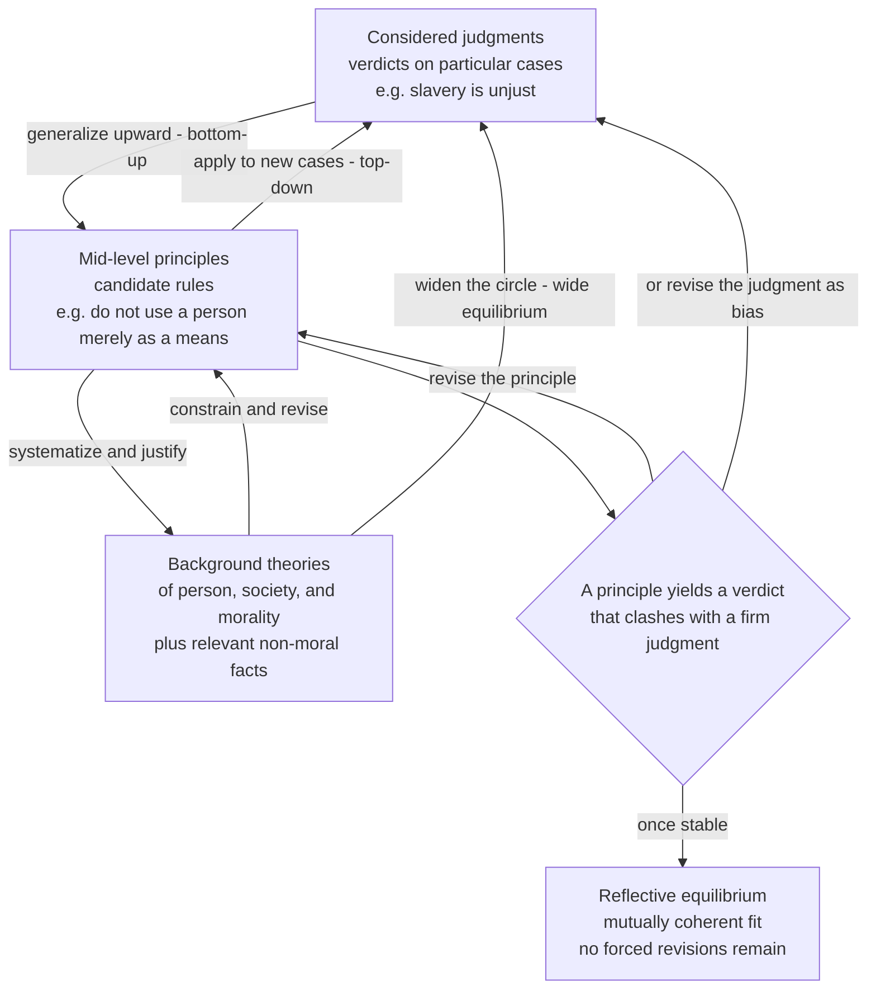

# ⚖️ Moral Reasoning and Case Analysis

> [!abstract] TL;DR
> Applied ethics rarely works by *deducing* a verdict from one grand theory. It reasons in two directions at once — **top-down** (apply a general principle to a case) and **bottom-up** (generalize from settled paradigm cases). The bottom-up craft is **casuistry**: reason from clear "fixed-point" cases to new ones by analogy, exactly as a common-law judge reasons from precedent. The unifying method is **reflective equilibrium** (Rawls): treat your considered moral judgments as *data*, propose principles to explain them, and mutually adjust judgments, principles, and background theory until they cohere — revising a principle that clashes with a bedrock intuition, or revising an intuition that a strong principle exposes as bias. **Thought experiments** (the trolley problem, the violinist, the experience machine, Singer's drowning child) are instruments for isolating one morally relevant feature at a time. The persistent worry: are our intuitions *insight* or *bias*, and does casuistry converge on truth or merely launder prejudice through ad hoc analogies?

---

## Intuition

**Analogy:** Moral reasoning works far more like **case law** and **clinical diagnosis** than like solving an equation.

A judge facing a novel dispute does not read the answer off a statute. She asks: *which settled case is this most like, and is the difference between them legally relevant?* A physician facing an ambiguous chart does not deduce the diagnosis from first principles; she reasons from **paradigm presentations** she already trusts ("this looks like a classic appendicitis, except the pain migrated the wrong way"), forms a candidate rule, and tests it against the findings, revising whichever side gives way. In both crafts you hold a stock of cases you are confident about, a stock of general principles, and you move back and forth — letting firm cases correct loose principles, and letting strong principles expose a "case" you had mis-seen.

Ethics is the same. Your confident verdicts ("gratuitous cruelty is wrong," "you must save the drowning child at the cost of muddy trousers") are the trusted paradigm cases. A candidate principle ("maximize welfare," "never use a person merely as a means") is the diagnostic rule. When rule and case collide, you do not automatically trust either — you test the verdict against your considered judgments and adjust until the whole set is coherent. That back-and-forth *is* moral reasoning; the theory is the byproduct, not the starting axiom.

---

## How It Works

### Two directions of inference

- **Top-down (theory-application, generalism).** Start from a general normative theory or principle, add the facts of the case, and derive a verdict. Clean when it works, but hard cases usually feature *conflicting* principles with no master rule to rank them, so pure deduction stalls.
- **Bottom-up (case-based, casuistry).** Start from **paradigm cases** whose verdicts nearly everyone accepts, and extend them to a new case by **analogy**, asking whether the differences are morally relevant. This is how bioethics committees and courts actually operate, and why a utilitarian, a Kantian, and a virtue ethicist can still converge on a policy while disagreeing about theory.

Neither direction is self-sufficient. Bottom-up reasoning with no principled discipline degenerates into **ad hoc rationalization** (gerrymandering the analogy to reach a wanted result); top-down reasoning with no answerability to cases produces "monstrous" verdicts a sane person rejects. The method that fuses them is **reflective equilibrium**.

### The reflective-equilibrium loop

Rawls' proposal: justification in ethics is not derivation from self-evident axioms but **mutual adjustment** toward coherence. You collect your **considered judgments** (verdicts made under good conditions — calm, informed, impartial, no obvious self-interest), propose **principles** that would systematize them, and check the fit. Where a principle implies a verdict that clashes with a firm judgment, you revise *one or the other* — sometimes the principle bends, sometimes reflection convinces you the intuition was a bias to be discarded. You iterate until no revision is forced.

- **Narrow** reflective equilibrium: coherence between your judgments and principles alone. Risk: it can merely *systematize your existing prejudices*.
- **Wide** reflective equilibrium (Norman Daniels): widen the circle to include **background theories** — of the person, of society, of the role of morality — and *rival* moral conceptions, plus relevant non-moral facts. This gives principles independent leverage to overturn even confident intuitions, answering the "garbage in, garbage out" objection.



### Intuitions as data — insight or bias?

Reflective equilibrium treats intuitions as **evidence to be explained**, not as infallible oracles. That immediately raises the reliability question. Optimists (intuitionists) hold that trained moral perception detects genuine reasons. Skeptics point to **framing effects** (the same trade-off flips verdicts when described as "lives saved" versus "lives lost"), **order effects**, and **evolutionary debunking arguments** (Greene, Singer): if a deontological intuition is the output of an ancient alarm system tuned to *up-close personal* violence, its firing tells us about our wiring, not about moral reality. The methodological upshot: an intuition earns evidential weight only after we ask *what produced it* and whether that process tracks anything morally relevant.

---

## Key Concepts

### Secondary

- **Top-down vs bottom-up reasoning** — applying a general theory to a case versus generalizing from paradigm cases. Real reasoning uses both.
- **Moral intuitions as data** — pre-theoretical verdicts ("torturing for fun is wrong") that a good theory must explain, not contradict.
- **The argument from analogy** — "case A is relevantly like case B; B is wrong; so A is wrong." Its whole force rides on *relevant* similarity, so the reply is always to find a morally relevant difference. See [[Analogical_Reasoning]].
- **The appeal to consequences** — justify or condemn an act by its outcomes. Legitimate as *one* consideration; a fallacy only when the mere unpleasantness of a conclusion is treated as evidence it is false.
- **Thought experiments** — deliberately stripped-down scenarios (the runaway trolley) that isolate a single variable so you can see which feature is driving your verdict.

### Undergraduate

- **Casuistry / case-based reasoning** — reasoning from settled **paradigm cases** outward to fresh ones by analogy, taxonomizing cases by their morally relevant features. Revived for modern **bioethics** by Albert Jonsen and Stephen Toulmin, whose committee experience showed people *agree on cases while disagreeing on theory*. Its strength is traction on real decisions without demanding theoretical consensus; its risk is **ad hoc rationalization** — massaging the analogy until it yields the answer you wanted. Structurally identical to reasoning with precedent: see [[Legal_Reasoning_and_Interpretation]].
- **Reflective equilibrium (Rawls)** — mutual adjustment of judgments, principles, and theory until coherent; **narrow** (judgments + principles) versus **wide** (also background theories and rival conceptions). The dominant meta-method of the field. See [[Justice_and_Rawls]].
- **Slippery-slope arguments** — "permitting A will lead to unacceptable Z." A *legitimate* empirical or conceptual claim when the causal or logical mechanism from A to Z is shown; a **fallacy** when the inevitability is merely asserted. See [[Fallacies_of_Presumption_and_Ambiguity]].
- **The fact/value distinction and the naturalistic fallacy** — Hume's gap between *is* and *ought*; you cannot validly derive a moral conclusion from purely descriptive premises without a bridging value premise. In practice: "it is natural, therefore permissible" (the appeal to nature) smuggles in the missing premise.
- **Identifying and weighing morally relevant features** — the real work of a case: sorting which facts (consent, harm, intent, distribution, vulnerability) actually bear on the verdict, and how much, when they pull in opposite directions.

### Graduate

- **Principlism (Beauchamp & Childress)** — a deliberately theory-neutral toolkit of **mid-level principles** (autonomy, beneficence, non-maleficence, justice) treated as *prima facie* duties. Because the principles are abstract and conflict, they must be **specified** (made determinate for a context, e.g. what "respect autonomy" requires for an incompetent patient) and **balanced** (weighed when they collide). Specification and balancing are themselves reflective-equilibrium operations, not algorithms.
- **The reliability-of-intuitions debate** — are intuitions perceptions of moral facts or artifacts of cognition? **Evolutionary debunking** (Sharon Street, Peter Singer) and **dual-process** models (Joshua Greene: characteristically deontological verdicts as fast affective alarms, consequentialist verdicts as slow controlled cognition) pressure us to *discount* certain intuitions as bias. Critics (Kahane, Berker) reply that debunking arguments prove too much and cannot, without a prior normative premise, tell us which process is *tracking* rather than *distorting*.
- **Moral heuristics and their failure modes** — Cass Sunstein argues moral judgment runs on fast heuristics ("do not tamper with nature," "punish and require compensation for a harm proportional to outrage") that work in the ecology that shaped them but misfire in novel cases, producing predictable errors (scope insensitivity, act/omission and action/consequence asymmetries). See [[Cognitive_Biases_and_Heuristics]].
- **Wide reflective equilibrium as coherentist justification** — its epistemology is **coherentism**: no belief is foundational; justification is holistic fit. This inherits the standard coherentist worry (a coherent set can still be systematically false) and the **conservatism** worry (equilibrium may just entrench a culture's prejudices unless background theory supplies genuine external constraint).
- **Generalism vs particularism (Dancy)** — the methodological frontier. Moral particularism denies that valid moral principles even exist: a feature that counts *for* an act in one case can count *against* it in another ("holism of reasons"), so competent moral judgment is irreducibly case-by-case perception, not principle-application. Casuistry is the friendly practice; particularism is its radical theory.

---

## Python Demo

```python
# Reflective equilibrium as CONSTRAINT SATISFACTION.
#
# Model our moral thinking as a fit between:
#   * a set of CASE-JUDGMENTS      -> data points (x_i, y_i)
#   * a candidate PRINCIPLE        -> a line  permissibility = a*x + b
#
# x_i = a morally relevant feature (here: net lives saved by a sacrifice)
# y_i = our intuitive permissibility rating in [0, 1]
#
# The loop does two things each pass, exactly as Rawls describes:
#   (1) ADJUST THE PRINCIPLE to best fit the current judgments (least squares).
#   (2) REVISE OUTLIER JUDGMENTS that clash with the now well-supported
#       principle -- UNLESS a judgment is a protected "fixed point" (a bedrock
#       intuition we refuse to give up, which instead forces the PRINCIPLE to
#       bend). The system converges to a coherent equilibrium.

import numpy as np
import matplotlib.pyplot as plt

rng = np.random.default_rng(7)

# --- Cases and our INITIAL considered judgments -------------------------
x = np.arange(1, 11, dtype=float)          # net lives saved, 1..10

# The coherent latent pattern reflection is groping toward (unknown to us):
# permissibility rises gently with lives saved.
latent = 0.15 + 0.075 * x

# Gut judgments = latent pattern + intuition noise, then TWO deliberate outliers
y = latent + rng.normal(0, 0.03, size=x.size)

# Outlier A (x = 7): a snap verdict distorted by an IRRELEVANT feature
# (the victim was "up close"). It clashes with the emerging principle and,
# on reflection, we are willing to REVISE it.
y[6] = 0.16

# Outlier B (x = 3): a STRONGLY-HELD fixed point -- e.g. "harvesting one
# healthy patient to save three is wrong." We refuse to revise it; the
# PRINCIPLE must accommodate it instead.
y[2] = 0.95

protected = np.zeros(x.size, dtype=bool)
protected[2] = True                        # bedrock judgment: never revised
revisable_idx = 6                          # the judgment we will watch change

y0 = y.copy()                              # remember the starting judgments

def fit_principle(x, y):
    # least-squares principle:  permissibility ~ a*x + b
    A = np.vstack([x, np.ones_like(x)]).T
    (a, b), *_ = np.linalg.lstsq(A, y, rcond=None)
    return a, b

# --- Reflective-equilibrium loop ----------------------------------------
n_iter = 8
misfit = []                                # RMS misfit each pass
revise_rate = 0.6                          # how far a revisable outlier moves
thresh = 0.07                              # residual size marking an outlier

for _ in range(n_iter):
    a, b = fit_principle(x, y)             # (1) adjust PRINCIPLE to judgments
    resid = y - (a * x + b)
    misfit.append(np.sqrt(np.mean(resid ** 2)))

    is_outlier = (np.abs(resid) > thresh) & (~protected)
    y[is_outlier] -= revise_rate * resid[is_outlier]   # (2) revise judgments

a, b = fit_principle(x, y)
misfit.append(np.sqrt(np.mean((y - (a * x + b)) ** 2)))

print("Starting RMS misfit : %.4f" % misfit[0])
print("Equilibrium RMS misfit: %.4f  (nonzero: the bedrock case still pulls)"
      % misfit[-1])
print("Revised judgment at x=7 : %.3f  ->  %.3f  (moved toward the principle)"
      % (y0[revisable_idx], y[revisable_idx]))
print("Protected judgment at x=3: %.3f  (unchanged; the principle bent to it)"
      % y[2])

# ======================================================================
# Visualisation
# ======================================================================
fig, (ax1, ax2) = plt.subplots(1, 2, figsize=(15, 6))

# Panel 1: misfit shrinking toward equilibrium
ax1.plot(range(len(misfit)), misfit, "o-", color="#7c3aed", lw=2.2, ms=8)
ax1.axhline(misfit[-1], ls="--", color="#9ca3af", lw=1.2)
ax1.set_title("Convergence to reflective equilibrium\n"
              "principle + judgments adjusted until coherent",
              fontsize=11, fontweight="bold")
ax1.set_xlabel("Iteration (mutual-adjustment pass)")
ax1.set_ylabel("RMS misfit between principle and judgments")
ax1.grid(alpha=0.3)
ax1.annotate("residual never hits zero:\nthe bedrock case keeps\nthe principle honest",
             xy=(len(misfit) - 1, misfit[-1]), xytext=(3.2, misfit[0] * 0.6),
             fontsize=9, arrowprops=dict(arrowstyle="->", color="#374151"))

# Panel 2: the case space, before vs after
line_x = np.linspace(1, 10, 100)
ax2.plot(line_x, a * line_x + b, color="#059669", lw=2.4,
         label="Equilibrium principle  a*x + b")

ax2.scatter(x, y0, facecolors="none", edgecolors="#9ca3af", s=110,
            label="Initial gut judgments", zorder=3)
ax2.scatter(x, y, c="#1d4ed8", s=90, label="Equilibrium judgments", zorder=4)

# highlight the protected bedrock fixed point
ax2.scatter([x[2]], [y[2]], marker="*", s=420, c="#b91c1c",
            edgecolors="black", label="Bedrock fixed point (never revised)",
            zorder=5)

# show the revised judgment moving toward the principle
ax2.annotate("", xy=(x[revisable_idx], y[revisable_idx]),
             xytext=(x[revisable_idx], y0[revisable_idx]),
             arrowprops=dict(arrowstyle="->", color="#d97706", lw=2.2))
ax2.annotate("intuition revised as bias\n(driven by an irrelevant feature)",
             xy=(x[revisable_idx], y0[revisable_idx]),
             xytext=(6.1, 0.30), fontsize=9, color="#b45309")

ax2.set_title("Case space: mutual adjustment\n"
              "the line bends to the bedrock case; an outlier judgment is revised",
              fontsize=11, fontweight="bold")
ax2.set_xlabel("Morally relevant feature x  (net lives saved)")
ax2.set_ylabel("Intuitive permissibility rating")
ax2.set_ylim(0, 1.05)
ax2.legend(loc="lower right", fontsize=8)
ax2.grid(alpha=0.3)

plt.tight_layout()
plt.savefig("reflective_equilibrium.png", dpi=130, bbox_inches="tight")
plt.show()
```

**What the output shows.** Panel 1: the RMS misfit between principle and judgments falls fast and then plateaus at a *nonzero* floor — equilibrium is not perfect coherence, because the one **bedrock fixed point** we refuse to abandon keeps a live residual, forcing the principle to accommodate it rather than override it. Panel 2: the outlier judgment at `x = 7` (a snap verdict we traced to an irrelevant feature) is **revised** upward toward the principle — an intuition discarded as bias — while the bedrock case at `x = 3` stays put and *bends the principle*. That two-way traffic (principle moves toward judgments, some judgments move toward the principle, one judgment is immovable) is exactly what "mutual adjustment until coherent" means. Change `protected` or `revise_rate` and you get **narrow** equilibrium that simply launders whatever intuitions you started with, versus a disciplined **wide** equilibrium in which strong principles can overturn weak intuitions.

---

## Real-World Applications

> **Clinical ethics committees and the "four boxes."** Hospital ethics consults run on casuistry plus principlism. Jonsen, Siegler, and Winslade's *Clinical Ethics* organizes every case into four topics — medical indications, patient preferences, quality of life, contextual features — mapping the four principles onto the concrete case and reasoning by analogy to prior consults. It lets a mixed committee reach a defensible decision *without* first settling utilitarianism versus Kantianism.

> **Research ethics and the Belmont Report (1979).** After the Tuskegee scandal, a U.S. national commission distilled three mid-level principles — respect for persons, beneficence, justice — and *specified* them into operational rules (informed consent, risk/benefit assessment, fair subject selection) that IRBs still apply. A textbook case of specifying and balancing abstract principles into casework.

> **Autonomous vehicles and the trolley problem.** MIT's **Moral Machine** experiment crowdsourced ~40 million trolley-style judgments about how a self-driving car should distribute unavoidable harm. It is applied moral reasoning at scale — and a live demonstration of the *limits* of thought experiments: the real choice is made in advance by engineers and regulators, is statistical not certain, and raises a **responsibility gap** that the clean dilemma hides. See [[Applied_Ethics]].

> **Singer's drowning child and effective altruism.** Peter Singer's thought experiment ("if you can save a drowning child at trivial cost, you must — and distance is morally irrelevant") is deployed as an argument from analogy to global poverty, anchoring the effective-altruism movement. Its persuasive power and its contested demandingness both stem from how tightly the analogy controls the morally relevant features.

---

## Common Pitfalls

- **Ad hoc rationalization in casuistry** — bending the analogy until the settled case "just happens" to license the verdict you already wanted. The discipline is to state the morally relevant features *in advance* and let disanalogies count against you, exactly as a court must justify the width of a precedent's ratio. See [[Legal_Reasoning_and_Interpretation]].
- **Treating intuitions as infallible** — an intuition is *evidence to be explained*, not a verdict beyond appeal. Weigh it only after asking what produced it (perception of a reason, or a framing/affect artifact). The trolley literature is full of intuitions that flip under mere re-description.
- **Deriving *ought* from *is* / the appeal to nature** — "it is natural / it is how things are, therefore it is permissible" smuggles in an unstated value premise across Hume's gap. Make the bridging premise explicit and it usually looks false. See [[Fallacies_of_Presumption_and_Ambiguity]].
- **Stating slippery slopes as if proven** — "permitting X will inevitably lead to abuse" is an *empirical or conceptual* claim that needs its mechanism spelled out, not a self-evident premise. Without the mechanism it is a fallacy. See [[Logical_Fallacies_Overview]].
- **Narrow equilibrium as prejudice-laundering** — if principles are only ever fitted *to* your intuitions and nothing external can overturn them, coherence just systematizes your starting biases. Wide reflective equilibrium exists precisely to give background theory independent corrective leverage.
- **False analogy / ignoring a morally relevant difference** — the argument from analogy is only as good as the relevance of the similarity. The standard, decisive reply is to exhibit a difference that bears on the verdict (consent, intention, the act/omission line — where it genuinely matters).
- **Over-trusting exotic thought experiments** — bizarre, probability-free scenarios can trigger heuristics outside their reliable range, so a verdict about the footbridge may reveal our wiring rather than a transferable moral truth. Use them to *isolate* variables, not as free-standing proofs.

---

## Related Concepts

- [[Applied_Ethics]] — the flagship domains (bioethics, animal ethics, AI ethics, just war) where these methods are put to work; this note supplies the reasoning engine that note deploys.
- [[Justice_and_Rawls]] — the origin of reflective equilibrium; Rawls justifies the two principles by mutual adjustment against considered judgments, not by deduction.
- [[Legal_Reasoning_and_Interpretation]] — casuistry *is* reasoning with precedent transposed to ethics: paradigm case, ratio, distinguishing on a materially relevant difference.
- [[Analogical_Reasoning]] — the inference behind casuistry and the argument from analogy; structure-mapping and the search for relevant similarity/difference.
- [[Consequentialism_and_Utilitarianism]] — home of the appeal to consequences and the trolley problem; the theory whose verdicts casework most often tests.
- [[Deontology_and_Kantian_Ethics]] — the "do not use a person merely as a means" constraint that generates the strongest anti-aggregative intuitions in case analysis.
- [[Fallacies_of_Presumption_and_Ambiguity]] — where slippery-slope, the naturalistic fallacy/appeal to nature, and false analogy are catalogued as fallacies.
- [[Logical_Fallacies_Overview]] — the broader map of argument failures that stalk moral debate.
- [[Cognitive_Biases_and_Heuristics]] — the psychology of moral heuristics and their predictable failure modes (framing, scope insensitivity, act/omission asymmetry).
- [[Inductive_Logic]] — the formal counterpart to bottom-up moral generalization from paradigm cases.

---

## Review Questions

### Secondary

1. Distinguish **top-down** from **bottom-up** moral reasoning with one concrete example of each. Why does pure top-down deduction from a single theory tend to break down in hard cases?
2. What does it mean to treat a moral intuition as **data to be explained** rather than as a proof? Give an example of an intuition you would trust and one you would be suspicious of, and say why.

### Undergraduate

3. Explain **casuistry** and why it was revived in bioethics. Then explain its structural parallel to legal reasoning with precedent, and describe one way a casuist can slide into **ad hoc rationalization** — and how to guard against it.
4. State the difference between a **legitimate** slippery-slope argument and a **fallacious** one, and separately explain how the **naturalistic fallacy** shows up in real applied-ethics debates (e.g. about euthanasia or biotechnology).

### Graduate

5. Distinguish **narrow** from **wide** reflective equilibrium and explain how the wide version is supposed to answer the objection that reflective equilibrium merely "launders prejudice." In the Python demo's terms, which knob turns narrow equilibrium into wide, and why?
6. Reconstruct an **evolutionary debunking** argument against a specific deontological intuition (e.g. the wrongness of pushing the man off the footbridge). Then state the strongest reply — that debunking arguments cannot, without a prior normative premise, tell us which cognitive process is *tracking* rather than *distorting* moral reality. Whose burden is heavier, and why?

---

## Sources

- [Rawls, J. *A Theory of Justice*. Harvard University Press, 1971 (rev. 1999) — the founding statement of reflective equilibrium and considered judgments.](https://www.hup.harvard.edu/books/9780674000780)
- [Daniels, N. "Reflective Equilibrium." *Stanford Encyclopedia of Philosophy*, 2020 — the standard survey of narrow vs wide equilibrium and its coherentist epistemology.](https://plato.stanford.edu/entries/reflective-equilibrium/)
- [Jonsen, A. R. & Toulmin, S. *The Abuse of Casuistry: A History of Moral Reasoning*. University of California Press, 1988 — the revival of case-based reasoning in bioethics.](https://www.ucpress.edu/book/9780520069602/the-abuse-of-casuistry)
- [Thomson, J. J. "The Trolley Problem." *Yale Law Journal* 94:6, 1985, 1395-1415 — the canonical analysis of the trolley variants and what they isolate.](https://www.jstor.org/stable/796133)
- [Beauchamp, T. L. & Childress, J. F. *Principles of Biomedical Ethics*. Oxford University Press, 8th ed., 2019 — principlism, and the specification and balancing of mid-level principles.](https://global.oup.com/academic/product/principles-of-biomedical-ethics-9780190640873)
- [Sunstein, C. R. "Moral Heuristics." *Behavioral and Brain Sciences* 28:4, 2005, 531-573 — moral heuristics and their predictable failure modes.](https://doi.org/10.1017/S0140525X05000099)

---

#ethics #moral-reasoning #reflective-equilibrium #casuistry #thought-experiments
