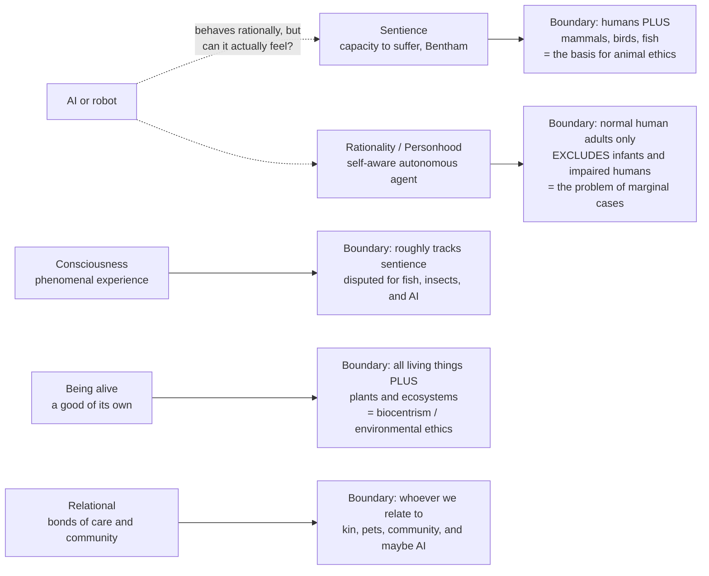

# ⭕ Moral Status and the Moral Circle

> [!abstract] TL;DR
> To have **moral status** (or *moral standing*) is to count morally *for your own sake* — to be the kind of thing that can be *wronged*, not merely damaged. The central questions are **which** entities have it, **how much** they have (all-or-nothing, or in degrees?), and **on what basis**. Candidate criteria — **sentience** (the capacity to suffer; Bentham's "can they *suffer*?"), **consciousness**, **rationality/personhood**, **being alive with a good of one's own**, and **social relationships** — each draw the boundary of the "moral circle" in a different place, including or excluding animals, embryos, ecosystems, future people, and AI. History shows a widening of that circle (Lecky, Singer), and where you set the criterion has enormous practical stakes: it decides who gets **rights, protections, and standing**.

## Intuition

**Analogy first — draw a circle in the sand.** Imagine standing in the center of a circle drawn in the sand. Everyone and everything *inside* the circle is someone whose interests you are morally bound to weigh; everything *outside* is, at most, property, resource, or scenery — things you can harm but not *wrong*. The whole of ethics turns on a single, deceptively simple question: **where do you draw the line?**

Now watch the line move over history. The earliest circles were tiny — drawn around **kin and clan**, with strangers outside as fair prey. Over millennia the circle widened: to the **tribe**, the **city**, the **nation**, then — haltingly, through the abolition of slavery and the language of universal human rights — to **all human beings** regardless of race, sex, or status. In the last half-century the boundary has been pushed again, past the species line, to sentient **animals**, and is now being tested against **future generations**, whole **ecosystems**, and even **artificial minds**. Each expansion looked radical, even absurd, from inside the older, smaller circle. That widening is what philosophers call **the expanding moral circle** — and the live debate is *how far it should go, and what principle should govern the drawing of the line at all* rather than mere prejudice about who happens to resemble us.

---

## How It Works

### Two roles: moral agents vs moral patients

The first distinction to get right is between two very different ways of "belonging to morality":

- A **moral agent** is a being that can *act rightly or wrongly* — it can deliberate, be held **responsible**, praised, or blamed. Competent adult humans are the paradigm.
- A **moral patient** is a being that can *be wronged* — whose interests generate duties in others, whether or not it can have duties itself.

These come apart. An infant, a dog, or a person with advanced dementia is a moral **patient** (we can wrong them) without being a full moral **agent** (we do not blame them). "Having moral status" is fundamentally about being a **patient**: mattering morally for one's own sake. Confusing the two questions — *can it be held responsible?* versus *can it be wronged?* — is the single most common error in debates about animals and AI.

### The candidate criteria — and what each includes

Every account of moral status names some property as the **ground** of standing. The property you choose fixes the boundary of the circle:

1. **Sentience** — the capacity to have felt experiences, above all *to suffer*. Jeremy Bentham's founding line (1789): "The question is not, *Can they reason?* nor, *Can they talk?* but, *Can they suffer?*" This is the basis of modern **animal ethics** (Peter Singer). It admits mammals, birds, and probably fish; it excludes rocks, plants, and — as far as we know — current software.
2. **Consciousness / phenomenal experience** — having a subjective point of view, "something it is like" to be that thing. Closely tied to sentience but sharpened by the **hard problem of consciousness**: we cannot directly observe another being's inner experience, only infer it, which makes the boundary epistemically fragile (see [[Consciousness_and_the_Hard_Problem]]).
3. **Rationality / personhood / self-awareness** — being a *person*: a self-aware, reasoning agent with a sense of its own past and future (Kant, and modern personhood theorists). This grants *full, equal* status but draws a narrow circle — and runs straight into the **problem of marginal cases**: infants and the severely cognitively impaired lack robust rationality, yet we rightly refuse to treat them as mere things.
4. **Being alive / having a good of one's own** — **biocentrism** (Paul Taylor, Albert Schweitzer's "reverence for life"): every living thing has interests in the minimal sense of a *telos*, a way of flourishing that can go well or badly *for it*. This widens the circle to all organisms and, on **ecocentric** views, to species and ecosystems as wholes — the foundation of much environmental ethics.
5. **Relational / social accounts** — status is grounded not in an intrinsic property but in the *relationships* an entity stands in: care, community, dependency, shared history. This explains why we owe more to our own children or companion animals, and why some argue a social robot could acquire standing through the bonds humans form with it.

### Degrees vs equal consideration

A cross-cutting question: is moral status **binary** (you either have full status or none) or **scalar** (a matter of *degree*)? The **equal-consideration** view (Singer, for interests; Kant, Regan, for persons/subjects) says that once you are *in* the circle, your like interests count *equally* — a chimpanzee's pain is not a "lesser" pain. The **degrees** view (Mary Anne Warren, Shelly Kagan, David DeGrazia) says status comes in gradations, so an insect's tiny sliver of sentience warrants some, but far less, consideration than a human's. Which view you hold changes how you trade off human against animal, or present against future, interests.



---

## Key Concepts

### Secondary (the core idea, plainly)

- **Moral status = mattering for your own sake.** A thing has moral status if it can be *wronged*, not just broken. You can smash a rock but you cannot *wrong* it; you *can* wrong a dog.
- **Agents vs patients.** Some beings can *do* right and wrong (agents); others can only *have* right and wrong done *to* them (patients). Babies and animals are patients but not full agents.
- **The moral circle.** Picture a circle around "who counts." Long ago it held only family and tribe; today it holds all humans and, most people agree, at least some animals.
- **Cruelty is the clue.** The reason it is wrong to torture an animal *for fun* is the strongest everyday evidence that sentient creatures have some moral status.

### Undergraduate (the criteria and the debate)

- **Sentience and the argument for animals.** Bentham's "can they suffer?" grounds Singer's **principle of equal consideration of interests**: like suffering counts equally *whoever* feels it. To discount a being's interests *merely* because of its species is **speciesism**, which Singer argues is structurally like racism or sexism.
- **The argument from marginal cases.** Whatever capacity we cite to keep animals *out* (rationality, language, autonomy) is *also* absent in some humans — infants, the profoundly impaired — whom we would never treat as mere resources. So either those humans lack status (unacceptable) or the capacity is not what grounds status after all. This argument is the engine of much animal ethics.
- **Personhood theories.** Locke and modern writers (e.g. Mary Anne Warren's criteria: consciousness, reasoning, self-motivated activity, communication, self-concept) tie *full* status to being a **person**, not a *human*. This decouples the moral category "person" from the biological category "human" — with sharp consequences for embryos, great apes, and AI.
- **Biocentrism and ecocentrism.** If having a *good of one's own* suffices, plants and even ecosystems enter the circle (Taylor's *Respect for Nature*; Leopold's "land ethic"). Critics ask whether a non-sentient thing can really have *interests* rather than mere *functioning*.
- **The expanding circle as a thesis.** W. E. H. Lecky (1869) first described morality's "widening circle"; Singer's *The Expanding Circle* (1981) argues that **reason itself**, once engaged, pushes us to universalize — to see no principled reason our own interests count more than a relevantly similar other's.

### Graduate (structure, grounding, and hard cases)

- **Moral status as multidimensional.** Recent work (DeGrazia, Kagan's *How to Count Animals*) treats status not as a single dial but as a structured space: an entity's *degree* of status, the *strength* of the reasons its interests generate, and the *kinds* of protection it warrants can vary independently. "Unitarianism" (all who count, count equally) is pitted against "hierarchicalism" (status varies by capacity).
- **The grounding problem (metaethics).** *Why* should any purely descriptive property — a certain neural organization, a capacity to suffer — generate normative standing at all? This is a status-specific version of the is/ought gap (see [[Consequentialism_and_Utilitarianism]] and metaethics). Reductive naturalists, non-naturalists, and constructivists answer differently, and relational theorists sidestep intrinsic properties entirely.
- **Replies to marginal cases.** (i) *Kantian indirect-duty* views (we owe animals nothing directly, but cruelty corrupts *us*) — widely judged too weak. (ii) *Moral individualism* (James Rachels, Jeff McMahan): judge by the *individual's* actual capacities, biting the bullet that a cognitively impaired human and a comparably capacitied animal have comparable status. (iii) *Modal/species-norm* views: status attaches to belonging to a *kind* whose normal members are persons — attacked as a disguised speciesism.
- **The epistemic gate on sentience.** Because phenomenal consciousness is not directly observable ([[Consciousness_and_the_Hard_Problem]]), attributions of sentience to fish, insects, cephalopods, or AI rest on *inference to the best explanation* from behavior, physiology, and evolutionary continuity. This motivates **precautionary** frameworks: under uncertainty about sentience, the *expected* moral cost of ignoring a real capacity to suffer may warrant caution (the logic behind recent recognition of cephalopod and decapod sentience in law).
- **Artificial minds.** For AI the criteria *dissociate* dramatically: a system may exhibit rational, linguistic, agent-like *behavior* while it is entirely open whether there is *anything it is like* to be it. Functionalist views ([[Functionalism_and_Machine_Minds]]) leave room for genuine machine sentience; biological-naturalist views deny it. The **behavior-is-not-evidence-enough** worry (the ELIZA effect: we over-attribute minds to fluent systems) collides with the **precautionary** worry (dismissing a real patient because it is made of silicon would be a moral catastrophe).
- **Is expansion *progress*?** Singer treats circle-expansion as rational moral *progress*; critics note the circle has also *contracted* (dehumanization in genocide) and that "wider" is not automatically "better" — the direction of expansion still needs independent moral justification, not just historical momentum.

---

## Python Demo

```python
# Moral status, visualized two ways, using ONLY numpy + matplotlib.
#  (1) The EXPANDING MORAL CIRCLE  - a schematic timeline of how the scope of
#      "who counts morally" has widened over history.
#  (2) A CRITERION x ENTITY MATRIX - showing how the criterion you PICK
#      (a row) fixes the BOUNDARY of the circle (who lands inside).
# All numbers are reasoned, schematic synthetic data - illustrations, not
# empirical measurements.

import numpy as np
import matplotlib.pyplot as plt

# ------------------------------------------------------------------ #
# PART 1 - The expanding moral circle over history
# ------------------------------------------------------------------ #
stages = ["Kin /\nfamily", "Tribe /\nband", "City /\nnation", "All\nhumans",
          "Sentient\nanimals", "Future\ngenerations",
          "Ecosystems /\nbiosphere", "Artificial\nminds?"]
eras = ["~100k BCE", "~50k BCE", "~3000 BCE", "~1800 CE",
        "~1975 CE", "~1990 CE", "~1970 CE", "~2020 CE?"]
breadth = np.array([1, 2, 3, 4, 5.5, 6.5, 6.0, 7.5])   # schematic widening
x = np.arange(len(stages))

fig, (ax1, ax2) = plt.subplots(1, 2, figsize=(16, 7))

ax1.step(x, breadth, where="mid", color="#7c3aed", linewidth=2.5)
ax1.fill_between(x, 0, breadth, step="mid", alpha=0.15, color="#7c3aed")
ax1.scatter(x, breadth, color="#dc2626", zorder=5, s=60)
for xi, b, era in zip(x, breadth, eras):
    ax1.annotate(era, (xi, b), textcoords="offset points",
                 xytext=(0, 10), ha="center", fontsize=8, color="#374151")
ax1.set_xticks(x)
ax1.set_xticklabels(stages, fontsize=9)
ax1.set_ylabel("Schematic breadth of the moral circle (who counts)")
ax1.set_ylim(0, 9)
ax1.set_title("The Expanding Moral Circle (Lecky, Singer)\n"
              "scope of moral consideration widens over history")
ax1.grid(axis="y", alpha=0.3)

# ------------------------------------------------------------------ #
# PART 2 - Criterion (row) x entity (column) -> degree of moral status
# Read ACROSS a row and apply a threshold: that IS the circle's boundary.
# ------------------------------------------------------------------ #
criteria = ["Sentience\n(can suffer)", "Sapience\n(rational person)",
            "Life\n(a good of its own)", "Agency\n(moral agent)"]
entities = ["Human\nadult", "Human\ninfant", "Human\nfetus", "Great\nape",
            "Fish", "Insect", "Ecosystem", "AI /\nrobot"]

M = np.array([
    [1.0, 1.0, 0.4, 1.0, 0.6, 0.30, 0.0, 0.1],   # sentience
    [1.0, 0.2, 0.0, 0.5, 0.1, 0.05, 0.0, 0.6],   # sapience / rationality
    [1.0, 1.0, 1.0, 1.0, 1.0, 1.00, 0.8, 0.0],   # being alive
    [1.0, 0.1, 0.0, 0.3, 0.0, 0.00, 0.0, 0.4],   # moral agency
])

im = ax2.imshow(M, cmap="viridis", vmin=0, vmax=1, aspect="auto")
ax2.set_xticks(np.arange(len(entities)))
ax2.set_xticklabels(entities, fontsize=8)
ax2.set_yticks(np.arange(len(criteria)))
ax2.set_yticklabels(criteria, fontsize=9)
for i in range(M.shape[0]):
    for j in range(M.shape[1]):
        ax2.text(j, i, f"{M[i, j]:.2f}", ha="center", va="center",
                 color="white" if M[i, j] < 0.6 else "black", fontsize=8)
ax2.set_title("The criterion you pick determines the boundary\n"
              "criterion (row) x entity (column) -> degree of status")
fig.colorbar(im, ax=ax2, label="degree the entity satisfies the criterion")

plt.tight_layout()
plt.savefig("moral_circle.png", dpi=120)
plt.show()

# ------------------------------------------------------------------ #
# Apply a threshold to each criterion to print WHO IS IN the circle.
# ------------------------------------------------------------------ #
threshold = 0.5
clean_crit = [c.replace("\n", " ") for c in criteria]
clean_ent = [e.replace("\n", " ") for e in entities]
print(f"Applying inclusion threshold {threshold} to each candidate criterion:\n")
for r, name in enumerate(clean_crit):
    inside = [clean_ent[c] for c in range(len(clean_ent)) if M[r, c] >= threshold]
    print(f"  {name:22s} -> circle includes: {inside}")

# Expected output (illustrative):
#   Sentience (can suffer)  -> Human adult, Human infant, Great ape, Fish
#   Sapience (rational...)  -> Human adult, Great ape, AI / robot
#   Life (a good of its own)-> everyone living, incl. Ecosystem
#   Agency (moral agent)    -> Human adult only
```

The demo makes the central lesson concrete: **the boundary is a choice of criterion, not a fact read off the world.** Pick *sentience* and fish are in but AI is out; pick *sapience* and AI joins while fish drop out yet human infants also fall below the line (the marginal-cases problem, made visible); pick *life* and the circle swallows whole ecosystems. Same entities, radically different circles.

---

## Real-World Applications

- **Animal welfare law and factory farming.** Sentience is now written into policy: the EU's Lisbon Treaty recognizes animals as "sentient beings," and the UK's *Animal Welfare (Sentience) Act 2022* extended recognition to **cephalopods and decapod crustaceans** on precautionary, evidence-based grounds — a criterion (sentience) directly setting legal protection.
- **Beginning-of-life ethics.** Debates over abortion, IVF, and embryonic stem-cell research turn on the moral status of the **embryo/fetus**: does it have full status from conception (a *life*/potential-person criterion) or gradually with the onset of sentience and consciousness (roughly mid-gestation)? Policy thresholds like the **14-day rule** for embryo research encode a status judgment.
- **Rights of nature.** Ecocentric criteria have entered constitutions and courts: **Ecuador's constitution (2008)** grants rights to *Pachamama* (nature); **New Zealand** gave the **Whanganui River** legal personhood (2017); Indian and Colombian courts have followed. Ecosystems are being pulled inside the circle.
- **Future generations and climate policy.** If people who do not yet exist are moral patients, present emissions and debt wrong them. This grounds "future generations" commissioners (Wales), intergenerational-justice arguments, and disputes over the **social discount rate** in climate economics.
- **AI welfare and machine moral patiency.** As systems grow more capable and fluent, researchers and labs have begun taking the question of possible **AI sentience / model welfare** seriously (precautionary investigations into whether advanced models could have morally relevant experiences), while cautioning against the **ELIZA effect** of over-attributing minds to convincing text.
- **Disorders of consciousness and brain organoids.** Clinical ethics for patients in **persistent vegetative** or **minimally conscious** states, and the status of lab-grown **brain organoids**, both hinge on whether and to what degree phenomenal consciousness is present — a live frontier where the science of consciousness directly gates moral obligation.

---

## Common Pitfalls

- **Conflating moral agency with moral patiency.** "It can't be held responsible, so it doesn't count" confuses *being able to do wrong* with *being able to be wronged*. Infants and animals refute it: they are patients without being agents.
- **Treating status as strictly binary.** Insisting every entity is either fully in or fully out forces false dilemmas (a fish "equals" a human, or counts for *nothing*). Degree/scalar views dissolve many of these, at the cost of hard weighting questions.
- **Criterion-gerrymandering (motivated line-drawing).** Picking whatever property happens to include all and only the beings you already wanted inside (usually "us") is exactly the arbitrariness the charge of **speciesism** targets. A criterion must be defended *independently* of the verdicts you want.
- **Inferring AI sentience from behavior.** Fluent, agent-like output is not evidence of felt experience; the mechanism can fully explain the behavior without any inner life (the ELIZA effect). Equally, *dismissing* the possibility a priori because "it's just a machine" begs the question the other way.
- **Assuming expansion is automatic progress.** The moral circle has widened *and* contracted; "wider" needs a separate moral argument, not just the momentum of history. Historical trend is not moral justification.
- **Deriving "ought" straight from a natural property.** Naming sentience or life as the ground still owes an account of *why* that descriptive fact carries normative weight — the grounding/is-ought gap does not vanish just because the property feels obviously important.

---

## Related Concepts

- [[Applied_Ethics]] — Moral status is the shared substructure beneath bioethics, animal ethics, and AI ethics: every one of them is, at bottom, a dispute about *who counts*.
- [[Consequentialism_and_Utilitarianism]] — Supplies Singer's utilitarian route to animal status via the equal consideration of *interests*; a theory of status fixes *whose* interests then get aggregated.
- [[Consciousness_and_the_Hard_Problem]] — Sentience is the leading criterion, but phenomenal consciousness is not directly observable, which makes the boundary epistemically fragile for animals and AI.
- [[Functionalism_and_Machine_Minds]] — Whether an artificial system could be a genuine moral patient turns on whether function suffices for real experience.
- [[Personal_Identity]] — "Personhood" as a status criterion depends on what makes something a persisting self with a future to be harmed.
- [[Consciousness_and_Awareness]] — The cognitive-science account of awareness that any sentience-based criterion must lean on.
- [[Consciousness_and_Neural_Correlates]] — The empirical search for neural markers of experience that increasingly grounds legal recognitions of animal sentience.
- [[Moral_Development]] — How, developmentally, humans come to extend concern beyond the self and in-group — the psychology behind the circle's widening.

---

## Review Questions

**Secondary**
1. In your own words, what is the difference between a *moral agent* and a *moral patient*? Give one example of a being that is a patient but not a full agent, and explain why.

**Undergraduate**
2. State Bentham's "can they suffer?" criterion and reconstruct the **argument from marginal cases**. Why does that argument make it hard to keep animals out of the moral circle *by appeal to rationality* without also excluding some humans?

**Graduate**
3. A criterion of moral status determines the circle's boundary, but by itself it faces the **grounding problem**: why should any purely descriptive property generate normative standing? Choose one criterion (sentience, personhood, or being-alive), and defend or attack the claim that it grounds status *non-arbitrarily* — then say whether a *relational* account avoids the problem or merely relocates it.
4. For a highly capable AI, the criteria of *sapience* and *sentience* come apart: behavior may be person-like while phenomenal experience is entirely uncertain. Given that uncertainty, argue for or against a **precautionary** principle for machine moral patiency, and explain how you would guard against *both* the ELIZA effect *and* the wrongful dismissal of a genuine patient.

---

## Sources

- Bentham, J. (1789). *An Introduction to the Principles of Morals and Legislation*, ch. XVII (the "Can they suffer?" footnote).
- Singer, P. (1981/2011). *The Expanding Circle: Ethics, Evolution, and Moral Progress*. Princeton University Press.
- Warren, M. A. (1997). *Moral Status: Obligations to Persons and Other Living Things*. Oxford University Press.
- Kagan, S. (2019). *How to Count Animals, More or Less*. Oxford University Press.
- Jaworska, A. & Tannenbaum, J. "The Grounds of Moral Status." *Stanford Encyclopedia of Philosophy* (2013, rev.). https://plato.stanford.edu/entries/grounds-moral-status/

---

#ethics #moral-status #moral-circle #personhood #sentience
