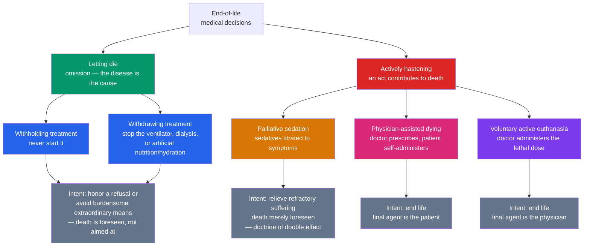

# 🕯️ End of Life Ethics

> [!abstract] TL;DR
> End-of-life ethics is where the three deepest commitments of medicine collide at the boundary of life: **respect for autonomy** (the patient's right to decide), the **value of life itself** (sanctity vs quality), and **"first, do no harm"** (non-maleficence and the relief of suffering). Its work is done through contested distinctions — **killing vs letting die**, **withholding vs withdrawing**, **intending vs foreseeing** a death (the doctrine of double effect) — and its live policy frontier is **physician-assisted dying** and **voluntary active euthanasia**, now legal in Oregon, the Netherlands, Belgium, and Canada. The core question is not merely *may we let people die?* but *when, if ever, may we help — and who decides?*

## Intuition — analogy first

Picture a mountain rescue at nightfall. A climber is stranded, cold, in pain, and fading. Three principles pull the rescue team in different directions. **Respect their wishes** — the climber, still lucid, may refuse to be carried down a route they find unbearable. **Preserve life** — the default is to do everything to keep them breathing until dawn. **Do not add suffering** — dragging a dying body over rocks may be crueler than staying still and easing the pain. On easy slopes these three agree. At the *cliff edge*, they don't: honoring the wish may shorten the life; preserving the life may multiply the suffering; easing the suffering may hasten the end.

Medicine at the end of life is that cliff edge made routine. A ventilator, a feeding tube, a morphine drip, a request to "let me go" — each forces a choice among autonomy, the value of continued life, and the duty to relieve. There is no neutral ground where all three are satisfied, which is exactly why these are the hardest cases in all of applied ethics.

---

## How It Works — A Taxonomy Mapped by Agent and Intent

Every end-of-life decision can be located on two axes: **causal role** (does the disease cause death while we stand back, or does an act contribute to it?) and **intent** (do we aim only to relieve, or to end life?). Getting these coordinates right is what most of the moral argument is about.



The moral controversy lives in the *thresholds* between these boxes. Nearly everyone accepts the left branch — a competent patient may refuse any treatment, and stopping a ventilator they no longer want is letting the disease run its course, not homicide. The right branch is where jurisdictions and traditions split: palliative sedation is broadly accepted, physician-assisted dying is legal in a growing minority of places, and voluntary active euthanasia is legal in fewer still. The whole debate turns on whether the lines *between* these boxes carry the moral weight the law assigns them.

## Key Concepts

### 🟢 Secondary — the everyday shape of the debate

At its simplest, end-of-life ethics is about **who gets to decide how you die**. Several tools already give patients real control, and they rarely generate deep disagreement:

- **The right to refuse treatment.** A competent adult can say no to any intervention — even a life-saving one. Forcing treatment on someone who refuses is battery.
- **Advance directives and living wills.** Written instructions for a future in which you can no longer speak for yourself ("no ventilator if I am permanently unconscious"). A **healthcare proxy** or **durable power of attorney** names a person to decide for you.
- **DNR orders** ("do not resuscitate") — a physician order that CPR will not be attempted if the heart stops. It does not mean "do not treat."
- **Hospice and palliative care** — care that switches the goal from *curing* to *comforting*: controlling pain, breathlessness, and fear, and supporting the family.

The sharp disagreement begins one step further: **should a doctor be allowed to help a dying, suffering patient die faster?** The two headline arguments are easy to state. *For:* it is my life and my death (**autonomy**), and no one should be forced to suffer against their will (**compassion**). *Against:* human life is not ours to end (**sanctity of life**), and legalizing it puts the sick, disabled, and elderly at risk of subtle pressure (**the slippery slope**).

### 🔵 Undergraduate — the distinctions that carry the weight

**Killing vs letting die (active vs passive).** Traditional medical ethics holds that actively *causing* death is worse than *allowing* death by omission. **James Rachels** (NEJM, 1975) attacked this head-on with the **Smith-and-Jones cases**: Smith drowns his young cousin for an inheritance; Jones plans the same but the child slips, hits his head, and Jones merely watches him die. Both have the same motive and the same result; almost no one thinks Jones less monstrous just because he "only let it happen." Rachels' conclusion: the bare distinction between killing and letting die has **no moral force by itself**. If so, a doctor who withdraws a ventilator (letting die) and one who gives a lethal injection (killing) cannot be separated *merely* by that line — the wrongness or rightness must come from the *other* factors (consent, intent, suffering, outcome).

**Withholding vs withdrawing.** Most bioethicists and professional bodies hold these are **morally equivalent**: there is no relevant difference between never starting a treatment and stopping one that is no longer wanted or beneficial. Treating them differently produces a dangerous incentive — clinicians would hesitate to start a *trial* of aggressive treatment for fear they could never stop it. Psychologically, withdrawing *feels* worse (it involves an act, and a visible death follows), but that feeling is not a moral argument.

**The doctrine of double effect (DDE).** Rooted in Aquinas and central to the **four principles of biomedical ethics**, DDE permits an act with a good and a bad effect *when* (1) the act itself is not wrong, (2) only the good effect (relief) is **intended**, the bad effect (death) merely **foreseen**, (3) the bad effect is not the *means* to the good, and (4) there is a proportionate reason. Its classic clinical home is **palliative sedation**: giving opioids or sedatives to control refractory suffering, accepting that they *might* hasten death. On DDE this is permissible; deliberately dosing to *cause* death is not. (Empirically, properly titrated palliative sedation rarely shortens life — the "morphine kills" belief is largely a myth — but DDE is what makes it defensible even when it might.)

**Ordinary vs extraordinary means.** A Catholic-tradition distinction: one is obliged to use *ordinary* (proportionate, non-burdensome) means but may forgo *extraordinary* (disproportionately burdensome) ones. Modern bioethics reframes this as **proportionality** — weighing a treatment's benefits against its burdens for *this* patient — rather than a fixed list of technologies.

**The interventions in practice.** Refusal of treatment and the **right to die** rest on **autonomy and informed consent**. **Artificial nutrition and hydration** (feeding tubes) are legally treatment, not "basic care," so they too may be refused or withdrawn — the crux of the *Cruzan* and *Schiavo* cases. **Physician-assisted dying** (the doctor prescribes, the patient takes the drug) and **voluntary active euthanasia** (the doctor administers it) are the contested frontier.

**Defining death.** You cannot ethically withdraw support from, or take organs from, a living person, so the *definition* of death matters enormously. The old standard is **cardiopulmonary** (irreversible loss of circulation and breathing). Since the 1960s, the **whole-brain** standard — irreversible loss of *all* brain function, including brainstem — has been legally adopted (in the US, the **Uniform Determination of Death Act**, 1981). A patient can be *brain-dead* yet warm and breathing on a ventilator, which families find deeply counterintuitive.

### 🟣 Graduate — where the distinctions fracture

**Is intention morally relevant to permissibility?** DDE presupposes that *what you aim at* changes whether an act is permitted, even holding the outcome fixed. Consequentialists deny this: if two acts have identical effects, the agent's intention affects our judgment of the *agent's character* but not the *rightness of the act*. Critics also press the **closeness problem** — in palliative sedation to unconsciousness, or in the classic craniotomy case, it is unclear whether death is genuinely a foreseen side effect or a disguised means. Defenders (Foot's and Quinn's **doctrine of doing and allowing**; Frances Kamm) reply that the deep structure of common-sense morality — the difference between *harming* and *failing to benefit*, and between *intending* and *foreseeing* — is too pervasive and too well-motivated to discard just because hard cases exist.

**The brain-death controversy.** Whole-brain death is under sustained challenge. Neurologist **Alan Shewmon** documented brain-dead bodies that maintained integrated somatic functioning — wound healing, fighting infection, even gestating a fetus — for months, undermining the rationale that the brain is the body's indispensable "integrator." This exposes a tension with the **dead donor rule** (vital organs may only be taken from the dead): if the whole-brain criterion is conceptually shaky, transplantation's ethical foundation wobbles. Rivals include the **higher-brain** standard (death as irreversible loss of consciousness and personhood — which would count patients in a permanent vegetative state as dead) and a frank **pluralism** allowing individuals to choose their criterion, as New Jersey permits for religious objectors. The 2008 **President's Council on Bioethics** report defended a revised whole-brain rationale grounded in the organism's drive to self-preserve.

**Futility and the limits of autonomy.** Autonomy is a **shield, not a sword**: it grounds the right to *refuse*, but not a right to *demand* any treatment whatever. When families insist on interventions clinicians judge **physiologically futile** or non-beneficial, the question becomes who decides — and by what fair process — to stop. This is a distributive as well as a clinical question, connecting to **justice in health and resource allocation**: an ICU bed sustaining a patient beyond benefit is a bed unavailable to another.

**The empirical slippery-slope debate.** Opponents predict that legalization erodes into abuse of the vulnerable; the data are genuinely contested. **Oregon's Death with Dignity Act** (1997) — the strict US model: two physicians, a prognosis under six months, mandatory waiting periods, and *self*-administration — reports that patients' dominant reasons are **loss of autonomy, dignity, and the ability to enjoy life**, not uncontrolled pain, with uptake remaining a small fraction of deaths and little evidence of coercion of the disabled or poor. The **Netherlands and Belgium** (2002) permit physician administration and have **expanded** to psychiatric suffering, dementia, and, in Belgium, minors — which critics read as the slope in action and defenders read as principled extension of the same autonomy-and-suffering logic. **Canada's MAID** (2016) added a non-terminal "**Track 2**" in 2021 and repeatedly *delayed* eligibility for those whose sole condition is mental illness — the live edge of the debate. The honest verdict: expansion is real, but whether it constitutes *abuse* or *consistency* depends on one's prior view of the underlying justification.

**Pluralism and the limits of a public bioethics.** Underneath every clause sit worldview-level disagreements — the **sanctity of life** (often religious), the meaning of suffering, the moral weight of intention — that a pluralistic society cannot resolve by fiat. This connects end-of-life ethics to **metaethics**: persistent, reasonable moral disagreement forces the question of whether policy should encode one substantive view of a good death, or carve out procedural space (conscientious objection, opt-outs, choice of death criterion) for many.

## Python Demo

The **QALY** (quality-adjusted life-year) is health economics' attempt to put "more life" and "better life" on one scale: a year in perfect health scores 1.0, a year in a state weighted 0.5 counts as half a QALY, and a life is scored as the area under its quality-over-time curve. The demo contrasts two end-of-life paths — *aggressive life-prolonging treatment* (more months, low and falling quality) versus *palliative/hospice care* (fewer months, higher and steadier quality) — to show that **the longer life can be worth fewer QALYs**, and that the answer hinges on value-laden quality weights.

```python
# QALYs at the end of life: is "more life" always more well-being?
# numpy + matplotlib only.
import numpy as np
import matplotlib.pyplot as plt

# Time axis: months from the decision point onward, finely sampled.
t = np.linspace(0.0, 24.0, 2401)

# --- Path A: aggressive life-prolonging treatment ---
# Survives ~18 months, but quality of life decays steeply as the
# burden of interventions mounts (starts 0.60, ends near 0.05).
death_A = 18.0
q_A = np.clip(0.60 - 0.55 * (t / death_A) ** 1.5, 0.0, 1.0)
q_A[t > death_A] = 0.0            # no quality after death

# --- Path B: palliative / hospice care ---
# Survives ~12 months (shorter), but symptom control keeps quality
# higher and steadier (0.75 falling gently to 0.50).
death_B = 12.0
q_B = np.clip(0.75 - 0.25 * (t / death_B), 0.0, 1.0)
q_B[t > death_B] = 0.0

# QALYs = area under the quality-vs-time curve, months converted to years.
dt_years = (t[1] - t[0]) / 12.0
qaly_A = np.sum(q_A) * dt_years
qaly_B = np.sum(q_B) * dt_years

print(f"Aggressive : {death_A:4.0f} months of life  ->  {qaly_A:.3f} QALYs")
print(f"Palliative : {death_B:4.0f} months of life  ->  {qaly_B:.3f} QALYs")
print(f"More months yet fewer QALYs? {death_A > death_B and qaly_A < qaly_B}")

# Sensitivity: if we care more about DURATION, add a flat 'existence bonus'
# per month alive. High enough weighting flips the ranking -- the 'right'
# answer is not in the data, it is in the value we place on mere survival.
bonus = 0.15  # extra utility per month simply for being alive
adj_A = qaly_A + bonus * death_A / 12.0
adj_B = qaly_B + bonus * death_B / 12.0
print(f"With a survival bonus, aggressive now wins? {adj_A > adj_B}")

# --- Plot both trajectories with their QALY areas shaded ---
fig, ax = plt.subplots(figsize=(9, 5))
ax.plot(t, q_A, color="#dc2626", lw=2, label=f"Aggressive treatment ({qaly_A:.2f} QALYs)")
ax.plot(t, q_B, color="#059669", lw=2, label=f"Palliative / hospice ({qaly_B:.2f} QALYs)")
ax.fill_between(t, q_A, color="#dc2626", alpha=0.15)
ax.fill_between(t, q_B, color="#059669", alpha=0.15)
ax.axvline(death_A, color="#dc2626", ls="--", alpha=0.6)
ax.axvline(death_B, color="#059669", ls="--", alpha=0.6)
ax.set_xlabel("Months from the decision point")
ax.set_ylabel("Quality-of-life weight  (1.0 = full health)")
ax.set_title("More life is not always more well-being: a QALY comparison")
ax.set_ylim(0, 1)
ax.legend(loc="upper right")
ax.grid(alpha=0.3)
plt.tight_layout()
plt.show()
```

Running it prints roughly `Aggressive -> 0.570 QALYs` versus `Palliative -> 0.625 QALYs`: six *fewer* months of life, yet *more* well-being. But the same code shows the ranking **flips** the moment we add a modest "existence bonus" for mere survival — a value choice, not a measurement. That is the ethical punchline. QALYs make the quality/quantity trade-off explicit and comparable, which is genuinely useful for policy. Yet the quality weights are contested value judgments; the framework can **systematically undervalue disabled lives** (the disability-rights critique of QALYs), and it cannot capture what many patients care about most — meaning, relationships, dignity, and the difference between a death that is *chosen* and one that is *imposed*. A number can inform the decision; it cannot make it.

## Real-World Applications

- **Landmark right-to-refuse cases.** *In re Quinlan* (NJ, 1976) established the right to withdraw a ventilator from a patient in a persistent vegetative state. *Cruzan v. Director, Missouri Dept. of Health* (US Supreme Court, 1990) affirmed a constitutional liberty interest in refusing treatment, including artificial nutrition and hydration, while permitting states to require clear evidence of the patient's wishes — which is *why* advance directives proliferated. *Terri Schiavo* (2005) played the same conflict out as a national controversy over a feeding tube.
- **Aid-in-dying regimes.** **Oregon's Death with Dignity Act** (1997) is the template copied by California, Colorado, and others: terminal prognosis, two physicians, waiting periods, self-administration, and public annual reporting. **The Netherlands and Belgium** (2002) and **Luxembourg**, **Spain**, and **Canada** (MAID, 2016) permit physician administration under varying safeguards — the natural experiments cited by every side of the slippery-slope debate.
- **Determination of death and transplantation.** The **Uniform Determination of Death Act** (1981) codifies both cardiopulmonary and whole-brain criteria; the **dead donor rule** and protocols for **donation after circulatory death** depend directly on where that line is drawn.
- **Clinical infrastructure.** DNR/DNAR orders, **POLST/MOLST** forms (portable medical orders for the seriously ill), hospital **ethics committees**, and the **Medicare hospice benefit** (US) all operationalize these principles at the bedside. Modern **hospice** traces to **Cicely Saunders** and St Christopher's Hospice (London, 1967).

## Common Pitfalls

- **Equating withdrawal with killing.** Stopping a ventilator a competent patient has refused is *letting the disease take its course*, and is morally and legally equivalent to never starting it — not homicide. Confusing the two causes clinicians to over-treat out of fear they can never stop.
- **Treating the active/passive line as self-evidently moral.** After Rachels, the bare killing/letting-die distinction cannot do the work alone; if you invoke it, you must say *which further factor* (consent, intent, suffering, outcome) it is tracking.
- **Using double effect as a euthanasia loophole.** DDE licenses *proportionate* sedation aimed at relief; deliberately dosing to cause death fails the intention and means conditions. Conversely, fear of "hastening death" that leads to **under-treatment of pain** is its own ethical failure — and rests on the empirical myth that standard palliative doses routinely kill.
- **Confusing brain death with coma or vegetative state.** Whole-brain death *is* death; a persistent vegetative state is not. A brain-dead body on a ventilator looks alive, which generates anguished family disputes when this is not explained.
- **Asserting the slippery slope as proven.** "Legalization inevitably leads to abuse" is an *empirical* prediction requiring evidence, not an axiom. The Oregon, Dutch, and Canadian data must be argued over, not assumed.
- **Turning autonomy into a right to demand.** Autonomy grounds refusal, not a claim on *any* treatment; **futility** and **justice** set limits on what may be demanded.
- **Mistaking the QALY number for the decision.** The weights encode contested values and can devalue disabled lives; a metric can inform but not settle a choice about a good death.

## Related Concepts

> Companion notes being built in this section — **Principles of Biomedical Ethics** (the four principles and the doctrine of double effect), **Informed Consent and Autonomy** (the ground of the right to refuse), **Justice in Health and Resource Allocation** (the distributive dimension of futility and QALYs), and **Moral Status and the Moral Circle** (who counts, and the definition-of-death question) — extend the framework applied here and should be linked once created.

- [[Applied_Ethics]] — Situates end-of-life ethics within bioethics and introduces Rachels' active/passive challenge
- [[Consequentialism_and_Utilitarianism]] — The engine of QALY reasoning and the critique that intention (double effect) cannot affect an act's rightness
- [[Deontology_and_Kantian_Ethics]] — Rights-based limits (sanctity of life, the wrongness of using a person as mere means) that resist pure outcome-aggregation
- [[Metaethics]] — Why reasonable, persistent disagreement about a "good death" need not mean "anything goes," and how it shapes pluralistic policy
- [[Personal_Identity]] — What "the same person" survives severe dementia or a vegetative state — the metaphysics behind advance directives and the higher-brain definition of death
- [[Justice_and_Rawls]] — Fair distribution of scarce end-of-life resources and protection of the vulnerable

## Review Questions

1. **(Conceptual)** Reconstruct **Rachels' Smith-and-Jones argument**. If the bare distinction between killing and letting die carries no moral weight, does it follow that voluntary active euthanasia is permissible? Explain what *further* premises are needed to get from Rachels' conclusion to that policy claim.
2. **(Scenario)** A terminally ill, competent patient asks for continuous **palliative sedation** to unconsciousness, knowing it may shorten her life. A second patient with the same prognosis asks her physician for a lethal prescription. Using the **doctrine of double effect** and the **active/passive** and **intending/foreseeing** distinctions, explain why most jurisdictions permit the first and only some permit the second — and assess whether that difference is defensible.
3. **(Trade-off)** The QALY demo shows palliative care can yield more well-being than life-prolonging treatment, yet a "survival bonus" flips the result. What does this reveal about using QALYs to allocate end-of-life resources, and how would the **disability-rights critique** and the demand of **justice** constrain such a metric?

## Sources

- Beauchamp, T. L. & Childress, J. F. (2019). *Principles of Biomedical Ethics* (8th ed.). Oxford University Press. (The four principles, double effect, and forgoing treatment.)
- Rachels, J. (1975). "Active and Passive Euthanasia." *New England Journal of Medicine*, 292(2), 78–80. [doi:10.1056/NEJM197501092920206](https://www.nejm.org/doi/abs/10.1056/NEJM197501092920206)
- Emanuel, E. J., Onwuteaka-Philipsen, B. D., Urwin, J. W., & Cohen, J. (2016). "Attitudes and Practices of Euthanasia and Physician-Assisted Suicide in the United States, Canada, and Europe." *JAMA*, 316(1), 79–90. [doi:10.1001/jama.2016.8499](https://jamanetwork.com/journals/jama/fullarticle/2532018)
- President's Council on Bioethics (2008). *Controversies in the Determination of Death: A White Paper*. Washington, DC. (The whole-brain death debate and Shewmon's challenge.)
- *Cruzan v. Director, Missouri Department of Health*, 497 U.S. 261 (1990). (Constitutional right to refuse life-sustaining treatment, including artificial nutrition and hydration.)

#ethics #end-of-life #euthanasia #bioethics #palliative-care
